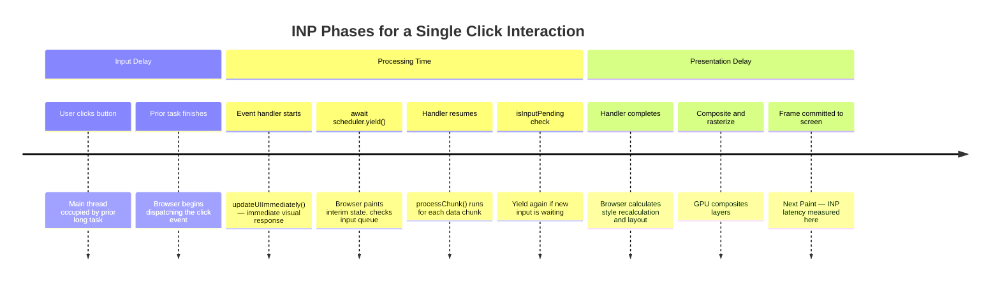

# [FEE-709] INP Deep Dive: Interaction to Next Paint

:::info
Interaction to Next Paint (INP) replaced First Input Delay (FID) as a Core Web Vital on March 12, 2024, and it changes what "fast" means. Instead of scoring only a page's first interaction, INP scores every click, tap, and key press in a session and reports the worst one. A good INP score (under 200ms) requires getting three separate phases right: input delay, processing time, and presentation delay, each with its own cause and its own fix. This article walks through diagnosing which phase is responsible for a slow interaction, the scheduling APIs that fix processing time and input delay, and the field-versus-lab measurement workflow needed to confirm a fix actually moved the metric.
:::

## Context

Interaction to Next Paint (INP) became a Core Web Vital on March 12, 2024, replacing First Input Delay (FID) as Google's responsiveness metric. FID measured only the delay before the browser began handling a page's very first interaction. INP measures every click, tap, and key press during a session and reports the worst one, which makes it a far more complete picture of how a page feels to use across an entire visit rather than at the moment it first became interactive.

An interaction's latency splits into three phases: input delay (the time between the user's action and when the browser starts running the event handler), processing time (how long the handler itself takes to run), and presentation delay (the time from when the handler finishes to when the browser paints the updated frame). INP is the sum of these three phases for the single worst interaction recorded during the session. Each phase has a different root cause and a different remedy, so treating INP as one undifferentiated number tends to produce fixes that address processing time while leaving input delay and presentation delay untouched.

Google's thresholds are: good under 200ms, needs improvement 200-500ms, and poor over 500ms. For sessions with fewer than 50 interactions, INP is simply the slowest interaction observed. For sessions with 50 or more interactions, the browser discards the single worst interaction for every 50 interactions before selecting the reported value: a session with 200 interactions drops its four worst interactions before INP is calculated. That trimming keeps one pathological interaction from dominating the score on highly interactive pages such as games or dashboards. It is a small, fixed discard rate, not a percentile cutoff, so a team should still chase down every slow interaction it can find rather than assume most of them get trimmed away. Because processing time is only one of the three phases inside the 200ms budget, keeping a handler's own execution well under 200ms leaves headroom for input delay and presentation delay to also fit inside the threshold.

Field measurement and lab measurement answer different questions. Lab tools such as Lighthouse simulate a single interaction during page load. Field data, aggregated by Google in the Chrome User Experience Report (CrUX) and collected directly by a site's own real user monitoring (RUM), captures every interaction an actual visitor triggers, on their actual device and network, throughout the session. The rest of this article treats field INP as the number that matters and lab tools as a way to reproduce and diagnose it.

## Visual



## Example

```js
// Break a long click handler into chunks to keep each synchronous run under 50ms.
// Pattern: visual response first, then yield, then time-budgeted chunked processing.
// Requires Chrome 129+ for stable scheduler.yield();
// falls back to setTimeout(0) elsewhere.

const yieldToMain = () =>
  typeof scheduler !== 'undefined' && scheduler.yield
    ? scheduler.yield()
    : new Promise((resolve) => setTimeout(resolve, 0));

const CHUNK_BUDGET_MS = 40;

button.addEventListener('click', async () => {
  // 1. Perform the immediate visual response BEFORE any heavy work so
  //    the user sees feedback as fast as possible.
  updateUIImmediately();

  // 2. Yield to let the browser paint the interim visual state and
  //    process any queued rendering work before heavy processing starts.
  await yieldToMain();

  // 3. Process data in chunks on a time budget, not only when isInputPending()
  //    reports true. A pure isInputPending() gate never yields in a chunk that
  //    happens not to overlap with new input, or in a browser where
  //    navigator.scheduling is undefined — this loop yields either way.
  let lastYield = performance.now();
  for (const chunk of largeDataChunks) {
    processChunk(chunk);

    const inputIsPending = navigator.scheduling?.isInputPending?.() ?? false;
    const elapsedSinceYield = performance.now() - lastYield;

    if (inputIsPending || elapsedSinceYield >= CHUNK_BUDGET_MS) {
      // Yield immediately when input is pending, and unconditionally once
      // the running chunk has consumed the time budget.
      await yieldToMain();
      lastYield = performance.now();
    }
  }

  // 4. Finalize the update after all chunks are processed.
  finalizeUpdate();

  // 5. Defer non-critical follow-up work until the browser is idle so it
  //    does not contribute to this interaction's presentation delay.
  requestIdleCallback(() => logAnalyticsEvent('button_clicked'), { timeout: 2000 });
});
```

## Best Practices

**MUST measure INP using real user monitoring, not only lab tools.**
Lighthouse and PageSpeed Insights measure simulated, single-interaction performance within the load window.
Field INP from CrUX or the `web-vitals` library reflects actual user sessions across all interactions, all devices, and all network conditions encountered during a real visit.
A page that scores well in Lighthouse may have poor field INP if its most frequently triggered interactions (form submissions, filter controls, navigation menus, data table interactions) involve slow event handlers that lab tests never exercise.
Collecting attribution data alongside the INP value is essential for identifying which interaction and which phase to optimize first.
Teams should set up RUM before beginning any INP optimization work, not after, so that baseline field data is available to measure the impact of each change; optimizing without a baseline makes it impossible to distinguish real improvements from noise.

**SHOULD use `await scheduler.yield()` to break up event handlers that perform more than approximately 50ms of synchronous work.**
The 50ms threshold comes from the Long Task definition: any main-thread task longer than 50ms blocks the browser from responding to input for a perceptible duration.
Handlers that iterate large data sets, compute complex derived state, run multiple synchronous DOM updates, or orchestrate cross-component state changes should yield between logical processing units to keep each chunk under 50ms.
Where `scheduler.yield()` is unavailable, a `Promise`-wrapped `setTimeout(0)` provides a cross-browser fallback.
The handler pattern is: perform the immediate visual response, yield, process data in time-budgeted chunks (yielding sooner when `isInputPending()` reports true), then finalize the update.
When applying this pattern in a framework component, be careful not to yield inside a synchronous lifecycle method or a render function, since the yield would cause the function to return a promise where the framework expects a synchronous value; the yield pattern should be applied at the event handler boundary, outside the framework's rendering cycle.

**SHOULD defer non-critical work triggered by user interactions to `requestIdleCallback` or a `setTimeout(0)` after the visual update is committed.**
Analytics logging, state persistence to `localStorage`, cache invalidation, and background synchronization do not need to block the frame that immediately follows the user's action.
Scheduling them after the frame update eliminates their contribution to processing time and presentation delay, which reduces INP without changing the outcome of the interaction from the user's perspective.
Use `scheduler.postTask('background', fn)` where available for more precise priority control and cancellability over `requestIdleCallback`.
When deferring work this way, always account for the possibility that the user may navigate away before the deferred work runs; use the `pagehide` event or the Page Visibility API to flush any buffered deferred work before the page is hidden, so that analytics data and state persistence are not lost when the user leaves quickly after an interaction.

**SHOULD establish INP budgets per interaction type and enforce them in performance regression testing.**
Different interactions warrant different acceptable-latency targets, since user tolerance for a slow response depends on what the interaction is doing.
As a hypothetical illustration, not a measured or sourced figure: a team might decide that a navigation-triggering button feels unacceptably slow past roughly 300ms, while tolerating a longer wait on a complex filter operation the user can see is processing.
Set the actual numbers from a team's own user research or A/B testing rather than copying figures from an article; the point is to have an explicit, per-interaction-type budget at all, not to adopt someone else's thresholds.
Defining explicit budgets and testing against them in a CI environment, using tools such as Puppeteer with CPU throttling and the `web-vitals` library's `onINP` callback, catches regressions before they reach production.
Budget failures in CI should be treated as blocking errors for performance-critical interactions, not advisory warnings, so that the field INP baseline established by the team does not erode incrementally over time as new features are added.

**SHOULD use web workers to offload CPU-bound work that cannot be chunked effectively on the main thread.**
Some computations, such as complex data transformations, file parsing, or cryptographic operations, cannot easily be broken into sub-50ms chunks because each unit of work is inherently expensive and produces no meaningful intermediate result.
For these cases, moving the computation to a dedicated web worker eliminates its contribution to INP entirely, since workers run on a separate OS thread and do not block the main thread from processing input events.
The main thread should show a loading indicator before posting the task to the worker and update the UI when the worker returns a result via `postMessage`, keeping the interaction's visual response fast even when the underlying computation takes hundreds of milliseconds.
Use `Transferable` objects such as `ArrayBuffer` to pass large data between threads without serialization overhead wherever the data structure permits it.

## Design Thinking

### The three INP phases and their root causes

Optimizing the wrong phase leaves the other two untouched: a team that shaves 200ms off an event handler's own execution will not move INP at all if the interaction's actual bottleneck is presentation delay caused by a large layout recalculation after the handler returns. Identifying which of the three phases dominates a given interaction's latency comes before choosing an optimization.

Input delay is the gap between when the user acts and when the browser begins running event handlers.
It is caused by a long task already running on the main thread at the moment of the interaction: script evaluation, a large `setTimeout` callback, or a previous handler that has not yet finished.
Reducing input delay means reducing main-thread occupancy at interaction time: break up long initialization tasks, avoid heavy script evaluation during periods when users are likely to interact, defer non-urgent background work, and avoid scheduling CPU-intensive work in `requestAnimationFrame` callbacks that will run at exactly the wrong moment.
A practical heuristic is to profile the main thread during the first five seconds after the page becomes interactive, identify any task that runs for more than 50ms during that window, and break it up so the thread is available when the user first engages.
Pages that lazy-load JavaScript modules in response to user scroll events are particularly prone to input delay spikes when the user scrolls and then immediately clicks before the module finishes evaluating.
As a rough working heuristic, not a measured or universal threshold, keeping each lazily loaded module under roughly 30-40KB of parsed JavaScript helps bound the worst-case input delay that evaluating the module can cause; validate the actual number against a module's own parse-and-evaluate time on a throttled mid-range device rather than treating it as fixed.

Processing time is the duration of the event handlers themselves.
This is the phase most visible to developers because it appears as a JavaScript call stack in the DevTools Performance panel.
Long processing time is caused by handlers that iterate large collections, run synchronous DOM queries, trigger forced style recalculation and layout (layout thrash), or orchestrate complex state updates across many components.
The remedy is to identify the expensive work, split it into smaller chunks separated by `await scheduler.yield()` calls, and keep each chunk under 50ms. Defer truly non-critical work until after the visual update is committed to the browser: analytics logging, state persistence, background synchronization.
React applications are frequently affected by this phase when a single interaction triggers a large synchronous re-render tree; using `useDeferredValue` or `startTransition` can move non-urgent state updates out of the critical rendering path so the immediate visual feedback is painted first and the expensive diffing work follows in a lower-priority task.
The relationship between event handler complexity and INP is direct: every millisecond added to a handler's synchronous execution budget is a millisecond added to the INP score for every user who triggers that interaction.

Presentation delay is the time from when the last event handler completes to when the browser has painted the updated frame on screen.
This phase grows when handlers make many small DOM mutations that force multiple style recalculation and layout passes, when large CSS animations or transitions are triggered in response to the interaction, or when compositing is required for newly visible elements that lack their own compositing layer.
Reducing presentation delay means batching DOM reads and writes so the browser computes layout once per frame, avoiding the interleaving of layout-triggering reads (such as `offsetHeight`, `getBoundingClientRect`, or `scrollTop`) with DOM writes, and keeping paint areas small by using CSS properties that promote elements to their own compositor layers (`will-change`, `transform`, `opacity`) for animations that are known to be expensive.
The CSS `content-visibility: auto` property, paired with `contain-intrinsic-size` to reserve space for the skipped content, is a complementary lever: it lets the browser skip layout and paint work for off-screen sections entirely, which shrinks the amount of rendering work a nearby interaction can trigger.
Presentation delay is the phase most often overlooked during optimization because it occurs after the handler returns and is therefore not visible in the handler's own call stack. Developers who profile only the JavaScript portion of the interaction will miss it entirely.
The Long Animation Frames (LoAF) API is particularly useful for diagnosing presentation delay because its per-frame breakdown includes the rendering work that follows handler execution, not just the script work inside it.
Keeping the DOM shallow and the CSS selector specificity low also reduces the cost of style recalculation, which is a significant contributor to presentation delay on component-heavy pages.

Diagnosing which phase is responsible requires deliberately isolating each one during profiling. The DevTools Performance panel's long-task highlighting makes input delay visible as main-thread occupancy before the interaction event fires. Processing time appears as the handler's own synchronous call stack. Presentation delay is the rendering work in the frame that follows, visible in the timeline as style recalculation, layout, and paint entries occurring after the handler returns. A common mistake is to see a large total INP and immediately investigate the event handler's processing time, only to discover that the handler itself is fast and the bottleneck is presentation delay driven by a large, complex layout that the handler's DOM mutations triggered.

Field validation is equally important when verifying that an INP optimization had the intended effect. Because INP represents the worst interaction over a session, a fix that reduces the worst-case handler from 400ms to 80ms will only become visible in CrUX data after the deployment has collected enough sessions to shift the 75th-percentile measurement. The time constant for CrUX data to reflect a performance change is typically 28 days, since CrUX aggregates over a rolling 28-day window. This means that a fix deployed on day one may not be fully reflected in CrUX until day 29. Teams that evaluate INP improvements over a shorter window may conclude that a fix had no effect when it simply has not yet propagated through the statistical sample. Running A/B experiments using a RUM tool that reports per-session INP directly provides faster feedback than waiting for CrUX to update, and is the appropriate mechanism for evaluating high-priority INP fixes before the full CrUX window closes.

Identifying which specific interaction drives the worst INP on a page requires attribution data beyond the raw score. Importing `onINP` from the separate `web-vitals/attribution` build, rather than the base `web-vitals` package, adds a `metric.attribution` object to each report: `interactionTarget` (a CSS selector for the element that received the interaction), `interactionType` (`pointer` or `keyboard`), and the phase breakdown, `inputDelay`, `processingDuration`, and `presentationDelay`, for the interaction that produced the reported INP score. Logging this attribution data to a RUM backend segments the INP problem by interaction type and element, making it possible to prioritize optimization work by the interaction that most frequently drives the worst score, and fix interactions in that order of impact.

Device class segmentation adds another dimension that aggregate INP scores obscure.
A page that scores well on desktop and mid-range Android devices may score poorly for users on entry-level devices with constrained JavaScript execution capacity.
CrUX allows segmenting INP by form factor (phone, tablet, desktop) and by effective connection type.
Reviewing these breakdowns before concluding that a page's INP is acceptable prevents shipping experiences that are technically "good" on desktop but consistently "poor" on the lower half of the Android device distribution, which often makes up the majority of a global product's user base.
The INP threshold boundaries (good: under 200ms, needs improvement: 200-500ms, poor: over 500ms) were calibrated against a broad device distribution and should be treated as starting points rather than absolute pass/fail criteria for all products.
Products that primarily serve low-powered devices should set internal targets at the low end of the "good" range to ensure acceptable performance across their specific user population.

### scheduler.yield() and the Scheduler API

`await scheduler.yield()` is the primary tool for breaking up long event handlers without abandoning the handler's execution context or losing user-activation state. It shipped to stable in Chrome/Edge 129 (September 2024) and Firefox 142 (August 2025); Safari does not yet support it, so a `setTimeout(0)` fallback is still needed for Safari and older browsers.
When the browser executes `await scheduler.yield()`, it suspends the handler, places it back in the task queue at a high priority, and allows any pending rendering work, input events, or higher-priority tasks to run before resuming the handler.
This is superior to `setTimeout(0)` in several respects: `scheduler.yield()` preserves the user-activation state required for certain browser APIs such as `window.open` and `navigator.clipboard.write`, it is scheduled at a higher priority than `setTimeout` callbacks so the handler resumes faster, and it integrates with the browser's built-in task scheduling model rather than bypassing it with a coarse timer.
The practical consequence of this priority advantage is that a yielded handler typically resumes within one or two frames rather than after the full `setTimeout` minimum delay, which means the total elapsed time for a chunked operation is materially shorter when using `scheduler.yield()` than when using `setTimeout(0)` as a yield point.
Teams migrating from `setTimeout`-based chunking should measure the before and after INP in the field, since the priority difference often produces a measurable improvement even when the total amount of work processed per chunk remains unchanged.

The Scheduler API (`scheduler.postTask`) extends this by allowing work to be posted with an explicit priority: `'user-blocking'` for work that should run before any other task, `'user-visible'` (the default) for work that should run in the next frame, and `'background'` for work that should only run when the main thread is idle.
Teams can use `scheduler.postTask('background', callback)` as a higher-fidelity alternative to `requestIdleCallback` for deferring analytics and logging to idle time, with the added benefit of task cancellation via an `AbortSignal`.
The API is available in Chrome 94+ and has limited support in other browsers; use a capability check and a `setTimeout` fallback when targeting broader audiences.
An important design consideration when adopting `scheduler.postTask` is that `'user-blocking'` tasks run synchronously before the next paint, so posting too much work at that priority defeats the purpose of the API and can worsen INP rather than improve it; reserve `'user-blocking'` strictly for work whose result must be visible in the very next frame, and default to `'user-visible'` or `'background'` for everything else.

### isInputPending

`navigator.scheduling.isInputPending()` lets a long processing loop check whether new user input has arrived before deciding whether to yield immediately.
If it returns `true`, the loop should yield right away via `scheduler.yield()` so the browser can process the pending input without waiting for the current chunk to finish.
Chrome's own documentation for this API now carries a note that conditional yielding based on `isInputPending()` alone is no longer the recommended primary strategy: a chunk that never happens to overlap with new input can still run past the 50ms long-task boundary undetected, because the check only reports input that has already arrived.
The current guidance is to yield on a time budget regardless of pending input, and use `isInputPending()` as an optimization that yields sooner when input is already waiting.

The API also has limited cross-browser support as of 2026 and must always be guarded by a capability check: `navigator.scheduling?.isInputPending?.()`.
Calling it without a guard throws a TypeError in browsers that do not implement it.
Whether or not the API is available, the safer default is to track elapsed time with `performance.now()` and yield whenever the time since the last yield approaches the ~50ms long-task threshold, for example at a 40ms budget to leave a small safety margin, and to yield immediately on top of that whenever `isInputPending()` reports `true`.
This time-budgeted approach yields even in sessions where no input happens to arrive mid-chunk, closing the gap that pure conditional yielding leaves open, and it degrades gracefully to `setTimeout(0)`-based yielding in browsers without either API.

### Profiling INP in Chrome DevTools

The Chrome DevTools Performance panel is the primary tool for diagnosing slow interactions.
Recording a performance profile while performing the target interaction captures the full timeline of activity.
The Interactions track at the top of the timeline shows each recorded interaction with its total duration, color-coded by severity; clicking an interaction highlights the corresponding activity on the Main thread track.
Long Tasks are highlighted with a red triangle in the corner of the Main thread track.
Reading the call stack under a Long Task reveals which function is responsible for the delay and how long each function takes.
When profiling a suspected slow interaction, it is important to use a throttled CPU setting (4x or 6x slowdown) to simulate the experience of users on mid-range Android devices, where INP problems are most severe; fast developer machines can mask issues that are highly visible in the field.
The DevTools Timeline also shows the presentation delay phase explicitly as the gap between the end of the last script task and the "Commit" marker that indicates the browser has committed the frame to the screen.

The Long Animation Frames (LoAF) API records any frame that takes longer than 50ms to render, including a detailed breakdown of the scripts that contributed to it: function name, source URL, and duration. It is observed with the standard `PerformanceObserver` interface rather than a dedicated class: `new PerformanceObserver(callback).observe({ entryTypes: ['long-animation-frame'] })`. Each entry passed to the callback is a `PerformanceLongAnimationFrameTiming` object.
This makes it easier to identify the specific handler or callback that caused the delay without needing to manually search the performance profile.
The observer can be set up in production via a RUM collection script to capture LoAF data from real user sessions, not just from developer profiling sessions.
LoAF entries include a `renderStart` timestamp, which marks the boundary between the processing time and presentation delay phases for any frame that involves both script execution and rendering work; teams can compute presentation delay from field LoAF data by subtracting `renderStart` from the entry's `startTime` plus `duration`, giving them a per-frame breakdown of rendering costs without requiring a full DevTools profile.
When LoAF's per-script attribution comes back with empty script names for cross-origin scripts, the cause is usually missing CORS headers: the Long Animation Frames API redacts source details for opaque cross-origin resources, and adding a `crossorigin` attribute to the script tag together with an `Access-Control-Allow-Origin` response header restores them.

The `web-vitals` library's `onINP` callback, imported from the `web-vitals/attribution` build, provides field-collected attribution data that is invaluable for production diagnosis.
It reports the interaction's target element selector, event type, and the breakdown of input delay, processing time, and presentation delay for the worst interaction in the session.
This attribution tells developers which element the user clicked (or tapped or typed in), what kind of event it was, and which phase of the interaction was slowest, all without requiring the developer to reproduce the exact interaction in a profiling session.
Pairing `onINP` attribution data from field RUM with targeted lab profiling in DevTools using that specific interaction gives the most efficient path to a fix.
Attribution data also enables cross-segment analysis: teams can group INP reports by device memory, connection type, or geography to understand whether the problem is universal or concentrated in a specific user segment, which determines whether the fix should be a general optimization or a targeted adaptation for low-end devices.

### INP vs. TBT (Total Blocking Time)

Total Blocking Time (TBT) is a Lighthouse lab metric that measures the total time the main thread was blocked by tasks longer than 50ms during the load phase, specifically the window from First Contentful Paint to Time to Interactive.
TBT is a useful proxy for INP in lab environments because both metrics are sensitive to long main-thread tasks: reducing long tasks during the load phase tends to reduce both TBT and INP.
This correlation is why teams working on Lighthouse scores often see real-world INP improvements as a side effect.
The practical value of TBT as an INP proxy is highest during the initial optimization phase of a project, when a page has a high concentration of long tasks during load that overlap with early user interactions; addressing those tasks typically moves both metrics simultaneously.
Once the low-hanging load-phase tasks are resolved, TBT and INP diverge as optimization targets, and teams must shift to field INP data to make further progress.

However, TBT and INP are not the same measurement, and a good TBT score does not guarantee a good INP.
TBT can be excellent while INP is poor when expensive interactions occur well after the initial load window that TBT measures.
A page that finishes loading quickly and scores well in Lighthouse can still have poor INP if user interactions trigger long event handlers, if client-side routing causes heavy script evaluation when the user navigates to a new route, if a virtual list or data grid processes large data sets when the user filters or sorts, or if background timers accumulate main-thread work after the load phase.
The measurement window of TBT (load phase only) excludes this entire category of interaction-time performance problems.
Field INP from CrUX or RUM is the only metric that captures these post-load interaction costs.
The divergence between TBT and INP is especially pronounced on pages that use service worker caching for fast loads: the load phase is short and TBT is excellent, but the cached JavaScript bundle runs complex client-side logic when the user navigates, producing high INP scores that are invisible to any load-phase metric.

### INP attribution and field debugging workflow

The most efficient workflow for fixing poor field INP is: collect attribution data in RUM, identify the most impactful interaction by element and event type, reproduce that interaction in a DevTools profiling session, identify the dominant INP phase, and apply the appropriate optimization.
Without attribution data, developers tend to guess which interaction is slow and optimize the wrong one.
The `web-vitals` library's `onINP` with the `reportAllChanges: true` option reports each new worst interaction as the session progresses, which helps identify not just the final worst interaction but also which interactions tend to cluster near the INP threshold.
Sending this data to an analytics endpoint allows teams to build dashboards that show INP distribution by page, by element, by event type, and by device class.
A useful refinement of this workflow is to track both the 75th-percentile INP (the value that Google uses for CrUX assessment) and the median INP across all sessions, since the difference between them reveals whether poor INP is a universal problem or one confined to a tail of users on slow devices.
Teams that focus exclusively on the 75th percentile may implement fixes that move the worst sessions into the "needs improvement" band without improving the experience for the majority of users, whereas teams that track both values make more balanced optimization decisions.
Correlating INP attribution data with session replay tools, when privacy policy permits, provides a direct way to watch the specific interactions that caused high INP and identify interaction patterns that automated profiling would not surface.

### INP and JavaScript frameworks

Modern JavaScript frameworks introduce their own considerations for INP that go beyond the general yielding and chunking patterns described above.

React's concurrent rendering model (enabled by `createRoot`) allows React to interrupt and resume rendering work in response to user input, which reduces the impact of expensive re-renders on INP compared to the legacy synchronous rendering model.
However, concurrent rendering does not eliminate the problem; a component tree that recomputes derived state synchronously inside `useMemo` or `useReducer` during a render can still produce a long task if the computation is expensive, because React cannot yield in the middle of a single component's render function.
Identifying expensive computations inside render functions and moving them outside the render path (into web workers, into server-computed data, or into incremental computation caches) is often necessary to achieve good INP in large React applications.
`startTransition` marks a state update as non-urgent so React can interrupt it if a higher-priority update, such as another user interaction, arrives while it is still rendering.

Vue 3's reactivity system batches state updates and schedules DOM patching asynchronously in a microtask, which naturally defers rendering work to the next microtask checkpoint and gives the browser a brief opportunity to process input between the state change and the DOM update.
This batching behavior reduces synchronous rendering costs compared to Vue 2's synchronous update model, but large component trees can still produce long rendering tasks when many reactive dependencies change at once.
Using `shallowRef` instead of `ref` for large data structures that the template does not need to observe deeply, and splitting large views into independently renderable component subtrees with explicit `v-memo` or `defineAsyncComponent` boundaries, are effective techniques for keeping Vue's rendering tasks within the 50ms threshold.

Qwik takes a different approach to the same input-delay problem: resumability. Instead of re-executing application code on the client to attach event listeners (the hydration work that FID and INP's input-delay phase penalize), Qwik serializes application state and listener references into the HTML during server rendering, so the client resumes execution exactly where the server left off instead of replaying that work. Because there is no hydration step competing for the main thread with the user's first interactions, a page's earliest interactions do not have to wait behind it.

Angular's move to signals and zoneless change detection targets a related problem from a different angle. Zone.js, Angular's traditional change-detection mechanism, re-checks the entire component tree on every asynchronous event regardless of what actually changed, which can turn an unrelated interaction into a large synchronous task. Signals let Angular track dependencies precisely and re-render only the components a changed value actually affects, and zoneless mode (enabled via `provideZonelessChangeDetection()`) removes the Zone.js monkey-patching layer entirely, so change detection runs only when a component is marked dirty or a signal read in a template changes.

### INP and web workers

Web workers provide an alternative to yielding for computationally intensive work: instead of breaking CPU-bound work into chunks on the main thread, the work can be offloaded entirely to a background thread that does not block the main thread at all.
This approach is most effective when the computation is embarrassingly parallel, produces a single result that the main thread can consume once the worker completes, and does not require frequent DOM access, since workers cannot touch the DOM.
Common candidates for web worker offloading include image processing, file parsing, cryptographic operations, large data sorting and filtering, and complex physics simulations.
The primary cost of using workers is the serialization overhead of transferring data between the main thread and the worker via `postMessage`; large objects must be serialized and deserialized, which itself takes time and can exceed the benefit of offloading the computation if the data set is small.
Using `Transferable` objects such as `ArrayBuffer` and `ImageBitmap` avoids serialization by transferring ownership of the buffer to the worker, which is appropriate for large binary payloads.
When a page has multiple interactions that each trigger independent computationally expensive operations, a worker pool pattern, which maintains a fixed number of idle workers and distributes tasks among them, provides lower latency than spawning a new worker per interaction, since worker initialization itself takes tens to hundreds of milliseconds.

## Common Mistakes

- **Measuring INP only in Lighthouse or PageSpeed Insights.** Lab tools simulate a single interaction at load time and cannot capture slow handlers that only occur mid-session, after client-side hydration completes, or during route transitions. Field data from CrUX or `web-vitals` is required.
- **Treating TBT as equivalent to INP.** A good TBT score means the load phase had few long tasks; it says nothing about the performance of interactions that happen after the load phase. INP and TBT can diverge significantly on SPAs with heavy route-level code execution.
- **Yielding at the top of the handler before the visual response.** Yielding should happen after the immediate visual update (`updateUIImmediately()`) so the user sees feedback as quickly as possible. Yielding first delays the visible response without reducing the amount of subsequent work.
- **Omitting the `navigator.scheduling` capability check before calling `isInputPending()`.** The API is not universally supported; calling it without an optional chaining guard (`navigator.scheduling?.isInputPending?.()`) throws a TypeError in unsupported browsers.
- **Deferring all follow-up work with `requestIdleCallback` without a `timeout` option.** `requestIdleCallback` without a timeout may not fire for several seconds on a busy page. Pass `{ timeout: 1000 }` or `{ timeout: 2000 }` for work that must run reasonably soon, or use `setTimeout(0)` for work that should run after the current frame.
- **Ignoring presentation delay as an optimization target.** Teams that optimize event handler duration but leave layout-thrashing DOM mutation patterns in place, such as interleaving `getBoundingClientRect` reads with style writes in a loop, will see only partial INP improvement, because presentation delay can exceed processing time on complex, deeply nested component trees.
- **Not collecting INP attribution data in production.** Without knowing which element, event type, and INP phase is responsible for the worst interaction, optimization efforts are guided by guesswork. The `onINP` callback from `web-vitals/attribution` provides this data with minimal overhead and should be part of every production RUM setup.
- **Applying `will-change: transform` indiscriminately to improve presentation delay.** Promoting too many elements to their own compositor layers increases GPU memory usage and can cause jank on low-memory devices. Reserve `will-change` for elements that are known to animate frequently and whose paint cost is measured to be high; adding it speculatively to every interactive element can degrade performance on the devices that need help the most.
- **Conflating INP with animation frame rate.** INP measures the latency from a discrete user action to the next painted frame, not the smoothness of continuous animations. A page can have smooth 60fps animations but poor INP if the event handlers that respond to clicks and key presses are slow. Conversely, a page can have excellent INP but janky animations if the animation logic runs in long tasks between interaction events.
- **Assuming that virtualized lists eliminate INP problems.** Virtualization reduces the number of DOM nodes rendered at any time, which helps presentation delay, but the JavaScript that runs during scroll and filter events to compute which items to render can itself be slow and contribute to processing time. Virtualization is a necessary but not sufficient optimization for interactive data-heavy views; the event handlers that drive the virtualization logic must also be profiled and chunked if they exceed 50ms.
- **Not testing on representative hardware.** INP problems are highly device-dependent; a handler that completes in 30ms on a developer laptop may take 200ms on a mid-range Android phone running the same browser. Testing exclusively on fast machines produces false confidence and leaves real users with poor experiences. Use DevTools CPU throttling, remote debugging on physical devices, or cloud device testing services to validate INP under realistic conditions before declaring an optimization complete.
- **Forgetting that pointer events fire before click events.** In some interaction patterns, `pointerdown` and `pointerup` events fire before the `click` event, and all three contribute to the same interaction's INP measurement. Expensive handlers attached to `pointerdown` can delay the visual response even when the `click` handler itself is fast; audit all event listeners on interactive elements, not just the primary `click` handler.
- **Using synchronous `localStorage` writes inside event handlers.** `localStorage.setItem` is a synchronous operation that blocks the main thread while the browser writes to disk, and on constrained mobile hardware or older browsers that write can take long enough to measurably add to an interaction's processing time. Deferring state persistence to `requestIdleCallback` or a `setTimeout(0)` after the visual update is committed removes this latency from the INP measurement.
- **Not accounting for third-party script contributions to input delay.** Analytics tags, A/B testing frameworks, chat widgets, and ad scripts frequently schedule long tasks on the main thread at intervals that coincide with user interactions. Third-party scripts are a common source of input delay that is invisible in first-party profiling; use the CrUX API or a RUM tool that captures third-party long tasks to identify which scripts are contributing and whether their loading strategy can be deferred.
- **Treating `keydown` and `keyup` events as lower priority than click events.** INP measures all discrete user interactions including keyboard events, so a slow `keydown` handler in a search input or an autocomplete component contributes to the page's INP score just as a slow click handler does. Keyboard-driven interactions are often exercised less frequently in lab testing but can be triggered continuously in rapid succession by users who type quickly, making their performance especially important to profile and optimize.

## Related Topics

- [FEE-700 Rendering & Performance Overview](./700.md)
- [FEE-704 Core Web Vitals & Performance Metrics](./704.md)
- [FEE-712 Critical Rendering Path & Paint Timing](./712.md)
- [FEE-301 Event Loop & Async Model](../JavaScript%20Language%20and%20Runtime/301.md)

## References

- Jeremy Wagner and Barry Pollard, "Interaction to Next Paint (INP)," web.dev (2022, updated 2025). https://web.dev/articles/inp
- Jeremy Wagner, Philip Walton, and Barry Pollard, "Optimize Interaction to Next Paint," web.dev (2023, updated 2025). https://web.dev/articles/optimize-inp
- Chrome for Developers, "Use scheduler.yield() to keep your page responsive," Chrome for Developers (2025). https://developer.chrome.com/blog/use-scheduler-yield
- MDN Web Docs, "PerformanceLongAnimationFrameTiming," MDN. https://developer.mozilla.org/en-US/docs/Web/API/PerformanceLongAnimationFrameTiming
- Barry Pollard and Noam Rosenthal, "Long Animation Frames API," Chrome for Developers. https://developer.chrome.com/docs/web-platform/long-animation-frames
- Jeremy Wagner, "Diagnose slow interactions in the lab," web.dev (2023, updated 2024). https://web.dev/articles/diagnose-slow-interactions-in-the-lab
- Nate Schloss and Andrew Comminos, "isInputPending() API," Chrome for Developers (2020). https://developer.chrome.com/articles/isinputpending
- Jeremy Wagner and Brendan Kenny, "Optimize long tasks," web.dev (2022, updated 2024). https://web.dev/articles/optimize-long-tasks
- MDN Web Docs, "Scheduler," MDN. https://developer.mozilla.org/en-US/docs/Web/API/Scheduler
- Google Chrome team, "web-vitals," GitHub. https://github.com/GoogleChrome/web-vitals#onINP
- Chrome for Developers, "CrUX Dashboard," Chrome for Developers (2022, updated 2025). https://developer.chrome.com/docs/crux/dashboard
- React, "startTransition," react.dev. https://react.dev/reference/react/startTransition
- MDN Web Docs, "Web Workers API," MDN (2025). https://developer.mozilla.org/en-US/docs/Web/API/Web_Workers_API
- Surma, "Use web workers to run JavaScript off the browser's main thread," web.dev (2019). https://web.dev/articles/off-main-thread
- W3C Web Performance Working Group, "Event Timing API," W3C Working Draft (2026). https://www.w3.org/TR/event-timing/
- web.dev, "content-visibility: the new CSS property that boosts your rendering performance," web.dev. https://web.dev/articles/content-visibility
- Qwik, "Resumable," Qwik Documentation. https://qwik.dev/docs/concepts/resumable/
- Angular, "Zoneless," angular.dev. https://angular.dev/guide/zoneless
- Matt Zeunert, "How To Fix Missing INP Attribution Data With The LoAF API," DebugBear (2024, updated 2025). https://www.debugbear.com/blog/inp-attribution-data-missing
