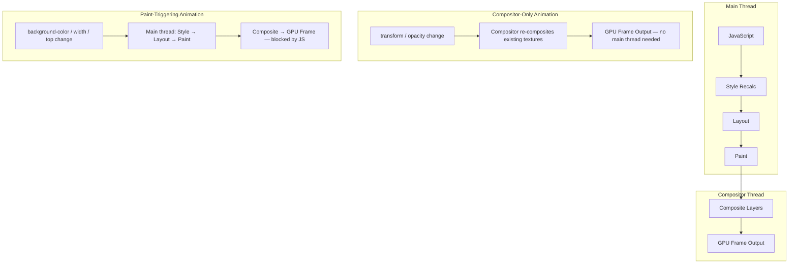

# GPU-Accelerated Animations & `will-change`

The browser's rendering pipeline splits between two execution contexts:
the main thread and the compositor thread.
The main thread is responsible for JavaScript execution, style recalculation,
layout, and paint — the four most expensive stages of producing a frame.
The compositor thread is responsible for assembling individually painted layers
into the final pixel output delivered to the display hardware.
Animations that affect properties the compositor can handle independently —
specifically `transform` and `opacity` — run entirely on the compositor thread
and are not blocked by main-thread JavaScript.
Animations that affect properties requiring layout or paint — `width`, `height`,
`top`, `left`, `background-color` — must run on the main thread and are
susceptible to jank whenever the main thread is occupied with JavaScript,
style recalculation, or long tasks.
Understanding this split is the prerequisite for every GPU animation decision,
because the thread an animation runs on determines whether it can drop frames
when the main thread is under load.

`will-change` is a CSS property that tells the browser to prepare for an
animation or transition before it starts, by promoting the element to its own
compositor layer ahead of time.
This pre-promotion avoids the visual "pop" that occurs when an element is
promoted mid-animation — a brief but perceptible artifact caused by the browser
moving pixel data from one layer to another at the moment compositing requirements
change.
`will-change: transform` signals that the element's transform will change;
`will-change: opacity` signals the same for opacity.
These are the two values with reliable cross-browser compositor-layer guarantees;
other values such as `will-change: scroll-position` or `will-change: contents`
have less uniform behavior across rendering engines and should be tested carefully
before relying on them in production animations.

The tradeoff is direct: each promoted layer requires GPU memory for its texture.
A 400×400 CSS pixel card on a 2x device pixel ratio display allocates an 800×800
pixel RGBA texture, consuming roughly 2.5 MB of GPU memory for that single element.
Promoting many elements simultaneously — via `will-change: transform` on every
card in a long list — can exhaust GPU memory on mobile devices, causing the browser
to evict other textures, producing rendering artifacts, or in extreme cases
triggering a browser crash.
The performance degradation from over-promotion can exceed the jank that
`will-change` was intended to prevent, making conservative and dynamic application
of the property essential practice rather than an optional optimization guideline.
GPU memory budgets on mobile are finite and shared across all open browser tabs;
a single page that promotes dozens of large elements may degrade rendering quality
across other pages visible to the user simultaneously.

## Principle

Engineers SHOULD animate only `transform` and `opacity` properties in CSS
animations and transitions.
These are the only two properties that the browser compositor can animate on
the GPU without involving the main thread or triggering paint.
Animating `width`, `top`, `background-color`, or `box-shadow` triggers layout
and paint on every animation frame, executing on the main thread and subject to
being blocked by JavaScript.
At 60 frames per second, each frame has a budget of 16.7ms; layout and paint
on every frame can consume the majority of that budget on any non-trivial page,
leaving insufficient time for JavaScript to run without causing dropped frames.
A smooth 60fps animation is achievable on `transform` and `opacity` even when
the main thread is under sustained load, because the compositor thread operates
independently of main-thread scheduling.

Engineers MUST NOT apply `will-change` to elements that are not currently
animated or immediately about to be animated.
`will-change` promotes elements to compositor layers as soon as the property is
set, consuming GPU memory for the entire duration the property remains on the
element.
Adding `will-change: transform` to all list cards as a static CSS rule creates
one promoted layer per card, multiplying GPU texture memory by the number of DOM
elements regardless of how many are actually animating at any given moment.
Apply `will-change` in a `:hover` state or via JavaScript triggered immediately
before animation begins, and remove it by setting `will-change: auto` when the
animation ends and the compositor layer is no longer required.

## Design Thinking

### The compositor thread model

The browser's rendering pipeline for a single frame follows a strict sequence
on the main thread: JavaScript execution, style recalculation, layout, paint,
and finally compositing.
Compositing — the step where individually painted layer bitmaps are assembled
into the final frame — is the only stage that can be offloaded to the compositor
thread entirely.
When an animation changes only `transform` or `opacity`, the compositor thread
can produce new frames by reading the current transform matrix or opacity value
and re-compositing the existing layer textures, without re-executing JavaScript,
recalculating styles, running layout, or repainting pixels.
This means that even if the main thread is executing a 50ms JavaScript task —
a parsing operation, a complex state update, or a third-party analytics flush —
a compositor-thread animation continues producing frames at 60fps without
interruption, delivering smooth visual feedback to the user independent of
main-thread load.

Properties that trigger layout — `width`, `height`, `margin`, `top`, `left`,
`padding` — force the entire pipeline to run from the layout stage forward on
every frame the animation produces.
Properties that trigger paint — `background-color`, `border-radius`,
`box-shadow`, `color` — force re-execution from the paint stage on every frame.
Both categories execute on the main thread and compete for the same 16.7ms time
budget as JavaScript, event handlers, and timer callbacks.
Choosing `transform: translateX()` instead of `left`, or `transform: scale()`
instead of `width`, is the most reliable architectural decision for smooth
animation because it eliminates the pipeline stages most likely to miss the
frame deadline and produce jank visible to the user.

### Stacking contexts and layer promotion

Several CSS properties create stacking contexts: `transform` (with any non-none
value), `opacity` less than 1, `will-change`, `filter`, `isolation: isolate`,
and `position: fixed`, among others.
Stacking context and compositor layer are distinct concepts that are frequently
conflated in performance discussions and documentation.
A stacking context changes the rendering order of overlapping elements within
the paint stage but does not necessarily allocate a GPU texture or create a
separate compositor layer.
A compositor layer explicitly allocates a GPU texture and is what enables the
compositor thread to animate the element without involving the main thread.
`will-change` is the most direct and intentional way to request a compositor
layer; other properties may result in layer promotion as a side effect of the
rendering engine's internal heuristics, but only `will-change` makes the
promotion explicit, predictable, and consistent across browser versions.

Layer promotion has a memory cost proportional to the element's rendered size
and device pixel ratio.
On a high-density display, a full-width hero image promoted to its own layer
can consume tens of megabytes of GPU memory by itself.
Teams building animation-heavy interfaces — carousels, parallax effects,
gesture-driven transitions — should account for total promoted layer memory
as a design constraint established at the architecture stage, not as an
afterthought discovered during production incident investigation.
Browsers on mobile platforms often have GPU memory limits in the range of
256MB to 512MB shared across all open tabs; a single page that promotes dozens
of large elements can consume a significant fraction of that budget and degrade
overall browser performance.

### Detecting layer promotion

Chrome DevTools provides two panels directly relevant to compositor layer
analysis.
The Layers panel, available via More Tools in the DevTools menu, renders a 3D
view of all compositor layers on the current page, showing each layer's
dimensions, memory consumption, and the reason it was promoted.
Inspecting the promotion reason distinguishes intentional `will-change`
promotions from incidental ones caused by `position: fixed`, overlapping
transformed elements, or filter effects — each of which has different
remediation strategies.
The Performance panel's flame chart separates compositor frames from main-thread
frames, making it possible to verify that a given animation is executing on the
compositor thread rather than forcing main-thread paint on every frame.

A standard verification workflow is to record a Performance panel trace while
the animation runs at the frame rate it is designed for, then inspect whether
paint records appear within compositor thread frames.
If paint records are present, the animation is triggering paint on every frame
and is not GPU-accelerated in the intended sense, regardless of what the CSS
suggests.
Teams should run this verification before shipping any animation expected to
run at 60fps or higher, because the rendering path is not always what the CSS
implies.
A `transform` animation on an SVG element, for example, may fall back to
software rasterization in some browser versions, behaving differently at the
compositing layer than the same animation applied to an HTML element despite
the identical CSS syntax.

### CSS containment interaction

`contain: paint` establishes a new stacking context and a new block formatting
context, preventing the element's descendants from rendering outside the
element's bounds.
This containment boundary can cause the browser to promote the element to a
compositor layer as a side effect of the paint containment guarantee, overlapping
with the explicit layer promotion requested by `will-change`.
When both properties are applied to the same element, the browser may create
nested layers, increasing total texture memory beyond what either property would
require individually.
Engineers integrating `will-change` with layout-heavy components that already
use CSS containment should verify total layer counts in the DevTools Layers
panel rather than assuming the effects compose in a predictable or additive way.
CSS Containment is covered in depth in FEE-209, which addresses similar
performance concerns approaching from the layout isolation direction rather
than the compositing direction.

## Best Practices

**SHOULD animate `transform` and `opacity` exclusively for CSS animations
intended to run at 60fps or higher.**
Every other CSS property that changes between animation frames requires the
browser to execute style recalculation, layout, or paint stages on each frame.
At 60fps, each frame must complete in under 16.7ms; layout and paint on every
frame consume the majority of this budget on any page with non-trivial DOM
structure.
`transform` and `opacity` bypass both stages entirely, leaving the full
compositing budget available and allowing the animation to be handled on the
compositor thread independently of main-thread load.
When a design calls for animating a property that triggers layout, such as
expanding a card's height, consider using `transform: scaleY()` or
`transform: translateY()` to achieve a visually equivalent effect without
involving the layout engine on each frame.

**MUST NOT apply `will-change` statically to repeated elements such as list
items, cards, or grid cells.**
Static `will-change` on list or grid children creates one compositor layer per
element, multiplying GPU texture memory by the number of elements in the DOM,
active or not.
On mobile devices with limited GPU memory, this exhausts the available texture
budget, causing the browser to evict other textures and producing rendering
artifacts or browser instability.
The correct pattern is dynamic application: add `will-change` to the specific
element that is about to animate via JavaScript on `mouseenter` or immediately
before a triggered transition, and remove it by setting `will-change: auto`
after the animation completes via a `transitionend` event listener.
This approach keeps promoted layer count proportional to the number of elements
actively animating rather than the total number of elements in the list or grid.

**SHOULD profile compositor layer usage with Chrome DevTools Layers panel before
shipping any animation that uses `will-change`.**
The panel displays the memory consumption of each layer and highlights excessive
or unintended layer creation that would not be visible in code review.
A CSS rule change that promotes 5 elements where previously none were promoted
is immediately visible in the Layers panel memory summary and in the layer list;
invisible in a diff review of the CSS file.
Teams that ship `will-change` without verifying layer counts in DevTools
routinely discover GPU memory regressions only after user reports of rendering
artifacts on mid-range or older mobile devices, where the GPU memory threshold
that causes visible degradation is much lower than on the developer's own
machine.

## Visual



## Example

```js
// Correct will-change usage: applied dynamically on hover, removed after transition
const cards = document.querySelectorAll('.card');
cards.forEach(card => {
  card.addEventListener('mouseenter', () => {
    card.style.willChange = 'transform';
  });

  card.addEventListener('mouseleave', () => {
    card.addEventListener('transitionend', () => {
      card.style.willChange = 'auto';
    }, { once: true });
  });
});
```

## Common Mistakes

- Applying `will-change: transform` as a global rule on all interactive elements "just in case" — this promotes every matching element to a compositor layer on page load, regardless of whether that element ever actually animates during the user's visit.
- Using `will-change` on elements that animate infrequently, such as once per page visit on a modal, where the persistent memory overhead of maintaining the compositor layer between uses exceeds the benefit of avoiding the mid-animation promotion artifact.
- Animating `left` and `top` for positional movement instead of `transform: translate()`, which forces layout execution on every frame and runs entirely on the main thread, competing with JavaScript for frame budget.
- Assuming that any CSS animation is automatically GPU-accelerated — only `transform` and `opacity` receive compositor-thread handling in all major browsers; `filter` animations are partially accelerated in some engines but not consistently across all of them.
- Neglecting to verify layer promotion with the DevTools Layers panel before shipping, leading to production GPU memory regressions that only manifest on devices with constrained memory.
- Setting `will-change` inside a `@keyframes` rule or inside the animation's own transition CSS — the property must be set before the animation begins; applied during the animation itself, it arrives too late to achieve pre-promotion.

## Related FEEs

- FEE-700 — Rendering & Performance Overview
- FEE-209 — CSS Containment & `contain`
- FEE-412 — `requestAnimationFrame` & Animation Timing
- FEE-712 — Critical Rendering Path & Paint Timing

## References

- MDN: will-change — https://developer.mozilla.org/en-US/docs/Web/CSS/will-change
- web.dev: Rendering performance — https://web.dev/articles/rendering-performance
- web.dev: Stick to compositor-only properties — https://web.dev/articles/stick-to-compositor-only-properties-and-manage-layer-count
