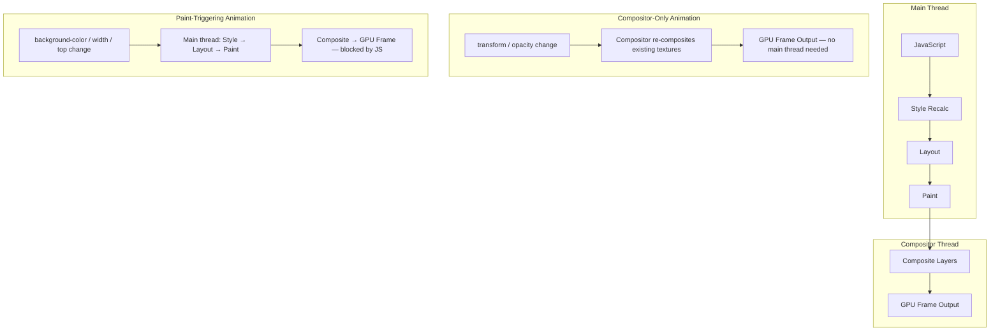

# [FEE-710] GPU-Accelerated Animations & `will-change`

:::info
Browsers split each frame's production across two threads. The main thread runs JavaScript, style recalculation, layout, and paint; the compositor thread assembles already-painted layers into the pixels the display shows. Animations that change only `transform` or `opacity` can run entirely on the compositor thread, immune to whatever the main thread is doing at the time. `will-change` lets a page promote an element to its own compositor layer before an animation starts, trading GPU texture memory for the removal of a visible "pop" at promotion time. You SHOULD animate `transform` and `opacity` for anything that needs to hit 60fps, and you MUST NOT apply `will-change` as a static rule across every item in a list or grid.
:::

## Context

The main thread is responsible for JavaScript execution, style recalculation, layout, and paint. These four stages are the most expensive part of producing a frame. The compositor thread is responsible for assembling individually painted layers into the final pixel output delivered to the display hardware. Animations that change only `transform` or `opacity` run entirely on the compositor thread: the browser re-composites existing layer textures by reading the current transform matrix or opacity value, without going back through style recalculation, layout, or paint, so a busy main thread does not block them. In most engines, animations that change `width`, `height`, `top`, `left`, or `background-color` run on the main thread instead, competing with JavaScript, style recalculation, and any other long task for the same frame budget.

`transform` and `opacity` remain the only pair with reliable, consistent compositor support across every major engine. Current Chromium also composites `filter`, `clip-path`, and `background-color`, but that support is Chromium-specific and not yet consistent across Safari and Firefox. Driving any of these properties through a CSS custom property removes the benefit: changing a custom property always triggers paint on the elements that reference it, even when the referenced property is `opacity`.

`will-change` is a CSS property that tells the browser to prepare for an animation or transition before it starts, by promoting the element to its own compositor layer ahead of time. This pre-promotion avoids the visual "pop" that occurs when an element is promoted mid-animation: a brief but perceptible artifact caused by the browser moving pixel data from one layer to another at the moment compositing requirements change. `will-change: transform` signals that the element's transform will change; `will-change: opacity` signals the same for opacity. These are the two values with reliable cross-browser compositor-layer guarantees. Other values such as `will-change: scroll-position` or `will-change: contents` have less uniform behavior across rendering engines and should be tested carefully before relying on them in production animations.

The tradeoff is direct: each promoted layer requires GPU memory for its texture. The formula is width × height × DPR² × 4 bytes, where width and height are the element's CSS pixel dimensions and DPR is the device pixel ratio. A 400×400 CSS pixel card on a 2x device pixel ratio display renders an 800×800 pixel texture: 400 × 400 × 2² × 4 bytes = 2,560,000 bytes, roughly 2.56 MB. Promoting many elements at once, for example applying `will-change: transform` to every card in a long list, multiplies that cost by the element count. On mobile devices, where GPU memory is scarcer and shared across every open tab, this can force the browser to evict other textures, which shows up as rendering artifacts or, rarely, a crash. Apply `will-change` dynamically and remove it once the animation ends: static promotion multiplies texture memory by element count instead of by the number of elements actually animating.

## Visual



## Example

```css
.card {
  transition: transform 200ms ease-out;
}
```

```js
// Applied dynamically on hover, removed once the transition that actually
// runs finishes. The fallback timeout clears the hint even when
// transitionend never fires, for example an interrupted hover before the
// transition starts.
const cards = document.querySelectorAll('.card');

cards.forEach((card) => {
  card.addEventListener('mouseenter', () => {
    card.style.willChange = 'transform';
  });

  card.addEventListener('mouseleave', () => {
    const clearHint = () => {
      card.style.willChange = 'auto';
    };
    const fallback = setTimeout(clearHint, 300); // longer than the transition duration

    card.addEventListener(
      'transitionend',
      () => {
        clearTimeout(fallback);
        clearHint();
      },
      { once: true }
    );
  });
});
```

## Best Practices

**SHOULD animate `transform` and `opacity` for CSS animations intended to run at 60fps or higher.**
Every other CSS property that changes between animation frames requires the
browser to execute style recalculation, layout, or paint on each frame.
At 60fps, each frame must complete in under 16.7ms; layout and paint on every
frame consume the majority of this budget on any page with non-trivial DOM
structure.
`transform` and `opacity` bypass both stages entirely, leaving the full
compositing budget available.
Current Chromium extends the same compositor-only path to `filter`,
`clip-path`, and `background-color`, but `transform` and
`opacity` remain the only pair with reliable support across all major
engines, which is why they are the SHOULD default.
When a design calls for animating a property that triggers layout, such as
expanding a card's height, consider `transform: scaleY()` or
`transform: translateY()` to achieve a visually equivalent effect without
involving the layout engine on each frame.

**MUST NOT apply `will-change` statically to repeated elements such as list
items, cards, or grid cells.**
Static `will-change` on list or grid children creates one compositor layer per
element, multiplying GPU texture memory by the number of elements in the DOM,
active or not.
On mobile devices with limited GPU memory, this exhausts the available texture
budget, causing the browser to evict other textures and producing rendering
artifacts or browser instability.
The correct pattern is dynamic application: add `will-change` to the specific
element that is about to animate via JavaScript on `mouseenter` or immediately
before a triggered transition, and remove it by setting `will-change: auto`
after the animation completes via a `transitionend` event listener.
This approach keeps promoted layer count proportional to the number of elements
actively animating rather than the total number of elements in the list or grid.

**SHOULD profile compositor layer usage with Chrome DevTools Layers panel before
shipping any animation that uses `will-change`.**
The panel displays the memory consumption of each layer and highlights excessive
or unintended layer creation that would not be visible in code review.
A CSS rule change that promotes 5 elements where previously none were promoted
is immediately visible in the Layers panel memory summary and in the layer list;
invisible in a diff review of the CSS file.
Teams that ship `will-change` without verifying layer counts in DevTools
routinely discover GPU memory regressions only after user reports of rendering
artifacts on mid-range or older mobile devices, where the GPU memory threshold
that causes visible degradation is much lower than on the developer's own
machine.

## Design Thinking

### The compositor thread model

The browser's rendering pipeline for a single frame follows a strict sequence
on the main thread: JavaScript execution, style recalculation, layout, paint,
and finally compositing.
Compositing is the step where individually painted layer bitmaps are assembled
into the final frame, and it is the only stage that can be offloaded to the
compositor thread entirely.
When an animation changes only `transform` or `opacity`, the compositor thread
can produce new frames by reading the current transform matrix or opacity value
and re-compositing the existing layer textures, without re-executing JavaScript,
recalculating styles, running layout, or repainting pixels.
A compositor-thread animation keeps producing frames at 60fps even while the
main thread is busy, for example running a 50ms task to parse a large JSON
response.

Properties that trigger layout, such as `width`, `height`, `margin`, `top`,
and `left`, force the entire pipeline to run from the layout stage forward on
every frame the animation produces.
Properties that trigger paint, such as `background-color`, `border-radius`,
`box-shadow`, and `color`, force re-execution from the paint stage on every
frame.
Both categories execute on the main thread and compete for the same 16.7ms time
budget as JavaScript, event handlers, and timer callbacks.
Choosing `transform: translateX()` instead of `left`, or `transform: scale()`
instead of `width`, removes both stages from the animation's per-frame cost.

### Stacking contexts and layer promotion

Several CSS properties create stacking contexts: `transform` (with any non-none
value), `opacity` less than 1, `will-change`, `filter`, `isolation: isolate`,
and `position: fixed`, among others.
Stacking context and compositor layer are distinct concepts that are frequently
conflated in performance discussions and documentation.
A stacking context changes the rendering order of overlapping elements within
the paint stage but does not necessarily allocate a GPU texture or create a
separate compositor layer.
A compositor layer explicitly allocates a GPU texture and is what enables the
compositor thread to animate the element without involving the main thread.
`will-change` is the most direct and intentional way to request a compositor
layer; other properties may result in layer promotion as a side effect of the
rendering engine's internal heuristics, but only `will-change` makes the
promotion explicit, predictable, and consistent across browser versions.

The practical distinction matters when diagnosing unexpected layer
proliferation.
Discovering that a page has promoted 80 elements to compositor layers, far more
than the small set of elements that actually animate, often traces back to a
cascade of stacking-context-creating properties applied to ancestor elements
for unrelated reasons.
A common culprit is a leftover `transform: translateZ(0)` hack, applied years
earlier to work around a rendering bug that no longer exists in any current
browser, still creating a stacking context long after its original purpose
disappeared.
`position: relative` added for `z-index` control and a decorative `filter`
cause the same effect.
Each of these implicitly creates a stacking context, and in some rendering
engine versions that stacking context results in layer promotion.
Auditing the Layers panel after any significant CSS restructuring, and removing
obsolete `translateZ(0)` and `will-change` rules left over from old
workarounds, keeps layer count from accumulating silently across feature
branches.
A useful heuristic for code review: treat any new `will-change` in a static CSS
rule, one that is not scoped to a `:hover` state or applied via JavaScript
right before an animation starts, as a signal to check whether the author
accounted for the memory cost.

Layer promotion has a memory cost proportional to the element's rendered size
and device pixel ratio.
On a high-density display, a full-width hero image promoted to its own layer
can consume tens of megabytes of GPU memory by itself.
Teams building animation-heavy interfaces, such as carousels or parallax
scrolling, should budget total promoted layer memory during design, before
the interface ships.
Mobile GPU and texture memory budgets are far smaller than desktop and shared
across every open tab, so a page that promotes dozens of large elements can
exhaust them and trigger texture eviction, degrading rendering across other
tabs the user has open.

### Detecting layer promotion

Chrome DevTools provides two panels directly relevant to compositor layer
analysis.
The Layers panel, available via More Tools in the DevTools menu, renders a 3D
view of all compositor layers on the current page, showing each layer's
dimensions, memory consumption, and the reason it was promoted.
Inspecting the promotion reason distinguishes intentional `will-change`
promotions from incidental ones caused by `position: fixed`, overlapping
transformed elements, or filter effects. Each of these has a different
remediation strategy.
The Performance panel's flame chart separates compositor frames from main-thread
frames, making it possible to verify that a given animation is executing on the
compositor thread rather than forcing main-thread paint on every frame.

A standard verification workflow is to record a Performance panel trace while
the animation runs at the frame rate it is designed for, then inspect whether
paint records appear within compositor thread frames.
If paint records are present, the animation is triggering paint on every frame
and is not GPU-accelerated in the intended sense, regardless of what the CSS
suggests.
Teams should run this verification before shipping any animation expected to
run at 60fps or higher, because the rendering path is not always what the CSS
implies.
A `transform` animation on an SVG element, for example, may fall back to
software rasterization in some browser versions, behaving differently at the
compositing layer than the same animation applied to an HTML element despite
the identical CSS syntax.

### CSS containment interaction

`contain: paint` establishes a new stacking context and a new block formatting
context, preventing the element's descendants from rendering outside the
element's bounds.
This containment boundary can cause the browser to promote the element to a
compositor layer as a side effect of the paint containment guarantee, overlapping
with the explicit layer promotion requested by `will-change`.
When both properties are applied to the same element, the browser may create
nested layers, increasing total texture memory beyond what either property would
require individually.
Engineers integrating `will-change` with layout-heavy components that already
use CSS containment should verify total layer counts in the DevTools Layers
panel rather than assuming the effects compose in a predictable or additive way.
CSS Containment is covered in depth in FEE-209, which addresses similar
performance concerns approaching from the layout isolation direction rather
than the compositing direction.

## Common Mistakes

- Applying `will-change: transform` as a global rule on all interactive elements "just in case." This promotes every matching element to a compositor layer on page load, whether or not that element ever animates during the visit.
- Using `will-change` on elements that animate infrequently, such as once per page visit on a modal, where the persistent memory overhead of maintaining the compositor layer between uses exceeds the benefit of avoiding the mid-animation promotion artifact.
- Animating `left` and `top` for positional movement instead of `transform: translate()`, which forces layout execution on every frame and runs entirely on the main thread, competing with JavaScript for frame budget.
- Assuming any CSS animation is automatically GPU-accelerated. `transform` and `opacity` have reliable compositor-thread handling in every major browser; current Chromium also composites `filter`, `clip-path`, and `background-color`, but support for those three is not yet consistent across engines, so treat only `transform` and `opacity` as safe defaults without checking the DevTools Layers panel.
- Neglecting to verify layer promotion with the DevTools Layers panel before shipping, leading to production GPU memory regressions that only manifest on devices with constrained memory.
- Setting `will-change` inside a `@keyframes` rule or inside the animation's own transition CSS. The property must be set before the animation begins; applied during the animation itself, it arrives too late to achieve pre-promotion.

## Related Topics

- [Rendering & Performance Overview](/en/Rendering%20and%20Performance/700)
- [CSS Containment & `contain`](/en/CSS%20and%20Layout%20Systems/209)
- [`requestAnimationFrame` & Animation Timing](/en/Browser%20APIs%20and%20Web%20Platform/412)
- [Critical Rendering Path & Paint Timing](/en/Rendering%20and%20Performance/712)

## References

- MDN Contributors, "will-change," MDN Web Docs. https://developer.mozilla.org/en-US/docs/Web/CSS/will-change
- Google, "Rendering Performance," web.dev. https://web.dev/articles/rendering-performance
- Google, "Stick to Compositor-Only Properties and Manage Layer Count," web.dev. https://web.dev/articles/stick-to-compositor-only-properties-and-manage-layer-count
- Chrome for Developers, "Updates in Hardware-Accelerated Animation Capabilities," Chrome Developers Blog (2021). https://developer.chrome.com/blog/hardware-accelerated-animations
- Chrome for Developers, "Avoid non-composited animations," Lighthouse documentation. https://developer.chrome.com/docs/lighthouse/performance/non-composited-animations
