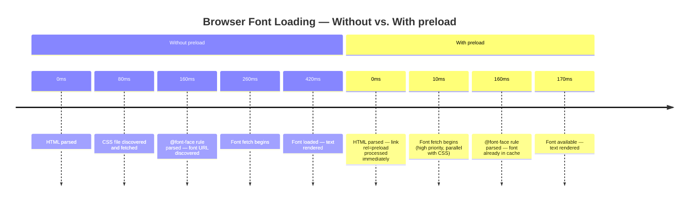

# Resource Hints: `prefetch`, `preload`, `preconnect`

Resource hints are HTML `<link>` elements and HTTP headers that tell the browser
what resources will be needed and when. Rather than discovering resources
reactively as HTML is parsed or JavaScript executes, resource hints allow the
browser to initiate network requests earlier — before the page reaches the point
where the resource is needed. The result is reduced latency for critical
resources and faster perceived performance. Resource hints do not change what
the browser loads; they change when the browser begins loading it, shifting
expensive network round-trips into time windows where they would otherwise be
idle. For time-sensitive resources on the critical rendering path, this timing
shift can measurably improve the Largest Contentful Paint score.

Four primary resource hints exist: `preconnect` (establish a TCP/TLS connection
to an origin before any resource from that origin is requested), `dns-prefetch`
(perform DNS lookup only), `preload` (fetch a specific resource for the current
page immediately at high priority), and `prefetch` (fetch a resource likely
needed for a future navigation at low priority). Each has a distinct scope and
priority; using the wrong one for a given scenario wastes bandwidth or delays
more important resources. The hints are not symmetrical — `preload` and
`prefetch` operate on specific resource URLs, whereas `preconnect` and
`dns-prefetch` operate on origins, not URLs. Conflating these two levels of
specificity is a persistent source of incorrect hint placement.

Resource hints are powerful and easy to misapply. `preload` that doesn't match
an actual resource request produces a browser warning and wastes bandwidth.
`prefetch` on resources for the current page delays them rather than expediting
them. Understanding the scope — current page vs. future page, origin vs.
specific resource — is the prerequisite for using hints correctly. Measuring the
effect of each hint individually, using network waterfall data from Chrome
DevTools or WebPageTest, is the only reliable way to confirm that a given hint
produces the intended benefit rather than unintended interference.

## Principle

Engineers SHOULD use `<link rel="preload">` for resources that are required by
the current page but discovered late in the parsing process — web fonts
referenced in CSS, scripts loaded via dynamically injected `<script>` tags,
images in hero sections that are loaded by CSS rather than ``. `preload`
tells the browser to fetch the resource immediately at high priority, closing
the gap between resource discovery and availability. The effect is most
pronounced when the late-discovered resource lies on the critical path to the
Largest Contentful Paint element, because earlier availability directly reduces
the time at which the paint can occur.

Engineers MUST specify the correct `as` attribute on every `<link rel="preload">`
element. The `as` attribute tells the browser what kind of resource is being
preloaded, which determines the request's priority, the applicable Content
Security Policy directives, and whether the correct `Accept` header is sent. A
preloaded font without `as="font"` and `crossorigin` is fetched twice — once by
the preload hint and once by the CSS font-face rule — because the browser cannot
match the two requests. The double fetch not only wastes bandwidth but also
negates the performance benefit the preload was introduced to provide, leaving
the page worse off than if no hint had been added.

## Design Thinking

### preload vs. prefetch

`preload` is scoped to the current page and runs at high priority. It is
intended for resources the current navigation requires but that the browser
would not discover until late — a font file referenced deep inside a CSS
cascade, an image that lives in a CSS `background-image` property rather than
an `` element, or a JavaScript module entry point injected dynamically.
The browser fetches the preloaded resource immediately after encountering the
hint, before the point in the document where the resource would normally be
discovered. This allows the resource to be available in the browser's cache by
the time the real consumer — the CSS parser, the script evaluator, or the
layout engine — requests it, eliminating the full network round-trip from the
critical path.

If the resource is not consumed within the current page load, the browser emits
a console warning and the bandwidth is wasted. The warning is an important
signal: a `preload` that consistently triggers the unused-preload warning in the
DevTools Network panel indicates that the hint's URL no longer matches the URL
the consumer actually requests, typically because a build tool has renamed or
hashed the file. Teams should treat the unused-preload warning as a lint error
and resolve it before shipping.

`prefetch` is scoped to a future navigation and runs at idle priority. It
instructs the browser to fetch a resource likely needed for the next page the
user will visit, using background bandwidth during idle time. The browser will
not cancel a prefetch once started; a preload that is not consumed within the
page load will be cancelled and warned. Using `prefetch` for current-page
resources is a common and consequential mistake: because idle-priority fetches
compete poorly with active page resources, a `prefetch`-ed resource may arrive
after a `preload` would have provided it, producing a net delay rather than a
net gain. The browser's resource scheduler treats idle-priority requests as
background work that should not impede foreground loading, which is exactly the
wrong behavior for a resource that the current page needs.

### preconnect vs. dns-prefetch

`preconnect` initiates the full connection sequence to a remote origin: DNS
resolution, TCP handshake, and TLS negotiation. For HTTPS origins, this
sequence typically adds 100–300ms of latency before any byte of the first
resource can be received, depending on geographic distance to the server and
network conditions. Using `preconnect` to an origin from which a critical
resource will be requested within the first two seconds of page load can
eliminate that handshake time entirely, because the connection is already open
when the resource request is issued. The practical value is highest for
third-party origins hosting fonts, CDN-distributed scripts, or API endpoints
that are fetched on page load — origins whose connection latency the page
author would not otherwise be able to eliminate.

`dns-prefetch` performs only the DNS resolution step, resolving the domain name
to an IP address without initiating a TCP or TLS connection. It consumes
significantly fewer resources than `preconnect` — no file descriptors, no TLS
state, no server-side connection slots — and is appropriate for origins that
may be used during the page session but are not immediately critical. The
practical rule is to use `preconnect` for the two or three origins from which
above-the-fold resources will load, and `dns-prefetch` for any additional
third-party origins whose timing is less certain. Applying `preconnect` broadly
wastes the handshake cost for connections that are opened but never used, and on
mobile networks where connection establishment is particularly expensive, this
waste can exceed the benefit the hint provides. A common and correct pattern is
to pair `preconnect` and `dns-prefetch` for the same origin: the `preconnect`
will be used by supporting browsers, and the `dns-prefetch` serves as a
lightweight fallback in environments where `preconnect` is less effective.

### modulepreload

`<link rel="modulepreload">` is a variant of `preload` designed specifically
for ES modules. Unlike plain `preload`, `modulepreload` not only fetches the
module script but also parses it and adds it to the module map, so that when
the module is imported it is immediately available without re-parsing. For
applications built with Vite or similar module bundlers, `modulepreload` on the
primary entry point can reduce the time-to-interactive of the first meaningful
route, because the parsing cost is paid during idle time rather than on the
critical path of the first user interaction. Vite emits `modulepreload` hints
automatically for entry chunks in production builds; understanding the mechanism
helps engineers debug cases where the hints are absent or incorrectly scoped.

`modulepreload` also triggers preloading of the module's static imports when the
browser supports the full specification, meaning a single hint on an entry point
can cascade into fetching and parsing the entire static dependency graph in
parallel. This behavior differs from plain `preload`, which fetches only the
single specified URL. For module-based applications with deep static import
trees, this distinction makes `modulepreload` substantially more powerful than
`preload` for JavaScript module entry points, and substituting one for the other
is a correctness issue, not merely a style preference.

### Resource hints via HTTP headers

Resource hints can also be delivered as HTTP `Link` response headers rather than
HTML `<link>` elements. The header form, such as
`Link: </fonts/inter.woff2>; rel=preload; as=font; crossorigin`, is processed
by the browser as soon as the response headers arrive — before the HTML body is
parsed. This makes header-based hints more effective than in-document hints for
resources that need to be initiated at the very start of the request lifecycle,
because header processing occurs before even the first byte of HTML is read. CDN
and edge platforms such as Cloudflare and Fastly can inject `Link` headers at
the network layer without modifying the HTML produced by the origin server,
making this approach viable for teams that do not control their HTML build
pipeline directly.

The tradeoff is that header-based hints are less visible to developers than
in-document hints, because they are not present in the HTML source code returned
in the browser. Teams using header-based preload should document the headers
added at the CDN or server layer and include them in performance audits, to
prevent hints from persisting after the resources they reference have been
renamed or removed. An unused-preload warning from a header hint is diagnostically
identical to one from an HTML hint but harder to attribute without access to the
CDN configuration.

### Over-hinting pitfall

Every preloaded resource competes for bandwidth with every other resource
loading at the same time. Preloading a hero font, a hero image, a third-party
analytics script, and three CSS files simultaneously means all of those requests
share the same connection bandwidth during the most congested phase of the page
load. If the Largest Contentful Paint element is an image, preloading resources
that are less critical than that image can delay it by pushing it further down
the bandwidth queue. The correct approach is to measure LCP and FCP before and
after adding each hint in isolation, using Chrome DevTools or WebPageTest, and
accept only hints that produce a measurable improvement in the metric they are
intended to help.

The network waterfall view in Chrome DevTools is the most direct tool for
evaluating hint effectiveness. Adding a `preload` and then recording a reload
with the waterfall open makes the shift in resource fetch timing immediately
visible: the resource bar for the preloaded asset moves to the left, overlapping
with resources that were previously in earlier parallel requests. If the bar does
not move significantly, the hint is providing no benefit and should be removed.
Preloading everything is worse than preloading nothing, because a curated set of
hints produces a net gain whereas an indiscriminate one produces net interference
by crowding out the browser's own priority decisions.

Browser priority heuristics are sophisticated and encode a great deal of
empirical knowledge about what resources are likely to be LCP-blocking. A page
that adds no resource hints will still benefit from the browser's built-in
speculation — the preload scanner runs ahead of the main HTML parser and
discovers `<script src>`, `<link href>`, and `` attributes in the HTML
before the parser reaches those elements. Resource hints are an override of these
heuristics, not a replacement. Overriding the heuristics incorrectly produces
worse outcomes than the heuristics alone, which is why each hint should be
verified with measurement rather than added on the assumption that earlier is
always better.

## Best Practices

**MUST include the `as` attribute on all `<link rel="preload">` elements and
include `crossorigin` for font preloads.** Without the `as` attribute, the
browser fetches the preloaded resource at default priority without the correct
headers, then fetches it again when the actual consumer (CSS, JS) requests it
with the correct context. The double-fetch wastes bandwidth and may delay the
resource relative to a page with no hint at all. For fonts specifically,
`crossorigin` is required even when the font is self-hosted, because the
`@font-face` rule issues a CORS-mode request and the browser will not match it
against a non-CORS preload, resulting in a second full fetch. The correct
combination for a self-hosted woff2 font is always `as="font"`, `type="font/woff2"`,
and `crossorigin` together; omitting any of the three breaks the match.

**SHOULD use `<link rel="preconnect">` only for origins from which critical
above-the-fold resources will be loaded within the first two seconds of page
load.** Each `preconnect` opens a TCP/TLS connection that consumes server and
client resources — file descriptors, TLS session state, and server-side
keep-alive slots. Connections to origins that are not used quickly are abandoned,
wasting the handshake cost that the hint was intended to save. The browser
enforces a connection idle timeout after which an unused `preconnect` is torn
down, so a hint that fires on page load for an origin contacted later in the
session may provide no benefit. Limit `preconnect` to two or three
high-priority origins; use `dns-prefetch` for lower-priority or conditionally
loaded third-party origins so that DNS is pre-resolved without committing the
full connection cost. Teams should audit their `preconnect` hints periodically
using the Network panel's timing breakdown to verify that each hinted connection
is actually reused.

**SHOULD use `<link rel="prefetch">` for resources required by the next likely
navigation, not for resources needed on the current page.** `prefetch` runs at
idle priority and may not complete before the current page needs the resource.
Using `prefetch` for current-page resources means those resources arrive after a
`preload` would have provided them, producing a net delay compared to no hint.
The appropriate use is speculative: when analytics or application logic indicates
that the user is very likely to navigate to a specific route next, prefetching
that route's bundle or data payload in the background allows the next page to
load from cache rather than over the network. Frameworks like Next.js and Nuxt
implement automatic route prefetching when links enter the viewport; custom
implementations should follow the same pattern — trigger `prefetch` hints in
response to user proximity signals (hover, focus, IntersectionObserver), not
unconditionally on page load.

## Visual



## Example

```html
<!-- Preconnect to critical third-party origins -->
<link rel="preconnect" href="https://fonts.googleapis.com">
<link rel="preconnect" href="https://fonts.gstatic.com" crossorigin>

<!-- Preload the LCP hero image -->
<link rel="preload" as="image" href="/images/hero.webp">

<!-- Preload the primary web font -->
<link rel="preload" as="font" type="font/woff2" href="/fonts/inter.woff2" crossorigin>

<!-- Prefetch the next page's bundle -->
<link rel="prefetch" href="/about/bundle.js">
```

## Common Mistakes

- `<link rel="preload">` without an `as` attribute — the browser cannot determine the resource type, assigns default priority, omits the correct `Accept` header, and fetches the resource a second time when the real consumer requests it with proper context, resulting in a double fetch.
- `<link rel="preload" as="font">` without `crossorigin` — even for self-hosted fonts, the `@font-face` rule issues a CORS-mode request; the browser cannot match it against a non-CORS preload and fetches the font twice.
- Using `prefetch` for current-page resources — idle-priority fetches compete poorly with active-page network requests and the resource may arrive later than it would have without any hint.
- Preloading too many resources simultaneously — competing with the LCP image for bandwidth during the most congested phase of the load, which delays the metric the hints were intended to improve.
- Applying `preconnect` to every third-party origin — connections that are not used within a few seconds are torn down, wasting the TCP/TLS handshake cost that `preconnect` was intended to eliminate.
- Ignoring the unused-preload browser warning in DevTools — this warning indicates that the preloaded URL is not matched by any consumer in the current page, meaning the hint is providing no benefit and consuming bandwidth.
- Omitting `modulepreload` in Vite projects with dynamic imports — the browser must fetch, parse, and evaluate each module on the critical path rather than during idle time.

## Related FEEs

- FEE-700 — Rendering & Performance Overview
- FEE-704 — Core Web Vitals & Performance Metrics
- FEE-705 — Code Splitting, Lazy Loading & Tree Shaking
- FEE-712 — Critical Rendering Path & Paint Timing

## References

- MDN: rel=preload — https://developer.mozilla.org/en-US/docs/Web/HTML/Attributes/rel/preload
- web.dev: Preload critical assets — https://web.dev/articles/preload-critical-assets
- web.dev: Establish network connections early — https://web.dev/articles/preconnect-and-dns-prefetch
- W3C Resource Hints specification — https://www.w3.org/TR/resource-hints/
