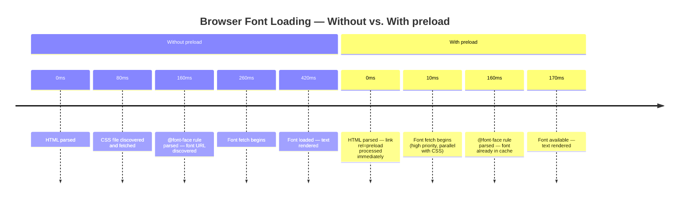

# [FEE-711] Resource Hints: `prefetch`, `preload`, `preconnect`

:::info
Resource hints are HTML `<link>` elements and HTTP headers that tell the browser which resources it will need and when, so it can start fetching before HTML parsing or JavaScript execution would otherwise reveal the need. A resource hint shifts a request earlier in the timeline; the browser still ends up fetching the exact same resource it would have fetched anyway, just sooner, which is why time-sensitive resources on the critical rendering path can see a measurable Largest Contentful Paint improvement from the right hint. The title names three of the five hints this article covers, `preconnect`, `preload`, and `prefetch`; `dns-prefetch` and `modulepreload` are close relatives that share their mechanics and get the same treatment below. Used well, a `preload` can remove a full network round-trip from the LCP path. Used carelessly, the same hint competes with the resources it was meant to help.
:::

## Context

Browsers already run a preload scanner that looks ahead of the main HTML parser for `<script src>`, `<link href>`, and `` attributes, plus a priority system that ranks each request by how likely it is to block rendering. Resource hints exist because that built-in speculation has blind spots: a font referenced inside a CSS file, an image set through `background-image` instead of ``, or a script injected by JavaScript are all invisible to the scanner until the browser reaches the code that names them.

The hints split into two families by scope. `preload` and `prefetch` target a specific resource URL: `preload` fetches it now, at high priority, for the current page; `prefetch` fetches it at idle priority, for whatever page the user navigates to next. `preconnect` and `dns-prefetch` target an origin, not a URL: `preconnect` runs the full DNS-plus-TCP-plus-TLS handshake ahead of time, and `dns-prefetch` runs only the DNS step. `modulepreload`, covered in Design Thinking below, is a `preload` variant built for ES modules. Conflating the two families, hinting a URL when the mechanism wants an origin or the reverse, is a persistent source of misplaced hints.

Getting the choice of hint wrong is common, and it's rarely obvious from the page working fine. A `preload` that doesn't match a real request still lets the page render; it just wastes bandwidth and produces a console warning. A `prefetch` used for a current-page resource still loads the resource, just later than it would have without any hint at all. The only reliable way to tell a hint is actually helping is to measure it: record a Chrome DevTools or WebPageTest network waterfall before and after adding each hint, one at a time.

## Visual



## Example

```html
<!-- Preconnect to critical third-party origins (kept in separate tags: -->
<!-- combining preconnect and dns-prefetch on one <link> breaks preconnect in Safari) -->
<link rel="preconnect" href="https://fonts.googleapis.com">
<link rel="preconnect" href="https://fonts.gstatic.com" crossorigin>

<!-- Preload the LCP hero image; fetchpriority=high pushes it above the -->
<!-- priority a plain preload would get on its own -->
<link rel="preload" as="image" href="/images/hero.webp" fetchpriority="high">

<!-- Preload the primary web font -->
<link rel="preload" as="font" type="font/woff2" href="/fonts/inter.woff2" crossorigin>

<!-- Prefetch the next page's bundle -->
<link rel="prefetch" href="/about/bundle.js">
```

When the LCP element is a plain `` already in the DOM rather than a CSS background, `fetchpriority="high"` on the tag itself often removes the need for a `preload` entirely, because the preload scanner already finds the URL early:

```html

```

## Best Practices

**MUST include the `as` attribute on all `<link rel="preload">` elements and
include `crossorigin` for font preloads.** Without the `as` attribute, the
browser fetches the preloaded resource at default priority without the correct
headers, then fetches it again when the actual consumer (CSS, JS) requests it
with the correct context. The double-fetch wastes bandwidth and may delay the
resource relative to a page with no hint at all. For fonts specifically,
`crossorigin` is required even when the font is self-hosted, because the
`@font-face` rule issues a CORS-mode request and the browser will not match it
against a non-CORS preload, resulting in a second full fetch. The correct
combination for a self-hosted woff2 font is always `as="font"`, `type="font/woff2"`,
and `crossorigin` together; omitting any of the three breaks the match.

**SHOULD use `<link rel="preconnect">` only for origins from which critical
above-the-fold resources begin loading early in the page.** Each `preconnect`
opens a TCP/TLS connection that consumes server and client resources: file
descriptors, TLS session state, and server-side keep-alive slots. web.dev
reports that browsers close a connection that sits unused for 10 seconds, so a
`preconnect` fired on page load for an origin the page doesn't actually contact
until later in the session buys nothing and spends the handshake cost twice.
Limit `preconnect` to two or three high-priority origins; use `dns-prefetch`
for lower-priority or conditionally loaded third-party origins so DNS resolves
ahead of time without committing to the full connection. When pairing
`preconnect` and `dns-prefetch` for the same origin, use two separate `<link>`
tags: combining both on a single tag triggers a Safari bug that cancels the
`preconnect`. Teams should audit their `preconnect` hints periodically using
the Network panel's timing breakdown to verify that each hinted connection is
actually reused.

**SHOULD use `<link rel="prefetch">` for resources required by the next likely
navigation, not for resources needed on the current page.** `prefetch` runs at
idle priority and may not complete before the current page needs the resource.
Using `prefetch` for current-page resources means those resources arrive after
a `preload` would have provided them, producing a net delay compared to no
hint. The appropriate use is speculative: when analytics or application logic
indicates that the user is very likely to navigate to a specific route next,
prefetching that route's bundle or data payload in the background allows the
next page to load from cache rather than over the network. A product grid
might fire a `prefetch` only for the card the cursor is currently hovering,
rather than for every product on the page. Frameworks like Next.js and Nuxt
implement automatic route prefetching when links enter the viewport. For
full-document navigations specifically, prefer the Speculation Rules API where
the browser supports it (see Design Thinking below); MDN now recommends it
over `<link rel="prefetch">` for that job, leaving `prefetch` for subresources
and as the cross-browser fallback.

**SHOULD pair `fetchpriority="high"` with the preload, or with the `` tag
directly, for the page's Largest Contentful Paint resource.** A `preload` and
the browser's default priority heuristic both make a best guess at how urgent
a resource is; `fetchpriority="high"` overrides that guess explicitly. Google's
own Flights-page test (see Fetch Priority below) measured a meaningful LCP
improvement from this attribute alone, with no other change. Support
is broad enough to use unconditionally: Chrome 102+, Safari 17.2+, and Firefox
132+ all implement it, and older browsers simply ignore the attribute. For a
CSS `background-image` LCP element, which still needs a `preload` for early
discovery, add `fetchpriority="high"` to that `preload` tag. For an LCP image
that's already a plain `` in the DOM, `fetchpriority="high"` on the
element itself is often sufficient on its own.

## Design Thinking

### preload vs. prefetch

`preload` is scoped to the current page and runs at high priority. It is
intended for resources the current navigation requires but that the browser
would not discover until late: a font file referenced deep inside a CSS
cascade, an image that lives in a CSS `background-image` property rather than
an `` element, or a JavaScript module entry point injected dynamically.
The browser fetches the preloaded resource immediately after encountering the
hint, before the point in the document where the resource would normally be
discovered. This makes the resource available in the browser's cache by the
time its consumer (the CSS parser, the script evaluator, or the layout engine)
requests it, eliminating the full network round-trip from the critical path.

If the resource is not consumed within the current page load, the browser emits
a console warning and the bandwidth is wasted. The warning is an important
signal: a `preload` that consistently triggers the unused-preload warning in the
DevTools Network panel indicates that the hint's URL no longer matches the URL
the consumer actually requests, typically because a build tool has renamed or
hashed the file. Teams should treat the unused-preload warning as a lint error
and resolve it before shipping.

Managing preload hints across content-hashed build artifacts requires
automation rather than manual URL maintenance. A build tool plugin can
generate the `<link rel="preload">` tags as part of the production HTML
output: it reads the manifest of hashed filenames the bundler produced and
injects the matching preload hints, so the hints stay in sync with the actual
asset URLs on every build. Maintaining preload hints as static strings in a
template while the build tool hashes filenames is a latent breakage pattern.
Every deploy that changes a preloaded file's content hash silently turns the
preload into an unused-preload warning, and the performance benefit disappears
until someone notices the warning and investigates. Vite's `transformIndexHtml`
plugin hook and Webpack's `HtmlWebpackPlugin` injection points both expose the
final hashed filenames needed to generate these hints automatically.

`prefetch` is scoped to a future navigation and runs at idle priority. It
instructs the browser to fetch a resource likely needed for the next page the
user will visit, using background bandwidth during idle time. Neither hint
cancels its request once started: a `prefetch`'s result sits in the HTTP cache
until a future navigation claims it or it's evicted, and a `preload` always
completes its fetch, which is exactly why an unused one wastes bandwidth
instead of saving it, and why the unused-preload warning fires on a resource
that already downloaded. Using `prefetch` for current-page resources is a
common and consequential mistake: because idle-priority fetches compete poorly
with active page resources, a `prefetch`-ed resource may arrive after a
`preload` would have provided it, producing a net delay rather than a net gain.
The browser's resource scheduler treats idle-priority requests as background
work that should not impede foreground loading, which is exactly the wrong
behavior for a resource that the current page needs.

### Fetch Priority

The Fetch Priority API adds a `fetchpriority` attribute (`high`, `low`, or the
default `auto`) that overrides the browser's own priority heuristic for a
specific request. It applies to `<link rel="preload">`, ``, and `<script>`,
and browser support is broad: Chrome 102+, Safari 17.2+, and
Firefox 132+ all implement it. `preload` and `fetchpriority` solve different
problems: `preload` controls when the browser discovers a resource, while
`fetchpriority` controls how the browser schedules it relative to everything
else once discovered. The two compose. On a `background-image` LCP element,
the CSS parser won't find the image URL early enough on its own, so it still
needs a `preload` for early discovery; adding `fetchpriority="high"` to that
same `preload` tag pushes it further up the queue than a plain preload would
get on its own. On an LCP element that's already a plain `` in the DOM,
the browser's scanner finds the URL early regardless, so `fetchpriority="high"`
on the `` tag alone often does the job without a `preload` at all.
Google's own test on a Flights page moved LCP from 2.6s to 1.9s by adding
`fetchpriority="high"` to the hero image alone. `fetchpriority="low"` is the
mirror case: applying it to below-the-fold images or non-critical scripts frees
bandwidth for the resources actually blocking render. The Network panel's
Priority column in Chrome DevTools shows the priority the browser actually
assigned to a request, which is the fastest way to check whether a resource
needs an override at all.

### Speculation Rules

The Speculation Rules API lets a page declare, in JSON, which future
navigations the browser should prefetch or prerender, either through an inline
`<script type="speculationrules">` element or an HTTP `Speculation-Rules`
header. Each rule carries an eagerness level that controls when it fires:
`conservative` waits for a pointer-down or touch-start on the link, `moderate`
fires after roughly 200ms of hover (or pointer-down on touch devices), `eager`
fires on the slightest interaction hint (a brief hover on desktop, viewport
heuristics on mobile), and `immediate` fires as soon as the rules are
registered.

```html
<script type="speculationrules">
{
  "prefetch": [{
    "where": { "href_matches": "/products/*" },
    "eagerness": "moderate"
  }]
}
</script>
```

MDN now recommends speculation rules over `<link rel="prefetch">` for
prefetching full documents. Speculation rules work across cross-site
navigations, which plain `prefetch` cannot do; they ignore `Cache-Control`
headers that would otherwise block a prefetch; and they automatically respect
the user's Data Saver setting. The API is Chromium-only as of this writing and
is not yet Baseline: Safari and Firefox don't implement it. A production site
still needs `<link rel="prefetch">` as the cross-browser fallback for
navigation prefetch, and as the tool for prefetching subresources, which
speculation rules don't cover at all.

### preconnect vs. dns-prefetch

`preconnect` initiates the full connection sequence to a remote origin: DNS
resolution, TCP handshake, and TLS negotiation. Each of those steps costs at
least one network round-trip; web.dev reports that DNS resolution alone
typically takes 20–120ms, and that establishing a connection early, before the
resource that needs it is requested, can save 100–500ms of load time in total.
Using `preconnect` for an origin from which a critical resource begins loading
early in the page can capture that savings, because the connection is already
open when the resource request is issued. The practical value is highest for
third-party origins hosting fonts, CDN-distributed scripts, or API endpoints
fetched on page load: origins whose connection latency the page author has no
other way to eliminate.

`dns-prefetch` performs only the DNS resolution step, resolving the domain name
to an IP address without initiating a TCP or TLS connection. It consumes
significantly fewer resources than `preconnect` (no file descriptors, no TLS
state, no server-side connection slots) and is appropriate for origins that may
be used during the page session but are not immediately critical. The
practical rule is to use `preconnect` for the two or three origins from which
above-the-fold resources will load, and `dns-prefetch` for any additional
third-party origins whose timing is less certain. Applying `preconnect`
broadly wastes the handshake cost for connections that are opened but never
used, and on mobile networks, where connection establishment is particularly
expensive, this waste can exceed the benefit the hint provides. A common and
correct pattern is to pair `preconnect` and `dns-prefetch` for the same origin,
with the `preconnect` used by supporting browsers and the `dns-prefetch` as a
lightweight fallback where `preconnect` is less effective. Keep the two hints
in separate `<link>` tags when doing this: combining `rel="preconnect
dns-prefetch"` on one tag triggers a Safari bug that cancels the `preconnect`,
per web.dev's guidance.

### modulepreload

`<link rel="modulepreload">` is a variant of `preload` designed specifically
for ES modules. Unlike plain `preload`, `modulepreload` not only fetches the
module script but also parses it and adds it to the module map, so that when
the module is imported it is immediately available without re-parsing. For
applications built with Vite or similar module bundlers, `modulepreload` on the
primary entry point can reduce the time-to-interactive of the first meaningful
route, because the parsing cost is paid during idle time rather than on the
critical path of the first user interaction. Vite emits `modulepreload` hints
automatically for entry chunks in production builds; understanding the mechanism
helps engineers debug cases where the hints are absent or incorrectly scoped.

`modulepreload` also triggers preloading of the module's static imports when
the browser supports the full specification, meaning a single hint on an entry
point can cascade into fetching and parsing the entire static dependency graph
in parallel. This behavior differs from plain `preload`, which fetches only the
single specified URL. Substituting `rel="preload" as="script"` for
`modulepreload` still fetches the file, but it skips dependency-graph
discovery: the browser never learns about the module's static imports, so
those load only after the entry module is parsed and evaluated, back on the
critical path instead of running in parallel during idle time.

### Resource hints via HTTP headers

Resource hints can also be delivered as HTTP `Link` response headers rather
than HTML `<link>` elements. The header form, such as
`Link: </fonts/inter.woff2>; rel=preload; as=font; crossorigin`, is processed
by the browser as soon as the response headers arrive, before the HTML body is
parsed. This makes header-based hints more effective than in-document hints
for resources that need to be initiated at the very start of the request
lifecycle, because header processing occurs before even the first byte of HTML
is read. CDN and edge platforms such as Cloudflare and Fastly can inject
`Link` headers at the network layer without modifying the HTML produced by the
origin server, making this approach viable for teams that don't control their
HTML build pipeline directly.

An HTTP 103 Early Hints response takes this a step further. Instead of waiting
for the origin server to finish generating the final response before attaching
a `Link` header to it, the server sends an informational 103 response carrying
the same `Link: rel=preload` or `rel=preconnect` hints while it's still
assembling the real response, often while a database query or an upstream
fetch is still in flight. The browser starts acting on those hints
immediately, so a slow-to-generate page can still ship its resource hints
early. Cloudflare and Fastly both support Early Hints, and Chrome has shipped
support since version 103, though Safari currently honors only the
`preconnect` hint from a 103 response, not `preload`. Early Hints needs origin
or CDN support to send the informational response, and the hints it carries
should be safe to send speculatively (idempotent, cacheable), since the final
response might still change them.

The tradeoff is that header-based hints are less visible to developers than
in-document hints, because they are not present in the HTML source code
returned in the browser. Teams using header-based preload should document the
headers added at the CDN or server layer and include them in performance
audits, to prevent hints from persisting after the resources they reference
have been renamed or removed. An unused-preload warning from a header hint is
diagnostically identical to one from an HTML hint but harder to attribute
without access to the CDN configuration.

### Over-hinting pitfall

Every preloaded resource competes for bandwidth with every other resource
loading at the same time. Preloading a hero font, a hero image, a third-party
analytics script, and three CSS files simultaneously means all of those requests
share the same connection bandwidth during the most congested phase of the page
load. If the Largest Contentful Paint element is an image, preloading resources
that are less critical than that image can delay it by pushing it further down
the bandwidth queue. The correct approach is to measure LCP and FCP before and
after adding each hint in isolation, using Chrome DevTools or WebPageTest, and
accept only hints that produce a measurable improvement in the metric they are
intended to help.

The network waterfall view in Chrome DevTools is the most direct tool for
evaluating hint effectiveness. Adding a `preload` and then recording a reload
with the waterfall open makes the shift in resource fetch timing immediately
visible: the resource bar for the preloaded asset moves to the left, overlapping
with resources that were previously in earlier parallel requests. If the bar does
not move significantly, the hint is providing no benefit and should be removed.
A page that hints six resources when only two sit on the LCP path spends its
early, most-congested bandwidth window on the wrong four; the DevTools
Priority column will show the two that matter competing at the same priority
as the four that don't, and the fix is to remove hints until only the
LCP-critical ones remain.

Browser priority heuristics are sophisticated and encode a great deal of
empirical knowledge about what resources are likely to be LCP-blocking. A page
that adds no resource hints still benefits from the browser's built-in
speculation: the preload scanner runs ahead of the main HTML parser and
discovers `<script src>`, `<link href>`, and `` attributes before the
parser reaches those elements. A resource hint overrides that heuristic for
one specific resource; the heuristic keeps running underneath and still
decides the priority of every resource the page hasn't explicitly hinted.
Getting an override wrong, hinting the wrong resource or hinting too many,
produces worse outcomes than leaving the heuristic alone, which is why each
hint should be verified with measurement instead of added on the assumption
that earlier is always better.

## Common Mistakes

- **Omitting the `as` attribute on `<link rel="preload">`.** The browser cannot determine the resource type, assigns default priority, and omits the correct `Accept` header. It fetches the resource a second time when the real consumer requests it with proper context, resulting in a double fetch.

- **Omitting `crossorigin` on `<link rel="preload" as="font">`.** Even for self-hosted fonts, the `@font-face` rule issues a CORS-mode request. The browser cannot match it against a non-CORS preload and fetches the font twice.

- **Using `prefetch` for current-page resources.** Idle-priority fetches compete poorly with active-page network requests, and the resource may arrive later than it would have without any hint.

- **Preloading too many resources simultaneously.** Each one competes with the LCP image for bandwidth during the most congested phase of the load, delaying the metric the hints were intended to improve.

- **Applying `preconnect` to every third-party origin.** Connections that are not used within 10 seconds are torn down, wasting the TCP/TLS handshake cost that `preconnect` was intended to eliminate.

- **Ignoring the unused-preload browser warning in DevTools.** This warning indicates that the preloaded URL is not matched by any consumer in the current page, meaning the hint is providing no benefit while still consuming bandwidth.

- **Omitting `modulepreload` in Vite projects with dynamic imports.** The browser must fetch, parse, and evaluate each module on the critical path rather than during idle time.

- **Preloading the LCP resource without `fetchpriority="high"`.** The resource competes at whatever priority the browser's default heuristic assigns instead of the explicit override -- the same gap Google's Flights test (see Fetch Priority above) closed once fixed.

- **Relying only on `<link rel="prefetch">` for full-page navigation prefetch.** The Speculation Rules API prefetches across cross-site navigations and ignores `Cache-Control` restrictions that block a plain `prefetch`. In browsers that support the newer API, relying on `prefetch` alone leaves a real win on the table.

## Related Topics

- [Rendering & Performance Overview](/en/Rendering%20and%20Performance/700)
- [Core Web Vitals & Performance Metrics](/en/Rendering%20and%20Performance/704)
- [Code Splitting, Lazy Loading & Tree Shaking](/en/Rendering%20and%20Performance/705)
- [Critical Rendering Path & Paint Timing](/en/Rendering%20and%20Performance/712)

## References

- MDN Contributors, "rel=preload HTML Attribute Value," MDN Web Docs (2026). https://developer.mozilla.org/en-US/docs/Web/HTML/Reference/Attributes/rel/preload
- MDN Contributors, "rel=prefetch HTML Attribute Value," MDN Web Docs (2026). https://developer.mozilla.org/en-US/docs/Web/HTML/Reference/Attributes/rel/prefetch
- MDN Contributors, "Speculation Rules API," MDN Web Docs (2025). https://developer.mozilla.org/en-US/docs/Web/API/Speculation_Rules_API
- MDN Contributors, "103 Early Hints," MDN Web Docs (2026). https://developer.mozilla.org/en-US/docs/Web/HTTP/Reference/Status/103
- Djirdeh, H., Wagner, J., and Mihajlija, M., "Preload Critical Assets to Improve Loading Speed," web.dev (2018). https://web.dev/articles/preload-critical-assets
- Wagner, J., and Mihajlija, M., "Establish Network Connections Early to Improve Perceived Page Speed," web.dev (2019). https://web.dev/articles/preconnect-and-dns-prefetch
- Osmani, A., Sohoni, L., Meenan, P., and Pollard, B., "Optimize Resource Loading with the Fetch Priority API," web.dev (2023). https://web.dev/articles/fetch-priority
- WHATWG, "HTML Living Standard: Types of Link" (defines rel=preload, prefetch, dns-prefetch, preconnect, modulepreload), continuously updated. https://html.spec.whatwg.org/#linkTypes
