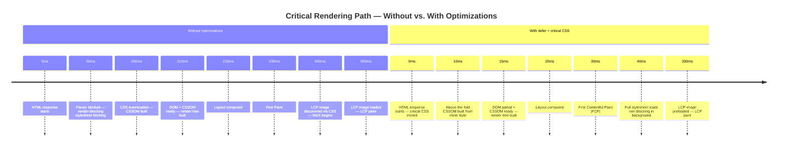

# Critical Rendering Path & Paint Timing

The critical rendering path is the sequence of steps the browser must complete
before it can display anything on screen: download and parse HTML, download and
parse CSS (render-blocking), build the DOM and CSSOM, combine them into the
render tree, perform layout to compute geometry, paint pixels, and composite
layers into the final frame. Each step depends on the output of the previous
one. Optimizing the critical rendering path means reducing the number and cost
of steps that block the first paint, either by eliminating blocking resources
or by shortening the time those resources spend on the network. The difference
between a path that takes 200ms and one that takes 800ms is entirely determined
by how many blocking resources the browser encounters and how quickly those
resources resolve. Understanding which resources are on this path — and which
are not — is the prerequisite for making any meaningful improvement to a page's
initial rendering speed.

Render-blocking resources are the most impactful factor in initial paint
performance. By default, `<link rel="stylesheet">` is render-blocking: the
browser will not paint until all stylesheets in `<head>` have downloaded and
been parsed. `<script>` without `defer` or `async` is also render-blocking and
HTML-parsing-blocking. The browser encounters these tags while parsing HTML,
stops, downloads the resource, processes it, and then continues. Every blocking
resource adds its full network round-trip time to time-to-first-paint. On slow
or high-latency connections, a single unoptimized render-blocking resource can
account for hundreds of milliseconds of invisible, blank-screen time experienced
by real users. This cost is not theoretical — it is observable in the paint
timing waterfall and directly attributable to the presence of blocking resources
in the document head.

`PerformancePaintTiming` provides browser-reported timestamps for `first-paint`
(FP) and `first-contentful-paint` (FCP). These are observable metrics that
correlate with the critical rendering path's length: a shorter path produces
earlier FP and FCP timestamps. LCP (Largest Contentful Paint) extends this to
measure when the most significant content is visible, accounting for not only
the first paint event but also the loading of the dominant element in the
viewport. Together, FP, FCP, and LCP form the paint timing picture that
characterizes a page's rendering performance and that real-user monitoring
systems should capture to understand what users actually see. All three metrics
are measurable in production via standard browser APIs, making them the
foundation of any evidence-based critical rendering path improvement program.

## Design Thinking

### DOM construction and parsing

HTML is parsed incrementally: the browser does not wait for the full HTML
document to be received before beginning to build the DOM. As each chunk of
the HTML response arrives, the parser processes it and constructs DOM nodes.
This streaming behavior means that serving the HTML response early — and not
delaying it with slow server-side rendering or large initial payloads — allows
the browser to start building the DOM, discovering resources via the preload
scanner, and initiating network requests for CSS, scripts, and images sooner.
Time-to-first-byte (TTFB) is therefore a prerequisite metric for critical
rendering path optimization: a fast path through the network and server is the
foundation on which all subsequent optimizations rest.

The browser's preload scanner runs ahead of the main HTML parser and discovers
`<link>`, `<script>`, and `` tags in the not-yet-parsed HTML, allowing it
to initiate fetches before the parser has processed those elements.
Render-blocking resources discovered by the preload scanner are fetched in
parallel, but they still block the render step until they complete. The scanner
only reads static HTML attributes — it cannot anticipate resources injected by
JavaScript or referenced from CSS. This is the root reason why late-discovered
resources, such as fonts in CSS or dynamically injected scripts, benefit from
explicit `<link rel="preload">` hints: the hints bring those resources into
the preload scanner's scope and allow fetching to begin earlier. The preload
scanner is one of the most consequential performance features in modern browsers,
and actions that defeat it — such as injecting critical `<link>` elements via
JavaScript instead of declaring them in static HTML — can double the time
before late-discovered resources begin downloading.

Understanding what the parser blocks on has direct implications for document
structure decisions.
A render-blocking `<script>` in the `<head>` without `defer` stops the parser
at the point where it appears, preventing the browser from discovering any CSS,
images, or fonts that appear later in the `<head>`.
This means that a single blocking script near the top of the `<head>` can mask
the bandwidth that a CDN-delivered stylesheet or font would use concurrently —
the browser doesn't know those resources exist yet, so it cannot fetch them
while the script executes.
The cumulative effect of multiple render-blocking scripts is not additive but
sequential: the browser parses until it hits a blocking script, downloads and
executes it, then resumes parsing to discover the next resource.
On a mobile connection with 80 ms RTT, three blocking scripts in the `<head>`
can produce a sequential chain of 240 ms of parsing interruption before the
browser begins to fetch the page's first stylesheet.
Converting those scripts to `defer` collapses the chain: all three scripts
are fetched concurrently by the preload scanner while parsing continues, and
they execute in order after the document has been parsed.
The rendering path shortens by the full duration of the sequential blocking
chain, which is often the single largest recoverable delay in a page's
critical path.
Applying this principle to third-party scripts is equally important: third-party
analytics, A/B testing, and chat widget scripts that are included as synchronous
`<script>` tags in the `<head>` are among the most common sources of avoidable
render-blocking delay, and switching them to `defer` or `async` is typically the
lowest-effort, highest-impact change available for improving FCP on pages that
have not yet addressed script loading.

### CSSOM construction

CSS is not parsed incrementally. The browser must have the full CSS text of a
stylesheet before it can construct the CSSOM, because any rule anywhere in a
stylesheet can override any rule that appeared earlier in the cascade. This
fundamental property of CSS means that a single large stylesheet delayed by a
slow CDN edge node blocks all rendering even when the HTML is fully parsed and
the DOM is complete. The browser will not begin layout — and therefore will
not paint — until the CSSOM is ready. This is why stylesheet size and delivery
speed are direct levers on FCP, and why the critical CSS inlining technique is
effective: by moving the above-the-fold styles into an inline `<style>` block,
those styles are available the moment the browser parses that portion of the
HTML, with no network round-trip required.

The cascade also means that `@import` inside a stylesheet is particularly
damaging. An `@import` rule inside an external stylesheet is not discovered
until the importing stylesheet has been fetched and parsed — creating a serial
chain of network requests before the CSSOM can be built. A page that has
`main.css` in the `<head>`, which internally imports `variables.css` and
`typography.css`, serializes three network requests before the CSSOM is ready.
The correct approach is to concatenate imports at build time or reference each
stylesheet with a separate `<link>` element in the `<head>`, allowing all
stylesheets to be fetched in parallel. Build tools such as Vite, webpack, and
Parcel eliminate `@import` chains at build time by bundling CSS, making this
a concern primarily for teams that ship unbundled or lightly processed CSS to
production — a pattern that remains common in legacy or CMS-driven sites.

### Render tree, layout, paint, composite

The render tree is constructed by walking the DOM and attaching the matching
CSSOM rules to each node. Nodes with `display: none` are excluded from the
render tree entirely; nodes with `visibility: hidden` are included but painted
as transparent. The render tree contains only nodes that will produce visible
output, which is why it is a separate structure from the DOM. Once the render
tree is built, layout computes the position and size of every node in the
coordinate space of the page. Layout is recursive and expensive for large or
deeply nested trees. Any DOM change that affects geometry — adding or removing
elements, changing dimensions, changing the text content of a sized container
— triggers a layout recalculation that propagates through affected subtrees.

Paint records drawing instructions for each node into a list of commands that
the browser will execute to produce pixels. Composition merges layers — separate
GPU-backed surfaces that exist for elements with `transform`, `opacity`, or
`will-change` properties — into the final frame that is displayed on screen.
Changes that affect only composited properties such as `transform` and `opacity`
bypass layout and paint, executing only the composite step entirely on the GPU.
This is the reason why CSS animations on `transform` and `opacity` are
recommended for high-performance animation: they do not trigger layout or paint
recalculation and can run at 60 fps without main-thread involvement. Changes to
properties like `width`, `height`, `top`, `left`, or `color` trigger layout or
paint and cannot be GPU-composited at the same cost.

### Measuring with PerformancePaintTiming and PerformanceObserver

`PerformancePaintTiming` exposes two entries in the browser performance
timeline: `first-paint` (FP), the timestamp when the browser first renders
anything other than the default background, and `first-contentful-paint` (FCP),
the timestamp when the browser first renders any text, image, non-white canvas,
or SVG. These entries are available via `performance.getEntriesByType('paint')`
after the paint events have occurred, or via `PerformanceObserver` with the
`paint` type for real-time observation. Using `buffered: true` in the `observe`
call ensures that entries which fired before the observer was registered are
still delivered, making it safe to register the observer at any point during
page initialization without risking missed entries.

For real-user monitoring (RUM), `PerformanceObserver` with the `paint` type is
the correct instrument for capturing FP and FCP across the production fleet.
LCP is similarly observable via the `largest-contentful-paint` type. These
browser-native APIs capture the metric values that users actually experience on
their devices and network conditions, which are far more diverse than the
conditions simulated by Lighthouse or WebPageTest. A performance budget or
regression alert built on lab data alone will miss regressions that only
manifest on mid-range Android devices on 4G networks — the environment where
the gap between optimized and unoptimized critical rendering paths is widest.
Sending FP, FCP, and LCP values to an analytics endpoint on each page view,
segmented by device class and connection type, gives teams the visibility needed
to detect CRP regressions that are invisible in synthetic testing environments.

## Best Practices

**MUST add `defer` to all `<script src="...">` tags placed in the `<head>`.**
Without `defer`, a `<script>` tag in `<head>` blocks HTML parsing while the
script downloads and executes, preventing the browser from building the DOM or
discovering any subsequent resources. `defer` allows parsing to continue in
parallel with the download and executes the script after parsing completes but
before `DOMContentLoaded`. Multiple `defer` scripts execute in document order,
preserving dependency relationships. For application entry points that rely on
the DOM being available, `defer` is almost always the correct attribute; `async`
is appropriate only for fully independent scripts such as analytics that have no
dependency on DOM readiness or script execution order.

**SHOULD inline critical CSS — the styles needed for above-the-fold rendering —
in a `<style>` tag in the document `<head>` and load the full stylesheet as
non-blocking.** The technique eliminates the render-blocking wait for the
content the user sees first. The full stylesheet can be loaded in parallel
without blocking paint by setting `media="print"` and switching it to `all`
via an `onload` attribute, or by using a JavaScript snippet that appends a
`<link>` element after load. Tools such as the `critical` npm package extract
above-the-fold CSS automatically from rendered HTML, making the technique
practical at scale. The tradeoff is increased HTML size, which is acceptable
when the reduction in FCP latency outweighs the marginal cost of transferring
additional bytes in the initial HTML response. Teams implementing this pattern
should automate the extraction as part of the build pipeline so that the
inlined critical CSS stays synchronized with changes to the page layout;
manually maintained critical CSS tends to drift out of date as the above-the-fold
design evolves.

**SHOULD use `PerformanceObserver` with `type: 'paint'` to measure FP and FCP
in production real-user monitoring.** Lab tools such as Lighthouse and
WebPageTest measure simulated performance under controlled conditions;
real-user monitoring measures what users actually experience across the full
diversity of devices, network conditions, and pages they visit. FP and FCP
from `PerformancePaintTiming` capture rendering performance as it occurs in
the field, enabling regression detection that lab testing cannot provide. The
observer pattern with `buffered: true` is safe to register at any point in the
page lifecycle and will receive paint entries regardless of when they fired
relative to the observer registration. Teams sending these values to a backend
analytics system gain the ability to correlate paint timing with deployment
events, feature flag states, and A/B test assignments — enabling causal
attribution of CRP regressions to specific code changes.

## Visual



## Example

```js
new PerformanceObserver((list) => {
  for (const entry of list.getEntries()) {
    if (entry.name === 'first-contentful-paint') {
      console.log('FCP:', entry.startTime.toFixed(0), 'ms');
    }
  }
}).observe({ type: 'paint', buffered: true });
```

## Common Mistakes

- Placing `<script src="...">` in `<head>` without `defer` or `async` — the
  browser halts HTML parsing while the script downloads and executes, blocking
  all subsequent resource discovery and rendering.
- Using `@import` inside CSS files — each import creates a serial network
  dependency that is not discovered until the importing stylesheet is fetched
  and parsed, serializing requests that should be parallel.
- Treating all CSS as equally render-critical — loading a site's entire
  stylesheet, including styles for modals, footers, and off-screen components,
  as a render-blocking `<link>` when only a fraction of those styles affect
  above-the-fold content.
- Measuring only with Lighthouse or lab tools — simulated environments do not
  capture the device and network diversity of real users; FCP and LCP
  regressions on mid-range devices are frequently invisible in lab data.
- Ignoring TTFB as a CRP prerequisite — critical rendering path optimization
  is bounded by how quickly the HTML response begins arriving; a slow server
  or long redirect chain negates downstream optimizations.
- Using `async` on application scripts that depend on DOM readiness or other
  scripts — `async` scripts execute as soon as they download, which may be
  before the DOM is available or before a dependency script has run, causing
  runtime errors.
- Omitting `buffered: true` on `PerformancePaintTiming` observers — without
  `buffered: true`, an observer registered after the paint events have fired
  will receive no entries, producing silent data gaps in RUM pipelines.

## Related FEEs

- FEE-700 — Rendering & Performance Overview
- FEE-704 — Core Web Vitals & Performance Metrics
- FEE-709 — INP Deep Dive
- FEE-711 — Resource Hints

## References

- web.dev: Critical rendering path — https://web.dev/articles/critical-rendering-path
- MDN: PerformancePaintTiming — https://developer.mozilla.org/en-US/docs/Web/API/PerformancePaintTiming
- web.dev: Eliminate render-blocking resources — https://web.dev/articles/render-blocking-resources
- web.dev: Optimizing the Critical Rendering Path — https://web.dev/articles/optimizing-content-efficiency
