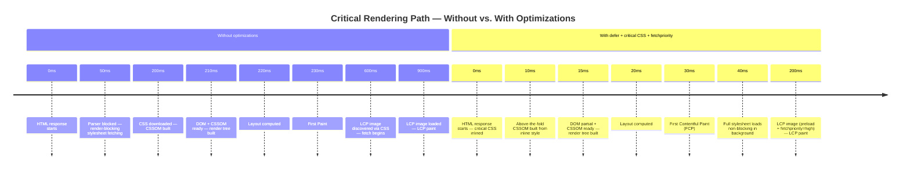

# [FEE-712] Critical Rendering Path & Paint Timing

:::info
The critical rendering path is the sequence of steps a browser must complete before it paints anything: download and parse HTML, download and parse render-blocking CSS, build the DOM and CSSOM, combine them into a render tree, compute layout, then paint and composite. `<link rel="stylesheet">` and synchronous `<script>` tags in `<head>` are the two resource types that block this path by default, and the browser's preload scanner works around them by fetching resources concurrently while a blocking script executes, though execution itself still runs one script at a time. `PerformancePaintTiming` exposes `first-paint` and `first-contentful-paint` as browser-reported timestamps, and `largest-contentful-paint` extends that to the page's dominant visible element, giving real-user monitoring a way to observe what the critical rendering path actually costs in production. This article covers how the parser, the preload scanner, and the CSSOM interact, how to measure the result with the Paint Timing API, and where `fetchpriority` and critical-CSS inlining fit into a concrete optimization plan.
:::

## Context

Internet Explorer's "lookahead downloader" pioneered this class of technique in 2008, proving that a browser could keep fetching resources while blocked on a synchronous script; Chrome, Firefox, and Safari subsequently adopted the same idea as the preload scanner (also called a speculative parser). Google's Web Fundamentals documentation formalized the term "critical rendering path" in a 2014 article by Ilya Grigorik that broke the sequence into DOM and CSSOM construction, render-tree construction, layout, and paint, content later migrated to web.dev. The Paint Timing API arrived later, giving developers `first-paint` and `first-contentful-paint` as standardized, browser-reported timestamps instead of ad hoc `Date.now()` calls at page load. Most existing guidance stops at a checklist, "add defer," "inline critical CSS," without explaining how those techniques interact with the preload scanner that is already fetching resources in the background. This article covers that interaction directly: how the parser, the scanner, and script execution combine to produce a specific, measurable amount of blocked paint time, and how to observe that number in production rather than guess at it.

## Visual



## Example

```js
new PerformanceObserver((list) => {
  for (const entry of list.getEntries()) {
    if (entry.name === 'first-contentful-paint') {
      console.log('FCP:', entry.startTime.toFixed(0), 'ms');
    }
  }
}).observe({ type: 'paint', buffered: true });
```

## Best Practices

**MUST add `defer` to all `<script src="...">` tags placed in `<head>`.**
Without `defer`, a `<script>` tag in `<head>` pauses HTML parsing and DOM
construction while the script downloads and executes. The preload scanner
still discovers and fetches resources that appear later in the document
during that pause, but the DOM itself cannot grow past the script's position
until the script finishes running. `defer` lets parsing continue uninterrupted
and runs the script after parsing completes but before `DOMContentLoaded`.
Multiple `defer` scripts execute in document order, preserving dependency
relationships. For application entry points that depend on the DOM being
available, `defer` is almost always correct; `async` is appropriate only for
fully independent scripts, such as analytics, that have no dependency on DOM
readiness or execution order relative to other scripts.

**SHOULD inline critical CSS (the styles needed for above-the-fold rendering)
in a `<style>` tag in the document `<head>`, and load the full stylesheet as
non-blocking.** The technique eliminates the render-blocking wait for the
content the user sees first. The full stylesheet can be loaded in parallel
without blocking paint by setting `media="print"` and switching it to `all`
via an `onload` attribute, or by using a JavaScript snippet that appends a
`<link>` element after load. Tools such as the `critical` npm package extract
above-the-fold CSS automatically from rendered HTML, making the technique
practical at scale. The tradeoff is a larger initial HTML response, which is
worth it when the resulting FCP improvement outweighs the extra bytes. Teams
implementing this pattern should automate the extraction as part of the build
pipeline so that the inlined critical CSS stays synchronized with changes to
the page layout; manually maintained critical CSS tends to drift out of date
as the above-the-fold design evolves.

**SHOULD set `fetchpriority="high"` on the LCP candidate `` element, and
pair `preload` with `fetchpriority="high"` when the LCP resource is only
reachable from CSS or JavaScript.** The `fetchpriority` attribute overrides
the browser's default priority heuristics for a specific resource. For an
`` expected to be the Largest Contentful Paint element, `fetchpriority="high"`
moves its fetch ahead of same-priority images without waiting on CSS or script
discovery. When the LCP resource is a CSS `background-image` or is injected by
JavaScript, and is therefore invisible to the preload scanner until late,
combine `<link rel="preload" as="image" fetchpriority="high">` with the
attribute on the eventual `` so the fetch starts as early as static HTML
allows. Apply `fetchpriority="high"` to at most one or two images per page;
spreading it across many resources removes the priority signal it depends on.

**SHOULD use `PerformanceObserver` with `type: 'paint'` to measure FP and FCP
in production real-user monitoring.** Lab tools such as Lighthouse and
WebPageTest measure simulated performance under controlled conditions;
real-user monitoring measures what users actually experience across the full
diversity of devices, network conditions, and pages they visit. FP and FCP
from `PerformancePaintTiming` capture rendering performance as it occurs in
the field, enabling regression detection that lab testing cannot provide. The
observer pattern with `buffered: true` is safe to register at any point in the
page lifecycle and will receive paint entries regardless of when they fired
relative to the observer registration. Teams sending these values to a backend
analytics system can correlate paint timing with deployment events, feature
flag states, and A/B test assignments, which turns a CRP regression from "FCP
got worse" into "FCP got worse after deploy X."

## Design Thinking

Render-blocking resources are the largest lever on initial paint performance,
because the browser hits them synchronously while still parsing HTML. By
default, `<link rel="stylesheet">` is render-blocking: the browser will not
paint until every stylesheet in `<head>` has downloaded and been parsed. A
`<script>` tag without `defer` or `async` is both render-blocking and
parsing-blocking: the parser stops at the tag, downloads the script, runs it,
and only then continues past it. Each blocking resource adds its full network
round trip to time-to-first-paint, and on a slow or high-latency connection, a
single unoptimized render-blocking resource can produce hundreds of
milliseconds of blank-screen time for real users. That cost shows up directly
in the paint-timing waterfall, attributable to whatever blocking resources sit
in the document head.

### DOM construction and parsing

HTML is parsed incrementally. The browser does not wait for the full document
to arrive before it starts building the DOM; as each chunk of the HTML
response arrives, the parser processes it and constructs DOM nodes. Serving
the HTML response early lets the browser start building the DOM, discovering
resources through the preload scanner, and issuing network requests for CSS,
scripts, and images sooner. Slow server-side rendering or a large initial
payload delays that start. Time-to-first-byte (TTFB) sets a hard floor under
every downstream CRP metric: no amount of `defer`, critical-CSS inlining, or
`fetchpriority` tuning can produce a first paint earlier than TTFB plus the
time the browser needs to parse enough HTML and CSS to paint something.

The browser's preload scanner runs ahead of the main HTML parser, reading raw
HTML bytes that have already arrived over the network to find `<link>`,
`<script>`, and `` tags before the parser reaches them. Critically, the
scanner keeps working even while the main parser is blocked on a synchronous
script: this is precisely why a render-blocking stylesheet declared after a
blocking script in `<head>` still starts downloading immediately, in parallel
with the script, rather than waiting for the script to finish. The scanner has
one blind spot. It only reads static HTML attributes, so it cannot discover
resources that JavaScript injects at runtime or that CSS references through
`@import` or `url()`. Fonts loaded from within CSS and scripts injected by a
tag-management library both fall into this blind spot; `<link rel="preload">`
brings them into the scanner's reach by declaring the URL directly in static
HTML, letting the fetch start a full round trip earlier than it otherwise
would.

A render-blocking `<script>` in `<head>` without `defer` still stops DOM
construction at the point where it appears, even though the preload scanner
has already started fetching every resource discovered later in the document.
The parser cannot add new DOM nodes until the script has downloaded and run,
because the script might call `document.write` or otherwise mutate the DOM
synchronously. Multiple render-blocking scripts compound this cost through
execution, not through download: each one downloads in parallel with the
others, since the preload scanner found all of them at once, but they still
execute one at a time, in document order, on the single JavaScript thread.

**Worked example.** Take three synchronous `<script>` tags at the top of
`<head>`, each with 40ms of execution time, on a connection with an 80ms round
trip. The preload scanner discovers all three script URLs from the raw HTML as
soon as it arrives and starts all three downloads concurrently, so they finish
within roughly one round trip of each other, not three. Execution is what
serializes: the parser reaches script one, waits for its download to finish,
runs it (40ms), advances to script two, already downloaded since it fetched in
parallel, runs it (40ms), then script three (40ms). The blocking cost is
roughly one RTT of download plus 120ms of serialized execution, not the 240ms
a naive "three scripts times one round trip" model would predict. Converting
the scripts to `defer` does not change when they download, since the preload
scanner fetches them in parallel either way. It changes when they execute: all
three run after the parser finishes, so none of that execution time sits on
the path to first paint. Render-blocking-script trace reports, such as those
in browser DevTools or third-party performance tools, separate this
serialized-execution cost from the already-parallel download time, which is
where reading the network waterfall alone tends to overstate how much a
`defer` migration saves.

Third-party scripts follow the same rule. Analytics, A/B testing, and
chat-widget scripts included as synchronous `<script>` tags in `<head>` are
among the most common sources of avoidable render-blocking delay. Switching
them to `defer` or `async` is usually the cheapest fix on a page that has not
yet touched script loading, since it requires no build-pipeline changes, just
an attribute.

Two adjacent controls are easy to conflate with the mechanisms above. The
`blocking="render"` attribute lets a `<script>` or `<style>` element that a
synchronous head script injects during parsing (before the `<body>` element
exists), such as a client-side A/B-testing snippet, opt into render-blocking
behavior it would not get by default; a matching proposal for `rel="preload"`
was removed from the specification, so `preload` itself cannot be marked
render-blocking this way. The Speculation Rules API, which prefetches or prerenders a page the
user is likely to visit next, improves paint timing on that next navigation,
not on the current page's first paint, so it sits outside the critical
rendering path covered here.

### CSSOM construction

CSS is not parsed incrementally. The browser must have the full CSS text of a
stylesheet before it can construct the CSSOM, because any rule anywhere in a
stylesheet can override any rule that appeared earlier in the cascade. This
fundamental property of CSS means that a single large stylesheet delayed by a
slow CDN edge node blocks all rendering even when the HTML is fully parsed and
the DOM is complete. The browser will not begin layout, and therefore will not
paint, until the CSSOM is ready. This is why stylesheet size and delivery
speed are direct levers on FCP, and why the critical CSS inlining technique is
effective: by moving the above-the-fold styles into an inline `<style>` block,
those styles are available the moment the browser parses that portion of the
HTML, with no network round trip required.

The cascade also means that `@import` inside a stylesheet is particularly
damaging. An `@import` rule inside an external stylesheet is not discovered
until the importing stylesheet has been fetched and parsed. That creates a
serial chain of network requests before the CSSOM can be built. A page that
has `main.css` in `<head>`, which internally imports `variables.css` and
`typography.css`, serializes three network requests before the CSSOM is
ready. The correct approach is to concatenate imports at build time or
reference each stylesheet with a separate `<link>` element in `<head>`,
allowing all stylesheets to be fetched in parallel. Build tools such as Vite,
webpack, and Parcel eliminate `@import` chains at build time by bundling CSS,
making this a concern mainly for teams shipping unbundled or lightly processed
CSS to production, which is still common on legacy or CMS-driven sites.

### Render tree, layout, paint, composite

The render tree is constructed by walking the DOM and attaching the matching
CSSOM rules to each node. Nodes with `display: none` are excluded from the
render tree entirely (which is why it is a separate structure from the DOM);
nodes with `visibility: hidden` remain in the render tree, but they reserve
layout space and are not painted. Once the render tree is built, layout
computes the position and size of every node in the coordinate space of the
page. Layout is recursive and expensive for large or deeply nested trees. Any
DOM change that affects geometry (adding or removing elements, changing
dimensions, changing the text content of a sized container) triggers a layout
recalculation that propagates through affected subtrees.

Paint records drawing instructions for each node into a list of commands that
the browser will execute to produce pixels. Composition merges layers
(separate GPU-backed surfaces that exist for elements with `transform`,
`opacity`, or `will-change` properties) into the final frame that is displayed
on screen. Changes that affect only composited properties such as `transform`
and `opacity` bypass layout and paint, executing only the composite step
entirely on the GPU. This is why CSS animations on `transform` and `opacity`
are recommended for high-performance animation: they do not trigger layout or
paint recalculation and can run at 60 fps without main-thread involvement.
Changes to properties like `width`, `height`, `top`, `left`, or `color`
trigger layout or paint and cannot be GPU-composited at the same cost.

### Measuring with PerformancePaintTiming and PerformanceObserver

`PerformancePaintTiming` exposes two entries in the browser performance
timeline: `first-paint` (FP), the timestamp when the browser first renders
anything other than the default background, and `first-contentful-paint`
(FCP), the timestamp when the browser first renders any text, image,
non-white canvas, or SVG. FP is marked optional in the spec, and not every
browser reports it; Safari is the commonly cited gap, which makes FCP the more
reliable cross-browser signal to build RUM around. LCP extends the picture
further, marking when the page's dominant visible element has rendered rather
than just the first pixel. These entries are available via
`performance.getEntriesByType('paint')` after the paint events have occurred,
or via `PerformanceObserver` with the `paint` type for real-time observation.
Using `buffered: true` in the `observe` call ensures that entries which fired
before the observer was registered are still delivered, making it safe to
register the observer at any point during page initialization without risking
missed entries.

For real-user monitoring (RUM), `PerformanceObserver` with the `paint` type is
the correct instrument for capturing FP and FCP across the production fleet.
LCP is similarly observable via the `largest-contentful-paint` type. These
browser-native APIs capture the metric values users actually experience on
their own devices and networks, which are far more diverse than the
conditions Lighthouse or WebPageTest simulate. A performance budget or
regression alert built on lab data alone will miss regressions that only show
up on mid-range Android devices on 4G networks, since that is where the gap
between an optimized and an unoptimized critical rendering path is widest.
Sending FP, FCP, and LCP values to an analytics endpoint on each page view,
segmented by device class and connection type, gives teams the visibility to
detect CRP regressions that synthetic testing does not surface.

## Common Mistakes

- Placing `<script src="...">` in `<head>` without `defer` or `async` — the
  browser pauses DOM construction while the script downloads and executes,
  and paint waits until that construction resumes. The preload scanner still
  discovers and fetches resources declared later in the document during the
  pause; what stalls is the render tree, not resource discovery.
- Using `@import` inside CSS files — each import creates a serial network
  dependency that is not discovered until the importing stylesheet is fetched
  and parsed, serializing requests that should be parallel.
- Treating all CSS as equally render-critical — loading a site's entire
  stylesheet, including styles for modals, footers, and off-screen components,
  as a render-blocking `<link>` when only a fraction of those styles affect
  above-the-fold content.
- Measuring only with Lighthouse or lab tools — simulated environments do not
  capture the device and network diversity of real users; FCP and LCP
  regressions on mid-range devices are frequently invisible in lab data.
- Ignoring TTFB as a CRP prerequisite — critical rendering path optimization
  is bounded by how quickly the HTML response begins arriving; a slow server
  or long redirect chain negates downstream optimizations.
- Using `async` on application scripts that depend on DOM readiness or other
  scripts — `async` scripts execute as soon as they download, which may be
  before the DOM is available or before a dependency script has run, causing
  runtime errors.
- Omitting `buffered: true` on `PerformancePaintTiming` observers — without
  `buffered: true`, an observer registered after the paint events have fired
  will receive no entries, producing silent data gaps in RUM pipelines.
- Applying `fetchpriority="high"` to more than one or two images — the
  browser's priority heuristics assume high priority is scarce; marking most
  of the page high priority removes the signal for the one image that
  actually blocks LCP.

## Related Topics

- [FEE-700: Rendering & Performance Overview](/en/Rendering%20and%20Performance/700)
- [FEE-704: Core Web Vitals & Performance Metrics](/en/Rendering%20and%20Performance/704)
- [FEE-709: INP Deep Dive: Interaction to Next Paint](/en/Rendering%20and%20Performance/709)
- [FEE-711: Resource Hints: prefetch, preload, preconnect](/en/Rendering%20and%20Performance/711)

## References

- Google, "Critical Rendering Path," web.dev (2014). https://web.dev/articles/critical-rendering-path
- MDN Contributors, "PerformancePaintTiming," MDN Web Docs (2026). https://developer.mozilla.org/en-US/docs/Web/API/PerformancePaintTiming
- Chrome for Developers, "Eliminate Render-Blocking Resources," Lighthouse documentation (2019). https://developer.chrome.com/docs/lighthouse/performance/render-blocking-resources
- web.dev, "Understand the Critical Path," web.dev (2023). https://web.dev/learn/performance/understanding-the-critical-path
- Philip Walton and Barry Pollard, "Optimize Largest Contentful Paint (LCP)," web.dev (2025). https://web.dev/articles/optimize-lcp
- Milica Mihajlija, "Building the DOM Faster: Speculative Parsing, Async, Defer and Preload," Mozilla Hacks (2017). https://hacks.mozilla.org/2017/09/building-the-dom-faster-speculative-parsing-async-defer-and-preload/
