Security is not a backend concern. It never was — but the assumption that "the backend validates everything" quietly persisted across the industry for years, and it shaped how frontend teams prioritized (or deprioritized) their work. That assumption has grown increasingly dangerous as frontend applications took on more responsibility: server-side rendering, direct database access through Server Actions, environment variable management, token storage decisions, and HTML sanitization. Each of those responsibilities carries security implications that belong to frontend engineers.

The consequences of under-investment are concrete. XSS vulnerabilities in client-rendered applications can exfiltrate session tokens and impersonate users at scale. Misconfigured CORS policies on internal APIs allow unauthorized cross-origin reads. Token stored in localStorage survives XSS and enables persistent account takeover. Compromised npm packages silently inject malicious code into production bundles that ship to millions of users. SSR frameworks that trust user-controlled headers without validation can be turned into proxies for attacking internal infrastructure. None of these attack paths require exploiting the backend directly — they all enter through the frontend.

The shift toward full-stack JavaScript frameworks has also blurred the line between frontend and backend code in ways that carry security implications. A Next.js Server Action is frontend code in the sense that it is authored and deployed by the frontend team, but it runs on a Node.js server and has access to environment variables, databases, and internal services. The classification "frontend" no longer reliably predicts where in the security stack a piece of code sits. What matters is understanding what each piece of code touches, what it is trusted to do, and what an attacker could do with it if they could influence its inputs.

This category covers the security topics every frontend engineer should understand, not as a checklist but as a mental model. Security is a property of the whole system. No single control — not even a perfectly configured Content Security Policy — makes an application secure in isolation. The goal is to understand where attacks enter, what they exploit, and how the controls at each layer reinforce one another.

The articles in this category are written for engineers who build production applications — not for security specialists. They emphasize decisions that appear in everyday frontend work: what storage to use for tokens, which CSP directives to configure, how to write server components without leaking secrets, what makes a CORS policy safe versus overly permissive. Security knowledge at this level is no longer optional for engineers working on applications that handle user data or authentication.

## The Frontend Attack Surface

The attack surface of a modern frontend application spans four distinct layers. An attacker rarely needs to break through all of them; a single weak point is enough.

```mermaid
flowchart LR
    A["User / Attacker"]

    subgraph B ["Browser Sandbox Layer"]
        B1["XSS — injected script execution"]
        B2["Clickjacking — UI redress attacks"]
    end

    subgraph C ["Network / Protocol Layer"]
        C1["HTTPS downgrade attacks"]
        C2["CORS misconfiguration"]
    end

    subgraph D ["Application Layer"]
        D1["CSRF — forged authenticated requests"]
        D2["Token theft — localStorage exfiltration"]
        D3["Supply chain attacks — malicious npm packages"]
    end

    subgraph E ["SSR Server Layer"]
        E1["SSRF — internal service access"]
        E2["Env var leaks — secrets in client payloads"]
        E3["HTML injection — server-rendered XSS"]
    end

    A --> B
    B --> C
    C --> D
    D --> E
```

The browser sandbox layer is where most engineers start their security thinking, and for good reason: XSS and clickjacking are high-frequency, high-impact vulnerabilities that directly target users. But stopping there is insufficient. The network layer governs how browsers enforce same-origin isolation and whether connections can be silently downgraded. The application layer deals with forged requests, stolen credentials, and compromised dependencies. The SSR server layer — a layer that simply did not exist for pure SPAs — introduces server-side vulnerabilities into what was once a purely client-side domain.

## Why Frontend Engineers Own Security

The common mental model is that the frontend is untrusted user input territory and the backend is where real security lives. This model fails in several ways.

**Token storage is a frontend decision.** Where an access token lives — an HttpOnly cookie, localStorage, or sessionStorage — determines how it can be stolen. That decision is made in frontend code. A backend that issues a secure token cannot compensate for a frontend that stores it where XSS payloads can read it.

**CSP is configured by the application team.** Content Security Policy is delivered as an HTTP response header, but the policy itself — which sources are allowed to execute scripts, load fonts, make requests — is authored and maintained by the team building the application. A backend developer writing API endpoints is not the right person to enumerate all the CDN origins a frontend depends on.

**HTML sanitization happens in the rendering layer.** When user-generated content flows into the DOM, it is the rendering layer that must sanitize it. React's JSX encoding protects against naive injection, but the escape hatch — `dangerouslySetInnerHTML` — sidesteps that protection entirely. Every use of that API is an explicit decision to accept raw HTML, and that decision requires DOMPurify or an equivalent sanitizer.

**SSR moves server responsibilities into the frontend codebase.** Next.js Server Actions, React Server Components, and similar patterns run Node.js code that is authored, reviewed, and deployed by frontend teams. The security properties of that code — whether it validates redirects, whether it checks authorization before returning data, whether it leaks environment variables into serialized payloads — are frontend engineering responsibilities.

**Supply chain attacks target the JavaScript ecosystem.** The npm registry and the packages teams depend on are attack surfaces. Compromised packages, dependency confusion, and typosquatting are real vectors. Lockfiles, integrity checks, and CI audit steps are frontend build system concerns. Because a single popular package can be pulled into thousands of downstream applications, a successful supply chain attack has a blast radius far wider than a vulnerability in application code.

**Observability completes the loop.** Security controls are preventive by nature, but no preventive posture is perfect. Error monitoring, request logging, and anomaly detection allow teams to detect when an attack has succeeded — identifying exfiltration attempts, unusual authentication patterns, or unexpected server-to-server traffic that indicates SSRF. Security and observability are complementary disciplines, not separate ones.

## Design Thinking

Three mental models are worth carrying into every security decision.

**A single broken assumption causes real breaches.** React prevents XSS — this is largely true. React's template engine encodes output and does not execute arbitrary HTML by default. But this protection disappears the moment a developer passes user-supplied content to `dangerouslySetInnerHTML` without first running it through a sanitizer. The framework's guarantee is conditional on usage patterns, and the condition is not always visible at the call site. Security properties inherited from a framework are only as strong as the discipline applied at every boundary where that guarantee can be bypassed.

**SSR expanded the attack surface into server territory.** A pure SPA has no server process to exploit. Its attack surface is limited to what runs in the browser. The moment an application introduces SSR — whether with Next.js, Nuxt, SvelteKit, or Angular Universal — it adds a Node.js server process. That process can be manipulated into making requests to internal services (SSRF). It serializes data into HTML that travels to the client, and if environment variables or secrets are inadvertently included in that serialization, they are exposed. The NEXT_PUBLIC_ naming convention exists precisely because the framework cannot know at compile time which variables are safe to embed in client bundles; that judgment is left to the engineer. These are not abstract concerns: CVEs for Angular SSR SSRF were disclosed in 2025 and 2026, and similar patterns have affected Astro and other frameworks.

**Security is a property of the whole system, not individual features.** A well-configured CSP that blocks inline scripts does not help if an XSS vector exists in a dependency loaded from an allowed CDN origin. HttpOnly cookies prevent JavaScript from reading a token directly, but CSRF can still use that token to forge requests if SameSite attributes and CSRF tokens are absent. These controls are designed to work together. Implementing one layer while leaving adjacent layers weak produces a false sense of security. Defense in depth means that when one control fails — and over the lifetime of a system, one eventually will — the next layer limits the blast radius.

This layered thinking also changes how security work is scoped. It is not enough to audit the application code in isolation. The build pipeline, the npm dependency tree, the HTTP headers the server emits, the cookie flags set during authentication, the environment variable configuration in the deployment platform — all of these are part of the attack surface, and all of them require deliberate decisions from the frontend engineering team.

## The Three Attack Layers

The four layers in the attack surface diagram are not theoretical abstractions — each one maps directly to attack patterns that have caused production incidents, public disclosures, and real user data breaches. The descriptions below expand each layer with enough context to understand why the attacks are effective and what class of controls addresses them. The linked articles in the Category Roadmap go deeper on defenses.

Understanding all four layers matters because attackers frequently chain vulnerabilities across layers. An XSS vulnerability in the browser sandbox layer may be the entry point, but the goal is token theft at the application layer. CORS misconfiguration at the network layer may enable a cross-origin read of a CSRF token, which is then used to forge a request at the application layer. Thinking in layers helps identify these chains before they become incidents.

**Browser Sandbox Layer — XSS and Clickjacking**

Cross-site scripting exploits the browser's execution model: any script that reaches the DOM and runs is treated as trusted. Attackers inject script through form inputs, URL parameters, markdown renderers, rich text editors, or third-party widget integrations. Once executing, the injected script operates with the same privileges as the application's own code — it can read cookies (where accessible), exfiltrate tokens from storage, capture keystrokes, and make authenticated requests on behalf of the user.

Clickjacking uses invisible or transparent iframes to overlay a legitimate page on top of an attacker-controlled page, tricking users into clicking interface elements they cannot see. A user who believes they are clicking a confirmation button may be triggering a transfer, a permission grant, or an account action on the underlying legitimate page. The `X-Frame-Options` and `frame-ancestors` CSP directive are the primary defenses.

**Network / Protocol Layer — HTTPS Downgrade and CORS**

HTTPS protects data in transit, but only if the connection cannot be forced to downgrade to HTTP. HTTP Strict Transport Security (HSTS) instructs the browser to refuse unencrypted connections to a domain for a declared duration, preventing the downgrade attack. Without HSTS, a man-in-the-middle can redirect a user's initial HTTP request before the application has a chance to redirect to HTTPS.

CORS misconfiguration is a source of subtle, high-impact bugs. Browsers enforce same-origin policy by default; CORS headers relax those restrictions. An overly permissive `Access-Control-Allow-Origin: *` allows any origin to read responses. Dynamically reflecting the request's `Origin` header without validating it against an allowlist eliminates cross-origin protection entirely. These misconfigurations commonly appear in internal APIs and staging environments that are later promoted to production.

**Application Layer — CSRF, Token Theft, and Supply Chain**

CSRF exploits the browser's automatic inclusion of credentials (cookies) in cross-origin requests. A form on an attacker's page that submits to a legitimate endpoint will carry the user's session cookie. The browser sends it; the server accepts it. Anti-CSRF tokens (synchronized token pattern), SameSite cookie attributes, and double-submit cookies break this by requiring the forged request to possess a secret that the attacker cannot read.

Token theft through XSS is why storage decisions matter. A token in localStorage is accessible to any JavaScript on the page — including injected scripts. A token in an HttpOnly cookie is not readable by JavaScript. Neither storage mechanism is unconditionally safe: cookies are still sent automatically and are subject to CSRF; localStorage tokens are immune to CSRF but vulnerable to XSS. The choice is a trade-off between two threat models, not a choice between secure and insecure.

Supply chain attacks target the build pipeline. A compromised npm package, whether through account takeover, dependency confusion, or typosquatting, can inject malicious code into a production bundle. Lockfiles prevent unexpected version upgrades. Subresource Integrity (SRI) hashes allow the browser to verify that a CDN-loaded asset has not been modified. These controls are especially important for packages with broad ecosystem reach.

**SSR Server Layer — SSRF, Env Var Leaks, and Server-Rendered Injection**

When the frontend includes a server process, the vulnerability surface expands to include classic server vulnerabilities. SSRF allows an attacker to make the application's server send requests to internal services — cloud metadata endpoints, internal APIs, databases — that are not publicly reachable. SSR frameworks that construct internal fetch URLs from user-supplied headers (Host, X-Forwarded-For) without validation are vulnerable to this pattern.

Environment variable leaks occur when secrets that belong in server-only code are inadvertently serialized into client-accessible payloads. In React Server Components, any value passed as a prop crosses the server-client boundary and is included in the RSC payload transmitted to the browser. A database connection string or API secret key passed through that boundary is exposed to anyone who can read the network response. Enforcing strict naming conventions (NEXT_PUBLIC_ for public variables) and code review practices that flag process.env references in shared modules are the practical defenses.

Server-rendered HTML injection is XSS at the server layer: user-supplied data that is interpolated directly into server-rendered HTML without escaping can produce script-bearing markup that the browser executes before any client-side sanitization runs. Template engines that auto-escape by default prevent this; manual string interpolation into HTML does not. The risk is most acute in error pages and fallback templates where developers often write raw HTML without the discipline applied to primary rendering paths.

Prototype pollution is another Node.js-specific concern introduced by SSR. JavaScript's prototype chain can be modified by carefully crafted object inputs, allowing attackers to inject properties that affect application behavior globally. Libraries that merge or clone objects without safe-guard checks are a common vector. Because SSR processes one request after another in the same Node.js process, a successful prototype pollution attack can affect not just the attacker's session but every subsequent request handled by that process.

## Category Roadmap

This category covers seven specific topic areas. Each builds on the attack surface model described above.

- **[FEE-1201: Content Security Policy](./1201.md)** — How to write, deploy, and iterate on a CSP that meaningfully restricts script execution and resource loading without breaking the application. Covers nonces, hashes, strict-dynamic, and reporting.

- **[FEE-1202: Authentication & Token Storage](./1202.md)** — The security trade-offs between localStorage, sessionStorage, and HttpOnly cookies for token storage. Covers access token lifetimes, refresh token rotation, and the implications of each storage choice under XSS and CSRF threat models.

- **[FEE-1203: XSS Prevention](./1203.md)** — Framework-level protections, sanitization with DOMPurify, Trusted Types, and the specific patterns that bypass React's default output encoding.

- **[FEE-1204: CORS & CSRF](./1204.md)** — The same-origin policy, CORS header semantics, CSRF attack mechanics, and the defense patterns that stop forged requests: SameSite cookies, anti-CSRF tokens, and double-submit cookies.

- **[FEE-1205: Supply Chain Security](./1205.md)** — npm lockfiles, package integrity verification, Subresource Integrity for CDN assets, and integrating `npm audit` into CI pipelines.

- **[FEE-1206: HTTPS, Secure Headers & Cookie Attributes](./1206.md)** — HSTS configuration, the full set of security response headers (`X-Frame-Options`, `X-Content-Type-Options`, `Referrer-Policy`, `Permissions-Policy`), and cookie attribute semantics (`Secure`, `HttpOnly`, `SameSite`).

- **[FEE-1207: SSR & Server Component Security](./1207.md)** — SSRF in SSR frameworks, environment variable hygiene in Next.js and other meta-frameworks, Server Actions authorization, and prototype pollution in Node.js rendering paths.

Each article is written to be independently useful — read the one relevant to the decision at hand. Reading these articles in sequence, however, builds a coherent security posture. CSP and XSS prevention address the browser sandbox layer. Authentication and CORS/CSRF address the application layer. Supply chain and secure headers span the build and protocol layers. SSR security addresses the server layer that full-stack frontend frameworks introduced. The cross-category links to Observability and CI/CD close the loop by covering detection and secrets management.

## Related FEEs

- [FEE-1201: Content Security Policy](./1201.md) — restricting what can execute in the browser
- [FEE-1202: Authentication & Token Storage](./1202.md) — where tokens live and the security trade-offs
- [FEE-1203: XSS Prevention](./1203.md) — sanitization, DOMPurify, Trusted Types
- [FEE-1204: CORS & CSRF](./1204.md) — same-origin policy and cross-site request forgery
- [FEE-1205: Supply Chain Security](./1205.md) — npm lockfiles, SRI, audit in CI
- [FEE-1206: HTTPS, Secure Headers & Cookie Attributes](./1206.md) — HSTS, security headers, cookie flags
- [FEE-1207: SSR & Server Component Security](./1207.md) — SSRF, env leaks, Server Actions
- [FEE-1401: Observability & Error Tracking Overview](../Observability%20and%20Error%20Tracking/1400.md) — detecting security incidents in production
- [FEE-1506: Secrets, Environment Variables & Security in CI](../CI%20CD%20and%20Deployment/1506.md) — CI secrets management
