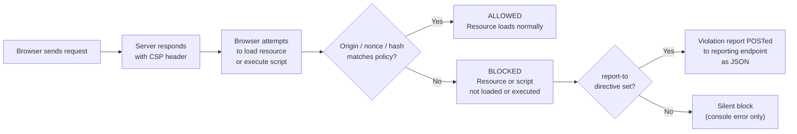

Content Security Policy (CSP) is an HTTP response header that instructs the browser about which origins are allowed to load resources and what can execute on a given page. It is the browser's built-in mechanism for limiting the blast radius of a cross-site scripting (XSS) attack: even if an attacker injects malicious script into your HTML, a correctly configured CSP can prevent that script from executing. CSP does not replace input sanitization or output encoding; those remain the first line of defense. CSP is the second line, containing the damage when the first line fails.

CSP is delivered as a single HTTP header with a semicolon-delimited list of directives. Each directive targets a specific resource type: `script-src` for JavaScript, `style-src` for CSS, `img-src` for images, `connect-src` for fetch and XMLHttpRequest, `font-src` for fonts, `frame-ancestors` to prevent clickjacking, `base-uri` to block base tag injection, and `form-action` to restrict where forms can submit. `default-src` acts as the fallback for any resource type not explicitly listed. Two directives are the exception: `base-uri` and `form-action` do NOT inherit from `default-src` and must always be set explicitly.

Two more directives matter for a policy that reflects current practice. `upgrade-insecure-requests` tells the browser to rewrite HTTP sub-resource requests to HTTPS automatically, closing mixed-content gaps that `frame-ancestors` and the allowlist directives do not cover. `require-trusted-types-for 'script'`, paired with a `trusted-types` policy allowlist, blocks DOM XSS sinks like `innerHTML` at the point of assignment rather than at the network boundary; it reached Baseline across all major browsers in February 2026 (Chrome/Edge since 2020, Safari 26, Firefox 2026), and [FEE-1203](./1203.md) covers how it integrates with CSP.

The gap between what CSP promises and what most deployed CSPs actually deliver is large. A policy that lists `unsafe-inline` in `script-src` provides no XSS protection at all. A policy delivered via a `<meta>` tag cannot enforce `frame-ancestors` or send violation reports. A policy built around a domain allowlist can often be bypassed through a compromised CDN or a JSONP endpoint on an allowlisted domain. Understanding the failure modes is as important as understanding the directives themselves.

## Design Thinking

### Why `unsafe-inline` defeats CSP entirely

The whole point of CSP `script-src` is to ensure that only scripts your server intentionally serves can execute. `'unsafe-inline'` tears that guarantee apart. When `'unsafe-inline'` is present without a nonce or hash, any inline script on the page is allowed, including one injected by an attacker through an XSS vulnerability. The browser has no way to distinguish between your inline script and the attacker's. You end up with a CSP header in your response and zero XSS protection.

The existence of a nonce or hash changes the equation: when a nonce is present in `script-src`, the `'unsafe-inline'` keyword is ignored entirely by browsers that support nonces. The nonce becomes the only gate that matters.

### Why report-only mode is non-negotiable before enforcing

A misconfigured CSP silently breaks legitimate scripts for real users. A single forgotten resource type, such as a third-party chat widget script, stops loading with no error message the user can act on. `Content-Security-Policy-Report-Only` is the only safe way to deploy a new policy: it reports violations without blocking anything, so you can iterate on the policy against real traffic before flipping it to enforcement. Deploying straight to enforcement means the first sign of a missed resource type is a broken feature for a real user.

### Why `strict-dynamic` is the modern approach

Domain allowlists fail in three ways:

1. **Allowlisted domains can load more scripts.** If `cdn.example.com` is on your allowlist and it serves a JSONP endpoint, an attacker can use that endpoint to inject arbitrary script. The CDN domain is trusted; its JSONP response is not.
2. **Third-party scripts load their own dependencies.** Your analytics script loads from `analytics.example.com`, which loads telemetry from `telemetry.example.com`, which you forgot to allowlist. Now analytics breaks, so you add `telemetry.example.com`, and the allowlist keeps growing with each new dependency.
3. **CDN URLs change.** A vendor switches from `cdn.vendor.com` to `assets.vendor.io`. You have to update your CSP header in production before you can push the update.

`'strict-dynamic'` solves this differently: once a script is loaded via a trusted nonce or hash, any scripts it dynamically creates and inserts into the DOM are also trusted. strict-dynamic derives trust from the nonce your server issued, so a CDN domain never has to appear in the policy.

### Why `base-uri 'none'` is easy to forget and expensive to omit

An attacker who can inject a `<base href="https://evil.example.com">` tag can rewrite the base for every relative URL on the page. This is a real risk even under a strict `script-src` policy: a nonce authorizes a script regardless of its origin, so a nonce-authorized `<script src="/main.js">` whose relative URL is rewritten by an injected base tag still executes, now loaded from the attacker's host. Form action targets are vulnerable the same way. `base-uri 'none'` closes this gap by blocking the base tag injection itself; pairing it with `form-action 'self'` closes the form-redirect variant.

## Best Practices

**MUST generate nonces correctly.** A nonce MUST be cryptographically random and MUST never be reused across requests. web.dev recommends ideally 128 or more bits of entropy; `crypto.randomBytes(16).toString('base64')` delivers exactly 128 bits. `crypto.randomUUID()` (Node 14.17+) is also acceptable in practice, though a UUIDv4 carries 122 bits of randomness once the fixed version and variant bits are excluded. Never derive nonces from request data (timestamps, user IDs, IPs): any deterministic function is vulnerable to prediction attacks.

**MUST set CSP via HTTP header, not a `<meta>` tag.** The `<meta http-equiv="Content-Security-Policy">` form exists but is limited in important ways. You MUST deliver CSP as an HTTP response header to ensure `frame-ancestors` and `report-to` work correctly:
- `frame-ancestors` is not supported in `<meta>` — it is silently ignored
- `report-to` and `report-uri` are not supported in `<meta>`
- A `<meta>` tag can only protect content that appears after it in the document; content before it is unprotected
- An attacker who can inject HTML before your `<meta>` tag can neutralize it

**SHOULD start from `default-src 'none'`.** You SHOULD begin with everything blocked and add only what the application needs. This forces you to think through every resource type. A policy that starts from `'self'` or a permissive default tends to accumulate exceptions silently.

**SHOULD test with csp-evaluator.withgoogle.com.** Paste your policy and check for High severity warnings. You SHOULD review all findings before shipping. Common findings: allowlisted domains with JSONP endpoints, `unsafe-inline` without nonces, missing `object-src`, missing `base-uri`.

**MUST deploy report-only first, always.** Even for policy updates to an already-enforcing policy, you MUST switch to report-only first in staging, then roll to production in report-only, collect data for at least a day or two, ideally spanning a full traffic cycle, then switch to enforcement.

### Rollout Strategy

A safe CSP rollout follows this sequence:

1. **Audit** — list every resource type and origin the application loads. Check network panels, HAR files, and third-party script documentation.
2. **Draft** — write the policy. Start from `default-src 'none'` and add each resource type with its allowed origins. Add nonce scaffolding.
3. **Report-only in staging** — deploy with `Content-Security-Policy-Report-Only`. Trigger every user flow: login, checkout, authenticated views, error states, email links.
4. **Fix violations** — for each violation, decide: move the script to an external file (preferred), add a nonce, compute a hash, or if truly unavoidable, add the origin (never a wildcard).
5. **Report-only in production** — roll the report-only header to production. Monitor the violation endpoint for at least a day or two, ideally spanning a full traffic cycle, across different browsers and geographies.
6. **Enforce** — flip from `Content-Security-Policy-Report-Only` to `Content-Security-Policy`. Keep `report-to` in place — enforcement violations are still reported.
7. **Monitor** — treat new violations in enforcement mode as bugs. A spike in reports often means a legitimate integration changed its resource loading behavior.

This sequence is not optional for customer-facing applications. Skip the report-only phase and production traffic becomes your test suite.

## How It Works



The check happens for every resource load and every script execution attempt. For inline scripts, the browser compares the nonce attribute value against the nonce in `script-src`. For inline scripts in a hash-based policy, the browser computes the SHA-256 of the script content and compares it against the hash in `script-src`. For external scripts, the browser checks the origin of the `src` URL against the allowed sources. `'strict-dynamic'` adds a propagation rule: a script that was allowed via nonce or hash may itself create and insert new script elements, and those are trusted transitively.

## Example

### 1. A complete CSP header with nonce and strict-dynamic

```http
Content-Security-Policy:
  default-src 'none';
  script-src 'nonce-GENERATED_NONCE_HERE' 'strict-dynamic';
  style-src 'self' 'nonce-GENERATED_NONCE_HERE';
  img-src 'self' data: https://cdn.example.com;
  font-src 'self' https://fonts.gstatic.com;
  connect-src 'self' https://api.example.com;
  frame-ancestors 'none';
  base-uri 'none';
  form-action 'self';
  report-to csp-endpoint;
```

`GENERATED_NONCE_HERE` is replaced per-request with the actual nonce value.

### 2. Generating a nonce in Next.js proxy and setting the CSP header

Examples 2 and 3 use Next.js App Router as a representative SSR runtime. Any server that executes code per request, such as an Express middleware function or a Fastify hook, can generate the nonce and set the header the same way: before the response is sent. Next.js 16 renamed the `middleware.ts` file convention and its exported `middleware` function to `proxy.ts` / `proxy`; `middleware.ts` still works but is deprecated and Edge-only.

```ts
// proxy.ts
import { NextResponse } from 'next/server';
import type { NextRequest } from 'next/server';

export function proxy(request: NextRequest) {
  const nonce = Buffer.from(crypto.randomUUID()).toString('base64');

  const csp = [
    `default-src 'none'`,
    `script-src 'nonce-${nonce}' 'strict-dynamic'`,
    `style-src 'self' 'nonce-${nonce}'`,
    `img-src 'self' data:`,
    `font-src 'self'`,
    `connect-src 'self'`,
    `frame-ancestors 'none'`,
    `base-uri 'none'`,
    `form-action 'self'`,
    `report-to csp-endpoint`,
  ].join('; ');

  const requestHeaders = new Headers(request.headers);
  requestHeaders.set('x-nonce', nonce);
  requestHeaders.set('Content-Security-Policy', csp);

  const response = NextResponse.next({ request: { headers: requestHeaders } });
  response.headers.set('Content-Security-Policy', csp);

  return response;
}

export const config = {
  matcher: [
    {
      // Skip Next.js internals, static files, and prefetch requests
      source: '/((?!_next/static|_next/image|favicon.ico).*)',
      missing: [
        { type: 'header', key: 'next-router-prefetch' },
        { type: 'header', key: 'purpose', value: 'prefetch' },
      ],
    },
  ],
};
```

### 3. Reading the nonce in a Next.js Server Component and passing it to Script

```tsx
// app/layout.tsx
import { headers } from 'next/headers';
import Script from 'next/script';

export default async function RootLayout({
  children,
}: {
  children: React.ReactNode;
}) {
  const nonce = (await headers()).get('x-nonce') ?? '';

  return (
    <html lang="en">
      <body>
        {children}
        {/* next/script with nonce: Next.js applies it to the generated tag */}
        <Script
          src="https://analytics.example.com/script.js"
          strategy="afterInteractive"
          nonce={nonce}
        />
      </body>
    </html>
  );
}
```

Next.js reads the nonce from the request header set by the proxy and applies it to `<script>` tags it renders during SSR.

### 4. Configuring a report-to endpoint

```http
Reporting-Endpoints: csp-endpoint="https://example.com/api/csp-reports"
Content-Security-Policy:
  default-src 'none';
  script-src 'nonce-NONCE' 'strict-dynamic';
  report-to csp-endpoint;
```

The browser POSTs a JSON array of report objects to the endpoint, with `Content-Type: application/reports+json`. Each item carries `age`, `type`, `url`, and `user_agent` alongside the CSP-specific `body`:

```json
[
  {
    "age": 53531,
    "type": "csp-violation",
    "url": "https://example.com/dashboard",
    "user_agent": "Mozilla/5.0 (Windows NT 10.0; Win64; x64) AppleWebKit/537.36 (KHTML, like Gecko) Chrome/127.0.0.0 Safari/537.36",
    "body": {
      "documentURL": "https://example.com/dashboard",
      "blockedURL": "inline",
      "effectiveDirective": "script-src-elem",
      "originalPolicy": "default-src 'none'; script-src 'nonce-abc123' 'strict-dynamic'; report-to csp-endpoint",
      "disposition": "enforce",
      "statusCode": 200
    }
  }
]
```

Keep `report-uri` alongside `report-to` for backward compatibility with browsers that do not yet support the Reporting API:

```http
Content-Security-Policy:
  default-src 'none';
  script-src 'nonce-NONCE' 'strict-dynamic';
  report-uri /api/csp-reports;
  report-to csp-endpoint;
```

### 5. Computing a CSP hash for a static inline script

If you have a static inline script that never changes (e.g., a small initialization snippet), compute its SHA-256 hash and include it in `script-src` instead of a nonce.

```ts
// build-time utility or Node.js REPL
import { createHash } from 'crypto';

const scriptContent = `window.__APP_VERSION__ = '1.0.0';`;

const hash = createHash('sha256')
  .update(scriptContent)
  .digest('base64');

console.log(`'sha256-${hash}'`);
// 'sha256-UOw65fU38NkMVZ5unKKQJg32RLUfOK99MdyOmCRu2Io='
```

Use the output directly in the CSP header:

```http
Content-Security-Policy:
  script-src 'sha256-UOw65fU38NkMVZ5unKKQJg32RLUfOK99MdyOmCRu2Io=' 'strict-dynamic';
  object-src 'none';
  base-uri 'none';
```

The hash must match the exact bytes of the script content, including whitespace. Even a trailing newline changes the hash and gets the script blocked.

## Common Mistakes

**Omitting `default-src`.**
Without `default-src`, any directive that is not explicitly listed has no restriction. `default-src 'none'` is the safest starting point: it gives you an explicit inventory of every resource type you allow.

**Using `*` (wildcard) in `script-src`.**
A wildcard in `script-src` allows any origin to serve scripts. This is equivalent to having no `script-src` at all. Even `https:` is too permissive: it allows any HTTPS URL, which includes many origins with JSONP endpoints that can be exploited.

**Forgetting `base-uri` and `form-action`.**
These two directives are not covered by `default-src`. If you omit them, they fall back to allowing everything, not to your `default-src` policy. This means an attacker can inject a `<base>` tag or a form pointing at an attacker-controlled server, and CSP will not stop it.

**Applying CSP only to HTML responses.**
API endpoints that set authentication cookies, or that redirect to sensitive pages, benefit from `frame-ancestors` and `form-action` restrictions even without a full resource policy. CSP headers on API responses are not commonly used but are not meaningless.

**Confusing `'none'` with missing directives.**
`frame-ancestors 'none'` explicitly forbids all embedding — this is what you want if your app should never be iframed. Omitting `frame-ancestors` entirely leaves the decision to the browser default, which permits embedding from same-origin and can be widened by legacy `X-Frame-Options` behavior. Be explicit: `'none'` means the directive is set and enforced; missing means the directive is absent and unprotected.

**Using nonces in static site generation (SSG) output.**
Nonces must be generated per-request on the server. If your build step generates HTML files that are served as static assets (no server-side rendering), nonces embedded at build time are identical for every visitor. A nonce that never changes provides no protection: an attacker who observes it once can reuse it in a crafted payload. Use hash-based CSP for static assets, or switch to SSR for pages that need nonce-based policies.

This consequence is sharper in the Next.js App Router specifically. Adopting nonce-based CSP forces every page that reads the nonce into dynamic rendering, which disables Static Site Generation, Incremental Static Regeneration, Partial Prerendering, and CDN edge caching for those routes. The proxy sets a fresh nonce on every request, so a page that reads it can no longer be prerendered at build time; some routes need an explicit `await connection()` call to opt into dynamic rendering. Where static optimization matters more than nonce-based script authorization, Next.js's experimental Subresource Integrity (SRI) support or a hash-based CSP keeps the page static.

## Related FEEs

- [FEE-1200: Security Overview](./1200.md) — category context and the frontend attack surface
- [FEE-1203: XSS Prevention](./1203.md) — CSP is the second line of defense after sanitization; Trusted Types integrates with CSP
- [FEE-1206: HTTPS, Secure Headers & Cookie Attributes](./1206.md) — CSP sits alongside HSTS, X-Content-Type-Options, and other security headers
- [FEE-1207: SSR & Server Component Security](./1207.md) — nonce generation in SSR middleware (Next.js, Nuxt)

## References

- [Content Security Policy — MDN Web Docs](https://developer.mozilla.org/en-US/docs/Web/HTTP/Guides/CSP)
- [CSP: script-src — MDN](https://developer.mozilla.org/en-US/docs/Web/HTTP/Reference/Headers/Content-Security-Policy/script-src)
- [Mitigate XSS with a strict Content Security Policy — web.dev](https://web.dev/articles/strict-csp)
- [CSP Evaluator — Google](https://csp-evaluator.withgoogle.com/)
- [Content Security Policy Level 3 — W3C](https://www.w3.org/TR/CSP3/)
- [Next.js CSP documentation](https://nextjs.org/docs/app/guides/content-security-policy)
