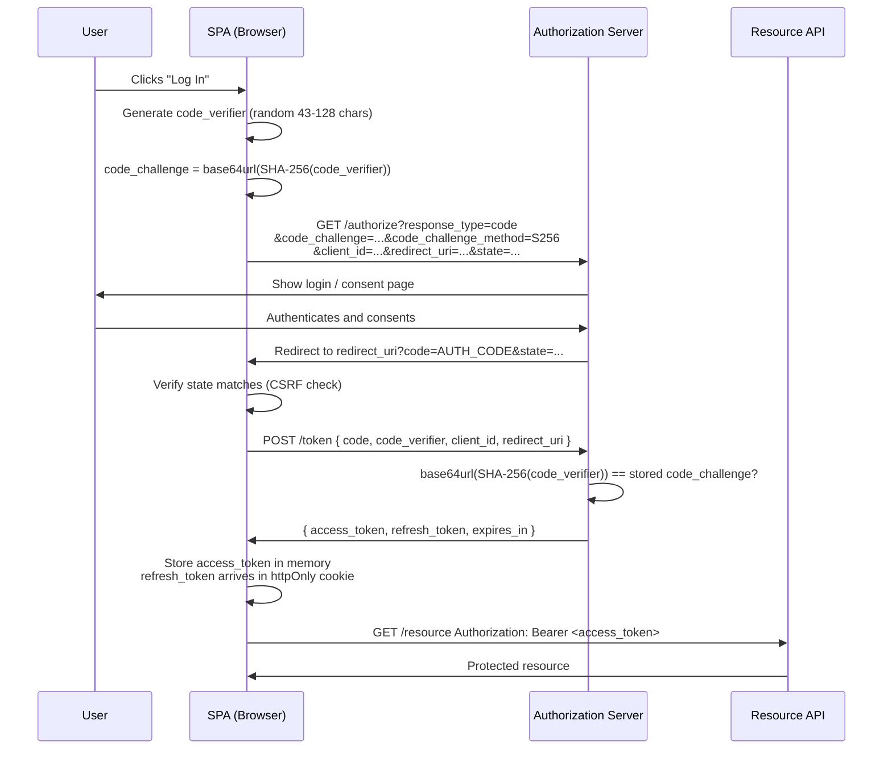

Authentication in browser-based applications is deceptively difficult. The browser environment is inherently hostile to secrets: JavaScript is executable by anyone who can load a resource on the page, the DOM is readable by injected scripts, and storage mechanisms like localStorage are accessible to every script on the origin — yours and an attacker's. The decisions made about where to store tokens, how to obtain them, and how to refresh them determine whether a user's session survives a supply chain compromise, a XSS vulnerability, or a stolen authorization code.

This article covers the mechanics of token-based authentication in SPAs: what JWTs are and how they work, where access tokens and refresh tokens should live in the browser, the OAuth 2.0 / OIDC Authorization Code Flow with PKCE (and why the implicit flow was retired), and the patterns that make session management resilient — refresh token rotation, silent refresh, and reuse detection.

## Design Thinking

### Why httpOnly cookies beat localStorage for tokens

`localStorage` is part of the browser's scripting environment. Every script on your origin — your own code, a third-party analytics snippet loaded from a CDN, a chat widget, a lazy-loaded A/B testing library — can call `localStorage.getItem('access_token')`. A single XSS vector anywhere on the page is sufficient to exfiltrate everything stored there. The attacker does not need to target your authentication code specifically; they need only inject a script that reads storage and sends it to a remote server.

`httpOnly` cookies have a different property: the browser does not expose them to JavaScript at all. The `document.cookie` API cannot read an `httpOnly` cookie. Neither can `localStorage.getItem`, `fetch`, or any other JavaScript API. The cookie travels in the `Cookie` request header, and only the server can set or read it. An XSS attack that compromises the JavaScript environment cannot directly steal an `httpOnly` cookie, no matter how deep the compromise goes.

The trade-off is that cookies require CSRF protection. Because the browser sends cookies automatically on every request to the matching origin, an attacker can forge authenticated requests from a third-party page using a `<form>` or `fetch`. `SameSite=Strict` (or `Lax`) largely mitigates this for modern browsers, but applications that need cross-site cookie sending require a separate CSRF token. See [FEE-1204](./1204.md) for the full treatment of CSRF.

### Why PKCE is mandatory for SPAs

SPAs are public clients. They cannot maintain a secret — any value embedded in a JavaScript bundle can be extracted by anyone who loads the page. The traditional OAuth 2.0 `client_secret` flow assumes a confidential client (a server that keeps the secret on the server side), which SPAs are not.

PKCE solves this without requiring a static secret. The client generates a `code_verifier` — a random string — and derives a `code_challenge` from it by applying SHA-256 and base64url encoding. The challenge goes to the authorization server in the initial request. When the client later exchanges the authorization code for tokens, it also sends the `code_verifier`. The server recomputes the challenge and verifies that it matches. An attacker who intercepts the authorization code cannot exchange it for tokens because they do not have the original `code_verifier` — it was only ever in the client's memory. The code_verifier is per-request and ephemeral; it is not a static secret that can be embedded in a bundle.

### Why the implicit flow was retired

The implicit flow returned tokens directly in the URL fragment (`#access_token=...`). This caused tokens to appear in browser history, server access logs, `Referer` headers sent to third-party resources, and any logging middleware. The fragment is also accessible to all scripts on the page via `location.hash`. The implicit flow provided no meaningful security advantage over the Authorization Code flow while introducing multiple token leakage vectors. The OAuth 2.0 Security Best Current Practices (RFC 9700) and the OAuth 2.0 for Browser-Based Applications draft both formally deprecate it.

### Why in-memory + silent refresh is the highest-security SPA pattern

In-memory storage — a module-scoped variable or React context, not `localStorage` or `sessionStorage` — keeps the access token off any persistent or shared storage medium. It cannot be read by other scripts because module scope is not globally accessible. It is not persisted across tabs. A XSS attack cannot exfiltrate it through any standard API (though a deep enough compromise of the JS environment could).

The trade-off is that in-memory tokens do not survive page refreshes. Silent refresh addresses this: when the access token is approaching expiry (at roughly 75-80% of its lifetime), the application makes a background request to the token endpoint using a `httpOnly` refresh token cookie. This happens invisibly. On a fresh page load or new tab, the application performs a silent refresh immediately on startup to restore the session without requiring a full login redirect.

The complexity cost is real: silent refresh requires careful scheduling, error handling for expired refresh tokens, and coordination across tabs. For applications where this complexity is justified, it is the strongest token storage pattern available for a browser environment.

### Why JWT payload being readable is not a bug

A JWT is signed, not encrypted. The header and payload are base64url encoded — not obfuscated, not encrypted. Anyone can decode them in their browser's DevTools, in jwt.io, or with a one-liner in Node.js. The signature guarantees integrity: it proves the token was issued by a server that holds the signing key and has not been tampered with since. It does not guarantee confidentiality. Sensitive claims — personally identifiable information, internal permission structures, anything that should not be readable by anyone with access to the token — should not be placed in JWTs. Use opaque session identifiers for high-sensitivity data and look up the sensitive fields server-side.

## Best Practices

**SHOULD set short access token lifetimes.** 15 minutes is a widely adopted default. A shorter lifetime limits the window during which a stolen access token can be used. You SHOULD adjust based on your refresh mechanism: if silent refresh is in place, 15 minutes is comfortable; if the user must re-authenticate to renew, a longer lifetime may be necessary for usability.

**MUST rotate refresh tokens on every use.** Each time a refresh token is used to obtain a new access token, you MUST issue a new refresh token and invalidate the previous one. This limits the replay window for a stolen refresh token: if an attacker obtains and uses a refresh token, the legitimate client's next refresh attempt will fail with the old token. The server MUST detect reuse — if an already-invalidated refresh token is presented, it indicates potential compromise and all tokens for that user MUST be invalidated, forcing re-authentication.

**SHOULD schedule silent refresh proactively.** You SHOULD attempt the refresh at 75-80% of the access token's lifetime, not after it has expired. An expired access token during a background refresh request causes a visible authentication failure. Renewing early ensures continuity and gives room for retries if the first attempt fails.

**MUST set all cookie security attributes.** For `httpOnly` refresh token cookies: `HttpOnly` (no JS access), `Secure` (HTTPS only), `SameSite=Strict` or `SameSite=Lax` (CSRF mitigation), `Path` scoped to the token endpoint (`/auth/token`), and `Max-Age` appropriate for the refresh token lifetime. You MUST never omit `Secure` on a production cookie.

**MUST validate the JWT server-side on every request.** Check `exp` (is the token expired?), `iss` (is this token from the expected issuer?), and `aud` (is this token intended for this service?). You MUST NOT cache the validation result — a token that was valid on the last request may have been revoked or expired in the interim. You MUST explicitly specify the expected signing algorithm in your verification code; never allow the algorithm to be taken from the token header (this is the "algorithm confusion" attack vector).

**MUST NOT log tokens.** Access tokens and refresh tokens MUST NOT appear in application logs, error tracking payloads (Sentry breadcrumbs, Datadog traces), analytics events, or any other observability pipeline. A token in a log is a token exposed to everyone with log access. You MUST review error handlers and request interceptors for accidental token logging, particularly in Authorization header values.

**MUST rotate session identifiers on login.** When a user authenticates, you MUST issue a new session identifier even if one already exists. This prevents session fixation attacks where an attacker pre-seeds a known session ID and waits for a victim to authenticate into it.

## How It Works

The PKCE flow for a SPA authenticating via an external OAuth 2.0 / OIDC authorization server:



## Example

### 1. PKCE flow — generating verifier, challenge, and exchanging the code

```ts
// pkce.ts — utilities for PKCE flow

/**
 * Generate a cryptographically random code_verifier.
 * RFC 7636 requires 43-128 characters from the unreserved character set.
 */
export function generateCodeVerifier(): string {
  const array = new Uint8Array(32); // 32 bytes → 43-char base64url output
  crypto.getRandomValues(array);
  return base64urlEncode(array);
}

/**
 * Derive code_challenge from code_verifier using S256 method.
 * code_challenge = BASE64URL(SHA-256(ASCII(code_verifier)))
 */
export async function generateCodeChallenge(verifier: string): Promise<string> {
  const encoder = new TextEncoder();
  const data = encoder.encode(verifier);
  const hash = await crypto.subtle.digest('SHA-256', data);
  return base64urlEncode(new Uint8Array(hash));
}

function base64urlEncode(buffer: Uint8Array): string {
  return btoa(String.fromCharCode(...buffer))
    .replace(/\+/g, '-')
    .replace(/\//g, '_')
    .replace(/=/g, '');
}

// auth.ts — initiating and completing the PKCE flow

const AUTH_SERVER = 'https://auth.example.com';
const CLIENT_ID = 'my-spa-client';
const REDIRECT_URI = 'https://app.example.com/callback';

export async function initiateLogin(): Promise<void> {
  const verifier = generateCodeVerifier();
  const challenge = await generateCodeChallenge(verifier);

  // State prevents CSRF on the redirect
  const state = base64urlEncode(crypto.getRandomValues(new Uint8Array(16)));

  // Store verifier and state in sessionStorage only for the duration of the flow
  // (they are short-lived and only needed during the redirect round-trip)
  sessionStorage.setItem('pkce_verifier', verifier);
  sessionStorage.setItem('oauth_state', state);

  const params = new URLSearchParams({
    response_type: 'code',
    client_id: CLIENT_ID,
    redirect_uri: REDIRECT_URI,
    code_challenge: challenge,
    code_challenge_method: 'S256',
    state,
    scope: 'openid profile email',
  });

  window.location.href = `${AUTH_SERVER}/authorize?${params}`;
}

export async function handleCallback(
  searchParams: URLSearchParams
): Promise<{ accessToken: string }> {
  const code = searchParams.get('code');
  const state = searchParams.get('state');
  const storedState = sessionStorage.getItem('oauth_state');
  const verifier = sessionStorage.getItem('pkce_verifier');

  // Clean up immediately — these are single-use
  sessionStorage.removeItem('pkce_verifier');
  sessionStorage.removeItem('oauth_state');

  if (!code || !state || !verifier) {
    throw new Error('Missing PKCE parameters in callback');
  }

  // Verify state to prevent CSRF on the redirect
  if (state !== storedState) {
    throw new Error('State mismatch — possible CSRF attack');
  }

  const response = await fetch(`${AUTH_SERVER}/token`, {
    method: 'POST',
    headers: { 'Content-Type': 'application/x-www-form-urlencoded' },
    body: new URLSearchParams({
      grant_type: 'authorization_code',
      code,
      code_verifier: verifier,
      client_id: CLIENT_ID,
      redirect_uri: REDIRECT_URI,
    }),
    credentials: 'include', // Allow the server to set httpOnly refresh token cookie
  });

  if (!response.ok) {
    throw new Error('Token exchange failed');
  }

  const { access_token } = await response.json();
  // access_token goes to memory; refresh_token is in the httpOnly cookie set by the server
  return { accessToken: access_token };
}
```

### 2. In-memory token store with silent refresh

```ts
// token-store.ts — in-memory access token with background refresh

let accessToken: string | null = null;
let refreshTimer: ReturnType<typeof setTimeout> | null = null;

const TOKEN_ENDPOINT = '/auth/token';

export function setAccessToken(token: string, expiresIn: number): void {
  accessToken = token;
  scheduleRefresh(expiresIn);
}

export function getAccessToken(): string | null {
  return accessToken;
}

export function clearAccessToken(): void {
  accessToken = null;
  if (refreshTimer !== null) {
    clearTimeout(refreshTimer);
    refreshTimer = null;
  }
}

/**
 * Schedule a silent refresh at 80% of the token lifetime.
 * expiresIn is in seconds (standard OAuth 2.0 response field).
 */
function scheduleRefresh(expiresIn: number): void {
  if (refreshTimer !== null) clearTimeout(refreshTimer);

  // Refresh at 80% of lifetime — gives a 20% buffer before expiry
  const refreshAt = expiresIn * 0.8 * 1000; // convert to ms

  refreshTimer = setTimeout(async () => {
    await silentRefresh();
  }, refreshAt);
}

/**
 * Silently obtain a new access token using the httpOnly refresh token cookie.
 * The browser sends the cookie automatically — no JS access to the refresh token.
 */
export async function silentRefresh(): Promise<boolean> {
  try {
    const response = await fetch(TOKEN_ENDPOINT, {
      method: 'POST',
      headers: { 'Content-Type': 'application/x-www-form-urlencoded' },
      body: new URLSearchParams({ grant_type: 'refresh_token' }),
      credentials: 'include', // sends the httpOnly refresh token cookie
    });

    if (!response.ok) {
      // Refresh token expired or revoked — user must re-authenticate
      clearAccessToken();
      return false;
    }

    const { access_token, expires_in } = await response.json();
    setAccessToken(access_token, expires_in);
    return true;
  } catch {
    clearAccessToken();
    return false;
  }
}

/**
 * Restore session on page load / new tab.
 * Attempts a silent refresh immediately; returns true if a valid session exists.
 */
export async function restoreSession(): Promise<boolean> {
  return silentRefresh();
}
```

### 3. httpOnly cookie setup on the server side

```ts
// Server-side (Node.js / Express) — issuing tokens after successful exchange

import { Response } from 'express';

interface TokenPair {
  accessToken: string;
  refreshToken: string;
  accessTokenExpiresIn: number; // seconds
  refreshTokenExpiresIn: number; // seconds
}

function issueTokens(res: Response, tokens: TokenPair): void {
  // Refresh token → httpOnly cookie, not in response body
  res.cookie('refresh_token', tokens.refreshToken, {
    httpOnly: true,       // not accessible to JavaScript
    secure: true,         // HTTPS only — never send over plain HTTP
    sameSite: 'strict',   // no cross-site sending — mitigates CSRF
    path: '/auth/token',  // scope cookie to token endpoint only
    maxAge: tokens.refreshTokenExpiresIn * 1000, // convert to ms
  });

  // Access token → response body only (client stores in memory)
  res.json({
    access_token: tokens.accessToken,
    token_type: 'Bearer',
    expires_in: tokens.accessTokenExpiresIn,
    // NOTE: refresh_token intentionally omitted from body
  });
}

// Refresh endpoint — reads httpOnly cookie, issues new token pair (rotation)
async function handleRefresh(req: any, res: Response): Promise<void> {
  const refreshToken = req.cookies['refresh_token'];

  if (!refreshToken) {
    res.status(401).json({ error: 'no_refresh_token' });
    return;
  }

  const result = await tokenService.rotateRefreshToken(refreshToken);

  if (result.status === 'reuse_detected') {
    // Stolen refresh token reuse — invalidate entire session family
    await tokenService.revokeAllForUser(result.userId);
    res.clearCookie('refresh_token', { path: '/auth/token' });
    res.status(401).json({ error: 'token_family_compromised' });
    return;
  }

  if (result.status === 'invalid') {
    res.clearCookie('refresh_token', { path: '/auth/token' });
    res.status(401).json({ error: 'invalid_refresh_token' });
    return;
  }

  issueTokens(res, result.tokens);
}
```

### 4. JWT validation server-side

```ts
// jwt-validation.ts — validate every inbound JWT on the server

import { jwtVerify, createRemoteJWKSet } from 'jose';

const JWKS_URI = 'https://auth.example.com/.well-known/jwks.json';
const EXPECTED_ISSUER = 'https://auth.example.com';
const EXPECTED_AUDIENCE = 'https://api.example.com';

// Cache the JWKS fetcher — it handles key rotation automatically
const JWKS = createRemoteJWKSet(new URL(JWKS_URI));

interface ValidatedClaims {
  sub: string;
  iss: string;
  aud: string | string[];
  exp: number;
  iat: number;
  [key: string]: unknown;
}

/**
 * Validate an access token JWT.
 * Throws if the token is invalid, expired, wrong issuer, or wrong audience.
 * NEVER catches these errors silently — a throw means the request is unauthorized.
 */
export async function validateAccessToken(token: string): Promise<ValidatedClaims> {
  const { payload } = await jwtVerify(token, JWKS, {
    issuer: EXPECTED_ISSUER,     // validates iss claim
    audience: EXPECTED_AUDIENCE, // validates aud claim
    algorithms: ['RS256'],       // explicitly pin the algorithm — never trust the header
    // jose automatically validates exp (throws if expired)
  });

  return payload as ValidatedClaims;
}

// Express middleware
export async function requireAuth(req: any, res: any, next: any): Promise<void> {
  const authHeader = req.headers['authorization'];

  if (!authHeader?.startsWith('Bearer ')) {
    res.status(401).json({ error: 'missing_token' });
    return;
  }

  const token = authHeader.slice(7);

  try {
    req.user = await validateAccessToken(token);
    next();
  } catch (err) {
    // Do not log the token value — only log the error type
    const message = err instanceof Error ? err.message : 'unknown';
    res.status(401).json({ error: 'invalid_token', detail: message });
  }
}
```

## Common Mistakes

**Storing JWTs in localStorage "because they are signed."** Signing prevents tampering, not theft. A stolen signed token is fully valid — the server has no way to distinguish the legitimate user from an attacker presenting their token. The signature is not a theft prevention mechanism; it is an integrity mechanism.

**Using the same token for authentication and CSRF protection.** A CSRF token must be separate from the authentication credential. If you store the access token in a cookie, you need an additional CSRF token that JavaScript can read (stored in a non-httpOnly cookie or in-memory) to send as a request header. Sending the access token itself as a CSRF header defeats the purpose: an attacker who can read the access token can forge the CSRF header too.

**Using the implicit flow "because the documentation was written in 2016."** Legacy guides and older provider documentation still describe the implicit flow. It is deprecated in all current OAuth 2.0 security documents. Implement PKCE; any OAuth provider that does not support PKCE should not be used for new SPA integrations.

## Related FEEs

- [FEE-1200: Security Overview](./1200.md) — category context and the frontend attack surface
- [FEE-1203: XSS Prevention](./1203.md) — XSS is the primary mechanism for localStorage token theft
- [FEE-1204: CORS & CSRF](./1204.md) — cookie-based auth requires CSRF protection; SameSite cookie interaction
- [FEE-1206: HTTPS, Secure Headers & Cookie Attributes](./1206.md) — Secure, HttpOnly, SameSite cookie attributes for session cookies
- [FEE-1207: SSR & Server Component Security](./1207.md) — cookie forwarding in SSR fetch calls and token validation in server components

## References

- [OAuth 2.0 for Browser-Based Apps — IETF Draft](https://datatracker.ietf.org/doc/html/draft-ietf-oauth-browser-based-apps)
- [Proof Key for Code Exchange — RFC 7636](https://datatracker.ietf.org/doc/html/rfc7636)
- [OAuth 2.0 Security Best Current Practices — RFC 9700](https://datatracker.ietf.org/doc/html/rfc9700)
- [OWASP: Session Management Cheat Sheet](https://cheatsheetseries.owasp.org/cheatsheets/Session_Management_Cheat_Sheet.html)
- [OWASP: JSON Web Token Cheat Sheet](https://cheatsheetseries.owasp.org/cheatsheets/JSON_Web_Token_for_Java_Cheat_Sheet.html)
- [JWT — jwt.io Introduction](https://www.jwt.io/introduction)
