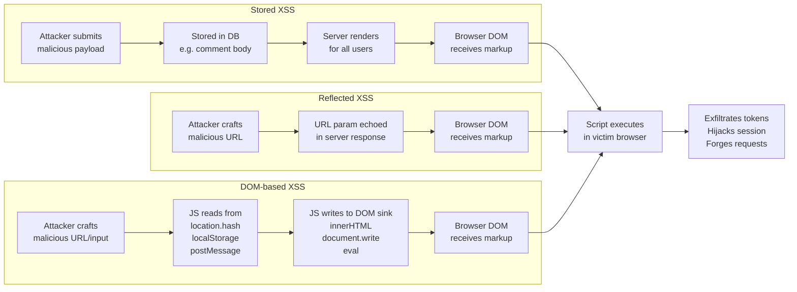

Cross-site scripting (XSS) is the most prevalent client-side vulnerability class in web applications. An attacker who achieves XSS can execute arbitrary JavaScript in the victim's browser under the application's origin: reading tokens from localStorage, exfiltrating cookies that are not `httpOnly`, forging authenticated requests, hijacking sessions, and rewriting the page. The attack surface is not limited to forms and comment boxes — any path from attacker-controlled data to a DOM sink is a potential XSS vector.

Frameworks like React and Vue have made many common patterns safer by auto-escaping text nodes. But they have not eliminated XSS — they have relocated it. The remaining risk is concentrated in the escape hatches developers reach for when they need to render rich text: `dangerouslySetInnerHTML` in React, `v-html` in Vue, and direct `innerHTML` assignment in vanilla JavaScript. Every use of these APIs with unsanitized input is an active XSS vulnerability.

This article covers the three XSS types, how modern frameworks protect (and do not protect) against them, how to use DOMPurify correctly, which DOM sinks to avoid, and how the Trusted Types API provides browser-level enforcement to catch every unsafe sink assignment at runtime.

## Principle

- **MUST** sanitize all user-generated HTML with DOMPurify before passing it to `dangerouslySetInnerHTML`, `v-html`, or `innerHTML`
- **MUST NOT** use `dangerouslySetInnerHTML` or `v-html` with unsanitized input under any circumstances
- **SHOULD** validate URL protocols before assigning to `href`, `src`, or `action` attributes — allowlist `https:`, `http:`, and `mailto:`; reject `javascript:` and `data:`
- **SHOULD** adopt Trusted Types via CSP `require-trusted-types-for 'script'` starting in report-only mode

## Design Thinking

### Why frameworks do not make you XSS-proof

React's JSX and Vue's template syntax auto-escape text node interpolations by design. When you write `{userInput}` in React or use the equivalent in Vue templates, the framework treats the value as text and never as markup. This prevents the straightforward case: `<script>alert(1)</script>` in user input will appear as literal text on the page, not execute.

The escape hatch — `dangerouslySetInnerHTML={{ __html: userInput }}` in React, `v-html="userInput"` in Vue — bypasses this protection entirely. The API name `dangerouslySetInnerHTML` is the clearest warning in any frontend API: the word "dangerously" is load-bearing. Using it with unsanitized input is equivalent to writing `element.innerHTML = userInput` directly. Vue's `v-html` carries the same risk without the name making it as obvious.

The real-world failure pattern is predictable: the team ships a feature that renders user-submitted rich text (a bio, a comment, a product description). The default framework escaping breaks the rich text, so they reach for `v-html` or `dangerouslySetInnerHTML`. The developer does not sanitize the input because they assume the framework has already handled security. The application now has a stored XSS vulnerability on that rendered field.

Third-party libraries compound this. A rich text editor library, a markdown renderer, a chart library — any of them may use `innerHTML` internally without documenting it. The framework's text-escaping applies only to content you render through JSX or template syntax; it cannot protect content that bypasses it through a library's internal DOM operations.

### Why DOMPurify is the standard

Naive approaches to HTML sanitization use a denylist: find and remove `<script>` tags, strip `onerror` attributes. This approach is trivially bypassed. HTML parsing is complex, browsers have quirks, and there are dozens of ways to achieve script execution:

- `<scr<script>ipt>alert(1)</scr</script>ipt>` — the inner `<script>` tag is exposed after the outer one is stripped
- `` — event handler on an innocuous element
- `<svg/onload=alert(1)>` — SVG with inline handler
- `<a href="javascript:alert(1)">click me</a>` — javascript: protocol
- `<math href="javascript:alert(1)">` — MathML namespace confusion

DOMPurify uses an allowlist model: it defines which elements and attributes are permitted, parses the input using the browser's own HTML parser, and removes everything not on the list. Only explicitly permitted tags and attributes survive. A denylist has to anticipate every possible encoding trick; an allowlist only has to define what it wants to allow.

DOMPurify also handles mutation XSS (mXSS) — a class of attacks where HTML that appears safe at parse time mutates into something dangerous when re-serialized and re-parsed. This happens because different browser contexts (e.g., a `<table>` context vs. a `<div>` context) parse the same markup differently. DOMPurify's use of the browser's own parser mitigates this class of attacks. It also handles SVG and MathML namespace confusion attacks that allow malicious content to be introduced through foreign content contexts.

### Why Trusted Types is the future

Trusted Types is a browser API that enforces a policy at the DOM level. When the CSP directive `require-trusted-types-for 'script'` is active, the browser throws a `TypeError` on any attempt to assign a plain string to a dangerous DOM sink — `innerHTML`, `outerHTML`, `insertAdjacentHTML`, `document.write`, and others. The assignment must go through a registered `TrustedTypePolicy` that returns a `TrustedHTML` object.

The practical effect is a complete audit of every unsafe sink in the codebase at runtime. Before enforcement mode, `report-only` mode sends a CSP report for each violation without blocking execution — this lets you discover all the unsafe assignments in production code, including those in third-party libraries, before turning on blocking.

Once you create a policy that routes through DOMPurify (`trustedTypes.createPolicy('default', { createHTML: input => DOMPurify.sanitize(input) })`), you have defense-in-depth: DOMPurify sanitizes the content, and the browser enforces that every sink assignment went through a policy. An injection that bypasses one layer (a misconfigured DOMPurify call) is blocked by the other.

### Why sanitizing at render time beats sanitizing at input time

Sanitizing user input at the point where it enters the application (form submission, API call) seems appealing — clean data once, trust it everywhere. This breaks down in practice for several reasons:

The same stored value may be used in multiple output contexts: HTML, SQL, shell commands, JSON, log entries. Each context requires different escaping. HTML-safe output may still be SQL-injectable. A centralized input sanitizer optimized for HTML could strip content that is legitimate in other contexts.

Input sanitization may be bypassed. A direct database import, an admin tool, a migration script, a third-party integration — data can enter the system through paths that skip the input validation layer.

Stored data should be trusted only as data, not as safe HTML. Sanitize at the point of rendering, in the output context where you know exactly what escaping is required.

## Best Practices

**Configure DOMPurify with the most restrictive allowlist the application needs.** If the feature only requires bold, italic, and links, configure exactly that: `ALLOWED_TAGS: ['b', 'i', 'a', 'p', 'br']` and `ALLOWED_ATTR: ['href']`. Every additional permitted tag and attribute expands the attack surface. Do not start with a permissive configuration and restrict later — start restricted and expand as needed.

**Use `RETURN_DOM_FRAGMENT` with `appendChild` instead of `innerHTML` assignment for extra safety.** `DOMPurify.sanitize(input, { RETURN_DOM_FRAGMENT: true })` returns a `DocumentFragment` that can be appended to the target element. This avoids the `innerHTML` assignment entirely, which is the mechanism that executes scripts during HTML parsing.

**Validate URL protocols explicitly before assigning to `href`, `src`, or `action`.** Parse the URL with `new URL(userUrl)` and check `.protocol` against an allowlist of `['https:', 'http:', 'mailto:']`. DOMPurify's default configuration strips `javascript:` URLs in `href` attributes, but explicit validation at the point of use is a separate layer of defense for cases where the URL is not going through DOMPurify at all.

**Adopt Trusted Types in report-only mode first.** This mirrors the CSP rollout pattern. Set `Content-Security-Policy-Report-Only: require-trusted-types-for 'script'` and collect violation reports. Every report identifies an unsafe DOM sink that needs to be routed through a policy. Only switch to enforcement mode after the violation rate reaches zero in production.

**Create a single Trusted Types policy and route all HTML through it.** A single named policy that wraps DOMPurify creates a single point of control — you can audit, update, and test one function. Multiple policies distributed across the codebase create the same maintenance problem as multiple sanitization implementations.

**Do not use `textContent` and `innerHTML` interchangeably.** `textContent` assigns a text value — it is always safe. `innerHTML` parses HTML — it executes scripts. Switching from `textContent` to `innerHTML` "for performance" or "to avoid double-escaping" introduces XSS. They are different APIs for different purposes.

## How It Works

The three XSS types and their paths to script execution:



DOM-based XSS is notable because it never involves the server. The payload travels from the URL or another browser-side source directly to a DOM sink through JavaScript code. Server-side sanitization provides no protection against it.

## Example

### 1. Dangerous pattern vs. safe pattern — React

```tsx
import DOMPurify from 'dompurify';

// UNSAFE — dangerouslySetInnerHTML with raw user input
// If userBio contains , it executes
function UnsafeBio({ userBio }: { userBio: string }) {
  return (
    <div
      dangerouslySetInnerHTML={{ __html: userBio }}
    />
  );
}

// SAFE — sanitize with DOMPurify before passing to dangerouslySetInnerHTML
function SafeBio({ userBio }: { userBio: string }) {
  const sanitizedHtml = DOMPurify.sanitize(userBio, {
    ALLOWED_TAGS: ['b', 'i', 'em', 'strong', 'a', 'p', 'br'],
    ALLOWED_ATTR: ['href'],
  });

  return (
    <div
      dangerouslySetInnerHTML={{ __html: sanitizedHtml }}
    />
  );
}

// BETTER — use RETURN_DOM_FRAGMENT to avoid innerHTML assignment
function SaferBio({ userBio }: { userBio: string }) {
  const containerRef = React.useRef<HTMLDivElement>(null);

  React.useEffect(() => {
    if (!containerRef.current) return;

    // Clear previous content
    containerRef.current.textContent = '';

    const fragment = DOMPurify.sanitize(userBio, {
      ALLOWED_TAGS: ['b', 'i', 'em', 'strong', 'a', 'p', 'br'],
      ALLOWED_ATTR: ['href'],
      RETURN_DOM_FRAGMENT: true,
    }) as DocumentFragment;

    containerRef.current.appendChild(fragment);
  }, [userBio]);

  return <div ref={containerRef} />;
}
```

### 2. DOMPurify with a strict allowlist

```ts
import DOMPurify from 'dompurify';

// Configure once for the application's rich-text use case.
// ALLOWED_TAGS and ALLOWED_ATTR define the allowlist — anything not listed is stripped.
const RICH_TEXT_CONFIG: DOMPurify.Config = {
  ALLOWED_TAGS: ['p', 'br', 'b', 'i', 'em', 'strong', 'a', 'ul', 'ol', 'li', 'blockquote'],
  ALLOWED_ATTR: ['href', 'rel'],
  // Force all links to open in a new tab safely
  // (handled via hook below, not as an attribute)
};

// DOMPurify hook: run after sanitization, before returning the result.
// This allows custom transformations on elements that survived the allowlist.
DOMPurify.addHook('afterSanitizeAttributes', (node) => {
  // For every <a> element, enforce rel="noopener noreferrer" and target="_blank"
  // to prevent tab-napping attacks via window.opener
  if (node.tagName === 'A') {
    node.setAttribute('target', '_blank');
    node.setAttribute('rel', 'noopener noreferrer');
  }
});

/**
 * Sanitize user-submitted HTML for rendering in a rich text context.
 * Returns a safe HTML string.
 */
export function sanitizeRichText(input: string): string {
  return DOMPurify.sanitize(input, RICH_TEXT_CONFIG) as string;
}

/**
 * Sanitize and return a DocumentFragment for direct DOM insertion.
 * Avoids innerHTML assignment entirely.
 */
export function sanitizeToFragment(input: string): DocumentFragment {
  return DOMPurify.sanitize(input, {
    ...RICH_TEXT_CONFIG,
    RETURN_DOM_FRAGMENT: true,
  }) as DocumentFragment;
}
```

### 3. URL protocol validation helper

```ts
/** Protocols considered safe for use in href and src attributes. */
const SAFE_URL_PROTOCOLS = new Set(['https:', 'http:', 'mailto:']);

/**
 * Validate a user-supplied URL for use in href, src, or action attributes.
 * Returns the URL string if safe, or null if the protocol is disallowed.
 *
 * Rejects javascript:, data:, vbscript:, and any other non-allowlisted protocol.
 *
 * @example
 * validateUrl('https://example.com') // → 'https://example.com'
 * validateUrl('javascript:alert(1)') // → null
 * validateUrl('data:text/html,<script>') // → null
 */
export function validateUrl(rawUrl: string): string | null {
  try {
    const url = new URL(rawUrl);
    if (SAFE_URL_PROTOCOLS.has(url.protocol)) {
      return url.toString();
    }
    return null;
  } catch {
    // URL parsing failed — not a valid absolute URL
    // Allow relative URLs only if they start with / or ./
    if (rawUrl.startsWith('/') || rawUrl.startsWith('./')) {
      return rawUrl;
    }
    return null;
  }
}

// Usage in a component
function ExternalLink({ href, children }: { href: string; children: React.ReactNode }) {
  const safeHref = validateUrl(href);
  if (!safeHref) {
    // Attacker-supplied javascript: URL — render as plain text, not a link
    return <span>{children}</span>;
  }
  return (
    <a href={safeHref} rel="noopener noreferrer" target="_blank">
      {children}
    </a>
  );
}
```

### 4. Trusted Types policy wrapping DOMPurify

```ts
import DOMPurify from 'dompurify';

/**
 * Create a Trusted Types policy that routes all HTML through DOMPurify.
 * The 'default' policy name is applied automatically when a plain string
 * is assigned to a DOM sink — it is the fallback policy.
 *
 * Browser support: Chrome 83+, Edge 83+.
 * For Firefox and Safari: use the @w3c/trusted-types polyfill.
 */
function createTrustedTypesPolicy(): TrustedTypePolicy | null {
  if (typeof window === 'undefined' || !window.trustedTypes) {
    return null; // SSR or unsupported browser
  }

  try {
    return window.trustedTypes.createPolicy('default', {
      createHTML(input: string): string {
        return DOMPurify.sanitize(input, {
          ALLOWED_TAGS: ['p', 'br', 'b', 'i', 'em', 'strong', 'a', 'ul', 'ol', 'li'],
          ALLOWED_ATTR: ['href', 'rel', 'target'],
        }) as string;
      },
      // createScript and createScriptURL are intentionally omitted —
      // we do not want to allow arbitrary script creation.
    });
  } catch {
    // Policy may already be registered in some environments
    return null;
  }
}

// Initialize once at application startup
export const trustedTypesPolicy = createTrustedTypesPolicy();

/**
 * Create a TrustedHTML value for assignment to innerHTML.
 * Falls back to DOMPurify output as a string in unsupported environments.
 *
 * With Trusted Types active, the browser will throw a TypeError on any
 * innerHTML assignment that does not use a TrustedHTML value — this
 * function is the one approved path.
 */
export function createSafeHtml(input: string): TrustedHTML | string {
  if (trustedTypesPolicy) {
    return trustedTypesPolicy.createHTML(input);
  }
  // Fallback: sanitize and return string (no Trusted Types enforcement)
  return DOMPurify.sanitize(input) as string;
}
```

Enable the CSP header on your server:

```http
# Report-only first — collect violations without blocking
Content-Security-Policy-Report-Only: require-trusted-types-for 'script'; report-uri /csp-report

# Switch to enforcement after violations reach zero
Content-Security-Policy: require-trusted-types-for 'script'
```

### 5. Vue `v-html` with sanitization

```vue
<script setup lang="ts">
import { computed } from 'vue';
import DOMPurify from 'dompurify';

const props = defineProps<{
  content: string;
}>();

// Sanitize reactively — re-runs whenever content changes
const safeContent = computed(() =>
  DOMPurify.sanitize(props.content, {
    ALLOWED_TAGS: ['b', 'i', 'em', 'strong', 'a', 'p', 'br', 'ul', 'ol', 'li'],
    ALLOWED_ATTR: ['href', 'rel'],
  })
);
</script>

<template>
  <!--
    v-html bypasses Vue's template escaping.
    ALWAYS bind sanitized content — never the raw prop.

    UNSAFE:  v-html="content"
    SAFE:    v-html="safeContent"
  -->
  <div v-html="safeContent" />
</template>
```

## Common Mistakes

**Sanitizing on the server but not on the client.** DOM-based XSS happens entirely in the browser. The payload originates from `location.hash`, `location.search`, `localStorage`, `postMessage`, or a URL parameter — it is read by JavaScript and written to a DOM sink without ever touching the server. Server-side sanitization provides zero protection against this attack class. Every dangerous DOM write must be sanitized client-side, at the point of the DOM operation.

**Using a denylist (removing `<script>` tags).** A denylist must enumerate every possible dangerous construct. The set is not enumerable — parsers are complex, HTML is forgiving, and attackers have been finding bypasses for decades. Some bypasses from real applications: `<scr<script>ipt>alert(1)</scr</script>ipt>` exploits the nested removal; `` uses an event handler on an allowed element; `<svg/onload=alert(1)>` uses an SVG element; `<a href="javascript:alert(1)">` uses a protocol, not an element. An allowlist approach removes this entire attack surface by permitting only known-safe constructs.

**Assuming `textContent` and `innerHTML` are interchangeable.** A common performance optimization attempt: replace `textContent = value` with `innerHTML = value` to avoid "double-escaping" or perceived overhead. `textContent` sets a text value and is safe with any input. `innerHTML` parses HTML markup and executes event handlers and scripts. They are different APIs with fundamentally different security properties. There is no scenario where it is correct to substitute `innerHTML` for `textContent` when the value comes from user input.

**Forgetting that `javascript:` URLs are a distinct XSS vector.** The `javascript:` protocol in an `href` or `src` attribute executes JavaScript when the element is activated — a link is clicked, an image fails to load. `<a href="javascript:alert(document.cookie)">click here</a>` is valid HTML that executes on click, entirely independent of `<script>` tags. HTML sanitizers handle this in `href` attributes, but custom URL-handling code that constructs attributes from user input may not. Always validate URL protocols explicitly before assigning to `href`, `src`, or `action`.

**Using third-party libraries with unsafe sinks without auditing them.** A WYSIWYG editor, a markdown renderer, a chart library — any library that takes user-supplied content and writes it to the DOM may use `innerHTML` internally. Check whether the library sanitizes its input. If it does not, sanitize before passing content to the library. If it provides a sanitizer configuration option, use it.

## Related FEEs

- [FEE-1200: Security Overview](./1200.md) — category context and the frontend attack surface
- [FEE-1201: Content Security Policy](./1201.md) — CSP as the second line of defense against XSS; Trusted Types integrates with CSP
- [FEE-1202: Authentication & Token Storage](./1202.md) — XSS is the primary mechanism for localStorage token theft
- [FEE-1207: SSR & Server Component Security](./1207.md) — server-side XSS via unsanitized renderToString output

## References

- [OWASP: Cross Site Scripting Prevention Cheat Sheet](https://cheatsheetseries.owasp.org/cheatsheets/Cross_Site_Scripting_Prevention_Cheat_Sheet.html)
- [OWASP: DOM Based XSS](https://owasp.org/www-community/attacks/DOM_Based_XSS)
- [DOMPurify on GitHub](https://github.com/cure53/DOMPurify)
- [Trusted Types — web.dev](https://web.dev/articles/trusted-types)
- [Trusted Types API — MDN](https://developer.mozilla.org/en-US/docs/Web/API/Trusted_Types_API)
