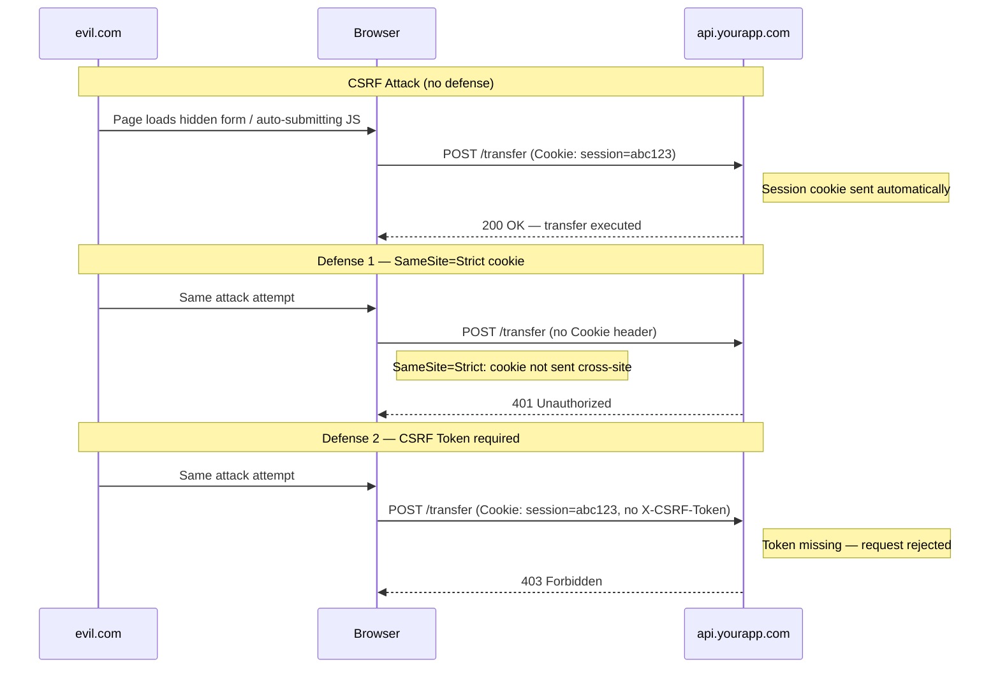
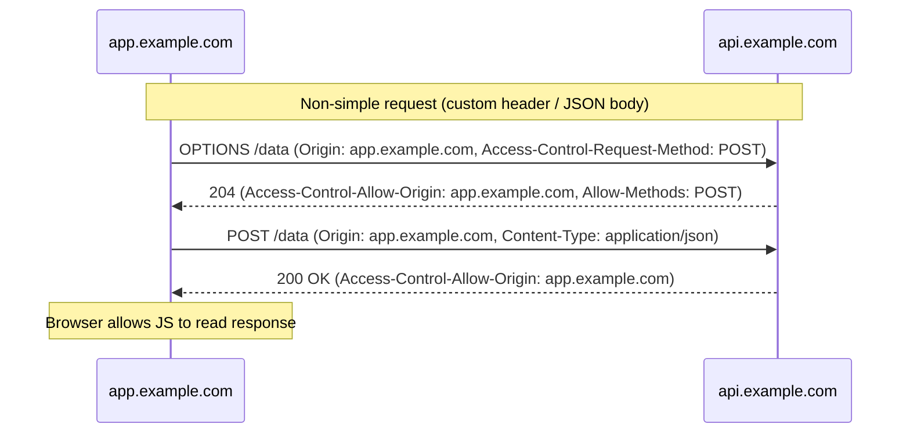

The browser enforces a boundary between origins. Without it, any script on any page could silently read your bank balance, submit forms as you, or exfiltrate session cookies. Two separate browser mechanisms govern this boundary: the **Same-Origin Policy (SOP)**, which restricts what cross-origin responses a page can read; and **cookie sending rules**, which govern which cookies accompany requests. CORS and CSRF are not the same problem — they are two different consequences of the same underlying model — and conflating them leads to security misconfiguration.

CORS (Cross-Origin Resource Sharing) is a controlled relaxation of the Same-Origin Policy. It allows a server to declare that certain trusted origins may read its responses. CSRF (Cross-Site Request Forgery) is an attack that exploits the browser's automatic cookie-sending behavior to trigger unauthorized state-changing actions on behalf of a logged-in user. These two problems interact — especially when session authentication relies on cookies — but they require separate defenses.

## Design Thinking

### CORS is a relaxation mechanism, not protection

The Same-Origin Policy already blocks cross-origin reads. Without CORS headers, a script on `evil.com` cannot read the response from `api.yourapp.com` — the browser enforces that boundary automatically. When a server adds `Access-Control-Allow-Origin: *`, it is opening access that did not exist before. A developer who adds CORS headers believing they "protect" the API has made the data more accessible, not less. The purpose of CORS headers is to grant access to trusted origins (e.g., allowing `app.example.com` to call `api.example.com`), not to restrict it.

This misunderstanding explains one of the most common CORS misconfigurations: origin reflection. A server reads the `Origin` header from the request and echoes it back as `Access-Control-Allow-Origin`. The intention is often "I want my specific client to be able to call this API," but the effect is "I trust every origin in the world," because any `Origin` value sent by the browser is reflected back. Origin reflection is equivalent to `*`, but more dangerous because it can be combined with `Access-Control-Allow-Credentials: true` (which `*` cannot).

### Why CORS does not prevent CSRF

CORS controls whether a cross-origin page can _read_ a response. It does not control whether the request goes through. Simple requests — POST with `application/x-www-form-urlencoded`, `multipart/form-data`, or `text/plain`; and GET and HEAD — are sent by the browser regardless of CORS policy. The browser sends the request, the server processes it, and CORS headers only determine whether the calling script can inspect the response.

An HTML form on `evil.com` can POST to `api.yourapp.com/transfer-funds`. The browser sends the request. The browser sends the victim's session cookie automatically. The server processes the transfer. CORS headers on the server have no effect on any of this — because CSRF attacks don't need to read the response. They only need to trigger the action.

This is the fundamental reason CORS headers and CSRF protections are separate concerns. Configuring CORS well does not give you CSRF protection on its own.

### Why `SameSite=Lax` is a good default but not complete protection

Modern browsers default new cookies to `SameSite=Lax` when no `SameSite` attribute is specified. Lax blocks cookies from being sent on cross-site subresource requests (XHR, fetch, ``, `<iframe>`) but allows them on top-level navigations (clicking a link, following a redirect). This blocks the classic CSRF vector — a hidden form that auto-submits via JavaScript — but leaves open a narrower attack: if a state-changing endpoint accepts GET requests and an attacker can induce the victim to follow a link, the cookie is still sent.

The practical lesson: GET endpoints must never have state-changing side effects. `SameSite=Lax` is a substantial improvement over no protection, but it relies on correct HTTP verb semantics being maintained throughout the application.

`SameSite=Strict` closes this gap. The cookie is not sent on any cross-site request, including top-level navigations. The trade-off is that it breaks flows that depend on preserving session state across a redirect from an external site — OAuth redirects, payment gateway returns, email confirmation links. For applications where these flows are not required, `Strict` is the right choice.

### Why a custom request header is an effective CSRF defense for APIs

HTML forms and `` tags cannot set arbitrary HTTP headers. Only XHR and the Fetch API can. Cross-origin XHR and fetch requests that include custom headers trigger a CORS preflight — an `OPTIONS` request that the server must explicitly authorize before the actual request proceeds. If the server requires a custom header on all state-changing requests (for example, `Content-Type: application/json` or `X-Requested-With: XMLHttpRequest`), then:

1. An HTML form on `evil.com` cannot set that header — the form submission goes without it, and the server rejects it.
2. A cross-origin fetch from `evil.com` that tries to set the header triggers a preflight. The CORS policy on the server will not include `evil.com` in the allowlist, so the preflight fails, and the browser does not send the actual request.

This makes requiring `Content-Type: application/json` on all state-changing API endpoints a meaningful CSRF mitigation, in addition to being a good API design practice.

## Best Practices

**MUST maintain a server-side origin allowlist.** You MUST hardcode the set of trusted origins and set `Access-Control-Allow-Origin` only when the incoming `Origin` is in that list. MUST NOT derive the allowlist from a regex — regex-based matching is prone to bypass (e.g., `https://example.com.evil.com` matching `.*example\.com`).

**SHOULD validate the `Origin` header on state-changing requests as a secondary CSRF defense.** Even if the request comes without CORS (e.g., a same-origin form), checking that the `Origin` or `Referer` header matches a known good value is a cheap, layered control. You SHOULD treat an absent or mismatched `Origin` as suspicious on state-changing endpoints.

**SHOULD use `SameSite=Strict` on session cookies** for applications that do not embed cross-site or depend on OAuth redirect flows. Use `SameSite=Lax` when those flows are needed. You MUST NOT use `SameSite=None` unless you are building a deliberately cross-site embedded widget (e.g., a payment iframe), and always pair it with `Secure`.

**SHOULD use CSRF tokens (synchronizer token pattern) on state-changing form submissions.** Server generates a per-session random token, includes it in the page (as a hidden field or a non-httpOnly cookie), and validates it on each state-changing request. An attacker on `evil.com` cannot read the token from your page, so they cannot forge a valid request.

**SHOULD use the double-submit cookie pattern for stateless CSRF protection in SPA APIs.** Server sets a non-httpOnly, non-Secure cookie with a random value. The JavaScript client reads that cookie and sends its value as a request header (`X-CSRF-Token`). The server compares the header value to the cookie value. An attacker on `evil.com` cannot read the cookie (SOP blocks cross-origin cookie reads), so they cannot set the matching header value.

**SHOULD require `Content-Type: application/json` on all state-changing API endpoints.** Forms submit `application/x-www-form-urlencoded` by default. Requiring JSON forces cross-origin requests to include a non-simple content type, which triggers a preflight. If the CORS policy is correct, the preflight will fail for unauthorized origins.

## How It Works



### CORS preflight flow



## Example

### 1. Server-side CORS middleware with explicit origin allowlist (Node.js/Express)

```js
const ALLOWED_ORIGINS = [
  'https://app.example.com',
  'https://admin.example.com',
];

function corsMiddleware(req, res, next) {
  const origin = req.headers['origin'];

  if (origin && ALLOWED_ORIGINS.includes(origin)) {
    res.setHeader('Access-Control-Allow-Origin', origin);
    res.setHeader('Vary', 'Origin'); // required for correct caching
    res.setHeader('Access-Control-Allow-Credentials', 'true');
    res.setHeader('Access-Control-Allow-Methods', 'GET, POST, PUT, DELETE, OPTIONS');
    res.setHeader(
      'Access-Control-Allow-Headers',
      'Content-Type, Authorization, X-CSRF-Token'
    );
    res.setHeader('Access-Control-Max-Age', '86400'); // 24 hours preflight cache
  }

  if (req.method === 'OPTIONS') {
    return res.sendStatus(204);
  }

  next();
}
```

> Note: `Vary: Origin` is critical. Without it, a CDN or shared cache may return the CORS headers from one origin's response to a different origin's request.

### 2. CSRF token generation and validation (server-side, Express + express-session)

```js
const crypto = require('crypto');

// Generate CSRF token and store in session
function generateCsrfToken(req) {
  if (!req.session.csrfToken) {
    req.session.csrfToken = crypto.randomBytes(32).toString('hex');
  }
  return req.session.csrfToken;
}

// Middleware to validate CSRF token on state-changing requests
function validateCsrfToken(req, res, next) {
  if (['GET', 'HEAD', 'OPTIONS'].includes(req.method)) {
    return next();
  }

  const tokenFromHeader = req.headers['x-csrf-token'];
  const tokenFromSession = req.session.csrfToken;

  if (!tokenFromHeader || !tokenFromSession) {
    return res.status(403).json({ error: 'CSRF token missing' });
  }

  // Use constant-time comparison to prevent timing attacks
  const headerBuffer = Buffer.from(tokenFromHeader);
  const sessionBuffer = Buffer.from(tokenFromSession);

  if (
    headerBuffer.length !== sessionBuffer.length ||
    !crypto.timingSafeEqual(headerBuffer, sessionBuffer)
  ) {
    return res.status(403).json({ error: 'CSRF token invalid' });
  }

  next();
}
```

### 3. Double-submit cookie pattern (server sets cookie; client reads and sends as header)

```js
// Server: set a non-httpOnly CSRF cookie on login or session creation
function setCsrfCookie(res) {
  const token = crypto.randomBytes(32).toString('hex');
  res.cookie('csrf-token', token, {
    httpOnly: false,  // must be readable by JS
    secure: true,
    sameSite: 'Strict',
    path: '/',
  });
  return token;
}

// Server: validate double-submit on state-changing requests
function validateDoubleSubmit(req, res, next) {
  if (['GET', 'HEAD', 'OPTIONS'].includes(req.method)) {
    return next();
  }

  const cookieToken = req.cookies['csrf-token'];
  const headerToken = req.headers['x-csrf-token'];

  if (!cookieToken || !headerToken || cookieToken !== headerToken) {
    return res.status(403).json({ error: 'CSRF validation failed' });
  }

  next();
}
```

### 4. Fetch request that includes CSRF token header (client-side)

```js
// Read CSRF token from non-httpOnly cookie
function getCsrfToken() {
  return document.cookie
    .split('; ')
    .find(row => row.startsWith('csrf-token='))
    ?.split('=')[1] ?? '';
}

// Wrapper around fetch that includes CSRF token on state-changing requests
async function apiFetch(url, options = {}) {
  const method = (options.method ?? 'GET').toUpperCase();
  const isStateMutating = !['GET', 'HEAD', 'OPTIONS'].includes(method);

  const headers = new Headers(options.headers ?? {});

  if (isStateMutating) {
    headers.set('Content-Type', 'application/json');
    headers.set('X-CSRF-Token', getCsrfToken());
  }

  const response = await fetch(url, {
    ...options,
    headers,
    credentials: 'include', // send httpOnly session cookie
  });

  if (!response.ok) {
    throw new Error(`HTTP ${response.status}: ${response.statusText}`);
  }

  return response.json();
}

// Usage
await apiFetch('/api/transfer', {
  method: 'POST',
  body: JSON.stringify({ to: 'alice', amount: 100 }),
});
```

### 5. Secure session cookie attributes

```js
// Express: set session cookie with full security attributes
app.use(session({
  secret: process.env.SESSION_SECRET,
  resave: false,
  saveUninitialized: false,
  cookie: {
    httpOnly: true,   // not accessible to JavaScript
    secure: true,     // HTTPS only
    sameSite: 'strict', // no cross-site sending
    maxAge: 30 * 60 * 1000, // 30 minutes
    path: '/',
  },
}));
```

```
Set-Cookie: session=abc123; HttpOnly; Secure; SameSite=Strict; Path=/; Max-Age=1800
```

> `SameSite=None` paired with `Secure` is the only configuration that allows cross-site cookie sending — use it only for explicitly cross-site embedded components (payment iframes, federated login widgets). If `Secure` is absent, modern browsers silently drop the cookie.

## Common Mistakes

**Treating CORS as a security feature that protects the API.** CORS controls whether a cross-origin script can _read_ the response. It does not prevent the request from being made. Simple requests (GET, certain POST content types) bypass CORS preflight entirely and are sent unconditionally. An attacker does not need to read the response to execute a CSRF attack — they just need the request to go through.

**Using `Access-Control-Allow-Origin: *` with `Access-Control-Allow-Credentials: true`.** Browsers refuse this combination — a request with credentials will fail if the server responds with `*` as the allowed origin. However, some frameworks or middleware set both headers independently, creating a configuration that passes local testing but behaves inconsistently across browsers or implementations. Always use specific origins when credentials are involved.

**Reflecting the `Origin` header directly into `Access-Control-Allow-Origin`.** This trusts every origin in the world — including `null` (sent for `file://` requests and sandboxed iframes), attacker-controlled subdomains, and origins that differ only by trailing components. The null origin is particularly dangerous: `Access-Control-Allow-Origin: null` + `Access-Control-Allow-Credentials: true` allows a sandboxed iframe to make credentialed cross-origin requests.

**Using `SameSite=None` without `Secure`.** The cookie is silently dropped by modern browsers. The application appears to work in development (often served over HTTP or localhost) but breaks in production. Always pair `SameSite=None` with `Secure`.

**Assuming a correct CORS configuration prevents CSRF.** State-changing endpoints that accept `application/x-www-form-urlencoded` or `multipart/form-data` receive cross-origin form submissions regardless of CORS configuration. CORS and CSRF mitigations are independent requirements that both need to be implemented.

**Placing CSRF token validation only on non-idempotent verbs without also fixing GET endpoints.** `SameSite=Lax` allows cookies on top-level GET navigations. If any GET endpoint has state-changing side effects (e.g., `GET /confirm-email?token=…&action=subscribe`), an attacker can craft a link that exploits Lax's exception. GET endpoints must be truly read-only.

## Related FEEs

- [FEE-1200: Security Overview](./1200.md) — category context and the frontend attack surface
- [FEE-1202: Authentication & Token Storage](./1202.md) — cookie-based auth requires CSRF protection; SameSite cookie interaction
- [FEE-1206: HTTPS, Secure Headers & Cookie Attributes](./1206.md) — SameSite cookie attributes and the full secure cookie configuration
- [FEE-1207: SSR & Server Component Security](./1207.md) — CORS configuration on SSR API routes and Server Actions

## References

- [Cross-Origin Resource Sharing (CORS) — MDN](https://developer.mozilla.org/en-US/docs/Web/HTTP/CORS)
- [Same-origin policy — MDN](https://developer.mozilla.org/en-US/docs/Web/Security/Same-origin_policy)
- [OWASP: Cross-Site Request Forgery Prevention Cheat Sheet](https://cheatsheetseries.owasp.org/cheatsheets/Cross-Site_Request_Forgery_Prevention_Cheat_Sheet.html)
- [SameSite cookies — web.dev](https://web.dev/articles/samesite-cookies-explained)
- [Fetch metadata request headers — web.dev](https://web.dev/articles/fetch-metadata)
