```mermaid
flowchart LR
    A[Incoming Request] --> B[HTTPS / HSTS]
    B -->|Transport security<br/>encrypted channel, identity verified| C[CSP]
    C -->|Content execution control<br/>allowed scripts, styles, frames| D[X-Frame-Options /<br/>frame-ancestors]
    D -->|Clickjacking prevention<br/>controls page embedding| E[X-Content-Type-Options]
    E -->|MIME sniffing prevention<br/>enforces declared content type| F[Referrer-Policy]
    F -->|Referrer data leakage control<br/>limits URL path in Referer header| G[Permissions-Policy]
    G -->|Browser API access control<br/>camera, mic, geolocation, payment| H[Cookie Attributes]
    H -->|Session credential security<br/>Secure, HttpOnly, SameSite| I[User / Browser]

    style B fill:#1b4332,color:#fff
    style C fill:#1b4332,color:#fff
    style D fill:#1b4332,color:#fff
    style E fill:#1b4332,color:#fff
    style F fill:#1b4332,color:#fff
    style G fill:#1b4332,color:#fff
    style H fill:#1b4332,color:#fff
```

Every HTTPS connection begins with a TLS handshake in which the server presents a certificate signed by a trusted certificate authority (CA). The browser verifies the certificate chain, confirms the domain matches, and only then establishes an encrypted channel. From that point on, every byte of the request and response is encrypted in transit — an attacker on the network can observe that a connection to your domain exists, but cannot read the content or inject data into the stream.

Encryption alone is not sufficient. Once a user is on your HTTPS page, the browser must be told not to load HTTP sub-resources (mixed content), not to allow the page to be embedded in a frame on a hostile site, not to guess at content types, and not to send sensitive referrer information to third parties. This is the role of HTTP response headers. Alongside headers, cookies — the mechanism that carries session credentials — must themselves be protected against interception and JavaScript access. HTTPS, secure headers, and cookie attributes are three interlocking layers of the same defense.

No single header covers the entire attack surface. HSTS prevents downgrade attacks by forcing the browser onto HTTPS before a request is even made. CSP and `X-Content-Type-Options` prevent content execution attacks — script injection and MIME confusion. `X-Frame-Options` and CSP `frame-ancestors` prevent clickjacking by controlling which sites may embed your page. `Referrer-Policy` prevents data leakage through the `Referer` header. `Permissions-Policy` limits the blast radius of supply-chain compromises by revoking browser API access that the page does not need. Cookie attributes — `Secure`, `HttpOnly`, `SameSite` — protect the session credential itself from interception and cross-site misuse. Each layer closes a specific gap that the others leave open; the value of the stack comes from applying all of them together.

The practical starting point is a scanner audit — tools like securityheaders.com and Mozilla Observatory grade your current header configuration and surface missing entries. From there, tighten iteratively: add the easy headers first (`X-Content-Type-Options`, `Referrer-Policy`, `X-Frame-Options`), then scope `Permissions-Policy` to match actual API usage, then enforce cookie attributes, and finally evaluate HSTS preloading only when the infrastructure is fully ready. Treat the output of a scanner audit as a living baseline, not a one-time checklist.

## Principle

- **SHOULD** set `Strict-Transport-Security: max-age=31536000; includeSubDomains` on all production domains
- **MUST** set `X-Content-Type-Options: nosniff` on all responses
- **SHOULD** configure `Referrer-Policy: strict-origin-when-cross-origin`
- **SHOULD** restrict unused browser features via `Permissions-Policy`
- **MUST** set `Secure` and `HttpOnly` on all session cookies
- **SHOULD** set `SameSite=Strict` on session cookies, or `SameSite=Lax` for applications that require cross-site navigation into the session

The MUST rules represent the minimum acceptable baseline — omitting `X-Content-Type-Options` or the `Secure`/`HttpOnly` cookie attributes is a straightforward vulnerability with documented exploits. The SHOULD rules represent best practice for all production deployments and should be treated as required unless there is a specific, documented reason for an exception (for example, a legacy subdomain that cannot yet serve HTTPS is a documented exception for deferring HSTS preloading, not a reason to omit HSTS entirely).

## Design Thinking

### Why HSTS preloading is an irreversible commitment

HTTP Strict Transport Security (HSTS) tells the browser: "for the next `max-age` seconds, refuse to connect to this host over plain HTTP — even if the user types `http://` or follows an `http://` link." The browser enforces this locally, without needing a server redirect. `includeSubDomains` extends this policy to every subdomain.

The HSTS preload list goes one step further: browsers ship with a built-in list of domains that must always use HTTPS, before any first connection is ever made. This closes the initial SSL stripping attack window — the one request that happens before the browser has learned the HSTS policy from a prior response.

Preloading is irreversible in practice. To be removed from the preload list, you submit a removal request to hstspreload.org. Google processes it and removes the entry from the Chromium source. Then the change must ship in a browser release. Then users must update their browsers. The timeline from removal request to full propagation is 6 to 12 months — often longer. During that period, any user running a current browser will be unable to connect to any subdomain that serves HTTP only.

The implication is direct: never submit a domain to the HSTS preload list until you are certain that every subdomain — including internal tools, staging environments, partner integrations, and legacy services — serves HTTPS and will continue to do so indefinitely. Verify with hstspreload.org's domain checker and Mozilla Observatory before submitting.

### Why `X-Content-Type-Options: nosniff` still matters

When a browser receives a response, it can attempt to infer the content type from the actual bytes of the response body — "MIME sniffing" — rather than trusting the `Content-Type` header. This was originally a compatibility feature. It became an attack vector.

A MIME confusion attack works as follows: an attacker uploads a file to an image-hosting service. The file is served with `Content-Type: image/png`, but its bytes contain valid JavaScript. Without `nosniff`, an older browser loading that URL in a script context may execute it. The `nosniff` directive instructs the browser: use the declared `Content-Type` exactly, and if the declared type does not match the context (e.g., a `text/plain` response loaded as a script), block execution.

Modern browsers have largely disabled MIME sniffing for scripts and stylesheets. But `nosniff` is still required for older browser compatibility, for SVG content (which can carry script), and for browser plugin environments. It costs nothing and closes a real class of attacks.

### Why `Permissions-Policy` is underused

`Permissions-Policy` (formerly `Feature-Policy`) restricts which browser APIs a page and its embedded frames are permitted to use. A policy of `camera=(), microphone=(), geolocation=()` means no origin — not even the top-level page — can request camera, microphone, or geolocation access.

The practical value is defense-in-depth against compromised third-party scripts. A chat widget, analytics library, or A/B testing tool that gains code execution through a supply chain attack could, without `Permissions-Policy`, call `navigator.mediaDevices.getUserMedia()` or `navigator.geolocation.getCurrentPosition()` and potentially exfiltrate the result. With `Permissions-Policy` set to deny these APIs on pages that do not use them, the API call fails before any permission prompt appears. The cost is a single header line; the benefit scales with every third-party script on the page.

In 2024–2025, several third-party analytics and chatbot scripts were compromised through supply-chain attacks — attackers injected code into the vendor's CDN build or npm package, which then ran inside thousands of host applications. A compromised script with access to `camera` and `microphone` APIs could silently call `getUserMedia()` and stream audio or video without any visible browser permission prompt (if the host page had already granted those permissions in a prior session). A `Permissions-Policy: camera=(), microphone=(), geolocation=(), payment=()` header on pages that do not need these capabilities would have blocked the API call entirely — even if the malicious script executed successfully and even if CSP allowed it under `strict-dynamic` (since `strict-dynamic` trusts scripts loaded by trusted scripts, it does not revoke browser API access). This is the specific gap `Permissions-Policy` closes that CSP cannot.

### How `Referrer-Policy` affects analytics and privacy

The `Referer` request header (note: the HTTP specification misspelled "referrer" and the misspelling is now part of the standard) tells the destination server which URL the user navigated from. Without a `Referrer-Policy`, a browser navigating from `https://app.example.com/dashboard?token=preview123` to an external analytics endpoint may include the full URL — query string and all — in the `Referer` header. If that URL contains a password reset token, an OAuth state parameter, or a search query with personally identifiable information, it is now visible to the analytics provider.

`strict-origin-when-cross-origin` is the recommended default and the browser default since Chrome 85. It sends the full URL for same-origin requests (so your internal analytics still work), sends only the origin (`https://app.example.com`) for cross-origin HTTPS-to-HTTPS requests, and sends nothing when navigating from HTTPS to HTTP. This balances analytics utility against privacy. Applications handling sensitive URL parameters — OAuth flows, password reset links, file-sharing links with embedded tokens — should review every external navigation and consider `no-referrer` for those specific links using the `referrerpolicy` attribute on anchor elements.

A decision table for choosing the policy value: use `no-referrer` when the URL itself is the secret (password reset, file-share tokens); use `strict-origin-when-cross-origin` for most applications that want analytics data without leaking URL paths cross-origin; use `no-referrer-when-downgrade` only if there is a specific need to preserve URL referral data for HTTP-served resources (rare in modern deployments); avoid `unsafe-url`, which sends the full URL to all destinations including cross-origin HTTP.

### Why the `Domain` cookie attribute is a footgun

When a server sets a cookie without the `Domain` attribute, that cookie is scoped to exactly the domain that set it. `api.example.com` sets a cookie — only `api.example.com` receives it. This is the safe default.

When the `Domain` attribute is set explicitly — `Domain=example.com` — the cookie becomes available to every subdomain: `api.example.com`, `admin.example.com`, `staging.example.com`, `legacy.example.com`. This is frequently added with the intention of sharing a session across services, but it expands the attack surface proportionally. If any subdomain is compromised through an XSS vulnerability, a misconfigured server, or a third-party integration, the attacker can read the session cookie. The rule is: do not set `Domain` unless subdomain sharing is explicitly required, and when it is required, carefully enumerate which subdomains will actually receive the cookie.

## Best Practices

**Verify HTTPS on all subdomains before submitting to the HSTS preload list.** Use the hstspreload.org domain checker and Mozilla Observatory to confirm every subdomain is reachable over HTTPS, returns a valid certificate, and does not redirect through HTTP at any point. Preloading a domain while any subdomain serves HTTP breaks that subdomain for all users of up-to-date browsers, with no fast recovery path. When assessing subdomains, do not forget internal tooling, CI/CD dashboards, monitoring endpoints, and partner integration hostnames — anything under the apex domain is affected by `includeSubDomains`.

**Set security headers at the CDN or reverse proxy level.** Configuring headers in application code means they are only present when the application server responds. Error pages from Nginx, CDN responses for cached assets, and redirect responses all bypass application code. Configure headers at the infrastructure layer — Cloudflare transform rules, Vercel `headers` config in `vercel.json`, or Nginx `add_header` directives — so that every response, regardless of origin, carries the correct headers.

**Test headers with securityheaders.com.** The scanner grades your headers, identifies missing entries, and flags misconfigured values. Run it against production and against staging before launch.

**Audit third-party scripts to calibrate `Permissions-Policy`.** Before setting a blanket deny policy, inventory which third-party scripts on each page actually require camera, microphone, geolocation, or payment APIs. Some legitimate scripts — video call widgets, geolocation-based personalization, payment collection flows — do require these APIs and will break silently if the policy denies them without a corresponding `allow` attribute on the iframe. The correct approach is: deny everything by default in the top-level policy, and re-grant specific features to specific iframe origins using the `allow` attribute (`<iframe allow="payment 'self' https://checkout.stripe.com">`). This gives the most granular control and documents, in markup, exactly which frames are granted which capabilities.

**Use `Max-Age` rather than `Expires` on cookies.** `Max-Age` is a relative value in seconds from the moment the browser receives the response. `Expires` is an absolute datetime, which means its behavior depends on whether the client clock is accurate. `Max-Age` takes precedence over `Expires` when both are present. Use `Max-Age` for predictable expiration.

**Avoid the `Domain` cookie attribute unless subdomain sharing is explicitly required.** If you do need subdomain sharing, prefer setting the cookie on the subdomain that needs it rather than the apex domain.

**Choose `SameSite` value based on whether the application uses external redirects.** `SameSite=Strict` is the most restrictive setting: the session cookie is never sent with any cross-site request, including top-level navigations from an external origin. This is correct for fully self-contained applications with no external identity providers.

OAuth and SSO redirect flows break under `SameSite=Strict`. When an authorization server redirects the user back to your application after login, that redirect is a top-level GET navigation originating from the authorization server's domain. Because it is a cross-site navigation, `SameSite=Strict` suppresses the session cookie — the application receives the redirect but cannot find the session, and the login appears to fail. `SameSite=Lax` preserves the cookie during top-level GET navigations while still blocking it on cross-site subresource requests and form POSTs. If the application uses any SSO, OAuth, SAML, or external redirect flow, `SameSite=Lax` is the correct value. Use `SameSite=None; Secure` only for explicitly cross-site embedded use cases — payment iframes, federated login widgets — where the cookie must be sent from a third-party frame context.

## How It Works

The browser processes these headers at different stages of the request/response lifecycle, and they interact in specific ways that matter for configuration.

HSTS is evaluated before the request is dispatched. If the browser has a cached HSTS record for the host — either from a prior `Strict-Transport-Security` response or from the preload list — it upgrades the scheme to HTTPS internally, without issuing an HTTP request at all. The server never sees the HTTP request; the upgrade is entirely client-side. This is why HSTS eliminates the "trust on first use" problem of server-side HTTP-to-HTTPS redirects: no unencrypted request ever leaves the browser.

CSP and `X-Content-Type-Options` are evaluated as the browser processes the response and prepares to execute or render sub-resources. CSP is parsed from the response header and applied to every subsequent sub-resource load triggered by that document. `X-Content-Type-Options: nosniff` is a per-response directive: it applies to the response it appears on, not to subsequent loads. Both must be present on every response where they are relevant.

`Permissions-Policy` is evaluated at the feature request boundary — when JavaScript calls a browser API that requires a capability. If the policy denies the feature, the API call rejects immediately (typically with a `NotAllowedError`) without displaying a permission prompt. The policy set on the top-level document also propagates to iframes, subject to the iframe's `allow` attribute: an iframe cannot grant itself more permissions than the top-level document's policy allows.

Cookie attributes are evaluated by the browser's cookie jar at the moment a request is dispatched. The browser checks the `SameSite` attribute against the current navigation context to decide whether to include the cookie. It checks `Secure` against the scheme of the URL. These checks happen before the request is sent; there is no server-side equivalent that can compensate for missing cookie attributes.

The following diagram shows the security header stack as a set of layered defenses, each targeting a distinct threat vector.



## Example

### 1. Complete security header response

The following shows all security headers together in a single HTTP response. This is the target configuration for any production web application.

```http
HTTP/2 200 OK
Content-Type: text/html; charset=utf-8
Strict-Transport-Security: max-age=31536000; includeSubDomains
X-Content-Type-Options: nosniff
X-Frame-Options: SAMEORIGIN
Content-Security-Policy: default-src 'self'; script-src 'self'; style-src 'self' 'unsafe-inline'; frame-ancestors 'self'
Referrer-Policy: strict-origin-when-cross-origin
Permissions-Policy: camera=(), microphone=(), geolocation=(), payment=()
```

Note: `X-Frame-Options` is present for backward compatibility with browsers that do not support CSP `frame-ancestors`. When both headers are present, modern browsers use `frame-ancestors` and ignore `X-Frame-Options`.

### 2. Next.js `next.config.js` security headers

```js
// next.config.js
/** @type {import('next').NextConfig} */
const nextConfig = {
  async headers() {
    return [
      {
        // Apply to all routes
        source: '/(.*)',
        headers: [
          {
            key: 'Strict-Transport-Security',
            value: 'max-age=31536000; includeSubDomains',
          },
          {
            key: 'X-Content-Type-Options',
            value: 'nosniff',
          },
          {
            key: 'X-Frame-Options',
            value: 'SAMEORIGIN',
          },
          {
            key: 'Referrer-Policy',
            value: 'strict-origin-when-cross-origin',
          },
          {
            key: 'Permissions-Policy',
            value: 'camera=(), microphone=(), geolocation=(), payment=()',
          },
        ],
      },
    ];
  },
};

module.exports = nextConfig;
```

Next.js applies these headers via its Node.js server. For deployments on Vercel, prefer configuring headers in `vercel.json` or Vercel's dashboard so they apply to CDN-served responses as well, not only to SSR responses.

### 3. Nginx `add_header` directives

```nginx
# /etc/nginx/conf.d/security-headers.conf
# Include this file in your server block or http block.

server {
    listen 443 ssl http2;
    server_name example.com;

    # HSTS: force HTTPS for 1 year, including all subdomains.
    # Remove the preload directive until you are certain all subdomains
    # are permanently on HTTPS.
    add_header Strict-Transport-Security "max-age=31536000; includeSubDomains" always;

    # Prevent MIME type sniffing.
    add_header X-Content-Type-Options "nosniff" always;

    # Clickjacking protection (backward compat — prefer CSP frame-ancestors).
    add_header X-Frame-Options "SAMEORIGIN" always;

    # Referrer: send full URL on same-origin, only origin on cross-origin,
    # nothing on downgrade (HTTPS -> HTTP).
    add_header Referrer-Policy "strict-origin-when-cross-origin" always;

    # Restrict browser APIs. Adjust to match actual feature usage.
    add_header Permissions-Policy "camera=(), microphone=(), geolocation=(), payment=()" always;

    # The 'always' flag ensures the header is included on error responses (4xx, 5xx),
    # not only on 2xx responses. Required for HSTS to apply on redirect responses.
}
```

### 4. `Set-Cookie` header with all security attributes

```http
# Session cookie — all security attributes combined
Set-Cookie: session_id=abc123xyz;
  Path=/;
  HttpOnly;
  Secure;
  SameSite=Strict;
  Max-Age=3600
```

Attribute breakdown:

- `Path=/` — sent with requests to all paths on the domain
- `HttpOnly` — not accessible via `document.cookie`; blocks XSS token theft
- `Secure` — transmitted only over HTTPS; never sent over plain HTTP
- `SameSite=Strict` — never sent with cross-site requests (direct navigation from external sites does not include the cookie)
- `Max-Age=3600` — expires 3600 seconds (1 hour) from the moment the browser receives the response, regardless of client clock

```http
# Cross-site embedded use case (payment iframe, federated login widget)
Set-Cookie: embed_token=def456uvw;
  Path=/;
  HttpOnly;
  Secure;
  SameSite=None;
  Max-Age=300
```

`SameSite=None` requires `Secure`. Without `Secure`, browsers reject the cookie entirely (Chrome, Firefox, Safari all enforce this). Additionally, some browsers in private/incognito mode block third-party cookies regardless of `SameSite=None; Secure`. Applications that rely on cross-site cookies for embedded flows should design a fallback for users in these modes — typically a first-party redirect flow that establishes the session without relying on third-party cookie access.

### 5. `Permissions-Policy` configuration

```http
# Block all access to camera, microphone, geolocation, and payment APIs
# for the page and all embedded frames from any origin.
Permissions-Policy: camera=(), microphone=(), geolocation=(), payment=()

# Allow geolocation for the top-level page only (not iframes).
Permissions-Policy: camera=(), microphone=(), geolocation=self, payment=()

# Allow payment API for a specific trusted payment iframe origin.
Permissions-Policy: camera=(), microphone=(), geolocation=(), payment=(self "https://checkout.payment-provider.com")
```

The `()` syntax means "no origin is allowed" — not even the page itself. `self` means the top-level page origin only. Adding additional origins in the list grants access to embedded frames from those specific origins.

Note that `Permissions-Policy` controls whether the browser API is accessible, not whether the browser will prompt the user for permission. If a feature is allowed by the policy but the user has not previously granted permission, the browser will still display a permission prompt. If the feature is denied by the policy, the API rejects immediately with no prompt — the user is never asked, and the denial is invisible to the end user. This is the intended behavior for APIs that a page has no reason to use: silent denial rather than a prompt the user has to dismiss.

## Common Mistakes

**Setting HSTS on a domain that still has subdomains serving HTTP.** When `includeSubDomains` is set, all subdomains must serve HTTPS. If `legacy.example.com` only has an HTTP endpoint and `example.com` sends `Strict-Transport-Security: max-age=31536000; includeSubDomains`, browsers that have learned this policy will refuse to connect to `legacy.example.com` over HTTP — and there is no HTTPS endpoint to fall back to. The subdomain becomes unreachable. This worsens dramatically if the domain is on the preload list, because the policy is enforced before any first connection, affecting users who have never visited the site.

**Relying on `X-Frame-Options` when CSP `frame-ancestors` is also present.** When both headers are present in the same response, modern browsers (Chrome, Firefox, Safari, Edge) apply `frame-ancestors` from the CSP header and ignore `X-Frame-Options` entirely. This is the specified behavior per the CSP level 2 specification. The common mistake is configuring `X-Frame-Options: DENY` but setting a permissive `frame-ancestors` in CSP, and assuming both apply. Only `frame-ancestors` applies in modern browsers. Keep both headers for backward compatibility with Internet Explorer and older browsers, but test with `frame-ancestors` as the authoritative control.

**Omitting `Secure` on session cookies in production.** Without the `Secure` attribute, a browser will include the session cookie in both HTTPS and HTTP requests. On any network where an attacker can observe unencrypted traffic — a shared Wi-Fi network, a corporate proxy, an ISP-level observer — the session cookie is transmitted in the clear on any HTTP request the user makes (including HTTP redirects from external sites before the browser upgrades to HTTPS). HSTS prevents the final page load from being HTTP, but subresource requests and redirects can still be HTTP if the browser has not yet cached the HSTS policy. The `Secure` flag ensures the cookie never leaves the browser over an unencrypted connection, regardless of redirect chains.

**Configuring security headers only on 2xx responses.** Nginx's `add_header` directive, without the `always` flag, appends headers only to 2xx and 3xx responses by default. Error pages (404, 500) omit the headers. This matters for HSTS: a `301` redirect response without an HSTS header means the browser does not cache the policy from that redirect. It also matters for CSP on error pages — an application that reflects error detail in a 500 page without CSP is vulnerable to reflected XSS even if the happy path is protected. Always use `add_header ... always;` in Nginx and equivalent options in other servers to ensure headers appear on all response codes.

**Setting `Domain=.example.com` with a leading dot.** In the original RFC 2109 cookie specification, the leading dot in `Domain=.example.com` was required to enable subdomain matching. RFC 6265 (the current specification) ignores the leading dot — both `.example.com` and `example.com` in the `Domain` attribute are treated identically and make the cookie available to all subdomains. The leading dot is not harmful, but it can create confusion: developers who add it believing it is required may not realize that the real issue is that setting the `Domain` attribute at all — with or without the dot — shares the cookie across all subdomains.

**Treating scanner grades as the security goal rather than the underlying threat model.** Tools like securityheaders.com assign grades based on the presence and basic correctness of headers. An A+ grade does not mean the application is secure — it means the headers are present and syntactically valid. A CSP of `default-src *` passes the header presence check but provides no meaningful protection. A `Permissions-Policy` that grants `camera=*` to all origins scores well structurally while granting every embedded frame camera access. Use scanner grades as a baseline sanity check, not as a security certification. The authoritative test is a penetration review that attempts to exploit each threat category the headers are supposed to mitigate.

## Related FEEs

- [FEE-1200: Security Overview](./1200.md) — category context and the frontend attack surface
- [FEE-1201: Content Security Policy](./1201.md) — CSP sits alongside these headers; `frame-ancestors` replaces `X-Frame-Options`; `strict-dynamic` interacts with `Permissions-Policy` as described in the supply-chain attack scenario above
- [FEE-1202: Authentication & Token Storage](./1202.md) — `Secure`, `HttpOnly`, and `SameSite` cookie attributes for session security
- [FEE-1204: CORS & CSRF](./1204.md) — `SameSite` cookie attribute for CSRF defense; the interaction between `SameSite=Lax` and OAuth redirect flows is relevant to CSRF token design
- [FEE-1205: Supply Chain Security](./1205.md) — `Permissions-Policy` as a supply-chain defense layer; third-party script risk management

## References

- [HTTP Strict Transport Security — MDN](https://developer.mozilla.org/en-US/docs/Web/HTTP/Headers/Strict-Transport-Security)
- [HSTS Preload List — hstspreload.org](https://hstspreload.org/)
- [X-Content-Type-Options — MDN](https://developer.mozilla.org/en-US/docs/Web/HTTP/Headers/X-Content-Type-Options)
- [Referrer-Policy — MDN](https://developer.mozilla.org/en-US/docs/Web/HTTP/Headers/Referrer-Policy)
- [Permissions-Policy — MDN](https://developer.mozilla.org/en-US/docs/Web/HTTP/Headers/Permissions-Policy)
- [OWASP Secure Headers Project](https://owasp.org/www-project-secure-headers/)
- [Set-Cookie — MDN](https://developer.mozilla.org/en-US/docs/Web/HTTP/Headers/Set-Cookie)
- [securityheaders.com — HTTP Security Headers Scanner](https://securityheaders.com/)
- [Mozilla Observatory](https://observatory.mozilla.org/)
- [RFC 6265 — HTTP State Management Mechanism (Cookies)](https://www.rfc-editor.org/rfc/rfc6265)
- [Permissions Policy Specification — W3C](https://www.w3.org/TR/permissions-policy/)
- [SameSite cookies explained — web.dev](https://web.dev/articles/samesite-cookies-explained)
