```mermaid
flowchart LR
    A[Incoming Request] --> B[HTTPS / HSTS]
    B -->|Transport security<br/>encrypted channel, identity verified| C[CSP]
    C -->|Content execution control<br/>allowed scripts, styles, frames| D[X-Frame-Options /<br/>frame-ancestors]
    D -->|Clickjacking prevention<br/>controls page embedding| E[X-Content-Type-Options]
    E -->|MIME sniffing prevention<br/>enforces declared content type| F[Referrer-Policy]
    F -->|Referrer data leakage control<br/>limits URL path in Referer header| G[Permissions-Policy]
    G -->|Browser API access control<br/>camera, mic, geolocation, payment| H[Cookie Attributes]
    H -->|Session credential security<br/>Secure, HttpOnly, SameSite| I[User / Browser]

    style B fill:#1b4332,color:#fff
    style C fill:#1b4332,color:#fff
    style D fill:#1b4332,color:#fff
    style E fill:#1b4332,color:#fff
    style F fill:#1b4332,color:#fff
    style G fill:#1b4332,color:#fff
    style H fill:#1b4332,color:#fff
```

Every HTTPS connection begins with a TLS handshake in which the server presents a certificate signed by a trusted certificate authority (CA). The browser verifies the certificate chain, confirms the domain matches, and only then establishes an encrypted channel. From that point on, every byte of the request and response is encrypted in transit — an attacker on the network can observe that a connection to your domain exists, but cannot read the content or inject data into the stream.

Encryption alone is not sufficient. Once a user is on your HTTPS page, the browser must be told not to load HTTP sub-resources (mixed content), not to allow the page to be embedded in a frame on a hostile site, not to guess at content types, and not to send sensitive referrer information to third parties. This is the role of HTTP response headers. Alongside headers, cookies — the mechanism that carries session credentials — must themselves be protected against interception and JavaScript access. HTTPS, secure headers, and cookie attributes are three interlocking layers of the same defense.

## Principle

- **SHOULD** set `Strict-Transport-Security: max-age=31536000; includeSubDomains` on all production domains
- **MUST** set `X-Content-Type-Options: nosniff` on all responses
- **SHOULD** configure `Referrer-Policy: strict-origin-when-cross-origin`
- **SHOULD** restrict unused browser features via `Permissions-Policy`
- **MUST** set `Secure` and `HttpOnly` on all session cookies
- **SHOULD** set `SameSite=Strict` on session cookies, or `SameSite=Lax` for applications that require cross-site navigation into the session

## Design Thinking

### Why HSTS preloading is an irreversible commitment

HTTP Strict Transport Security (HSTS) tells the browser: "for the next `max-age` seconds, refuse to connect to this host over plain HTTP — even if the user types `http://` or follows an `http://` link." The browser enforces this locally, without needing a server redirect. `includeSubDomains` extends this policy to every subdomain.

The HSTS preload list goes one step further: browsers ship with a built-in list of domains that must always use HTTPS, before any first connection is ever made. This closes the initial SSL stripping attack window — the one request that happens before the browser has learned the HSTS policy from a prior response.

Preloading is irreversible in practice. To be removed from the preload list, you submit a removal request to hstspreload.org. Google processes it and removes the entry from the Chromium source. Then the change must ship in a browser release. Then users must update their browsers. The timeline from removal request to full propagation is 6 to 12 months — often longer. During that period, any user running a current browser will be unable to connect to any subdomain that serves HTTP only.

The implication is direct: never submit a domain to the HSTS preload list until you are certain that every subdomain — including internal tools, staging environments, partner integrations, and legacy services — serves HTTPS and will continue to do so indefinitely. Verify with hstspreload.org's domain checker and Mozilla Observatory before submitting.

### Why `X-Content-Type-Options: nosniff` still matters

When a browser receives a response, it can attempt to infer the content type from the actual bytes of the response body — "MIME sniffing" — rather than trusting the `Content-Type` header. This was originally a compatibility feature. It became an attack vector.

A MIME confusion attack works as follows: an attacker uploads a file to an image-hosting service. The file is served with `Content-Type: image/png`, but its bytes contain valid JavaScript. Without `nosniff`, an older browser loading that URL in a script context may execute it. The `nosniff` directive instructs the browser: use the declared `Content-Type` exactly, and if the declared type does not match the context (e.g., a `text/plain` response loaded as a script), block execution.

Modern browsers have largely disabled MIME sniffing for scripts and stylesheets. But `nosniff` is still required for older browser compatibility, for SVG content (which can carry script), and for browser plugin environments. It costs nothing and closes a real class of attacks.

### Why `Permissions-Policy` is underused

`Permissions-Policy` (formerly `Feature-Policy`) restricts which browser APIs a page and its embedded frames are permitted to use. A policy of `camera=(), microphone=(), geolocation=()` means no origin — not even the top-level page — can request camera, microphone, or geolocation access.

The practical value is defense-in-depth against compromised third-party scripts. A chat widget, analytics library, or A/B testing tool that gains code execution through a supply chain attack could, without `Permissions-Policy`, call `navigator.mediaDevices.getUserMedia()` or `navigator.geolocation.getCurrentPosition()` and potentially exfiltrate the result. With `Permissions-Policy` set to deny these APIs on pages that do not use them, the API call fails before any permission prompt appears. The cost is a single header line; the benefit scales with every third-party script on the page.

### Why the `Domain` cookie attribute is a footgun

When a server sets a cookie without the `Domain` attribute, that cookie is scoped to exactly the domain that set it. `api.example.com` sets a cookie — only `api.example.com` receives it. This is the safe default.

When the `Domain` attribute is set explicitly — `Domain=example.com` — the cookie becomes available to every subdomain: `api.example.com`, `admin.example.com`, `staging.example.com`, `legacy.example.com`. This is frequently added with the intention of sharing a session across services, but it expands the attack surface proportionally. If any subdomain is compromised through an XSS vulnerability, a misconfigured server, or a third-party integration, the attacker can read the session cookie. The rule is: do not set `Domain` unless subdomain sharing is explicitly required, and when it is required, carefully enumerate which subdomains will actually receive the cookie.

## Best Practices

**Verify HTTPS on all subdomains before submitting to the HSTS preload list.** Use the hstspreload.org domain checker and Mozilla Observatory to confirm every subdomain is reachable over HTTPS, returns a valid certificate, and does not redirect through HTTP at any point. Preloading a domain while any subdomain serves HTTP breaks that subdomain for all users of up-to-date browsers, with no fast recovery path.

**Set security headers at the CDN or reverse proxy level.** Configuring headers in application code means they are only present when the application server responds. Error pages from Nginx, CDN responses for cached assets, and redirect responses all bypass application code. Configure headers at the infrastructure layer — Cloudflare transform rules, Vercel `headers` config in `vercel.json`, or Nginx `add_header` directives — so that every response, regardless of origin, carries the correct headers.

**Test headers with securityheaders.com.** The scanner grades your headers, identifies missing entries, and flags misconfigured values. Run it against production and against staging before launch.

**Use `Max-Age` rather than `Expires` on cookies.** `Max-Age` is a relative value in seconds from the moment the browser receives the response. `Expires` is an absolute datetime, which means its behavior depends on whether the client clock is accurate. `Max-Age` takes precedence over `Expires` when both are present. Use `Max-Age` for predictable expiration.

**Avoid the `Domain` cookie attribute unless subdomain sharing is explicitly required.** If you do need subdomain sharing, prefer setting the cookie on the subdomain that needs it rather than the apex domain.

**Set `SameSite=Strict` for session cookies.** Use `SameSite=None; Secure` only for explicitly cross-site embedded use cases — payment iframes, federated login widgets, OAuth callback flows where the session must survive a cross-site top-level navigation.

## How It Works

The following diagram shows the security header stack as a set of layered defenses, each targeting a distinct threat vector.



## Example

### 1. Complete security header response

The following shows all security headers together in a single HTTP response. This is the target configuration for any production web application.

```http
HTTP/2 200 OK
Content-Type: text/html; charset=utf-8
Strict-Transport-Security: max-age=31536000; includeSubDomains
X-Content-Type-Options: nosniff
X-Frame-Options: SAMEORIGIN
Content-Security-Policy: default-src 'self'; script-src 'self'; style-src 'self' 'unsafe-inline'; frame-ancestors 'self'
Referrer-Policy: strict-origin-when-cross-origin
Permissions-Policy: camera=(), microphone=(), geolocation=(), payment=()
```

Note: `X-Frame-Options` is present for backward compatibility with browsers that do not support CSP `frame-ancestors`. When both headers are present, modern browsers use `frame-ancestors` and ignore `X-Frame-Options`.

### 2. Next.js `next.config.js` security headers

```js
// next.config.js
/** @type {import('next').NextConfig} */
const nextConfig = {
  async headers() {
    return [
      {
        // Apply to all routes
        source: '/(.*)',
        headers: [
          {
            key: 'Strict-Transport-Security',
            value: 'max-age=31536000; includeSubDomains',
          },
          {
            key: 'X-Content-Type-Options',
            value: 'nosniff',
          },
          {
            key: 'X-Frame-Options',
            value: 'SAMEORIGIN',
          },
          {
            key: 'Referrer-Policy',
            value: 'strict-origin-when-cross-origin',
          },
          {
            key: 'Permissions-Policy',
            value: 'camera=(), microphone=(), geolocation=(), payment=()',
          },
        ],
      },
    ];
  },
};

module.exports = nextConfig;
```

Next.js applies these headers via its Node.js server. For deployments on Vercel, prefer configuring headers in `vercel.json` or Vercel's dashboard so they apply to CDN-served responses as well, not only to SSR responses.

### 3. Nginx `add_header` directives

```nginx
# /etc/nginx/conf.d/security-headers.conf
# Include this file in your server block or http block.

server {
    listen 443 ssl http2;
    server_name example.com;

    # HSTS: force HTTPS for 1 year, including all subdomains.
    # Remove the preload directive until you are certain all subdomains
    # are permanently on HTTPS.
    add_header Strict-Transport-Security "max-age=31536000; includeSubDomains" always;

    # Prevent MIME type sniffing.
    add_header X-Content-Type-Options "nosniff" always;

    # Clickjacking protection (backward compat — prefer CSP frame-ancestors).
    add_header X-Frame-Options "SAMEORIGIN" always;

    # Referrer: send full URL on same-origin, only origin on cross-origin,
    # nothing on downgrade (HTTPS -> HTTP).
    add_header Referrer-Policy "strict-origin-when-cross-origin" always;

    # Restrict browser APIs. Adjust to match actual feature usage.
    add_header Permissions-Policy "camera=(), microphone=(), geolocation=(), payment=()" always;

    # The 'always' flag ensures the header is included on error responses (4xx, 5xx),
    # not only on 2xx responses. Required for HSTS to apply on redirect responses.
}
```

### 4. `Set-Cookie` header with all security attributes

```http
# Session cookie — all security attributes combined
Set-Cookie: session_id=abc123xyz;
  Path=/;
  HttpOnly;
  Secure;
  SameSite=Strict;
  Max-Age=3600
```

Attribute breakdown:

- `Path=/` — sent with requests to all paths on the domain
- `HttpOnly` — not accessible via `document.cookie`; blocks XSS token theft
- `Secure` — transmitted only over HTTPS; never sent over plain HTTP
- `SameSite=Strict` — never sent with cross-site requests (direct navigation from external sites does not include the cookie)
- `Max-Age=3600` — expires 3600 seconds (1 hour) from the moment the browser receives the response, regardless of client clock

```http
# Cross-site embedded use case (payment iframe, federated login widget)
Set-Cookie: embed_token=def456uvw;
  Path=/;
  HttpOnly;
  Secure;
  SameSite=None;
  Max-Age=300
```

`SameSite=None` requires `Secure`. Without `Secure`, browsers reject the cookie entirely (Chrome, Firefox, Safari all enforce this).

### 5. `Permissions-Policy` configuration

```http
# Block all access to camera, microphone, geolocation, and payment APIs
# for the page and all embedded frames from any origin.
Permissions-Policy: camera=(), microphone=(), geolocation=(), payment=()

# Allow geolocation for the top-level page only (not iframes).
Permissions-Policy: camera=(), microphone=(), geolocation=self, payment=()

# Allow payment API for a specific trusted payment iframe origin.
Permissions-Policy: camera=(), microphone=(), geolocation=(), payment=(self "https://checkout.payment-provider.com")
```

The `()` syntax means "no origin is allowed" — not even the page itself. `self` means the top-level page origin only. Adding additional origins in the list grants access to embedded frames from those specific origins.

## Common Mistakes

**Setting HSTS on a domain that still has subdomains serving HTTP.** When `includeSubDomains` is set, all subdomains must serve HTTPS. If `legacy.example.com` only has an HTTP endpoint and `example.com` sends `Strict-Transport-Security: max-age=31536000; includeSubDomains`, browsers that have learned this policy will refuse to connect to `legacy.example.com` over HTTP — and there is no HTTPS endpoint to fall back to. The subdomain becomes unreachable. This worsens dramatically if the domain is on the preload list, because the policy is enforced before any first connection, affecting users who have never visited the site.

**Relying on `X-Frame-Options` when CSP `frame-ancestors` is also present.** When both headers are present in the same response, modern browsers (Chrome, Firefox, Safari, Edge) apply `frame-ancestors` from the CSP header and ignore `X-Frame-Options` entirely. This is the specified behavior per the CSP level 2 specification. The common mistake is configuring `X-Frame-Options: DENY` but setting a permissive `frame-ancestors` in CSP, and assuming both apply. Only `frame-ancestors` applies in modern browsers. Keep both headers for backward compatibility with Internet Explorer and older browsers, but test with `frame-ancestors` as the authoritative control.

**Omitting `Secure` on session cookies in production.** Without the `Secure` attribute, a browser will include the session cookie in both HTTPS and HTTP requests. On any network where an attacker can observe unencrypted traffic — a shared Wi-Fi network, a corporate proxy, an ISP-level observer — the session cookie is transmitted in the clear on any HTTP request the user makes (including HTTP redirects from external sites before the browser upgrades to HTTPS). HSTS prevents the final page load from being HTTP, but subresource requests and redirects can still be HTTP if the browser has not yet cached the HSTS policy. The `Secure` flag ensures the cookie never leaves the browser over an unencrypted connection, regardless of redirect chains.

**Setting `Domain=.example.com` with a leading dot.** In the original RFC 2109 cookie specification, the leading dot in `Domain=.example.com` was required to enable subdomain matching. RFC 6265 (the current specification) ignores the leading dot — both `.example.com` and `example.com` in the `Domain` attribute are treated identically and make the cookie available to all subdomains. The leading dot is not harmful, but it can create confusion: developers who add it believing it is required may not realize that the real issue is that setting the `Domain` attribute at all — with or without the dot — shares the cookie across all subdomains.

## Related FEEs

- [FEE-1200: Security Overview](./1200.md) — category context and the frontend attack surface
- [FEE-1201: Content Security Policy](./1201.md) — CSP sits alongside these headers; `frame-ancestors` replaces `X-Frame-Options`
- [FEE-1202: Authentication & Token Storage](./1202.md) — `Secure`, `HttpOnly`, and `SameSite` cookie attributes for session security
- [FEE-1204: CORS & CSRF](./1204.md) — `SameSite` cookie attribute for CSRF defense

## References

- [HTTP Strict Transport Security — MDN](https://developer.mozilla.org/en-US/docs/Web/HTTP/Headers/Strict-Transport-Security)
- [HSTS Preload List — hstspreload.org](https://hstspreload.org/)
- [X-Content-Type-Options — MDN](https://developer.mozilla.org/en-US/docs/Web/HTTP/Headers/X-Content-Type-Options)
- [Referrer-Policy — MDN](https://developer.mozilla.org/en-US/docs/Web/HTTP/Headers/Referrer-Policy)
- [Permissions-Policy — MDN](https://developer.mozilla.org/en-US/docs/Web/HTTP/Headers/Permissions-Policy)
- [OWASP Secure Headers Project](https://owasp.org/www-project-secure-headers/)
- [Set-Cookie — MDN](https://developer.mozilla.org/en-US/docs/Web/HTTP/Headers/Set-Cookie)
