# [FEE-1206] HTTPS, Secure Headers & Cookie Attributes

:::info
Every HTTPS connection begins with a TLS handshake: the server presents a certificate signed by a trusted certificate authority (CA), the browser verifies the chain and confirms the domain matches, and only then does it open an encrypted channel. Encryption alone does not tell the browser how to treat what arrives on that channel. Response headers carry those instructions: block HTTP sub-resources (CSP and mixed-content blocking), refuse framing by hostile sites (`frame-ancestors`), honor the declared content type instead of guessing (`X-Content-Type-Options: nosniff`), and limit what the `Referer` header leaks to third parties (`Referrer-Policy`). Cookie attributes protect the session credential itself, the token that proves who a user is once authenticated, from interception and script access. This article covers three interlocking layers of that defense: HTTPS and HSTS for transport, the security header set for content and framing, and cookie attributes for the session credential.
:::

## Context

HTTPS adoption has become close to universal; most production sites now serve every response over TLS by default. That shift solved the transport-layer problem: an attacker on the network path can no longer read or tamper with bytes in flight. It did not solve what happens once the encrypted response reaches the browser. The response headers and cookie attributes described in this article are the layer that decides that: which sub-resources the page may load, which sites may frame it, how much of a URL leaks to a third party, and how the session credential is protected from interception and script access. Because none of this second layer is required for a site to function, only for it to resist specific attack classes, it is also the layer most teams configure last, if at all.

## Visual

The diagram below maps the widely-deployed security headers, plus the cookie-attribute layer, to the specific threat each one closes.

```mermaid
flowchart LR
    A[Incoming Request] --> B[HTTPS / HSTS]
    B -->|Transport security<br/>encrypted channel, identity verified| C[CSP]
    C -->|Content execution control<br/>allowed scripts, styles, frames| D[X-Frame-Options /<br/>frame-ancestors]
    D -->|Clickjacking prevention<br/>controls page embedding| E[X-Content-Type-Options]
    E -->|MIME sniffing prevention<br/>enforces declared content type| F[Referrer-Policy]
    F -->|Referrer data leakage control<br/>limits URL path in Referer header| G[Permissions-Policy]
    G -->|Browser API access control<br/>camera, mic, geolocation, payment| H[Cookie Attributes]
    H -->|Session credential security<br/>Secure, HttpOnly, SameSite| I[User / Browser]

    style B fill:#1b4332,color:#fff
    style C fill:#1b4332,color:#fff
    style D fill:#1b4332,color:#fff
    style E fill:#1b4332,color:#fff
    style F fill:#1b4332,color:#fff
    style G fill:#1b4332,color:#fff
    style H fill:#1b4332,color:#fff
```



This chain covers the header set most production sites should deploy for transport security, content and framing control, and referrer/permission scoping. It does not include the `Cross-Origin-Opener-Policy` (COOP), `Cross-Origin-Embedder-Policy` (COEP), and `Cross-Origin-Resource-Policy` (CORP) family, which OWASP also documents as security controls. Those three headers solve a different problem: cross-origin isolation, the precondition for `SharedArrayBuffer` and high-resolution timers, and a mitigation for Spectre-class side-channel attacks (timing attacks that exploit speculative CPU execution to read memory across security boundaries). A page that sets `Cross-Origin-Opener-Policy: same-origin` together with `Cross-Origin-Embedder-Policy: require-corp` opts into an isolated browsing context; every cross-origin resource it then loads must set `Cross-Origin-Resource-Policy: cross-origin`, or be served with a valid CORS header, or the browser blocks the load. Most applications do not need cross-origin isolation and can skip this family. Applications that use `SharedArrayBuffer` (WebAssembly threading, some in-browser video or audio processing) cannot skip it.

## Example

### 1. Complete security header response

The following shows all security headers together in a single HTTP response. This is the target configuration for any production web application.

```http
HTTP/2 200 OK
Content-Type: text/html; charset=utf-8
Strict-Transport-Security: max-age=31536000; includeSubDomains
X-Content-Type-Options: nosniff
X-Frame-Options: SAMEORIGIN
Content-Security-Policy: default-src 'self'; script-src 'self'; style-src 'self' 'unsafe-inline'; frame-ancestors 'self'
Referrer-Policy: strict-origin-when-cross-origin
Permissions-Policy: camera=(), microphone=(), geolocation=(), payment=()
```

Note: `X-Frame-Options` is present for backward compatibility with browsers that do not support CSP `frame-ancestors`. When both headers are present, modern browsers use `frame-ancestors` and ignore `X-Frame-Options`.

### 2. Next.js `next.config.js` security headers

```js
// next.config.js
/** @type {import('next').NextConfig} */
const nextConfig = {
  async headers() {
    return [
      {
        // Apply to all routes
        source: '/(.*)',
        headers: [
          {
            key: 'Strict-Transport-Security',
            value: 'max-age=31536000; includeSubDomains',
          },
          {
            key: 'X-Content-Type-Options',
            value: 'nosniff',
          },
          {
            key: 'X-Frame-Options',
            value: 'SAMEORIGIN',
          },
          {
            key: 'Referrer-Policy',
            value: 'strict-origin-when-cross-origin',
          },
          {
            key: 'Permissions-Policy',
            value: 'camera=(), microphone=(), geolocation=(), payment=()',
          },
        ],
      },
    ];
  },
};

module.exports = nextConfig;
```

Next.js applies these headers via its Node.js server. For deployments on Vercel, prefer configuring headers in `vercel.json` or Vercel's dashboard so they apply to CDN-served responses as well, not only to SSR responses.

### 3. Nginx `add_header` directives

```nginx
# /etc/nginx/conf.d/security-headers.conf
# Include this file in your server block or http block.

server {
    listen 443 ssl http2;
    server_name example.com;

    # HSTS: force HTTPS for 1 year, including all subdomains.
    # Remove the preload directive until you are certain all subdomains
    # are permanently on HTTPS.
    add_header Strict-Transport-Security "max-age=31536000; includeSubDomains" always;

    # Prevent MIME type sniffing.
    add_header X-Content-Type-Options "nosniff" always;

    # Clickjacking protection (backward compat — prefer CSP frame-ancestors).
    add_header X-Frame-Options "SAMEORIGIN" always;

    # Referrer: send full URL on same-origin, only origin on cross-origin,
    # nothing on downgrade (HTTPS -> HTTP).
    add_header Referrer-Policy "strict-origin-when-cross-origin" always;

    # Restrict browser APIs. Adjust to match actual feature usage.
    add_header Permissions-Policy "camera=(), microphone=(), geolocation=(), payment=()" always;

    # The 'always' flag ensures the header is included on error responses (4xx, 5xx),
    # not only on 2xx responses. Required for HSTS to apply on redirect responses.
}
```

### 4. `Set-Cookie` header with all security attributes

```http
# Session cookie: __Host- prefix plus every relevant attribute
Set-Cookie: __Host-session_id=abc123xyz;
  Path=/;
  HttpOnly;
  Secure;
  SameSite=Strict;
  Max-Age=3600
```

Attribute breakdown:

- `__Host-` prefix (in the cookie name): the browser enforces `Secure`, forbids a `Domain` attribute, and requires `Path=/` on any cookie whose name starts with this string. A `Set-Cookie` response naming a `__Host-`-prefixed cookie is rejected outright if it violates any of those rules, so the `Domain` misconfiguration below cannot ship silently.
- `Path=/` — sent with requests to all paths on the domain
- `HttpOnly` — not accessible via `document.cookie`; blocks XSS token theft
- `Secure` — transmitted only over HTTPS; never sent over plain HTTP
- `SameSite=Strict` — never sent with cross-site requests (direct navigation from external sites does not include the cookie)
- `Max-Age=3600` — expires 3600 seconds (1 hour) from the moment the browser receives the response, regardless of client clock

```http
# Cross-site embedded use case (payment iframe, federated login widget)
Set-Cookie: embed_token=def456uvw;
  Path=/;
  HttpOnly;
  Secure;
  SameSite=None;
  Max-Age=300
```

`SameSite=None` requires `Secure`. Without `Secure`, browsers reject the cookie entirely (Chrome, Firefox, Safari all enforce this). Additionally, some browsers in private/incognito mode block third-party cookies regardless of `SameSite=None; Secure`. Applications that rely on cross-site cookies for embedded flows should design a fallback for users in these modes, typically a first-party redirect flow that establishes the session without relying on third-party cookie access.

### 5. `Permissions-Policy` configuration

```http
# Block all access to camera, microphone, geolocation, and payment APIs
# for the page and all embedded frames from any origin.
Permissions-Policy: camera=(), microphone=(), geolocation=(), payment=()

# Allow geolocation for the top-level page only (not iframes).
Permissions-Policy: camera=(), microphone=(), geolocation=self, payment=()

# Allow payment API for a specific trusted payment iframe origin.
Permissions-Policy: camera=(), microphone=(), geolocation=(), payment=(self "https://checkout.payment-provider.com")
```

The `()` syntax means no origin is allowed, not even the page itself. `self` means the top-level page origin only. Adding additional origins in the list grants access to embedded frames from those specific origins.

`Permissions-Policy` controls whether the browser API is reachable at all; it does not control the permission-prompt UI. If a feature is allowed by the policy and the user has not previously granted permission, the browser still shows a prompt. If the feature is denied by the policy, the API call rejects immediately with no prompt: the user is never asked, and the denial is invisible to them. This is the outcome a page wants for APIs it has no legitimate reason to call: no prompt appears at all.

## Best Practices

Start with a scanner audit: securityheaders.com and the MDN HTTP Observatory both grade the current header configuration and list what is missing. From there, tighten iteratively. Add the low-risk headers first (`X-Content-Type-Options`, `Referrer-Policy`, `X-Frame-Options`), then scope `Permissions-Policy` to match actual API usage, then enforce cookie attributes, and evaluate HSTS preloading only once the infrastructure is fully ready. Re-run the scanner audit as configuration changes; its output is a baseline to maintain.

**MUST verify HTTPS on all subdomains before submitting to the HSTS preload list.** You MUST use the hstspreload.org domain checker and the MDN HTTP Observatory to confirm every subdomain is reachable over HTTPS, returns a valid certificate, and does not redirect through HTTP at any point. Preloading a domain while any subdomain serves HTTP breaks that subdomain for all users of up-to-date browsers, with no fast recovery path. When assessing subdomains, do not forget internal tooling, CI/CD dashboards, monitoring endpoints, and partner integration hostnames: anything under the apex domain is affected by `includeSubDomains`.

**SHOULD set security headers at the CDN or reverse proxy level.** Configuring headers in application code means they are only present when the application server responds. Error pages from Nginx, CDN responses for cached assets, and redirect responses all bypass application code. You SHOULD configure headers at the infrastructure layer (Cloudflare transform rules, Vercel `headers` config in `vercel.json`, or Nginx `add_header` directives) so that every response, regardless of origin, carries the correct headers.

**SHOULD test headers with securityheaders.com.** The scanner grades your headers, identifies missing entries, and flags misconfigured values. You SHOULD run it against production and against staging before launch.

**SHOULD audit third-party scripts to calibrate `Permissions-Policy`.** Before setting a blanket deny policy, inventory which third-party scripts on each page actually require camera, microphone, geolocation, or payment APIs. Some legitimate scripts (video call widgets, geolocation-based personalization, payment collection flows) do require these APIs and will break silently if the policy denies them without a corresponding `allow` attribute on the iframe. You SHOULD deny everything by default in the top-level policy, and re-grant specific features to specific iframe origins using the `allow` attribute (`<iframe allow="payment 'self' https://checkout.stripe.com">`). This gives the most granular control and documents, in markup, exactly which frames are granted which capabilities.

**SHOULD use `Max-Age` rather than `Expires` on cookies.** `Max-Age` is a relative value in seconds from the moment the browser receives the response. `Expires` is an absolute datetime, which means its behavior depends on whether the client clock is accurate. `Max-Age` takes precedence over `Expires` when both are present. You SHOULD use `Max-Age` for predictable expiration.

**SHOULD avoid the `Domain` cookie attribute unless subdomain sharing is explicitly required.** If you do need subdomain sharing, you SHOULD prefer setting the cookie on the subdomain that needs it rather than the apex domain.

**SHOULD prefix session and authentication cookies with `__Host-`.** The browser enforces the prefix's rules directly: a `Set-Cookie` response is rejected outright if a `__Host-`-prefixed cookie is missing `Secure`, carries a `Domain` attribute, or lacks `Path=/`. This makes the `Domain` misconfiguration below structurally impossible: the browser rejects the cookie outright, so code review no longer has to catch it. Use `__Secure-` (which enforces only `Secure`) for cookies that legitimately need a `Domain` attribute for subdomain sharing.

**MUST use `SameSite=Strict` for fully self-contained applications with no external identity providers.** `SameSite=Strict` ensures the session cookie is never sent with any cross-site request, including top-level navigations from an external origin. This setting provides the strongest CSRF protection and MUST be the default unless the application integrates with OAuth, SSO, or SAML flows.

**MUST use `SameSite=Lax` when the application uses OAuth, SSO, SAML, or any external redirect flow.** `SameSite=Strict` suppresses the session cookie on top-level GET navigations from external domains; this breaks the return redirect after authorization server login, making the session invisible on landing. `SameSite=Lax` preserves the cookie during top-level GET navigations while still blocking it on cross-site subresource requests and form POSTs. MUST NOT use `SameSite=None` unless the cookie must be sent from a third-party embedded frame (payment iframes, federated login widgets), and always pair it with `Secure`.

## Design Thinking

### Why HSTS preloading is an irreversible commitment

HTTP Strict Transport Security (HSTS) tells the browser: "for the next `max-age` seconds, refuse to connect to this host over plain HTTP, even if the user types `http://` or follows an `http://` link." The browser enforces this locally, without needing a server redirect. `includeSubDomains` extends this policy to every subdomain.

The HSTS preload list goes one step further: browsers ship with a built-in list of domains that must always use HTTPS, before any first connection is ever made. This closes the initial SSL stripping attack window, the one request that happens before the browser has learned the HSTS policy from a prior response.

Preloading is irreversible in practice. To be removed from the list, you first remove the `preload` directive from your HSTS header, which makes the domain eligible for the removal form on hstspreload.org. Even once that request is processed, hstspreload.org states plainly that it takes months for the change to reach users through a Chrome update, and it makes no guarantee about how long other browsers take to catch up. Any user on a browser that already cached the preload entry, including someone who has never visited the site before, cannot connect to a subdomain that serves HTTP only until their browser updates.

Do not submit a domain to the HSTS preload list until every subdomain, including internal tools, staging environments, partner integrations, and legacy services, serves HTTPS and will continue to do so indefinitely. Verify with hstspreload.org's domain checker and the MDN HTTP Observatory before submitting.

### Why `X-Content-Type-Options: nosniff` still matters

When a browser receives a response, it can infer the content type by examining the actual bytes of the response body. Browsers call this behavior MIME sniffing. It began as a compatibility feature for servers that sent an incorrect `Content-Type`, and it became an attack vector.

A MIME confusion attack works as follows: an attacker uploads a file to an image-hosting service. The file is served with `Content-Type: image/png`, but its bytes contain valid JavaScript. Without `nosniff`, an older browser loading that URL in a script context may execute it. The `nosniff` directive instructs the browser: use the declared `Content-Type` exactly, and if the declared type does not match the context (e.g., a `text/plain` response loaded as a script), block execution.

Modern browsers have largely disabled MIME sniffing for scripts and stylesheets. But `nosniff` is still required for older browser compatibility, for SVG content (which can carry script), and for browser plugin environments. It costs nothing and closes a real class of attacks.

### Why `Permissions-Policy` is underused

`Permissions-Policy` (formerly `Feature-Policy`) restricts which browser APIs a page and its embedded frames are permitted to use. A policy of `camera=(), microphone=(), geolocation=()` means no origin can request camera, microphone, or geolocation access, not even the top-level page itself.

The practical value is defense-in-depth against compromised third-party scripts. In June 2024, security researchers at Sansec discovered that cdn.polyfill.io, a widely embedded polyfill CDN, had been acquired by a new owner and was serving JavaScript modified to redirect mobile visitors to sports-betting sites through a spoofed Google Analytics domain; the compromise reached more than 100,000 sites before the domain was suspended. A script compromised this way runs with the same privileges as any other first-party script on the page, including the ability to call `navigator.mediaDevices.getUserMedia()` or `navigator.geolocation.getCurrentPosition()`. `Permissions-Policy: camera=(), microphone=(), geolocation=(), payment=()` on pages that do not use these APIs blocks that call before any permission prompt appears, regardless of what the compromised script attempts. CSP cannot close this gap on its own: `strict-dynamic` trusts scripts that an already-trusted script loads, so a compromise inside a trusted script bypasses CSP's script-origin allowlist, and `Permissions-Policy` is the layer that still holds when that happens.

### How `Referrer-Policy` affects analytics and privacy

The `Referer` request header (note: the HTTP specification misspelled "referrer," and the misspelling is now part of the standard) tells the destination server which URL the user navigated from. Without a `Referrer-Policy`, a browser navigating from `https://app.example.com/dashboard?token=preview123` to an external analytics endpoint may include the full URL, query string and all, in the `Referer` header. If that URL contains a password reset token, an OAuth state parameter, or a search query with personally identifiable information, it is now visible to the analytics provider.

`strict-origin-when-cross-origin` is the recommended default and the browser default since Chrome 85. It sends the full URL for same-origin requests (so your internal analytics still work), sends only the origin (`https://app.example.com`) for cross-origin HTTPS-to-HTTPS requests, and sends nothing when navigating from HTTPS to HTTP. This balances analytics utility against privacy. Applications handling sensitive URL parameters (OAuth flows, password reset links, file-sharing links with embedded tokens) should review every external navigation and consider `no-referrer` for those specific links using the `referrerpolicy` attribute on anchor elements.

A decision table for choosing the policy value: use `no-referrer` when the URL itself is the secret (password reset, file-share tokens); use `strict-origin-when-cross-origin` for most applications that want analytics data without leaking URL paths cross-origin; use `no-referrer-when-downgrade` only if there is a specific need to preserve URL referral data for HTTP-served resources (rare in modern deployments); avoid `unsafe-url`, which sends the full URL to all destinations including cross-origin HTTP.

### Why the `Domain` cookie attribute is a footgun

When a server sets a cookie without the `Domain` attribute, that cookie is scoped to exactly the domain that set it: if `api.example.com` sets the cookie, only `api.example.com` receives it. This is the safe default.

When the `Domain` attribute is set explicitly (for example `Domain=example.com`), the cookie becomes available to every subdomain: `api.example.com`, `admin.example.com`, `staging.example.com`, `legacy.example.com`. Teams usually add it to share a session across services, but it expands the attack surface to match: if any one subdomain is compromised through an XSS vulnerability, a misconfigured server, or a third-party integration, the attacker can read the session cookie. Do not set `Domain` unless subdomain sharing is explicitly required, and when it is required, enumerate which subdomains will actually receive the cookie.

The `__Host-` cookie name prefix, shown in the Example section above, turns this into something the browser enforces instead of something a developer has to remember: a `Set-Cookie` response naming a `__Host-`-prefixed cookie is rejected outright if it carries a `Domain` attribute at all.

## Deep Dive

The browser processes these headers and attributes at different stages of the request/response lifecycle.

HSTS is evaluated before the request is dispatched. If the browser has a cached HSTS record for the host (either from a prior `Strict-Transport-Security` response or from the preload list), it upgrades the scheme to HTTPS internally, without issuing an HTTP request at all. The server never sees the HTTP request; the upgrade is entirely client-side. This is why HSTS eliminates the "trust on first use" problem of server-side HTTP-to-HTTPS redirects: no unencrypted request ever leaves the browser.

CSP and `X-Content-Type-Options` are evaluated as the browser processes the response and prepares to execute or render sub-resources. CSP is parsed from the response header and applied to every subsequent sub-resource load triggered by that document. `X-Content-Type-Options: nosniff` is a per-response directive: it applies to the response it appears on, not to subsequent loads. Both must be present on every response where they are relevant.

`Permissions-Policy` is evaluated at the feature request boundary: when JavaScript calls a browser API that requires a capability, the policy is checked immediately. If the policy denies the feature, the API call rejects immediately (typically with a `NotAllowedError`) without displaying a permission prompt. The policy set on the top-level document also propagates to iframes, subject to the iframe's `allow` attribute: an iframe cannot grant itself more permissions than the top-level document's policy allows.

Cookie attributes are evaluated by the browser's cookie jar at the moment a request is dispatched. The browser checks the `SameSite` attribute against the current navigation context to decide whether to include the cookie, and checks `Secure` against the scheme of the URL. These checks happen before the request is sent; there is no server-side equivalent that can compensate for missing cookie attributes.

## Common Mistakes

**Setting HSTS on a domain that still has subdomains serving HTTP.** When `includeSubDomains` is set, all subdomains must serve HTTPS. If `legacy.example.com` only has an HTTP endpoint and `example.com` sends `Strict-Transport-Security: max-age=31536000; includeSubDomains`, browsers that have learned this policy will refuse to connect to `legacy.example.com` over HTTP, and there is no HTTPS endpoint to fall back to. The subdomain becomes unreachable. This worsens dramatically if the domain is on the preload list, because the policy is enforced before any first connection, affecting users who have never visited the site.

**Relying on `X-Frame-Options` when CSP `frame-ancestors` is also present.** When both headers are present in the same response, modern browsers (Chrome, Firefox, Safari, Edge) apply `frame-ancestors` from the CSP header and ignore `X-Frame-Options` entirely. This is the specified behavior per the CSP level 2 specification. The common mistake is configuring `X-Frame-Options: DENY` but setting a permissive `frame-ancestors` in CSP, and assuming both apply. Only `frame-ancestors` applies in modern browsers. Keep both headers for backward compatibility with Internet Explorer and older browsers, but test with `frame-ancestors` as the authoritative control.

**Omitting `Secure` on session cookies in production.** Without the `Secure` attribute, a browser will include the session cookie in both HTTPS and HTTP requests. On any network where an attacker can observe unencrypted traffic (a shared Wi-Fi network, a corporate proxy, an ISP-level observer), the session cookie is transmitted in the clear on any HTTP request the user makes (including HTTP redirects from external sites before the browser upgrades to HTTPS). HSTS prevents the final page load from being HTTP, but subresource requests and redirects can still be HTTP if the browser has not yet cached the HSTS policy. The `Secure` flag ensures the cookie never leaves the browser over an unencrypted connection, regardless of redirect chains.

**Configuring security headers only on 2xx responses.** Nginx's `add_header` directive, without the `always` flag, appends headers only to 2xx and 3xx responses by default. Error pages (404, 500) omit the headers. This matters for HSTS: a `301` redirect response without an HSTS header means the browser does not cache the policy from that redirect. It also matters for CSP on error pages: an application that reflects error detail in a 500 page without CSP is vulnerable to reflected XSS even if the happy path is protected. Always use `add_header ... always;` in Nginx and equivalent options in other servers to ensure headers appear on all response codes.

**Setting `Domain=.example.com` with a leading dot.** In the original RFC 2109 cookie specification, the leading dot in `Domain=.example.com` was required to enable subdomain matching. RFC 6265 (the current specification) ignores the leading dot: both `.example.com` and `example.com` in the `Domain` attribute are treated identically and make the cookie available to all subdomains. The leading dot is not harmful, but it can create confusion: developers who add it believing it is required may not realize that setting the `Domain` attribute at all, with or without the dot, shares the cookie across all subdomains.

**Treating a scanner grade as proof of security.** Tools like securityheaders.com and the MDN HTTP Observatory assign grades based on the presence and basic syntax of headers. An A+ grade confirms the headers are present and syntactically valid; it says nothing about whether the values chosen are strict enough. A CSP of `default-src *` passes the header-presence check while providing no meaningful protection. A `Permissions-Policy` that grants `camera=*` to all origins scores well structurally while handing every embedded frame camera access. Scanner grades work as a baseline sanity check. The test that actually proves security is a penetration review that attempts to exploit each threat category the headers are supposed to mitigate.

## Related Topics

- [FEE-1200: Security Overview](./1200.md) — category context and the frontend attack surface
- [FEE-1201: Content Security Policy](./1201.md) — CSP sits alongside these headers; `frame-ancestors` replaces `X-Frame-Options`; `strict-dynamic` interacts with `Permissions-Policy` as described above
- [FEE-1202: Authentication & Token Storage](./1202.md) — `Secure`, `HttpOnly`, and `SameSite` cookie attributes for session security
- [FEE-1204: CORS & CSRF](./1204.md) — `SameSite` cookie attribute for CSRF defense; the interaction between `SameSite=Lax` and OAuth redirect flows is relevant to CSRF token design
- [FEE-1205: Supply Chain Security](./1205.md) — `Permissions-Policy` as a supply-chain defense layer; third-party script risk management

## References

- [HTTP Strict Transport Security — MDN](https://developer.mozilla.org/en-US/docs/Web/HTTP/Headers/Strict-Transport-Security)
- [HSTS Preload List — hstspreload.org](https://hstspreload.org/)
- [X-Content-Type-Options — MDN](https://developer.mozilla.org/en-US/docs/Web/HTTP/Headers/X-Content-Type-Options)
- [Referrer-Policy — MDN](https://developer.mozilla.org/en-US/docs/Web/HTTP/Headers/Referrer-Policy)
- [Permissions-Policy — MDN](https://developer.mozilla.org/en-US/docs/Web/HTTP/Headers/Permissions-Policy)
- [OWASP Secure Headers Project](https://owasp.org/www-project-secure-headers/)
- [Set-Cookie — MDN](https://developer.mozilla.org/en-US/docs/Web/HTTP/Headers/Set-Cookie)
- [Cookies, including the `__Host-` and `__Secure-` name prefixes — MDN](https://developer.mozilla.org/en-US/docs/Web/HTTP/Guides/Cookies)
- [securityheaders.com — HTTP Security Headers Scanner](https://securityheaders.com/)
- [MDN HTTP Observatory](https://developer.mozilla.org/en-US/observatory)
- [RFC 6265 — HTTP State Management Mechanism (Cookies)](https://www.rfc-editor.org/rfc/rfc6265)
- [Permissions Policy Specification — W3C](https://www.w3.org/TR/permissions-policy/)
- [SameSite cookies explained — web.dev](https://web.dev/articles/samesite-cookies-explained)
- [Cross-Origin-Opener-Policy — MDN](https://developer.mozilla.org/en-US/docs/Web/HTTP/Headers/Cross-Origin-Opener-Policy)
- [Cross-Origin-Embedder-Policy — MDN](https://developer.mozilla.org/en-US/docs/Web/HTTP/Headers/Cross-Origin-Embedder-Policy)
- [Cross-Origin Resource Policy (CORP) — OWASP](https://owasp.org/www-community/controls/CrossOriginResourcePolicy)
- [Polyfill.io Supply Chain Attack — Sansec Research (2024)](https://sansec.io/research/polyfill-supply-chain-attack)
