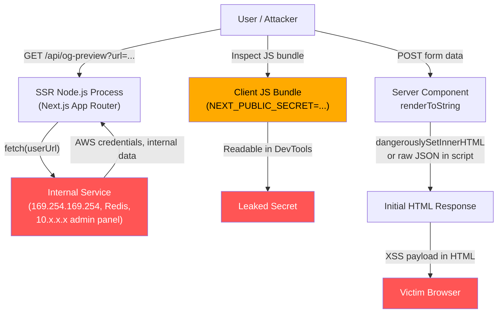

A pure Single-Page Application has almost no server-side attack surface beyond the API tier. The "server" is a CDN serving static files: HTML, JavaScript, and CSS. There is no Node.js process, no environment variable access, no database connection, no file system. An attacker who exploits a pure SPA has only the browser sandbox to work with.

That changes completely when a framework like Next.js App Router, Nuxt, SvelteKit, or Remix enters the stack. Frontend code now runs in a Node.js process that has access to environment variables, databases (via Prisma, Drizzle, or direct drivers), internal APIs on a private network, and the local file system. The same developer who built a safe SPA is now operating a server — and the security disciplines that come with servers apply in full.

The most consequential mental model shift is understanding Server Actions in Next.js. A function annotated with `'use server'` looks like a TypeScript function call. It feels like calling a helper. In reality, `'use server'` compiles the function to an HTTP POST endpoint at `/_next/action` with a hashed action ID. Any HTTP client — curl, Postman, a script on a hostile site — can call it directly, with any payload it chooses. The `'use server'` directive means "this runs on the server," not "this is protected." Authentication, authorization, input validation, and rate limiting are not provided by the framework; they are the developer's responsibility, on every action, every time.

This article covers the five highest-impact threat classes that emerge when moving from SPA to SSR: Server-Side Request Forgery, environment variable exposure, HTML injection in server rendering, prototype pollution in Node.js, and unauthenticated Server Actions.

## Principle

- **MUST NOT** prefix sensitive values with `NEXT_PUBLIC_`, `NUXT_PUBLIC_`, or `VITE_` — these prefixes inline the value into the client-side JavaScript bundle at build time, making it readable in browser DevTools by anyone
- **MUST** validate and allowlist URLs before any SSR fetch call that uses user-provided input, checking scheme, hostname, and IP range to prevent SSRF
- **SHOULD** treat every Server Action as an API route: add authentication, authorization, input validation, and rate limiting before touching any input or database
- **SHOULD** serialize only required fields when passing data from Server Components to Client Components — the RSC payload is embedded in the HTML response and is readable without authentication
- **SHOULD** use a type-safe environment variable library (`@t3-oss/env-nextjs`, `t3-env`) to enforce server/client variable boundaries at build time
- **SHOULD** use a Zod schema to validate all Server Action inputs and reject requests carrying `__proto__`, `constructor`, or `prototype` keys

## Design Thinking

### Why SSR changes the frontend security model entirely

A pure SPA cannot be used for Server-Side Request Forgery. There is no server to make the request from. The browser's same-origin policy prevents a client-side fetch to `http://169.254.169.254/` from reading the response, and the cloud metadata service is not reachable from the public internet anyway.

As soon as Next.js or Nuxt is in the stack, an attacker who finds a URL-injection point in an SSR route can issue requests from the Node.js process. That process runs inside the VPC, on the same network as internal services, with the cloud metadata endpoint reachable and environment variables loaded into `process.env`. SSRF, path traversal, credential exposure, and prototype pollution all become the frontend team's responsibility — not because the team chose to take on backend work, but because the framework chose to run server code.

### Why `NEXT_PUBLIC_` leaks are epidemic

The `NEXT_PUBLIC_` prefix system is a breaking-change footgun with a deceptively simple naming convention. At build time, Next.js performs a global search-and-replace: every reference to `process.env.NEXT_PUBLIC_STRIPE_SECRET_KEY` in the source code is replaced with the literal string value. The resulting JavaScript is shipped to every browser that loads the page.

Developers copy examples from documentation or Stack Overflow, name variables in a hurry, or come from backend environments where "environment variables are kept on the server." The string `NEXT_PUBLIC_` in a variable name is a promise that the value is public. There is no mechanism to make a `NEXT_PUBLIC_` variable secret after the build — the value is embedded in static JavaScript. A rebuild with a correctly named variable (no prefix) is the only remediation.

The same behavior applies to `NUXT_PUBLIC_` in Nuxt and `VITE_` in Vite-based frameworks.

### Why Server Actions need API-level scrutiny

The developer experience of Server Actions is deliberately function-call-like. You define a function in a `.ts` file, export it, import it into a Client Component, and call it from an event handler. The framework handles serialization. The code reads as if the client is calling a local function.

Underneath, Next.js assigns each exported `'use server'` function a hash, registers it as an HTTP POST handler at `/_next/action`, and routes incoming requests by action ID. There is no built-in authentication gate. A Server Action that deletes a database record can be called with:

```bash
curl -X POST https://your-app.com/ \
  -H "Next-Action: <action-hash>" \
  -H "Content-Type: application/json" \
  -d '["target-record-id"]'
```

The framework will execute it. Every security discipline that applies to an Express route handler applies equally to a Server Action. The Next.js documentation is explicit: "You should treat Server Actions as reachable via direct POST requests and verify authentication and authorization inside each one."

A critical additional point: Next.js Middleware runs on the Edge runtime. Server Actions run on the Node.js runtime. They are independent request handlers. Authenticating at the Middleware layer does not protect a Server Action from a direct POST request that bypasses the Middleware entirely.

### Why serializing minimal data matters

When a Server Component fetches a database row and passes it to a Client Component as a prop, the entire object is serialized into the RSC payload embedded in the HTML response. Any engineer can open browser DevTools, navigate to the Network tab, find the initial page load response, and inspect every field of every object passed across the Server/Client boundary.

A Prisma model typically includes columns added for internal purposes: `deletedAt` for soft deletes, `internalScore` for ranking algorithms, `adminNotes` for support staff, `stripeCustomerId` linking to billing. None of these fields belong in the client bundle. The correct pattern is to define a mapper that selects only the fields the Client Component needs, and pass only that mapped object. This is data minimization: the RSC payload contains only what is necessary, nothing more.

## Best Practices

- Use `@t3-oss/env-nextjs` or `t3-env` to define environment variables with explicit `server` and `client` schemas. Accessing a server variable from a client module throws a build-time error, catching accidental prefix exposure before deployment.

- Implement a URL validation helper for every SSR fetch that accepts user-provided URLs. Parse with `new URL()`, check that `protocol === 'https:'`, resolve the hostname, and reject any address in the RFC 1918 private ranges (10.x.x.x, 172.16-31.x.x, 192.168.x.x), loopback (127.x.x.x, `::1`), and link-local (169.254.x.x).

- Add an `auth()` check — NextAuth's `auth()`, Clerk's `currentUser()`, or your session library — as the absolute first line of every Server Action. If unauthenticated, throw immediately before reading any input.

- Use Zod to validate Server Action inputs with an explicit schema. Call `inputSchema.parse(rawInput)` before any database operation. The Zod schema is also the injection point for blocking prototype-pollution keys: add `.refine()` to reject any key named `__proto__`, `constructor`, or `prototype`.

- Create a `selectFields` mapper function for every database query result that crosses the Server/Client boundary. The mapper explicitly lists every field the Client Component needs. All other fields are dropped at the source, not filtered after the fact.

- Use `serialize-javascript` (or manual escaping) when embedding JSON in a `<script>` tag. Never use raw `JSON.stringify` for inline `<script>` content — a user value containing `</script>` terminates the tag and allows arbitrary HTML injection.

- Use the `server-only` package for modules that contain environment variable access, database clients, and internal API credentials. A build error on client-side import is caught in CI; a runtime data leak is caught in a breach notification.

## How It Works



**Vector 1 — SSRF:** A user-controlled URL parameter is passed to `fetch()` inside an SSR route. The Node.js process issues the request from inside the VPC, reaching the cloud metadata service or internal services that are not accessible from the public internet.

**Vector 2 — Environment variable exposure:** A secret named with the `NEXT_PUBLIC_` prefix is inlined into the JavaScript bundle at build time. Any visitor who opens DevTools can read it.

**Vector 3 — HTML injection:** Unescaped user data flows through `dangerouslySetInnerHTML` or raw `JSON.stringify` into a `<script>` tag in the SSR output. The XSS payload is delivered in the initial HTML response, before hydration.

## Example

### 1. URL validation helper (SSRF prevention)

```typescript
// lib/validate-url.ts
import { isIP } from 'net';

const PRIVATE_RANGES = [
  /^10\.\d+\.\d+\.\d+$/,
  /^172\.(1[6-9]|2\d|3[01])\.\d+\.\d+$/,
  /^192\.168\.\d+\.\d+$/,
  /^127\.\d+\.\d+\.\d+$/,
  /^169\.254\.\d+\.\d+$/,
  /^::1$/,
  /^fc00:/i,
  /^fe80:/i,
];

export function assertSafeUrl(raw: string): URL {
  let parsed: URL;
  try {
    parsed = new URL(raw);
  } catch {
    throw new Error('Invalid URL');
  }

  if (parsed.protocol !== 'https:') {
    throw new Error('Only HTTPS URLs are allowed');
  }

  const hostname = parsed.hostname.toLowerCase();

  // Reject raw IP addresses in private ranges
  if (isIP(hostname) !== 0) {
    for (const range of PRIVATE_RANGES) {
      if (range.test(hostname)) {
        throw new Error('URL resolves to a private or reserved address');
      }
    }
  }

  // Reject hostnames that are known internal aliases
  if (hostname === 'localhost' || hostname.endsWith('.internal')) {
    throw new Error('URL resolves to an internal address');
  }

  return parsed;
}

// Usage in an SSR route handler
// app/api/og-preview/route.ts
import { assertSafeUrl } from '@/lib/validate-url';

export async function GET(request: Request) {
  const { searchParams } = new URL(request.url);
  const rawUrl = searchParams.get('url') ?? '';

  const safeUrl = assertSafeUrl(rawUrl); // throws if SSRF target

  const response = await fetch(safeUrl.toString(), {
    headers: { Accept: 'text/html' },
    redirect: 'error', // do not follow redirects that could bypass hostname check
  });

  // ... process and return OG metadata
}
```

### 2. Server Action with auth, Zod validation, and rate limiting

```typescript
// app/actions/delete-post.ts
'use server';

import { auth } from '@/lib/auth';           // NextAuth / Clerk / your auth lib
import { rateLimit } from '@/lib/rate-limit'; // e.g., Upstash Redis rate limiter
import { db } from '@/lib/db';
import { z } from 'zod';

const deletePostInput = z.object({
  postId: z.string().uuid(),
}).strict(); // reject any extra keys

export async function deletePost(rawInput: unknown) {
  // 1. Authentication — first, before anything else
  const session = await auth();
  if (!session?.user) {
    throw new Error('Unauthenticated');
  }

  // 2. Rate limiting
  const { success } = await rateLimit(session.user.id, 'delete-post', { max: 10, window: '1m' });
  if (!success) {
    throw new Error('Rate limit exceeded');
  }

  // 3. Input validation
  const input = deletePostInput.parse(rawInput);

  // 4. Authorization — verify ownership
  const post = await db.post.findUnique({ where: { id: input.postId } });
  if (!post) throw new Error('Not found');
  if (post.authorId !== session.user.id) {
    throw new Error('Forbidden');
  }

  // 5. Mutation
  await db.post.delete({ where: { id: input.postId } });
}
```

### 3. Type-safe environment variables with `@t3-oss/env-nextjs`

```typescript
// env.ts  (import this everywhere instead of process.env directly)
import { createEnv } from '@t3-oss/env-nextjs';
import { z } from 'zod';

export const env = createEnv({
  server: {
    // These are NEVER sent to the client. Accessing from a Client Component = build error.
    DATABASE_URL: z.string().url(),
    STRIPE_SECRET_KEY: z.string().min(1),
    NEXTAUTH_SECRET: z.string().min(32),
    INTERNAL_API_KEY: z.string().min(1),
  },
  client: {
    // These ARE inlined into the client bundle. Only put public values here.
    NEXT_PUBLIC_APP_URL: z.string().url(),
    NEXT_PUBLIC_STRIPE_PUBLISHABLE_KEY: z.string().startsWith('pk_'),
  },
  // For T3 env to read process.env correctly in Next.js
  runtimeEnv: {
    DATABASE_URL: process.env.DATABASE_URL,
    STRIPE_SECRET_KEY: process.env.STRIPE_SECRET_KEY,
    NEXTAUTH_SECRET: process.env.NEXTAUTH_SECRET,
    INTERNAL_API_KEY: process.env.INTERNAL_API_KEY,
    NEXT_PUBLIC_APP_URL: process.env.NEXT_PUBLIC_APP_URL,
    NEXT_PUBLIC_STRIPE_PUBLISHABLE_KEY: process.env.NEXT_PUBLIC_STRIPE_PUBLISHABLE_KEY,
  },
});
```

### 4. Minimal data serialization (mapper pattern)

```typescript
// app/dashboard/page.tsx  — Server Component
import { db } from '@/lib/db';
import { auth } from '@/lib/auth';
import { UserCard } from './UserCard'; // 'use client'

// The Prisma User model has: id, name, email, avatarUrl, passwordHash,
// stripeCustomerId, internalScore, adminNotes, deletedAt, ...
type PublicUser = {
  id: string;
  name: string;
  avatarUrl: string | null;
};

function toPublicUser(user: Awaited<ReturnType<typeof db.user.findUniqueOrThrow>>): PublicUser {
  // Explicit allowlist — only the three fields the Client Component renders
  return {
    id: user.id,
    name: user.name,
    avatarUrl: user.avatarUrl,
  };
}

export default async function DashboardPage() {
  const session = await auth();
  const user = await db.user.findUniqueOrThrow({ where: { id: session!.user.id } });

  // Pass only the public shape — passwordHash, stripeCustomerId, etc. never reach the RSC payload
  return <UserCard user={toPublicUser(user)} />;
}
```

### 5. JSON injection prevention for embedded script data

```typescript
// DANGEROUS — user data containing </script> breaks out of the tag
export function UnsafeInlineData({ data }: { data: unknown }) {
  return (
    <script
      dangerouslySetInnerHTML={{
        // If data = { name: '</script><script>alert(1)</script>' }
        // the following terminates the script tag and injects arbitrary HTML
        __html: `window.__INITIAL_DATA__ = ${JSON.stringify(data)}`,
      }}
    />
  );
}

// SAFE — use serialize-javascript which escapes </script>, line separators, etc.
import serialize from 'serialize-javascript';

export function SafeInlineData({ data }: { data: unknown }) {
  return (
    <script
      dangerouslySetInnerHTML={{
        __html: `window.__INITIAL_DATA__ = ${serialize(data, { isJSON: true })}`,
      }}
    />
  );
}

// ALSO SAFE — manual escaping for environments without serialize-javascript
function escapeForScriptTag(json: string): string {
  return json
    .replace(/</g, '\\u003c')
    .replace(/>/g, '\\u003e')
    .replace(/&/g, '\\u0026')
    .replace(/\u2028/g, '\\u2028')
    .replace(/\u2029/g, '\\u2029');
}
```

## Common Mistakes

**Naming secrets `NEXT_PUBLIC_*`**

The prefix makes the value unconditionally public. It is inlined into the JavaScript bundle at build time by a compiler substitution — there is no runtime mechanism to protect it. A variable named `NEXT_PUBLIC_STRIPE_SECRET_KEY` will have its value visible in the built `.js` file to every visitor. Renaming the variable and rebuilding is the only remediation; clearing a CDN cache does not help if old bundles are cached in browser storage.

Convention: no prefix means server-only; `NEXT_PUBLIC_` means explicitly public. Use this as the entire decision framework before naming any environment variable.

**Fetching `searchParams.url` or `body.url` in an SSR route without URL validation**

This is the canonical SSRF entry point in Next.js applications. Open Graph preview routes (`/api/og?url=...`), image proxy routes (`/api/proxy?url=...`), and link preview APIs all take a URL from the user and fetch it server-side. Without an allowlist check, an attacker passes `url=http://169.254.169.254/latest/meta-data/iam/security-credentials/` and receives AWS IAM credentials in the response. The fix is `assertSafeUrl(rawUrl)` before any `fetch()` call.

**Relying on Middleware for Server Action authentication**

Next.js Middleware runs on the Vercel Edge Network or the Node.js Edge runtime — a separate execution context from the Node.js runtime that handles Server Actions. A direct POST request with the correct `Next-Action` header and action hash bypasses the Middleware path and reaches the Server Action handler directly. Middleware auth is a UI access control; it is not a Server Action security boundary. Every Server Action must call `auth()` independently.

**Passing the full Prisma model to a Client Component**

Every field in the database row — including internal flags, soft-delete timestamps, hashed passwords, third-party account IDs, and billing references — becomes part of the RSC payload embedded in the HTML. Engineers reviewing a page with browser DevTools can read it without authentication. The fix is a mapper function that explicitly selects only the fields the Client Component renders.

**Using `dangerouslySetInnerHTML` with unsanitized server data**

React's JSX interpolation (`{value}`) auto-escapes text content. `dangerouslySetInnerHTML` does not. A Server Component that passes user-controlled data directly to `dangerouslySetInnerHTML` delivers XSS in the initial HTML response — before hydration, before CSP nonces are applied. Sanitize with DOMPurify (server-side via jsdom) or avoid `dangerouslySetInnerHTML` with untrusted content entirely.

**`JSON.parse` of untrusted input without a prototype-pollution reviver**

Passing `{"__proto__": {"isAdmin": true}}` through `JSON.parse` and then merging it into an object can pollute `Object.prototype` for the entire Node.js process. Every subsequent `{}` object that reads `obj.isAdmin` will return `true`. The fix is to validate with Zod before using any parsed JSON, use `Object.create(null)` for accumulator objects, and add a reviver that throws on `__proto__`, `constructor`, and `prototype` keys.

## Related FEEs

- [FEE-1200: Security Overview](./1200.md) — category context and the SSR attack surface
- [FEE-1201: Content Security Policy](./1201.md) — nonce generation in SSR middleware (Next.js)
- [FEE-1202: Authentication & Token Storage](./1202.md) — cookie forwarding in SSR fetch calls and token validation
- [FEE-1203: XSS Prevention](./1203.md) — server-side XSS via unsanitized renderToString output
- [FEE-1204: CORS & CSRF](./1204.md) — CORS on SSR API routes and Server Actions
- [FEE-1506: Secrets, Environment Variables & Security in CI](../CI%20CD%20and%20Deployment/1506.md) — NEXT_PUBLIC_ prefix and build-time env var security

## References

- [Server Actions security — Next.js docs](https://nextjs.org/docs/app/building-your-application/data-fetching/server-actions-and-mutations#security)
- [Environment variables — Next.js docs](https://nextjs.org/docs/app/guides/environment-variables)
- [How to Think About Security in Next.js — Next.js blog](https://nextjs.org/blog/security-nextjs-server-components-actions)
- [OWASP: Server-Side Request Forgery Prevention Cheat Sheet](https://cheatsheetseries.owasp.org/cheatsheets/Server_Side_Request_Forgery_Prevention_Cheat_Sheet.html)
- [Preventing SSRF in Node.js — Snyk blog](https://snyk.io/blog/preventing-server-side-request-forgery-node-js/)
- [t3-env — typesafe environment variables](https://env.t3.gg/)
- [Prototype pollution — MDN Web Security](https://developer.mozilla.org/en-US/docs/Web/Security/Attacks/Prototype_pollution)
- [OWASP: Prototype Pollution](https://owasp.org/www-community/attacks/Prototype_Pollution)
- [serialize-javascript — npm](https://www.npmjs.com/package/serialize-javascript)
- [Next.js Server Actions Security: 5 Vulnerabilities — Makerkit](https://makerkit.dev/blog/tutorials/secure-nextjs-server-actions)
- [Advisory: Next.js SSRF (CVE-2024-34351) — Assetnote](https://www.assetnote.io/resources/research/advisory-next-js-ssrf-cve-2024-34351)
