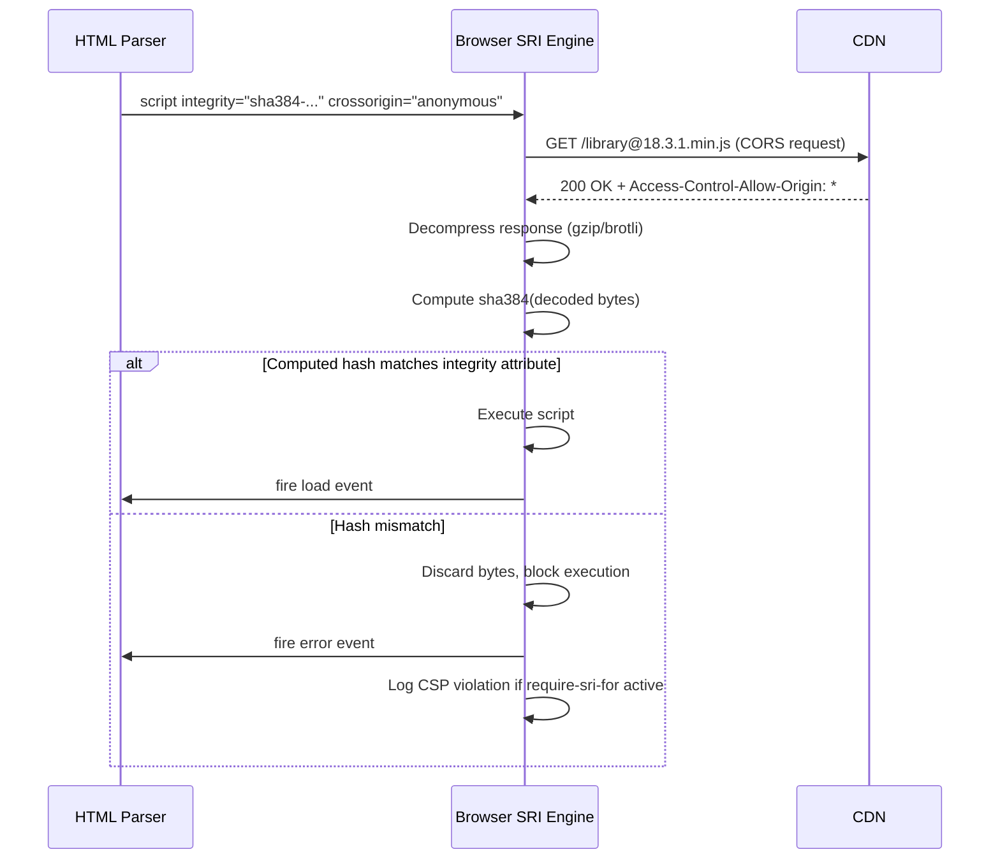

# Subresource Integrity (SRI)

Every CDN-hosted script or stylesheet is a trust decision. When a browser
fetches jQuery from a CDN, it executes whatever bytes the CDN returns — there
is no built-in verification that the file is the one the developer intended.
If the CDN is compromised, if a misconfigured cache serves a poisoned version,
or if the URL is intercepted in transit, the browser has no way to detect the
substitution. The page executes the malicious code with full access to the
DOM, user credentials stored in memory, and any data the page processes.

Subresource Integrity closes this gap. An SRI-protected resource includes a
cryptographic hash of the expected bytes embedded directly in the HTML element
that loads it. Before executing or applying a resource, the browser computes
the hash of the received bytes and compares it against the declared value. If
they do not match, the browser refuses to execute the resource and fires a
load error instead. The CDN's delivery network is no longer in the trust chain
— the hash is.

SRI is not limited to third-party public CDNs. It applies equally to any
externally hosted asset: fonts from a type foundry, analytics scripts from a
vendor, A/B testing libraries loaded from a SaaS platform, or polyfills from
a shared internal CDN. The threat model is simple: any URL outside your own
origin is a trust boundary, and that boundary is unenforceable without a
mechanism to verify the bytes that cross it.

This article covers the mechanics of SRI hash generation, the browser's
enforcement behavior, the interaction with the `require-sri-for` CSP
directive, and patterns for automating SRI in a build pipeline so that hashes
remain current without manual maintenance at every dependency update cycle.

## Design Thinking

### How the browser enforces SRI at fetch time

When the HTML parser encounters a `<script integrity="...">` or
`<link integrity="...">` element, it initiates a fetch with integrity metadata
attached. After the response arrives, the browser decompresses any content
encoding — gzip, brotli, or deflate — and computes the hash of the raw decoded
bytes. It then compares that hash against every `integrity` value listed in the
attribute. A resource passes the check if at least one declared hash matches
the computed value.

When multiple algorithms are listed in a single `integrity` attribute
(separated by spaces), the browser uses the strongest algorithm available.
Specifying both `sha384-<hash>` and `sha512-<hash>` allows browsers that
support `sha512` to use the stronger check while gracefully supporting
environments with more limited cryptographic capabilities. This multiple-hash
pattern also provides forward compatibility: as algorithm deprecations occur
over time, a new hash can be added alongside the old one without breaking
existing deployments.

The `crossorigin` attribute is not optional for SRI. Without it, the browser
performs a no-CORS fetch, which produces an opaque response — a response whose
bytes are intentionally hidden from the browser's own inspection mechanisms.
Because the browser cannot read the bytes of an opaque response, it cannot
compute a hash for comparison. The element loads silently without integrity
verification, and the `integrity` attribute has no effect whatsoever. Setting
`crossorigin="anonymous"` forces a CORS fetch with no credentials. The CDN
must respond with `Access-Control-Allow-Origin: *` or the specific requesting
origin, which all major public CDNs do for publicly released library files.

When a hash check fails, the browser logs a detailed error to the console,
fires an `error` event on the element, and discards the response bytes without
executing or applying them. The `load` event is never fired. Any JavaScript
that assumed the resource loaded successfully will fail with reference errors.
Applications that protect critical scripts with SRI should implement `error`
event listeners on those elements to detect failures and respond: displaying a
user message, retrying from a fallback URL, or logging the failure to an error
reporting service.

### Generating correct SRI hashes at the byte level

The `integrity` hash must be computed over the exact bytes the browser will
receive and process after decompression. This byte-level precision matters
because CDNs frequently serve the same logical file in multiple encodings
depending on what the request's `Accept-Encoding` header specifies. The hash
must be over the uncompressed content, not the compressed wire representation.

The canonical command-line method pipes the decompressed response bytes through
OpenSSL's digest command, then base64-encodes the raw binary output:

```
curl -s https://cdn.example.com/library@1.2.3.min.js \
  | openssl dgst -sha384 -binary \
  | openssl base64 -A
```

The `-binary` flag on `openssl dgst` is critical. Without it, OpenSSL writes
the digest as a lowercase hexadecimal string. Base64-encoding a hex string
produces a value that looks syntactically plausible in an `integrity`
attribute but will never match what the browser computes — the browser hashes
raw bytes and base64-encodes the raw digest, not a hex digest. The `-A` flag
suppresses the line wrapping that `openssl base64` adds by default, which
would produce an invalid multi-line hash value.

The `curl` invocation without explicit `Accept-Encoding` suppression allows
the server to return a compressed response, which curl then decompresses
transparently before piping to OpenSSL. This mirrors exactly what the browser
does — decompress, then hash. The computed hash is therefore over the same
bytes the browser will compute its hash over.

Build tool plugins eliminate the manual step entirely. Webpack's
`webpack-subresource-integrity` plugin integrates at the asset emission phase:
after Webpack generates output chunks, the plugin computes `sha384` hashes
over each chunk's bytes and injects `integrity` and `crossorigin` attributes
into every `<script>` and `<link>` tag in the generated HTML template. Vite's
`vite-plugin-sri` operates at the `generateBundle` hook, applying the same
transformation to Rollup output. For CDN-linked libraries outside the build
tool's control, a dedicated hash-fetching script runs as a pre-build step,
downloads each URL, computes its hash, and writes the result into a JSON
manifest that the HTML template reads at build time.

### Using require-sri-for to enforce SRI at document scope

Individual `integrity` attributes make SRI opt-in: developers must remember
to add them for every external resource. The `Content-Security-Policy`
header's `require-sri-for` directive changes the model to opt-out: the browser
refuses to load any script or stylesheet that lacks a valid `integrity`
attribute, making SRI mandatory for all resources in the document.

With `require-sri-for script style` set in the CSP, a dynamically injected
`<script>` without an `integrity` attribute is blocked even if the injecting
code comes from a trusted first-party script. This is precisely the attack
scenario `require-sri-for` defends against: a supply-chain-compromised
first-party dependency injects a second malicious script. Because the injected
element has no hash, the browser blocks it despite trusting the injecting
script.

`require-sri-for` also catches developers who add a new CDN dependency and
forget to include the `integrity` attribute — the load failure is immediate and
visible during development and testing rather than silently succeeding in
production. When paired with CSP `report-to` or `report-uri`, violations
generate automated reports to a collection endpoint, enabling monitoring for
SRI failures in production caused by CDN changes rather than active attacks.

Browser support for `require-sri-for` is limited to Chromium-based browsers
as of this writing. Firefox and Safari enforce per-element `integrity`
attributes correctly but do not implement the directive. Treat `require-sri-for`
as a defense-in-depth layer on top of element-level `integrity` attributes,
not as a substitute for them.

### Automating SRI in the build pipeline for long-term maintainability

Manual SRI maintenance does not survive dependency update cycles. Every time
a library version changes, the content changes, and therefore the hash changes.
A hash embedded in an HTML template that is not regenerated when the dependency
version changes will cause a load failure the moment the CDN serves new file
content at the pinned version URL. This failure is a hard breakage that surfaces
for all users immediately on deployment — not a graceful degradation.

The correct approach couples hash generation to the version resolution step in
the build. For self-hosted assets built by Webpack or Vite, the SRI plugins
described above handle this automatically — hash generation is not a separate
step because it occurs at asset emission time. For CDN-linked libraries, a
build-time script reads the configured CDN URLs and versions, fetches each URL,
computes the hash, and writes the result into a manifest file. The manifest is
committed to version control.

A CI enforcement step complements manifest generation by recomputing hashes
for every CDN URL in the manifest during the build and failing if any computed
hash does not match the stored value. This catches the scenario where a
developer updates a CDN version string but forgets to regenerate the hash. It
also catches CDN-side content changes: if a CDN changes what bytes it serves
at a version URL — which should not happen but has occurred during CDN
incidents — the mismatch appears in CI before it reaches production.

Storing the hash manifest in version control provides an audit trail. Every
change to an external resource hash appears in the diff, giving code reviewers
the opportunity to verify that a changed hash corresponds to a legitimate
version bump rather than unexplained content substitution. The diff is a
security control in itself.

### SRI with CDN-hosted libraries: version pinning requirements

CDNs expose library versions at multiple granularities. A major alias like
`react@18` points to the latest 18.x release. A minor alias like `react@18.3`
points to the latest 18.3.x patch. A full version string `react@18.3.1` is
immutable — the CDN will not change what bytes it returns at that URL after
the version is published. Using major or minor aliases with SRI is
incompatible: an alias that updates to a new release changes the content at
that URL, which changes the hash. An `integrity` attribute that matched
yesterday's content immediately fails against today's updated content, blocking
the resource and breaking the page for all users.

Pinning to a full semantic version in the CDN URL is required. This means
updating CDN-linked libraries requires two intentional steps: update the
version string in the URL and regenerate the hash. That friction is
intentional. An unverified dependency update is a security risk. Requiring a
deliberate hash regeneration step prevents developers from silently pulling in
a new library version without also verifying what they are pulling in. Most
major CDNs — including jsDelivr and cdnjs — display the SRI hash for each
file in each version on their package pages, making the intended workflow
clear: choose a version, copy the `<script>` tag with the pre-filled
`integrity` attribute, update the HTML, commit the change.

## Best Practices

**MUST** include `crossorigin="anonymous"` on every SRI-protected `<script>`
and `<link>` element. Omitting this attribute causes the browser to perform a
no-CORS fetch and skip hash verification silently — the `integrity` attribute
has no effect, providing a false sense of security with no actual protection.

**MUST** use `sha384` or `sha512` as the hashing algorithm. `sha256` is valid
per the SRI specification but the longer digest lengths provide a stronger
collision resistance margin appropriate for security-critical verification.

**SHOULD** pin CDN URLs to exact patch versions (`@18.3.1`) rather than major
or minor aliases (`@18` or `@18.3`). Version aliases are mutable — the CDN
updates them to new releases, which changes the file content and immediately
invalidates the declared hash in production.

**SHOULD** automate hash generation as part of the build pipeline using Webpack
or Vite SRI plugins for self-hosted assets, and a build-time fetch script for
CDN-linked resources. Manual maintenance produces stale hashes when
dependencies update.

**SHOULD** commit the SRI hash manifest to version control so that changes to
external resource hashes appear in code review and can be audited over time.

**MUST NOT** apply `integrity` to resources loaded over plain HTTP. On an
insecure connection, a network attacker can replace both the resource bytes and
the HTML document that declares the `integrity` attribute. SRI requires HTTPS
to provide meaningful protection.

## Visual



## Example

```html
<!-- React and ReactDOM pinned to exact versions with SHA-384 SRI hashes -->
<script
  src="https://cdn.jsdelivr.net/npm/react@18.3.1/umd/react.production.min.js"
  integrity="sha384-dOXCvJyNGSCFkJiMKBFMVzH7k5GqDTv1J7Kjay0K8lmzKQk2KQKFR2Hnk+1q9N"
  crossorigin="anonymous"
></script>
<script
  src="https://cdn.jsdelivr.net/npm/react-dom@18.3.1/umd/react-dom.production.min.js"
  integrity="sha384-ELHHM0r9xEOFLLh6khwFMWfxB/qR3WmVK8HtNaFB5EQDM+3GFagSgLwKuHJ0L8y"
  crossorigin="anonymous"
  onerror="console.error('ReactDOM failed SRI check')"
></script>

<!--
Hash generation for any CDN URL:
  curl -s https://cdn.example.com/lib@1.0.0.min.js \
    | openssl dgst -sha384 -binary \
    | openssl base64 -A

Vite config with automatic SRI injection for all build output:
  import sri from 'vite-plugin-sri'
  export default { plugins: [sri()] }

CSP header enforcing SRI on all scripts and stylesheets:
  Content-Security-Policy: require-sri-for script style
-->
```

## Common Mistakes

- Omitting `crossorigin="anonymous"` — the browser silently bypasses hash
  verification with no indication that the `integrity` attribute was ignored
- Computing the hash before decompression — hashing compressed wire bytes
  instead of decoded content produces a value that never matches the browser's
  computed hash
- Using CDN version aliases instead of exact version pins — the alias content
  changes on new releases, immediately breaking the declared hash in production
- Forgetting to regenerate hashes after updating a dependency version — stale
  hashes cause hard load failures for all users after deployment
- Applying SRI only to `<script>` and ignoring `<link rel="stylesheet">` —
  CSS can exfiltrate data via attribute selectors and `url()` callbacks and
  requires the same protection

## Related FEEs

- FEE-1200: Content Security Policy Deep Dive
- FEE-1204: Supply Chain Security for Frontend Projects
- FEE-1209: Open Redirect Prevention & URL Validation

## References

- [MDN: Subresource Integrity](https://developer.mozilla.org/en-US/docs/Web/Security/Subresource_Integrity)
- [W3C SRI Specification](https://www.w3.org/TR/SRI/)
- [webpack-subresource-integrity plugin](https://github.com/waysact/webpack-subresource-integrity)
