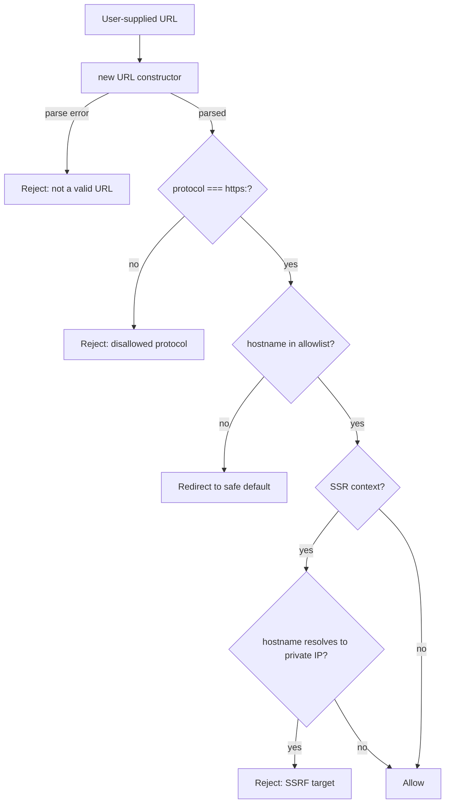

# Open Redirect Prevention & URL Validation

An open redirect vulnerability occurs when a web application accepts a URL
as user input and redirects the browser to that URL without validating that
the destination is safe. The classic pattern is a login page that accepts a
`?redirect=` parameter: after authentication succeeds, the server sends
`Location: <value of redirect parameter>`. If the application does not
validate this value, an attacker can craft a link like
`https://trusted-site.com/login?redirect=https://evil.com/phishing` and send
it to victims. The victim sees `trusted-site.com` in the URL they click,
completes the login, and is redirected to the attacker's page — which may
mimic the trusted site to harvest credentials.

Open redirect is often dismissed as low-severity because it does not directly
compromise the application. This assessment is incorrect in several contexts.
When combined with OAuth flows, an open redirect can leak authorization codes
or access tokens — the attacker controls the redirect URI and captures the
token that the authorization server appends to it. In phishing campaigns, the
trusted domain in the initial URL dramatically increases click-through rates
and bypasses URL reputation filters that would block a direct link to the
attacker domain. In Server-Side Request Forgery (SSRF) chains, a redirect to
an internal URL can cause the server to make requests to infrastructure that
should not be reachable from the public internet.

URL validation is also independently important beyond redirect handling. Any
frontend code that constructs `src`, `href`, or `action` attributes from
user-supplied data — image previews, link builders, form targets — creates
injection opportunities. Without validation, `javascript:` protocol injections
can execute arbitrary code in the browser. In SSR contexts, user-supplied URLs
passed to `fetch()` on the server create SSRF vulnerabilities with a
significantly wider impact than the same bug in a pure client-side application.

This article covers the attack vectors, the correct use of the `URL`
constructor for parsing, allowlist vs. blocklist validation strategies, the
`rel="noopener noreferrer"` requirement for outbound links, and SSRF
considerations in SSR frameworks.

## Principle

URL validation MUST use a proper URL parser rather than regular expressions
or string manipulation. The `URL` constructor in browsers and Node.js parses
URLs according to the WHATWG URL specification, handling all edge cases that
hand-rolled regex fails on: percent-encoded characters, IP address notations,
Unicode normalization, and protocol-relative URLs. After parsing, the
application MUST validate the parsed components — protocol, hostname, and
path — against an allowlist of acceptable values. Blocklisting specific bad
values is insufficient: the attack surface of valid URL syntax is too large
to enumerate defensively.

## Design Thinking

### Why regex-based URL validation fails

The intuitive approach to URL validation is a regular expression: reject
anything that does not match the expected pattern. This approach fails against
URL syntax in practice because URL parsing is defined by the WHATWG URL
specification, which is substantially more permissive than any regex a
developer is likely to write.

A regex that allows `https://example.com/path` will typically reject
`https://example.com%2Fpath` — but a browser will parse the percent-encoded
slash and navigate to the same effective path. A check for `https://` at the
start of the string does not prevent `https://attacker.com@trusted.com/` —
where `attacker.com` is the hostname because the `@` symbol marks everything
before it as the user-info component. A check for the trusted domain as a
substring can be bypassed by `https://attacker.com/trusted.com/path` or
`https://trusted.com.attacker.com/`. Unicode normalization adds another
dimension: browsers apply IDNA (Internationalized Domain Names in Applications)
processing, and lookalike Unicode characters can produce hostnames that appear
identical to a trusted domain but resolve differently.

The correct baseline is always to parse with `new URL()` first, catch the
exception if the input is not a valid URL, and then validate the parsed
components. After parsing, `url.hostname` contains the normalized hostname
without the user-info component, `url.protocol` contains the normalized
protocol including the trailing colon, and `url.pathname` contains the
decoded path. These normalized values are safe to compare against an allowlist
without worrying about encoding tricks or syntax edge cases.

### Allowlist vs. blocklist validation strategies

The fundamental choice in URL validation is whether to allowlist (permit
specific values explicitly) or blocklist (reject specific bad values). For
security-sensitive decisions like redirect destinations, allowlisting is
always correct and blocklisting is always wrong as the primary control.

An allowlist for redirect destinations is typically one of two forms: an
exact set of permitted origins, or a rule that permits any path on the current
application's own origin. The first form is used when redirects can go to a
small set of known partner sites. The second form — restrict redirects to
same-origin destinations — is the most common and most straightforward: after
parsing the user-supplied URL, check that `url.origin === window.location.origin`
(in a browser) or that the hostname matches the application's configured
hostname (on a server). If the hostname does not match, redirect to a safe
default instead of the supplied URL.

Blocklisting fails for several structural reasons. Blocking `javascript:` does
not prevent `JAVASCRIPT:` (the protocol comparison is case-insensitive per the
spec). Blocking `//attacker.com` does not prevent `https://attacker.com`.
Blocking external hostnames by name does not prevent IP addresses that resolve
to those hostnames, or SSRF to `127.0.0.1`, `::1`, or cloud metadata endpoints
like `169.254.169.254`. Each blocklist entry is a narrow exclusion in an
unbounded space of possible inputs. The attacker has infinite attempts to find
a bypass; the defender must anticipate every one.

### The javascript: protocol injection pattern

`javascript:` URLs are a special-cased protocol that executes JavaScript when
navigated to. They are the oldest XSS vector in URL-accepting attributes:
`<a href="javascript:alert(1)">`, `window.location = "javascript:..."`,
``. The `URL` constructor handles this correctly
in most contexts: `new URL("javascript:alert(1)")` produces a URL with
`protocol: "javascript:"`, which the allowlist check for `https:` rejects.

The danger arises when code constructs URLs without parsing. String
concatenation like `element.href = userInput` or `window.location.href =
redirectParam` passes the raw string to the browser without validation. If
`userInput` is `javascript:alert(document.cookie)`, the script executes in the
page's origin context. The fix is straightforward: always parse with `new URL()`
and validate the protocol before using the URL in any attribute or navigation.

React's JSX handles this in some cases — React 16+ will not render
`href="javascript:..."` in JSX because it recognizes the pattern. This
protection is not universal: `dangerouslySetInnerHTML`, dynamic navigation
via `window.location`, and server-rendered pages without React's sanitization
are all unprotected. Do not rely on framework-specific behavior as the primary
defense.

### SSRF in SSR contexts

When a frontend application uses a server-side rendering framework like
Next.js, Nuxt, or SvelteKit, `fetch()` calls in server components, API
routes, and server actions execute in a Node.js process. This process has
access to internal networks: other microservices, databases via their admin
APIs, internal load balancers, and the cloud instance metadata service
(typically at `169.254.169.254` on AWS, GCP, and Azure).

A URL injection in a server-side `fetch()` call is an SSRF vulnerability with
potentially severe impact. An attacker who can control the URL fetched by the
Node.js process can probe internal network topology, read environment variables
from the cloud metadata service (including IAM credentials), and interact with
internal services that have no authentication because they are assumed to be
inaccessible from the public internet.

The validation requirements are stricter than for client-side redirects. In
addition to protocol and hostname allowlisting, server-side URL validation must
reject IP address ranges used for private and reserved networks: `10.0.0.0/8`,
`172.16.0.0/12`, `192.168.0.0/16`, `127.0.0.0/8`, `169.254.0.0/16`, and their
IPv6 equivalents. The `new URL()` constructor normalizes the hostname, but it
does not perform DNS resolution — an allowlist check against the parsed
hostname may still pass a hostname that resolves to a private IP. Defense in
depth for server-side SSRF therefore requires both parse-time hostname
validation and a network-level control that blocks outbound requests to private
IP ranges.

### rel="noopener noreferrer" for outbound links

When the application renders user-supplied or untrusted URLs as `<a>` elements
with `target="_blank"`, the linked page gains access to the opener window via
`window.opener`. The linked page can call `window.opener.location = "..."` to
redirect the original tab to a different URL — a reverse tabnapping attack
where clicking a link in the trusted application causes the trusted application's
own tab to navigate to a phishing page.

The `rel="noopener"` attribute instructs the browser to set `window.opener`
to null in the new tab, preventing this access. `rel="noreferrer"` additionally
suppresses the `Referer` header from the new tab's requests, preventing the
linked page from learning that the user arrived from the trusted application.
Both attributes should be applied together: `rel="noopener noreferrer"` on all
`<a target="_blank">` elements, whether the href is user-supplied or internal.

## Best Practices

**MUST** parse user-supplied URLs with `new URL()` before any validation logic.
Regular expressions and string operations cannot safely handle the full range
of URL syntax variations that browsers accept.

**MUST** validate the parsed `url.protocol` and `url.hostname` against an
explicit allowlist. Rejecting specific bad values is insufficient — permit
only what is explicitly expected.

**SHOULD** restrict redirect destinations to same-origin paths by default
unless external redirect targets are explicitly required. A redirect to
`/dashboard` cannot be abused as an open redirect; a redirect to an arbitrary
URL can.

**SHOULD** apply `rel="noopener noreferrer"` to all `<a target="_blank">`
elements. Most modern linters include rules for this; enabling them in the
project ESLint configuration enforces the pattern without relying on manual
review.

**MUST NOT** construct `href`, `src`, `action`, or navigation targets from
user input using string concatenation without parsing and validation. Even
single-origin redirects should be constructed from parsed, validated components
rather than from raw user strings to prevent path traversal.

## Visual



## Example

```typescript
// lib/validate-redirect.ts
// Safe URL validation for redirect parameters and user-supplied hrefs.

const ALLOWED_PROTOCOLS = new Set(['https:']);
const ALLOWED_HOSTNAMES = new Set([
  'app.example.com',
  'docs.example.com',
]);

/**
 * Validate a redirect URL for client-side navigation.
 * Returns the parsed URL if valid, or null to redirect to a safe default.
 */
export function validateRedirectUrl(
  raw: string,
  currentOrigin: string,
): URL | null {
  let parsed: URL;
  try {
    // Resolve relative URLs against the current origin
    parsed = new URL(raw, currentOrigin);
  } catch {
    return null; // Not a valid URL
  }

  if (!ALLOWED_PROTOCOLS.has(parsed.protocol)) {
    return null; // Blocks javascript:, data:, ftp:, etc.
  }

  // Same-origin redirect: always safe
  if (parsed.origin === currentOrigin) {
    return parsed;
  }

  // Cross-origin: require explicit hostname allowlist
  if (ALLOWED_HOSTNAMES.has(parsed.hostname)) {
    return parsed;
  }

  return null;
}

// Usage in a Next.js login action:
// app/actions/login.ts
import { redirect } from 'next/navigation';
import { validateRedirectUrl } from '@/lib/validate-redirect';
import { headers } from 'next/headers';

export async function loginAction(formData: FormData) {
  const redirectParam = formData.get('redirect') as string | null;
  const origin = headers().get('origin') ?? 'https://app.example.com';

  // Authenticate user...

  const safeUrl = redirectParam
    ? validateRedirectUrl(redirectParam, origin)
    : null;

  redirect(safeUrl?.pathname ?? '/dashboard');
}
```

## Common Mistakes

- Using `url.includes('evil.com')` or regex substring checks instead of
  `url.hostname` from a parsed `URL` object — bypassed by subdomains,
  path components, and user-info tricks
- Checking `url.startsWith('https://')` on the raw string — bypassed by
  whitespace, Unicode characters, and `https://evil.com@trusted.com/`
- Forgetting to handle the case where `new URL(raw)` resolves a relative
  URL to `javascript:` or `data:` — always check `protocol` after parsing
- Passing user-supplied URL strings directly to server-side `fetch()` without
  hostname and private-IP validation — creates SSRF in SSR frameworks

## Related FEEs

- FEE-1200: Content Security Policy Deep Dive
- FEE-1207: SSR & Server Component Security
- FEE-1208: Subresource Integrity (SRI)

## References

- [WHATWG URL Standard](https://url.spec.whatwg.org/)
- [OWASP: Unvalidated Redirects and Forwards Cheat Sheet](https://cheatsheetseries.owasp.org/cheatsheets/Unvalidated_Redirects_and_Forwards_Cheat_Sheet.html)
- [PortSwigger: SSRF via Open Redirection](https://portswigger.net/web-security/ssrf)
