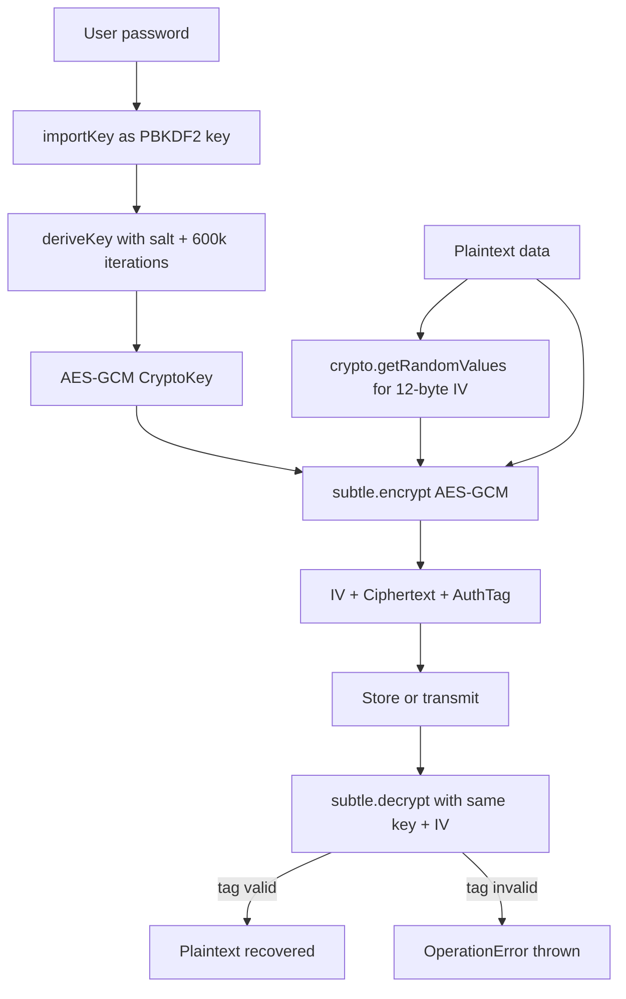

# Client-Side Key Derivation & Web Crypto API

The Web Crypto API gives browsers native access to cryptographic primitives:
hash functions, message authentication codes, public-key algorithms, symmetric
ciphers, and key derivation functions. These primitives are implemented in
native code — not in JavaScript libraries — and operate on binary data rather
than strings. The result is both faster execution and a smaller attack surface
than general-purpose JavaScript crypto implementations.

Access to cryptographic primitives does not, however, mean that doing
cryptography in the browser is always appropriate. Cryptography is easy to
misuse in ways that appear secure but are not. A fundamental constraint applies
throughout: any secret that exists in browser-side JavaScript can be read by
that JavaScript environment. If the JavaScript is compromised — by XSS, by
a malicious browser extension, or by a compromised CDN script — the secret is
exposed to the attacker. This does not make browser cryptography useless, but
it defines the threat model: browser-side keys protect data from external
observers and from server operators who should not see plaintext, not from
an attacker with script execution in the browser itself.

This article covers the cryptographic building blocks most relevant to frontend
engineers: the `SubtleCrypto` interface, key derivation with PBKDF2 and HKDF,
symmetric encryption with AES-GCM, when client-side cryptography is the right
tool, and the options for storing derived keys in browser storage.

## Principle

Cryptographic operations in the browser MUST use the `crypto.subtle` interface
rather than JavaScript library implementations where possible. `crypto.subtle`
is not callable from non-secure contexts — it is `undefined` on plain HTTP
pages — which enforces that cryptographic operations only occur over HTTPS.
All `crypto.subtle` methods return Promises and operate on `ArrayBuffer` and
`TypedArray` values rather than strings. Key material SHOULD be stored as
`CryptoKey` objects managed by the browser's key store rather than as raw
bytes in `localStorage` or in JavaScript variables that persist across
function calls.

## Design Thinking

### The SubtleCrypto interface and its security model

`crypto.subtle` is available as `window.crypto.subtle` in browsers and
`globalThis.crypto.subtle` in Web Workers and service workers. It is
intentionally named "subtle" to signal that using it correctly requires
cryptographic understanding — not all uses of the API are safe by default.

The most important security property of `crypto.subtle` is that `CryptoKey`
objects can be created as non-extractable. When `generateKey()` or
`importKey()` is called with `extractable: false`, the browser stores the
key material in its internal key store and will not expose it to JavaScript.
Operations like `encrypt()`, `decrypt()`, `sign()`, and `verify()` accept
`CryptoKey` objects and return results without ever materializing the raw key
bytes in JavaScript memory. This makes it impossible for JavaScript running
in the same page — including injected XSS payloads — to exfiltrate the key
by reading it from a variable. The key exists inside the browser's cryptographic
subsystem, inaccessible to script.

This non-extractable key model has a significant limitation: the key cannot
be exported and therefore cannot be persisted across sessions. If the user
closes the tab, the `CryptoKey` is lost. For keys that must survive page
reloads, the key derivation approach described below provides an alternative:
derive the key from a user-supplied password or passphrase on each session,
so the key itself never needs to be stored.

`crypto.subtle` operations are asynchronous and return Promises. This is not
merely a design choice — it allows the browser to perform cryptographic
operations off the main thread without blocking the UI. For operations over
large data buffers (encrypting a large file, generating a large key), this
is important for responsiveness.

### Key derivation with PBKDF2

PBKDF2 (Password-Based Key Derivation Function 2) is the standard function
for deriving a cryptographic key from a user-supplied password or passphrase.
Its role is to make brute-force attacks expensive by performing many iterations
of a hash function over the password and a random salt. The derived key is
deterministic — the same password, salt, and iteration count always produce the
same key — which allows the key to be re-derived on each session rather than
stored.

The Web Crypto implementation of PBKDF2 accepts the password as a `CryptoKey`
derived from `importKey()` with algorithm `PBKDF2`. The derivation parameters
include the hash function (`SHA-256` is standard), the salt (a random byte
array that must be stored alongside the ciphertext), and the iteration count.
The iteration count controls the work factor: higher counts slow down brute
force. OWASP recommends at least 600,000 iterations with SHA-256 as of 2023.
The output of PBKDF2 is used directly as input to `generateKey()` via
`deriveKey()`, producing a `CryptoKey` suitable for use with AES-GCM or another
symmetric cipher.

The salt must be unique per password-derived key, generated with
`crypto.getRandomValues()`, and stored alongside the ciphertext. The salt is
not secret — its purpose is to prevent rainbow table attacks, not to provide
secrecy. Without a salt, two users with the same password would produce the same
derived key, and a precomputed table of common passwords' derived keys would
allow immediate decryption of any matching ciphertext.

### Key derivation with HKDF

HKDF (HMAC-based Key Derivation Function) serves a different purpose than
PBKDF2. Where PBKDF2 is designed to slow down brute force on low-entropy inputs
like passwords, HKDF is designed to derive multiple cryptographically distinct
keys from a single high-entropy input — typically a shared secret established
by a key exchange protocol (Diffie-Hellman), or a master key stored in a
hardware security module.

HKDF operates in two phases: extract and expand. The extract phase combines
the input key material with a salt to produce a pseudorandom key (PRK). The
expand phase uses the PRK with application-specific context information to
derive any number of keys, each distinguished by the `info` parameter. The
`info` parameter encodes what the derived key will be used for — for example,
`"encryption"` or `"authentication"` as UTF-8 bytes — ensuring that the
encryption key and the authentication key, both derived from the same input,
are cryptographically independent.

Using HKDF for password-based key derivation is wrong: HKDF performs no
work amplification and offers no protection against brute force. The rule is
simple: low-entropy input (password) → PBKDF2; high-entropy input (established
shared secret, hardware-stored key) → HKDF.

### Symmetric encryption with AES-GCM

AES-GCM (Galois/Counter Mode) is the symmetric encryption mode exposed by
`crypto.subtle` and the correct choice for authenticated encryption in the
browser. Its two properties that make it the right default are: it is an
authenticated encryption scheme (ciphertext modification is detectable), and
it is standardized and widely analyzed.

AES-GCM requires three inputs: the key, the plaintext, and an initialization
vector (IV). The IV must be unique for every encryption operation performed
with the same key — reusing an IV with the same key allows an attacker to
recover both the plaintext and the authentication key from two ciphertexts
encrypted with the same key-IV pair. The IV is not secret; it is stored
alongside the ciphertext. A random 96-bit (12-byte) IV generated with
`crypto.getRandomValues()` provides sufficient uniqueness if a new IV is
generated for each encryption operation.

The output of AES-GCM is the ciphertext concatenated with an authentication
tag (16 bytes by default). The `decrypt()` operation verifies the tag before
returning plaintext — if the ciphertext has been modified, `decrypt()` throws
a `DOMException` with name `OperationError` rather than returning corrupted
plaintext. This authenticated decryption is important: it prevents an attacker
from crafting modified ciphertext that decrypts to a chosen plaintext.

### When client-side cryptography is appropriate

Client-side cryptography is appropriate in a specific scenario: the user wants
to protect their data from the server operator. End-to-end encrypted messaging,
zero-knowledge cloud storage, and private note applications where the server
stores only ciphertext are examples of this model. The browser derives a key
from the user's password (which never leaves the browser), encrypts the data,
and uploads only the ciphertext. The server can verify authentication but
cannot read the data content.

Client-side cryptography is not a replacement for transport security (HTTPS),
not a defense against XSS, and not a substitute for server-side encryption
of data at rest. An XSS vulnerability in the application can intercept the
plaintext before encryption or the password before key derivation. Protecting
against a compromised server is a valid use case; protecting against a
compromised browser context is not achievable with client-side cryptography
alone.

### Key storage in the browser

Browser storage options for key material carry significant trade-offs.
`localStorage` and `sessionStorage` store strings — raw bytes must be
base64-encoded to fit, and any XSS payload can read `localStorage`. Storing
derived key bytes in `localStorage` means the key survives across sessions
but is accessible to any JavaScript on the same origin.

`IndexedDB` can store binary data including `CryptoKey` objects exported as
`JsonWebKey` format. Storing a `CryptoKey` in `IndexedDB` as an exported
`JsonWebKey` has the same XSS exposure as `localStorage`. Storing it as a
raw `CryptoKey` object in `IndexedDB` is supported in modern browsers and
preserves the key handle without exposing the raw bytes to JavaScript — though
whether this provides meaningful protection against XSS depends on the browser's
implementation of how JavaScript can interact with stored `CryptoKey` objects.

The most secure option for keys that must be persistent is to not store them
at all. Re-derive the key from the user's password on each session using PBKDF2
with the stored salt. The password exists in browser memory only for the
duration of the derivation and is not persisted. This requires the user to
enter their password on each session, which is often the intended UX for
security-sensitive applications.

## Best Practices

**MUST** use `crypto.subtle` rather than JavaScript crypto libraries for
operations that `crypto.subtle` supports. JavaScript implementations run in
the same security context as all other scripts; native implementations are
isolated from JavaScript memory.

**MUST** generate a new random IV for every AES-GCM encryption operation
using `crypto.getRandomValues()`. Reusing an IV with the same key catastrophically
breaks AES-GCM's security guarantees.

**SHOULD** use PBKDF2 for password-based key derivation with at least 600,000
SHA-256 iterations. Lower iteration counts make offline brute-force attacks
viable on intercepted encrypted data.

**SHOULD** generate keys as non-extractable (`extractable: false`) when they
do not need to be exported for storage. Non-extractable keys cannot be read
from JavaScript memory even by XSS payloads in the same origin.

**MUST NOT** use client-side cryptography to protect against an attacker with
script execution on the same page. XSS bypasses all client-side key
protection — client-side crypto protects data from the server and from network
observers, not from code running in the browser alongside the application.

## Visual



## Example

```typescript
// lib/crypto.ts
// Password-based encryption using PBKDF2 + AES-GCM via the Web Crypto API.

const PBKDF2_ITERATIONS = 600_000;
const KEY_LENGTH = 256; // AES-256-GCM
const IV_LENGTH = 12;   // 96 bits, recommended for AES-GCM
const SALT_LENGTH = 16; // 128 bits

async function deriveKey(
  password: string,
  salt: Uint8Array,
): Promise<CryptoKey> {
  const enc = new TextEncoder();
  const passwordKey = await crypto.subtle.importKey(
    'raw',
    enc.encode(password),
    'PBKDF2',
    false, // not extractable
    ['deriveKey'],
  );

  return crypto.subtle.deriveKey(
    {
      name: 'PBKDF2',
      salt,
      iterations: PBKDF2_ITERATIONS,
      hash: 'SHA-256',
    },
    passwordKey,
    { name: 'AES-GCM', length: KEY_LENGTH },
    false, // not extractable
    ['encrypt', 'decrypt'],
  );
}

export async function encrypt(
  plaintext: string,
  password: string,
): Promise<ArrayBuffer> {
  const salt = crypto.getRandomValues(new Uint8Array(SALT_LENGTH));
  const iv = crypto.getRandomValues(new Uint8Array(IV_LENGTH));
  const key = await deriveKey(password, salt);

  const enc = new TextEncoder();
  const ciphertext = await crypto.subtle.encrypt(
    { name: 'AES-GCM', iv },
    key,
    enc.encode(plaintext),
  );

  // Pack salt + iv + ciphertext into a single buffer for storage
  const result = new Uint8Array(
    SALT_LENGTH + IV_LENGTH + ciphertext.byteLength,
  );
  result.set(salt, 0);
  result.set(iv, SALT_LENGTH);
  result.set(new Uint8Array(ciphertext), SALT_LENGTH + IV_LENGTH);
  return result.buffer;
}

export async function decrypt(
  data: ArrayBuffer,
  password: string,
): Promise<string> {
  const bytes = new Uint8Array(data);
  const salt = bytes.slice(0, SALT_LENGTH);
  const iv = bytes.slice(SALT_LENGTH, SALT_LENGTH + IV_LENGTH);
  const ciphertext = bytes.slice(SALT_LENGTH + IV_LENGTH);

  const key = await deriveKey(password, salt);

  const plaintext = await crypto.subtle.decrypt(
    { name: 'AES-GCM', iv },
    key,
    ciphertext,
  ); // throws OperationError if ciphertext is modified

  return new TextDecoder().decode(plaintext);
}
```

## Common Mistakes

- Using a fixed or hardcoded IV instead of `crypto.getRandomValues()` for each
  encryption — AES-GCM IV reuse with the same key catastrophically leaks the
  keystream and breaks authentication
- Using HKDF for password-derived keys — HKDF performs no work amplification
  and offers no protection against password brute force
- Storing the password in `localStorage` to avoid re-entry — the password in
  storage has the same XSS exposure as the key itself
- Using AES without GCM mode (e.g., AES-CBC) for new code — CBC does not
  provide authentication, so modified ciphertext decrypts to garbage without
  detection

## Related FEEs

- FEE-1200: Content Security Policy Deep Dive
- FEE-1209: Open Redirect Prevention & URL Validation
- FEE-1204: Supply Chain Security for Frontend Projects

## References

- [MDN: SubtleCrypto](https://developer.mozilla.org/en-US/docs/Web/API/SubtleCrypto)
- [W3C Web Crypto API Specification](https://www.w3.org/TR/WebCryptoAPI/)
- [OWASP: Password Storage Cheat Sheet](https://cheatsheetseries.owasp.org/cheatsheets/Password_Storage_Cheat_Sheet.html)
