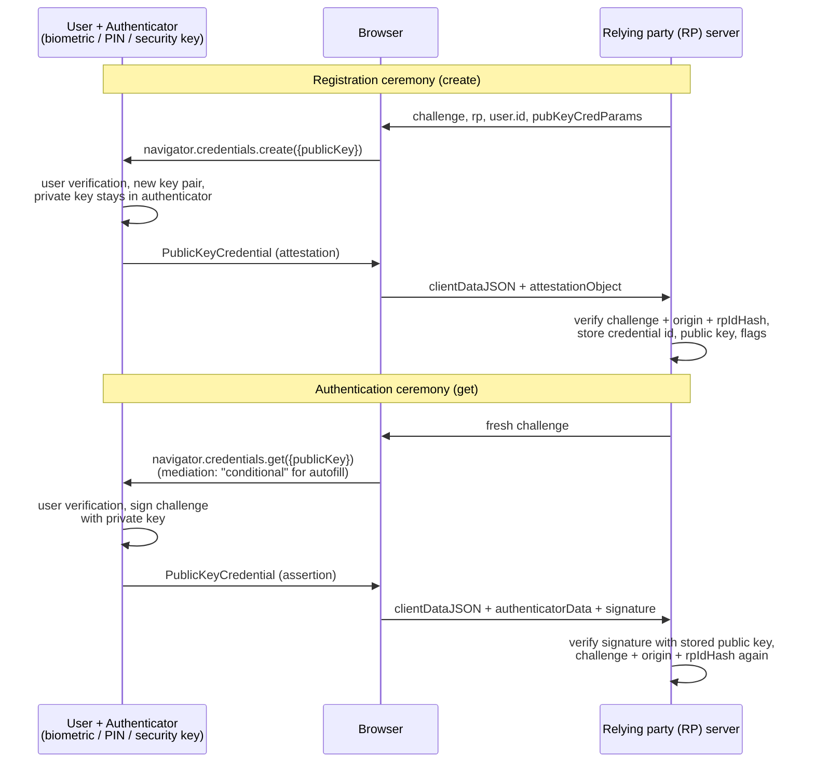

# [FEE-1211] WebAuthn & Passkeys

:::info
The Web Authentication API (WebAuthn) replaces shared secrets with public-key cryptography: at registration the user's authenticator mints a key pair, the server stores only the public key, and every sign-in is the authenticator signing a server-issued challenge. That signature is cryptographically bound to the origin, which is why a pixel-perfect phishing site gets nothing usable. *Passkeys* are the consumer packaging of the same machinery: discoverable credentials, user-verified with biometrics or a PIN, and synced across a user's devices by their credential manager. The spec reached Level 3 Candidate Recommendation in January 2026, and the deployment features have matured: conditional UI (passkey autofill) is supported across the major engines, Related Origin Requests closed its last browser gap in Firefox 152, and the Signal API gives sites a sanctioned way to clean up stale credentials. The client API itself is two function calls; the mistakes this article spends most of its time on live in server-side verification and account lifecycle.
:::

## Context

Passwords fail structurally: they are phishable, reusable, and breachable at the database. The first hardware fix, FIDO U2F, only bolted a second factor onto them. WebAuthn (W3C Recommendation Level 1 in March 2019, Level 2 in 2021, Level 3 CR in January 2026) generalized that into a primary credential; the site doing the authenticating is called the *relying party* (RP), because it relies on an authenticator's signature instead of a shared secret. Early deployments stalled on a hard question: what happens when the user loses the phone that holds the private key? The 2022 industry answer was passkeys, discoverable WebAuthn credentials that credential managers sync across a user's devices. That trades the "exactly one hardware-bound key" security story for recoverability, and it turned WebAuthn from an enterprise MFA tool into a password replacement for consumer scale. This article sits on the client-side seam: the two ceremonies, the options that decide what kind of credential you get, and the deployment features (conditional UI, Related Origin Requests, the Signal API) that separate a demo from a production rollout. Server-side session handling afterwards is [Authentication & Token Storage](/en/Security/1202)'s territory.

## Visual



## Example

Registering a passkey is one `create()` call; the options decide everything. `rp` describes the relying party, and its `id` (the *rpId*) scopes the credential to a domain. `residentKey: "required"` makes the credential discoverable (a passkey rather than a server-side credential), `userVerification` asks for biometric/PIN, `excludeCredentials` stops the same authenticator registering twice, and `attestation` (the authenticator's optional, certificate-backed proof of which hardware model it is) stays off unless a regulator demands it:

```js
const credential = await navigator.credentials.create({
  publicKey: {
    challenge: challengeFromServer,          // >= 16 random bytes, server-minted, single-use
    rp: { id: "example.com", name: "Example" },
    user: {
      id: userHandleFromServer,              // random, permanent, NO PII -- not the email
      name: "jamie@example.com",             // what pickers display
      displayName: "Jamie Doe",
    },
    pubKeyCredParams: [
      { type: "public-key", alg: -7 },       // ES256
      { type: "public-key", alg: -257 },     // RS256 fallback
    ],
    authenticatorSelection: {
      residentKey: "required",               // discoverable credential = passkey
      userVerification: "preferred",
    },
    excludeCredentials: existingCredentials, // [{ type: "public-key", id, transports }]
    attestation: "none",
  },
});
// POST credential.toJSON() to the server; verify and store with a WebAuthn library.
// If the authenticator matches excludeCredentials, create() rejects with
// InvalidStateError: treat it as "already registered", not as a failure.
```

Sign-in with **conditional mediation** is what makes passkeys feel like autofill: the promise is issued at page load, sits pending, and resolves when the user picks a passkey from the same dropdown that offers saved passwords:

```html
<input type="text" name="username" autocomplete="username webauthn" />
```

```js
const caps = await PublicKeyCredential.getClientCapabilities?.();
const conditional = caps?.conditionalGet ??
  (await PublicKeyCredential.isConditionalMediationAvailable?.()); // pre-L3 fallback
if (conditional) {
  const abortController = new AbortController();
  const assertion = await navigator.credentials.get({
    publicKey: {
      challenge: freshChallengeFromServer,
      rpId: "example.com",
      userVerification: "preferred",
      // allowCredentials omitted: any discoverable credential for this rpId may answer
    },
    mediation: "conditional",   // no modal; surfaces in the autofill dropdown
    signal: abortController.signal, // abort before issuing any modal get() later
  });
  await verifyOnServer(assertion.toJSON());
}
```

The server then does the part that actually carries the security: recompute and compare the challenge, check `clientDataJSON.origin`, check the `rpIdHash`, verify the signature against the stored public key, and read the flags byte before trusting it. Do this with a maintained library, not hand-rolled parsing.

When server and authenticator drift apart, say a user deletes the account or removes a passkey on the website, the **Signal API** lets the page tell the credential manager, so dead passkeys stop appearing in pickers:

```js
// After a failed assertion for a credential the server no longer knows:
await PublicKeyCredential.signalUnknownCredential({
  rpId: "example.com",
  credentialId: base64UrlCredentialId,
});
// After sign-in, sync the full list and current user details
// (signalCurrentUserDetails pushes username/displayName changes the same way):
await PublicKeyCredential.signalAllAcceptedCredentials({
  rpId: "example.com", userId: base64UrlUserHandle, allAcceptedCredentialIds: ids,
});
```

## Best Practices

- **MUST** mint the challenge server-side (at least 16 random bytes), bind it to the session, use it once, and verify it on the server along with `origin` and `rpIdHash`. Client-side "verification" is theater; use an established WebAuthn library.
- **MUST** make `user.id` a random, permanent handle containing no PII, and not the email address; usernames change, and the user handle is forever and visible to authenticators.
- **MUST** pass `excludeCredentials` with the user's registered credential IDs on every `create()`, and handle the resulting `InvalidStateError` as "this device already has a passkey" rather than as an error. Without the list, users end up with duplicate passkeys on the same device.
- **MUST** re-request a fresh challenge for every ceremony; a cached challenge reopens the replay hole the challenge exists to close.
- **MUST** check the `UV` (user verified) flag server-side before treating a sign-in as biometric-verified when `userVerification` is `"preferred"`: preferred means authenticators may skip verification, and only the flag says whether it ran.
- **SHOULD** default to `residentKey: "required"`, `userVerification: "preferred"`, and `attestation: "none"` for consumer passkeys, and resist authenticator allowlists, which the spec itself warns against as ecosystem-fragmenting.
- **SHOULD** ship conditional UI (`autocomplete="username webauthn"` plus `mediation: "conditional"`) as the primary sign-in path, and abort the pending conditional request before starting a modal one.
- **SHOULD** store per-credential metadata the ceremony hands you (the AAGUID, an identifier of the authenticator model that is useful for naming credentials in account settings; transports; backup flags; creation time) and notify the account's owner on every new registration. A passkey added by an attacker is the account-takeover artifact to catch.
- **SHOULD** keep an account-recovery story that is not "fall back to a phishable password forever": passkey-on-new-device via sync, cross-device sign-in (the hybrid flow: a phone scans a QR code, proves proximity over Bluetooth, and signs), and for total loss of devices and sync account, an out-of-band re-verification path treated as the high-risk flow it is.
- **MAY** serve one passkey across sibling domains with Related Origin Requests: host `https://example.com/.well-known/webauthn` listing the related origins, now that Chrome/Edge 128+, Safari 18, and Firefox 152 all honor it.
- **MAY** treat `signCount` as a cloned-authenticator heuristic only for hardware keys; synced passkeys report 0 forever by design.

## Design Thinking

**Origin binding is the whole point.** A TOTP code or SMS OTP is a bearer secret: whoever holds it can replay it, including the phishing proxy the user just typed it into. A WebAuthn assertion signs over the origin the browser actually saw, so the only thing a phishing site can obtain is a signature valid for the phishing site. This property costs deployment flexibility. Credentials are scoped to an `rpId`, which is exactly why multi-brand companies needed Related Origin Requests (an explicit, server-published allowlist) rather than being allowed to loosen the binding in JavaScript.

**Synced passkeys trade attestation for recoverability.** A device-bound key on a hardware token gives the strongest story ("this exact secure element") and the worst failure mode (lost token, locked-out user). Passkeys invert it: the credential manager syncs the private key across the user's devices, everyday recovery becomes the sync provider's problem, and in exchange the relying party mostly loses meaningful attestation and the `signCount` signal. The `BE`/`BS` (backup eligible / backed up) flags in `authenticatorData` exist so a relying party can at least observe which world each credential lives in and calibrate step-up policy accordingly.

**Defaults are tuned against fragmentation.** `attestation: "none"` as the recommended default, and the spec's warning against authenticator allowlists, are deliberate ecosystem policy: if every site demanded direct attestation and gated on vendor certificates, the web would re-create device lock-in on top of an open standard. Enterprises with regulatory requirements opt in to attestation; everyone else gets a simpler ceremony and broader device support.

## Deep Dive

**What the server actually parses.** Both ceremonies return a `PublicKeyCredential` whose `response` carries `clientDataJSON` (the browser-authored record of `type`, `challenge`, and `origin`) and an authenticator-authored payload: an `attestationObject` for registration, or `authenticatorData + signature + userHandle` for authentication. `authenticatorData` packs the `rpIdHash`, the flags byte (`UP` user present, `UV` user verified, `BE`/`BS` backup bits), and the signature counter. The split matters because the two halves are integrity-checked differently: the signature covers the authenticator data plus a hash of `clientDataJSON`, so neither half can be swapped without breaking verification. Level 3's `toJSON()`/`parseCreationOptionsFromJSON()` helpers removed the hand-rolled base64url plumbing this exchange used to require.

**Algorithms and key material.** `pubKeyCredParams` is an algorithm preference list in COSE terms (CBOR Object Signing and Encryption); `-7` (ES256) and `-257` (RS256) cover effectively every authenticator, and the stored public key arrives COSE-encoded inside the attestation object. Nothing about the private key ever leaves the authenticator: the server stores a lock, the authenticator keeps the only key.

**Scoping and embedding rules.** The `rpId` must equal the caller's origin's effective domain or a registrable suffix of it: `login.example.com` may use `login.example.com` or `example.com`, never `example.org`. Cross-origin iframes need Permissions Policy delegation, `publickey-credentials-get` for sign-in and `publickey-credentials-create` (plus transient activation) for registration, which is how embedded checkout and SSO widgets do WebAuthn legally. Related Origin Requests extends `rpId` validity across the origins listed in `/.well-known/webauthn` on the `rpId` host; the spec requires clients to support at least five labeled origins, and five is the practical ceiling, so the allowlist stays in the hands of the domain owner and stays small.

**Feature detection is now one call.** `PublicKeyCredential.getClientCapabilities()` reports `userVerifyingPlatformAuthenticator`, `conditionalGet`, `relatedOrigins`, `signalAllAcceptedCredentials`, and friends, replacing the scattered `isUserVerifyingPlatformAuthenticatorAvailable()` / `isConditionalMediationAvailable()` boolean pair from earlier levels. Keep the old calls as fallback while pre-L3 browsers linger, as the sign-in sample above does.

## Passkey Rollout Playbook

An incremental path that avoids the failure mode described at the end:

1. **Instrument capability, change no UX.** Call `getClientCapabilities()` at sign-in and measure what fraction of your users could use platform passkeys today.
2. **Offer creation after a successful password sign-in.** Post-login is the one moment you have a strongly authenticated session and the user's attention; frame it as "sign in faster next time," and register with `excludeCredentials` populated.
3. **Turn on conditional UI.** Add `autocomplete="username webauthn"` and the pending conditional `get()`; users with passkeys drift to them without a layout change, users without see no difference.
4. **Promote passkeys to the primary path.** Modal `get()` on the sign-in button for returning users, password behind a "more options" link; keep cross-device (QR/hybrid) sign-in reachable for the borrowed-laptop case.
5. **Automate hygiene.** Wire the Signal API into credential deletion and account changes, notify on every new registration, and only then consider password removal for passkey-covered accounts, with recovery flows that do not silently reintroduce a phishable channel.

Skip straight to step 4 and users with no passkey yet meet a modal they cannot satisfy; what you measure is support tickets, not adoption.

## Related Topics

- [Authentication & Token Storage](/en/Security/1202)
- [Client-Side Key Derivation & Web Crypto API](/en/Security/1210)
- [HTTPS, Secure Headers & Cookie Attributes](/en/Security/1206)
- [Autocomplete Token Reference](/en/HTML and Semantic Markup/autocomplete-token-reference)
- [Permissions API](/en/Browser APIs and Web Platform/415)

## References

- MDN contributors, "Web Authentication API," MDN Web Docs (2026). https://developer.mozilla.org/en-US/docs/Web/API/Web_Authentication_API
- W3C, "Web Authentication: An API for accessing Public Key Credentials — Level 3," W3C Candidate Recommendation (2026). https://www.w3.org/TR/webauthn-3/
- web.dev team, "Create a passkey for passwordless logins," web.dev (2022, updated). https://web.dev/articles/passkey-registration
- W3C WebAuthn WG, "WebAuthn Signal API explainer," w3c/webauthn, GitHub (2024). https://github.com/w3c/webauthn/blob/main/explainers/signal-api.md
- W3C WebAuthn Adoption CG / FIDO Alliance, "Related Origin Requests," passkeys.dev (2024, updated). https://passkeys.dev/docs/advanced/related-origins/

## Changelog

- **2026** — WebAuthn Level 3 published as Candidate Recommendation (January, with a second CR snapshot in May); Firefox 152 shipped Related Origin Requests (May), closing the last major browser gap.
- **2025-01** — Signal API (`signalUnknownCredential`, `signalAllAcceptedCredentials`, `signalCurrentUserDetails`) on by default in Chrome/Edge 132.
- **2024** — Related Origin Requests shipped in Chrome/Edge 128 and Safari 18; JSON serialization helpers (`toJSON`, `parseCreationOptionsFromJSON`) spread across browsers.
- **2022** — Passkeys: synced discoverable credentials announced across major platforms, reframing WebAuthn as a consumer password replacement.
- **2021 / 2019** — WebAuthn Level 2 / Level 1 published as W3C Recommendations.
