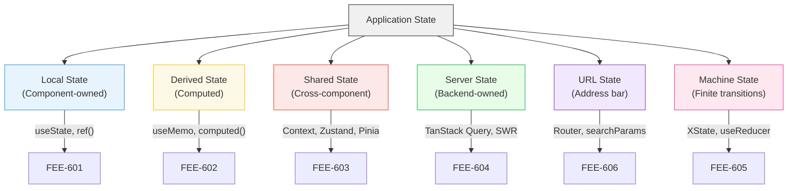
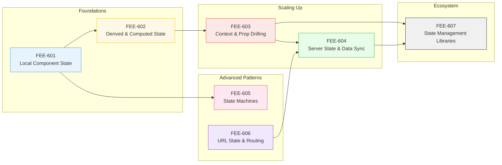

# [FEE-600] State Management Overview

:::info
This category covers how to organize, access, and synchronize the data that drives your UI -- from a single boolean toggle to complex multi-source server data.
:::

## Context

Modern frontend applications are state machines. Every pixel on screen is a function of some underlying data: form inputs, authentication tokens, cached API responses, URL parameters, animation progress, and more. The formula **UI = f(state)** is deceptively simple. In practice, state arrives from multiple asynchronous sources (user events, network responses, web sockets, browser APIs), must remain consistent across dozens of components, and needs to survive navigation, tab switches, and offline periods.

State management is often called the hardest problem in frontend engineering -- not because any single piece of state is complex, but because the interactions between pieces create combinatorial complexity. A loading spinner depends on a fetch request, which depends on a URL parameter, which depends on a user action, which depends on authentication state. When any link in that chain updates incorrectly, the UI becomes inconsistent, and users lose trust.

### State Taxonomy

Not all state is created equal. Recognizing the *kind* of state you are dealing with is the first step toward choosing the right tool:

| Category | Description | Examples | Typical Tool |
|---|---|---|---|
| **Local (UI) State** | Belongs to a single component | Toggle open/closed, input value, hover | `useState`, `ref()` |
| **Derived State** | Computed from other state | Filtered list, total price, full name | `useMemo`, `computed()` |
| **Shared State** | Needed by multiple components | Theme, locale, shopping cart | Context, Zustand, Pinia |
| **Server State** | Async data owned by the backend | User profile, product list, notifications | TanStack Query, SWR |
| **URL State** | Encoded in the URL | Search query, pagination, filters | Router params, `useSearchParams` |
| **Machine State** | Finite, explicit transitions | Multi-step form, auth flow, media player | XState, `useReducer` |

Each category has different caching semantics, update frequencies, and ownership rules. Treating server state the same as local UI state -- or stuffing everything into a global store -- is a common source of over-engineering.

### The Spectrum of Solutions

State management tools form a spectrum from simple to sophisticated:

```
useState / ref()
    --> useReducer / reactive()
        --> Context / provide-inject
            --> Lightweight stores (Zustand, Jotai, Pinia)
                --> Full stores (Redux Toolkit, Vuex)
                    --> Server cache (TanStack Query, SWR, Apollo)
                        --> State machines (XState)
```

The key insight: **you should start at the left and move right only when you hit a real problem.** Most applications need far less state management infrastructure than developers assume. A well-structured app with `useState` for local state and TanStack Query for server data covers the vast majority of real-world needs -- no global store required.

## Design Thinking

### Why State Is the Hardest Frontend Problem

Three forces make state management uniquely difficult:

1. **Multiple async sources.** User interactions, API responses, web socket messages, browser events (resize, online/offline), and timers all produce state updates. These sources operate on different timescales and can arrive in any order.

2. **Consistency across the component tree.** When a user logs out, every component showing user-specific data must update. When a product is added to a cart, the header badge, the cart drawer, and the checkout page must all reflect the change. Inconsistency is immediately visible and erodes user trust.

3. **The UI = f(state) contract.** If the UI is a pure function of state, then every bug is a state bug. A button that should be disabled but is not? State bug. Stale data after navigation? State bug. Flash of wrong content? State bug. The quality of your UI is directly determined by the quality of your state management.

### The Over-Engineering Trap

The most common state management mistake is not choosing the wrong library -- it is choosing *any* library too early.

Consider the typical evolution:
- A developer reads about Redux in a tutorial and adds it to a new project
- Every piece of state goes into the global store, including form input values and modal visibility
- The codebase accumulates boilerplate: actions, reducers, selectors, middleware
- Performance degrades because every store update triggers broad re-renders
- The team concludes "state management is hard" when the real problem was unnecessary indirection

**The pragmatic approach:**
- Use `useState` / `ref()` for anything local to a component (this covers ~60-70% of all state)
- Use a server-cache library (TanStack Query, SWR) for async data (this covers ~20-25%)
- Use a lightweight store (Zustand, Jotai, Pinia) only for the remaining truly shared client state
- Reserve state machines (XState) for complex flows with explicit valid transitions

This layered approach means most components have zero dependency on external state libraries, making them easier to test, move, and refactor.

## Visual

### State Taxonomy



### Category Roadmap (FEE-601 through FEE-607)



## Related FEEs

- [FEE-500](../Component%20Architecture%20and%20Design%20Patterns/500.md) Component Architecture & Design Patterns Overview -- state lives inside components; architecture determines where state belongs
- [FEE-502](../Component%20Architecture%20and%20Design%20Patterns/502.md) Reactive State & Signals -- the underlying mechanism that makes state changes visible to the UI

## References

- [React: Managing State](https://react.dev/learn/managing-state) -- official guide covering useState, useReducer, context, and state structure
- [Vue.js: State Management](https://vuejs.org/guide/scaling-up/state-management) -- official guide on reactive state, composables, and Pinia
- [Pinia Introduction](https://pinia.vuejs.org/introduction.html) -- official docs for Vue's recommended state management library
- [TanStack Query Overview](https://tanstack.com/query/latest/docs/framework/react/overview) -- the leading server-state library for React
- [XState Documentation](https://stately.ai/docs) -- state machines and statecharts for complex UI flows
- [TC39 Signals Proposal](https://github.com/tc39/proposal-signals) -- emerging standard for reactive state primitives
- [Patterns.dev: State Management](https://www.patterns.dev/) -- visual explanations of common state patterns
- [Kent C. Dodds: Application State Management with React](https://kentcdodds.com/blog/application-state-management-with-react) -- influential article on keeping state co-located
