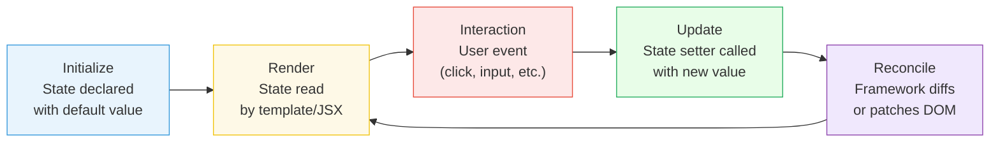

# [FEE-601] Local Component State

:::info
Local component state is the simplest and most common form of state in any UI framework -- data owned and managed entirely within a single component. Mastering it is the foundation for every other state management pattern.
:::

## Context

Every interactive component needs to remember something between renders: whether a dropdown is open, what the user typed into an input, how many times a button was clicked. This is **local component state** -- data that belongs to one component, is invisible to the rest of the application, and is managed through the framework's reactivity system.

Local state is the default. Before reaching for context, stores, or global state management libraries, the question should always be: "Can this state live inside a single component?" If the answer is yes, keep it local. This principle -- often called **state co-location** -- means placing state as close as possible to where it is used.

### Why Local State Matters

In a well-architected application, the majority of state is local:

- **Form inputs** -- the current value of a text field, a checkbox, a date picker
- **UI toggles** -- open/closed, expanded/collapsed, visible/hidden
- **Transient interaction state** -- hover, focus, drag position
- **Component-internal counters** -- pagination index, carousel slide, retry count

Estimates vary, but experienced developers typically find that **60-70% of all state in an application can remain local**. Keeping state local reduces coupling, simplifies testing, and makes components portable.

### The Framework Landscape

Every modern framework provides a primitive for local state, but the underlying reactivity model differs significantly:

| Framework | Primitive | Model | Re-render Scope |
|---|---|---|---|
| React | `useState`, `useReducer` | Immutable, schedule re-render | Entire component subtree |
| Vue | `ref()`, `reactive()` | Mutable proxy, fine-grained | Only affected bindings |
| Svelte 5 | `$state` rune | Compiler-transformed | Compiler-determined |
| Solid | `createSignal` | Signal getter/setter | Exact DOM nodes |
| Angular 16+ | `signal()` | Signal with `.set()` / `.update()` | Signal consumers only |

These differences are not just API trivia -- they fundamentally shape how you think about updates, performance, and component design.

## Design Thinking

### Why Components Need Internal State

Three principles drive the need for local state:

**Encapsulation.** A well-designed component hides its implementation details. A `<Dropdown>` does not need the parent to know whether it is open or closed. Local state enforces this boundary -- the component owns its data, and the parent interacts only through props and events.

**Co-location.** When state and the code that reads or updates it live in the same file, the component is easier to understand, refactor, and delete. Moving state out of a component introduces indirection and coupling that must be justified by a real need (multiple consumers, persistence, etc.).

**Simplicity.** Local state has the smallest API surface and the least ceremony. There is no store to configure, no provider to wrap, no selector to memoize. This simplicity is not a weakness -- it is a feature. The best state management is the least state management.

### Reactivity Model Comparison

The most fundamental difference between frameworks is how they answer the question: **"What happens when state changes?"**

**React: Immutable snapshots, re-render the subtree.**
When you call a state setter in React, the entire component function re-executes from top to bottom. React then diffs the virtual DOM and patches the real DOM. This means every variable, every inline function, every JSX expression is re-evaluated. React optimizes this with batching (grouping multiple `setState` calls into one re-render) and memoization (`React.memo`, `useMemo`, `useCallback`), but the fundamental model is: state change triggers component re-execution.

**Vue: Mutable proxies, fine-grained tracking.**
Vue wraps reactive state in JavaScript Proxies. When a template reads `count.value`, Vue records that this template binding depends on `count`. When `count.value` changes, Vue knows exactly which bindings to update -- it does not re-run the entire component. This fine-grained dependency tracking means Vue components are reactive at the binding level, not the component level.

**Svelte 5: Compiler-driven reactivity.**
Svelte's `$state` rune is a compile-time transformation. The Svelte compiler analyzes your code and generates efficient update instructions. There is no virtual DOM, no proxy -- the compiler statically determines what needs to update when a particular variable changes. Objects and arrays become deeply reactive proxies at runtime, but primitive updates compile to direct DOM mutations.

**Solid: True signals, no component re-render.**
Solid's `createSignal` returns a getter function and a setter function. Components in Solid run exactly once -- they never re-execute. Instead, the reactive graph tracks which DOM nodes depend on which signals and updates only those nodes. This means there is no concept of "re-rendering a component" in Solid; there are only signal updates that propagate to their subscribers.

**Angular: Signals with zone-free change detection.**
Angular signals (v16+) replace the traditional zone.js-based change detection. A `signal()` creates a reactive value; `computed()` derives from it; `effect()` reacts to changes. When a signal updates, Angular knows exactly which template expressions depend on it and can skip dirty-checking the rest. This moves Angular toward fine-grained reactivity similar to Vue and Solid.

### The Re-Render Question

This difference in reactivity models is not academic -- it affects everyday coding decisions:

- In **React**, you worry about unnecessary re-renders and reach for `useMemo`, `useCallback`, and `React.memo`.
- In **Vue**, you rarely think about re-renders because the proxy system handles granularity automatically, but you must understand ref unwrapping and reactivity caveats.
- In **Svelte**, the compiler does the optimization work, but you need to understand that reassignment (`count = count + 1`) is the trigger, not mutation.
- In **Solid**, you must remember that the getter is a function call (`count()`, not `count`), and that destructuring props breaks reactivity.
- In **Angular**, you call `.set()` or `.update()` on signals and let the framework handle the rest.

## Best Practices

**Keep state as local as possible -- lift only when truly shared.** State should live in the component that uses it. SHOULD lift state up only when a second component actually needs it, not in anticipation of future use. Premature lifting increases coupling and makes components harder to understand and delete independently.

**Use `useReducer` over `useState` when update logic grows complex.** When state updates are causing bugs, when multiple `useState` calls update together in the same handler, or when the next state depends on the previous state in non-trivial ways, SHOULD consolidate into `useReducer`. A reducer centralizes transition logic, makes each state change explicit and auditable, and is easier to test in isolation.

**Initialize state lazily for expensive computations.** When the initial state value requires a costly computation (parsing, filtering, deserializing), SHOULD pass a function to `useState` rather than a value: `useState(() => expensiveCompute())`. The initializer runs only once on mount, not on every re-render. Passing the result directly (`useState(expensiveCompute())`) recomputes on every render even though the result is discarded.

## Visual

### Local State Lifecycle



### Reactivity Models Compared

```mermaid
flowchart TD
    subgraph React
        R1["setState(newVal)"] --> R2["Re-run component fn"] --> R3["Virtual DOM diff"] --> R4["Patch real DOM"]
    end

    subgraph Vue
        V1["ref.value = newVal"] --> V2["Proxy trap fires"] --> V3["Notify tracked deps"] --> V4["Update bound DOM nodes"]
    end

    subgraph Solid
        S1["setSignal(newVal)"] --> S2["Signal notifies subscribers"] --> S3["Update exact DOM nodes"]
    end

    style R1 fill:#61dafb,stroke:#333
    style V1 fill:#42b883,stroke:#333
    style S1 fill:#4f88c6,stroke:#333
```



## Example

### 1. React -- useState Counter

```jsx
import { useState } from 'react';

function Counter() {
  const [count, setCount] = useState(0);

  return (
    <div>
      <p>Count: {count}</p>
      <button onClick={() => setCount(count + 1)}>
        Increment
      </button>
      <button onClick={() => setCount(prev => prev - 1)}>
        Decrement (functional update)
      </button>
    </div>
  );
}
```

Key points:
- `useState(0)` returns the current value and a setter function.
- The setter can take a new value or a function that receives the previous value (functional update).
- React batches multiple `setCount` calls within the same event handler into a single re-render (automatic batching since React 18).
- The entire `Counter` function re-executes on every state change.

### 2. React -- useReducer for Complex State

```jsx
import { useReducer } from 'react';

const initialState = { count: 0, step: 1 };

function reducer(state, action) {
  switch (action.type) {
    case 'increment':
      return { ...state, count: state.count + state.step };
    case 'decrement':
      return { ...state, count: state.count - state.step };
    case 'setStep':
      return { ...state, step: action.payload };
    default:
      throw new Error(`Unknown action: ${action.type}`);
  }
}

function StepCounter() {
  const [state, dispatch] = useReducer(reducer, initialState);

  return (
    <div>
      <p>Count: {state.count} (step: {state.step})</p>
      <button onClick={() => dispatch({ type: 'increment' })}>+</button>
      <button onClick={() => dispatch({ type: 'decrement' })}>-</button>
      <input
        type="number"
        value={state.step}
        onChange={e => dispatch({ type: 'setStep', payload: Number(e.target.value) })}
      />
    </div>
  );
}
```

Key points:
- `useReducer` centralizes related state transitions in a pure reducer function.
- Internally, `useState` is implemented as `useReducer` with a basic reducer -- they share the same mechanism.
- Prefer `useReducer` when you have 3+ related `useState` calls, or when the next state depends on the previous state in complex ways.

### 3. Vue -- ref Counter

```vue
<script setup>
import { ref } from 'vue';

const count = ref(0);

function increment() {
  count.value++;
}

function decrement() {
  count.value--;
}
</script>

<template>
  <div>
    <p>Count: {{ count }}</p>
    <button @click="increment">Increment</button>
    <button @click="decrement">Decrement</button>
  </div>
</template>
```

Key points:
- `ref(0)` returns a reactive reference object with a `.value` property.
- In the template, Vue auto-unwraps refs -- you write `count`, not `count.value`.
- In script, you must access `.value` explicitly.
- Vue tracks which template expressions depend on which refs and updates only those DOM nodes.

### 4. Solid -- createSignal Counter

```jsx
import { createSignal } from 'solid-js';

function Counter() {
  const [count, setCount] = createSignal(0);

  return (
    <div>
      <p>Count: {count()}</p>
      <button onClick={() => setCount(c => c + 1)}>
        Increment
      </button>
      <button onClick={() => setCount(c => c - 1)}>
        Decrement
      </button>
    </div>
  );
}
```

Key points:
- `createSignal(0)` returns a getter *function* and a setter function.
- You must call `count()` to read the value -- this is how Solid tracks dependencies.
- The `Counter` function runs exactly once. Only the `{count()}` text node updates when the signal changes.
- There is no virtual DOM and no component re-render -- only the specific DOM node that reads the signal is updated.

### 5. Svelte 5 -- $state Counter

```svelte
<script>
  let count = $state(0);
</script>

<p>Count: {count}</p>
<button onclick={() => count++}>Increment</button>
<button onclick={() => count--}>Decrement</button>
```

Key points:
- `$state(0)` is a compiler rune, not a runtime function.
- You read and write `count` like a normal variable -- the compiler generates the reactivity code.
- For objects and arrays, `$state` creates a deeply reactive proxy.

### 6. Angular -- signal Counter

```typescript
import { Component, signal } from '@angular/core';

@Component({
  selector: 'app-counter',
  template: `
    <p>Count: {{ count() }}</p>
    <button (click)="increment()">Increment</button>
    <button (click)="decrement()">Decrement</button>
  `,
})
export class CounterComponent {
  count = signal(0);

  increment() {
    this.count.update(c => c + 1);
  }

  decrement() {
    this.count.update(c => c - 1);
  }
}
```

Key points:
- `signal(0)` creates a writable signal.
- Read with `count()` (a function call, like Solid).
- Write with `.set(newValue)` or `.update(fn)`.
- Angular tracks which template expressions depend on which signals and updates only those.

## Common Mistakes

### 1. Mutating State Directly in React

```jsx
// WRONG -- React will not re-render
const [items, setItems] = useState(['a', 'b']);

function addItem() {
  items.push('c'); // mutating the existing array
  setItems(items); // same reference -- React skips the update
}

// CORRECT -- create a new array
function addItem() {
  setItems(prev => [...prev, 'c']);
}
```

React uses referential equality to determine if state has changed. Mutating the existing object/array and passing it back to the setter gives React the same reference, so it assumes nothing changed and skips the re-render.

### 2. Too Many Individual useState Calls

```jsx
// FRAGILE -- five related pieces of state
const [firstName, setFirstName] = useState('');
const [lastName, setLastName] = useState('');
const [email, setEmail] = useState('');
const [phone, setPhone] = useState('');
const [address, setAddress] = useState('');

// BETTER -- useReducer or a single state object
const [form, dispatch] = useReducer(formReducer, {
  firstName: '', lastName: '', email: '', phone: '', address: ''
});
```

When you have multiple pieces of state that change together or represent a cohesive concept (like a form), `useReducer` keeps update logic centralized and prevents impossible intermediate states.

### 4. Not Using shallowRef for Large Objects in Vue

```vue
<script setup>
import { ref, shallowRef, triggerRef } from 'vue';

// EXPENSIVE -- Vue deep-converts the entire object into proxies
const bigData = ref(hugeNestedObject);

// BETTER -- only .value assignment is reactive
const bigData = shallowRef(hugeNestedObject);

function update() {
  bigData.value = { ...bigData.value, updated: true };
  // or mutate + manually trigger:
  // bigData.value.updated = true;
  // triggerRef(bigData);
}
</script>
```

`ref()` deep-converts objects using `reactive()`, wrapping every nested property in a Proxy. For large data structures (thousands of items, deeply nested trees), this is expensive. `shallowRef()` only tracks `.value` reassignment, avoiding the cost of deep proxy conversion.

## Related FEEs

- [FEE-600](./600.md) State Management Overview -- the taxonomy and spectrum of state management solutions
- [FEE-602](./602.md) Derived & Computed State -- computing values from local state instead of storing them separately
- [FEE-502](../Component%20Architecture%20and%20Design%20Patterns/502.md) Reactive State & Signals -- the underlying reactivity mechanisms that power local state

## References

- [React: useState](https://react.dev/reference/react/useState) -- official API reference for React's primary state primitive
- [React: useReducer](https://react.dev/reference/react/useReducer) -- official API reference for reducer-based state management
- [Vue: Reactivity Fundamentals](https://vuejs.org/guide/essentials/reactivity-fundamentals.html) -- official guide covering ref, reactive, and reactivity basics
- [Vue: Reactivity API Advanced](https://vuejs.org/api/reactivity-advanced) -- shallowRef, shallowReactive, and performance optimization
- [Svelte: $state](https://svelte.dev/docs/svelte/$state) -- official docs for the $state rune in Svelte 5
- [Solid: Fine-Grained Reactivity](https://docs.solidjs.com/advanced-concepts/fine-grained-reactivity) -- how createSignal and the reactive graph work
- [Solid: State Management](https://docs.solidjs.com/guides/state-management) -- official guide on managing state in Solid
- [Angular: Signals](https://angular.dev/guide/signals) -- official guide for Angular's signal-based reactivity
- [Kent C. Dodds: State Co-Location](https://kentcdodds.com/blog/state-colocation-will-make-your-react-app-faster) -- the principle of keeping state close to where it is used
