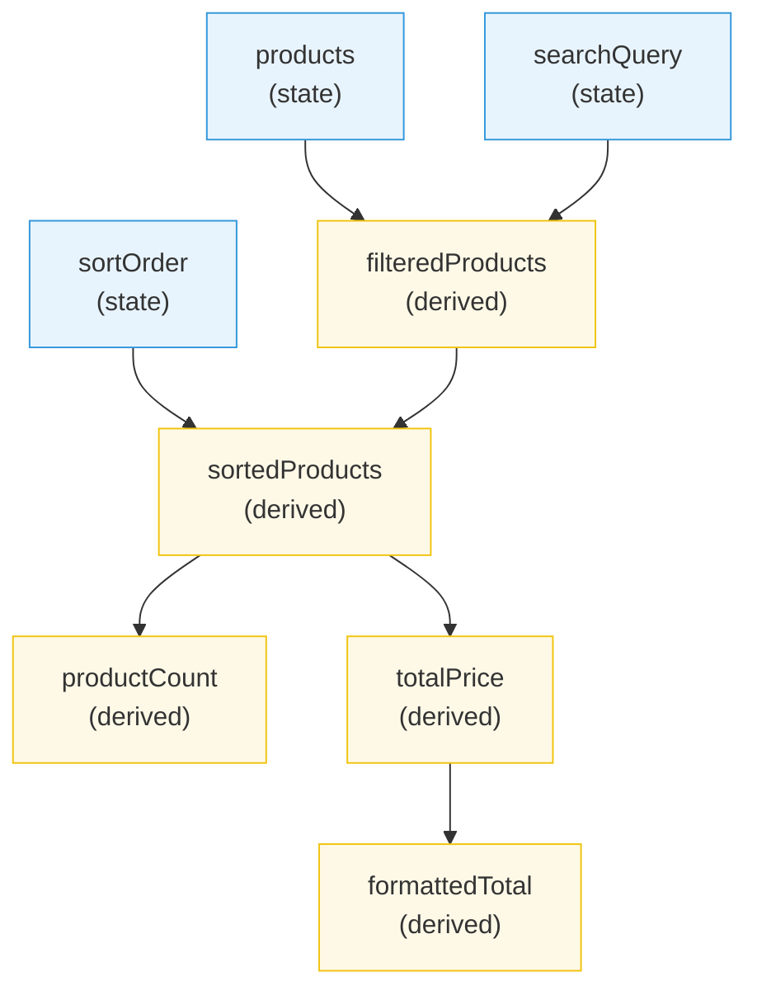
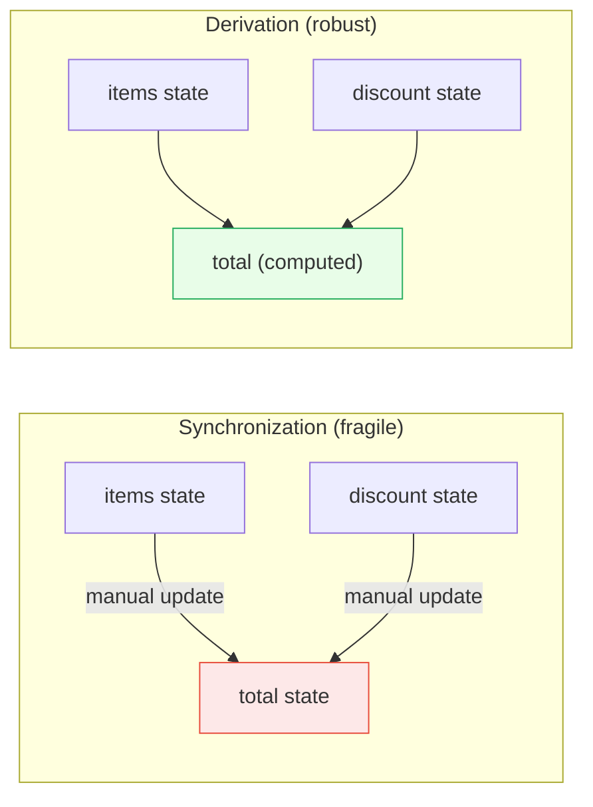

# [FEE-602] Derived & Computed State

:::info
Derived state is any value that can be computed from existing state. The golden rule: **don't sync, derive.** If a value can be calculated, it should be calculated, not stored and manually kept in sync.
:::

## Context

Every non-trivial application has values that depend on other values. A shopping cart has items (state) and a total price (derived). A user list has entries (state) and a filtered view (derived). A form has fields (state) and a validation status (derived).

The temptation is to store these dependent values as separate pieces of state and update them whenever the source changes. This is **state synchronization**, and it is one of the most common sources of bugs in frontend applications. The moment you have two pieces of state that must always agree, you have created a synchronization problem. Synchronization problems only get worse as the application grows.

The alternative is **derivation**: computing the dependent value on the fly from its source. Derived state has no setter. It cannot become stale. It cannot disagree with its source. It is a pure function of existing state, and every modern framework provides first-class support for it.

### The Landscape of Derived State

Derived state appears at every level of a frontend application:

| Level | Source State | Derived Value | Tool |
|---|---|---|---|
| Component | `items` array | `totalPrice` | `useMemo`, `computed()`, `$derived` |
| Component | `firstName`, `lastName` | `fullName` | Inline computation |
| Store | Global cart state | `itemCount` | Zustand selector, Pinia getter |
| Store | Redux state tree | `visibleTodos` | Reselect `createSelector` |
| URL | Query parameters | Filter configuration | Router-level derivation |

The principle is always the same: **one source of truth, everything else derived.**

## Design Thinking

### Why Derive, Not Sync

Three forces push toward derivation over synchronization:

**Correctness.** A derived value cannot be wrong unless its source is wrong. There is no code path where the derived value forgets to update, because it is recalculated every time it is read (or every time its dependencies change, depending on the framework). Synchronization, by contrast, requires you to identify every code path that modifies the source and add an update call for the dependent value.

**Simplicity.** Derived state needs no setter, update logic, or event handler. It is a declaration: "this value is defined as X." Synchronized state requires imperative glue code: "when A changes, also update B."

**Deletability.** If a derived value is no longer needed, you delete the derivation and nothing else changes. If a synchronized value is no longer needed, you must also find and remove every sync point, and hope you do not miss one that now writes to a non-existent state variable.

### Push vs. Pull: Framework Strategies

Frameworks differ in *when* they evaluate derived state. This is the push-vs-pull distinction:

**Pull (lazy evaluation): Vue, Solid, Svelte.**
The derived value is marked dirty when a dependency changes, but it is not recalculated until something actually reads it. If a computed property updates but no one reads it before the next change, the intermediate computation is skipped entirely. This is efficient for derived values that are conditionally rendered or read infrequently.

- Vue `computed()`: tracks dependencies via Proxy, evaluates lazily, caches until a dependency changes.
- Solid `createMemo`: part of the reactive graph, evaluates only when read by a subscriber.
- Svelte `$derived`: uses push-pull reactivity, notifying dependents of changes (push) but not recalculating the value until it is read (pull).

**Eager evaluation: React.**
In React, `useMemo` runs during the render phase. Since React re-renders the entire component when state changes, the memo is evaluated on every render (but returns the cached value if dependencies have not changed). There is no concept of "skipping" a computation that nobody reads. If the component renders, the memo runs.

This follows from React's rendering model: components are functions that re-execute from top to bottom. `useMemo` is an optimization within that model: "do not recompute this value if the inputs have not changed." It is not a reactive primitive like Vue's `computed()` or Solid's `createMemo`.

### The Memoization Tradeoff

Derivation always beats synchronization, but **memoization** is a separate question. Not every derived value needs to be memoized:

| Computation Cost | Read Frequency | Memoize? |
|---|---|---|
| Cheap (string concat, simple math) | Any | No -- recompute is faster than cache overhead |
| Expensive (sort, filter, transform large arrays) | Frequent | Yes -- cache the result |
| Expensive | Rare | Maybe -- measure first |
| Any | Used as dependency for other memos/effects | Yes -- stabilize the reference |

In Vue and Solid, `computed()` and `createMemo` always memoize. This is built into the reactive system and costs nothing extra. In React, you must explicitly opt into memoization with `useMemo`, and the dependency array adds both verbosity and a class of bugs (stale closures).

## Best Practices

**Derive state rather than synchronize it: avoids stale reads.** MUST NOT store a value as state if it can be computed from another piece of state. Every manual sync point is a potential bug: one update path may be forgotten, leaving the derived value permanently stale. Compute the value during render (React) or via `computed()` / `$derived` (Vue, Svelte) and eliminate the sync entirely.

**Memoize expensive derivations only when measured costly.** SHOULD add memoization (`useMemo`, `createMemo`) for derivations that are genuinely expensive: sorting or filtering arrays with thousands of items, running heavy transformations. AVOID memoizing trivial computations like string concatenation or `.length` reads; `useMemo` has overhead that exceeds the cost of cheap recomputation.

**Avoid storing derived values in state: single source of truth.** If a value is computed from existing state, it MUST live as a derivation, not as a second stateful variable. Two pieces of state representing the same logical value will eventually disagree. The derived value is always correct by construction; synchronized state is only correct until someone forgets to update it.

**Use selector functions for store-based derived state.** When reading from a global store (Zustand, Redux, Pinia), SHOULD select the minimal derived slice needed by each component. Selectors prevent unnecessary re-renders: a component re-renders only when the selector's return value changes, not whenever any part of the store changes.

## Visual

### Derived State Dependency Graph



Blue nodes are **source state** (the only values with setters). Yellow nodes are **derived values** (computed from source state or other derivations). Notice that the graph is a directed acyclic graph (DAG): there are no cycles, and data flows in one direction.

### Sync vs. Derive Comparison



## Example

### 1. React: useMemo for Derived State

```jsx
import { useState, useMemo } from 'react';

function ProductList() {
  const [products, setProducts] = useState([
    { id: 1, name: 'Widget', price: 25, category: 'tools' },
    { id: 2, name: 'Gadget', price: 50, category: 'electronics' },
    { id: 3, name: 'Gizmo', price: 35, category: 'electronics' },
  ]);
  const [searchQuery, setSearchQuery] = useState('');
  const [selectedCategory, setSelectedCategory] = useState('all');

  // Derived: filtered products (memoized because filtering can be expensive)
  const filteredProducts = useMemo(() => {
    return products
      .filter(p => selectedCategory === 'all' || p.category === selectedCategory)
      .filter(p => p.name.toLowerCase().includes(searchQuery.toLowerCase()));
  }, [products, searchQuery, selectedCategory]);

  // Derived: total price (cheap computation, memoization optional)
  const totalPrice = useMemo(() => {
    return filteredProducts.reduce((sum, p) => sum + p.price, 0);
  }, [filteredProducts]);

  // Derived: display count (so cheap that useMemo is unnecessary)
  const displayCount = filteredProducts.length;

  return (
    <div>
      <input
        value={searchQuery}
        onChange={e => setSearchQuery(e.target.value)}
        placeholder="Search..."
      />
      <select
        value={selectedCategory}
        onChange={e => setSelectedCategory(e.target.value)}
      >
        <option value="all">All</option>
        <option value="tools">Tools</option>
        <option value="electronics">Electronics</option>
      </select>
      <p>Showing {displayCount} products (total: ${totalPrice})</p>
      <ul>
        {filteredProducts.map(p => (
          <li key={p.id}>{p.name} - ${p.price}</li>
        ))}
      </ul>
    </div>
  );
}
```

Key points:
- `filteredProducts` derives from `products`, `searchQuery`, and `selectedCategory`. No separate state is needed.
- `totalPrice` derives from `filteredProducts`. This is a chain of derivations.
- `displayCount` is so cheap (`.length`) that `useMemo` would add more overhead than it saves.
- The dependency array in `useMemo` must list every value the computation reads. Missing a dependency causes stale results.

### 2. Vue: computed for Derived State

```vue
<script setup>
import { ref, computed } from 'vue';

const products = ref([
  { id: 1, name: 'Widget', price: 25, category: 'tools' },
  { id: 2, name: 'Gadget', price: 50, category: 'electronics' },
  { id: 3, name: 'Gizmo', price: 35, category: 'electronics' },
]);
const searchQuery = ref('');
const selectedCategory = ref('all');

// Derived: filtered products (auto-tracked, lazy, cached)
const filteredProducts = computed(() => {
  return products.value
    .filter(p => selectedCategory.value === 'all' || p.category === selectedCategory.value)
    .filter(p => p.name.toLowerCase().includes(searchQuery.value.toLowerCase()));
});

// Derived: total price (auto-tracked, lazy, cached)
const totalPrice = computed(() => {
  return filteredProducts.value.reduce((sum, p) => sum + p.price, 0);
});

// Derived: display count
const displayCount = computed(() => filteredProducts.value.length);
</script>

<template>
  <div>
    <input v-model="searchQuery" placeholder="Search..." />
    <select v-model="selectedCategory">
      <option value="all">All</option>
      <option value="tools">Tools</option>
      <option value="electronics">Electronics</option>
    </select>
    <p>Showing {{ displayCount }} products (total: ${{ totalPrice }})</p>
    <ul>
      <li v-for="p in filteredProducts" :key="p.id">
        {{ p.name }} - ${{ p.price }}
      </li>
    </ul>
  </div>
</template>
```

Key points:
- No dependency array needed. Vue tracks dependencies automatically via Proxy.
- `computed()` is lazy: it only recalculates when a dependency changes **and** the value is read.
- `computed()` is cached: reading it multiple times without dependency changes returns the stored result without re-executing the getter.
- Unlike React's `useMemo`, there is no risk of stale closures from a missing dependency.

### 3. Zustand Selector: Derived State from a Store

```js
import { create } from 'zustand';

// Store: only source state
const useCartStore = create((set) => ({
  items: [],
  addItem: (item) => set((state) => ({ items: [...state.items, item] })),
  removeItem: (id) => set((state) => ({
    items: state.items.filter(i => i.id !== id),
  })),
}));

// Selectors: derived values (outside the store)
const selectItemCount = (state) => state.items.length;
const selectTotalPrice = (state) =>
  state.items.reduce((sum, item) => sum + item.price * item.quantity, 0);
const selectItemsByCategory = (category) => (state) =>
  state.items.filter(item => item.category === category);

// Usage in a component
function CartSummary() {
  // Each selector subscribes only to the slice it derives from.
  // The component re-renders only when the derived value changes.
  const itemCount = useCartStore(selectItemCount);
  const totalPrice = useCartStore(selectTotalPrice);

  return (
    <div>
      <p>{itemCount} items in cart</p>
      <p>Total: ${totalPrice.toFixed(2)}</p>
    </div>
  );
}
```

Key points:
- The store holds only source state (`items`). Derived values live in selector functions.
- Zustand selectors use referential equality by default: the component only re-renders when the selector returns a different value.
- Parameterized selectors (like `selectItemsByCategory`) are factory functions that return a selector.
- For expensive derivations, wrap the selector with a memoization utility (or use Zustand's `useShallow` for shallow equality).

### 4. Svelte 5: $derived Rune

```svelte
<script>
  let products = $state([
    { id: 1, name: 'Widget', price: 25, category: 'tools' },
    { id: 2, name: 'Gadget', price: 50, category: 'electronics' },
    { id: 3, name: 'Gizmo', price: 35, category: 'electronics' },
  ]);
  let searchQuery = $state('');
  let selectedCategory = $state('all');

  // Derived: filtered products
  let filteredProducts = $derived.by(() => {
    return products
      .filter(p => selectedCategory === 'all' || p.category === selectedCategory)
      .filter(p => p.name.toLowerCase().includes(searchQuery.toLowerCase()));
  });

  // Derived: total price
  let totalPrice = $derived(
    filteredProducts.reduce((sum, p) => sum + p.price, 0)
  );
</script>

<input bind:value={searchQuery} placeholder="Search..." />
<p>Showing {filteredProducts.length} products (total: ${totalPrice})</p>
{#each filteredProducts as p (p.id)}
  <li>{p.name} - ${p.price}</li>
{/each}
```

Key points:
- `$derived(expression)` for simple one-liner derivations; `$derived.by(() => ...)` for multi-statement logic.
- Dependencies are tracked at runtime, not compile time. No dependency array is needed.
- Push-pull reactivity: dependents are notified of changes (push), but the value is not recalculated until read (pull).
- The `$derived` expression must be free of side effects.

### 5. Solid: createMemo

```jsx
import { createSignal, createMemo } from 'solid-js';

function ProductList() {
  const [products] = createSignal([
    { id: 1, name: 'Widget', price: 25, category: 'tools' },
    { id: 2, name: 'Gadget', price: 50, category: 'electronics' },
    { id: 3, name: 'Gizmo', price: 35, category: 'electronics' },
  ]);
  const [searchQuery, setSearchQuery] = createSignal('');
  const [selectedCategory, setSelectedCategory] = createSignal('all');

  // Derived: simple derivation (no createMemo needed for cheap work)
  const displayLabel = () =>
    selectedCategory() === 'all' ? 'All Products' : selectedCategory();

  // Derived: memoized for expensive computation
  const filteredProducts = createMemo(() => {
    return products()
      .filter(p => selectedCategory() === 'all' || p.category === selectedCategory())
      .filter(p => p.name.toLowerCase().includes(searchQuery().toLowerCase()));
  });

  // Derived: chained memo
  const totalPrice = createMemo(() =>
    filteredProducts().reduce((sum, p) => sum + p.price, 0)
  );

  return (
    <div>
      <input
        value={searchQuery()}
        onInput={e => setSearchQuery(e.target.value)}
        placeholder="Search..."
      />
      <p>{displayLabel()}: {filteredProducts().length} products (${totalPrice()})</p>
    </div>
  );
}
```

Key points:
- In Solid, a plain derived function (like `displayLabel`) works for cheap computations. No memoization is needed.
- `createMemo` adds memoization: the function only re-runs when tracked signals change, and the result is cached.
- No dependency array. Solid auto-tracks which signals are read inside the memo.
- The component function runs exactly once; only the reactive expressions update.

## Common Mistakes

### 1. Expensive Computation Without Memoization

```jsx
// PROBLEM -- re-sorts on every render, even if data has not changed
function SortedList({ items, sortKey }) {
  // This runs on every render, including parent re-renders
  // that do not change items or sortKey
  const sorted = [...items].sort((a, b) =>
    a[sortKey].localeCompare(b[sortKey])
  );

  return <ul>{sorted.map(item => <li key={item.id}>{item.name}</li>)}</ul>;
}

// FIXED -- memoize expensive work
function SortedList({ items, sortKey }) {
  const sorted = useMemo(
    () => [...items].sort((a, b) => a[sortKey].localeCompare(b[sortKey])),
    [items, sortKey]
  );

  return <ul>{sorted.map(item => <li key={item.id}>{item.name}</li>)}</ul>;
}
```

Sorting is O(n log n). If `items` has thousands of entries and the parent re-renders frequently, sorting on every render wastes significant CPU time. `useMemo` caches the result and only re-sorts when `items` or `sortKey` actually change.

### 3. Over-Memoizing Cheap Computations

```jsx
// UNNECESSARY -- the computation is trivial
const fullName = useMemo(
  () => `${firstName} ${lastName}`,
  [firstName, lastName]
);

// BETTER -- just compute inline
const fullName = `${firstName} ${lastName}`;
```

`useMemo` has overhead: it must store the previous result, compare the dependency array, and manage memory. For trivial computations (string concatenation, boolean checks, simple arithmetic), this overhead exceeds the cost of recomputation. Only memoize when the computation is genuinely expensive or when reference stability matters for downstream effects or child component memoization.

### 4. Stale Closures in React useMemo Dependencies

```jsx
// BUG -- missing dependency
const [items, setItems] = useState([]);
const [taxRate, setTaxRate] = useState(0.1);

const totalWithTax = useMemo(() => {
  const subtotal = items.reduce((sum, i) => sum + i.price, 0);
  return subtotal * (1 + taxRate); // reads taxRate but it is not in deps
}, [items]); // taxRate is missing!

// When taxRate changes, totalWithTax still uses the old closure value.

// FIXED -- include all dependencies
const totalWithTax = useMemo(() => {
  const subtotal = items.reduce((sum, i) => sum + i.price, 0);
  return subtotal * (1 + taxRate);
}, [items, taxRate]);
```

React's `useMemo` captures variables via closure. If a dependency is omitted from the array, the memo returns a stale result computed with an old value. The `react-hooks/exhaustive-deps` ESLint rule catches this, but only if enabled. Frameworks with automatic dependency tracking (Vue, Solid, Svelte) do not have this class of bug.

### 5. Circular Derived Dependencies

```
// IMPOSSIBLE -- but sometimes attempted
const a = computed(() => b.value + 1);
const b = computed(() => a.value + 1); // circular!
```

Derived state must form a directed acyclic graph (DAG). If A depends on B and B depends on A, the system either enters an infinite loop or throws an error (most frameworks detect this and throw). The fix is always to identify which value is truly the source and restructure the dependency chain.

If you find yourself with circular derivations, it usually means one of the "derived" values is actually independent state that should have its own setter.

## Related FEEs

- [FEE-600](./600.md) State Management Overview: the taxonomy that places derived state in the broader picture
- [FEE-601](./601.md) Local Component State: the source state from which most derivations begin
- [FEE-607](./607.md) State Management Libraries: Zustand, Pinia, Redux, and their selector/getter patterns for store-level derivation

## References

- [React: useMemo](https://react.dev/reference/react/useMemo): official API reference for caching derived values between renders
- [Vue: Computed Properties](https://vuejs.org/guide/essentials/computed): official guide on Vue's primary derivation primitive
- [Svelte: $derived](https://svelte.dev/docs/svelte/$derived): official docs for the $derived rune in Svelte 5
- [Solid: createMemo](https://docs.solidjs.com/reference/basic-reactivity/create-memo): official API reference for memoized derivations
- [Solid: Derived Values (Memos)](https://docs.solidjs.com/concepts/derived-values/memos): conceptual guide on derived values in Solid
- [Redux: Deriving Data with Selectors](https://redux.js.org/usage/deriving-data-selectors): patterns for computing derived state from Redux stores
- [Pinia: Getters](https://pinia.vuejs.org/core-concepts/getters.html): Pinia's equivalent of computed properties for stores
- [Zustand: Comparison](https://zustand.docs.pmnd.rs/learn/getting-started/comparison): how Zustand selectors compare with other state management approaches
- [TkDodo: Working with Zustand](https://tkdodo.eu/blog/working-with-zustand): best practices for Zustand selectors and derived state
