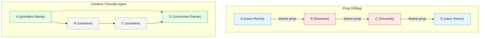
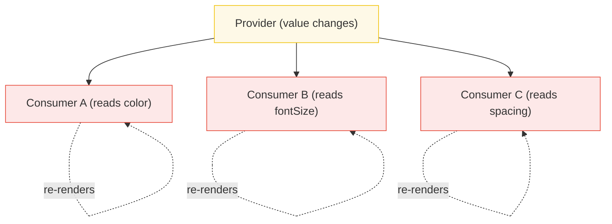

# [FEE-603] Context & Prop Drilling

:::info
Context is a **dependency injection** mechanism, not a state manager. It exists to deliver cross-cutting values -- theme, locale, auth -- without threading props through every intermediate component. The moment you start putting high-frequency, rapidly changing state into context (especially in React), you invite performance problems that no amount of memoization can fully fix.
:::

## Context

In any non-trivial component tree, some data is needed by components that are far apart in the hierarchy. A theme token set at the app root must reach a deeply nested button. An authentication object created at login must be available to an API layer three levels down. A locale string must be readable by every translated label in the tree.

The naive solution is **prop drilling**: passing the value as a prop from parent to child, through every intermediate component, until it reaches the consumer. Prop drilling works, but it creates tight coupling between components that do not use the value and forces every intermediate component to declare, accept, and forward the prop.

### The Prop Drilling Problem

Consider a simple component tree where only component D needs a `theme` value owned by component A:

```
A (owns theme)
 -> B (forwards theme)
    -> C (forwards theme)
       -> D (uses theme)
```

Components B and C have no interest in `theme`. They accept it as a prop solely to pass it along. This creates three problems:

1. **Coupling.** B and C now depend on the `theme` prop. Renaming, retyping, or removing it requires changes in components that do not use it.
2. **Noise.** Every intermediate component's interface is polluted with props it does not consume.
3. **Fragility.** Adding a new layer between A and D requires updating the prop chain. Missing one link breaks the entire flow.

Every modern framework provides a mechanism to bypass this chain and deliver values directly from provider to consumer. In React it is the Context API. In Vue it is `provide`/`inject`. In Svelte it is `setContext`/`getContext`. In Angular it is the dependency injection system.

## Design Thinking

### Why Context Exists

Context was designed for a specific class of data: **cross-cutting concerns**. These are values that:

- Are needed by many components at different depths in the tree
- Change infrequently (theme, locale, auth status)
- Represent configuration or environment, not application data
- Would be impractical to pass through props

The React documentation explicitly states: "Context is designed to share data that can be considered 'global' for a tree of React components." The key word is "global" -- not "frequently updated."

### React Context: The Re-Render-All Trap

When a React Context provider's `value` changes, **every component that calls `useContext` for that context re-renders**. There is no built-in selector mechanism. React cannot know that component X only reads `theme.primaryColor` while component Y only reads `theme.fontSize`. Both re-render when any part of the theme object changes.

This is fundamentally different from a state management library like Zustand, where selectors allow components to subscribe to specific slices of state and skip re-renders when unrelated slices change.

#### Mitigation Strategies

**1. Split Contexts.** Instead of one large context with multiple values, create separate contexts for each value:

```jsx
// Instead of one big context:
// { theme, locale, user, permissions }

// Split into focused contexts:
const ThemeContext = createContext(defaultTheme);
const LocaleContext = createContext('en');
const AuthContext = createContext(null);
```

When `theme` changes, only `ThemeContext` consumers re-render. `LocaleContext` and `AuthContext` consumers are unaffected.

**2. Stabilize the value reference with useMemo.** If you pass an object as context value, React sees a new reference on every render and triggers consumer re-renders even when the content is identical:

```jsx
// PROBLEM: new object every render
function ThemeProvider({ children }) {
  const [mode, setMode] = useState('light');
  // This creates a new object reference on every render
  return (
    <ThemeContext value={{ mode, setMode }}>
      {children}
    </ThemeContext>
  );
}

// FIX: stabilize with useMemo
function ThemeProvider({ children }) {
  const [mode, setMode] = useState('light');
  const value = useMemo(() => ({ mode, setMode }), [mode]);
  return (
    <ThemeContext value={value}>
      {children}
    </ThemeContext>
  );
}
```

**3. Separate state from dispatch.** Put the state value and the updater function in different contexts. The updater (dispatch/setState) is a stable reference and rarely needs its own re-render cycle:

```jsx
const ThemeStateContext = createContext('light');
const ThemeDispatchContext = createContext(() => {});

function ThemeProvider({ children }) {
  const [mode, setMode] = useState('light');
  return (
    <ThemeStateContext value={mode}>
      <ThemeDispatchContext value={setMode}>
        {children}
      </ThemeDispatchContext>
    </ThemeStateContext>
  );
}
```

Components that only need to change the theme (buttons, toggles) consume `ThemeDispatchContext` and never re-render when the theme value changes.

**4. use-context-selector (userland library).** The `use-context-selector` library by Daishi Kato provides a `useContextSelector` hook that lets consumers subscribe to a slice of context, similar to Zustand selectors:

```jsx
import { useContextSelector } from 'use-context-selector';

const primaryColor = useContextSelector(
  ThemeContext,
  (ctx) => ctx.primaryColor
);
```

The component only re-renders when `primaryColor` changes, not when other parts of the theme change. Note that this is a third-party library, not a built-in React feature.

### Vue provide/inject: Fine-Grained by Default

Vue's reactivity system tracks which specific reactive properties each component reads. When you `provide` a `ref` and a descendant `inject`s it, Vue knows exactly which components depend on that ref. When the ref changes, only the components that actually read it re-render.

This means Vue does not suffer from the "re-render-all" problem that plagues React Context. You can safely provide reactive state without worrying about cascading re-renders to unrelated consumers.

However, Vue best practice recommends keeping mutations co-located with the provider. Instead of letting consumers mutate injected state directly, provide mutation functions alongside the reactive data:

```js
// Provider
provide('theme', {
  mode: readonly(mode),
  setMode
});
```

Using `readonly()` prevents accidental mutations by consumers.

### Svelte Context: Not Reactive

Svelte's `setContext`/`getContext` is **not reactive by default**. Context in Svelte is set once during component initialization and does not update when the source value changes. If you need reactivity, you must explicitly pass a reactive `$state` object as the context value and update its properties (not reassign the whole object).

This is a critical distinction from Vue's `provide`/`inject`, where passing a `ref` automatically maintains reactivity. In Svelte, context is primarily used for dependency injection of static services or configuration -- not for reactive state sharing.

### Angular Dependency Injection

Angular takes the most explicit approach. Its DI system uses `@Injectable` services registered in a hierarchical injector tree. Services can be provided at the root level (singleton), module level, or component level. This is the most powerful and most complex context mechanism among the major frameworks, but the core idea is the same: bypass prop drilling by registering a value at a high level and injecting it where needed.

## Best Practices

**Split context by update frequency to prevent unnecessary re-renders.** In React, every consumer of a context re-renders when the provider's value reference changes. SHOULD create separate contexts for values that change at different rates -- theme, locale, and auth belong in separate contexts, not merged into one large object. When a context carries an object or array, MUST memoize the value with `useMemo` to prevent a new reference on every provider render from triggering all consumers.

**Provide a custom hook over raw `useContext` for better encapsulation.** SHOULD wrap `useContext` calls in a named hook (`useTheme`, `useAuth`) rather than calling `useContext(SomeContext)` directly in consumers. The custom hook can validate that the consumer is inside the correct provider, throw a descriptive error if not, and hide the context object's shape from consumer components, making future refactors easier.

**Use context for stable values -- theme, locale, auth -- not frequently-changing data.** Context is a dependency injection mechanism, not a state manager. MUST NOT put high-frequency state (form input, cursor position, animation frames) into React Context; every change re-renders all consumers regardless of which slice they read. For frequently-changing shared state, use a dedicated state management library (Zustand, Pinia) whose selectors limit re-renders to components that subscribe to the changed slice.

## Visual

### Prop Drilling vs. Context



In the prop drilling model, B and C are forced intermediaries (red). With context, B and C are completely unaware of the provided value (gray), and only A and D participate.

### React Context Re-Render Problem



When the provider value changes, **all three consumers re-render** -- even if only `color` changed. Consumers B and C did not need to update but React has no built-in way to know that.

## Example

### 1. React Context for Theme

```jsx
import { createContext, useContext, useState, useMemo } from 'react';

// 1. Create the context
const ThemeContext = createContext('light');

// 2. Provider component
function ThemeProvider({ children }) {
  const [mode, setMode] = useState('light');
  const value = useMemo(() => ({ mode, setMode }), [mode]);

  return (
    <ThemeContext value={value}>
      {children}
    </ThemeContext>
  );
}

// 3. Custom hook for consumers
function useTheme() {
  const ctx = useContext(ThemeContext);
  if (ctx === undefined) {
    throw new Error('useTheme must be used within a ThemeProvider');
  }
  return ctx;
}

// 4. Consumer component (deep in the tree)
function ThemedButton() {
  const { mode, setMode } = useTheme();
  return (
    <button
      style={{
        background: mode === 'light' ? '#fff' : '#333',
        color: mode === 'light' ? '#333' : '#fff',
      }}
      onClick={() => setMode(mode === 'light' ? 'dark' : 'light')}
    >
      Toggle Theme
    </button>
  );
}

// 5. App tree -- no prop drilling through Header or Nav
function App() {
  return (
    <ThemeProvider>
      <Header />
    </ThemeProvider>
  );
}

function Header() {
  // Header does NOT receive or forward theme
  return (
    <nav>
      <ThemedButton />
    </nav>
  );
}
```

Key points:
- `ThemeProvider` wraps the tree once at a high level.
- `Header` has no knowledge of the theme -- no props forwarded.
- `ThemedButton` consumes context directly via `useTheme()`.
- The value is stabilized with `useMemo` to prevent unnecessary re-renders.

### 2. Vue provide/inject

```vue
<!-- ThemeProvider.vue -->
<script setup>
import { ref, provide, readonly } from 'vue';

const mode = ref('light');

function setMode(newMode) {
  mode.value = newMode;
}

// Provide reactive state + mutation function
provide('theme', {
  mode: readonly(mode),
  setMode,
});
</script>

<template>
  <slot />
</template>
```

```vue
<!-- ThemedButton.vue (deep in the tree) -->
<script setup>
import { inject } from 'vue';

const { mode, setMode } = inject('theme');

function toggle() {
  setMode(mode.value === 'light' ? 'dark' : 'light');
}
</script>

<template>
  <button
    :style="{
      background: mode === 'light' ? '#fff' : '#333',
      color: mode === 'light' ? '#333' : '#fff',
    }"
    @click="toggle"
  >
    Toggle Theme
  </button>
</template>
```

```vue
<!-- App.vue -->
<template>
  <ThemeProvider>
    <Header />
  </ThemeProvider>
</template>
```

Key points:
- Vue's `provide` passes a reactive `ref` -- changes propagate automatically.
- `readonly()` prevents consumers from mutating the state directly.
- Only components that actually read `mode` re-render when it changes -- no "re-render-all" trap.
- No intermediate component needs to know about the theme.

### 3. React Context Performance Issue and Fix

```jsx
import { createContext, useContext, useState, useMemo } from 'react';

// PROBLEM: One big context with multiple values
const AppContext = createContext(null);

function AppProvider({ children }) {
  const [theme, setTheme] = useState('light');
  const [locale, setLocale] = useState('en');
  const [user, setUser] = useState(null);

  // Even with useMemo, ALL consumers re-render when ANY value changes
  const value = useMemo(
    () => ({ theme, setTheme, locale, setLocale, user, setUser }),
    [theme, locale, user]
  );

  return (
    <AppContext value={value}>
      {children}
    </AppContext>
  );
}

// This component only reads theme, but re-renders when locale or user changes
function ThemeDisplay() {
  const { theme } = useContext(AppContext);
  return <div>Current theme: {theme}</div>;
}
```

```jsx
// FIX: Split into separate contexts

const ThemeContext = createContext(null);
const LocaleContext = createContext(null);
const AuthContext = createContext(null);

function ThemeProvider({ children }) {
  const [theme, setTheme] = useState('light');
  const value = useMemo(() => ({ theme, setTheme }), [theme]);
  return <ThemeContext value={value}>{children}</ThemeContext>;
}

function LocaleProvider({ children }) {
  const [locale, setLocale] = useState('en');
  const value = useMemo(() => ({ locale, setLocale }), [locale]);
  return <LocaleContext value={value}>{children}</LocaleContext>;
}

function AuthProvider({ children }) {
  const [user, setUser] = useState(null);
  const value = useMemo(() => ({ user, setUser }), [user]);
  return <AuthContext value={value}>{children}</AuthContext>;
}

// Now ThemeDisplay only re-renders when theme changes
function ThemeDisplay() {
  const { theme } = useContext(ThemeContext);
  return <div>Current theme: {theme}</div>;
}

// Compose providers
function App() {
  return (
    <ThemeProvider>
      <LocaleProvider>
        <AuthProvider>
          <Page />
        </AuthProvider>
      </LocaleProvider>
    </ThemeProvider>
  );
}
```

Key points:
- The monolithic `AppContext` forces all consumers to re-render on any change.
- Splitting into `ThemeContext`, `LocaleContext`, and `AuthContext` isolates re-renders.
- Each provider stabilizes its value with `useMemo`.
- Components subscribe only to the context they need.

## Common Mistakes

### 1. Confusing Svelte Context (Not Reactive) with Vue provide/inject (Reactive)

```js
// Svelte -- context is NOT reactive by default
setContext('count', 0);
// Later reads via getContext('count') will always return 0

// To make it reactive, pass a $state object:
let count = $state({ value: 0 });
setContext('count', count);
// Consumers must read count.value, and updates propagate
// But reassigning count = { value: 1 } breaks the link
```

Svelte context is set once at component initialization. If you need reactive values, you must explicitly use `$state` objects and update properties rather than reassigning. Vue's `provide`/`inject` with a `ref` is reactive by default -- changes propagate automatically.

### 2. Using Context When a State Library Is Needed

Context is for **dependency injection** -- delivering services, configuration, and cross-cutting concerns. If you find yourself with:
- Frequent state updates (multiple times per second)
- Complex update logic (reducers, middleware)
- Selective subscriptions (component A cares about slice X, not slice Y)
- DevTools requirements (time-travel debugging, action logging)

...you need a state management library (Zustand, Pinia, Redux, Jotai), not context. Context and state libraries solve different problems and are often used together: the library manages state, and context delivers the store instance to the tree.

## Related FEEs

- [FEE-600](./600.md) State Management Overview -- the taxonomy that classifies context as a "shared state" transport mechanism
- [FEE-601](./601.md) Local Component State -- the simplest alternative when state does not need to be shared
- [FEE-607](./607.md) State Management Libraries -- Zustand, Pinia, Redux, and other tools designed for the job context is not

## References

- [React: createContext](https://react.dev/reference/react/createContext) -- official API reference for creating context objects
- [React: useContext](https://react.dev/reference/react/useContext) -- official hook for consuming context values
- [Vue: Provide / Inject](https://vuejs.org/guide/components/provide-inject) -- official guide on Vue's dependency injection mechanism
- [Svelte: Context](https://svelte.dev/docs/svelte/context) -- official docs for setContext/getContext in Svelte
- [Angular: Dependency Injection](https://angular.dev/guide/di) -- official guide on Angular's DI system
- [Mark Erikson: Why React Context is Not a "State Management" Tool](https://blog.isquaredsoftware.com/2021/01/context-redux-differences/) -- detailed analysis of context vs. state management
- [Nadia Makarevich: How to Write Performant React Apps with Context](https://www.developerway.com/posts/how-to-write-performant-react-apps-with-context) -- practical guide to context performance patterns
- [use-context-selector (GitHub)](https://github.com/dai-shi/use-context-selector) -- userland library for selective context consumption
