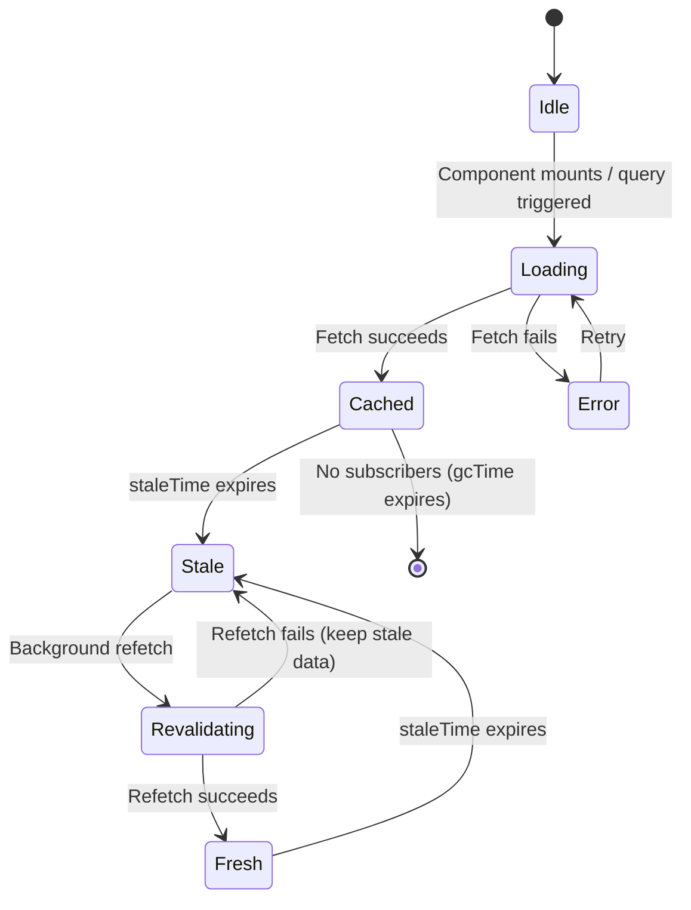
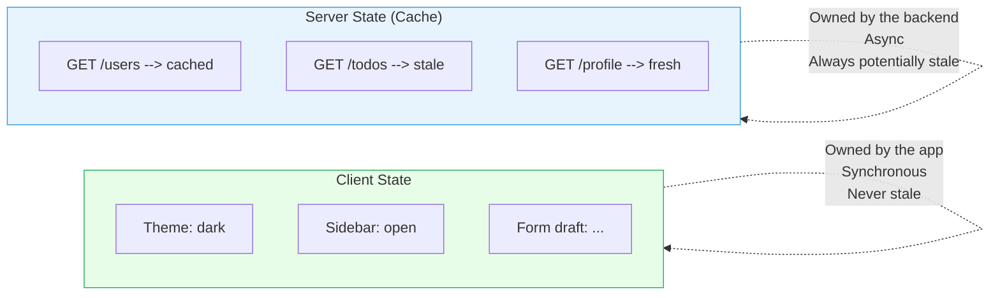

# [FEE-604] Server State & Data Synchronization

:::info
Server state is data that lives on the backend and is merely *borrowed* by the frontend. It can change without the client knowing, it can be stale the instant you receive it, and multiple users may be mutating it concurrently. Treating server responses like local state -- storing them in Redux or Zustand and manually managing loading, error, and freshness -- is one of the most common sources of bugs and complexity in modern frontend applications.
:::

## Context

Every non-trivial frontend application fetches data from a server. User profiles, product catalogs, notification feeds, and configuration objects all originate on the backend and flow to the client over HTTP or WebSocket connections. The moment that data arrives on the client, it begins aging. The server may have already accepted a new write from another user. A background job may have updated a record. The data you just received is, at best, a snapshot of a moment that has already passed.

This is the fundamental challenge of **server state**: the client never owns the truth. It holds a cache -- a local copy that may or may not reflect reality. The question is not *whether* the cache will become stale, but *how quickly* and *what you do about it*.

For years, the standard approach was to store API responses in a global client-side store (Redux, Vuex, MobX) alongside UI state like modals and form inputs. Developers wrote action creators, reducers, thunks, sagas, and epics just to fetch a list of items and put them into a normalized store. Loading states, error states, cache invalidation, refetching, deduplication, and retry logic were all implemented manually, over and over, in every project.

Dedicated server-state libraries -- TanStack Query, SWR, Nuxt's `useFetch`, and framework-level data loading (Remix loaders, SvelteKit `load`, React Server Components) -- exist because this class of problems is distinct from client-state management and deserves specialized tooling.

## Design Thinking

### Why Not Redux for Server Data?

Consider what happens when you store a list of todos fetched from `/api/todos` in a Redux store:

1. You dispatch `FETCH_TODOS_REQUEST` and set `loading: true`.
2. The thunk fires `fetch('/api/todos')`.
3. On success, you dispatch `FETCH_TODOS_SUCCESS` with the payload and set `loading: false`.
4. On failure, you dispatch `FETCH_TODOS_FAILURE` with the error.
5. A component reads `state.todos.items`, `state.todos.loading`, and `state.todos.error`.

This works for one endpoint. Now multiply it by every API call in your application. You need a reducer, three action types, a thunk, and a selector -- per endpoint. You also need to answer:

- When is the data stale? How do you know when to refetch?
- What happens when two components both need the same data? Do they both fetch?
- What happens when the user switches tabs and comes back? Is the data still fresh?
- After a mutation (POST, PUT, DELETE), which queries need to be invalidated?
- How do you show optimistic updates and roll back on failure?

Redux does not answer any of these questions. You must build the answers yourself, every time. This is not a criticism of Redux -- it was never designed for this problem.

### Cache as the Source of Truth

TanStack Query and SWR flip the model. Instead of storing server data in a client store, they maintain a **query cache** -- a specialized data structure that tracks:

- The cached response for each unique query key
- The timestamp of the last successful fetch
- Whether the data is fresh, stale, or being refetched
- Loading, error, and success states
- The number of active subscribers (components using this data)

When a component calls `useQuery`, it subscribes to a cache entry. If the entry exists and is fresh, the component receives the cached data immediately with no network request. If the entry is stale, the component receives the cached data immediately *and* a background refetch is triggered. If no entry exists, a fetch is initiated and the component sees a loading state.

This is the **stale-while-revalidate** pattern: serve the cache instantly, then silently update it in the background. The user sees content immediately, and it corrects itself moments later if anything changed. This approach, borrowed from HTTP caching semantics (RFC 5861), is the foundation of modern server-state management.

### SSR Eliminates the Initial Cache Problem

React Server Components, Remix loaders, SvelteKit `load` functions, and Nuxt `useFetch` take a different but complementary approach: they fetch data on the server during the request cycle and deliver it as part of the initial HTML or serialized payload. The client never needs to show a loading spinner for the first render because the data arrives with the page.

- **React Server Components** execute on the server. They can `await` database queries or API calls directly. The result is streamed as rendered HTML -- no client-side fetch, no loading state, no cache entry needed for the initial load.
- **Remix loaders** run on the server before the route renders. Components receive data synchronously via `useLoaderData`. After the initial load, Remix handles revalidation automatically when mutations occur.
- **SvelteKit `load` functions** run on the server for the first request and on the client for subsequent navigations. Data is passed to the page component as props.
- **Nuxt `useFetch`** wraps `useAsyncData` and `$fetch`. It fetches on the server during SSR and transfers the data to the client via the Nuxt payload, preventing duplicate requests during hydration.

These approaches do not replace TanStack Query or SWR -- they complement them. Server-rendered data handles the initial load; client-side cache libraries handle subsequent interactions, mutations, and real-time updates.

## Best Practices

**Separate server state from client state -- do not put server data in Redux or Zustand.** Client stores (Redux, Zustand, Pinia) are designed for synchronous, client-owned data: theme, sidebar state, form drafts. MUST NOT use them as the source of truth for server-fetched data. Doing so requires manually implementing loading states, error states, staleness detection, refetching, deduplication, and cache invalidation for every endpoint. Use TanStack Query, SWR, or framework-level loaders (Remix, SvelteKit) instead; they handle all of this automatically.

**Use stale-while-revalidate caching.** SHOULD configure `staleTime` to reflect how frequently your data genuinely changes. Data served from cache is shown to the user immediately while a background refetch silently updates it. A `staleTime` of zero (the default) refetches on every mount; an appropriate non-zero value (e.g., 30 seconds for a user list) eliminates unnecessary network requests without showing stale data for long.

**Apply optimistic updates with rollback on error.** When a mutation is likely to succeed, SHOULD update the cache immediately before the server responds so the UI feels instant. MUST snapshot the previous cache state before applying the optimistic change and restore it in the `onError` handler. Without rollback, a server rejection leaves the UI permanently inconsistent until the next full page reload.

**Invalidate cache on mutation.** After a successful write (POST, PUT, DELETE), MUST call `invalidateQueries` (or equivalent) for every query whose cached data could now be stale. Failing to invalidate means the UI continues showing pre-mutation data, appearing to silently discard the user's changes.

## Visual

### Server State Lifecycle



The key insight: **Stale** and **Revalidating** are not error states. They are normal, expected phases in the lifecycle. The user sees data during both -- only the freshness changes.

### Client State vs. Server State



## Example

### 1. TanStack Query: Basic Query

```tsx
import { useQuery } from '@tanstack/react-query';

function TodoList() {
  const { data, isLoading, isError, error } = useQuery({
    queryKey: ['todos'],
    queryFn: () => fetch('/api/todos').then(res => res.json()),
    staleTime: 30_000,   // Data is fresh for 30 seconds
    gcTime: 300_000,     // Unused cache lives for 5 minutes
  });

  if (isLoading) return <p>Loading...</p>;
  if (isError) return <p>Error: {error.message}</p>;

  return (
    <ul>
      {data.map(todo => (
        <li key={todo.id}>{todo.title}</li>
      ))}
    </ul>
  );
}
```

Key behaviors that you get for free:
- Automatic deduplication: if two components use `['todos']`, only one request fires.
- Background refetch on window focus and network reconnect.
- Stale data served instantly while revalidation happens in the background.
- Garbage collection of unused cache entries after `gcTime`.

### 2. TanStack Query: Optimistic Mutation with Rollback

```tsx
import { useMutation, useQueryClient } from '@tanstack/react-query';

function useAddTodo() {
  const queryClient = useQueryClient();

  return useMutation({
    mutationFn: (newTodo) =>
      fetch('/api/todos', {
        method: 'POST',
        body: JSON.stringify(newTodo),
        headers: { 'Content-Type': 'application/json' },
      }).then(res => res.json()),

    // Optimistic update: modify the cache before the server responds
    onMutate: async (newTodo) => {
      // Cancel in-flight refetches so they do not overwrite our optimistic data
      await queryClient.cancelQueries({ queryKey: ['todos'] });

      // Snapshot the current cache for rollback
      const previous = queryClient.getQueryData(['todos']);

      // Optimistically add the new todo
      queryClient.setQueryData(['todos'], (old) => [
        ...old,
        { ...newTodo, id: Date.now() },
      ]);

      // Return the snapshot so onError can restore it
      return { previous };
    },

    // Rollback on failure
    onError: (_err, _newTodo, context) => {
      queryClient.setQueryData(['todos'], context.previous);
    },

    // Refetch after success or failure to ensure server truth
    onSettled: () => {
      queryClient.invalidateQueries({ queryKey: ['todos'] });
    },
  });
}
```

The pattern: snapshot the cache, apply the optimistic change, roll back on error, and always invalidate on settle. The user sees the new todo instantly. If the server rejects it, the todo disappears and the cache returns to the server-confirmed state.

### 3. SWR: Minimal Data Fetching

```tsx
import useSWR from 'swr';

const fetcher = (url) => fetch(url).then(res => res.json());

function Profile() {
  const { data, error, isLoading } = useSWR('/api/user', fetcher);

  if (isLoading) return <p>Loading...</p>;
  if (error) return <p>Error loading profile.</p>;

  return <h1>Hello, {data.name}</h1>;
}
```

SWR achieves the same stale-while-revalidate pattern with less configuration. It uses the URL as the cache key by default, deduplicates requests, revalidates on focus and reconnect, and supports interval polling. It is lighter than TanStack Query but offers fewer features (no built-in mutation primitives, no query invalidation from mutations, no devtools).

**TanStack Query vs. SWR -- when to choose which:**

| Concern | TanStack Query | SWR |
|---|---|---|
| Mutation support | Built-in `useMutation` with optimistic updates, rollback | Manual via `mutate` helper |
| Cache invalidation | `invalidateQueries` by key or predicate | Manual `mutate(key)` |
| DevTools | Official React Query DevTools | Community-built |
| Bundle size | Larger (~39 kB) | Smaller (~13 kB) |
| Framework support | React, Vue, Solid, Svelte, Angular | React only |
| Best for | Complex apps with many mutations | Read-heavy apps with simple updates |

### 4. Nuxt useFetch (SSR + Client)

```vue
<script setup>
const { data: todos, status, error, refresh } = await useFetch('/api/todos');
</script>

<template>
  <p v-if="status === 'pending'">Loading...</p>
  <p v-else-if="error">Error: {{ error.message }}</p>
  <ul v-else>
    <li v-for="todo in todos" :key="todo.id">{{ todo.title }}</li>
  </ul>
  <button @click="refresh()">Refresh</button>
</template>
```

`useFetch` fetches on the server during SSR and transfers the cached result to the client via the Nuxt payload. The client does not re-fetch during hydration. Subsequent calls to `refresh()` fetch fresh data on the client side.

### 5. Remix Loader

```tsx
// app/routes/todos.tsx
import type { LoaderFunctionArgs } from '@remix-run/node';
import { json } from '@remix-run/node';
import { useLoaderData } from '@remix-run/react';

export async function loader({ request }: LoaderFunctionArgs) {
  const todos = await db.todos.findMany();
  return json({ todos });
}

export default function Todos() {
  const { todos } = useLoaderData<typeof loader>();
  return (
    <ul>
      {todos.map(todo => (
        <li key={todo.id}>{todo.title}</li>
      ))}
    </ul>
  );
}
```

No loading state. No error boundary for fetch failures (Remix has route-level error boundaries). No client-side cache to manage. The data arrives with the HTML. After mutations via Remix `action` functions, loaders automatically revalidate.

## Common Mistakes

### 1. No Loading or Error States

```tsx
// WRONG -- assumes data is always available
function UserProfile() {
  const { data } = useQuery({ queryKey: ['user'], queryFn: fetchUser });
  return <h1>{data.name}</h1>; // Crashes when data is undefined
}

// CORRECT -- handle all states
function UserProfile() {
  const { data, isLoading, isError, error } = useQuery({
    queryKey: ['user'],
    queryFn: fetchUser,
  });

  if (isLoading) return <Skeleton />;
  if (isError) return <ErrorMessage error={error} />;
  return <h1>{data.name}</h1>;
}
```

Server data is inherently asynchronous. Every query has at least three states: loading, error, and success. Ignoring any of them creates runtime crashes or broken UIs.

### 2. No Cache Invalidation After Mutation

```tsx
// WRONG -- cache still shows old data after creating a todo
const mutation = useMutation({
  mutationFn: createTodo,
  // Missing: onSuccess / onSettled to invalidate the todos query
});

// CORRECT -- invalidate related queries
const mutation = useMutation({
  mutationFn: createTodo,
  onSuccess: () => {
    queryClient.invalidateQueries({ queryKey: ['todos'] });
  },
});
```

Without invalidation, the UI shows stale data after a successful write. The user creates a todo but does not see it in the list until they manually refresh the page.

### 3. Optimistic Updates Without Rollback

```tsx
// WRONG -- no rollback on failure
onMutate: async (newTodo) => {
  queryClient.setQueryData(['todos'], (old) => [...old, newTodo]);
  // If the server rejects, the UI permanently shows a ghost item
},

// CORRECT -- snapshot and restore on error (see Example 2 above)
```

Optimistic updates must always include a rollback path. Without it, a server failure leaves the UI in an inconsistent state that only a full page refresh can fix.

### 4. Waterfall Fetching (Sequential When Parallel Is Possible)

```tsx
// WRONG -- sequential fetches create a waterfall
function Dashboard() {
  const { data: user } = useQuery({ queryKey: ['user'], queryFn: fetchUser });
  const { data: todos } = useQuery({
    queryKey: ['todos', user?.id],
    queryFn: () => fetchTodos(user.id),
    enabled: !!user, // Waits for user to load first
  });
  const { data: stats } = useQuery({
    queryKey: ['stats'],
    queryFn: fetchStats,
    enabled: !!todos, // Waits for todos -- but stats do not depend on todos
  });
  // Total time: user + todos + stats (sequential)
}

// CORRECT -- only depend where truly necessary
function Dashboard() {
  const { data: user } = useQuery({ queryKey: ['user'], queryFn: fetchUser });
  const { data: todos } = useQuery({
    queryKey: ['todos', user?.id],
    queryFn: () => fetchTodos(user.id),
    enabled: !!user, // Truly depends on user
  });
  const { data: stats } = useQuery({
    queryKey: ['stats'],
    queryFn: fetchStats,
    // No enabled constraint -- fetches in parallel with user
  });
  // Total time: max(user + todos, stats)
}
```

Only use `enabled` when there is a genuine data dependency. Unnecessary sequential fetching adds latency that users can see and feel.

## Related FEEs

- [FEE-600](./600.md) State Management Overview -- the taxonomy that classifies server state as a distinct category
- [FEE-403](../JavaScript%20Fundamentals/403.md) Fetch API -- the underlying mechanism for making HTTP requests
- [FEE-607](./607.md) State Management Libraries -- Redux, Zustand, Pinia, and when they are (and are not) the right tool

## References

- [TanStack Query: Overview](https://tanstack.com/query/latest/docs/framework/react/overview) -- official documentation covering queries, mutations, and caching
- [TanStack Query: Query Invalidation](https://tanstack.com/query/latest/docs/framework/react/guides/query-invalidation) -- guide to invalidating and refetching queries
- [TanStack Query: Optimistic Updates](https://tanstack.com/query/latest/docs/framework/react/guides/optimistic-updates) -- patterns for instant UI updates with rollback
- [SWR](https://swr.vercel.app/) -- Vercel's React data fetching library implementing stale-while-revalidate
- [Nuxt: useFetch](https://nuxt.com/docs/api/composables/use-fetch) -- SSR-friendly data fetching composable for Nuxt
- [Remix: Data Loading](https://v2.remix.run/docs/guides/data-loading/) -- server-side loaders and automatic revalidation
- [SvelteKit: Loading Data](https://svelte.dev/docs/kit/load) -- server and universal load functions
- [React: Server Components](https://react.dev/reference/rsc/server-components) -- server-side rendering with zero client-side fetch
- [RFC 5861: HTTP Cache-Control Extensions for Stale Content](https://datatracker.ietf.org/doc/html/rfc5861) -- the HTTP specification behind stale-while-revalidate
