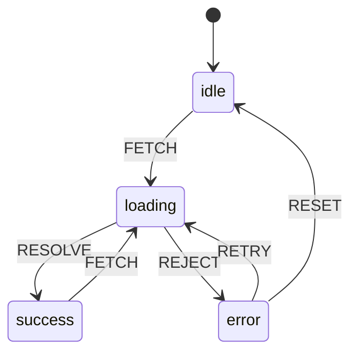
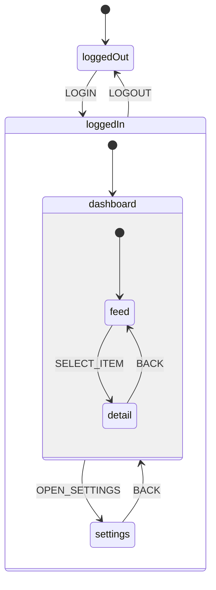

# [FEE-605] State Machines & Finite Automata

:::info
A state machine is a mathematical model where a system can be in exactly one of a finite number of states at any given time, transitioning between states only through explicitly defined events. In UI development, state machines replace fragile boolean flag combinations with a single, unambiguous status variable -- making impossible states impossible by design.
:::

## Context

Every interactive UI has modes. A fetch request is idle, loading, successful, or failed. A modal is open or closed. A multi-step form is on step 1, 2, or 3. These are **finite states** -- discrete modes that your component occupies at any point in time.

The natural instinct is to model these modes with boolean flags: `isLoading`, `isError`, `isSuccess`. This works for the simplest cases, but it breaks down quickly. With 3 booleans you have 2^3 = 8 possible combinations, yet only 4 of them are valid (idle, loading, success, error). The remaining 4 combinations -- like `isLoading === true && isError === true` -- are **impossible states** that your code must constantly guard against but can never fully prevent.

This is the **boolean flag explosion** problem. As David Khourshid (creator of XState) puts it: "With N boolean flags, you have 2^N possible states, and it is up to the developer to ensure that a large subset of those 2^N states never occur." The burden grows exponentially, and every new flag doubles the number of combinations to reason about.

Finite State Machines (FSMs) solve this by replacing booleans with an explicit state variable and a transition table. The system is always in exactly one state. Events cause transitions between states. If a transition is not defined for the current state, the event is simply ignored. There is no way to reach an impossible combination because the machine does not allow it.

**Statecharts** extend FSMs with hierarchical (nested) states, parallel (orthogonal) regions, history states, and guard conditions. Invented by David Harel in 1987, statecharts address the combinatorial explosion that plain FSMs suffer from when modeling complex systems -- you can group related states into parent states and run independent regions in parallel without multiplying your state count.

**XState** is the most widely adopted statechart library in the JavaScript ecosystem. It provides a declarative API for defining machines, a visual inspector for debugging, and an actor model for orchestrating multiple machines. For simpler cases, React's built-in `useReducer` can serve as a lightweight FSM without adding a dependency.

## Design Thinking

### Why Machines Model UI Better Than Booleans

UI components have **discrete modes**. A button is idle, hovered, pressed, or disabled. A network request is idle, pending, resolved, or rejected. A wizard is on step 1, 2, 3, or complete. These are not continuous spectrums -- they are distinct, mutually exclusive states.

Booleans obscure this reality. When you write `isLoading`, `isError`, and `isSuccess` as separate variables, you are telling the runtime that each can independently be true or false. But they are not independent -- they are facets of a single mode. A request cannot be both loading and successful at the same time. Yet your type system allows it, your runtime allows it, and eventually a race condition or a forgotten `setState` will produce it.

A state machine makes the constraint explicit. You define the states: `idle`, `loading`, `success`, `error`. You define the transitions: `idle --FETCH--> loading`, `loading --RESOLVE--> success`, `loading --REJECT--> error`. There is no transition from `idle` to `success` because that would mean data arrived without a request. There is no way to be in two states at once because the machine holds a single state value.

This is not just cleaner code -- it is a fundamentally different model. Booleans describe **properties** that can combine in any way. States describe **modes** that are mutually exclusive. UI components have modes, not properties. State machines model the truth.

### The Impossible State Problem

Consider a data-fetching component with these flags:

- `isIdle`
- `isLoading`
- `isError`
- `isSuccess`

Four booleans produce 2^4 = 16 combinations. Only 4 are valid (one flag true, the rest false). The remaining 12 are impossible -- but nothing in the code prevents them from occurring. Every conditional in your component must defensively check for combinations that should never exist.

With a state machine, you have a single variable: `status: 'idle' | 'loading' | 'error' | 'success'`. Four possible values. Four valid states. Zero impossible combinations. The type system enforces it. The runtime enforces it. The developer does not need to think about it.

### Statecharts: Scaling Beyond Flat FSMs

Plain FSMs have a limitation: every state is at the same level. When you need to model a system where some states share behavior (like "any error state should allow retry"), you must duplicate transitions across every error-related state.

Statecharts solve this with **hierarchical states**. A parent state `authenticated` can contain child states `dashboard`, `settings`, `profile`. Any transition defined on `authenticated` applies to all children. If the user's session expires, a single `SESSION_EXPIRED` transition on the parent handles it, regardless of which child state is active.

**Parallel states** (orthogonal regions) let you model independent concerns without multiplying states. A video player might have a `playback` region (playing/paused) and a `volume` region (muted/unmuted). With flat FSMs you need 4 states: playing-unmuted, playing-muted, paused-unmuted, paused-muted. With parallel states, you have 2 + 2 = 4 state values organized in 2 independent regions. The difference becomes dramatic at scale: 3 regions with 3 states each produce 27 flat states but only 9 statechart values.

**History states** remember the last active child state when you exit a compound state. When you return to the parent, the machine resumes from where it left off rather than starting from the initial child state. This is useful for tabbed interfaces, multi-step forms, and any flow where the user expects to return to their previous position.

### The XState Actor Model

XState v5 embraces the **actor model** for orchestration. Each machine instance is an actor that:

- Has its own internal state (context + finite state)
- Receives events (messages)
- Can send events to other actors
- Can spawn child actors

This model maps naturally to component hierarchies. A parent component's machine can spawn a child machine for each item in a list, communicate via events, and clean up when the child is no longer needed. It avoids the shared-mutable-state problems of global stores while providing structured communication between independent state machines.

## Best Practices

**Model impossible states as impossible -- use a discriminated union, not loose booleans.** MUST NOT model mutually exclusive modes as independent boolean flags. Four booleans (`isIdle`, `isLoading`, `isError`, `isSuccess`) produce 16 possible combinations, only 4 of which are valid. A single discriminated union (`status: 'idle' | 'loading' | 'error' | 'success'`) produces exactly 4 values. The type system enforces correctness; no runtime guard can ever plug all 12 impossible combinations.

**Use guard conditions to restrict transitions.** SHOULD add guard conditions to transitions that have preconditions: validate that a URL is non-empty before triggering a fetch, prevent duplicate submissions while already loading. A guard is a pure, synchronous function returning `true` or `false`. AVOID defining the same transition in two states when simply omitting it from one state would prevent the invalid path entirely.

**Keep machine definition separate from component code.** SHOULD define state machines in dedicated files or modules, not inline inside components. A machine defined outside a component can be imported by tests, the Stately visualizer, and multiple component instances. Inlining the machine inside a component ties its definition to the component lifecycle and makes the visual diagram impossible to access independently.

**Ensure every non-final state has at least one outgoing transition.** MUST NOT leave any state as a dead end. Every error state needs at least a `RETRY` or `RESET` transition so the user can recover without a page reload. The XState visualizer makes dead-end states immediately visible as nodes with no outgoing arrows -- use it to verify completeness before shipping.

## Visual

### Fetch State Machine



The machine makes several guarantees visible:
- You cannot reach `success` without going through `loading`.
- You cannot `RETRY` from `idle` or `success` -- only from `error`.
- Every state has at least one outgoing transition, so the UI is never stuck.
- The `RESET` transition from `error` returns to `idle`, clearing the failed state.

### Statechart with Hierarchical and Parallel States



The hierarchy means: if the user is in `loggedIn.dashboard.detail` and the `LOGOUT` event fires, the machine transitions to `loggedOut` regardless of the nested depth. One transition on the parent handles all children.

## Example

### 1. Boolean Flag Explosion vs. FSM

```tsx
// WRONG -- boolean flags create impossible states
function useFetchBooleans() {
  const [isIdle, setIsIdle] = useState(true);
  const [isLoading, setIsLoading] = useState(false);
  const [isError, setIsError] = useState(false);
  const [isSuccess, setIsSuccess] = useState(false);
  const [data, setData] = useState(null);
  const [error, setError] = useState(null);

  async function fetchData(url) {
    // Must manually reset ALL flags -- miss one and you have an impossible state
    setIsIdle(false);
    setIsLoading(true);
    setIsError(false);
    setIsSuccess(false);
    setError(null);

    try {
      const res = await fetch(url);
      const json = await res.json();
      setData(json);
      setIsLoading(false); // What if this line runs but the next does not?
      setIsSuccess(true);
    } catch (err) {
      setError(err);
      setIsLoading(false);
      setIsError(true);
    }
  }

  return { isIdle, isLoading, isError, isSuccess, data, error, fetchData };
}

// CORRECT -- single state variable, no impossible combinations
function useFetchMachine() {
  const [state, setState] = useState({ status: 'idle', data: null, error: null });

  async function fetchData(url) {
    setState({ status: 'loading', data: null, error: null });

    try {
      const res = await fetch(url);
      const json = await res.json();
      setState({ status: 'success', data: json, error: null });
    } catch (err) {
      setState({ status: 'error', data: null, error: err });
    }
  }

  return { ...state, fetchData };
}
```

The boolean version has 2^4 = 16 possible flag combinations. The FSM version has exactly 4 possible statuses. No impossible states can exist.

### 2. XState Machine for Fetch

```ts
import { setup, assign, fromPromise } from 'xstate';

const fetchMachine = setup({
  types: {
    context: {} as { data: unknown; error: unknown; url: string },
    events: {} as
      | { type: 'FETCH'; url: string }
      | { type: 'RETRY' }
      | { type: 'RESET' },
  },
  actors: {
    fetchData: fromPromise(async ({ input }: { input: { url: string } }) => {
      const res = await fetch(input.url);
      if (!res.ok) throw new Error(`HTTP ${res.status}`);
      return res.json();
    }),
  },
}).createMachine({
  id: 'fetch',
  initial: 'idle',
  context: { data: null, error: null, url: '' },
  states: {
    idle: {
      on: {
        FETCH: {
          target: 'loading',
          actions: assign({ url: ({ event }) => event.url }),
        },
      },
    },
    loading: {
      invoke: {
        src: 'fetchData',
        input: ({ context }) => ({ url: context.url }),
        onDone: {
          target: 'success',
          actions: assign({ data: ({ event }) => event.output }),
        },
        onError: {
          target: 'error',
          actions: assign({ error: ({ event }) => event.error }),
        },
      },
    },
    success: {
      on: {
        FETCH: {
          target: 'loading',
          actions: assign({ url: ({ event }) => event.url }),
        },
      },
    },
    error: {
      on: {
        RETRY: { target: 'loading' },
        RESET: {
          target: 'idle',
          actions: assign({ data: null, error: null, url: '' }),
        },
      },
    },
  },
});
```

Usage in React:

```tsx
import { useMachine } from '@xstate/react';

function UserProfile() {
  const [state, send] = useMachine(fetchMachine);

  return (
    <div>
      {state.matches('idle') && (
        <button onClick={() => send({ type: 'FETCH', url: '/api/user' })}>
          Load Profile
        </button>
      )}
      {state.matches('loading') && <Spinner />}
      {state.matches('success') && <Profile data={state.context.data} />}
      {state.matches('error') && (
        <div>
          <p>Error: {String(state.context.error)}</p>
          <button onClick={() => send({ type: 'RETRY' })}>Retry</button>
          <button onClick={() => send({ type: 'RESET' })}>Reset</button>
        </div>
      )}
    </div>
  );
}
```

Key benefits over the boolean approach:
- `state.matches('loading')` is exhaustive -- there is no way to be in two states.
- The `RETRY` event only works in the `error` state. Sending it in `idle` does nothing.
- The XState visualizer (stately.ai/viz) renders the machine as an interactive diagram.
- TypeScript infers the full type of events, states, and context.

### 3. useReducer as a Simple FSM

For cases where XState is overkill (simple toggles, small state machines with 3-5 states), React's `useReducer` can enforce FSM semantics without an external dependency:

```ts
type FetchState =
  | { status: 'idle' }
  | { status: 'loading' }
  | { status: 'success'; data: unknown }
  | { status: 'error'; error: unknown };

type FetchEvent =
  | { type: 'FETCH' }
  | { type: 'RESOLVE'; data: unknown }
  | { type: 'REJECT'; error: unknown }
  | { type: 'RETRY' }
  | { type: 'RESET' };

// Transition table: current state + event = next state
const TRANSITIONS: Record<FetchState['status'], Partial<Record<FetchEvent['type'], (event: FetchEvent) => FetchState>>> = {
  idle: {
    FETCH: () => ({ status: 'loading' }),
  },
  loading: {
    RESOLVE: (e) => ({ status: 'success', data: (e as any).data }),
    REJECT: (e) => ({ status: 'error', error: (e as any).error }),
  },
  success: {
    FETCH: () => ({ status: 'loading' }),
  },
  error: {
    RETRY: () => ({ status: 'loading' }),
    RESET: () => ({ status: 'idle' }),
  },
};

function fetchReducer(state: FetchState, event: FetchEvent): FetchState {
  const handler = TRANSITIONS[state.status]?.[event.type];
  // If no transition is defined, ignore the event (FSM semantics)
  return handler ? handler(event) : state;
}
```

Usage:

```tsx
function DataLoader({ url }: { url: string }) {
  const [state, dispatch] = useReducer(fetchReducer, { status: 'idle' });

  useEffect(() => {
    if (state.status !== 'loading') return;

    let cancelled = false;
    fetch(url)
      .then(res => res.json())
      .then(data => { if (!cancelled) dispatch({ type: 'RESOLVE', data }); })
      .catch(error => { if (!cancelled) dispatch({ type: 'REJECT', error }); });

    return () => { cancelled = true; };
  }, [state.status, url]);

  return (
    <div>
      {state.status === 'idle' && (
        <button onClick={() => dispatch({ type: 'FETCH' })}>Load</button>
      )}
      {state.status === 'loading' && <Spinner />}
      {state.status === 'success' && <pre>{JSON.stringify(state.data)}</pre>}
      {state.status === 'error' && (
        <>
          <p>Failed: {String(state.error)}</p>
          <button onClick={() => dispatch({ type: 'RETRY' })}>Retry</button>
        </>
      )}
    </div>
  );
}
```

The `TRANSITIONS` object is the state machine. The reducer looks up the current state and the incoming event. If a transition exists, it returns the next state. If not, it returns the current state unchanged -- exactly how a state machine behaves when it receives an unhandled event.

### When to Use What

| Complexity | Tool | When |
|---|---|---|
| Simple toggle (2 states) | `useState` with a boolean | Open/closed, on/off, visible/hidden |
| 3-5 states, few transitions | `useReducer` with transition table | Fetch status, simple wizards, form modes |
| 5+ states, nested/parallel | XState | Complex workflows, multi-step forms, orchestration |
| Visual debugging needed | XState + Stately visualizer | Any machine where the team needs to see the flow |

## Common Mistakes

### 1. Using Boolean Flags for Complex Flows

```ts
// WRONG -- 5 booleans = 32 possible combinations, most are impossible
const [isIdle, setIsIdle] = useState(true);
const [isLoading, setIsLoading] = useState(false);
const [isError, setIsError] = useState(false);
const [isSuccess, setIsSuccess] = useState(false);
const [isRetrying, setIsRetrying] = useState(false);

// CORRECT -- one status variable, 5 valid states
const [status, setStatus] = useState<
  'idle' | 'loading' | 'error' | 'success' | 'retrying'
>('idle');
```

Every boolean you add doubles the number of states. A single discriminated union keeps the count linear and makes impossible states unrepresentable.

### 2. Not Modeling Error Recovery Transitions

```ts
// WRONG -- no way out of the error state
states: {
  error: {
    // Dead end. User is stuck.
  },
}

// CORRECT -- provide recovery paths
states: {
  error: {
    on: {
      RETRY: { target: 'loading' },
      RESET: { target: 'idle' },
    },
  },
}
```

Every error state should have at least one exit transition. Users must be able to recover without refreshing the page. This is one of the strongest benefits of modeling with state machines -- you can visually verify that every state has an outgoing path.

### 3. Over-engineering Simple Toggles with XState

```ts
// OVERKILL -- XState for a boolean toggle
const toggleMachine = createMachine({
  id: 'toggle',
  initial: 'inactive',
  states: {
    inactive: { on: { TOGGLE: 'active' } },
    active: { on: { TOGGLE: 'inactive' } },
  },
});

// SUFFICIENT -- useState for a simple toggle
const [isOpen, setIsOpen] = useState(false);
const toggle = () => setIsOpen(prev => !prev);
```

XState adds bundle size (~20 kB) and conceptual overhead. For a component with 2 states and 1 event, `useState` is the right tool. Reach for XState when you have 5+ states, nested states, parallel regions, or when you need the visualizer for team communication.

### 4. Forgetting Guard Conditions

```ts
// WRONG -- allows fetch even when already loading (duplicate requests)
idle: {
  on: { FETCH: 'loading' },
},
loading: {
  on: { FETCH: 'loading' }, // Oops -- re-enters loading on every click
},

// CORRECT -- guard prevents re-entry, or simply do not define the transition
idle: {
  on: {
    FETCH: {
      target: 'loading',
      guard: ({ context }) => context.url !== '',
    },
  },
},
// loading state has no FETCH transition -- clicks are ignored
```

Guards (also called conditions) let you add runtime checks to transitions. They are essential for preventing double-submits, validating preconditions, and branching to different target states based on context.

### 5. Not Using the XState Visualizer for Debugging

XState machines are designed to be visualized. The Stately editor (stately.ai/editor) and the inspector (`@stately/inspect`) render your machine as an interactive statechart diagram. You can:

- See all states and transitions at a glance
- Simulate events and watch the machine respond
- Identify dead-end states (no outgoing transitions)
- Share the diagram with designers and product managers

If you define a machine in code but never visualize it, you are leaving the most powerful benefit of state machines on the table. The visual representation is how you verify correctness, communicate with non-engineers, and debug unexpected behavior.

## Related FEEs

- [FEE-600](./600.md) State Management Overview -- the taxonomy that includes state machines as a state management approach
- [FEE-601](./601.md) Local Component State -- `useReducer` as the simplest path to FSM semantics in React
- [FEE-305](../JavaScript%20Core%20and%20Runtime/305.md) Error Handling -- error recovery transitions in state machines map directly to error handling patterns

## References

- [XState Documentation](https://stately.ai/docs/xstate) -- official docs for XState v5, covering machines, actors, and framework integrations
- [Stately: Finite States](https://stately.ai/docs/finite-states) -- explanation of finite states in the context of XState
- [Stately Editor & Visualizer](https://stately.ai/registry/new) -- visual tool for creating, editing, and simulating state machines
- [Statecharts.dev: What is a Statechart?](https://statecharts.dev/what-is-a-statechart.html) -- introduction to statecharts by the community
- [Wikipedia: Finite-state machine](https://en.wikipedia.org/wiki/Finite-state_machine) -- formal definition and theory of FSMs
- [David Khourshid: Robust React User Interfaces with Finite State Machines](https://css-tricks.com/robust-react-user-interfaces-with-finite-state-machines/) -- the boolean explosion problem and FSM solution
- [David Khourshid: The FaceTime Bug and the Dangers of Implicit State Machines](https://medium.com/@DavidKPiano/the-facetime-bug-and-the-dangers-of-implicit-state-machines-a5f0f61bdaa2) -- real-world consequences of implicit state management
- [Kent C. Dodds: Stop Using isLoading Booleans](https://kentcdodds.com/blog/stop-using-isloading-booleans) -- practical argument against boolean flags for async status
- [Kyle Shevlin: How to Use useReducer as a Finite State Machine](https://kyleshevlin.com/how-to-use-usereducer-as-a-finite-state-machine/) -- lightweight FSM pattern with React hooks
- [Wikipedia: UML State Machine](https://en.wikipedia.org/wiki/UML_state_machine) -- formal specification of statecharts including hierarchical and orthogonal states
