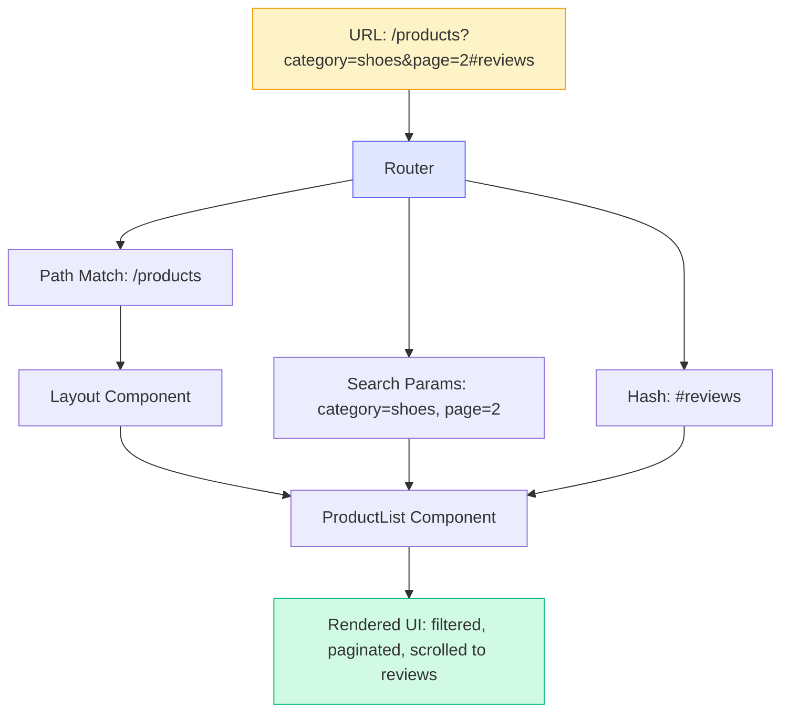
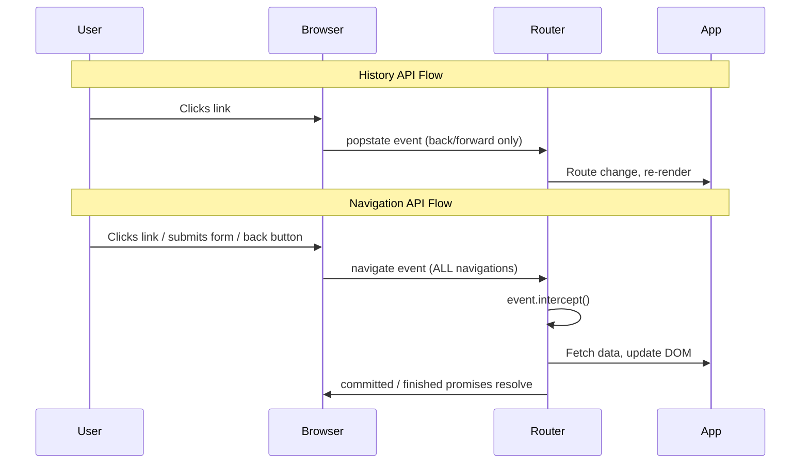

# [FEE-606] URL State & Routing

:::info
The URL is the original state container of the web. Every page load, every bookmark, every shared link encodes application state directly in the address bar. Single-page applications broke this contract by managing navigation entirely in JavaScript, hiding state behind in-memory variables. Modern frameworks and browser APIs are restoring the URL to its rightful place as the source of truth for shareable, navigable application state.
:::

## Context

Before SPAs existed, the URL *was* the application state. Clicking a link sent a request to the server, which returned a new HTML page. The browser's address bar, back button, and bookmark functionality all worked seamlessly because every meaningful state change produced a new URL. Users could copy a URL, send it to a colleague, and the colleague would see exactly the same page.

Early SPAs (2010-era Backbone, Angular.js) broke this model. Navigation happened entirely in JavaScript, and the URL stayed on `/` while the application cycled through dozens of views. The back button stopped working, and a bookmarked page loaded the empty shell instead of the view the user had saved.

The web platform responded with the History API (`pushState`, `replaceState`, `popstate`), which allowed JavaScript to update the URL without a full page reload. Framework routers (React Router, Vue Router, Angular Router) built on this foundation to restore URL-driven navigation within SPAs. Today, the newer Navigation API provides even more control, with proper interception of navigation events, access to the full history entry list, and a promise-based navigation model.

The URL is not merely a display artifact. It is a **state container** with well-defined segments:

| Segment | Purpose | Example |
|---|---|---|
| **Pathname** | Identifies the resource/route | `/products/42` |
| **Search params** | Encodes filter/sort/pagination state | `?category=shoes&sort=price` |
| **Hash** | Points to a section within the page | `#reviews` |

Each segment serves a different role. Pathnames identify *what* the user is looking at. Search params describe *how* they are looking at it (filtered, sorted, paginated). Hashes point to *where* on the page they are focused.

## Visual

### URL to Component Tree Flow



The router decomposes the URL into its constituent parts and distributes them to the component tree. The pathname determines *which* components render. Search params and hash are passed as props or accessed via hooks, influencing *what* and *where* the components display.

### Navigation Flow: History API vs. Navigation API



## Example

These examples focus on React and its meta-frameworks (React Router, Next.js), where file-based routing and typed loaders are currently most mature. SvelteKit and Vue Router apply the same URL-as-state principles through `load` functions and `useRoute()` respectively; the file-based routing table further down this article and the References section link to the framework-specific docs.

### 1. URLSearchParams for Filter State

The `URLSearchParams` API provides a clean interface for reading and writing search parameters without manual string parsing:

```ts
// Reading search params from the current URL
const params = new URLSearchParams(window.location.search);
const category = params.get('category');    // "shoes" or null
const page = Number(params.get('page')) || 1;
const sort = params.get('sort') ?? 'relevance';

// Writing search params without a full page reload
function updateFilters(newCategory: string) {
  const params = new URLSearchParams(window.location.search);
  params.set('category', newCategory);
  params.set('page', '1'); // Reset pagination on filter change

  // pushState: creates a new history entry (back button returns to previous)
  history.pushState(null, '', `?${params.toString()}`);

  // OR replaceState: updates current entry (no new history entry)
  // history.replaceState(null, '', `?${params.toString()}`);

  // Trigger your app to re-read the URL and re-render
  applyFilters();
}
```

In React, the `useSearchParams` hook wraps this pattern:

```tsx
import { useSearchParams } from 'react-router';

function ProductFilters() {
  const [searchParams, setSearchParams] = useSearchParams();
  const category = searchParams.get('category') ?? 'all';

  function handleCategoryChange(newCategory: string) {
    setSearchParams((prev) => {
      prev.set('category', newCategory);
      prev.set('page', '1');
      return prev;
    });
  }

  return (
    <select value={category} onChange={(e) => handleCategoryChange(e.target.value)}>
      <option value="all">All</option>
      <option value="shoes">Shoes</option>
      <option value="bags">Bags</option>
    </select>
  );
}
```

### 2. React Router v7 Data Loader

React Router v7 (framework mode) combines file-based routing with server-side data loading. The `loader` function runs on the server before the component renders, and its data is available synchronously in the component:

```tsx
// app/routes/products.tsx
import type { Route } from './+types/products';

export async function loader({ request }: Route.LoaderArgs) {
  const url = new URL(request.url);
  const category = url.searchParams.get('category') ?? 'all';
  const page = Number(url.searchParams.get('page')) || 1;

  const products = await db.products.findMany({
    where: category !== 'all' ? { category } : {},
    skip: (page - 1) * 20,
    take: 20,
  });

  return { products, category, page };
}

export default function Products({ loaderData }: Route.ComponentProps) {
  const { products, category, page } = loaderData;

  return (
    <div>
      <h1>Products ({category})</h1>
      <ul>
        {products.map((p) => (
          <li key={p.id}>{p.name} - ${p.price}</li>
        ))}
      </ul>
      <Pagination current={page} />
    </div>
  );
}
```

The URL drives everything: the `loader` reads search params from the request URL, fetches the right data, and the component renders it. Changing the URL (via links, form submissions, or `useNavigate`) automatically triggers the loader again. No manual state synchronization needed.

### 3. Next.js Parallel Routes

Next.js parallel routes allow multiple route segments to render simultaneously in the same layout. This is powerful for dashboards and complex UIs where different panels have independent URL-driven state:

```
app/
  dashboard/
    layout.tsx          # Renders both @analytics and @feed slots
    page.tsx            # Default dashboard content
    @analytics/
      page.tsx          # Analytics panel
      loading.tsx       # Independent loading state
    @feed/
      page.tsx          # Activity feed panel
      loading.tsx       # Independent loading state
```

```tsx
// app/dashboard/layout.tsx
export default function DashboardLayout({
  children,
  analytics,
  feed,
}: {
  children: React.ReactNode;
  analytics: React.ReactNode;
  feed: React.ReactNode;
}) {
  return (
    <div className="grid grid-cols-3 gap-4">
      <main className="col-span-2">{children}</main>
      <aside>
        {analytics}
        {feed}
      </aside>
    </div>
  );
}
```

Each slot (`@analytics`, `@feed`) loads independently and can have its own loading and error states. The URL determines which content renders in each slot. Combined with intercepting routes, this enables patterns like modal overlays that preserve the underlying page URL while displaying detail views.

## Best Practices

**Encode shareable UI state in the URL: filters, search, pagination.** Any state that changes the answer to "what is the user looking at?" SHOULD live in the URL. If a user can describe their view to a colleague ("show me shoes sorted by price, page 3"), a URL that encodes that view lets them share it with a single copy-paste. Component-local state (`useState`, `ref()`) is ephemeral: it vanishes on refresh and cannot be shared. AVOID keeping filters, sort orders, search queries, or selected tabs in component state when those values should survive a page reload.

**Use `URLSearchParams` for structured query string management.** MUST NOT parse query strings manually with `split('&')` and `split('=')`. Manual parsing breaks on empty values, encoded ampersands, and duplicate keys. `URLSearchParams` handles encoding, decoding, duplicate keys (`getAll()`), and serialization correctly across all browsers. Use `params.set()` to update a single parameter and `params.toString()` to write it back to the URL.

**Avoid duplicating URL state in local or server state.** When the URL is the source of truth, MUST NOT also store the same value in `useState` or a store. Two sources describing the same thing will eventually disagree. The most common trigger is the back button: it changes the URL but leaves component state untouched. Let the URL own the value; components read from it via router hooks (`useSearchParams`, `useRoute`) and write to it via navigation.

**Validate and type URL state instead of trusting raw strings.** Search params arrive as untyped strings, so `Number(params.get('page')) || 1` in the example above silently turns `page=abc` into `1` with no record that parsing failed. SHOULD validate search params against a schema at the route boundary rather than inline in each component. TanStack Router's `validateSearch` option takes a schema (Zod, Valibot, or a plain function) on the route definition and exposes typed, validated values to loaders and components, so a bad value fails predictably instead of propagating `NaN`. `nuqs` gives React apps outside TanStack Router (Next.js, Remix, plain React Router) a comparable schema-typed read/write API through parsers with declared defaults.

**Use `history.replaceState` not `pushState` for non-navigational state updates.** `pushState` creates a new browser history entry, so the back button returns to the previous filter set. `replaceState` updates the URL in place without a new entry. SHOULD use `replaceState` (or the router equivalent) when a state change refines the current view (changing a sort order) rather than constituting a meaningful navigation the user would want to step back through.

## Design Thinking

### The URL: The Web's Original State Manager

The web's original request-response model gave users three capabilities for free:

1. **Shareability.** Copy a URL, paste it anywhere, and the recipient sees the same content.
2. **Bookmarkability.** Save a URL and return to the exact same view weeks later.
3. **Navigability.** The back and forward buttons traverse meaningful state transitions.

SPAs traded these capabilities for richer interactivity. Modern frameworks keep the URL authoritative while still rendering client-side.

### File-Based Routing as Convention

Early SPA routers required explicit route configuration: a JavaScript object mapping URL patterns to components. This was flexible but verbose, and it disconnected the URL structure from the file structure:

```js
// Manual route configuration (React Router v5 style)
const routes = [
  { path: '/', element: <Home /> },
  { path: '/products', element: <Products /> },
  { path: '/products/:id', element: <ProductDetail /> },
  { path: '/about', element: <About /> },
];
```

Next.js popularized **file-based routing**: the file system *is* the route table. A file at `app/products/[id]/page.tsx` automatically handles `/products/42`. SvelteKit, Nuxt, and Remix/React Router v7 (framework mode) all adopt this pattern with slightly different conventions:

| Framework | Route file | Dynamic segment | Layout |
|---|---|---|---|
| Next.js (App Router) | `app/products/[id]/page.tsx` | `[id]` | `layout.tsx` |
| SvelteKit | `src/routes/products/[id]/+page.svelte` | `[id]` | `+layout.svelte` |
| Nuxt | `pages/products/[id].vue` | `[id]` | `layouts/default.vue` |
| React Router v7 | `app/routes/products.$id.tsx` | `$id` | `root.tsx` |

File-based routing eliminates the disconnect between code organization and URL structure.

### The Parallel State Problem

The hardest challenge in URL state management is keeping two sources of state in sync: the URL and the component tree. Consider a product listing page with filters:

1. The user selects "category=shoes" from a dropdown.
2. The component state updates to reflect the selection.
3. The URL must also update to `?category=shoes`.
4. If the user presses the back button, the URL changes back.
5. The component state must update to match the previous URL.

This bidirectional synchronization is the **parallel state problem**. If the component owns the state and the URL is merely a reflection, back-button navigation breaks because the component does not react to URL changes. If the URL owns the state and the component reads from it, the solution is cleaner but requires every state change to go through the URL (via `pushState` or router navigation).

The principle: **let the URL be the single source of truth. Components read from the URL, and user interactions write to the URL.**

### History API vs. Navigation API

The History API (`pushState`, `replaceState`, `popstate`) has been the foundation of SPA routing since 2010. It works, but it has significant limitations:

- **No way to intercept navigations before they happen.** You can listen to `popstate` after a back/forward navigation, but you cannot prevent or modify it.
- **No access to the full history list.** `history.length` tells you how many entries exist, but you cannot inspect them.
- **No way to distinguish your app's entries from other origins.** The history is shared across all pages in the tab.
- **No promises.** `pushState` is fire-and-forget with no way to know when the navigation completes.

The Navigation API addresses these limitations. It reached Baseline Newly Available in January 2026, so it now works across all major browsers, though MDN notes that some parts of the API still vary by implementation; see [FEE-418](../Browser%20APIs%20and%20Web%20Platform/navigation-api.md) for the full guard-check rationale and lifecycle diagram:

```js
// Navigation API: intercept and handle a navigation
navigation.addEventListener('navigate', (event) => {
  if (!event.canIntercept) return;             // cross-origin or cross-document traversal
  if (event.hashChange) return;                 // fragment navigation, no view change needed
  if (event.downloadRequest !== null) return;   // download link, let the browser handle it

  const url = new URL(event.destination.url);

  if (url.pathname.startsWith('/products/')) {
    event.intercept({
      async handler() {
        const content = await fetchProductPage(url.pathname);
        renderContent(content);
      },
    });
  }
});

// Programmatic navigation returns a promise pair, not a thenable
const { committed, finished } = navigation.navigate('/products/42');
await committed; // fulfills when the URL changes
await finished;  // fulfills when the intercept handler's promise resolves
```

Key advantages of the Navigation API:
- **Intercept any navigation** (link clicks, form submissions, back/forward) in one place, guarded by `canIntercept`, `hashChange`, and `downloadRequest`.
- **Access history entries** scoped to your origin via `navigation.entries()`.
- **Promise-based navigation** with `committed` and `finished` promises.
- **Per-entry state** via `navigation.navigate(url, { state })` that persists across sessions.

Framework routers are beginning to adopt the Navigation API under the hood, but understanding it helps you reason about what your router is doing and debug navigation issues.

### Client-Side vs. Server-Side Routing

| Aspect | Server-Side Routing | Client-Side Routing |
|---|---|---|
| **Mechanism** | Server receives URL, returns HTML | JavaScript intercepts navigation, updates DOM |
| **Page reload** | Full reload on every navigation | No reload; DOM updates in place |
| **Initial load** | Fast (HTML arrives ready) | Slower (JS bundle must load first) |
| **Subsequent navigation** | Slower (full round-trip) | Faster (only data fetched, not full HTML) |
| **SEO** | Built-in (HTML is crawlable) | Requires SSR/SSG for crawlability |
| **Back button** | Works natively | Must be implemented by the router |

Modern meta-frameworks (Next.js, Remix, SvelteKit, Nuxt) blur this distinction. Initial page loads are server-rendered for speed and SEO. Subsequent navigations are client-side for responsiveness. This hybrid approach, sometimes called **transitional apps**, gives you the best of both worlds.

## Common Mistakes

### 1. Not Syncing URL with State on Browser Back

```js
// WRONG -- listens to dropdown change but ignores popstate
dropdown.addEventListener('change', (e) => {
  currentCategory = e.target.value;
  history.pushState(null, '', `?category=${currentCategory}`);
  renderProducts();
});
// User presses back: URL changes, but component still shows old category

// CORRECT -- also listen to popstate (or use a framework router)
window.addEventListener('popstate', () => {
  const params = new URLSearchParams(window.location.search);
  currentCategory = params.get('category') ?? 'all';
  dropdown.value = currentCategory;
  renderProducts();
});
```

The back button changes the URL, but your application must react to that change. Framework routers handle this automatically, which is a key reason to use them instead of manual `pushState` calls.

### 2. Encoding Complex State in URL

```
// WRONG -- serializing entire application state into the URL
/dashboard?state=eyJmaWx0ZXJzIjp7ImNhdGVnb3J5Ijoic2hvZXMiLCJwcmljZVJhbmdlIjpbMTAsMTAwXX19

// CORRECT -- simple, readable parameters for shareable state
/dashboard?category=shoes&priceMin=10&priceMax=100
```

URLs have practical length limits (around 2,000 characters for broad compatibility). Base64-encoded JSON blobs are opaque, fragile, and impossible to debug. Keep URL state flat and human-readable. Complex state that does not need to be shareable (form drafts, UI preferences) belongs in component state, localStorage, or sessionStorage.

### 3. Not Using URLSearchParams (Manual String Parsing)

```js
// WRONG -- fragile manual parsing
const query = window.location.search.substring(1);
const parts = query.split('&');
const params = {};
parts.forEach((part) => {
  const [key, value] = part.split('=');
  params[key] = decodeURIComponent(value);
});
// Breaks on: empty search, missing values, encoded ampersands, duplicate keys

// CORRECT -- use the platform
const params = new URLSearchParams(window.location.search);
const category = params.get('category');
const tags = params.getAll('tag'); // Handles duplicate keys: ?tag=a&tag=b
```

`URLSearchParams` handles encoding, decoding, duplicate keys, missing values, and iteration. It is supported in all modern browsers and Node.js. There is no reason to parse query strings manually.

### 4. Breaking Deep Links in SPAs

```
// WRONG -- SPA only handles navigation from the home page
// User visits https://myapp.com/products/42 directly
// Server returns 404 because no /products/42.html exists

// CORRECT -- configure server to serve index.html for all routes
// nginx
location / {
  try_files $uri $uri/ /index.html;
}

// Or use SSR/SSG so every route has a real server response
```

If your SPA uses client-side routing, the server must be configured to serve the SPA shell for any URL path. Otherwise, direct navigation, bookmarks, and shared links all produce 404 errors. SSR frameworks (Next.js, Remix, SvelteKit, Nuxt) solve this by generating server responses for every route.

## Related Topics

- [FEE-600](./600.md) State Management Overview — the taxonomy that classifies URL state as a distinct category
- [FEE-106](../HTML%20and%20Semantic%20Markup/106.md) Progressive Enhancement — URLs that work without JavaScript
- [FEE-418](../Browser%20APIs%20and%20Web%20Platform/navigation-api.md) Navigation API — the `canIntercept`/`hashChange`/`downloadRequest` guard checks and promise-based navigation lifecycle this article builds on
- [FEE-604](./604.md) Server State & Data Synchronization — loaders and server-side data fetching that read URL state

## References

- MDN contributors, "Navigation API," MDN Web Docs (2026). https://developer.mozilla.org/en-US/docs/Web/API/Navigation_API
- MDN contributors, "History API," MDN Web Docs (2025). https://developer.mozilla.org/en-US/docs/Web/API/History_API
- MDN contributors, "URLSearchParams," MDN Web Docs (2025). https://developer.mozilla.org/en-US/docs/Web/API/URLSearchParams
- François Best, "nuqs: Type-safe search params state manager for React," nuqs.dev (2025). https://nuqs.dev
- Tanner Linsley, "Search Params Are State," TanStack Blog (2025). https://tanstack.com/blog/search-params-are-state
- React Router team, "Data Loading," React Router Docs (2025). https://reactrouter.com/start/framework/data-loading
- Vercel, "Parallel Routes," Next.js Docs (2025). https://nextjs.org/docs/app/api-reference/file-conventions/parallel-routes
- Svelte team, "Routing," SvelteKit Docs (2025). https://svelte.dev/docs/kit/routing
- Vue Router team, "File-Based Routing," Vue Router Docs (2025). https://router.vuejs.org/file-based-routing/file-based-routing
- Ahmad Alfy, "Your URL Is Your State," alfy.blog (2025). https://alfy.blog/2025/10/31/your-url-is-your-state.html
