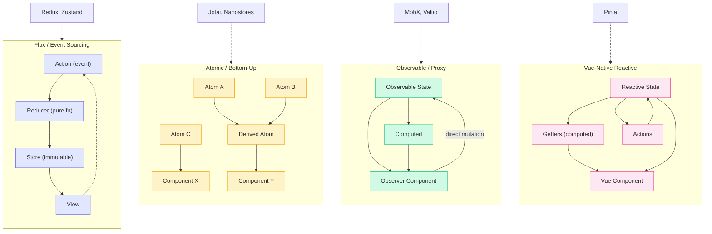

# [FEE-607] State Management Libraries

:::info
State management libraries are tools with opinions. Each one embeds a philosophy about how state should be structured, updated, and observed. Redux treats state changes as recorded events. MobX treats state as a living spreadsheet. Jotai builds state from the bottom up, one atom at a time. Choosing a library is not a technical decision alone -- it is a bet on which mental model your team will sustain over years of maintenance. Understanding the philosophy behind each library matters more than memorizing its API.
:::

## Context

The JavaScript ecosystem has produced dozens of state management libraries since Flux introduced the unidirectional data flow pattern in 2014. Each library emerged as a response to the limitations of its predecessors, and each carries a distinct philosophy about how application state should work.

The landscape is not random. It follows a pendulum pattern:

1. **2014 -- Flux/Redux era.** Facebook's Flux architecture introduced the idea that state changes should flow in one direction: action, dispatcher, store, view. Redux refined this into three principles (single source of truth, read-only state, pure reducer functions) and became the default choice for React applications. The philosophy: state changes are recorded events, like an append-only log.

2. **2015 -- MobX reaction.** Developers frustrated by Redux boilerplate adopted MobX, which took the opposite approach: mutable state with automatic dependency tracking. No actions, no reducers, no immutability -- just assign values and let the framework figure out what to update. The philosophy: state is a living spreadsheet.

3. **2019 -- Hooks reduce the need.** React Hooks (`useState`, `useReducer`, `useContext`) eliminated many use cases that previously required Redux. Dan Abramov, Redux's co-creator, had already written "You Might Not Need Redux" in 2016. Hooks made that advice practical for most applications.

4. **2020 -- Atomic stores.** Recoil (Facebook) and Jotai introduced atomic state: tiny independent units of state that compose into larger structures. This bottom-up approach offered fine-grained re-renders without the overhead of a centralized store. The philosophy: state as composable primitives.

5. **2023+ -- Server components shrink client state.** React Server Components, Next.js App Router, and similar frameworks moved data fetching to the server, reducing the amount of state that needs to live on the client. The remaining client state is often simple enough for local state or lightweight libraries.

Each wave did not kill the previous one. Redux is still widely used (Redux Toolkit modernized its API). MobX still powers large applications. The libraries coexist because they serve different needs, team sizes, and debugging requirements.

This article examines the design philosophy of seven libraries: Redux, Zustand, Pinia, Jotai, MobX, Nanostores, and Valtio. The goal is not to declare a winner but to help you understand which mental model fits your context.

## Design Thinking

### Redux: State Changes as Recorded Events

Redux is built on three principles borrowed from Flux, CQRS, and event sourcing:

1. **Single source of truth.** The entire application state lives in one store, a single JavaScript object tree. This makes serialization, debugging, and server-side rendering straightforward.
2. **State is read-only.** The only way to change state is to dispatch an action -- a plain object describing what happened. Views and network callbacks never write to state directly.
3. **Changes are made with pure functions.** Reducers take the previous state and an action, and return a new state object. No mutations, no side effects.

This architecture makes state changes **predictable and traceable**. Every change is an action object that can be logged, serialized, replayed, and inspected in DevTools. Time-travel debugging -- stepping backward and forward through state history -- is a natural consequence of this design.

The tradeoff is verbosity. A single feature in raw Redux requires an action type constant, an action creator function, and a reducer case. Redux Toolkit (RTK) was created to eliminate this boilerplate while preserving the philosophy. RTK's `createSlice` generates action creators and reducers from a single declaration. Immer runs under the hood, allowing "mutative" syntax that produces immutable updates.

Redux is strongest when you need: a complete audit trail of state changes, middleware pipelines (logging, analytics, optimistic updates), time-travel debugging, or a large team that benefits from the enforced structure.

### Zustand: Redux Without the Ceremony

Zustand strips Flux down to its essentials. It keeps the concept of a centralized store with immutable updates but removes the boilerplate:

- **No Provider required.** The store is a module-level singleton accessed via a hook. No React context, no wrapper components.
- **No action types or dispatchers.** State updates are plain functions defined inside the store.
- **Works outside React.** The store can be read and updated from vanilla JavaScript, event handlers, or WebSocket callbacks.
- **Minimal API surface.** The core API is `create` (to define a store) and the returned hook (to consume it). Selectors prevent unnecessary re-renders.

Zustand's philosophy is that the Flux pattern is sound but the ceremony around it is not. State should still be updated immutably, but developers should not need to define action types, wire up dispatchers, or wrap their app in a Provider. The result is a library that feels like "Redux for people who find Redux too heavy."

Middleware support (persist, devtools, immer) is available but optional. You add complexity only when you need it.

### Pinia: Leverage the Framework

Pinia is Vue's official state management library, replacing Vuex. Its philosophy is straightforward: **if you are using Vue, your state management should feel like Vue.**

Key design decisions:

- **No mutations.** Vuex required explicit mutation functions to change state. Pinia eliminates this layer entirely. Actions can be synchronous or asynchronous, and state can be modified directly.
- **Two store styles.** Options API stores (state, getters, actions as an object) feel familiar to Vuex users. Composition API stores (using `ref`, `computed`, and plain functions inside a setup function) leverage Vue's reactivity primitives directly.
- **Vue DevTools integration.** Pinia provides a timeline of actions, visual store relationships, and time-travel debugging through the Vue DevTools panel.
- **HMR support.** Stores can be hot-reloaded during development without losing state.
- **SSR-safe.** Pinia handles per-request state isolation, preventing cross-request pollution in server-rendered applications.
- **Flat architecture.** No nested modules. Stores are independent and can import from each other, even circularly.

Pinia's philosophy is that state management should not fight the framework. Vue's reactivity system already tracks dependencies, triggers updates, and provides computed properties. Pinia wraps this system in a thin layer that adds DevTools, SSR safety, and organizational structure -- nothing more.

### Jotai: Bottom-Up Composition

Jotai takes the opposite approach from Redux. Instead of a single top-down store, state is built from the bottom up using **atoms** -- tiny, independent units of state.

Core concepts:

- **Atoms are primitives.** An atom holds a single value: a number, a string, an object. It is the smallest possible unit of state.
- **Derived atoms.** An atom can be defined as a function of other atoms. When a source atom changes, derived atoms recompute automatically. This is similar to computed properties but at the store level.
- **No Provider needed** (optional). Jotai works with or without a Provider. Without one, atoms use a default global store. With one, you can scope atoms to a subtree (useful for testing or multiple instances).
- **Fine-grained re-renders.** A component that reads atom A does not re-render when atom B changes. React only re-renders the components that subscribe to the specific atoms that changed.

Jotai's philosophy is inspired by Recoil: state should compose like functions. Small atoms combine into larger structures through derivation, not through a monolithic store object. This makes Jotai particularly effective for applications with many independent pieces of state that occasionally need to interact.

The minimal core API (`atom`, `useAtom`) is around 2KB. Extensions like `atomWithStorage`, `atomWithQuery`, and `atomWithMachine` add persistence, data fetching, and state machine capabilities without bloating the core.

### MobX: The Spreadsheet Model

MobX's philosophy is captured in one sentence from its documentation: **"Anything that can be derived from the application state should be. Automatically."**

MobX uses **transparent functional reactive programming (TFRP)**:

- **State is mutable.** You define observable objects and modify them with plain JavaScript assignments. No action creators, no reducers, no immutable update patterns.
- **Automatic dependency tracking.** MobX records which observable properties each component reads during rendering. When those specific properties change, only those specific components re-render. No selectors, no manual optimization.
- **Computed values.** Like a spreadsheet cell that references other cells, computed values derive from observables and recompute only when their dependencies change.
- **Reactions.** Side effects (logging, network requests, localStorage writes) run automatically when their observed dependencies change.

The mental model is a spreadsheet: cells (observables) hold raw data, formulas (computed values) derive from cells, and when you change a cell, all dependent formulas recalculate automatically.

MobX requires less code than Redux for the same functionality, and its mutable API feels natural to developers coming from object-oriented backgrounds. The tradeoff is less visibility: without an explicit action log, tracking down "what changed this value and when?" can be harder. MobX does support actions (via `action` and `flow` decorators) to provide structure when needed.

### Nanostores: Minimal and Portable

Nanostores takes minimalism to its logical conclusion:

- **Framework-agnostic.** The same store works with React, Vue, Svelte, Solid, Lit, Angular, and vanilla JavaScript. You import a framework-specific binding (e.g., `@nanostores/react`) that weighs almost nothing.
- **Tiny footprint.** The core library is 271-802 bytes (minified + brotli). This is not a marketing claim -- it is a design constraint that shapes every API decision.
- **Atomic stores.** Like Jotai, state is organized as small independent stores. Unlike Jotai, stores are framework-agnostic objects with `.get()` and `.set()` methods, not React-specific atoms.
- **Lazy lifecycle.** Stores can define `onMount` callbacks that run only when a component subscribes. When the last subscriber disconnects, cleanup runs automatically. This is useful for WebSocket connections, timers, or other resources that should only exist while in use.

Nanostores' philosophy: state management should be a thin, portable layer that does not lock you into a framework. If you switch from React to Svelte, or if you need to share state logic between a React app and a vanilla JS widget, your stores should work unchanged. The cost is fewer features -- no built-in DevTools, no time-travel, no middleware pipeline. You get a minimal primitive and build what you need on top.

### Valtio: Write JavaScript Naturally

Valtio bridges the gap between mutable and immutable worlds using JavaScript Proxies:

- **Mutable writes.** You create a proxy object and mutate it directly: `state.count++`, `state.todos.push(item)`. No special syntax, no action creators, no spread operators.
- **Immutable reads.** The `useSnapshot()` hook returns an immutable snapshot of the proxy. React uses this snapshot for rendering and can efficiently detect which properties changed.
- **Module-scope state.** Like Zustand, the store lives outside React. You can update it from anywhere: event handlers, WebSocket callbacks, timers, other modules.

Valtio's philosophy is that the immutability requirement of React should be the library's problem, not the developer's. You write state updates in the most natural JavaScript possible, and the proxy layer translates mutations into immutable snapshots behind the scenes. The result is an API that feels like plain JavaScript but integrates cleanly with React's rendering model.

### The Decision Matrix

Choosing a library depends on context, not on which one is "best." Here are the dimensions that matter:

| Dimension | Redux/RTK | Zustand | Pinia | Jotai | MobX | Nanostores | Valtio |
|---|---|---|---|---|---|---|---|
| **Paradigm** | Flux / event sourcing | Simplified flux | Vue-native reactive | Atomic / bottom-up | Observable / proxy | Atomic / portable | Proxy / mutable |
| **Framework** | React (primarily) | React (primarily) | Vue (exclusively) | React (primarily) | Any (React, Vue, etc.) | Any | React (primarily) |
| **Bundle size** | ~11KB (RTK + React-Redux) | ~1.5KB | ~2KB | ~2KB | ~16KB | ~0.3-0.8KB | ~3KB |
| **Boilerplate** | Medium (RTK) / High (raw) | Low | Low | Low | Low | Low | Low |
| **DevTools** | Excellent (time-travel) | Good (Redux DevTools compatible) | Excellent (Vue DevTools) | Basic | Good (MobX DevTools) | None built-in | Basic |
| **Learning curve** | Steep (concepts) | Gentle | Gentle (for Vue devs) | Gentle | Medium (proxy/observable) | Gentle | Gentle |
| **Best for** | Large teams, audit trails | Small-medium React apps | Vue applications | Fine-grained React state | Complex derived state | Multi-framework, micro-frontends | Devs who prefer mutation |

## Best Practices

**Choose based on actual complexity -- do not add Redux for simple cases.** SHOULD evaluate whether your application actually has the problems a library solves before adding one. Redux earns its overhead when you need a complete audit trail, middleware pipelines, and time-travel debugging for a large, multi-developer codebase. For a small app where local state and `useContext` are sufficient, Redux adds indirection without benefit. As the library's own co-creator wrote: "Don't use Redux until you have problems with vanilla React."

**Colocate state with the feature that owns it.** SHOULD organize store state by feature domain, not by data type. State that belongs to the product listing feature should not be spread across a global monolithic store slice accessed by unrelated modules. When a feature is deleted, its state should be deletable too. Colocated state reduces the blast radius of changes and makes the relationship between features and their data explicit.

**Avoid putting server state in a global store.** MUST NOT mix server-fetched data (user lists, product catalogs, API responses) with client-owned state (theme, sidebar open/closed, form drafts) in the same store. Server state has distinct concerns: staleness, background refetching, deduplication, cache invalidation. A client store is not equipped to handle these automatically. Use TanStack Query or SWR for server state and reserve the client store for data the client genuinely owns.

**Use selector memoization to prevent excess re-renders.** When a component subscribes to a store, SHOULD pass a selector that returns only the minimal slice the component needs. Zustand selectors use referential equality by default; Redux Toolkit selectors via `createSelector` (Reselect) memoize derived values. A component that reads the full store object re-renders on every store change. A component that reads a single derived value re-renders only when that value changes.

## Visual

### State Management Paradigm Comparison



The four paradigms differ in how state flows. Flux enforces a strict cycle through actions and reducers. Atomic stores compose small independent pieces. Observable/proxy systems allow direct mutation with automatic tracking. Vue-native stores integrate with the framework's built-in reactivity.

## Example

The same counter store implemented in three paradigms. Each version provides `count`, `increment`, `decrement`, and `reset` -- the difference is the authoring model.

### 1. Redux Toolkit (Flux / Event Sourcing)

```ts
// store/counterSlice.ts
import { createSlice } from '@reduxjs/toolkit';

const counterSlice = createSlice({
  name: 'counter',
  initialState: { count: 0 },
  reducers: {
    increment(state) {
      state.count += 1; // Immer allows "mutation" syntax
    },
    decrement(state) {
      state.count -= 1;
    },
    reset(state) {
      state.count = 0;
    },
  },
});

export const { increment, decrement, reset } = counterSlice.actions;
export default counterSlice.reducer;
```

```tsx
// Counter.tsx
import { useSelector, useDispatch } from 'react-redux';
import { increment, decrement, reset } from './store/counterSlice';

function Counter() {
  const count = useSelector((state) => state.counter.count);
  const dispatch = useDispatch();

  return (
    <div>
      <span>{count}</span>
      <button onClick={() => dispatch(increment())}>+</button>
      <button onClick={() => dispatch(decrement())}>-</button>
      <button onClick={() => dispatch(reset())}>Reset</button>
    </div>
  );
}
```

Every state change goes through an action and a reducer. DevTools show the full action history. You can replay, skip, or reorder actions to debug.

### 2. Zustand (Simplified Flux)

```ts
// store/useCounterStore.ts
import { create } from 'zustand';

const useCounterStore = create((set) => ({
  count: 0,
  increment: () => set((state) => ({ count: state.count + 1 })),
  decrement: () => set((state) => ({ count: state.count - 1 })),
  reset: () => set({ count: 0 }),
}));

export default useCounterStore;
```

```tsx
// Counter.tsx
import useCounterStore from './store/useCounterStore';

function Counter() {
  const count = useCounterStore((state) => state.count);
  const increment = useCounterStore((state) => state.increment);
  const decrement = useCounterStore((state) => state.decrement);
  const reset = useCounterStore((state) => state.reset);

  return (
    <div>
      <span>{count}</span>
      <button onClick={increment}>+</button>
      <button onClick={decrement}>-</button>
      <button onClick={reset}>Reset</button>
    </div>
  );
}
```

Same concepts as Redux (store, immutable updates) but no slices, no action types, no Provider, no dispatch. The store is a hook. Selectors keep re-renders minimal.

### 3. Jotai (Atomic / Bottom-Up)

```ts
// store/counterAtoms.ts
import { atom } from 'jotai';

export const countAtom = atom(0);

export const incrementAtom = atom(null, (get, set) => {
  set(countAtom, get(countAtom) + 1);
});

export const decrementAtom = atom(null, (get, set) => {
  set(countAtom, get(countAtom) - 1);
});

export const resetAtom = atom(null, (_get, set) => {
  set(countAtom, 0);
});
```

```tsx
// Counter.tsx
import { useAtomValue, useSetAtom } from 'jotai';
import { countAtom, incrementAtom, decrementAtom, resetAtom } from './store/counterAtoms';

function Counter() {
  const count = useAtomValue(countAtom);
  const increment = useSetAtom(incrementAtom);
  const decrement = useSetAtom(decrementAtom);
  const reset = useSetAtom(resetAtom);

  return (
    <div>
      <span>{count}</span>
      <button onClick={increment}>+</button>
      <button onClick={decrement}>-</button>
      <button onClick={reset}>Reset</button>
    </div>
  );
}
```

No store object. State is a graph of atoms. `countAtom` is the primitive; the write atoms compose operations on top. Components subscribe to individual atoms, so a component reading `countAtom` does not re-render when an unrelated atom changes.

## Common Mistakes

### 1. Using Raw Redux Instead of Redux Toolkit

```ts
// OUTDATED -- manual action types, action creators, switch statements
const INCREMENT = 'counter/increment';

function increment() {
  return { type: INCREMENT };
}

function counterReducer(state = { count: 0 }, action) {
  switch (action.type) {
    case INCREMENT:
      return { ...state, count: state.count + 1 };
    default:
      return state;
  }
}

// MODERN -- Redux Toolkit handles all of the above
const counterSlice = createSlice({
  name: 'counter',
  initialState: { count: 0 },
  reducers: {
    increment(state) {
      state.count += 1;
    },
  },
});
```

Redux Toolkit is the official, recommended way to write Redux. It eliminates the boilerplate that gave Redux its bad reputation. If you are writing switch statements in reducers, you are writing legacy Redux.

### 2. Mixing Multiple State Libraries Without Clear Boundaries

```tsx
// CONFUSED -- Redux for auth, Zustand for UI, Jotai for forms, MobX for a dashboard
// Every developer must know four APIs, four mental models, four sets of DevTools

// DISCIPLINED -- one primary library, clear reasons for exceptions
// "We use Zustand for all client state.
//  We use TanStack Query for server state.
//  No exceptions without a documented reason."
```

Each library introduces a mental model. Mixing multiple models in the same application multiplies cognitive load and makes onboarding difficult. Pick one library for client state and one for server state. Add a second client-state library only with a documented justification.

### 3. Not Using Framework-Native Solutions First

```ts
// WRONG (Vue app) -- installing Zustand or Redux for Vue
// These libraries are React-first and do not leverage Vue's reactivity

// CORRECT (Vue app) -- use Pinia, the official Vue state management
import { defineStore } from 'pinia';

export const useCounterStore = defineStore('counter', () => {
  const count = ref(0);
  function increment() { count.value++; }
  return { count, increment };
});
```

Pinia for Vue, signals for Angular, Svelte stores for Svelte. Framework-native solutions integrate with the framework's reactivity system, DevTools, and SSR pipeline. Cross-framework libraries (Zustand, Redux) are excellent for React but lose their advantages when forced into other ecosystems.

### 4. Choosing Based on Hype Instead of Actual Needs

```
// HYPE-DRIVEN
"Jotai is trending on Twitter, let's migrate from Redux."

// NEEDS-DRIVEN
"Our app has 200+ Redux actions and time-travel debugging is critical for QA.
 Migrating to Jotai would lose action history and require rewriting all tests.
 The current Redux Toolkit setup works well. We stay."
```

New libraries solve real problems, but they also introduce migration costs, retraining, and new edge cases. Evaluate against your actual pain points: Is your current solution too verbose? Too slow? Too hard to test? If the answer is "it works fine, but I saw a cool demo," the migration cost is not justified.

## Related FEEs

- [FEE-600](./600.md) State Management Overview -- the taxonomy that classifies state categories and when each matters
- [FEE-601](./601.md) Local Component State -- the simplest alternative that eliminates the need for a library entirely
- [FEE-603](./603.md) Context & Prop Drilling -- why context is not a state manager, and when a library is actually needed
- [FEE-604](./604.md) Server State & Data Synchronization -- TanStack Query, SWR, and the separation of server state from client state

## References

- [Redux: Motivation](https://redux.js.org/understanding/thinking-in-redux/motivation) -- why Redux was created and what problems it solves
- [Redux: Three Principles](https://redux.js.org/understanding/thinking-in-redux/three-principles) -- single source of truth, read-only state, pure reducers
- [Redux Toolkit: Quick Start](https://redux-toolkit.js.org/tutorials/quick-start) -- the modern, recommended way to write Redux
- [Zustand (GitHub)](https://github.com/pmndrs/zustand) -- minimal state management for React with a hook-based API
- [Pinia: Introduction](https://pinia.vuejs.org/introduction.html) -- Vue's official state management library and its design philosophy
- [Jotai: Introduction](https://jotai.org/docs/introduction) -- atomic state management for React with bottom-up composition
- [MobX: README](https://mobx.js.org/README.html) -- transparent functional reactive programming for state management
- [Nanostores (GitHub)](https://github.com/nanostores/nanostores) -- framework-agnostic atomic stores in under 1KB
- [Valtio: Getting Started](https://valtio.dev/docs/introduction/getting-started) -- proxy-based state with mutable writes and immutable reads
- [Dan Abramov: You Might Not Need Redux](https://medium.com/@dan_abramov/you-might-not-need-redux-be46360cf367) -- the case for evaluating whether Redux fits your actual needs
- [Mark Erikson: Why React Context is Not a "State Management" Tool](https://blog.isquaredsoftware.com/2021/01/context-redux-differences/) -- clarifying the boundary between context and state libraries
