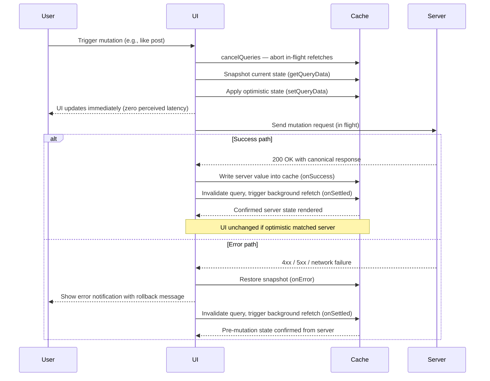

# Optimistic Updates

An optimistic update applies a mutation to the local state immediately, before the server confirms
the change. The UI reflects the expected result of the mutation — the like count increments, the
item is removed from the list, the comment appears — while the network request is in flight. If the
server confirms the mutation, the optimistic state becomes canonical. If the request fails, the local
state is rolled back to the pre-mutation value and the user is notified about the failure. The term
"optimistic" is deliberate: the client bets that the mutation will succeed and acts on that assumption
immediately, accepting the possibility of being wrong.

The tradeoff is explicit: optimistic updates make the UI feel faster and more responsive, especially
on high-latency connections, but they introduce the possibility of transient inconsistency between
local and server state. The rollback path — what happens when the server rejects the mutation — must
be designed, communicated to users through a toast notification or inline error message, and tested
as thoroughly as the success path. The rollback is not an edge case; it is a first-class interaction
that users will encounter in production, and how it behaves determines whether the feature feels
trustworthy or broken.

TanStack Query, SWR, and Apollo Client each provide first-class optimistic update APIs. The pattern
in all of them follows the same three-phase structure: (1) apply the optimistic state before the
mutation executes, (2) execute the mutation against the server, (3) on success — the server may
return the canonical value, which replaces the optimistic state; on error — roll back the optimistic
state and display a user-visible error. Understanding the mechanics of this three-phase cycle is the
foundation for implementing optimistic updates correctly and avoiding the subtle bugs that arise when
any phase is skipped or implemented incompletely.

## Principle

Engineers SHOULD apply optimistic updates to mutations that are idempotent or easily reversible and
whose failure rate is low. Liking a post, reordering a list, updating a preference setting, or
archiving an item are canonical candidates: the mutation has a predictable and bounded outcome,
rollback is a straightforward state restoration, and failures are rare enough that the rollback path
is an infrequent edge case rather than a routine user flow. The key indicators for suitability are:
the mutation is unlikely to fail for application-level reasons (as opposed to network failures, which
affect all mutations equally), the optimistic assumption about the result is reliable, and the cost
of a brief inconsistency before rollback is low.

Mutations with unpredictable outcomes MUST NOT be optimistically updated. Payments, inventory
reservations, file uploads, and permission changes carry failure rates too high for optimistic
confirmation, rollback paths too confusing to implement cleanly, and consequence severity too
significant to risk displaying a false positive to the user. Engineers MUST implement rollback logic
for every optimistic update and display a visible error notification when rollback occurs. A silent
rollback — where the UI snaps back to the previous state without explanation — appears as a bug to
users and destroys confidence in the feature. The rollback notification must explain what happened
and, where applicable, offer a recovery path such as a retry button or a link to a help page.

## Design Thinking

### Optimistic vs. Loading States

The loading state model and the optimistic state model represent two distinct philosophies for
handling the latency gap between user intent and server confirmation.

**Loading state model:**

- The UI disables inputs and shows a spinner or skeleton screen.
- No change is reflected in the UI until the server responds.
- Every pixel the user sees represents confirmed server state.
- Cost: latency. Every mutation inserts a mandatory pause. On a 300ms connection, a like, an
  archive, and a reorder each cost 300ms of waiting. When users perform these actions in rapid
  succession, the pauses compound and the interface feels sluggish.

**Optimistic state model:**

- The UI applies the expected change immediately upon the user's action.
- Interaction continues without waiting for the server.
- The network request is treated as a background operation.
- Cost: complexity. The application must cancel competing queries, snapshot the prior state for
  rollback, and handle both success and error paths with visible feedback.

The practical heuristic for choosing between these models combines failure probability with
consequence severity:

| Mutation type | Failure rate | Rollback cost | Recommended model |
|---|---|---|---|
| Like, react, favorite | Very low | Trivial (decrement, toast) | Optimistic |
| Archive, reorder, tag | Low | Simple (restore position/status) | Optimistic |
| Settings update | Low | Simple (restore prior value) | Optimistic |
| File upload | Medium | Moderate (remove from list) | Loading |
| Payment, checkout | Variable | High (trust damage) | Loading |
| Permission change | Low | High (security implication) | Loading |

When in doubt, default to loading states for mutations that touch financial data, irreversible
resources, or inventory. Use optimistic updates for social reactions, preference toggles, and list
reordering where the failure rate is negligible and rollback is pain-free.

### TanStack Query onMutate / onError / onSettled

TanStack Query exposes three lifecycle callbacks that map precisely onto the three phases of an
optimistic update.

**Phase 1 — onMutate (before the request):**

The `onMutate` callback fires before the mutation function executes. Inside `onMutate`, three
operations must happen in sequence:

1. Call `await queryClient.cancelQueries` for the affected query key. This aborts any in-flight
   background refetches that might otherwise resolve after the optimistic write and overwrite it
   with stale server data, producing a confusing revert the user did not initiate.
2. Call `queryClient.getQueryData` to read the current cache value and store it as a snapshot.
   This snapshot is the rollback target if the mutation fails.
3. Call `queryClient.setQueryData` to write the optimistic value into the cache. This is what
   the user sees immediately.

Return the snapshot from `onMutate` as a context object — TanStack Query passes it to subsequent
callbacks as the `context` parameter.

**Phase 2 — onError (on failure):**

The `onError` callback fires when the mutation function throws or returns a rejected promise. It
receives the error, the original mutation variables, and the `context` returned by `onMutate`.
Rollback is two operations: restore the snapshot using `queryClient.setQueryData(key, context.previous)`,
and call the notification function to show the error. Because the snapshot predates the optimistic
write, restoring it always produces a consistent known-good state.

**Phase 3 — onSettled (always, after resolution):**

The `onSettled` callback fires after the mutation resolves, regardless of success or failure. Call
`queryClient.invalidateQueries` here to trigger a background refetch. The refetch is not redundant
even on success: the server's response may differ from the optimistic assumption — a server-assigned
timestamp, a computed aggregate, a value modified by a trigger. Invalidating after every mutation
guarantees convergence to the server's canonical state. Running `onSettled` in all outcomes
consolidates the consistency guarantee into one place.

### Conflict Resolution

In collaborative applications where multiple clients mutate the same resource concurrently,
optimistic updates introduce conflict scenarios that require deliberate handling.

Consider two users viewing the same document: User A applies an optimistic update locally and sends
a mutation. Simultaneously, User B does the same. The server receives both requests in sequence;
the second write may partially override the first — last-write-wins semantics, CRDT merge, or a
409 conflict rejection. Each client then receives the server's canonical response to its own
mutation, which may diverge from the optimistic state it applied locally.

The correct resolution strategy:

- Always replace the optimistic state with the server's authoritative response on success.
- Never preserve or merge the optimistic assumption when the server returns a different value.
- In `onSuccess`, write the server-returned data into the cache using `queryClient.setQueryData`
  before `onSettled` triggers a full invalidation. This two-step flow minimizes the window during
  which the UI shows stale data while ensuring eventual convergence.

For real-time collaboration with sub-second latency requirements, pair optimistic updates with a
WebSocket or Server-Sent Events channel. Optimistic updates handle the latency of the current
user's own action. The real-time channel delivers other users' confirmed changes as they arrive,
handling concurrent convergence separately.

### Unique IDs for Optimistically Added Items

Optimistically adding a new item to a list creates a structural problem that update mutations do
not have: the new item has no server-assigned ID at the moment it must be rendered.

Without a stable key, React cannot correctly identify the item during reconciliation. When the
server response arrives with the permanent ID, React may render duplicates, place the item in the
wrong position, or produce visual flickering. These bugs are subtle — they appear only during the
window between the optimistic render and the server response — making them easy to miss in unit
tests but visible to users on typical network connections.

The solution is a temporary client-generated ID created inside `onMutate`:

1. Use `crypto.randomUUID()` (available in all modern browsers and Node.js 14.17+, no import
   required) or a library such as `nanoid` to generate an ID with sufficient entropy.
2. Construct the optimistic item with this temporary ID and add it to the list in the cache.
3. Include the temporary ID in the context returned from `onMutate`.
4. In `onSuccess`, replace the optimistic item with the server-returned item carrying the real ID.
5. In `onError`, remove the temporary item from the list entirely.

Constraints on the temporary ID:

- It must never be sent to the server as the item's identity — the server assigns the real ID.
- It must never be persisted to localStorage, a database, or any external store.
- It must remain valid only for the duration of the in-flight request.

## Best Practices

**MUST snapshot the current state before applying an optimistic update to enable rollback on
failure.** In TanStack Query, use `queryClient.getQueryData()` in `onMutate` and store the result,
then call `queryClient.setQueryData()` with the snapshot in `onError`. Without the snapshot,
rollback requires a full network refetch — which is slower, adds a round-trip of latency, and
leaves the user exposed to an inconsistent state for the entire duration of the refetch. The
snapshot must be taken after `await queryClient.cancelQueries`, because a concurrent background
refetch that resolves after the snapshot but before the optimistic write will be correctly blocked
by the cancellation.

**MUST display a user-visible error notification when an optimistic update is rolled back.** A
state that snaps back to its previous value without explanation appears as a malfunction. From the
user's perspective: they took a deliberate action, the UI appeared to confirm it, and then it
silently undid itself. This sequence destroys trust in the feature and causes users to repeatedly
re-attempt the action. The notification must appear immediately when the rollback occurs. It must
be specific: "Unable to like this post — please try again" is better than "Something went wrong."
Where the error is recoverable, pair the notification with a recovery affordance: a retry button
that re-invokes the mutation, or a message that explains why the action failed.

**SHOULD refetch the affected queries after any mutation resolves, regardless of success or
failure.** Optimistic state is an approximation of the server's response. Even on success, the
server may return a slightly different result — a server-assigned timestamp, a recomputed aggregate,
a field updated by a trigger, or a value affected by a concurrent write from another user. Use
`onSettled` to invalidate and refetch, ensuring the cache converges to the server's truth. The
refetch is transparent to the user when the optimistic state was accurate — the UI does not visibly
change, because the cache update matches the current render. The benefit is systematic eventual
consistency that eliminates an entire class of stale UI bugs without requiring manual reconciliation.

## Visual



## Example

TanStack Query optimistic update for a like button. The mutation cancels in-flight queries and
snapshots the current post data in `onMutate`, increments the like count and sets the `likedByMe`
flag optimistically, restores the snapshot and shows a toast in `onError`, and invalidates the post
query in `onSettled` to reconcile the cache with the server's canonical state.

```js
const mutation = useMutation({
  mutationFn: (postId) => api.likePost(postId),
  onMutate: async (postId) => {
    // Step 1: Cancel any in-flight refetches that would overwrite the optimistic update
    await queryClient.cancelQueries({ queryKey: ['post', postId] });

    // Step 2: Snapshot the current cache value for rollback
    const previous = queryClient.getQueryData(['post', postId]);

    // Step 3: Apply the optimistic update — user sees this immediately
    queryClient.setQueryData(['post', postId], (old) => ({
      ...old,
      likes: old.likes + 1,
      likedByMe: true,
    }));

    // Return snapshot in context so onError can use it
    return { previous };
  },
  onError: (_err, postId, context) => {
    // Roll back to the snapshot taken before the optimistic update
    queryClient.setQueryData(['post', postId], context.previous);

    // Notify the user that the action failed and the UI has been reverted
    toast.error('Failed to like post — please try again');
  },
  onSettled: (_data, _err, postId) => {
    // Always refetch after mutation to ensure cache reflects canonical server state
    queryClient.invalidateQueries({ queryKey: ['post', postId] });
  },
});
```

## Common Mistakes

- **Not calling `cancelQueries` before the optimistic write.** A common implementation error is
  applying the optimistic update to the cache without first canceling in-flight queries for the
  same key. If a background refetch resolves after the optimistic write, TanStack Query's default
  behavior merges the stale server response into the cache, overwriting the optimistic value with
  pre-mutation data and producing a visible double-update flicker. Always `await
  queryClient.cancelQueries` as the first operation in `onMutate` — the `await` is non-negotiable
  because the underlying cancellation is asynchronous, and skipping it leaves a race condition open
  even if `cancelQueries` is called.

- **Silent rollback without user feedback.** Restoring the snapshot in `onError` is only half of
  the requirement. An `onError` handler that calls `queryClient.setQueryData` and nothing else
  produces a UI that silently snaps back to its previous state. From the user's perspective they
  took a deliberate action, the UI appeared to confirm it, and then it undid itself without
  explanation — a sequence that reads as a bug, erodes trust, and causes repeated retry attempts.
  Every `onError` handler for an optimistic update must display a notification that names what
  happened and gives the user a path forward; "Unable to update — please try again" is the minimum
  viable message, and specific messages paired with a retry affordance are strongly preferred.

- **Applying optimistic updates to high-risk mutations.** The like button and the payment button
  are not the same kind of mutation even though both trigger a POST request. Optimistic
  confirmation is appropriate when the failure rate is near-zero and rollback is painless; it is
  harmful when applied to payments, inventory reservations, or permission changes where failure
  rates are high and a false-positive confirmation — showing "Payment successful" before the server
  responds — forces users to re-evaluate whether their money was charged, damages trust, and may
  require support intervention. For high-stakes or frequently-failing mutations, use loading states
  with clear progress indicators; optimistic updates are a precision tool for high-confidence,
  easily-reversible interactions, not a universal latency-reduction technique.

## Related FEEs

- [FEE-600](./600.md) State Management Overview — the taxonomy that classifies state categories,
  including transient optimistic state and when it belongs in the state model
- [FEE-604](./604.md) Server State & Data Synchronization — TanStack Query, SWR, cache
  invalidation, and the stale-while-revalidate pattern that optimistic updates build on
- [FEE-305](../Error Handling/305.md) Error Handling Patterns — strategies for surfacing,
  classifying, and recovering from errors that trigger rollbacks, including toast notification
  patterns

## References

- [TanStack Query: Optimistic Updates](https://tanstack.com/query/latest/docs/framework/react/guides/optimistic-updates)
  — the official guide covering `onMutate`, `onError`, and `onSettled` with complete working
  examples for both update and insert mutations
- [SWR: Optimistic Updates](https://swr.vercel.app/docs/mutation#optimistic-updates) — SWR's
  `optimisticData` and `rollbackOnError` options, which provide the same three-phase pattern
  through a more declarative API
- [Apollo Client: Optimistic UI](https://www.apollographql.com/docs/react/performance/optimistic-ui/)
  — Apollo's `optimisticResponse` field and how it integrates with the normalized InMemoryCache
  for GraphQL mutations
