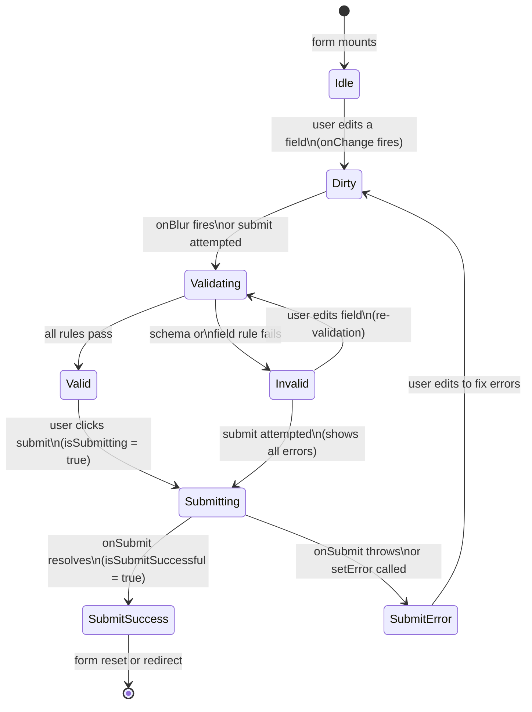

# Form State Management

Forms represent a distinct category of UI state. Unlike server data or application routing state,
form state is inherently local, transient, and structured: a form has fields with values, each field
has touched/untouched status, the form has valid/invalid status, and submission triggers an async
side effect. Managing this state with generic `useState` is possible but verbose; specialized form
libraries exist because the patterns required — field registration, validation, dirty tracking,
submission state — recur identically across every form.

React Hook Form, Formik, and TanStack Form are the dominant libraries. React Hook Form uses
uncontrolled inputs (ref-based) to avoid re-renders on every keystroke; Formik uses controlled
inputs with a context provider; TanStack Form is framework-agnostic with a more explicit API. The
performance difference between the approaches is measurable on large forms with many fields, and
the choice of library has downstream consequences for how validation, error display, and submission
state are wired together.

The decision to use a form library is not primarily about state complexity — `useState` for two
fields is not burdensome — but about validation, submission handling, and error display. A form
without a library requires manual orchestration of validation logic, async submission state, error
message display, and field-level touched tracking. A library provides a consistent, tested API for
all of this. The cumulative savings across a product with dozens of forms are significant: uniform
error display, predictable submission lifecycle, and reduced surface area for subtle bugs in
validation timing and field interaction tracking.

## Design Thinking

### Controlled vs. Uncontrolled Inputs in Forms

React gives engineers two models for owning input state. In the controlled model, React owns the
value via a state variable; every keystroke updates state, triggers a re-render, and the input
always reflects the React value. In the uncontrolled model, the DOM owns the value via a ref; React
reads the value only when needed (typically on submit or on blur) and does not re-render on every
keystroke.

React Hook Form's uncontrolled approach scales better to large forms with many fields. A form with
twenty inputs using controlled state produces twenty state updates and twenty re-renders per
keystroke — a measurable performance cost on low-end devices. React Hook Form's ref-based
registration (`register()`) avoids this by reading values directly from the DOM on demand. The
tradeoff is that controlled inputs are easier to integrate with components that require a value prop
(such as custom design system inputs), which is why React Hook Form provides a `Controller` wrapper
for these cases. The architectural decision is not binary; most real-world form implementations mix
uncontrolled fields via `register` and controlled fields via `Controller` for third-party components.

### Validation Strategies

Validation can fire on three events: `onChange` (every keystroke), `onBlur` (when the user leaves
a field), or `onSubmit` (when the user submits the form). Each strategy has distinct UX
implications. `onChange` validation provides the fastest feedback but can produce error messages
before the user has finished typing — showing "Invalid email" when the user has typed only "jo"
feels intrusive. `onBlur` validation is the standard recommendation: errors appear when the user
leaves a field and has had a complete opportunity to fill it in. `onSubmit` validation is the most
conservative — errors appear only after the user attempts to submit — and is appropriate for short
forms where inline errors are not necessary.

Schema-based validation with `zod`, `yup`, or `valibot` defines all validation rules in one
declarative object rather than per-field rule objects scattered across the form. React Hook Form
integrates schema validation through a `resolver` option — `zodResolver(schema)` from
`@hookform/resolvers/zod` — that runs the entire schema against the form values and maps validation
errors back to field names automatically. The schema can be exported and reused on the backend,
eliminating rule duplication and ensuring that client and server enforce identical constraints.

### Field State: Touched, Dirty, Error

Form libraries track three orthogonal states per field: `touched`, `dirty`, and `error`. These
states are distinct and must not be conflated. `touched` records whether the user has visited the
field — moved focus into it and then out again — regardless of whether they changed the value.
`dirty` records whether the value differs from the initial value. `error` holds the current
validation error message, if any.

The distinction between `touched` and `dirty` matters for error display timing. An empty required
field has an error immediately in schema terms, but displaying "This field is required" on an
untouched field confuses users who have not yet had a chance to fill it in. The correct pattern
uses `touched` as a gate: show the error only if `touched` is true (the user has visited the
field) or if the form has been submitted. React Hook Form's `mode: 'onBlur'` applies this gating
automatically; in `mode: 'onChange'`, the engineer is responsible for checking `touchedFields`
before rendering error messages.

### Server-Side Errors

Server responses frequently carry field-level validation errors that client-side schema validation
cannot produce: email address already in use, username taken, a value that fails a uniqueness
constraint in the database. These errors must be populated back into the form's field error state,
not displayed as a separate generic error banner that bypasses the form library's error display
mechanism.

In React Hook Form, `setError('fieldName', { type: 'server', message: 'Email already in use' })`
populates the field's error state after submission. The type value `'server'` distinguishes these
errors from schema validation errors, which is useful for clearing behavior — schema errors clear
on the next validation pass, while server errors with `shouldFocus: true` can also move focus to
the offending field. The submit handler should be wrapped in a try/catch that maps the API error
response structure to individual `setError` calls, maintaining a consistent error display
regardless of whether the error originated on the client or the server.

### Submission State and Reset

The submission lifecycle has three observable states that the form library tracks: `isSubmitting`
(the async handler is running), `isSubmitted` (the handler has completed at least once), and
`isSubmitSuccessful` (the handler completed without throwing). These flags drive distinct UI
behaviors. `isSubmitting` disables the submit button. `isSubmitted` gates the display of
server-side errors — showing a server error before the user has attempted to submit is confusing
and should be avoided. `isSubmitSuccessful` can trigger a success message or redirect.

After a successful submission, `reset()` returns all fields to their default values and clears all
form state — `dirty`, `touched`, `errors`, and the submission flags — returning the form to its
initial state. This is the correct behavior after a successful multi-step operation where the form
is reused, such as a comments form that stays mounted after each comment is posted. When the form
should unmount after success (a login form that redirects to the dashboard), the reset is
unnecessary; React's unmounting clears the form state automatically.

## Best Practices

**SHOULD use `zod` or a comparable schema library as the validation resolver for form libraries.**
Schema-based validation defines all validation rules in one place, produces consistent error
messages, and can be reused for API-side validation. Defining validation rules as a schema enables
sharing the same schema between the React Hook Form resolver and the backend route handler,
eliminating duplication. Per-field rule objects embedded directly in `register` calls scatter
validation logic across the component, making it difficult to audit, reuse, or keep in sync with
backend validation.

**MUST display field-level validation errors only after the user has interacted with the field
(touched) or attempted to submit.** Showing "This field is required" on a fresh, untouched form
confuses users who have not yet had a chance to fill it out. The correct pattern is to surface
errors on blur (when the user leaves a field) or on submit (when the user submits and has not
filled in required fields). Most form libraries implement this with `mode: 'onBlur'` or
`mode: 'onTouched'`. Engineers MUST render validation error messages only for fields that the user
has touched or that failed validation on submit. A freshly loaded form MUST show no errors until
the user interacts with it.

**SHOULD disable the submit button while a form submission is in progress and re-enable it after
the submission resolves.** Double-submission — sending the same form data twice — is a common
source of duplicate records, duplicate transactions, and inconsistent server state. Disabling the
button during submission prevents this class of bug without requiring server-side idempotency keys.
The `isSubmitting` boolean from React Hook Form's `formState` is true during the async `onSubmit`
handler and false after it resolves or rejects, making it the correct value to bind to the
button's `disabled` attribute. The loading state also provides feedback that the submission is
being processed, reducing the chance that users click the button again because they believe nothing
happened.

**SHOULD use a form library for any form with three or more fields, validation requirements, or
async submission.** The validation and submission lifecycle — required fields, format validation,
server-side errors, loading states, and re-validation on input — has enough complexity to benefit
from a library's tested, consistent handling. Manual reimplementation across many forms introduces
divergence and bugs as the product grows.

**MUST validate form input on both client and server.** Client-side validation provides immediate
feedback to users but does not prevent malicious or malformed submissions that bypass the frontend.
Every API endpoint that accepts form input must apply the same validation rules independently of
the client.

**MUST NOT rely solely on client-side form validation for security-relevant input.** Validation
that runs only in the browser can be bypassed by any HTTP client. Authorization checks, rate
limits, and data integrity constraints must be enforced at the API layer, regardless of what
client-side validation communicates to the user.

## Visual



## Example

React Hook Form with a Zod resolver. The `schema` defines email and password rules in one place.
`handleSubmit` wraps the async `onSubmit` and sets `isSubmitting` to true for the duration.
`register` connects inputs to the form without controlled state. Errors render only for fields that
fail validation, and the submit button is disabled while the submission is in progress.

```jsx
import { useForm } from 'react-hook-form';
import { zodResolver } from '@hookform/resolvers/zod';
import { z } from 'zod';

const schema = z.object({
  email: z.string().email('Enter a valid email address'),
  password: z.string().min(8, 'Password must be at least 8 characters'),
});

function LoginForm({ onSubmit }) {
  const {
    register,
    handleSubmit,
    setError,
    formState: { errors, isSubmitting },
  } = useForm({
    resolver: zodResolver(schema),
    mode: 'onBlur',
  });

  async function handleLogin(data) {
    try {
      await onSubmit(data);
    } catch (err) {
      // Map server-side errors back to individual form fields
      if (err.field === 'email') {
        setError('email', { type: 'server', message: err.message });
      }
    }
  }

  return (
    <form onSubmit={handleSubmit(handleLogin)}>
      <label htmlFor="email">Email</label>
      <input
        id="email"
        type="email"
        {...register('email')}
        aria-invalid={!!errors.email}
        aria-describedby={errors.email ? 'email-error' : undefined}
      />
      {errors.email && (
        <span id="email-error" role="alert">
          {errors.email.message}
        </span>
      )}

      <label htmlFor="password">Password</label>
      <input
        id="password"
        type="password"
        {...register('password')}
        aria-invalid={!!errors.password}
        aria-describedby={errors.password ? 'password-error' : undefined}
      />
      {errors.password && (
        <span id="password-error" role="alert">
          {errors.password.message}
        </span>
      )}

      <button type="submit" disabled={isSubmitting}>
        {isSubmitting ? 'Logging in…' : 'Login'}
      </button>
    </form>
  );
}
```

## Common Mistakes

- **Showing all errors immediately on mount.** Rendering error messages for every required field
  the moment the form mounts — before the user has interacted with anything — is a common mistake
  when validation is triggered without checking `touchedFields` or `isSubmitted`. This makes the
  form feel adversarial. The fix is `mode: 'onBlur'` in React Hook Form, which gates error display
  to fields the user has visited.

- **Bypassing the form library to display server errors.** Setting a component-level error state
  variable from the API response and rendering it outside the form library's error display
  mechanism creates two separate error systems in the same form. Server-returned field errors
  should flow through `setError` so that they appear in the same place, with the same styling, as
  client-side validation errors.

- **Not disabling the submit button during submission.** Relying on the user not to double-click is
  not a sufficient strategy. Without `disabled={isSubmitting}`, rapid double-submission sends two
  identical requests. This produces duplicate records, duplicate charges, or a race condition
  between two concurrent submissions. The `isSubmitting` flag from `formState` costs nothing to
  bind and eliminates the entire class of double-submission bugs.

- **Duplicating validation rules between client and server.** Writing the same validation rules
  twice — once as per-field rule objects in the form and again as manual checks in the API handler
  — means they drift apart over time. The correct approach is a single Zod schema shared between
  the frontend resolver and the backend. When a validation rule changes, it changes in one place.

## Related FEEs

- [FEE-600](./600.md) State Management Overview — the taxonomy that classifies state categories,
  placing form state within the local, transient state quadrant
- [FEE-103](../HTML and Semantic Markup/103.md) Forms & Validation — HTML form semantics,
  accessible labeling, and native browser validation attributes that complement library-based
  validation
- [FEE-601](./601.md) Local Component State — the baseline `useState` approach that form libraries
  build on and supersede for complex validation and submission lifecycle management
- [FEE-1708](../Runtime Validation and Schema Libraries/1708.md) Runtime Validation & Schema
  Libraries — Zod, Yup, and Valibot in depth; how schema inference generates TypeScript types;
  reuse patterns for sharing schemas between client and server

## References

- [React Hook Form](https://react-hook-form.com) — official documentation covering `register`,
  `Controller`, `useForm` options, `formState`, `setError`, and the full resolver API
- [TanStack Form](https://tanstack.com/form/latest) — framework-agnostic form library with
  explicit field registration, type-safe validators, and async validation support
- [@hookform/resolvers (Zod)](https://github.com/react-hook-form/resolvers) — the adapter package
  connecting Zod, Yup, Valibot, and other schema libraries to React Hook Form's resolver interface
