# Undo/Redo Patterns

Undo and redo are expected features in any application where users make a series of edits: text
editors, drawing tools, form builders, data grids. The underlying mechanism is a history stack:
each user action is recorded as a reversible operation, and undo/redo move a cursor through that
stack. The challenge is deciding what to record — the full state at each point (snapshot model) or
the delta between states (command model) — and how to limit history size.

The snapshot model stores a copy of the complete state before each action. Undo restores the
previous snapshot; redo restores the next. Snapshots are simple to implement and easy to reason
about, but memory usage scales with state size times history depth. For small state trees this is
negligible; for large documents or canvases, snapshot storage is prohibitive.

The command model stores a description of the action — `{ type: 'MOVE', id: '1', from: {x:0,y:0},
to: {x:10,y:0} }` — with both a `do` and `undo` implementation. Undo calls the `undo` function;
redo calls the `do` function again. The command model is more complex to implement but uses constant
memory per command regardless of state size. Modern state libraries such as Immer blur the boundary
between these two models by providing patch generation that yields command-level efficiency on top
of snapshot-style state management.

## Principle

Engineers SHOULD use the snapshot model for undo/redo when the application state is small (under a
few kilobytes per snapshot) and immutable state management is already in use. Immutable state
managed by Immer or a Redux-style reducer produces structural sharing: consecutive snapshots share
unchanged subtrees, so memory usage is much lower than it appears. `immer`'s `produceWithPatches`
function generates both the next state and the patches required to invert the change — the best of
both models.

Engineers MUST limit the undo history to a bounded depth — typically 50–200 steps — to prevent
unbounded memory growth in long editing sessions. A history with no depth limit will consume memory
proportional to session length. The typical user expectation for undo depth in productivity
software is 20–100 steps; providing more than 200 steps has diminishing returns and growing memory
cost.

## Design Thinking

### History Stack Data Structure

The canonical history stack consists of two arrays: a `past` stack and a `future` stack, plus the
current `present` state. An undo operation pops the top entry from `past`, pushes the current
`present` onto `future`, and sets `present` to the popped value. A redo operation pops the top
entry from `future`, pushes the current `present` onto `past`, and sets `present` to the popped
value. When a new action arrives — not an undo or redo — the current `present` is pushed onto
`past`, the new value becomes `present`, and `future` is cleared entirely, because a new edit
invalidates all previously undone states.

This two-stack model is efficient for both undo and redo: both operations are O(1) array
manipulations. The `future` stack being cleared on any new user action is the canonical behavior —
it mirrors the expectation that once you edit after undoing, the undone branch is gone. Some
specialized editors (those supporting non-linear undo) preserve the future tree rather than
clearing it, but that is a significant added complexity well outside the standard model.

The `present` value stored in the history state should be exactly the value that the underlying
reducer operates on — the domain state, not the combined `{ past, present, future }` wrapper. This
separation keeps the delegate reducer unaware of history concerns; it only receives and produces
domain state. The history wrapper is a pure infrastructure concern layered on top. This boundary
is important when serializing state for persistence: only the domain state (the `present`) needs to
be persisted, not the past and future stacks, unless the application explicitly wants to preserve
undo history across page refreshes.

### Immer produceWithPatches

Immer's `produceWithPatches(state, recipe)` returns a tuple of three values: `[nextState, patches,
inversePatches]`. The `patches` array describes forward changes; the `inversePatches` array
describes exactly how to reverse them. Storing only the `inversePatches` for each history entry
yields a command-model-style implementation built on top of Immer's familiar mutable-style API.

To undo, apply the stored `inversePatches` to the current state using `applyPatches(state,
inversePatches)`. To redo, apply the stored `patches`. The patch representation is compact: a move
of a single property in a large object produces a patch that names only the changed path and its
new value, rather than a full snapshot of the entire object. For state trees that are large in
total but where individual edits affect only a small portion, `produceWithPatches` gives the
efficiency of the command model with the simplicity of Immer's recipe API.

### What to Make Undoable

Not every state change belongs in the undo history. The undo history SHOULD track document and
data changes — the content the user is working on. It SHOULD NOT track navigation state (which
route the user is on), transient UI state (whether a sidebar is expanded, which tab is active), or
cursor or selection position when the position is not a deliberate edit action. Including these in
the undo history violates user expectation: pressing Ctrl+Z and having the app close a sidebar
panel rather than undo a text insertion is surprising and disorienting.

A practical guideline is to ask whether the user would consider the change part of their document
or workflow artifact. Moving an element on a canvas: yes. Scrolling to a different position: no.
Renaming a layer: yes. Toggling a tool palette: no. The undo boundary coincides with the boundary
of the artifact the user owns.

In Redux-style architectures, the simplest way to enforce this boundary is to filter at the
reducer level: only actions with a specific marker (for example, `meta.undoable: true`) are
intercepted by the history wrapper, and all other actions pass through to the domain reducer
without touching the past/future stacks. Action creators for undoable operations include the
marker; action creators for UI-only changes omit it. This explicit opt-in model is safer than an
opt-out model (blacklisting specific action types), because a new action creator that is not
explicitly opted in will simply not be recorded — a safe default.

### Collaborative Editing and Conflict

Undo in collaborative documents — where multiple users edit simultaneously, as in Google Docs or
Figma — requires accounting for concurrent edits by other users. A user undoing their own action
must not revert edits that a collaborator made after that action. This is a substantially harder
problem than single-user undo: it requires Operational Transformation (OT) or CRDT-based undo
semantics, where an undo operation is rebased over intervening remote changes before being applied.

This collaborative undo problem is out of scope for most application-level undo/redo
implementations, which assume a single user session. Engineers building collaborative features
should be aware that the two-stack model is not sufficient in a multi-writer context, and that
solving it correctly requires either an OT/CRDT library with built-in undo support or a custom
rebasing mechanism. Setting this expectation early prevents the common mistake of designing
single-user undo and then discovering it breaks in collaborative mode.

### Persistence and Serialization of History

Some applications want undo history to survive a page refresh — a user closing and reopening a
drawing should be able to undo the last ten strokes from the previous session. Persisting history
introduces serialization requirements: the past and future stacks must be JSON-serializable, which
excludes storing function references (as in the command model's `do`/`undo` approach) unless those
functions are reconstructed from a serializable command descriptor on load.

The snapshot model (storing plain state objects) is naturally serializable. The patch model
(storing Immer patches, which are plain objects) is also naturally serializable. The function-based
command model is not directly serializable — to persist it, the command must be split into a
serializable descriptor and a runtime executor registry that maps descriptors back to functions.
For applications that need persistent undo, the patch-based approach is the most straightforward
path: serialize the past stack of inverse-patch arrays to localStorage or IndexedDB, and rehydrate
it on load without additional registry machinery.

## Best Practices

**MUST cap the undo history stack at a configurable maximum depth and evict the oldest entry when
the cap is reached.** Without a cap, a document editor with thousands of edits accumulates
thousands of snapshots or commands in memory. The cap MUST be configurable per application type:
20 steps may be sufficient for a settings form; 200 steps is appropriate for a document or canvas
editor. When the cap is reached, the oldest `past` entry is removed from the front of the past
array before the new present is pushed. Engineers MUST express the depth limit as a named constant
or configuration option rather than a magic number embedded in the reducer, so that the cap is
visible, documented, and adjustable without hunting through implementation code.

**SHOULD use `immer`'s `produceWithPatches` to implement undo/redo when the application already
uses Immer for state management.** `produceWithPatches` generates inverse patches automatically;
storing inverse patches instead of full snapshots reduces memory usage to the size of the change,
not the size of the full state. This is the efficient, low-code path to undo/redo for Immer-based
state. The resulting implementation requires no manual `do`/`undo` function pairs: the patch
format is declarative and invertible, and `applyPatches` handles both directions. For applications
that also need to persist undo history, inverse patches are plain JSON-serializable objects and can
be stored in localStorage or IndexedDB without additional serialization work.

**SHOULD merge consecutive rapid edits (e.g., individual keystrokes) into a single undo step
using debouncing or explicit batch grouping.** Pressing Ctrl+Z while typing should undo the last
word or sentence, not the last character. Batch grouping — collecting edits within a time window
into one history entry — matches user expectation and keeps the history stack manageable.
Debouncing works by delaying the history commit until no new edit has arrived within a threshold
(commonly 300–500ms for typing). Explicit batch grouping works by accumulating mutations between a
`beginBatch` and `endBatch` call and committing them as a single command.

**SHOULD expose the undo and redo availability as derived boolean values — `canUndo` and `canRedo`
— and bind them to the disabled state of the corresponding UI controls.** An Undo menu item or
toolbar button that is always enabled but sometimes does nothing is a usability defect: it gives
users no feedback about whether the action is available. `canUndo` is `past.length > 0`; `canRedo`
is `future.length > 0`. These values are cheap to derive from the history state and should be
surfaced to the UI layer so that undo and redo controls accurately reflect the current history
state at all times.

## Visual

```mermaid
stateDiagram-v2
    direction LR

    state "past: [s0, s1, s2]" as Past
    state "present: s3 (current)" as Present
    state "future: [s4, s5]" as Future

    Past --> Present : redo pops s3 back\nfrom future
    Present --> Future : undo pushes s3\nto future; s2 becomes present
    Future --> Present : redo pops s4;\ns3 pushed to past
    Present --> Past : new action pushes s3\nto past; future cleared
```



## Example

Snapshot-based undo/redo with bounded history implemented as a higher-order reducer. The
`withHistory` wrapper intercepts `UNDO` and `REDO` actions and manages the past/future stacks
around the delegate reducer. The `MAX_HISTORY` constant caps the past stack so memory is bounded.
Any action the delegate reducer handles clears the future stack, implementing the standard
branching behavior.

```js
const MAX_HISTORY = 100;

function withHistory(reducer) {
  const initialPresent = reducer(undefined, {});
  const initialState = { past: [], present: initialPresent, future: [] };

  return function historyReducer(state = initialState, action) {
    if (action.type === 'UNDO') {
      if (!state.past.length) return state;
      const past = [...state.past];
      const previous = past.pop();
      return {
        past,
        present: previous,
        future: [state.present, ...state.future],
      };
    }

    if (action.type === 'REDO') {
      if (!state.future.length) return state;
      const [next, ...future] = state.future;
      return {
        past: [...state.past, state.present].slice(-MAX_HISTORY),
        present: next,
        future,
      };
    }

    const present = reducer(state.present, action);
    if (present === state.present) return state;     // no change — skip history entry
    return {
      past: [...state.past, state.present].slice(-MAX_HISTORY),
      present,
      future: [],                                    // new edit invalidates redo branch
    };
  };
}
```

## Common Mistakes

- **Unbounded history depth.** Omitting a cap on the past stack is the single most common
  performance mistake in undo/redo implementations. In a document editor with hours of use, the
  past array grows without limit, and each entry holds either a full snapshot or a patch. Setting
  `MAX_HISTORY` is a one-line change that prevents a class of unbounded memory leaks.

- **Including UI state in the undo history.** Pushing sidebar-open, selected-tab, or scroll
  position into the past stack causes Ctrl+Z to restore UI configuration rather than document
  content. Users expect undo to affect the artifact they are editing. UI-only state should be
  stored separately and excluded from the history reducer.

- **Not clearing the future stack on new actions.** Forgetting to set `future: []` when a new
  (non-undo, non-redo) action is dispatched allows stale future entries to persist. The next redo
  then restores a state that pre-dates the new action, creating inconsistency between the redo
  stack and the current document.

- **Recording every keystroke as a separate undo step.** Without debouncing or batch grouping, the
  undo history fills with individual character insertions. The user must press Ctrl+Z dozens of
  times to undo a single word. Debouncing history commits to a 300–500ms window after the last
  keystroke, or using explicit batch grouping around composition events, resolves this.

- **Applying inverse patches to a stale base state.** When using `produceWithPatches`, the inverse
  patches must be applied to the state that was current when the patch was produced. Applying
  patches out of order, or to the wrong base, produces corrupted state silently. The two-stack
  model enforces correct ordering — always apply the top-of-past inverse patch to the current
  present — which is why deviating from the standard structure is risky.

- **Not disabling undo/redo controls when the stacks are empty.** Leaving an Undo button enabled
  when `past.length === 0` gives users no feedback that there is nothing to undo. Derive `canUndo`
  and `canRedo` from the history state and bind them to the disabled attribute of the controls.
  This is a one-line derived value that prevents a confusing, silent no-op UX.

- **Persisting the full history state instead of only the present.** When saving application state
  to a backend or localStorage, persisting the entire `{ past, present, future }` object wastes
  storage on undo stacks that the user typically does not expect to survive a full reload. The
  correct behavior for most applications is to persist only the `present` domain state and start
  with empty stacks on load. Only persist the history stacks when the product explicitly promises
  cross-session undo.

## Related FEEs

- [FEE-600](./600.md) — State Management Overview
- [FEE-601](./601.md) — Local Component State
- [FEE-605](./605.md) — State Machines & Finite Automata

## References

- [Immer: produceWithPatches](https://immerjs.github.io/immer/patches) — official documentation
  for patch generation, inverse patches, and `applyPatches`; the primary reference for
  patch-based undo/redo with Immer
- [Redux docs: Implementing Undo History](https://redux.js.org/usage/implementing-undo-history) —
  the canonical Redux guide to the past/present/future stack pattern with a higher-order reducer;
  the structural model used in this article
- [Zundo — undo/redo for Zustand](https://github.com/charkour/zundo) — a production-grade undo
  middleware for Zustand stores, useful as a reference implementation and as a drop-in for
  Zustand-based applications
- [Undo/Redo in a Collaborative Application (Marijn Haverbeke)](https://marijnhaverbeke.nl/blog/collaborative-editing-cm.html) —
  detailed exposition of the collaborative undo problem in CodeMirror; useful background for
  understanding why single-user undo does not compose naively with collaborative editing
- [redux-undo](https://github.com/omnidan/redux-undo) — the original higher-order reducer library
  for Redux; the past/present/future pattern in this article is directly inspired by its API;
  source code is readable and instructive for understanding edge cases in the two-stack model
- [use-undoable (React hook)](https://github.com/nicholasgasior/use-undoable) — a lightweight
  React hook encapsulating the history stack; useful as a reference for hook-based undo without a
  global state manager
