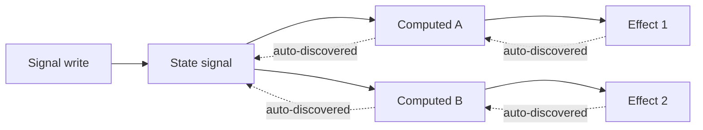

# [FEE-611] Framework Signals (Solid, Vue, Preact, Angular)

:::info
A signal is a reactive value container that notifies dependents when it changes, providing a foundation for declarative state propagation across modern UI frameworks. The same primitive shape has converged across Solid signals, Vue refs, Preact signals, and Angular signals: a value container with dependency tracking on read and effect triggering on mutation. Each implementation ships its own auto-tracking machinery, so signals from one framework are not runtime-interoperable with another. This article maps the shared mental model and the per-framework API surface a library author meets when targeting any of them.
:::

## Context

Solid established the modern signal API with `createSignal`, returning a getter/setter pair whose getter auto-subscribes the surrounding tracking scope. Vue's Composition API exposes the same primitive shape through `ref()`: the ref object is mutable, reads to `.value` are tracked, and writes trigger associated effects. Preact ships signals as a framework-agnostic core (`@preact/signals-core`) with bindings for Preact and React, exposing the value through a stable `.value` accessor. Angular shipped signals as a stable API in v17 and documents them as "a wrapper around a value that notifies interested consumers when that value changes." The Vue documentation makes the convergence explicit: "Fundamentally, signals are the same kind of reactivity primitive as Vue refs."

## Scenario

A library author building a state container for a shared design system needs to decide which reactive primitive to expose. The same component logic may run inside a Solid app, a Vue app, a Preact app, and an Angular app. Knowing which APIs share semantics — and where they diverge — determines whether a single core can back all four bindings or whether each framework needs its own adapter.

## Best Practices

- **MUST** treat each framework's signal as a non-portable runtime primitive. Each implementation has its own auto-tracking mechanism, and signals from one framework do not subscribe consumers in another, which is the explicit motivation for the TC39 standardization effort.
- **MUST NOT** rely on the order in which subscribed effects fire on a signal update in Solid. The Solid documentation states "the order can vary" and "the order of execution of effects is not guaranteed and should not be relied upon."
- **SHOULD** prefer signal writes over Zone.js-patched async APIs to drive change detection in Angular. The Angular zoneless guide lists "updating a signal that's read in a template" as a zoneless trigger, eliminating Zone.js patching of browser APIs.
- **SHOULD** keep signal identity stable across mutations when designing a Preact-style API. A Preact signal is "an object with a `.value` property…a signal's value can change, but the signal itself always stays the same," which lets consumers hold a reference to the container instead of re-reading from a parent on every change.
- **MAY** rely on framework auto-tracking instead of declaring dependency arrays for derived computations. Solid's `createEffect` documentation states "Solid automatically tracks the dependencies of an effect, so you do not need to manually specify them."

## Design Thinking

Signals trade the simplicity of pull-only re-rendering for a finer evaluation model. The TC39 proposal describes the strategy as push-pull: state mutation pushes invalidation through the dependency graph, and computed values are pulled lazily on read. The proposal calls out the glitch-free invariant as a guarantee the model preserves: consumers never observe inconsistent intermediate state. Solid's fine-grained reactivity guide names the pay-off in DOM terms: "in a fine-grained reactive system an application will now have the ability to make highly targeted and specific updates," and "in Solid, updates are made to the targeted attribute that needs to be changed." The trade is more bookkeeping at write time against less work at render time, since a virtual-DOM diff is replaced by direct attribute updates anchored to the changed signal.

## Deep Dive

Auto-tracking is the shared mechanism. The TC39 proposal records that "a computed Signal automatically discovers any other Signals that it is dependent on, whether those Signals be simple values or other computations," and Solid documents the same property for `createEffect`. Equality semantics differ across implementations and matter when a write reaches a memo or computed. Solid's `createMemo` "is optimized to execute only once for each change in their dependencies" and "will not trigger subsequent updates if its dependencies change but its value remains the same," which means downstream effects are skipped when the recomputed value matches the cached one. Vue 3.5 refactored its reactivity core, reducing reactivity memory by 56% and making tracking on deeply reactive arrays up to 10× faster in some cases, with no behavior changes. Angular's `computed()` is read-only derived, and `effect()` "creates a live connection. If a tracked signal changes, Angular will eventually re-run the consumer."

## Visual



The dotted edges represent auto-tracked subscriptions: each computed and effect discovers its dependencies during execution rather than declaring them up front, as recorded in the TC39 proposal.

## Example

Solid:

```js
import { createSignal } from "solid-js";
const [count, setCount] = createSignal(0);
console.log(count());        // 0
setCount(count() + 1);
```

Vue:

```js
import { ref } from "vue";
const count = ref(0);
console.log(count.value);    // 0
count.value++;
```

Preact:

```js
import { signal } from "@preact/signals-core";
const count = signal(0);
console.log(count.value);    // 0
count.value++;
```

Angular:

```ts
import { signal } from "@angular/core";
const count = signal(0);
console.log(count());        // 0
count.set(count() + 1);
```

Each snippet covers the read/write surface documented for its framework: Solid's getter/setter pair, Vue's `.value` accessor on a `ref`, Preact's `.value` on the signal object, and Angular's call-the-signal read with `set`/`update` writes.

## Cross-Framework API Comparison

| Aspect            | Solid                          | Vue                             | Preact                          | Angular                         |
| ----------------- | ------------------------------ | ------------------------------- | ------------------------------- | ------------------------------- |
| Read syntax       | `count()` (getter call)        | `count.value`                   | `count.value`                   | `count()` (signal call)         |
| Write syntax      | `setCount(next)` (setter)      | `count.value = next`            | `count.value = next`            | `count.set(next)` / `count.update(fn)` |
| Equality default  | Skips updates when memo value is unchanged | `ref` shallow / `reactive` deep | `.value` write triggers when assigned | `Object.is`-style: skips when unchanged |
| Computed primitive| `createMemo`                   | `computed`                      | `computed`                      | `computed`                      |
| Effect primitive  | `createEffect`                 | `watchEffect` / `watch`         | `effect`                        | `effect`                        |

The read and write rows are anchored in the Solid `createSignal` getter/setter contract, the Vue `ref` `.value` semantics, the Preact `.value` accessor on a stable signal object, and the Angular signals guide. The equality row reflects Solid memo skip-on-equal behavior and the documented reactivity behavior of each framework's container.

## Internal References

- FEE-612 — TC39 Signals proposal that standardizes the cross-framework primitive surveyed here.
- FEE-616 — React 19 form state, contrasting hook-cooperation with the signal model.
- FEE-614 — XState v5 actor model, contrasting orchestrated state machines with fine-grained signal graphs.

## References

- Solid, "Signals," docs.solidjs.com. https://docs.solidjs.com/concepts/signals
- Solid, "Effects," docs.solidjs.com. https://docs.solidjs.com/concepts/effects
- Solid, "Memos," docs.solidjs.com. https://docs.solidjs.com/concepts/derived-values/memos
- Solid, "Fine-Grained Reactivity," docs.solidjs.com. https://docs.solidjs.com/advanced-concepts/fine-grained-reactivity
- Preact, "Signals," preactjs.com. https://preactjs.com/guide/v10/signals/
- Angular, "Signals," angular.dev. https://angular.dev/guide/signals
- Angular, "Zoneless," angular.dev. https://angular.dev/guide/zoneless
- Vue, "Reactivity API: Core," vuejs.org. https://vuejs.org/api/reactivity-core.html
- Vue, "Reactivity in Depth," vuejs.org. https://vuejs.org/guide/extras/reactivity-in-depth.html
- Evan You, "Announcing Vue 3.5," blog.vuejs.org. https://blog.vuejs.org/posts/vue-3-5
- TC39, "Signals Proposal," github.com/tc39. https://github.com/tc39/proposal-signals
