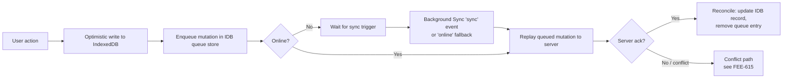

# [FEE-617] Offline-First State with IndexedDB (idb, Dexie)

:::info
IndexedDB is the browser's transactional, asynchronous, JavaScript object-oriented store designed for significant amounts of structured data with index-backed lookups. Wrappers such as `idb` (a ~1.19KB brotli'd promisifier) and Dexie (an ORM-like layer with versioned schemas and `liveQuery()`) close the usability gap of the raw API. To deliver an offline-first experience, mutations land first in IndexedDB and replay later through the Background Sync API or a Workbox queue, with `online`-event fallback paths for browsers where Background Sync is limited-availability. Persistent storage and quota estimation prevent the silent eviction that turns "offline-first" into "data lost". Conflict resolution between replayed mutations and server state is its own discipline, cross-linked to FEE-615.
:::

## Context

IndexedDB is a low-level browser API for client-side storage of significant amounts of structured data, including files and blobs, with indexes that enable high-performance searches (MDN: "IndexedDB is a low-level API for client-side storage of significant amounts of structured data, including files/blobs. This API uses indexes to enable high-performance searches of this data."). Architecturally it is a transactional database system, comparable to an SQL-based RDBMS in its transactional guarantees, while remaining a JavaScript-based object-oriented store keyed by structured-clonable values (MDN: "IndexedDB is a transactional database system, like an SQL-based Relational Database Management System (RDBMS). However, unlike SQL-based RDBMSes, which use fixed-column tables, IndexedDB is a JavaScript-based object-oriented database."). These two properties — transactional integrity and structured-clone keying — set the stage for the offline-first pattern: durable client-side mutations that survive reloads and reconnects without bespoke serialization.

## Scenario

A long-form writing app keeps losing user drafts when the network drops mid-save. The team initially used `localStorage`, which is synchronous, capped at a few megabytes per origin, and limited to string values, so larger documents and binary attachments do not fit. Moving to IndexedDB lets every keystroke commit through a transaction into an object store that can hold structured-clonable objects (including blobs), with index-backed lookups by document id and last-edited timestamp. The same store doubles as the queue for unsynced mutations that will replay once connectivity returns.

## Best Practices

- **MUST** wrap every read or write in a transaction: IndexedDB requires it, and a failed action rolls the database back to its pre-transaction state (web.dev: "All read or write operations in IndexedDB must be part of a transaction." "If one of the actions in a transaction fails, all of them are applied and the database returns to the state it was in before the transaction began.").
- **SHOULD** adopt a wrapper rather than driving raw `IDBRequest` callbacks. `idb` by Jake Archibald is a ~1.19KB brotli'd library that mostly mirrors the IndexedDB API and converts every `IDBRequest` into a promise (idb README: "This is a tiny (~1.19kB brotli'd) library that mostly mirrors the IndexedDB API, but with small improvements that make a big difference to usability." "Any method that usually returns an IDBRequest object will now return a promise for the result.").
- **MAY** reach for Dexie when the app needs versioned schema definition via `version().stores()`, indexed `where()` queries, transactions, hooks, and bulk operations in a single ORM-like surface (Dexie docs: "Dexie.js is a library that makes it super simple to use indexedDB - the standard client-side database in browsers.").
- **SHOULD** estimate available space before committing large blobs. `navigator.storage.estimate()` returns approximate `quota` and `usage` in bytes (MDN: "quota - A numeric value in bytes which provides a conservative approximation of the total storage the user's device or computer has available for the site origin or Web app." "usage - A numeric value in bytes approximating the amount of storage space currently being used.").
- **MUST**, for offline-first apps, request persistent storage via `navigator.storage.persist()`. When granted, the bucket is exempt from UA eviction under storage pressure (MDN: "The persist() method of the StorageManager interface requests permission to use persistent storage, and returns a Promise that resolves to true if permission is granted and bucket mode is persistent.").

## Design Thinking

The first calibration is `idb` versus Dexie. `idb` is a thin promise wrapper that mirrors the underlying API, so the mental model stays close to the spec and bundle cost stays at ~1.19KB brotli'd. Dexie trades that minimalism for an ORM-like layer with `version().stores()` migrations, `where()` queries, hooks, and bulk operations, plus `liveQuery()` reactivity. Apps with a handful of stores and bespoke access patterns lean toward `idb`; apps with evolving schemas and many indexed queries amortize Dexie's surface area.

The second calibration is the replay path. Workbox's `workbox-background-sync` Queue persists failed requests in IndexedDB and replays them on reconnect, including a fallback that retries every time the service worker starts up in browsers without native Background Sync. A custom replay queue keeps full control over payload shape, retry policy, and ordering at the cost of writing and maintaining that machinery. Teams already running a Workbox service worker amortize Workbox's queue; teams with non-HTTP mutations or non-trivial ordering requirements often own the queue themselves.

Conflict resolution between replayed mutations and concurrent server edits is a separate problem; for collaborative offline-first state, see FEE-615 on Yjs/Automerge CRDTs.

## Deep Dive

A transaction is only active during the task that created it and inside its requests' success/error handlers. Placing a request while inactive throws (MDN: "A transaction alternates between active and inactive states between event loop tasks. It's active in the task when it was created, and in each task of the requests' success or error event handlers. It's inactive in all other tasks, in which case placing requests will fail."). The practical consequence: an `await` on an unrelated promise between two store operations on the same transaction breaks it, because the transaction will auto-commit when no further requests are pending and there are no other outstanding requests (MDN: "If no new requests are placed when the transaction is active, and there are no other outstanding requests, the transaction will automatically commit."). Wrapper authors handle this by chaining IndexedDB requests within the same microtask; application code must avoid awaiting fetches or timers between two operations inside one transaction.

Schema migrations run inside the `upgradeneeded` event when the requested version exceeds the stored version, and the `versionchange` event is fired when a database structure change is requested elsewhere, for example by another tab opening a higher version (MDN: "The versionchange event is fired when a database structure change (upgradeneeded event send on an IDBOpenDBRequest or IDBFactory.deleteDatabase) was requested elsewhere"). Migration code runs once per version bump, which means every schema change must be expressed as an idempotent upgrade step keyed by `oldVersion`.

## Visual

The offline mutation lifecycle below maps action → optimistic IDB write → queue entry → reconnect → replay → server ack → reconciliation.



## Example

Dexie's `liveQuery()` (added in Dexie 3.1+) turns a Dexie querier into an Observable that re-emits whenever a write affects the result (Dexie docs: "Turns a Promise-returning function that queries Dexie into an Observable." "Whenever a database change is made that would affect the result of your querier, your querier callback will be re-executed and your observable will emit the new result.").

```ts
import Dexie, { liveQuery } from "dexie";

const db = new Dexie("writing-app");
db.version(1).stores({
  drafts: "++id, updatedAt",
  outbox: "++id, createdAt",
});

const draftsObservable = liveQuery(() =>
  db.drafts.orderBy("updatedAt").reverse().toArray()
);

const subscription = draftsObservable.subscribe({
  next: (drafts) => render(drafts),
  error: (err) => console.error(err),
});

// Any later write inside this tab — e.g. db.drafts.put({ id, body, updatedAt })
// — re-runs the querier and re-emits to subscribers.
```

The querier runs once on subscription and again whenever a Dexie write touches the result set, which gives reactive UI updates without manual cache invalidation.

## Sync-on-Reconnect Strategy

A complete offline-first sync path has three layers, each anchored in a specific finding:

1. **Background Sync API as the primary trigger.** A page registers a tag, and the service worker handles a `sync` event once the device regains a stable connection (MDN: "The Background Synchronization API enables a web app to defer tasks so that they can be run in a service worker once the user has a stable network connection."). This is the path that survives the page being closed.

2. **Workbox `workbox-background-sync` Queue as the persistence and replay layer.** The Queue class stores failed requests in IndexedDB and retries them later, and in browsers without native Background Sync support it falls back to retrying every time the service worker is started up (Workbox docs: "A class to manage storing failed requests in IndexedDB and retrying them later." "Browsers that don't support the BackgroundSync API will retry the queue every time the service worker is started up."). This makes the queue itself portable across the support gap.

3. **`online`-event fallback for the support gap.** Background Sync is currently limited-availability and secure-context only (MDN: "Limited availability - This feature is not Baseline because it does not work in some of the most widely-used browsers." "Secure context: This feature is available only in secure contexts (HTTPS)."). Production sync-on-reconnect MUST therefore include a fallback path triggered by the page's `online` event or by service-worker startup, otherwise queued mutations sit forever on browsers without the API.

4. **Cross-tab coordination on top.** When two tabs of the same origin both hold drafts, an open connection receives a `versionchange` event when another tab opens a higher schema version, and `BroadcastChannel` provides same-origin pub/sub for replay status (MDN: "The BroadcastChannel interface represents a named channel that any browsing context of a given origin can subscribe to. It allows communication between different documents (in different windows, tabs, frames or iframes) of the same origin."). Use `BroadcastChannel` to announce "outbox flushed" so other tabs can refresh their `liveQuery()` subscribers, and treat `versionchange` as the signal to close the connection cleanly before the upgrade tab proceeds.

## Internal References

- [Conflict-Free Replicated Data Types (Yjs / Automerge)](/en/State Management/615) — conflict resolution for replayed offline mutations against concurrent server edits.

## References

- MDN Web Docs, "IndexedDB API," developer.mozilla.org. https://developer.mozilla.org/en-US/docs/Web/API/IndexedDB_API
- MDN Web Docs, "IDBTransaction," developer.mozilla.org. https://developer.mozilla.org/en-US/docs/Web/API/IDBTransaction
- MDN Web Docs, "IDBDatabase: versionchange event," developer.mozilla.org. https://developer.mozilla.org/en-US/docs/Web/API/IDBDatabase/versionchange_event
- MDN Web Docs, "StorageManager.estimate()," developer.mozilla.org. https://developer.mozilla.org/en-US/docs/Web/API/StorageManager/estimate
- MDN Web Docs, "StorageManager.persist()," developer.mozilla.org. https://developer.mozilla.org/en-US/docs/Web/API/StorageManager/persist
- MDN Web Docs, "BroadcastChannel," developer.mozilla.org. https://developer.mozilla.org/en-US/docs/Web/API/BroadcastChannel
- MDN Web Docs, "Background Synchronization API," developer.mozilla.org. https://developer.mozilla.org/en-US/docs/Web/API/Background_Synchronization_API
- web.dev, "Working with IndexedDB," web.dev. https://web.dev/articles/indexeddb
- Jake Archibald, "idb," GitHub. https://github.com/jakearchibald/idb
- Dexie.js, "Dexie," dexie.org. https://dexie.org/docs/Dexie/Dexie
- Dexie.js, "liveQuery()," dexie.org. https://dexie.org/docs/liveQuery()
- Chrome for Developers, "workbox-background-sync," developer.chrome.com. https://developer.chrome.com/docs/workbox/modules/workbox-background-sync
