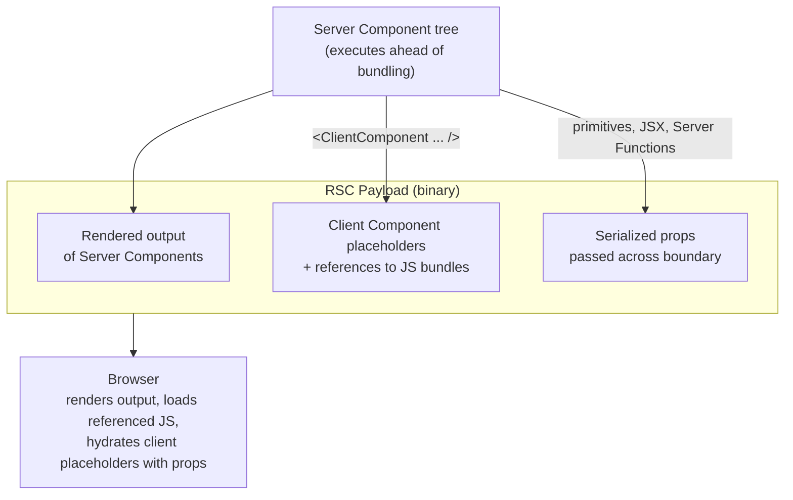

# [FEE-618] React Server Components — The State Boundary

:::info
React Server Components (RSC) execute outside the client bundle, so any module they touch stays off the wire unless an explicit `'use client'` directive opens a boundary. State, effects, and event handlers live exclusively on the client side of that boundary; on the server side you get async data access in render. This article walks through what crosses the boundary, what cannot, and how to keep stateful logic from poisoning a tree that wants to stay on the server.
:::

## Context

React's documentation describes Server Components as a component type that "renders ahead of time, before bundling, in an environment separate from your client app or SSR server" ([react.dev/reference/rsc/server-components](https://react.dev/reference/rsc/server-components)). The same reference notes two execution windows: "Server Components can run once at build time on your CI server, or they can be run for each request using a web server." Because they render ahead of bundling, their output is excluded from the JavaScript bundle.

The 2023 React Labs post frames the data-access angle: "Server Components can run during the build, letting you read from the filesystem or fetch static content. They can also run on the server, letting you access your data layer without having to build an API" ([react.dev/blog/2023/03/22](https://react.dev/blog/2023/03/22/react-labs-what-we-have-been-working-on-march-2023)). An async Server Component can `await` directly inside render.

The trade-off is that Server Components have no client lifecycle. Per the same React reference, "Server Components are not sent to the browser, so they cannot use interactive APIs like `useState`." `useEffect` is unavailable for the same reason.

RSC is "a spec for components that work across compatible React frameworks" (React Labs, March 2023). Frameworks and bundlers — Next.js App Router, Waku, Vite plugins — implement that spec; the React package itself does not ship a runtime that mounts RSC end-to-end.

## Scenario

Consider a Next.js App Router page that renders a product detail layout: a header with the product title fetched from a database, a description block read from a CMS, a list of reviews paginated server-side, and a single "Add to cart" button that needs `useState` to track an in-flight optimistic update. If the page module is marked `'use client'` to satisfy the button's hook, every imported piece (the product fetcher, the CMS adapter, the reviews list) moves into the client bundle along with its transitive dependencies. The data-access modules now ship to the browser even though their results never need to re-render there.

The fix is to keep the page on the server and isolate the button into its own client-marked module. The rest of this article covers what the boundary permits and the patterns that let stateful logic stay leaf-shaped.

## Best Practices

- **MUST** scope the `'use client'` directive to the smallest interactive leaf possible. The Next.js docs recommend, "To reduce the size of your client JavaScript bundles, add `'use client'` to specific interactive components instead of marking large parts of your UI as Client Components" ([nextjs.org/docs/app/getting-started/server-and-client-components](https://nextjs.org/docs/app/getting-started/server-and-client-components)).
- **MUST** treat `'use client'` as a module-graph boundary. The React reference states it "introduces a server-client boundary in the module dependency tree, effectively creating a subtree of Client modules" ([react.dev/reference/rsc/use-client](https://react.dev/reference/rsc/use-client)). The directive applies to the file it appears in and to everything that file imports.
- **MUST** account for transitive client evaluation. Per the same reference: "When a file marked with `'use client'` is imported from a Server Component, compatible bundlers will treat the module import as a boundary between server-run and client-run code. As dependencies of `RichTextEditor`, `formatDate` and `Button` will also be evaluated on the client regardless of whether their modules contain a `'use client'` directive."
- **SHOULD** use `'use server'` to expose async server logic to client callers. React's reference: "Add `'use server'` at the top of an async function body to mark the function as callable by the client. We call these functions Server Functions" ([react.dev/reference/rsc/use-server](https://react.dev/reference/rsc/use-server)).
- **MUST NOT** assume `'use client'` opts a component out of server-side rendering. Josh Comeau's RSC walkthrough corrects the misconception: "We still rely on Server Side Rendering to generate the initial HTML. React Server Components builds on top of that, allowing us to omit certain components from the client-side JavaScript bundle" ([joshwcomeau.com/react/server-components](https://www.joshwcomeau.com/react/server-components/)).

## Design Thinking

The most common confusion about RSC is reading `'use client'` as "this component skips SSR." Comeau's piece states the opposite: "We still rely on Server Side Rendering to generate the initial HTML. React Server Components builds on top of that, allowing us to omit certain components from the client-side JavaScript bundle." Server-side rendering still produces the initial HTML for client components; the directive only governs whether the source modules ship as JavaScript for hydration.

The design intent of RSC sits on top of that. SSR was already running on the server; what RSC adds is a class of components whose source code never crosses the wire at all. Bundle minimisation comes from how deep you push the boundary. Treating `'use client'` as a hydration-only marker (a switch that says "this leaf needs JavaScript on the client") keeps the mental model aligned with how the bundler treats the module graph.

## Deep Dive

The Next.js docs describe what the framework actually transmits across the boundary as the RSC Payload: "a compact binary representation of the rendered React Server Components tree... [it contains] The rendered result of Server Components, Placeholders for where Client Components should be rendered and references to their JavaScript files, Any props passed from a Server Component to a Client Component" ([nextjs.org/docs/app/getting-started/server-and-client-components](https://nextjs.org/docs/app/getting-started/server-and-client-components)).

Three pieces, then. The server-rendered output is already-resolved UI: the result of running async Server Components, including any `await`-ed data. The placeholders mark holes where client components belong, paired with references to the JS chunks the browser must load to hydrate those holes. The serialized props are the values the parent server component handed to each client child; they ride along the payload so hydration has the data it needs without a separate fetch.

This format is what makes the boundary observable at runtime. A change in server data re-renders the server output and sends a new payload; the client component references are stable across those renders unless the underlying client module changes.

## Visual



## Example

A common pattern from the Next.js docs: "a `<Cart>` component that fetches data on the server, inside a `<Modal>` component that uses client state to toggle visibility" ([nextjs.org/docs/app/getting-started/server-and-client-components](https://nextjs.org/docs/app/getting-started/server-and-client-components)). The modal owns the open/closed state. The cart owns the data fetch. They meet in the middle by passing the server cart in as `children`.

`app/components/Modal.tsx` (client):

```tsx
'use client';

import { useState, type ReactNode } from 'react';

export function Modal({ children }: { children: ReactNode }) {
  const [open, setOpen] = useState(false);
  return (
    <>
      <button onClick={() => setOpen(true)}>Open cart</button>
      {open && (
        <div role="dialog">
          <button onClick={() => setOpen(false)}>Close</button>
          {children}
        </div>
      )}
    </>
  );
}
```

`app/cart/page.tsx` (server):

```tsx
import { Modal } from '../components/Modal';
import { db } from '../lib/db';

async function Cart() {
  const items = await db.cart.findMany();
  return (
    <ul>
      {items.map((item) => (
        <li key={item.id}>{item.name} — {item.qty}</li>
      ))}
    </ul>
  );
}

export default function CartPage() {
  return (
    <Modal>
      <Cart />
    </Modal>
  );
}
```

`Modal` is a client component holding `useState`. `Cart` is a server component that `await`s the database. The page is a server component that composes them. The cart's data fetch never enters the client bundle; only the modal's interactivity does.

## Lifting State Above an RSC

The boundary has serialization rules. The React reference lists what may cross as props from server to client: "Primitives [string, number, bigint, boolean, undefined, null, symbol], Iterables containing serializable values [String, Array, Map, Set, TypedArray and ArrayBuffer], [Date], Plain [objects], Functions that are [Server Functions], Client or Server Component elements (JSX), [Promises]" ([react.dev/reference/rsc/use-client](https://react.dev/reference/rsc/use-client)). And what may not: "[Functions] that are not exported from client-marked modules or marked with [`'use server'`], [Classes], Objects that are instances of any class (other than the built-ins mentioned), Symbols not registered globally."

The asymmetry: only Server Functions can cross as a callable. A plain function reference defined on the server cannot be passed as a prop to a client component because there is no transport for it; a Server Function can, because the directive registers it for cross-boundary invocation. Server Function return values follow the same constraint: "Supported serializable return values are the same as serializable props for a boundary Client Component" ([react.dev/reference/rsc/use-server](https://react.dev/reference/rsc/use-server)). React elements, plain functions, and arbitrary class instances cannot be returned to the caller.

The composition rule that makes the boundary livable: a Server Component may be passed as a prop (typically `children`) into a Client Component. The Next.js docs: "You can pass Server Components as a prop to a Client Component. This allows you to visually nest server-rendered UI within Client components" ([nextjs.org/docs/app/getting-started/server-and-client-components](https://nextjs.org/docs/app/getting-started/server-and-client-components)). The client parent never imports the server child as a module; it only renders whatever JSX was handed to it. The server child's source stays on the server, and the client parent's JS bundle stays small.

This is the lever for "lifting state above an RSC." When a tree mixes server data and client interactivity, the question is which component owns `useState`. If the answer is a deep leaf, the surrounding tree can stay on the server; if the answer is the root, the entire tree compiles into the client bundle. Comeau's pluck pattern walks through the rewrite: "let's pluck the color-management stuff into its own component, moved to its own file...We can remove the `'use client'` directive from `Homepage` because it no longer uses state, or any other client-side React features" ([joshwcomeau.com/react/server-components](https://www.joshwcomeau.com/react/server-components/)). The stateful logic lifts out of the layout and into a sibling client component the layout renders; the layout drops `'use client'` and goes back to running on the server.

The pattern composes with the children-slot example from the previous section: a client interaction shell at the leaf, server data above it, and a server parent that hands the data in as `children` instead of routing it through props that would have to serialize.

## Internal References

- [FEE-616 — React 19 Form State](/en/State%20Management/616) covers Server Functions invoked from client form handlers, the same `'use server'` mechanism applied to form-driven mutations.
- [FEE-613 — TanStack Query](/en/State%20Management/613) addresses server state caching from a client-only stance, useful contrast against RSC's render-on-the-server approach.

## References

- React Team, "Server Components," React reference (n.d.). https://react.dev/reference/rsc/server-components
- React Team, "'use client' directive," React reference (n.d.). https://react.dev/reference/rsc/use-client
- React Team, "'use server' directive," React reference (n.d.). https://react.dev/reference/rsc/use-server
- React Team, "Server Functions," React reference (n.d.). https://react.dev/reference/rsc/server-functions
- React Team, "React Labs: What We've Been Working On — March 2023," React blog (2023). https://react.dev/blog/2023/03/22/react-labs-what-we-have-been-working-on-march-2023
- Vercel, "Server and Client Components," Next.js documentation (n.d.). https://nextjs.org/docs/app/getting-started/server-and-client-components
- Josh Comeau, "Making Sense of React Server Components," joshwcomeau.com (2023). https://www.joshwcomeau.com/react/server-components/
- Vercel, "Server and Client Components," Next.js Foundations (n.d.). https://nextjs.org/learn/react-foundations/server-and-client-components
