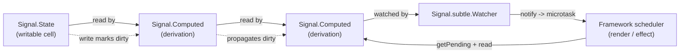

# [FEE-612] TC39 Signals Proposal

:::info
The TC39 Signals proposal advances a single reactive primitive into the JavaScript language so that frameworks stop shipping bespoke versions of the same idea. It reached Stage 1 on the April 2024 TC39 agenda and consolidates design input from the maintainers of Angular, Bubble, Ember, FAST, MobX, Preact, Qwik, RxJS, Solid, Starbeam, Svelte, Vue, and Wiz. The public surface is `Signal.State` for writable cells, `Signal.Computed` for derivations, and a gated `Signal.subtle` namespace for framework integration. Evaluation is pull-based and glitch-free, and the official `signal-polyfill` package is the only path to using the API today.
:::

## Context

Signals reached Stage 1 of the TC39 process on the April 2024 agenda and the proposal continues to sit at Stage 1 while authors prototype across multiple frameworks (proposal-signals/proposal-signals, README). The current draft is based on design input from the authors and maintainers of every major reactive framework. The proposal lists Angular, Bubble, Ember, FAST, MobX, Preact, Qwik, RxJS, Solid, Starbeam, Svelte, Vue, Wiz, "and more", the first time framework reactivity primitives have been aligned at the language level (proposal-signals README). The public API decomposes into three pieces: `Signal.State(value)` for writable cells, `Signal.Computed(callback)` for derivations flowing through the graph, and a gated `Signal.subtle` namespace for low-level integration hooks (signal-polyfill README). The `subtle` namespace mirrors `crypto.subtle`: advanced features kept behind a deliberate barrier so application code reaches for `State` and `Computed` while framework authors reach for `Watcher` (proposal-signals README).

## Scenario

A library author wants to ship a reactive data layer — a query cache, a form engine, a presence client — once and have it interoperate with Solid, Vue, Preact, Angular, and Lit. Today that author either picks a runtime (binding the library to one framework's reactivity), reinvents push-based change notification (and re-litigates glitches), or ships N adapters. The Signals proposal targets this scenario by standardizing the primitive every framework already builds, so a single integration covers the ecosystem (lit.dev, "Signals", 2024).

## Best Practices

- **MUST** treat `Signal.subtle` as off-limits to application code. The polyfill README states explicitly: "These APIs are not targeted at application-level code, but rather at framework/library authors." Application surfaces stay on `Signal.State` and `Signal.Computed` (signal-polyfill README).
- **MUST NOT** ship `signal-polyfill` to production. Its README opens with: "This polyfill is a preview of an in-progress proposal and could change at any time. Do not use this in production." Preview-only by design (signal-polyfill README).
- **SHOULD** rely on the consistency guarantee when composing computeds: "A computed Signal always observes the Signal graph in a consistent state, and its execution is not interrupted by other Signal-mutating code (except for things it calls itself)." No intermediate-tearing across the graph (proposal-signals README).
- **SHOULD** rely on glitch-freeness instead of layering manual de-duplication. Per the README, "Computation is 'glitch-free', meaning no unnecessary calculations are ever performed" — a derived signal never recomputes against an inconsistent snapshot of its inputs (proposal-signals README).

## Design Thinking

The reason TC39 takes signals up at all is convergent design across frameworks that arrived at the same primitive independently. Angular, Vue, Preact, Solid, Svelte, MobX, Qwik, Starbeam, and others each ship their own reactive cell + derivation pair; Lit's blog post on signals frames the cost: "Standardized signals in JavaScript would let us build just one integration (and eventually add signals support directly in Lit's core), and enable interop between signal-using libraries" (lit.dev, 2024). The trade-off the proposal accepts is scope discipline. By collapsing to `State` + `Computed` + a gated `subtle` namespace, the proposal pushes async semantics, rendering integration, and effect-scheduling policy out of the language surface. Frameworks keep ownership of those policies; the language owns the dependency graph and the consistency guarantee. The convergent design point — pull-based, lazy, glitch-free — falls out of that division.

## Deep Dive

Evaluation is pull-based with eager invalidation. The proposal README states: "Computations are not eagerly evaluated when they are declared, nor are they immediately evaluated when their dependencies change. They are only evaluated when their value is explicitly requested" (proposal-signals README). A write to a `Signal.State` marks dependent `Signal.Computed` nodes dirty immediately, and recomputation waits until something reads them. The README articulates why pull beats push for UI: "Signals avoid this dynamic by being pull-based, rather than push-based: At the time the framework schedules the rendering of the UI, it will pull the appropriate updates, avoiding wasted work both in computation as well as in writing to the DOM" (proposal-signals README). Framework integration lives on `Signal.subtle.Watcher`. A Watcher registers a notify callback that fires the first time any signal in its watched set transitions to dirty; the README phrases it as: "Add these signals to the Watcher's set, and set the watcher to run its notify callback next time any signal in the set (or one of its dependencies) changes" (proposal-signals README). The dirty set is queried via `Watcher.getPending()`, which "Returns the set of sources in the Watcher's set which are still dirty, or is a computed signal with a source which is dirty or pending and hasn't yet been re-evaluated" (proposal-signals README).

## Visual



The graph captures the load-bearing claim from Lit's post on signals: a single shared primitive collapses N framework-specific integrations into one. Lit demonstrates this by building `SignalWatcher` directly on top of the standard polyfill: "we just use the `SignalWatcher` mixin in our Custom Element definition; any signals we read from will automatically be observed, triggering updates whenever their values change" (lit.dev, 2024).

## Example

The proposal README ships a counter example that shows derivations chaining without explicit subscription wiring:

```js
const counter = new Signal.State(0);
const isEven = new Signal.Computed(() => (counter.get() & 1) == 0);
const parity = new Signal.Computed(() => isEven.get() ? "even" : "odd");
```

`parity` reads `isEven`, `isEven` reads `counter`. There is no `subscribe()`, no observer registration, no manual dependency declaration. Calling `counter.set(1)` marks `isEven` dirty; reading `parity.get()` walks the graph, evaluates `isEven` once, then evaluates `parity` (proposal-signals README).

## Polyfill Integration Pattern

The `signal-polyfill` package is the only path to using the API today (signal-polyfill README), and its README ships the canonical `effect()` recipe that frameworks plug in to:

```js
let needsEnqueue = true;

const w = new Signal.subtle.Watcher(() => {
  if (needsEnqueue) {
    needsEnqueue = false;
    queueMicrotask(processPending);
  }
});

function processPending() {
  needsEnqueue = true;

  for (const s of w.getPending()) {
    s.get();
  }

  w.watch();
}
```

The shape of the integration is fixed by the proposal:

1. Construct one `Signal.subtle.Watcher` per scheduling boundary (a renderer, an effect group, a hydration root).
2. Add the signals the boundary cares about to the Watcher's set; the notify callback fires the first time any of them transitions to dirty (proposal-signals README, claim on Watcher semantics).
3. Inside notify, debounce with a `needsEnqueue` flag and `queueMicrotask` so the Watcher fires once per microtask regardless of how many writes land in the same tick (signal-polyfill README).
4. In the microtask, drain `w.getPending()` by calling `.get()` on each entry to recompute it, then call `w.watch()` to re-arm the Watcher for the next dirty transition (proposal-signals README on `getPending`).
5. Hand the new values off to whatever rendering or effect mechanism the framework owns. The proposal stops at the dependency graph; rendering is the framework's job (proposal-signals README on pull-based scheduling).

Lit demonstrates the pattern end-to-end: `SignalWatcher` is a mixin that owns step 1-4 internally, and step 5 is "trigger an update on the host element" (lit.dev, 2024).

## Internal References

- FEE-611 — userland framework signals (Solid, Vue, Preact, Angular) that the TC39 proposal abstracts into one primitive.
- FEE-600 — State Management category overview; situates signals among the alternatives.

## References

- TC39, "Signals Proposal," GitHub (2024). https://github.com/tc39/proposal-signals
- TC39, "Signals Proposal README," GitHub (2024). https://github.com/tc39/proposal-signals/blob/main/README.md
- proposal-signals, "signal-polyfill," GitHub (2024). https://github.com/proposal-signals/signal-polyfill
- proposal-signals, "signal-polyfill README," GitHub (2024). https://github.com/proposal-signals/signal-polyfill/blob/main/README.md
- Lit team, "Signals," lit.dev (2024). https://lit.dev/blog/2024-10-08-signals/
