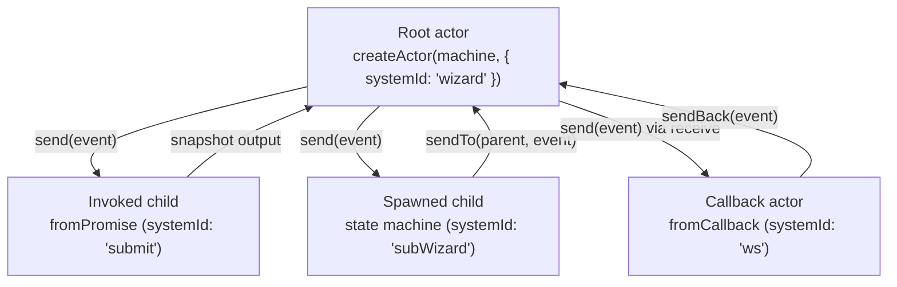

# [FEE-614] XState v5 — The Actor Model

:::info
XState v5 promotes the actor as its foundational runtime abstraction: a running state machine is an actor that communicates only through asynchronous message passing, processes events sequentially via an internal mailbox, and encapsulates state so that mutation happens only from within. The library ships five actor logic types (state machine, promise, callback, observable, transition) and unifies them under a single interface that exposes `send`, `subscribe`, and `getSnapshot`. Once every running unit in your app is an actor with a stable identity, parent-child coordination, async work, and observability stop being three separate problems and become one.
:::

## Context

Stately's v5 documentation reframes XState around the actor model as the core runtime concept. "When you run a state machine in XState, it becomes an actor. Actors communicate with other actors by sending and receiving events asynchronously" (Stately, "Actor model"). Each actor owns a mailbox: "Actors process one message at a time. They have an internal 'mailbox' that acts like an event queue, processing events sequentially" (Stately, "Actors"). Encapsulation is strict: "An actor has its own internal, encapsulated state that can only be updated by the actor itself," and "the only way for an actor to share data is by sending events" (Stately, "Actor model"). On top of those invariants, v5 ships five built-in actor logic types: state machine, promise, callback, observable, and transition (Stately, "Actors"). Together they cover one-shot async work, streams, bidirectional bridges, and pure reducers under one runtime contract.

## Scenario

A React app implements a multi-step form wizard with `useReducer`. New requirements pile on: each step submits to a different backend (some return promises, some stream over WebSocket), one step opens a child wizard that must survive when the parent navigates between steps, and the team needs a devtools panel that records every transition. `useReducer` has no story for invoked async, no way to model child wizards that outlive a single state, and no built-in observability. XState v5 maps each of those needs to an actor: the parent wizard machine invokes a `fromPromise` actor for one-shot submissions, spawns a child wizard actor that lives across several steps, and registers each through `systemId` so the inspector can stream transitions out for devtools.

## Best Practices

- **MUST** treat every running unit as an actor and interact with it only through its public surface — `actor.send(event)`, `actor.subscribe(observer)`, `actor.getSnapshot()` (Stately, "Actors").
- **MUST** rename `interpret(machine)` call sites to `createActor(machine, options)` when migrating from v4 to v5; the function was renamed (Stately, "Migration").
- **SHOULD** declare typed machines with `setup({ types, actors, actions, guards })` and pass implementation sources there rather than as the second argument of `createMachine` (Stately, "Setup").
- **SHOULD** register cross-cutting actors with a `systemId` so other actors can resolve them via `system.get('actorId')` instead of threading `ActorRef` through context (Stately, "System").
- **MUST** update v4 patterns when moving to v5: rename `cond` to `guard`, rename `schema` to `types`, replace `send(...)` with `raise(...)` for self-events or `sendTo(...)` for targeted sends, and accept `{ context, event }` as a single object argument in implementation functions (Stately, "Migration").

## Design Thinking

The v5 docs deliberately drop the v4 "service" terminology and standardize on "actor" (research notes). The shift is more than a rename: under v4 a "service" was an interpreted state machine with a side channel, while under v5 the actor is the single concept and message passing is the only mutation channel. The docs anchor this: "the only way for an actor to share data is by sending events" (Stately, "Actor model"). That constraint trades direct call ergonomics for two properties: every cross-actor interaction is observable as an event, and every actor can be reasoned about in isolation because its state changes only in response to its mailbox. The five built-in logic types (Stately, "Actors") then become specializations of the same contract, so a promise-based fetch and a long-lived state machine plug into the same supervision tree without bespoke wiring.

## Deep Dive

Not every actor logic type is bidirectional. Promise and observable actors are receive-only: "Sending events to promise actors will have no effect" and "Sending events to observable actors will have no effect" (Stately, "Actors"). When a child needs to push events back into its parent, use callback logic with `fromCallback(({ sendBack, receive, input }) => { ... })` for "callback-based actors that need bidirectional communication" (Stately, "Migration"); the callback closes over `sendBack` to emit events upward and `receive` to consume events from the parent. For observability, `createActor(machine, options)` accepts an `inspect` callback. "When you pass in the `inspect` option to the actor options in XState's `createActor(machine, options)` function, it will automatically send all of these inspection events," and "there are currently three kinds of events sent: Actor creation events, Actor-to-actor communication events, Actor snapshot changes" (Stately, "Inspector"). The inspector hook is the supported integration point for devtools, structured logs, or replay tooling.

## Visual



The root actor is created by `createActor(actorLogic)`, which "implicitly create[s] an actor system where the created actor is the root actor" (Stately, "Actors"). Children are registered under their own `systemId`, and arrows show the message channels that connect them.

## Example

A typed wizard machine declared with `setup` and two child actor logics (`fromPromise` for a one-shot submission, `fromCallback` for a bidirectional WebSocket bridge):

```ts
import { setup, fromPromise, fromCallback, createActor, assign } from 'xstate';

const submitForm = fromPromise(async ({ input }: { input: { payload: unknown } }) => {
  const res = await fetch('/api/submit', {
    method: 'POST',
    body: JSON.stringify(input.payload),
  });
  return res.json();
});

const wsBridge = fromCallback(({ sendBack, receive }) => {
  const socket = new WebSocket('wss://example.test/wizard');
  socket.onmessage = (e) => sendBack({ type: 'WS_MESSAGE', data: e.data });
  receive((event) => {
    if (event.type === 'PUBLISH') socket.send(JSON.stringify(event.payload));
  });
  return () => socket.close();
});

const wizard = setup({
  types: {} as {
    context: { result: unknown };
    events: { type: 'SUBMIT'; payload: unknown } | { type: 'PUBLISH'; payload: unknown };
  },
  actors: { submitForm, wsBridge },
}).createMachine({
  id: 'wizard',
  initial: 'editing',
  context: { result: null },
  invoke: { src: 'wsBridge', systemId: 'ws' },
  states: {
    editing: {
      on: { SUBMIT: 'submitting' },
    },
    submitting: {
      invoke: {
        src: 'submitForm',
        systemId: 'submit',
        input: ({ event }) => ({ payload: (event as any).payload }),
        onDone: {
          target: 'done',
          actions: assign({ result: ({ event }) => event.output }),
        },
      },
    },
    done: { type: 'final' },
  },
});

const actor = createActor(wizard, { systemId: 'wizardRoot' });
actor.start();
```

The setup function carries the typed sources, matching "Move action, actor, guard, etc. sources from the 2nd argument of `createMachine(config, sources)` to `setup({ ... })`" (Stately, "Setup"). `createActor(machine, { systemId })` follows the system docs: "The root of a system can also be explicitly assigned a `systemId` in the `createActor(...)` function," and "Invoked actors are registered with a system-wide `systemId` in the `invoke` object" (Stately, "System"). The `fromCallback` bridge follows the migration guide pattern for bidirectional callback actors (Stately, "Migration").

## Actor Lifecycle: invoke vs spawn

`invoke` binds the actor's lifetime to the state that declares it. "The invoked actor will start when the state is entered, and stop when the state is exited" (Stately, "Invoke"). That lifecycle coupling is the right default whenever the work belongs to one state, like a fetch tied to a `loading` state or a subscription tied to a `streaming` state.

Reach for `spawn` when the lifecycle is no longer single-state. The spawn docs list the cases plainly: "Sometimes invoking actors may not be flexible enough for your needs. For example, you might want to: Invoke child machines that last across *several* states [or] Invoke a *dynamic number* of actors" (Stately, "Spawn"). Spawned actors live in `context` as `ActorRef` values, so the parent can `sendTo` them across transitions and store an arbitrary collection.

That flexibility carries a cleanup obligation. Spawned actors are not stopped automatically: "if you use `spawn`, **make sure you remove the ActorRef from `context` to prevent memory leaks** when the spawned actor is no longer needed" (Stately, "Spawn"). The standard pattern is an action that stops the spawned actor and assigns the ref out of context once its work is done.

Both `invoke` and `spawn` accept `systemId` so spawned and invoked children alike can be resolved through `system.get('actorId')` (Stately, "System"). The root actor's `systemId` is configured through `createActor(machine, { systemId })`, anchoring the registry the rest of the system reads from.

## Internal References

- [Reactive Framework Signals](/en/State%20Management/611) — contrast the signal model with statechart-driven actors.
- [React 19 Form State and Actions](/en/State%20Management/616) — contrast the `useActionState` lifecycle with invoked async actors.

## References

- Stately, "Actor model," Stately Docs (n.d.). https://stately.ai/docs/actor-model
- Stately, "Actors," Stately Docs (n.d.). https://stately.ai/docs/actors
- Stately, "System," Stately Docs (n.d.). https://stately.ai/docs/system
- Stately, "Invoke," Stately Docs (n.d.). https://stately.ai/docs/invoke
- Stately, "Spawn," Stately Docs (n.d.). https://stately.ai/docs/spawn
- Stately, "Setup," Stately Docs (n.d.). https://stately.ai/docs/setup
- Stately, "Migration from XState v4 to v5," Stately Docs (n.d.). https://stately.ai/docs/migration
- Stately, "Inspector," Stately Docs (n.d.). https://stately.ai/docs/inspector
