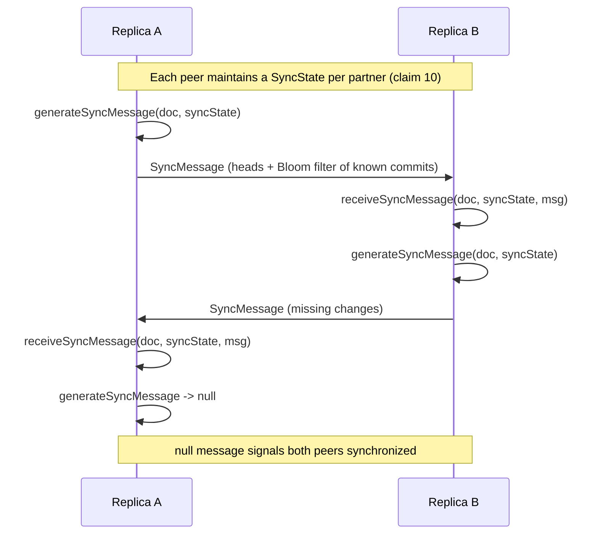

# [FEE-615] CRDT Collaborative State (Yjs and Automerge)

:::info
Conflict-free Replicated Data Types (CRDTs) provide a merge function that is associative, commutative, and idempotent, so concurrent replicas converge without coordination (Shapiro et al., Inria HAL). This article covers two production-grade browser CRDTs: Yjs, a high-performance shared-types library that is "network agnostic" and merges regardless of update order, and Automerge, a JSON-like CRDT plus sync engine whose explicit goal is to "support local-first applications in the same way that relational databases support server applications." Pick CRDTs when offline-tolerant convergence is the requirement, and use a separate coordination mechanism for non-confluent invariants like uniqueness or capacity caps.
:::

## Context

CRDT theory was formalised by Shapiro, Preguica, Baquero, and Zawirski at Inria: a join-semilattice merge that is "commutative (x ⊔v y = y ⊔v x), idempotent (x ⊔v x = x) and associative" lets independent replicas converge without locks (claim 1). Yjs operationalises this for the browser: its shared types "can be manipulated, fire events when changes happen, and automatically merge without merge conflicts," and the library is "network agnostic" so "as long as all changes eventually arrive, documents will sync regardless of update order or network technology used" (claim 2). Automerge takes a complementary path, presenting itself as "a JSON-like data structure (a CRDT) that can be modified concurrently by different users, and merged again automatically," with the stated goal to "support local-first applications in the same way that relational databases support server applications" (claim 8). The framing comes from Ink & Switch's local-first essay, which treats "the copy of the data on your local device... as the primary copy. Servers still exist, but they hold secondary copies" (claim 11). That architectural inversion is what justifies running a CRDT in the browser at all.

## Scenario

A multi-user document editor has to keep working when a laptop is offline on a flight, when two collaborators edit the same paragraph from different cities, and when the central relay is temporarily unreachable. The application needs typed shared collections (text, lists, maps), presence indicators (cursors, selection ranges, who is online), local persistence so the document is still there after a reload, and a sync protocol that recovers efficiently after long disconnections. The team wants to avoid a centralised transformation server. Yjs and Automerge both target this profile.

## Best Practices

- **MUST** model collaborative state with the typed shared collections the library ships rather than ad-hoc JSON. Yjs provides `Y.Map`, `Y.Array`, `Y.Text`, `Y.XmlFragment`, `Y.XmlElement`, and `Y.XmlText`; for example "Y.Array: A shareable Array-like type that supports efficient insert/delete of elements at any position. Y.Text: A shareable type that is optimized for shared editing on text" (claim 3).
- **MUST** keep transport and storage as separate provider concerns. In Yjs this means composing modules: "y-websocket: A module that contains a simple websocket backend and a websocket client that connects to that backend. y-webrtc: Propagates document updates peer-to-peer using WebRTC. y-indexeddb: Efficiently persists document updates to the browsers indexeddb database" (claim 7). Apps typically compose several at once.
- **MUST NOT** rely on the CRDT alone to enforce non-confluent invariants such as "no more than 5 items" or "no double-booked seat." Per the ACM Queue article on coordination, "An invariant is confluent if two nodes can independently make updates that preserve the invariant... If all invariants are confluent, an application can be coordination-free, whereas nonconfluent invariants require coordination" (claim 12). These invariants need a separate coordination mechanism layered on top.

## Design Thinking

Local-first inverts the usual client/server roles: the local replica becomes the primary copy and the server holds secondary copies (claim 11). Once that inversion is accepted, the merge algorithm has to tolerate arbitrary partition durations, which rules out designs that need a single authoritative log.

The OT-vs-CRDT trade-off is direct. Per the comparison from TinyMCE's engineering blog, "OT trades complexity for the ability to capture the intent; CRDT has less complexity but can only guarantee all clients end with the same data," while "CRDT is capable of working peer-to-peer with end-to-end encryption... It even works if clients go offline" (claim 14). Pick OT when capturing fine-grained user intent on a single transformation server is acceptable; pick CRDTs when offline operation and peer-to-peer transports are required.

Yjs sits in a specific CRDT lineage. The 2019 survey paper by Sun et al. notes that "A more recent tombstone-based CRDT solution, named Yjs, is noteworthy. Yjs is special in its extensions for supporting rich-text co-editing; but its core is based on WOOT with variations to reduce time and space complexity" (claim 15). The WOOT heritage shapes how Yjs identifies items and reconciles concurrent insertions, and the rich-text extensions are layered on that identifier-based sequence.

## Deep Dive

Yjs subdocuments let a Y.Doc be embedded inside a parent shared type with lazy loading: "Yjs documents can be embedded into shared types. This allows you to manage vast amounts of Yjs documents as part of a root document," and "By default, subdocuments are empty until they are explicitly loaded" (claim 4). This is how Yjs scales to a workspace with thousands of pages without forcing every client to materialise every page.

Automerge's sync round normally completes in one trip. Per Kleppmann's writeup, "In addition to sending the hashes of their heads, each node constructs a Bloom filter containing the hashes of the commits that it knows about," and "Almost all reconciliations complete in one round trip" (claim 13). The Bloom filter encodes known commits at roughly 1.25 bytes each, so the document grows over time but the wire payload during sync stays small.

## Visual



## Example

A small Automerge sync loop using `generateSyncMessage` and `receiveSyncMessage`. Per the API docs, the function returns "[newSyncState, syncMessage | null]," and "The returned newSyncState should replace the original state object, while syncMessage should be transmitted to the peer — unless it's null, which signals that both peers are already synchronized" (claim 9). Each peer "maintains a State for each peer they are synchronizing with" (claim 10).

```js
import * as Automerge from "@automerge/automerge"

// Each peer keeps its own doc and a SyncState per partner.
let docA = Automerge.from({ items: [] })
let syncStateA = Automerge.initSyncState()

let docB = Automerge.init()
let syncStateB = Automerge.initSyncState()

// One direction of a sync round, A -> B.
function step(fromDoc, fromState, toDoc, toState) {
  const [nextFromState, msg] = Automerge.generateSyncMessage(fromDoc, fromState)
  if (msg === null) {
    // null signals that both peers are already synchronized
    return { fromState: nextFromState, toDoc, toState, done: true }
  }
  const [nextToDoc, nextToState] = Automerge.receiveSyncMessage(toDoc, toState, msg)
  return {
    fromState: nextFromState,
    toDoc: nextToDoc,
    toState: nextToState,
    done: false,
  }
}

// Drive the loop until both directions return null.
let done = false
while (!done) {
  const ab = step(docA, syncStateA, docB, syncStateB)
  syncStateA = ab.fromState
  docB = ab.toDoc
  syncStateB = ab.toState

  const ba = step(docB, syncStateB, docA, syncStateA)
  syncStateB = ba.fromState
  docA = ba.toDoc
  syncStateA = ba.fromState // updated receive state
  done = ab.done && ba.done
}
```

The reliance on a reliable in-order channel between the two peers is a protocol assumption: "The implementation relies on a reliable in-order stream between two peers and is based on academic research from https://arxiv.org/abs/2012.00472" (claim 10).

## Merge Semantics Comparison

| Dimension | Yjs | Automerge |
| --- | --- | --- |
| Data-type model | Typed shared collections: `Y.Map`, `Y.Array`, `Y.Text`, `Y.XmlFragment`, `Y.XmlElement`, `Y.XmlText`, each with typed methods (claim 3) | JSON-like document where maps, lists, and text each have their own per-type CRDT merge (claim 8) |
| Awareness / presence | Separate ephemeral Awareness CRDT for cursors, selections, user identity; "Awareness information isn't stored in the Yjs document, as it doesn't need to be persisted across sessions" (claim 5) | Not provided as a built-in awareness layer in the core sync protocol (claims 9, 10 describe document sync only) |
| Presence timeout | "If a client doesn't receive updates from a remote peer for 30 seconds, it marks the remote client as offline" — doubles as online/offline signal (claim 6) | No equivalent built-in 30-second presence timeout in the documented sync protocol |
| Sync protocol | Update messages exchanged via providers; library is "network agnostic" so "documents will sync regardless of update order or network technology used" (claim 2) | Per-partner `SyncState`; `generateSyncMessage` returns `[newSyncState, syncMessage \| null]`, with null meaning both peers are synchronized (claim 9); Bloom-filter exchange usually completes in one round trip (claim 13) |
| Transport assumption | Network agnostic — works over websocket relay, WebRTC P2P, or any channel that eventually delivers updates (claims 2, 7) | "The implementation relies on a reliable in-order stream between two peers" (claim 10) |
| OT contrast | CRDT lineage descended from WOOT with rich-text extensions (claim 15); offers convergence without a centralised transformation server (claim 14) | CRDT engine designed for offline-tolerant peer-to-peer convergence; trades richer intent semantics that OT captures for that property (claim 14) |

## Internal References

- [Offline-First IndexedDB](/en/State%20Management/offline-first-indexeddb) — local-first complement; CRDT documents need a local persistence layer such as `y-indexeddb` to survive reloads (FEE-617).
- [State Management Overview](/en/State%20Management/600) — category landing page (FEE-600).

## References

- Shapiro, Preguica, Baquero, Zawirski, "A comprehensive study of Convergent and Commutative Replicated Data Types," Inria research report (2011). https://inria.hal.science/inria-00555588/document
- Yjs project, "Yjs Documentation," docs.yjs.dev. https://docs.yjs.dev/
- Yjs project, "Adding Awareness," docs.yjs.dev. https://docs.yjs.dev/getting-started/adding-awareness
- Yjs project, "About Awareness," docs.yjs.dev. https://docs.yjs.dev/api/about-awareness
- Yjs project, "Subdocuments," docs.yjs.dev. https://docs.yjs.dev/api/subdocuments
- Yjs project, "yjs/yjs README," GitHub. https://github.com/yjs/yjs
- Automerge project, "automerge/automerge README," GitHub. https://github.com/automerge/automerge
- Automerge project, "generateSyncMessage API reference," automerge.org. https://automerge.org/automerge/api-docs/js/functions/generateSyncMessage.html
- Automerge project, "Sync module documentation," automerge.org. https://automerge.org/automerge/automerge/sync/index.html
- Martin Kleppmann, "Moving elements in lists, and Bloom filter hash graph sync" (2020). https://martin.kleppmann.com/2020/12/02/bloom-filter-hash-graph-sync.html
- Kleppmann, Wiggins, van Hardenberg, McGranaghan, "Local-first software," Ink & Switch essay (2019). https://www.inkandswitch.com/essay/local-first/
- Sun et al., "Real Differences between OT and CRDT under a General Transformation Framework for Consistency Maintenance in Co-Editors," arXiv preprint (2019). https://arxiv.org/pdf/1905.01517
- TinyMCE engineering, "Real-time collaboration: OT vs CRDT," tiny.cloud blog. https://www.tiny.cloud/blog/real-time-collaboration-ot-vs-crdt/
- Bailis, Fekete, Franklin, Ghodsi, Hellerstein, Stoica, "Coordination Avoidance in Database Systems," ACM Queue. https://queue.acm.org/detail.cfm?id=3546931
