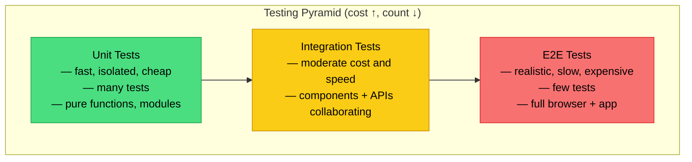
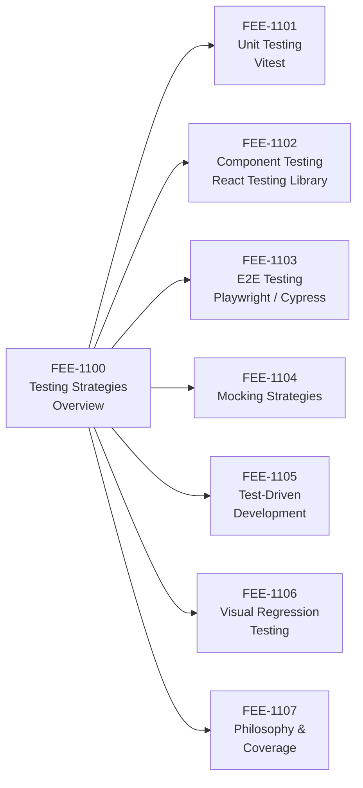

# Testing Strategies Overview

:::info
This category covers the full automated testing spectrum — from static analysis and unit tests through component, integration, and end-to-end tests — with a focus on the cost-confidence trade-offs that govern each layer.
:::

## Context

Automated testing is the primary mechanism that lets a codebase grow without becoming fragile. A test suite that covers behavior (not just lines of code) gives engineers the confidence to refactor, upgrade dependencies, and ship features without reverting to manual verification for every change. Tests also serve as living documentation: a well-named test communicates the intended behavior of a module more precisely than any prose comment.

The testing landscape for frontend applications in particular has changed significantly over the past decade. Tools like Vitest, React Testing Library, and Playwright have dramatically lowered the cost of writing fast, meaningful tests at multiple layers. This makes a nuanced, layered strategy both practical and necessary — a single approach (all unit tests, or all E2E tests) leaves gaps in either confidence or maintainability.

This category guides you through that layered strategy: what each testing layer is, when to use it, how to combine layers effectively, and how to integrate testing into day-to-day development workflows including TDD and CI pipelines.

### What this category covers

- **Unit testing** (FEE-1101): Testing isolated functions and modules with Vitest.
- **Component testing** (FEE-1102): Testing UI components in isolation using React Testing Library.
- **End-to-end testing** (FEE-1103): Testing complete user flows with Playwright and Cypress.
- **Mocking strategies** (FEE-1104): Controlling dependencies to keep tests fast and deterministic.
- **Test-driven development** (FEE-1105): Writing tests before implementation to drive design.
- **Visual regression testing** (FEE-1106): Catching unintended visual changes with snapshot comparisons.
- **Philosophy and coverage** (FEE-1107): Coverage metrics, test confidence, and long-term maintenance.

## Design Thinking

### The testing pyramid: cost drives shape

The classic testing pyramid (coined by Mike Cohn, popularized by Martin Fowler) names three layers — unit, integration, and E2E — and prescribes many unit tests, fewer integration tests, and very few E2E tests. The pyramid shape is not aesthetic. It directly maps to cost: unit tests execute in milliseconds with zero infrastructure, integration tests require coordinating multiple modules and often involve network or database calls, and E2E tests spin up a real browser and a running application. Cost grows upward; test count should shrink accordingly.

Speed and isolation follow the same gradient. A unit test for a pure function is deterministic, repeatable, and debuggable in under a second. An E2E test that drives a login flow depends on the network stack, the DOM renderer, authentication state, and timing — each of which can introduce flakiness. The pyramid prescribes fewer E2E tests not because they are less valuable, but because their maintenance cost is highest.

### The testing trophy: confidence-per-cost for frontend

Kent C. Dodds introduced the Testing Trophy as a refinement for frontend JavaScript applications. The trophy has four layers (bottom to top): static analysis, unit, integration, and E2E — but the widest band is integration, not unit. The guiding principle is: *"The more your tests resemble the way your software is used, the more confidence they can give you."*

For frontend components, a unit test that verifies the internal state of a React hook tells you that hook works in isolation. An integration test that renders the full component tree, fires real user events, and asserts on what appears in the DOM tells you the component works the way a user would experience it. The latter produces more confidence per test written, because it exercises the collaboration between logic, rendering, and event handling simultaneously. This is why Dodds' trophy puts integration at the widest layer: it is the highest-confidence-per-cost option for most frontend scenarios.

Static analysis — TypeScript, ESLint, import linting — sits at the base of the trophy rather than being treated as a separate concern. These checks catch entire classes of bugs (type mismatches, undefined variables, incorrect API usage) at zero runtime cost. They are the cheapest possible tests and should be non-negotiable.

### Confidence vs cost: no single layer is enough

The two models are not in conflict. They share a core insight: confidence and cost both increase as tests become more realistic, and the right strategy distributes tests across layers to balance the two. Static analysis catches type errors cheaply. Unit tests pin down algorithmic edge cases and business logic. Integration tests verify that components and services collaborate correctly. E2E tests confirm that critical user journeys (login, checkout, form submission) work end-to-end in a real browser.

A suite that has only unit tests will pass while a broken component silently renders nothing. A suite that has only E2E tests will catch that failure but take ten minutes to run and produce a stack trace pointing somewhere in the render pipeline rather than the specific function that failed. Layers are complementary, not competitive.

### RTL's influence on the integration layer

React Testing Library deliberately does not expose component internals. You cannot query by component name, internal state, or implementation detail. You query by visible text, ARIA roles, and labels — the same signals a user or assistive technology would use. This design enforces the "test behavior not implementation" principle at the API level, which means an RTL-based component test is already an integration test of the rendering layer, the event system, and the accessibility tree together. This is why FEE-1102 is framed as component testing rather than unit testing: the tool's philosophy places it in the integration band of the trophy.

## Visual

### Testing Pyramid

### Category Map

## Related FEEs

- [FEE-1101 Unit Testing with Vitest](./1101.md)
- [FEE-1102 Component Testing with React Testing Library](./1102.md)
- [FEE-1103 E2E Testing with Playwright and Cypress](./1103.md)
- [FEE-1104 Mocking Strategies](./1104.md)
- [FEE-1105 Test-Driven Development](./1105.md)
- [FEE-1106 Visual Regression Testing](./1106.md)
- [FEE-1107 Philosophy and Coverage](./1107.md)
- [FEE-800 Build Tooling — Test Runners in CI](../Build%20Tooling/800.md)
