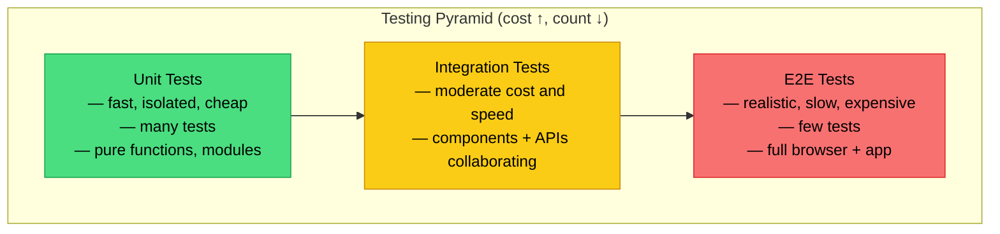
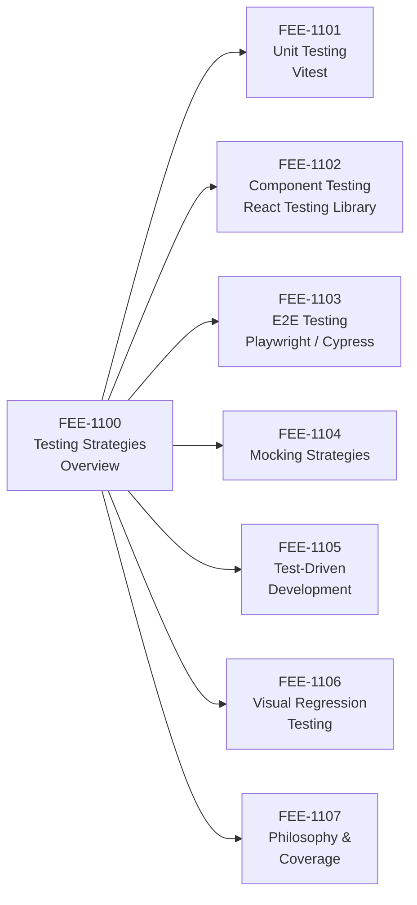

# Testing Strategies Overview

:::info
This category covers the full automated testing spectrum — from static analysis and unit tests through component, integration, and end-to-end tests — with a focus on the cost-confidence trade-offs that govern each layer.
:::

## Context

Automated testing is the primary mechanism that lets a codebase grow without becoming fragile. A test suite that covers behavior (not just lines of code) gives engineers the confidence to refactor, upgrade dependencies, and ship features without reverting to manual verification for every change.

Consider what testing concretely prevents.

A CSS refactor that renames a class token can silently break a component's layout — not because the JavaScript changed, but because a selector relied on a class name that no longer exists. The component renders, it passes a visual spot-check in the developer's browser (where the old CSS might still be cached), and it ships broken.

An API contract change — say a backend endpoint that renamed a field from `user_id` to `userId` — can silently break form submission: the request goes out, the server receives the wrong shape, and the user sees no error because the client swallowed the response. Without a test that asserts on the request payload shape or the resulting UI state, this regression is invisible until a user reports it.

A dependency upgrade from version 3 to version 4 of a date library might change how it handles timezone offsets; every affected calculation drifts incorrectly, and without a test that asserts a specific output for a specific input, the regression ships to production undetected.

These are not hypothetical scenarios — they are the category of failure that automated tests exist to catch before code reaches users.

Tests also serve as living documentation. A well-named test suite communicates the intended behavior of a module more precisely than any prose comment or wiki page. When a new engineer joins a team and reads a test file for a payment form, they learn what inputs are valid, what error states the component handles, and what side effects a successful submission triggers — all without running the application. This is fundamentally different from reading a README, because tests are executable: if the behavior drifts, the test fails and the documentation becomes false in a way that is immediately visible.

The testing landscape for frontend applications has changed significantly over the past decade. For most of the 2010s, frontend testing was difficult enough that "just reload the browser" was a pragmatic default. Jasmine and Karma required significant configuration; PhantomJS (a headless browser) was notoriously slow and flaky; and testing React components required mounting them into an actual DOM with brittle query selectors.

The shift came gradually: Jest standardized the unit-testing experience, React Testing Library replaced enzyme and changed how component tests were written, Playwright made E2E testing reliable enough to run in CI on every commit, and Vitest cut test startup times to near zero.

Today, testing is fast enough to run on every file save and reliable enough to gate pull request merges. The default has shifted from "manual verification before shipping" to "CI-gated PRs where a failing test blocks merge." Teams that have not made this shift find themselves spending increasing amounts of time manually verifying regressions that automated suites would catch in seconds.

The shift also changed team culture. When tests are absent, code review focuses heavily on mental simulation — "I think this change is safe" — because reviewers have no automated signal to rely on. When a project has strong test coverage, code review shifts toward design and intent: the tests themselves prove correctness, and reviewers can focus on naming, architecture, and edge cases the tests might not cover. This makes review faster, more consistent, and less dependent on the reviewer having deep familiarity with every subsystem they review.

This category guides you through that layered strategy: what each testing layer is, when to use it, how to combine layers effectively, and how to integrate testing into day-to-day development workflows including TDD and CI pipelines.

### What this category covers

- **Unit testing** (FEE-1101): Testing isolated functions and modules with Vitest.
- **Component testing** (FEE-1102): Testing UI components in isolation using React Testing Library.
- **End-to-end testing** (FEE-1103): Testing complete user flows with Playwright and Cypress.
- **Mocking strategies** (FEE-1104): Controlling dependencies to keep tests fast and deterministic.
- **Test-driven development** (FEE-1105): Writing tests before implementation to drive design.
- **Visual regression testing** (FEE-1106): Catching unintended visual changes with snapshot comparisons.
- **Philosophy and coverage** (FEE-1107): Coverage metrics, test confidence, and long-term maintenance.

The entries in this category build on one another. FEE-1101 and FEE-1102 establish the mechanics of writing tests at the unit and component layers. FEE-1103 extends that foundation to full browser flows. FEE-1104 bridges all three layers by explaining how to isolate dependencies — the same mocking techniques appear in unit tests, component tests, and occasionally E2E setups. FEE-1105 flips the sequence, showing how writing tests first changes the feedback loop during implementation. FEE-1106 adds a visual dimension that none of the behavioral tests address. FEE-1107 zooms out to address the long-term questions: how much coverage is enough, when to delete a test, and how to treat the test suite as a system that itself requires maintenance.

## Design Thinking

### The testing pyramid: cost drives shape

The classic testing pyramid (coined by Mike Cohn, popularized by Martin Fowler) names three layers — unit, integration, and E2E — and prescribes many unit tests, fewer integration tests, and very few E2E tests. The pyramid shape is not aesthetic. It directly maps to cost: unit tests execute in milliseconds with zero infrastructure, integration tests require coordinating multiple modules and often involve network or database calls, and E2E tests spin up a real browser and a running application. Cost grows upward; test count should shrink accordingly.

To make this concrete: a typical mid-sized frontend project might have 200 unit tests that complete in under 2 seconds, 50 integration tests that finish in 30 seconds, and 10 E2E tests that take 5 minutes. The 200 unit tests give fast, targeted feedback on pure logic. The 50 integration tests verify that components collaborate correctly. The 10 E2E tests confirm that the most critical user paths — login, checkout, account settings — work end-to-end in a real browser. If those ratios are inverted — 10 unit tests and 200 E2E tests — the CI pipeline takes 100 minutes to complete, and every flaky network call has a chance to fail the build. The pyramid shape exists because the ratio above produces fast feedback with broad coverage.

Speed and isolation follow the same gradient. A unit test for a pure function is deterministic, repeatable, and debuggable in under a second. An E2E test that drives a login flow depends on the network stack, the DOM renderer, authentication state, and timing — each of which can introduce flakiness. The pyramid prescribes fewer E2E tests not because they are less valuable, but because their maintenance cost is highest.

### The testing trophy: confidence-per-cost for frontend

Kent C. Dodds introduced the Testing Trophy as a refinement for frontend JavaScript applications. The trophy has four layers (bottom to top): static analysis, unit, integration, and E2E — but the widest band is integration, not unit. The guiding principle is: *"The more your tests resemble the way your software is used, the more confidence they can give you."*

The static layer at the base of the trophy deserves specific attention because it is the most underrated form of testing. TypeScript type checking, ESLint rules, and import linting run in milliseconds, require no test runner, and catch entire categories of bugs before code ever executes.

A TypeScript error catches a function being called with the wrong argument type. An ESLint rule catches a React hook being called conditionally. An import lint rule catches a circular dependency before it causes a runtime error.

These checks are cheaper than any written test — they run as part of compilation and editor feedback — and they should be the non-negotiable baseline before any other testing strategy is discussed.

For frontend components, a unit test that verifies the internal state of a React hook tells you that hook works in isolation. An integration test that renders the full component tree, fires real user events, and asserts on what appears in the DOM tells you the component works the way a user would experience it. The latter produces more confidence per test written, because it exercises the collaboration between logic, rendering, and event handling simultaneously. This is why Dodds' trophy puts integration at the widest layer: it is the highest-confidence-per-cost option for most frontend scenarios.

### The cost breakdown: write time, maintenance time, CI run time

Each testing layer has a different cost ratio across three dimensions: how long it takes to write the test, how much effort it takes to maintain over time, and how long it takes to run in CI.

Unit tests are cheap to write and nearly free to maintain — a test for a pure function rarely changes unless the function's contract changes deliberately. They are also the fastest to run, contributing little to total CI time even at high counts.

Integration tests take longer to write because they require setting up rendered components, mocking network calls, and asserting on DOM state. Their maintenance cost is moderate: they break when behavior changes (which is desirable) but also occasionally when internal implementation shifts in ways that affect queries.

E2E tests are the most expensive to write, the most expensive to maintain, and by far the most expensive to run. A single Playwright test that exercises a multi-step checkout flow may require 50 lines of setup, careful wait strategies to avoid flakiness, and 30 seconds of wall-clock time per run.

The hidden cost of no tests is worth naming explicitly. A codebase with no automated test coverage does not have zero testing cost — it has the maximum possible manual testing cost. Every change requires a developer to manually verify behavior in the browser. Every dependency upgrade is a gamble. Every refactor risks shipping regressions because no test will catch them before production.

More subtly, the absence of tests creates a fear of change that freezes codebases: engineers avoid touching legacy modules because they cannot tell what will break. Test coverage converts that fear into confidence, and confidence is what enables the refactoring that keeps a codebase maintainable over years rather than months.

### Confidence vs cost: no single layer is enough

The two models are not in conflict. They share a core insight: confidence and cost both increase as tests become more realistic, and the right strategy distributes tests across layers to balance the two. Static analysis catches type errors cheaply. Unit tests pin down algorithmic edge cases and business logic. Integration tests verify that components and services collaborate correctly. E2E tests confirm that critical user journeys (login, checkout, form submission) work end-to-end in a real browser.

A suite that has only unit tests will pass while a broken component silently renders nothing. A suite that has only E2E tests will catch that failure but take ten minutes to run and produce a stack trace pointing somewhere in the render pipeline rather than the specific function that failed. Layers are complementary, not competitive.

In practice, the right distribution also depends on what the application does. A data-intensive dashboard with complex filtering logic benefits from a heavier unit test layer because the transformations are algorithmic and side-effect-free. A form-heavy workflow application benefits from a heavier integration layer because the value is in how inputs, validation, state, and submission interact. A checkout or authentication flow warrants E2E coverage regardless of what else exists, because these paths have the highest user-visible risk if they break. No single ratio fits every project; the pyramid and trophy are guides, not mandates.

### RTL's influence on the integration layer

React Testing Library deliberately does not expose component internals. You cannot query by component name, internal state, or implementation detail. You query by visible text, ARIA roles, and labels — the same signals a user or assistive technology would use. This design enforces the "test behavior not implementation" principle at the API level, which means an RTL-based component test is already an integration test of the rendering layer, the event system, and the accessibility tree together. This is why FEE-1102 is framed as component testing rather than unit testing: the tool's philosophy places it in the integration band of the trophy.

A practical consequence: RTL tests tend to survive refactors better than enzyme-style tests did. When you rename a component's internal state variable or extract a sub-component, RTL tests continue to pass as long as the visible output is unchanged. This aligns the test lifecycle with the feature lifecycle rather than the implementation lifecycle — tests break when behavior changes, not when developers improve internal structure.

## Visual

### Testing Pyramid

The following diagram shows the three-layer testing pyramid. The green base represents unit tests: high count, low cost, fast execution. The yellow middle layer represents integration tests: moderate count and cost. The red apex represents E2E tests: low count, highest cost, most realistic. Arrows show increasing realism as you move up, while the narrowing shape reflects the decreasing recommended count.

### Category Map

The following diagram shows the relationship between this overview entry (FEE-1100) and the seven sub-topics it governs. Each node represents a dedicated FEE entry covering one testing layer or practice in depth.

## Related FEEs

- [FEE-1101 Unit Testing with Vitest](./1101.md)
- [FEE-1102 Component Testing with React Testing Library](./1102.md)
- [FEE-1103 E2E Testing with Playwright and Cypress](./1103.md)
- [FEE-1104 Mocking Strategies](./1104.md)
- [FEE-1105 Test-Driven Development](./1105.md)
- [FEE-1106 Visual Regression Testing](./1106.md)
- [FEE-1107 Philosophy and Coverage](./1107.md)
- [FEE-800 Build Tooling — Test Runners in CI](../Build%20Tooling/800.md)
