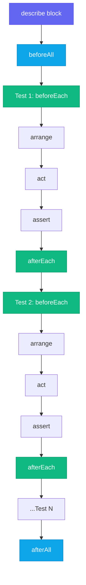

# Unit Testing with Vitest & Jest

## Context

A unit test verifies one function or module in isolation. It imports the subject under test, supplies controlled inputs, and asserts on the outputs — without involving a database, network, DOM renderer, or any other external dependency. When a unit test fails, you know exactly which piece of logic broke and why, because nothing else was in scope.

This isolation is what makes unit tests the fastest and cheapest layer of the testing pyramid (see FEE-1100). A pure function like `calculateDiscount(price, rate)` has no side effects, no I/O, and no shared state. A test for it runs in microseconds, is deterministic across machines, and requires no test environment setup beyond importing the module.

Not all units are pure functions. A module that reads from `localStorage`, calls a network API, or dispatches to a global event bus has dependencies. Unit testing those modules requires mocking — replacing real dependencies with controlled stand-ins that return predictable values. Mocking is what keeps a unit test a unit test: when you mock the network call, the test is no longer testing whether the network works; it is testing whether your code responds correctly to what the network returns.

For most of the 2010s, **Jest** was the uncontested standard for JavaScript unit testing. Bundled with Create React App and configured out of the box with JSDOM, code coverage via Istanbul, and snapshot testing, it became the batteries-included default for an entire generation of React projects. Its API — `describe`, `it`, `expect`, `beforeEach`, `jest.fn()`, `jest.mock()` — is now so widely used that it functions as a shared language among frontend engineers.

**Vitest** emerged in 2021 as a Vite-native alternative. It is intentionally API-compatible with Jest, so the migration path is largely find-and-replace (`jest.fn` → `vi.fn`, `jest.mock` → `vi.mock`). What Vitest changes is the execution model: it uses Vite's esbuild pipeline for transforms, which means TypeScript and JSX are processed without a separate transpilation step. Cold test starts that took 8–18 seconds with Jest (even with `@swc/jest`) drop to under 2 seconds with Vitest. In watch mode the delta is even larger, because Vitest uses Vite's module graph to re-run only the tests affected by a changed file.

Both tools are production-ready and widely deployed. The choice is almost entirely determined by your build tooling: if you are in a Vite project, use Vitest; if you are in a legacy CRA or Webpack project, Jest remains the pragmatic choice.

## Design Thinking

### Why Jest dominated

Jest's dominance was not accidental. When Create React App (CRA) shipped Jest pre-configured with JSDOM, zero-config test execution, coverage, mocks, and snapshots, it eliminated the configuration tax that had made testing prohibitive for smaller teams. You ran `npx create-react-app` and your test suite was ready. Jest became the de facto answer because it removed every friction point simultaneously.

That ecosystem advantage persists today. Legacy codebases, most popular libraries, all React documentation examples, and the bulk of Stack Overflow answers reference Jest's API. Jest 30 (June 2025) improved performance and ESM support significantly. Staying on Jest in an existing Jest project is often the lowest-friction path.

### Why Vitest is preferred for new Vite projects

The key insight is configuration duplication. A Vite project has `vite.config.ts` that already knows your aliases, plugins, environment variables, and TypeScript paths. A Jest project adds a separate `jest.config.ts` (or `babel.config.js` plus `jest-setup.ts`) that must replicate a subset of that knowledge. When you add a path alias to Vite, you must manually mirror it in Jest's `moduleNameMapper`. When you upgrade a Vite plugin, you may need to update a Jest transform to match. This drift becomes a maintenance burden over time.

Vitest solves this by accepting a `test` block inside `vite.config.ts`. There is no separate configuration file. Aliases, plugins, and environment variables are inherited automatically.

The performance difference is architectural. Jest was designed before ESM was standardized; it compiles everything to CommonJS by default and treats its ESM support as experimental. Vitest uses esbuild natively, which is written in Go and parallelizes transforms across CPU cores. Cold-start benchmarks consistently show a 5–10x improvement over Jest with `ts-jest` or `babel-jest`, and a 2–4x improvement even over Jest with the faster `@swc/jest` transform. In a CI pipeline that runs hundreds of times per day, that gap translates directly to cost.

Watch mode in Vitest leverages Vite's module graph. When you change `utils/formatDate.ts`, Vitest knows which test files import that module (directly or transitively) and re-runs only those. Jest's watch mode uses file path heuristics and re-runs everything that matches a pattern, which is coarser.

Vitest also ships a browser mode (`@vitest/browser`) that runs tests in a real Chromium, Firefox, or WebKit instance via Playwright. This closes the gap between the JSDOM simulation that Jest and default Vitest use and a real browser DOM — useful for testing browser APIs that JSDOM does not implement (Web Animations, ResizeObserver, canvas).

### The snapshot testing tradeoff

Snapshot testing was introduced to solve a legitimate problem: verifying that a serialized output has not changed without writing dozens of individual assertions. It works well for stable, text-serialized values: a CLI command's formatted output, an SVG path string generated by a chart library, a date formatting function's locale output, a Redux action sequence.

It works poorly for component JSX trees. A component snapshot is often hundreds of lines of serialized HTML attributes, class names, and inline styles. When the snapshot fails — because a class name changed, a new `data-testid` was added, or a dependency upgraded its output format — the developer runs `vitest --update-snapshots` and approves the new snapshot without reading it. The test passes; the regression ships.

Kent C. Dodds describes this pattern directly: "I've personally experienced this with a snapshot that's over 640 lines long. Nobody reviews it, the only care anyone puts into it is to nuke it and retake it whenever there's a change." The test exists, the coverage numbers are green, and the signal is noise.

The alternative is explicit assertions: `expect(button).toHaveTextContent('Submit')`, `expect(form).not.toHaveAttribute('disabled')`. These are harder to write than one `toMatchSnapshot()` call, but they force you to articulate what you actually care about — which is the point of a test.

### Why coverage percentage is a vanity metric

`expect(add(2, 2)).toBe(4)` gives 100% line coverage of the `add` function. It does not test `add(-1, -1)`, `add(0, 0)`, `add(NaN, 1)`, or `add(Number.MAX_SAFE_INTEGER, 1)`. Coverage tells you which lines the test runner executed; it says nothing about whether those lines were exercised with inputs that would reveal a bug.

A team that targets "90% coverage" as a metric will write tests that exercise code paths without asserting on anything meaningful — because line coverage increases with every line the test runner touches, regardless of what `expect` calls surround it. The metric becomes the goal, and the goal displaces the actual purpose of testing.

Coverage is useful as a gap detector: if a function has 0% coverage, there are zero tests for it. Coverage at 100% tells you nothing about test quality. The productive question is not "what percentage is covered" but "do my tests fail when I introduce a plausible bug?"

## Best Practices

**MUST use Vitest for all new Vite projects instead of adding a separate Jest configuration.** Vitest reads the `test` block inside your existing `vite.config.ts`, so aliases, plugins, and environment variables are inherited automatically — no `moduleNameMapper` duplication. The configuration drift between a separate `jest.config.ts` and `vite.config.ts` MUST be treated as a maintenance liability, not a minor inconvenience.

**CONFIGURE `restoreMocks: true` GLOBALLY RATHER THAN MANAGING MOCK CLEANUP PER TEST.** Setting `restoreMocks: true` in `vitest.config.ts` automatically clears call history, resets return values, and restores `vi.spyOn` originals after each test — the safest default. You MUST NOT leave mock cleanup to per-test `afterEach` calls, because a missing cleanup in a single test file will cause state bleed that manifests as intermittent failures in later tests.

**WRITE EXPLICIT ASSERTIONS INSTEAD OF SNAPSHOT TESTS FOR COMPONENT OUTPUT.** Snapshot tests of JSX trees are MUST NOT patterns for component output: developers run `vitest --update-snapshots` without reading the diff, so the snapshot approves whatever the code currently produces. You SHOULD write assertions on specific, user-visible properties — `toHaveTextContent`, `toBeDisabled`, `toHaveAttribute` — which force you to articulate what the test is actually verifying.

**TREAT COVERAGE AS A GAP DETECTOR, NOT A QUALITY GATE.** A threshold of 75–80% line coverage will flag files with zero tests while not incentivizing assertion-free test padding. Coverage at 100% MUST NOT be interpreted as proof of test quality; a single `expect(fn()).toBeTruthy()` call covers a function for coverage purposes while asserting almost nothing. The productive question is whether the tests would fail if you introduced a plausible bug.

## Visual

### Unit Test Lifecycle

The following diagram shows the lifecycle of a unit test suite. `beforeAll` runs once per `describe` block before any test. `afterAll` runs once after all tests complete. `beforeEach` and `afterEach` wrap every individual test — they are the correct place to reset mocks and shared fixtures.



## Example

### 1. `vitest.config.ts` with coverage

The simplest Vitest setup adds a `test` block to `vite.config.ts`. The `coverage` block sets thresholds that fail the run if any metric falls below the specified percentage.

```ts
// vitest.config.ts (or merge into vite.config.ts)
import { defineConfig } from 'vitest/config'

export default defineConfig({
  test: {
    // Use JSDOM to simulate a browser DOM (default for web projects)
    environment: 'jsdom',

    // Run setup files before each test file
    setupFiles: ['./src/test/setup.ts'],

    // Coverage configuration
    coverage: {
      // 'v8' uses native V8 coverage — fast, zero instrumentation overhead.
      // 'istanbul' instruments the source code — more accurate branch coverage
      // for transpiled/minified code. Prefer 'v8' for speed; switch to
      // 'istanbul' if branch coverage numbers are inaccurate.
      provider: 'v8',

      // Which files to include in the report (even if never imported by a test)
      include: ['src/**/*.{ts,tsx}'],

      // Exclude test files and type-only files from coverage
      exclude: ['src/**/*.test.{ts,tsx}', 'src/**/*.d.ts'],

      // Fail the run if any threshold is not met
      thresholds: {
        lines: 80,
        branches: 75,
        functions: 80,
        statements: 80,
      },

      // Output formats: 'text' prints to terminal, 'lcov' uploads to Codecov
      reporter: ['text', 'lcov'],
    },
  },
})
```

Run coverage with: `vitest run --coverage`

### 2. A simple unit test

`describe` groups related tests. `it` (or `test`) names one scenario. `beforeEach` resets shared state before every test. `expect` asserts on the result.

```ts
// src/utils/formatCurrency.ts
export function formatCurrency(amount: number, currency = 'USD'): string {
  if (!Number.isFinite(amount)) {
    throw new RangeError(`Invalid amount: ${amount}`)
  }
  return new Intl.NumberFormat('en-US', {
    style: 'currency',
    currency,
  }).format(amount)
}
```

```ts
// src/utils/formatCurrency.test.ts
import { describe, it, expect, beforeEach } from 'vitest'
import { formatCurrency } from './formatCurrency'

describe('formatCurrency', () => {
  // beforeEach runs before every `it` block in this describe
  beforeEach(() => {
    // Nothing to reset here — pure function, no side effects.
    // In tests with mocks or shared state, this is where you reset them.
  })

  it('formats a whole-dollar amount', () => {
    expect(formatCurrency(1000)).toBe('$1,000.00')
  })

  it('formats cents correctly', () => {
    expect(formatCurrency(9.99)).toBe('$9.99')
  })

  it('respects a non-default currency', () => {
    expect(formatCurrency(42, 'EUR')).toBe('€42.00')
  })

  it('throws for non-finite amounts', () => {
    expect(() => formatCurrency(Infinity)).toThrow(RangeError)
    expect(() => formatCurrency(NaN)).toThrow(RangeError)
  })

  it('formats zero correctly', () => {
    expect(formatCurrency(0)).toBe('$0.00')
  })
})
```

### 3. Mocking with `vi.fn()` and `vi.spyOn()`

`vi.fn()` creates a mock function with no implementation. `vi.spyOn()` wraps an existing method so you can assert on calls without replacing the real implementation (unless you call `.mockImplementation()`).

```ts
// src/services/analytics.ts
export const analytics = {
  track(event: string, data?: Record<string, unknown>): void {
    // Real implementation would send to a third-party service
    console.log('track', event, data)
  },
}
```

```ts
// src/hooks/useCheckout.test.ts
import { describe, it, expect, vi, beforeEach, afterEach } from 'vitest'
import { analytics } from '../services/analytics'
import { submitOrder } from './useCheckout'

describe('submitOrder', () => {
  // Spy on analytics.track — replaces it with a mock but keeps same shape
  const trackSpy = vi.spyOn(analytics, 'track').mockImplementation(() => {})

  beforeEach(() => {
    trackSpy.mockClear() // Reset call count between tests
  })

  afterEach(() => {
    vi.restoreAllMocks() // Restore original implementations
  })

  it('tracks an order_placed event on success', async () => {
    const mockFetch = vi.fn().mockResolvedValue({ ok: true, json: async () => ({ id: '42' }) })
    global.fetch = mockFetch

    await submitOrder({ items: [{ sku: 'ABC', qty: 1 }] })

    expect(trackSpy).toHaveBeenCalledOnce()
    expect(trackSpy).toHaveBeenCalledWith('order_placed', { orderId: '42' })
  })

  it('does not track when the request fails', async () => {
    global.fetch = vi.fn().mockResolvedValue({ ok: false, status: 500 })

    await expect(submitOrder({ items: [] })).rejects.toThrow()
    expect(trackSpy).not.toHaveBeenCalled()
  })
})
```

### 4. Module mocking with `vi.mock()`

`vi.mock()` replaces an entire module with a factory function. The factory runs before any test in the file, which means the mock is in place before imports are resolved. This is how you replace a network layer, a third-party SDK, or a module that has side effects at import time.

```ts
// src/api/userApi.ts
export async function fetchUser(id: string) {
  const res = await fetch(`/api/users/${id}`)
  if (!res.ok) throw new Error('User not found')
  return res.json()
}
```

```ts
// src/services/userService.test.ts
import { describe, it, expect, vi, beforeEach } from 'vitest'

// vi.mock is hoisted to the top of the file by Vitest's transform —
// the string path must be a static literal (no variables).
vi.mock('../api/userApi')

import { fetchUser } from '../api/userApi'
import { getUserDisplayName } from './userService'

describe('getUserDisplayName', () => {
  beforeEach(() => {
    vi.mocked(fetchUser).mockReset()
  })

  it('returns full name when both name fields are present', async () => {
    vi.mocked(fetchUser).mockResolvedValue({
      firstName: 'Alice',
      lastName: 'Chen',
      email: 'alice@example.com',
    })

    const name = await getUserDisplayName('user-1')
    expect(name).toBe('Alice Chen')
  })

  it('falls back to email when name is missing', async () => {
    vi.mocked(fetchUser).mockResolvedValue({
      firstName: null,
      lastName: null,
      email: 'bob@example.com',
    })

    const name = await getUserDisplayName('user-2')
    expect(name).toBe('bob@example.com')
  })
})
```

### 5. Snapshot testing — and when to avoid it

`toMatchSnapshot()` serializes the value and writes it to a `.snap` file on first run. Subsequent runs compare against the stored snapshot. `toMatchInlineSnapshot()` stores the snapshot directly in the test file.

**When snapshots are appropriate**: stable, text-serialized output that is tedious to assert manually.

```ts
// Good use: a deterministic string serialization
import { describe, it, expect } from 'vitest'
import { serializeFilter } from './queryBuilder'

describe('serializeFilter', () => {
  it('serializes a compound filter to a stable query string', () => {
    const filter = {
      status: ['active', 'pending'],
      createdAfter: '2025-01-01',
      tags: ['urgent'],
    }
    // The output is a flat string — easy to read in a .snap file,
    // meaningful to review when it changes.
    expect(serializeFilter(filter)).toMatchInlineSnapshot(
      `"status=active,pending&createdAfter=2025-01-01&tags=urgent"`
    )
  })
})
```

**When to avoid snapshots**: component JSX output. The snapshot is large, it changes on every style or markup tweak, and developers update it without reading it.

```ts
// Avoid this pattern
import { render } from '@testing-library/react'
import { CheckoutForm } from './CheckoutForm'

it('renders correctly', () => {
  const { container } = render(<CheckoutForm />)
  // This snapshot will be 200+ lines of HTML. Nobody will review it.
  // When a class name changes, the developer runs --update-snapshots and moves on.
  expect(container).toMatchSnapshot() // ← do not do this
})

// Prefer explicit assertions instead
it('shows the submit button', () => {
  render(<CheckoutForm />)
  expect(screen.getByRole('button', { name: /submit/i })).toBeInTheDocument()
})

it('disables the submit button when the form is invalid', () => {
  render(<CheckoutForm />)
  expect(screen.getByRole('button', { name: /submit/i })).toBeDisabled()
})
```

### 6. Running in CI

```bash
# Non-watch, single run — use this in CI
vitest run

# With coverage output (fails if thresholds are not met)
vitest run --coverage

# JUnit reporter for CI systems that parse XML test results (GitHub Actions, GitLab CI)
vitest run --reporter=junit --outputFile=test-results/junit.xml

# Run a specific file pattern
vitest run src/utils/
```

**GitHub Actions example:**

```yaml
- name: Run unit tests
  run: pnpm vitest run --coverage --reporter=junit --outputFile=test-results/junit.xml

- name: Upload coverage to Codecov
  uses: codecov/codecov-action@v4
  with:
    files: ./coverage/lcov.info
```

## Common Mistakes

**Mocking too much.** When a test mocks every dependency of a module, what it tests is essentially the wiring of mock calls — not the real logic. If `calculateTotal` calls `applyDiscount`, and `applyDiscount` is mocked to return `0`, the test for `calculateTotal` will never catch a bug in discount logic. Mock at the boundary (network, storage, time), not at every internal function boundary.

**Testing implementation instead of behavior.** A test that asserts `expect(component.state.isLoading).toBe(true)` breaks every time you rename or restructure internal state, even when the component's visible behavior is unchanged. Test what the user experiences: rendered text, ARIA state, emitted events.

**Using `vi.mock()` with a dynamic path.** Vitest hoists `vi.mock()` calls at transform time. The module path must be a static string literal — no template literals, no variables. `vi.mock(`../${dir}/api`)` will silently fail.

## Related FEEs

- [FEE-1100 Testing Strategies Overview](./1100.md)
- [FEE-1104 Mocking Strategies](./1104.md) — deep dive into `vi.fn()`, `vi.spyOn()`, MSW, and network mocking patterns
- [FEE-1105 Test-Driven Development](./1105.md) — writing tests before implementation; Vitest watch mode as a TDD feedback loop
- [FEE-1107 Coverage Philosophy](./1107.md) — why 80% is not a goal, mutation testing, and long-term test suite health

## References

- [Vitest — Features](https://vitest.dev/guide/features) — ESM-native, browser mode, HMR-based watch
- [Vitest — Coverage Guide](https://vitest.dev/guide/coverage.html) — v8 vs istanbul providers, thresholds, reporters
- [Vitest — Comparisons with Other Test Runners](https://vitest.dev/guide/comparisons.html) — official comparison with Jest and other runners
- [Kent C. Dodds — Effective Snapshot Testing](https://kentcdodds.com/blog/effective-snapshot-testing) — when snapshots help vs. when they become noise
- [Artem Sapegin — What's Wrong With Snapshot Tests](https://sapegin.me/blog/snapshot-tests/) — the "approve without reading" failure mode explained
- [Jest vs Vitest: Which Test Runner Should You Use in 2025?](https://medium.com/@ruverd/jest-vs-vitest-which-test-runner-should-you-use-in-2025-5c85e4f2bda9) — benchmark data and migration considerations
