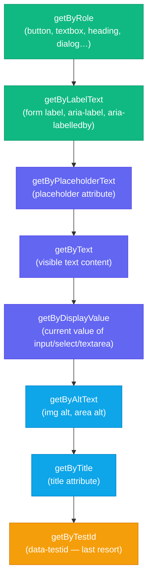

# Component Testing with Testing Library

:::info
A component test renders a UI component into a real or simulated DOM and asserts on what a user can see and do, sitting between fast, isolated unit tests and slow, realistic end-to-end tests. React Testing Library (RTL) is the de facto tool for this layer: it exposes only the queries a user or screen reader could observe (role, label, text, test ID as a last resort) and has no API for reading component state or props directly. This article covers RTL's query priority, the difference between `userEvent` and `fireEvent`, JSDOM's gaps, and five runnable examples spanning synchronous, asynchronous, and multi-provider component tests.
:::

## Context

A component test renders a UI component into a real (or simulated) DOM environment and asserts on what the user sees and can do. It never reads internal state, props, or implementation details. This is the conceptual middle layer between unit tests and end-to-end tests: the component tree is real, but the network, routing, and backend are mocked.

The distinction from a pure unit test is the environment. Unit tests run modules in isolation with no DOM at all. Component tests use JSDOM (or a real browser in Vitest browser mode) to render HTML, apply event listeners, and let you query for elements the same way a user or screen reader would interact with them. A component test for a login form can fill in the email and password fields, click Submit, and assert that the loading spinner appears, without starting a server.

The distinction from an end-to-end test is scope and speed. An E2E test drives a real browser against a running application; it is authoritative but slow and flaky. A component test runs in-process against a DOM simulation: it needs no browser launch, is deterministic, and can be run on every commit.

**React Testing Library (RTL)** is the de facto standard for React component testing. Its core philosophy is stated in the library's Guiding Principles:

> "The more your tests resemble the way your software is used, the more confidence they give you."

RTL exposes one primary rendering API (`render`) and one primary query surface (`screen`). The query surface is intentionally limited to things a user or accessibility tool can observe: roles, labels, text content, placeholder text, display values, alt text, and test IDs (as a last resort). There is no API for reading component state, accessing React fiber nodes, or inspecting prop values; those things are invisible to users and therefore irrelevant to a confidence-giving test.

**Vue Testing Library** and **Svelte Testing Library** provide identical query APIs adapted for their respective frameworks. The mental model, query priority, and behavioral principles transfer directly; only the `render` import and component setup differ.

**Storybook interaction tests** (via the `play` function) offer a complementary approach: they run interaction sequences in a real browser within the Storybook environment, making them useful for visual regression and cross-browser interaction validation alongside the component's story variants.

Cypress Component Testing and Playwright's experimental component testing occupy the same layer in a real browser rather than JSDOM. This article covers the Testing Library approach, which dominates in-process (JSDOM) component testing.

Matchers such as `toBeInTheDocument` and `toHaveTextContent`, used throughout this article's examples, come from `@testing-library/jest-dom`, not from RTL itself. Import `@testing-library/jest-dom/vitest` for Vitest, or `@testing-library/jest-dom` (with globals) / `@testing-library/jest-dom/jest-globals` (with `@jest/globals`) for Jest, in your test setup file; without it, every `expect(...).toBeInTheDocument()` call throws `toBeInTheDocument is not a function`.

## Visual

### RTL Query Priority Ladder

Queries higher in the ladder reflect signals that users and screen readers actually use. Prefer queries at the top; use `getByTestId` only when no accessible alternative exists.



Green: highest confidence (accessible). Purple: moderate confidence. Blue: lower confidence. Amber: escape hatch only.

## Example

Examples assume Vitest with `globals: true`; on Jest, replace `vi.fn()` with `jest.fn()`. All matchers such as `toBeInTheDocument` and `toHaveTextContent` require `@testing-library/jest-dom` imported in the test setup file (see Context).

### 1. Basic RTL test: render, query by role, interact, assert

The component under test is a counter that increments on button click. The test queries by role, uses `userEvent` for the interaction, and asserts on the text content visible to the user.

```tsx
// src/components/Counter.tsx
import { useState } from 'react'

export function Counter() {
  const [count, setCount] = useState(0)
  return (
    <div>
      <p>Count: {count}</p>
      <button type="button" onClick={() => setCount(c => c + 1)}>
        Increment
      </button>
    </div>
  )
}
```

```tsx
// src/components/Counter.test.tsx
import { render, screen } from '@testing-library/react'
import userEvent from '@testing-library/user-event'
import { Counter } from './Counter'

describe('Counter', () => {
  it('increments the count when the button is clicked', async () => {
    // userEvent.setup() creates a user session that tracks pointer/keyboard state
    const user = userEvent.setup()

    render(<Counter />)

    // Query by accessible role — the button must have role="button" and
    // accessible name "Increment". If either is missing, this throws immediately,
    // surfacing the accessibility gap rather than hiding it.
    const button = screen.getByRole('button', { name: 'Increment' })

    // Confirm initial state
    expect(screen.getByText('Count: 0')).toBeInTheDocument()

    // Simulate a real click — dispatches full pointer + mouse + focus event sequence
    await user.click(button)

    // Assert on the DOM state the user observes
    expect(screen.getByText('Count: 1')).toBeInTheDocument()
  })
})
```

### 2. Async test with `findBy` (waiting for async state)

When a component fetches data on mount, the loaded content is not present at render time. `findByRole` returns a Promise that resolves when the element appears, up to the default 1000ms timeout.

```tsx
// src/components/UserProfile.tsx
import { useEffect, useState } from 'react'

interface User { name: string; email: string }

export function UserProfile({ userId }: { userId: string }) {
  const [user, setUser] = useState<User | null>(null)
  const [error, setError] = useState(false)

  useEffect(() => {
    fetch(`/api/users/${userId}`)
      .then(r => r.json())
      .then(setUser)
      .catch(() => setError(true))
  }, [userId])

  if (error) return <p role="alert">Failed to load user.</p>
  if (!user) return <p>Loading…</p>
  return <h2>{user.name}</h2>
}
```

```tsx
// src/components/UserProfile.test.tsx
import { render, screen } from '@testing-library/react'
import { UserProfile } from './UserProfile'

// Mock the global fetch so the test does not hit a real network
beforeEach(() => {
  global.fetch = vi.fn().mockResolvedValue({
    ok: true,
    json: async () => ({ name: 'Alice Chen', email: 'alice@example.com' }),
  })
})

afterEach(() => {
  vi.restoreAllMocks()
})

it('displays the user name after the fetch resolves', async () => {
  render(<UserProfile userId="user-1" />)

  // The component renders "Loading…" initially. findByRole waits until the
  // heading appears — no manual setTimeout or waitFor needed.
  const heading = await screen.findByRole('heading', { name: 'Alice Chen' })
  expect(heading).toBeInTheDocument()
})

it('displays an error alert when the fetch fails', async () => {
  global.fetch = vi.fn().mockRejectedValue(new Error('Network error'))

  render(<UserProfile userId="user-2" />)

  const alert = await screen.findByRole('alert')
  expect(alert).toHaveTextContent('Failed to load user.')
})
```

### 3. `queryBy` for asserting an element is NOT present

`getByRole` throws when no match is found. That is the right behavior when you expect the element to be there. When you need to assert that something is absent, use `queryByRole`, which returns `null` on miss.

```tsx
// src/components/ErrorBanner.tsx
interface Props { error: string | null }

export function ErrorBanner({ error }: Props) {
  if (!error) return null
  return <div role="alert">{error}</div>
}
```

```tsx
// src/components/ErrorBanner.test.tsx
import { render, screen } from '@testing-library/react'
import { ErrorBanner } from './ErrorBanner'

it('renders the error message when error is provided', () => {
  render(<ErrorBanner error="Something went wrong." />)
  expect(screen.getByRole('alert')).toHaveTextContent('Something went wrong.')
})

it('renders nothing when error is null', () => {
  render(<ErrorBanner error={null} />)

  // queryByRole returns null instead of throwing — correct tool for absence assertions
  expect(screen.queryByRole('alert')).not.toBeInTheDocument()
})
```

### 4. Vue Testing Library equivalent

Vue Testing Library uses the same `screen` query API. The difference is the import path and how components are imported. The behavior assertions are byte-for-byte identical to the React version.

```vue
<!-- src/components/Counter.vue -->
<script setup lang="ts">
import { ref } from 'vue'
const count = ref(0)
</script>

<template>
  <div>
    <p>Count: {{ count }}</p>
    <button type="button" @click="count++">Increment</button>
  </div>
</template>
```

```ts
// src/components/Counter.test.ts
import { render, screen } from '@testing-library/vue'
import userEvent from '@testing-library/user-event'
import Counter from './Counter.vue'

describe('Counter', () => {
  it('increments the count when the button is clicked', async () => {
    const user = userEvent.setup()

    render(Counter)

    const button = screen.getByRole('button', { name: 'Increment' })
    expect(screen.getByText('Count: 0')).toBeInTheDocument()

    await user.click(button)

    expect(screen.getByText('Count: 1')).toBeInTheDocument()
  })
})
```

The query API is shared across React, Vue, Svelte, Angular, and Solid adapters. A frontend engineer who knows RTL can read and write Vue Testing Library tests without consulting new documentation.

### 5. Custom render wrapper (providers: router, theme, i18n)

Real applications wrap their component tree with providers: a router, a theme context, an i18n context, a Redux store. Rendering `<LoginForm />` in a test that expects `useNavigate()` to work will throw unless the router provider is present.

The standard solution is a custom `renderWithProviders` function that wraps the component in all the providers the application uses. Tests call this instead of the bare `render` from RTL.

```tsx
// src/test/renderWithProviders.tsx
import { ReactNode } from 'react'
import { render, RenderOptions } from '@testing-library/react'
import { MemoryRouter } from 'react-router-dom'
import { ThemeProvider } from '../theme/ThemeProvider'
import { I18nProvider } from '../i18n/I18nProvider'

interface WrapperProps { children: ReactNode }

function AllProviders({ children }: WrapperProps) {
  return (
    // MemoryRouter instead of BrowserRouter — no real URL bar in JSDOM
    <MemoryRouter initialEntries={['/']}>
      <ThemeProvider theme="light">
        <I18nProvider locale="en-US">
          {children}
        </I18nProvider>
      </ThemeProvider>
    </MemoryRouter>
  )
}

export function renderWithProviders(
  ui: React.ReactElement,
  options?: Omit<RenderOptions, 'wrapper'>
) {
  return render(ui, { wrapper: AllProviders, ...options })
}
```

```tsx
// src/components/LoginForm.test.tsx
import { screen } from '@testing-library/react'
import userEvent from '@testing-library/user-event'
import { renderWithProviders } from '../test/renderWithProviders'
import { LoginForm } from './LoginForm'

it('submits the form with email and password', async () => {
  const user = userEvent.setup()
  const onSubmit = vi.fn()

  renderWithProviders(<LoginForm onSubmit={onSubmit} />)

  await user.type(screen.getByLabelText('Email'), 'alice@example.com')
  await user.type(screen.getByLabelText('Password'), 'correct-horse')
  await user.click(screen.getByRole('button', { name: 'Log in' }))

  expect(onSubmit).toHaveBeenCalledWith({
    email: 'alice@example.com',
    password: 'correct-horse',
  })
})
```

## Best Practices

**SHOULD prefer `getByRole` and `getByLabelText` over `getByTestId` as the first query strategy.** The Testing Library documentation designates `getByRole` as the top-priority query because it targets the same signals screen readers and keyboard users rely on. If `getByRole('button', { name: 'Submit' })` cannot find your button, the button either lacks an accessible role or lacks an accessible name, which means screen reader and keyboard users cannot activate it either. You MUST NOT reach for `getByTestId` until all semantic queries are exhausted.

**SHOULD use `userEvent.setup()` instead of `fireEvent` for interaction tests.** `userEvent` dispatches the full browser event sequence that a real user's action produces: pointerdown, mousedown, focus, keydown, input, keyup, change, blur. `fireEvent` dispatches a single synthetic event and MUST NOT be used when the component relies on per-keystroke logic, focus management, or `onMouseDown` rather than `onClick`. With `@testing-library/user-event` v14+, call `userEvent.setup()` at the top of each test to maintain pointer and selection state across multiple interactions.

**MUST assert only on observable DOM output, not on internal state or refs.** A test that reads `component.state.isLoading` or a React ref value is coupled to implementation details that break whenever you extract logic to a custom hook or rename an internal variable, even when the rendered UI is identical. Tests MUST verify only what the user observes: rendered text, ARIA attributes, disabled state, and visible error messages.

**MUST use `queryBy*` for absence assertions and `findBy*` for async content.** `getBy*` throws immediately when no match is found, so `expect(screen.getByRole('alert')).not.toBeInTheDocument()` will throw before the `expect` runs if the element is absent. You MUST use `queryBy*` for absence assertions. Similarly, `findBy*` returns a Promise and MUST be awaited; forgetting `await` causes the assertion to evaluate an unresolved Promise object, which is always truthy.

## Design Thinking

### Why RTL replaced Enzyme

RTL is the de facto standard for new React test suites. Enzyme, dominant from roughly 2016 to 2019, shipped its last release in December 2019 and never gained an official React 18 adapter, which turned every React 18 upgrade with an Enzyme suite into a migration project. Many teams were still doing that migration in the mid-2020s. Enzyme's primary feature was the ability to shallow-render a component: rendering only the component under test without its children, and inspecting its internal state and prop values directly.

```js
// Enzyme — tests implementation details
const wrapper = shallow(<LoginForm onSubmit={mockSubmit} />)
wrapper.find('PasswordInput').prop('onChange')({ target: { value: 'secret' } })
expect(wrapper.state('password')).toBe('secret')
wrapper.find('button[type="submit"]').simulate('click')
expect(mockSubmit).toHaveBeenCalledWith({ password: 'secret' })
```

This style of test has two compounding problems. First, `wrapper.find('PasswordInput')` is coupled to the component tree structure. Rename the child component and the test breaks, even though the user-visible behavior is identical. Second, `wrapper.state('password')` is coupled to React's class component state API, which meant Enzyme tests required a major rewrite when teams migrated from class to function components. Enzyme became a migration blocker.

The deeper problem is confidence. A test that passes by calling `.prop('onChange')` directly has verified that the prop is wired. It has not verified that a user typing in the field actually triggers that change handler. If the handler is never actually attached to the DOM input, the Enzyme test still passes; a user typing in the field sees nothing happen.

RTL closes this gap by refusing to expose internal APIs. The only way to interact with a component in RTL is through the DOM: query for an element, fire an event on it, and observe what changes in the DOM. This is slower to write for complex components but produces tests that survive refactors and catch real behavior regressions.

### The accessible query hierarchy

RTL provides multiple query strategies and recommends using them in priority order, shown in the ladder above. The hierarchy is not arbitrary: queries higher in the ladder query the same signals that users and screen readers use, which means writing tests that use them forces you to build accessible components.

If `getByRole('button', { name: 'Submit' })` fails to find your Submit button, one of these is true: the button does not have the `button` role (it may be a `<div>` or `<span>`), it does not have the accessible name "Submit" (it may be missing visible text or an `aria-label`), or it does not exist in the rendered DOM at all.

`getByTestId` exists at the bottom of the hierarchy because it carries no semantic meaning. A `data-testid` attribute tells a screen reader nothing. A test built on it passes even when the element is unreachable by keyboard.

### Query variants: `getBy`, `queryBy`, `findBy`

Each query family has three forms with different behaviors on miss and on async resolution:

- `getBy*`: synchronous, throws an error if no match. Use for elements that must be present.
- `queryBy*`: synchronous, returns `null` if no match. Use to assert an element is absent: `expect(queryByRole('alert')).not.toBeInTheDocument()`.
- `findBy*`: returns a Promise that resolves when the element appears, with a configurable timeout (default 1000ms). Use for elements that appear after an async operation (data fetch, setTimeout, animation).

There are also `getAllBy*`, `queryAllBy*`, and `findAllBy*` variants that return arrays when multiple matches are expected.

### `userEvent` vs `fireEvent`

`fireEvent.click(button)` dispatches a single `click` event. `userEvent.click(button)` dispatches the full pointer and mouse event sequence: `pointerover`, `pointerenter`, `mouseover`, `mouseenter`, `pointermove`, `mousemove`, `pointerdown`, `mousedown`, focus events, `pointerup`, `mouseup`, `click`. For most click handlers, the difference is invisible. For components that use `onMouseDown` instead of `onClick`, or that implement focus traps, or that handle `onBlur` to validate fields, the difference is decisive.

`userEvent.type(input, 'hello')` dispatches a separate `keydown`, `keypress`, `input`, `keyup` sequence for every character. This is what triggers input masking, character count limits enforced via `onInput`, and IME composition handling. `fireEvent.change(input, { target: { value: 'hello' } })` sets the value and fires one change event. It bypasses all per-keystroke logic.

In `@testing-library/user-event` v14+ (current: 14.6.x), `setup()` is the recommended entry point. It creates a `userEvent` instance that maintains pointer state and selection state across multiple interactions within a test, which more closely mirrors a real browser session.

### `act()` and when it matters

React batches state updates and defers effects (via `useEffect`) to after the current render. When a test triggers state changes, React needs to flush those updates before the test can assert on the resulting DOM. `act()` wraps an interaction to ensure all state updates, effects, and re-renders complete before the next line of code runs.

RTL wraps `render` and `fireEvent` in `act()` automatically; queries are read-only and need no wrapping. In `@testing-library/user-event` v14+, `userEvent` also calls `act()` internally. The cases where you must call `act()` manually are narrow: when you trigger an async state update outside RTL's control (e.g., a `setInterval` callback or a `Promise` that resolves outside the test's `await` chain). In practice, `findBy*` queries handle most async cases without requiring manual `act()`.

### JSDOM limitations

JSDOM implements most of the DOM specification but has no layout engine. This means:

- `element.getBoundingClientRect()` always returns zeros. You cannot test CSS-based layout, element visibility by position, or scroll behavior.
- `ResizeObserver` and `IntersectionObserver` are not implemented and require manual mocks in test setup. `MutationObserver` has been supported since jsdom 13.2.
- `canvas` APIs are not implemented. Canvas-based components require mocking or must be tested in a real browser (Vitest browser mode, Playwright).
- CSS Media Query matching based on viewport dimensions does not work.

When your component relies on these browser APIs, mock the missing API (typically `ResizeObserver`) in your test setup file, or use Vitest browser mode to run the test in a real Chromium, Firefox, or WebKit instance. Vitest browser mode provides its own retrying locator API (`page.getByRole` from `vitest/browser` in Vitest 4+, previously `@vitest/browser/context`, with `vitest-browser-react` for rendering); the Vitest team recommends it over Testing Library queries when running in a real browser.

### Storybook interaction tests vs RTL

Storybook `play` functions run interaction sequences inside a real browser alongside the story's visual rendering. This makes them the right tool for:

- Visual regression: confirming the component looks correct after an interaction
- Cross-browser interaction: catching browser-specific event handling differences
- Component documentation: making interactive states discoverable for designers and stakeholders

The Vitest addon, introduced experimentally in Storybook 8.3 and made stable in Storybook 9 as part of Storybook Test, runs stories directly as Vitest tests in CI, including coverage collection, which closes much of the historical gap with RTL on CI integration.

RTL in JSDOM is the right tool for:

- Fast CI feedback: an RTL suite runs in seconds with no browser launch or Storybook build step
- Complex logic testing: conditional rendering, form validation, async data states
- Minimal setup: no story files or addon configuration required to test a single behavior

Most teams run both: RTL for behavior logic, Storybook for visual documentation. Storybook interaction tests then cover only the most critical user flows that benefit from visual validation.

## Common Mistakes

**Wrapping `userEvent` calls in manual `act()`.** `@testing-library/user-event` v14+ (current: 14.6.x) handles `act()` internally, independent of React Testing Library's own version (currently v16.x). Manually wrapping `await user.click(button)` in `act()` is redundant and can cause double-flush warnings. Remove manual `act()` wrappers and let RTL manage the React update cycle.

**Neglecting cleanup between tests.** RTL calls `cleanup()` automatically after each test when you use a modern test runner (Vitest, Jest) with the correct setup. If you see tests that pass in isolation but fail when run together, check for shared mutable state outside the component: global fetch mocks, module-level singletons, or event listeners attached to `document` without cleanup.

## Related Topics

- [FEE-1100 Testing Strategies Overview](/en/Testing%20Strategies/1100): the testing pyramid and cost-confidence trade-offs across layers
- [FEE-1101 Unit Testing with Vitest & Jest](/en/Testing%20Strategies/1101): Vitest as the test runner underlying RTL component tests
- [FEE-1104 Mocking Strategies](/en/Testing%20Strategies/1104): mocking network requests in component tests with MSW; vi.fn() for callbacks
- [FEE-1107 Coverage Philosophy](/en/Testing%20Strategies/1107): why component test coverage numbers require the same scepticism as unit test coverage

## References

- Testing Library, "Guiding Principles," testing-library.com (accessed 2026). https://testing-library.com/docs/guiding-principles
- Testing Library, "Queries," testing-library.com (accessed 2026). https://testing-library.com/docs/queries/about
- Testing Library, "user-event," testing-library.com (accessed 2026). https://testing-library.com/docs/user-event/intro
- Testing Library, "Vue Testing Library," testing-library.com (accessed 2026). https://testing-library.com/docs/vue-testing-library/intro/
- Kent C. Dodds, "Common mistakes with React Testing Library," kentcdodds.com (2020). https://kentcdodds.com/blog/common-mistakes-with-react-testing-library
- Kent C. Dodds, "Making your UI tests resilient to change," kentcdodds.com (2019). https://kentcdodds.com/blog/making-your-ui-tests-resilient-to-change
- Kent C. Dodds, "Why I Never Use Shallow Rendering," kentcdodds.com (2018). https://kentcdodds.com/blog/why-i-never-use-shallow-rendering
- Wojciech Maj, "Enzyme is dead. Now what?," dev.to (2021). https://dev.to/wojtekmaj/enzyme-is-dead-now-what-ekl
