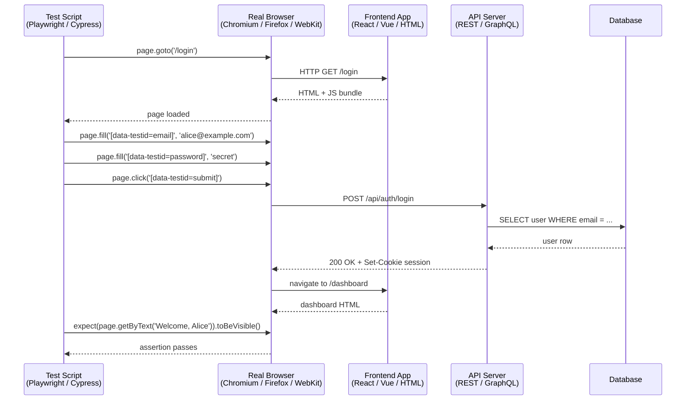

# End-to-End Testing: Playwright & Cypress

## Context

An end-to-end (E2E) test drives a real browser through your application the way a real user would: it navigates to a URL, fills in a form, clicks a button, and asserts on what appears in the DOM — while the full stack runs behind it. The browser talks to your frontend application, which calls your API server, which queries a real (or test-isolated) database, and the response travels back through the network stack to produce a DOM change that the test runner asserts on.

This makes E2E tests the only layer in the testing pyramid that can catch an entire class of integration bugs: a broken auth flow, a misconfigured API route, a Content Security Policy that blocks a required script, a CORS header missing in production but present in local development. No unit test or component test can find these, because they only exist when the entire system is wired together.

**Playwright** is a Microsoft-developed browser automation framework released in 2020. It controls Chromium, Firefox, and WebKit (Safari's engine) from a single API, runs tests in parallel by default across browsers and workers, and ships a trace viewer that records every action, network request, and DOM snapshot so failures can be debugged after the fact without re-running the test. Playwright's architecture drives browsers directly over the Chrome DevTools Protocol (Chromium) and equivalent protocols for Firefox and WebKit, with no intermediate server — which eliminates an entire category of flakiness and startup latency.

**Cypress** pioneered the modern E2E developer experience when it launched in 2015. It runs tests inside the same browser event loop as the application, enabling its signature feature: a time-travel debugger that lets you hover over any command in the test log and see the DOM state at that exact moment, with a DOM snapshot pinned to the browser viewport. Cypress also introduced network stubbing via `cy.intercept()` and real-time test re-running on file save. It runs in real browsers (Chrome, Firefox, Edge) but not WebKit. Cypress Cloud provides parallelisation across machines, flakiness analytics, and test replay for teams.

Both tools have evolved toward feature parity over time — both now offer component testing modes that mount components without a full application running. But they remain meaningfully different in architecture, speed defaults, and debugging ergonomics.

## Design Thinking

### Why E2E sits at the top of the pyramid but is irreplaceable

The testing pyramid says to write fewer E2E tests than unit tests because E2E tests are slower, harder to maintain, and flakier. This is true. But the pyramid is not a ranking of value — it is a cost-efficiency guide. E2E tests are irreplaceable because they are the only layer that tests the full stack simultaneously.

Consider a login flow. A unit test can verify that the password-hashing function produces the correct hash. A component test can verify that the login form dispatches the correct action when submitted. A contract test can verify that the API endpoint accepts the correct request shape. None of these tests catch the bug where the API endpoint is mounted at `/api/v2/auth/login` in production but the frontend is calling `/api/auth/login` — a real bug class that only appears when the browser, the frontend, the network layer, and the API server are all running together.

E2E tests also catch CSP violations (a script is blocked by the Content-Security-Policy header), auth cookie domain mismatches (the cookie is set on `.api.example.com` but the frontend is on `app.example.com`), and redirect loops caused by middleware configuration. These are integration bugs, and integration bugs require integration tests.

### Why Playwright won the speed race

Playwright's architecture makes it faster than Cypress for large test suites in three concrete ways.

First, Playwright runs tests in parallel by default — across browsers and across worker processes simultaneously. Each worker has its own browser context with isolated cookies, storage, and network state. A suite of 100 tests runs as a parallel grid, not as a sequential queue.

Second, Playwright requires no Electron server. Cypress runs a Node.js server alongside the browser to proxy network requests and enable `cy.intercept()`. This server adds startup latency and is an additional failure point. Playwright drives browsers directly via the DevTools Protocol without any intermediate process.

Third, Playwright's browser context is lighter than a full browser profile. Creating a new context (equivalent to a fresh browser session) takes milliseconds. Cypress reloads the browser page between tests, which is slower.

For a team with 500 E2E tests, Playwright's parallel-by-default architecture can reduce CI runtime from 40 minutes to 8 minutes with 4-way sharding across machines.

### Why Cypress still has fans: the time-travel debugger

Playwright wins on throughput. Cypress wins on debugging ergonomics.

When a Playwright test fails in CI, you have a trace file (if configured) that records every action, network request, console message, and DOM snapshot. You can open the Playwright Trace Viewer, scrub through the timeline, and inspect the DOM at the failing assertion. This is powerful but requires downloading the trace artifact and opening the viewer.

When a Cypress test fails locally, you click on the failing command in the test log and the browser viewport shows you the DOM at that exact moment — no artifact download, no separate tool, no re-run needed. The time-travel debugger is available in the same browser window where the test ran. For a team whose developers spend significant time debugging E2E failures, this UX advantage is real.

Cypress also benefits from a larger ecosystem of plugins and a longer history of community-developed patterns. If your team is already running Cypress and has built institutional knowledge around it, the migration cost to Playwright may not be justified unless parallelism is a pain point.

### The flakiness problem

E2E tests fail intermittently due to timing issues, network latency, animation, and CI environment variance. A test that passes 95% of the time is worse than no test — it erodes trust in the entire suite and causes developers to re-run tests until they pass rather than investigating failures.

Mitigations, in order of effectiveness:

**Auto-wait.** Both Playwright and Cypress wait automatically for elements to appear and become actionable before interacting with them. Playwright's `page.click(locator)` retries the click until the element is stable, visible, and not obscured. Cypress commands are built on a retry-until-timeout model. This eliminates most timing issues that arise from async rendering.

**Retry assertions.** Playwright's `expect(locator).toBeVisible()` retries the assertion until it passes or times out, rather than checking once at the moment the line executes. This handles the case where the element appears 200ms after the action that should have produced it.

**Stable selectors.** `[data-testid="submit-button"]` does not change when the button's CSS class changes from `btn-primary` to `btn-submit` or when the button's text changes from "Submit" to "Send". Using `data-testid` as the selector contract between component and test eliminates an entire class of selector flakiness.

**Retry on failure.** Configure `retries: 2` on CI. This absorbs one-off infrastructure failures (a flaky network call, a momentary CPU spike that delays rendering). Do not use retries to mask systematic flakiness — if a test fails consistently on the second retry, investigate the root cause.

**Test isolation.** Tests that share state fail intermittently depending on execution order. Each test should own its data. Use Playwright's `test.beforeEach` to create a fresh user account and log in, or use Playwright's `storageState` to restore a pre-authenticated session from a fixture file rather than re-running the login flow on every test.

### Page Object Model (POM)

The Page Object Model is a design pattern that encapsulates page interactions in a class, so tests describe user intent ("log in as Alice") rather than implementation ("navigate to /login, find the email input by data-testid, type alice@example.com, find the password input, type the password, click the submit button"). When the login page's structure changes, only the Page Object needs updating — not every test that uses login.

A POM class for a login page exposes methods like `login(email, password)`, `getErrorMessage()`, and `assertLoggedIn()`. The methods contain the Playwright or Cypress calls. Tests import the class and call methods.

## Best Practices

**USE ACCESSIBLE LOCATORS (`getByRole`, `getByLabel`) AS THE FIRST CHOICE AND `data-testid` ONLY AS A FALLBACK FOR E2E SELECTORS.** Playwright's official documentation designates role-based and label-based locators as the top priority because they target user-facing attributes that survive CSS refactors and markup restructuring. CSS class selectors MUST NOT be used as E2E locators — they break on every design system rename. Reserve `data-testid` for elements that genuinely have no accessible role or label.

**CONFIGURE `retries: 2` ON CI AND USE AUTO-WAITING ASSERTIONS INSTEAD OF EXPLICIT SLEEPS.** Both Playwright and Cypress auto-wait for elements to appear and become actionable before acting. `expect(locator).toBeVisible()` retries internally until the condition passes or the timeout expires, so `page.waitForTimeout()` MUST NOT appear in a test that can be expressed as an assertion. CI retries SHOULD be set to 2 to absorb one-off infrastructure failures; a test that requires more than two retries has a systematic flakiness problem that MUST be investigated.

**KEEP EACH E2E TEST COMPLETELY ISOLATED — NO SHARED MUTABLE STATE BETWEEN TESTS.** A test that depends on data created by a prior test fails intermittently whenever the runner parallelises or reorders tests. Each test MUST create its own data in a `beforeEach` fixture or use Playwright's `storageState` to restore a pre-authenticated session rather than sharing login state across the suite.

**ENCAPSULATE PAGE INTERACTIONS IN PAGE OBJECT MODEL CLASSES, NOT IN RAW TEST FILES.** When locator logic lives in test files, a single UI change requires editing every test that touches that page. A POM class exposes intent-level methods (`loginPage.login(email, password)`) and centralises all locator references so that a structural change SHOULD require updating only one class, not every test. Playwright's official best-practices guide endorses this pattern explicitly.

## Visual

### E2E Test Flow

The test script drives the browser, which runs the full application stack. The assertion happens on the DOM output of the complete round trip.



## Example

### 1. Playwright test: login flow with accessible locators

Playwright's `page.getByRole` and `page.getByLabel` query the accessibility tree, not the DOM structure. These are the preferred locator methods when the HTML is accessible; `data-testid` is the fallback when no accessible query applies.

```ts
// tests/login.spec.ts
import { test, expect } from '@playwright/test'

test('logs in with valid credentials and lands on dashboard', async ({ page }) => {
  await page.goto('/login')

  // getByLabel queries the <label> element associated with the input.
  // If the association is missing, this fails immediately — surfacing a
  // real accessibility problem rather than hiding it.
  await page.getByLabel('Email').fill('alice@example.com')
  await page.getByLabel('Password').fill('correct-horse-battery')

  // getByRole finds the button by its ARIA role and accessible name.
  await page.getByRole('button', { name: 'Log in' }).click()

  // Playwright auto-waits for this text to appear in the DOM.
  await expect(page.getByText('Welcome, Alice')).toBeVisible()

  // Assert the URL changed — confirms routing worked end-to-end.
  await expect(page).toHaveURL('/dashboard')
})

test('shows an error for invalid credentials', async ({ page }) => {
  await page.goto('/login')

  await page.getByLabel('Email').fill('alice@example.com')
  await page.getByLabel('Password').fill('wrong-password')
  await page.getByRole('button', { name: 'Log in' }).click()

  // data-testid as fallback — error banners often lack accessible roles
  await expect(page.getByTestId('error-banner')).toBeVisible()
  await expect(page.getByTestId('error-banner')).toHaveText('Invalid email or password.')
})
```

### 2. Playwright config: retries, sharding, multi-browser

```ts
// playwright.config.ts
import { defineConfig, devices } from '@playwright/test'

export default defineConfig({
  testDir: './tests',

  // Retry failing tests twice on CI to absorb transient flakiness.
  // Locally, retries are disabled so failures are visible immediately.
  retries: process.env.CI ? 2 : 0,

  // Run tests in parallel across workers (default: number of CPU cores).
  workers: process.env.CI ? 4 : undefined,

  // Collect traces on the first retry so CI artifacts contain
  // DOM snapshots, network requests, and console logs for failures.
  use: {
    baseURL: process.env.BASE_URL ?? 'http://localhost:5173',
    trace: 'on-first-retry',
    screenshot: 'only-on-failure',
  },

  projects: [
    // Test across all three major browser engines.
    {
      name: 'chromium',
      use: { ...devices['Desktop Chrome'] },
    },
    {
      name: 'firefox',
      use: { ...devices['Desktop Firefox'] },
    },
    {
      name: 'webkit',
      use: { ...devices['Desktop Safari'] },
    },
  ],

  // Start the dev server before running tests if not already running.
  webServer: {
    command: 'pnpm dev',
    url: 'http://localhost:5173',
    reuseExistingServer: !process.env.CI,
  },
})
```

Run a specific shard on CI to distribute tests across machines:

```bash
# Run shard 1 of 4 (each CI machine runs a different shard)
npx playwright test --shard=1/4

# Run shard 2 of 4 on another CI machine
npx playwright test --shard=2/4
```

GitHub Actions example with 4-way sharding:

```yaml
# .github/workflows/e2e.yml
name: E2E Tests

on: [push, pull_request]

jobs:
  test:
    runs-on: ubuntu-latest
    strategy:
      matrix:
        shard: [1, 2, 3, 4]
    steps:
      - uses: actions/checkout@v4
      - uses: actions/setup-node@v4
        with:
          node-version: 20
      - run: pnpm install
      - run: pnpx playwright install --with-deps chromium
      - run: pnpm exec playwright test --shard=${{ matrix.shard }}/4
        env:
          CI: true
          BASE_URL: http://localhost:5173
      - uses: actions/upload-artifact@v4
        if: failure()
        with:
          name: playwright-report-${{ matrix.shard }}
          path: playwright-report/
```

### 3. Cypress test: visit, data-testid selectors, network stubbing

```ts
// cypress/e2e/login.cy.ts
describe('Login', () => {
  it('logs in with valid credentials', () => {
    // Stub the API call so the test does not depend on a running backend.
    // cy.intercept() intercepts the network request before it leaves the browser.
    cy.intercept('POST', '/api/auth/login', {
      statusCode: 200,
      body: { token: 'test-jwt', user: { name: 'Alice', email: 'alice@example.com' } },
    }).as('loginRequest')

    cy.visit('/login')

    // data-testid selectors are stable across UI redesigns.
    cy.get('[data-testid="email-input"]').type('alice@example.com')
    cy.get('[data-testid="password-input"]').type('correct-horse-battery')
    cy.get('[data-testid="login-submit"]').click()

    // Wait for the intercepted request to complete.
    cy.wait('@loginRequest')

    // Assert on the outcome in the DOM.
    cy.contains('Welcome, Alice').should('be.visible')
    cy.url().should('include', '/dashboard')
  })

  it('shows an error banner for failed login', () => {
    cy.intercept('POST', '/api/auth/login', {
      statusCode: 401,
      body: { error: 'Invalid email or password.' },
    }).as('loginFailed')

    cy.visit('/login')

    cy.get('[data-testid="email-input"]').type('alice@example.com')
    cy.get('[data-testid="password-input"]').type('wrong-password')
    cy.get('[data-testid="login-submit"]').click()

    cy.wait('@loginFailed')

    cy.get('[data-testid="error-banner"]')
      .should('be.visible')
      .and('contain.text', 'Invalid email or password.')
  })
})
```

### 4. Page Object Model for login page (Playwright)

The `LoginPage` class encapsulates all locators and interactions for the login page. Tests import the class and call methods — when the login page changes, only the POM class needs updating.

```ts
// tests/pages/LoginPage.ts
import { type Page, type Locator, expect } from '@playwright/test'

export class LoginPage {
  readonly page: Page
  readonly emailInput: Locator
  readonly passwordInput: Locator
  readonly submitButton: Locator
  readonly errorBanner: Locator

  constructor(page: Page) {
    this.page = page
    // Use accessible locators where possible; data-testid as fallback.
    this.emailInput = page.getByLabel('Email')
    this.passwordInput = page.getByLabel('Password')
    this.submitButton = page.getByRole('button', { name: 'Log in' })
    this.errorBanner = page.getByTestId('error-banner')
  }

  async goto() {
    await this.page.goto('/login')
  }

  async login(email: string, password: string) {
    await this.emailInput.fill(email)
    await this.passwordInput.fill(password)
    await this.submitButton.click()
  }

  async assertLoggedIn(userName: string) {
    await expect(this.page.getByText(`Welcome, ${userName}`)).toBeVisible()
    await expect(this.page).toHaveURL('/dashboard')
  }

  async assertErrorVisible(message: string) {
    await expect(this.errorBanner).toBeVisible()
    await expect(this.errorBanner).toHaveText(message)
  }
}
```

```ts
// tests/login.spec.ts — using the Page Object
import { test } from '@playwright/test'
import { LoginPage } from './pages/LoginPage'

test('logs in successfully', async ({ page }) => {
  const loginPage = new LoginPage(page)
  await loginPage.goto()
  await loginPage.login('alice@example.com', 'correct-horse-battery')
  await loginPage.assertLoggedIn('Alice')
})

test('shows error for wrong password', async ({ page }) => {
  const loginPage = new LoginPage(page)
  await loginPage.goto()
  await loginPage.login('alice@example.com', 'wrong-password')
  await loginPage.assertErrorVisible('Invalid email or password.')
})
```

The POM pattern scales well: when the login page gains a "Remember me" checkbox or a CAPTCHA, you add one method to `LoginPage` — not a change spread across every test that exercises login.

## Common Mistakes

**Testing everything through E2E.** An E2E test that verifies 15 form validation rules is 10 times more expensive to run than 15 unit tests of the validation function. Use E2E tests to verify that the validation system is wired in and that one representative error message appears; use unit tests to verify every rule exhaustively. E2E coverage should be proportional to integration risk, not to feature completeness.

**Not generating a codegen script to start.** Both Playwright (`playwright codegen <url>`) and Cypress (`cypress open` with the Selector Playground) can record a test skeleton from real browser interactions. Running codegen first for a new test saves time and produces valid locator syntax. The generated test is a starting point, not a finished test — it always needs manual cleanup, readable assertions, and POM extraction.

**Ignoring the trace viewer on failures.** When a Playwright test fails in CI and the trace is configured (`trace: 'on-first-retry'`), the trace artifact contains every action, network request, and DOM snapshot from the failing run. Opening the Playwright Trace Viewer (`npx playwright show-trace trace.zip`) reproduces the failure without re-running the test. Teams that do not configure traces spend hours re-running flaky tests trying to reproduce failures that the trace would have explained in minutes.

## Related FEEs

- [FEE-1100 Testing Strategies Overview](./1100.md) — the testing pyramid, cost-confidence trade-offs, and where E2E sits relative to unit and component testing
- [FEE-1104 Mocking Strategies](./1104.md) — MSW for API mocking in component tests; `cy.intercept()` and Playwright route interception for E2E network stubbing
- [FEE-1107 Coverage Philosophy](./1107.md) — why E2E coverage metrics are misleading and how to reason about E2E test value

## References

- [Playwright — Getting Started](https://playwright.dev/docs/intro) — official installation, test structure, and first test walkthrough
- [Playwright — Configuration](https://playwright.dev/docs/test-configuration) — retries, sharding, projects (multi-browser), webServer, and trace configuration
- [Playwright — Locators](https://playwright.dev/docs/locators) — `getByRole`, `getByLabel`, `getByTestId`, and the locator priority rationale
- [Playwright — Trace Viewer](https://playwright.dev/docs/trace-viewer) — recording traces, viewing DOM snapshots, and debugging CI failures
- [Cypress — Introduction](https://docs.cypress.io/guides/overview/why-cypress) — Cypress architecture, real browser testing, and time-travel debugger
- [Cypress — `cy.intercept()`](https://docs.cypress.io/api/commands/intercept) — network stubbing, request aliasing, and response fixtures
- [Playwright vs Cypress — Checkly Engineering Blog](https://www.checklyhq.com/blog/cypress-vs-playwright/) — detailed comparison of architecture, speed, debugging DX, and multi-browser support
