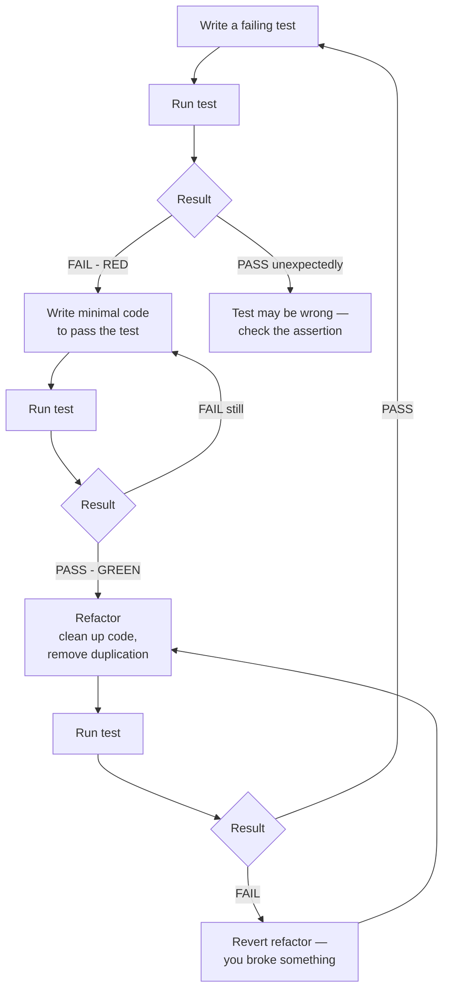

# Test-Driven Development (TDD)

## Context

Test-Driven Development is a software development practice where you write a failing test before writing any production code. The sequence is: write a test that expresses an intent, watch it fail (confirming the test is real), write the minimum code that makes it pass, then refactor the code while keeping the tests green.

Kent Beck formalized TDD in *Test-Driven Development: By Example* (2002), framing it not as a testing technique but as a design technique — a way to let tests drive you toward cleaner, simpler implementations.

The practice splits into two recognized schools:

**Inside-Out TDD (Detroit / Classicist)** — start at the lowest level. Write a failing unit test for a small function, make it pass, compose those tested units into larger structures. You discover the design as you build from the bottom up. The classicist school prefers real collaborators over mocks wherever possible; tests verify observable state rather than internal interactions. This is the original Beck model.

**Outside-In TDD (London / Mockist)** — start at the outermost boundary, typically an acceptance test or an E2E test. Let the failing high-level test drive you inward: it fails because a component doesn't exist, which drives a failing component test, which drives a failing unit test. You discover interfaces from the outside in — the caller's perspective dictates the shape of each layer before it is implemented. This approach makes heavy use of mocks for collaborators that don't exist yet.

Neither school is correct in isolation. Most practitioners blend them: start outside-in to establish the feature boundary, switch inside-out once the design is clear.

## Design Thinking

### Why TDD produces better API design

When you write a test first, you are forced to call the code you haven't written yet. You have to decide: what should this function be named? What arguments does it take? What does it return? How does the caller handle failure?

This is the most important benefit of TDD, and it is consistently underestimated. An API designed test-first has at least one real caller before it exists: the test. If calling the code in a test feels awkward — if you need ten lines of setup before you can exercise one behavior — that awkwardness is telling you something. The API is wrong. Fix the design, not the test.

APIs designed implementation-first often drift toward "convenient for the author" rather than "convenient for the caller." You build what's easy to implement, then document it, then hope consumers find it usable. TDD inverts this: you build what's easy to use, then implement it.

### Why TDD is harder in frontend than backend

A pure function test is three lines: call the function, assert the return value, done. A component test requires a DOM environment, a rendering pass, async state resolution, and often mocked browser APIs. The test setup cost is higher.

React Testing Library reduces this significantly by hiding the rendering details behind queries that match what a user sees. But even with RTL, component tests require more scaffolding than pure function tests. The payoff — catching regressions in rendered output, user interaction, and async state — is real, but it requires patience with setup.

The practical advice: apply strict TDD to business logic and utility functions (pure functions benefit the most from test-first design). Apply a looser form to components — sketch the component first, then write tests that pin the behavior you care about. Use E2E tests for features where the integration is the risk.

### Why the refactor step is the most neglected

The Red → Green → Refactor cycle has three steps. In practice, most developers stop after Green.

Once tests pass, a psychological pressure arrives: "It works. Ship it." The refactor step is skipped because it feels risky (what if I break something?) and unnecessary (the tests are green).

This is exactly backwards. The green tests are the safety net. You cannot fearlessly refactor code that has no tests. With tests, you can rename variables, extract functions, collapse conditionals, and remove duplication — and know immediately if something breaks. The refactor step is where TDD pays its investment back. Skipping it means you accumulate the same technical debt as if you had never written tests.

The discipline is: don't declare victory at green. Ask: is there duplication? Are names accurate? Is the structure clear to the next reader? Make those changes before moving to the next test.

### What the research shows

A 2008 Microsoft/IBM study (Nagappan, Maximilien, Bhat, Williams — "Realizing quality improvement through test driven development") measured four professional teams switching to TDD. Defect density fell 40–90% across teams. Development time increased 15–35%. The overhead is front-loaded investment; the defect reduction is ongoing return. For any product that runs longer than a sprint, the economics are positive.

Common objection: "TDD slows me down." This is accurate for the first week on a new technique. It is inaccurate as a general claim over a product's lifetime. Debugging time, regression investigation, and the cognitive cost of touching untested code are the slow parts. TDD trades fast coding now for less debugging later.

Common objection: "I don't know what to write yet." Correct response: spike first. Write throwaway exploratory code to understand the problem space, then delete it and start over with TDD once you understand the design. The spike gives you knowledge; the TDD implementation gives you the code you'll actually maintain.

## Best Practices

**CONFIRM THE RED PHASE BEFORE WRITING ANY PRODUCTION CODE — A TEST THAT CANNOT FAIL PROVIDES NO VALUE.** The red-green-refactor cycle is only meaningful when the failing test is a real signal. If a new test passes immediately, either the behavior was already implemented or the test is wrong. You MUST run the test first, observe a genuine failure, and only then write the minimum production code that satisfies it. A test you never saw fail is not a test — it is documentation with no verification.

**WRITE THE MINIMUM CODE THAT MAKES THE TEST PASS, THEN REFACTOR BEFORE MOVING TO THE NEXT TEST.** The refactor step is where TDD's design benefit is realized. Martin Fowler identifies refactoring as essential to TDD: writing tests first forces interface design, and refactoring while tests are green is the mechanism that prevents technical debt accumulation. Skipping the refactor step MUST NOT be rationalized as "it works" — the green tests are the safety net, and the safety net SHOULD be used.

**APPLY STRICT TDD TO PURE FUNCTIONS AND BUSINESS LOGIC; APPLY A LOOSER FORM TO COMPONENTS.** A pure function test is three lines: call, assert, done. Component tests require DOM environment, rendering, and async resolution — the setup cost is higher. You SHOULD write component tests that pin the behavior you care about rather than strictly following red-green-refactor for every JSX line. Reserve outside-in TDD for establishing feature boundaries; switch inside-out once the design is clear.

**SPIKE FIRST WHEN YOU DO NOT YET UNDERSTAND THE PROBLEM SPACE, THEN DELETE THE SPIKE AND TDD THE REAL IMPLEMENTATION.** A spike is exploratory code written without tests to gain knowledge; it MUST NOT become the production implementation. Once the exploration clarifies the design, delete the spike and start TDD from scratch. Treating a spike as a TDD session produces code you do not understand well enough to test-drive, and the resulting tests will match the implementation structure rather than the caller's intent.

## Visual

### TDD Cycle



## Example

### 1. Inside-Out TDD: shopping cart module

Start with a failing test. Nothing is implemented yet.

```ts
// shoppingCart.test.ts — step 1: write the failing test
import { describe, it, expect } from 'vitest'
import { createCart } from './shoppingCart'

describe('createCart', () => {
  it('starts with an empty items list and zero total', () => {
    const cart = createCart()
    expect(cart.items).toEqual([])
    expect(cart.total).toBe(0)
  })
})
```

Run the test. It fails: `Cannot find module './shoppingCart'`. That is a valid red state — the test is expressing an intent that the code does not yet fulfill.

Write the minimum code to pass:

```ts
// shoppingCart.ts — step 2: minimum implementation
export function createCart() {
  return {
    items: [] as CartItem[],
    total: 0,
  }
}
```

Test passes. Now write the next failing test before writing any more code:

```ts
// shoppingCart.test.ts — step 3: next failing test
it('adds an item and updates the total', () => {
  const cart = createCart()
  const updated = addItem(cart, { id: 'p-1', name: 'Widget', price: 9.99, quantity: 2 })
  expect(updated.items).toHaveLength(1)
  expect(updated.total).toBeCloseTo(19.98)
})
```

Red. Now implement:

```ts
// shoppingCart.ts — step 4: implement addItem
export interface CartItem {
  id: string
  name: string
  price: number
  quantity: number
}

export interface Cart {
  items: CartItem[]
  total: number
}

export function createCart(): Cart {
  return { items: [], total: 0 }
}

export function addItem(cart: Cart, item: CartItem): Cart {
  const items = [...cart.items, item]
  const total = items.reduce((sum, i) => sum + i.price * i.quantity, 0)
  return { items, total }
}
```

Green. Now refactor: the total calculation is duplicated logic that will appear in `removeItem` and `updateQuantity` too. Extract it before writing those tests:

```ts
// shoppingCart.ts — step 5: refactor before adding more features
function calculateTotal(items: CartItem[]): number {
  return items.reduce((sum, i) => sum + i.price * i.quantity, 0)
}

export function createCart(): Cart {
  return { items: [], total: 0 }
}

export function addItem(cart: Cart, item: CartItem): Cart {
  const items = [...cart.items, item]
  return { items, total: calculateTotal(items) }
}
```

Run tests after refactor. Still green. Now continue: write the next failing test for `removeItem`, and repeat.

### 2. RTL + Vitest TDD for a counter component

Outside-In from component level: write the test before the component exists.

```tsx
// Counter.test.tsx — step 1: failing test
import { describe, it, expect } from 'vitest'
import { render, screen, fireEvent } from '@testing-library/react'
import Counter from './Counter'

describe('Counter', () => {
  it('displays an initial count of zero', () => {
    render(<Counter />)
    expect(screen.getByRole('status')).toHaveTextContent('0')
  })

  it('increments the count when the increment button is clicked', () => {
    render(<Counter />)
    fireEvent.click(screen.getByRole('button', { name: /increment/i }))
    expect(screen.getByRole('status')).toHaveTextContent('1')
  })

  it('decrements the count when the decrement button is clicked', () => {
    render(<Counter />)
    fireEvent.click(screen.getByRole('button', { name: /increment/i }))
    fireEvent.click(screen.getByRole('button', { name: /decrement/i }))
    expect(screen.getByRole('status')).toHaveTextContent('0')
  })

  it('does not decrement below zero', () => {
    render(<Counter />)
    fireEvent.click(screen.getByRole('button', { name: /decrement/i }))
    expect(screen.getByRole('status')).toHaveTextContent('0')
  })
})
```

All four tests fail: `Counter` does not exist. Write the minimum component to make them pass:

```tsx
// Counter.tsx — step 2: minimum implementation to pass all tests
import { useState } from 'react'

export default function Counter() {
  const [count, setCount] = useState(0)

  return (
    <div>
      <button onClick={() => setCount(c => Math.max(0, c - 1))}>
        Decrement
      </button>
      <span role="status">{count}</span>
      <button onClick={() => setCount(c => c + 1)}>
        Increment
      </button>
    </div>
  )
}
```

All four tests pass. Refactor: the floor logic (`Math.max(0, ...)`) is a domain rule. It should live in a named function so the intent is clear:

```tsx
// Counter.tsx — step 3: refactor for clarity
import { useState } from 'react'

function clampToZero(value: number): number {
  return Math.max(0, value)
}

export default function Counter() {
  const [count, setCount] = useState(0)

  return (
    <div>
      <button onClick={() => setCount(c => clampToZero(c - 1))}>
        Decrement
      </button>
      <span role="status">{count}</span>
      <button onClick={() => setCount(c => c + 1)}>
        Increment
      </button>
    </div>
  )
}
```

Tests still pass. The refactor is complete.

### 3. Outside-In TDD: from E2E to component to unit

Outside-In TDD starts at the acceptance boundary and drills inward. Each level drives the design of the level below.

**Step 1 — Start with a Playwright E2E test (the outermost acceptance boundary)**

```ts
// tests/e2e/checkout.spec.ts
import { test, expect } from '@playwright/test'

test('user can add a product to the cart and see the updated total', async ({ page }) => {
  await page.goto('/products/widget-pro')

  await page.getByRole('button', { name: /add to cart/i }).click()

  await expect(page.getByRole('status', { name: /cart total/i }))
    .toHaveText('$29.99')
})
```

This test fails because the page doesn't exist. That is correct: it now drives us to build the feature. The E2E test defines the contract from the user's perspective — what the user clicks and what they expect to see.

**Step 2 — Write an RTL component test for the AddToCartButton**

The E2E failure tells us we need an "Add to Cart" button. Before implementing it, write the component test:

```tsx
// src/components/AddToCartButton.test.tsx
import { describe, it, expect, vi } from 'vitest'
import { render, screen, fireEvent } from '@testing-library/react'
import AddToCartButton from './AddToCartButton'

describe('AddToCartButton', () => {
  it('calls onAddToCart with the product id when clicked', () => {
    const onAddToCart = vi.fn()
    render(
      <AddToCartButton productId="widget-pro" price={29.99} onAddToCart={onAddToCart} />
    )

    fireEvent.click(screen.getByRole('button', { name: /add to cart/i }))

    expect(onAddToCart).toHaveBeenCalledWith('widget-pro', 29.99)
  })

  it('shows a confirmation message after click', async () => {
    render(
      <AddToCartButton productId="widget-pro" price={29.99} onAddToCart={vi.fn()} />
    )

    fireEvent.click(screen.getByRole('button', { name: /add to cart/i }))

    expect(await screen.findByText(/added to cart/i)).toBeInTheDocument()
  })
})
```

This defines the component's interface: `productId`, `price`, `onAddToCart`. The interface was designed by asking "what does the caller need to provide, and what does the component need to expose?" — not by asking "what's easy to implement?"

**Step 3 — Write a unit test for the cart total calculation**

The component test drives us to implement the cart state. Before writing the cart logic, write the unit test:

```ts
// src/lib/cartTotal.test.ts
import { describe, it, expect } from 'vitest'
import { calculateCartTotal } from './cartTotal'

describe('calculateCartTotal', () => {
  it('returns 0 for an empty cart', () => {
    expect(calculateCartTotal([])).toBe(0)
  })

  it('returns the sum of price times quantity for all items', () => {
    const items = [
      { price: 29.99, quantity: 1 },
      { price: 9.99, quantity: 3 },
    ]
    expect(calculateCartTotal(items)).toBeCloseTo(59.96)
  })

  it('formats the total as a dollar string', () => {
    const items = [{ price: 29.99, quantity: 1 }]
    expect(calculateCartTotal(items, { format: 'currency' })).toBe('$29.99')
  })
})
```

Now implement `calculateCartTotal`, then implement `AddToCartButton`, then verify the E2E test passes. You worked from the outside in: the E2E drove the component interface, the component drove the unit interface.

## Common Mistakes

**Writing the implementation before the test and then writing the test to match.** This looks like TDD but produces no benefit. If you write code first, you cannot use the test to discover the API design. You also tend to write tests that match the implementation structure rather than the caller's intent, which means the tests break whenever the implementation changes internally — even when behavior is preserved.

**Abandoning TDD when the test setup is complex.** Frontend component tests have more setup than pure function tests. The correct response is to simplify the setup — extract test helpers, use factories, configure RTL properly — not to skip TDD. Complex test setup usually signals an API problem: the component has too many required props, or couples to too many external dependencies.

## Related FEEs

- [FEE-1100 Testing Strategies Overview](./1100.md) — the testing pyramid and how TDD-produced tests map to it
- [FEE-1101 Unit Testing with Vitest](./1101.md) — Vitest as the TDD runner for unit and integration tests
- [FEE-1102 Component Testing with RTL](./1102.md) — RTL patterns that make component-level TDD practical
- [FEE-1107 Testing Best Practices](./1107.md) — patterns that complement TDD: test helpers, factories, assertion clarity

## References

- [Kent Beck — *Test-Driven Development: By Example* (2002)](https://www.oreilly.com/library/view/test-driven-development/0321146530/) — the foundational text on TDD; Chapter 1 walks through the Red-Green-Refactor cycle with a money example
- [Nagappan, Maximilien, Bhat, Williams — "Realizing quality improvement through test driven development" (2008, Empirical Software Engineering)](https://link.springer.com/article/10.1007/s10664-008-9062-z) — Microsoft/IBM study measuring 40–90% defect density reduction with 15–35% development time overhead across four teams
- [Martin Fowler — "Test Driven Development"](https://martinfowler.com/bliki/TestDrivenDevelopment.html) — concise overview of the cycle, the schools, and how TDD relates to design
- [Kent C. Dodds — "Write tests. Not too many. Mostly integration."](https://kentcdodds.com/blog/write-tests) — argues for a testing philosophy that complements TDD: focus on behavior, not implementation details; RTL's design is shaped by this
- [Martin Fowler — "Mocks Aren't Stubs"](https://martinfowler.com/articles/mocksArentStubs.html) — explains the distinction between the London (Mockist/Outside-In) and Detroit (Classicist/Inside-Out) schools of TDD and why the choice affects test design
