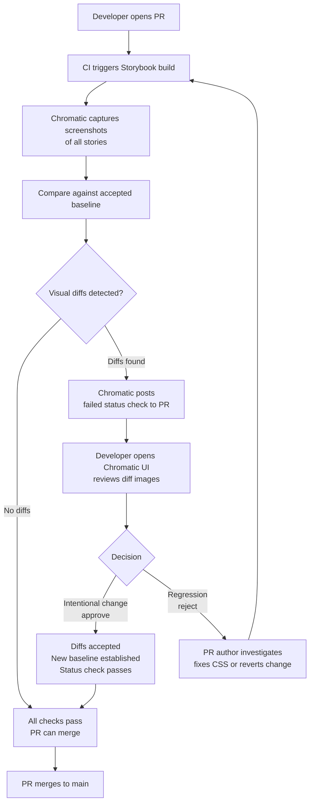

# Visual Regression Testing

## Context

Visual regression testing catches unintended UI changes by comparing screenshots. The process is straightforward: capture a baseline screenshot of a component or page in a known-good state, then capture a new screenshot on every subsequent build. A pixel diff algorithm compares the two images. If the difference exceeds a configured threshold, the test fails and a human reviews the diff to decide whether the change is intentional (an approved design update) or a regression (a broken layout that slipped through code review).

The core insight is that a screenshot is the most faithful representation of what the user actually sees. A Jest component test checks the DOM tree. A TypeScript compiler checks types. A linter checks style. None of them see rendered fonts, computed CSS cascade, GPU-composited layers, or pixel-level layout. A screenshot sees all of it.

Four tools dominate the space:

**Playwright screenshots + pixelmatch** — Playwright can capture full-page or element-level screenshots with `page.screenshot()` or via `toMatchSnapshot()`. Pixelmatch is a pure Node.js library that computes a pixel diff and returns a mismatch percentage. This combination is fully open source, runs entirely on your infrastructure, and gives you complete control over thresholds, masking, and comparison logic. The tradeoff is that you own the baseline storage, the CI diffing pipeline, and the review workflow.

**Storybook + Chromatic** — Chromatic (by the Storybook team) is a cloud service that captures screenshots of every Storybook story on every commit, diffs them against the previous baseline, and presents a UI review interface where developers approve or reject changes. It integrates directly with GitHub, GitLab, and Bitbucket pull request status checks. Chromatic is the dominant approach for design system teams because Storybook stories are already isolated, reproducible component fixtures — the screenshots capture exactly the component in isolation, with no surrounding page noise. Chromatic charges per snapshot per month.

**Percy** — BrowserStack's visual testing cloud. Functionally similar to Chromatic: it integrates with CI, captures screenshots, diffs against baseline, and provides an approval UI. Percy supports a wider range of rendering targets including non-Storybook pages and static site generators. It is the more common choice for teams that want visual testing across full pages rather than isolated components.

**Backstop.js** — Open source, configuration-driven visual regression tool. You define scenarios in a `backstop.json` config file: URLs, viewports, selectors to capture, interaction scripts (click, scroll, hover before capture). Backstop uses Puppeteer or Playwright internally and renders screenshots in a Docker container to eliminate cross-machine rendering variance. The output is a self-contained HTML report with diff images. Backstop is the open source alternative when Chromatic/Percy costs are not justified.

## Design Thinking

### Why visual regression catches what unit tests miss

A React component test with React Testing Library verifies that the correct DOM nodes are rendered with the correct text content, ARIA roles, and event handlers. This is valuable. But the test does not verify:

- A CSS specificity conflict that causes a button's background color to render as transparent
- A `z-index` miscalculation that places a dropdown behind a sticky header
- A wrong `font-weight` in a design token update that makes body text render as bold
- A margin collapse that causes two sections to visually merge
- A CSS `overflow: hidden` that clips the last item in a list

All of these break the visual UI. None of them fail a DOM-based test. The component still renders. The text is still present. The ARIA roles are still correct. The test is green, and the UI is broken.

Visual regression testing exists in the gap between "the DOM is correct" and "the UI looks correct." A screenshot sees everything that ends up on the screen, regardless of how many CSS layers, inherited properties, and browser rendering heuristics produced it.

This is also why visual regression tests are not a replacement for unit or component tests. They are complementary. A unit test tells you why something broke. A visual diff tells you that something is broken and shows you exactly what it looks like.

### Why Chromatic + Storybook is dominant for design systems

Design system teams already invest in Storybook stories as living documentation: each component variant (primary button, secondary button, disabled button, loading button) has a dedicated story. This investment produces a repository of isolated component fixtures as a side effect.

Chromatic turns this existing investment into a visual regression suite with zero additional test authoring. Every story becomes a test case. The screenshot is the story rendered in a headless browser; the diff is the comparison against the last approved baseline; the approval workflow is the PR review process.

The key architectural advantage is isolation. A Chromatic screenshot captures a single component against a white background with no page chrome, no navigation, no dynamic data. This eliminates an entire class of flakiness that full-page visual tests encounter: animated headers, lazy-loaded images, third-party widgets, and date-dependent content are all absent from a Storybook story.

The cost model is the honest tradeoff: Chromatic charges per snapshot. A design system with 200 components and 5 stories each is 1,000 snapshots per commit. On a team with 20 engineers making 5 commits per day, that is 100,000 snapshots per month. This cost is real and must be evaluated against the cost of catching visual regressions manually in review.

### Why visual testing is at the cost apex of the testing pyramid

The test pyramid establishes that tests should be abundant at the bottom (unit tests: fast, cheap, isolated) and sparse at the top (E2E tests: slow, expensive, coupled to the full system). Visual regression tests sit at or above E2E on the cost axis for several reasons:

**Speed.** A screenshot test takes 5–10 seconds per capture: browser launch, page render, CSS paint, screenshot, diff. A unit test takes 5–10 milliseconds. A visual test suite with 500 screenshots takes 45–80 minutes to run end to end.

**Money.** Cloud visual testing services charge per snapshot. Chromatic's pricing starts at roughly $149/month for 5,000 snapshots and scales from there. Percy's pricing is similar. These are ongoing, recurring operational costs that unit tests and component tests do not have.

**Human review time.** Every visual diff that exceeds the threshold requires a human to look at it and decide whether it is an intentional change or a regression. This is valuable — catching a real regression is worth the review time — but it is a labor cost that has no equivalent in automated unit testing.

For these reasons, visual regression testing is most justified when:

- **Design system components**: the cost of a visual regression in a button component is proportional to every surface in the product that uses it.
- **Critical marketing and landing pages**: conversion-critical pages with high traffic where a layout shift causes measurable revenue impact.
- **High-traffic UI with strong brand identity**: pages where visual consistency directly affects user trust.

Visual regression testing is typically overkill when:

- **Internal admin tools**: low traffic, no branding requirements, and fast iteration cycles make the overhead unjustifiable.
- **Forms with no styling requirements**: if the only requirement is that the form fields render and submit, DOM tests are sufficient.
- **Rapid-iteration prototypes**: baseline images become stale as fast as they are captured, and every change requires approval.

### The flakiness tradeoff

Pixel-perfect comparison is inherently fragile. The same component rendered on macOS with an M-series GPU and on Ubuntu on an x86 CI runner will produce slightly different anti-aliasing on text, slightly different subpixel rendering on borders, and potentially different font hinting. These differences are invisible to the human eye but register as hundreds of differing pixels in a pixel-perfect comparison.

The mitigations:

**Percentage threshold.** Most tools allow you to configure a threshold: allow up to N% of pixels to differ before failing. Playwright's `toMatchSnapshot` accepts `{ threshold: 0.1 }` (per-pixel color distance) and `{ maxDiffPixelRatio: 0.01 }` (1% of total pixels). Backstop accepts a `misMatchThreshold` per scenario. The tradeoff: a 2% threshold prevents false positives from anti-aliasing but can also allow a 2% genuine regression to pass unnoticed. Calibrate thresholds based on what subtle regressions look like on your specific components.

**Mask dynamic regions.** Any content that changes between renders — timestamps, user names, randomly generated IDs, ad banners, live data feeds — must be masked before comparison. Playwright allows you to evaluate JavaScript on the page to replace dynamic text with a static placeholder before taking the screenshot. Backstop supports `hideSelectors` and `removeSelectors` per scenario.

**Disable animations.** CSS animations and transitions cause screenshots taken at different moments to capture different visual states. The standard mitigation is to inject a CSS rule that sets all animation durations to 0ms before capturing. Chromatic provides `isChromatic()` — a runtime helper that returns `true` when running inside Chromatic — so Storybook stories can conditionally disable animations.

**Use a consistent rendering environment.** The most reliable mitigation for cross-machine variance is Docker: Backstop's recommended deployment runs Puppeteer inside a specific Docker image, guaranteeing identical font rendering, GPU stack, and browser version across developer machines and CI.

## Best Practices

**SCOPE SCREENSHOTS TO THE SPECIFIC COMPONENT OR ELEMENT, NOT THE FULL PAGE.** A full-page screenshot for a component test captures dynamic sidebars, cookie banners, and live data feeds that change between runs, producing false positives on every build. The Playwright `toMatchSnapshot` API accepts a locator scope so you can snapshot exactly the element under test. You MUST scope visual assertions to the smallest meaningful region, and SHOULD only expand scope to the full page for tests that explicitly verify page-level layout.

**GENERATE AND STORE ALL BASELINES FROM CI, NEVER FROM A DEVELOPER'S LOCAL MACHINE.** Playwright's official documentation states that browser rendering varies by OS, GPU, power source, and headless mode, making locally-generated baselines permanently inconsistent with CI-rendered screenshots. Baselines MUST be generated in the same environment where they will be compared; a policy of only committing baselines produced by CI eliminates an entire class of false positives caused by cross-machine rendering variance.

**DISABLE ALL CSS ANIMATIONS AND TRANSITIONS BEFORE CAPTURING SCREENSHOTS.** A rotating spinner or any CSS `animation`/`transition` running at capture time produces a different screenshot on every run because the frame captured depends on timing. You MUST inject `animation-duration: 0ms !important; transition-duration: 0ms !important` before any visual capture, or use `isChromatic()` in Storybook stories to conditionally disable animations when running inside Chromatic.

**CALIBRATE PIXEL DIFFERENCE THRESHOLDS PER COMPONENT TYPE RATHER THAN SETTING A SINGLE GLOBAL VALUE.** A threshold of zero pixel differences will fail constantly on anti-aliased text edges; a threshold too high will allow genuine layout regressions to pass silently. Start with `maxDiffPixelRatio: 0.01` (1% of total pixels) as a baseline, then tune per component: text-heavy components SHOULD use a looser threshold than solid-color blocks because font hinting introduces more natural variance.

## Visual

### Chromatic Workflow



## Example

### 1. Playwright screenshot test with `toMatchSnapshot`

Playwright's built-in snapshot testing stores baseline PNG files alongside the test file on the first run and compares on subsequent runs.

```ts
// tests/visual/button.spec.ts
import { test, expect } from '@playwright/test'

test('primary button renders correctly', async ({ page }) => {
  await page.goto('/components/button?variant=primary')

  // Scope to the component, not the full page
  const button = page.locator('[data-testid="primary-button"]')

  await expect(button).toMatchSnapshot('primary-button.png', {
    // Allow up to 0.1 color distance per pixel (0–1 scale)
    threshold: 0.1,
    // Allow up to 1% of total pixels to differ
    maxDiffPixelRatio: 0.01,
  })
})

test('button states: hover and focus', async ({ page }) => {
  await page.goto('/components/button?variant=primary')

  const button = page.locator('[data-testid="primary-button"]')

  // Hover state
  await button.hover()
  await expect(button).toMatchSnapshot('primary-button-hover.png', {
    threshold: 0.1,
  })

  // Focus state via keyboard
  await page.keyboard.press('Tab')
  await expect(button).toMatchSnapshot('primary-button-focus.png', {
    threshold: 0.1,
  })
})
```

Run `playwright test --update-snapshots` to generate the initial baselines. Commit the PNG files to version control alongside the tests. On subsequent runs, `playwright test` compares the current render against the stored baselines.

### 2. Storybook story with Chromatic setup

Install Chromatic and configure it to run on CI. Storybook stories require no changes — every story is automatically captured.

```bash
# Install the Chromatic CLI
pnpm add -D chromatic

# Run Chromatic (typically in CI, not locally)
# CHROMATIC_PROJECT_TOKEN is set as a CI secret
npx chromatic --project-token=$CHROMATIC_PROJECT_TOKEN
```

Inside a Storybook story, use `isChromatic()` to disable animations during capture:

```tsx
// src/components/Spinner/Spinner.stories.tsx
import type { Meta, StoryObj } from '@storybook/react'
import { isChromatic } from 'chromatic/isChromatic'
import { Spinner } from './Spinner'

const meta: Meta<typeof Spinner> = {
  title: 'Components/Spinner',
  component: Spinner,
}

export default meta
type Story = StoryObj<typeof Spinner>

export const Default: Story = {
  args: {
    size: 'md',
    label: 'Loading...',
  },
  decorators: [
    (Story) => (
      // Freeze all animations when running inside Chromatic
      // so the screenshot captures a stable frame
      <div style={{ animation: isChromatic() ? 'none' : undefined }}>
        <Story />
      </div>
    ),
  ],
}

export const Large: Story = {
  args: {
    size: 'lg',
    label: 'Processing...',
  },
}
```

Alternatively, inject a global CSS override in `.storybook/preview.ts`:

```ts
// .storybook/preview.ts
import { isChromatic } from 'chromatic/isChromatic'
import type { Preview } from '@storybook/react'

const preview: Preview = {
  decorators: [
    (Story) => {
      if (isChromatic()) {
        // Inject a style tag that disables all animations globally
        const style = document.createElement('style')
        style.textContent = `
          *, *::before, *::after {
            animation-duration: 0ms !important;
            transition-duration: 0ms !important;
          }
        `
        document.head.appendChild(style)
      }
      return <Story />
    },
  ],
}

export default preview
```

### 3. Backstop.js config snippet

Backstop is configured via `backstop.json`. Define viewports, scenarios (URLs and selectors to capture), and per-scenario thresholds.

```json
{
  "id": "marketing_site",
  "viewports": [
    { "label": "mobile", "width": 375, "height": 812 },
    { "label": "tablet", "width": 768, "height": 1024 },
    { "label": "desktop", "width": 1440, "height": 900 }
  ],
  "scenarios": [
    {
      "label": "Homepage hero",
      "url": "http://localhost:3000/",
      "selectors": ["#hero"],
      "misMatchThreshold": 0.5,
      "requireSameDimensions": true
    },
    {
      "label": "Pricing table",
      "url": "http://localhost:3000/pricing",
      "selectors": [".pricing-grid"],
      "misMatchThreshold": 0.2,
      "hideSelectors": [".live-chat-widget"],
      "removeSelectors": ["[data-testid='cookie-banner']"]
    },
    {
      "label": "Navigation — open state",
      "url": "http://localhost:3000/",
      "selectors": ["nav"],
      "clickSelector": "[aria-label='Open menu']",
      "postInteractionWait": 300,
      "misMatchThreshold": 0.5
    }
  ],
  "paths": {
    "bitmaps_reference": "backstop_data/bitmaps_reference",
    "bitmaps_test": "backstop_data/bitmaps_test",
    "html_report": "backstop_data/html_report"
  },
  "engine": "playwright",
  "engineOptions": {
    "args": ["--no-sandbox"]
  },
  "dockerCommandTemplate": "docker run --rm -i --mount type=bind,source={cwd},target=/src backstopjs/backstopjs:{version} {backstopCommand} {args}"
}
```

Run the reference capture once: `npx backstop reference`. Then on every subsequent build: `npx backstop test`. The HTML report at `backstop_data/html_report/index.html` shows side-by-side reference and test images with the diff overlaid.

### 4. Masking dynamic content in Playwright

Any content that changes between renders must be replaced with a stable placeholder before the screenshot is captured. Playwright lets you evaluate JavaScript in the page context to manipulate the DOM directly.

```ts
// tests/visual/dashboard.spec.ts
import { test, expect } from '@playwright/test'

test('dashboard layout is stable', async ({ page }) => {
  await page.goto('/dashboard')

  // Wait for the dashboard to finish loading
  await page.waitForSelector('[data-testid="dashboard-content"]')

  // Replace timestamps with a static string
  await page.locator('[data-testid="last-updated"]').evaluate(
    (el) => { el.textContent = '2024-01-01 00:00:00' }
  )

  // Replace user-specific greeting
  await page.locator('[data-testid="greeting"]').evaluate(
    (el) => { el.textContent = 'Hello, [User]' }
  )

  // Replace randomly generated avatar URLs with a placeholder color block
  await page.evaluate(() => {
    document.querySelectorAll('[data-testid="user-avatar"]').forEach((img) => {
      const placeholder = document.createElement('div')
      placeholder.style.cssText = 'width:40px;height:40px;background:#ccc;border-radius:50%'
      img.replaceWith(placeholder)
    })
  })

  // Mask entire regions using Playwright's built-in mask option
  // (renders a magenta box over the masked area in the screenshot)
  const activityFeed = page.locator('[data-testid="activity-feed"]')

  await expect(page).toMatchSnapshot('dashboard.png', {
    threshold: 0.1,
    mask: [activityFeed],
  })
})
```

The `mask` option in `toMatchSnapshot` is the cleanest approach when you want to exclude an entire region: Playwright overlays a solid magenta rectangle over the masked locator before diffing, so any content changes inside that region are invisible to the comparison.

## Common Mistakes

**Skipping the approval step after intentional design changes.** When a designer changes the primary button color, every screenshot test that includes a primary button will fail. The correct response is to approve those diffs in Chromatic (or update Backstop's reference images) and commit the new baselines. The wrong response is to increase the threshold to make the failures go away, which masks future regressions too.

**Adding visual regression testing to everything.** Not every component needs a screenshot test. Unit and component tests cover behavior; visual tests cover appearance. A utility hook has no appearance to test. An internal data table with no brand requirements does not justify the snapshot storage and review overhead. Apply visual testing where visual consistency is a product requirement, not a default for all components.

## Related FEEs

- [FEE-1100 Testing Strategies Overview](./1100.md) — the testing pyramid and where visual tests sit relative to unit, component, and E2E tests
- [FEE-1102 Component Testing with Storybook](./1102.md) — Storybook interaction tests, which complement Chromatic visual snapshots
- [FEE-1107 Testing Best Practices](./1107.md) — where visual regression fits in a balanced testing strategy and when to invest in it

## References

- [Playwright — Visual Comparisons](https://playwright.dev/docs/screenshots) — official Playwright documentation for `toMatchSnapshot`, `page.screenshot`, threshold options, and the mask API
- [Chromatic — Introduction](https://www.chromatic.com/docs/) — Chromatic's documentation covering setup, the UI review workflow, baseline management, and `isChromatic()` usage
- [Backstop.js — GitHub Repository and README](https://github.com/garris/BackstopJS) — configuration reference for scenarios, viewports, thresholds, and the Docker engine option
- [Gleb Bahmutov — "Visual Testing with Playwright"](https://glebbahmutov.com/blog/visual-testing-with-playwright/) — practical walkthrough of Playwright screenshot testing including dynamic content masking strategies
- [Storybook — Visual Testing](https://storybook.js.org/docs/writing-tests/visual-testing) — Storybook's own documentation on integrating visual testing tools including Chromatic and alternatives
