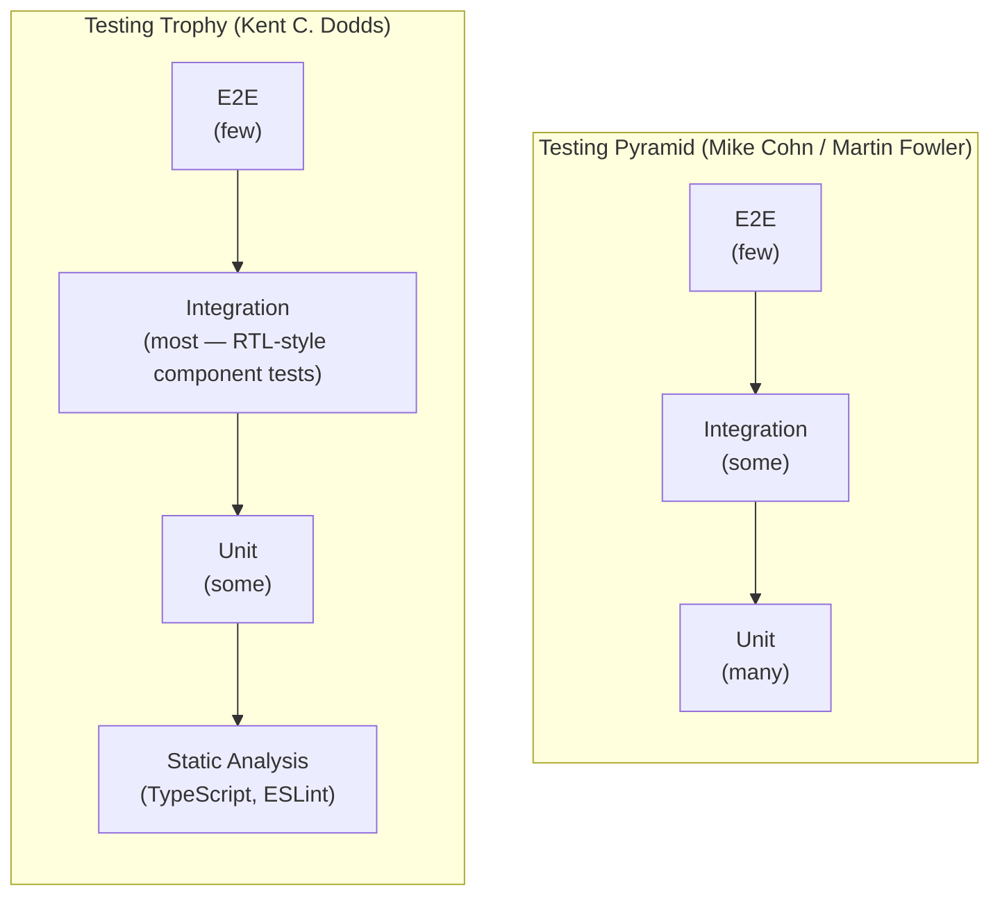

# [FEE-1107] Testing Philosophy: Coverage, Confidence & the Testing Pyramid

:::info
Coverage percentages measure whether code executed during a test run, not whether any test verified the result was correct. A suite can reach 100% line coverage while asserting nothing meaningful. This article separates the two dominant frontend testing mental models, the pyramid and the trophy, shows how mutation testing exposes gaps coverage cannot see, and lays out concrete rules for what to test, what to skip, and when a test suite is done.
:::

## Context

Every test suite eventually confronts the same question: how much testing is enough? The instinctive answer is "more," which leads teams to chase coverage percentages, mandate 80% line coverage as a CI gate, and eventually produce test suites that are large, slow, expensive to maintain, and do not actually prevent regressions. This article addresses the conceptual framework behind testing decisions: how to read coverage numbers honestly, what shape a test suite should take, how to detect gaps that coverage cannot find, and when to stop writing tests.

The testing pyramid and the testing trophy are the two dominant mental models in frontend testing discourse. The pyramid (Mike Cohn, popularized by Martin Fowler) prescribes many unit tests, fewer integration tests, and very few E2E tests. The shape is driven by economics: unit tests run in milliseconds with no infrastructure, while E2E tests spin up a real browser, navigate a running application, and take seconds each. The trophy, first sketched by Kent C. Dodds in a tweet on February 6, 2018, and elaborated in his 2021 "Testing Trophy and Testing Classifications" post, modifies this prescription for the frontend context specifically. Its largest layer is integration tests: component-level tests written with React Testing Library or a similar tool, chosen because they give the best confidence-per-cost for UI code. The pyramid and the trophy agree on the bottom (many fast, cheap unit tests) and the top (few expensive E2E tests), but diverge in the middle: for backend or library code, the pyramid's middle layer of integration tests is relatively small, while for frontend code, the trophy argues that middle layer should be the dominant investment. Two adjacent models address the same trade-off from different corners: Spotify's Testing Honeycomb (André Schaffer, 2018) reshapes the idea for microservice code with a heavier integration layer, and Google's "Just Say No to More End-to-End Tests" (Mike Wacker, 2015) is the canonical statement of the E2E-cost argument this article leans on throughout.

Coverage metrics (line, branch, and function coverage) report whether code was executed during a test run, not whether the tests made any meaningful assertions about the results. This distinction is the root of most confusion about coverage. A test that calls a function and asserts nothing can produce 100% line coverage while providing zero confidence. Coverage tells you what was reached; mutation testing tells you what was actually checked.

## Visual

### Testing pyramid vs. testing trophy



### Confidence vs. cost matrix

```mermaid
quadrantChart
    title Test type: confidence vs. cost
    x-axis Low Cost --> High Cost
    y-axis Low Confidence --> High Confidence
    quadrant-1 High value, budget carefully
    quadrant-2 Ideal zone
    quadrant-3 Low value, minimize
    quadrant-4 High value, invest here
    Static Analysis: [0.05, 0.45]
    Unit Tests: [0.15, 0.5]
    Integration (RTL): [0.4, 0.82]
    E2E (Playwright): [0.8, 0.9]
    Visual Regression: [0.88, 0.7]
```

## Example

### 1. The coverage trap: 100% line coverage that misses a bug

```ts
// math.ts
export function divide(a: number, b: number): number {
  return a / b
}
```

```ts
// math.test.ts — achieves 100% line coverage, misses division by zero
import { divide } from './math'

test('divides two numbers', () => {
  expect(divide(4, 2)).toBe(2)
})
// Line coverage: 100%. Branch coverage: 100%. Function coverage: 100%.
// But divide(10, 0) returns Infinity — never tested.
// divide(0, 0) returns NaN — never tested.
```

Mutation testing catches what coverage missed. Stryker creates a mutation that changes `a / b` to `a * b`, `a - b`, or `a + b`. With the input `divide(4, 2)`, the correct result is 2. The `a * b` mutant returns 8 and the `a + b` mutant returns 6, so both mutations are killed: the test fails and Stryker records the change as caught. The `a - b` mutant returns `4 - 2`, which is also 2, the same value the test expects, purely by coincidence. That mutant survives: the test suite cannot distinguish subtraction from division for this input, even though production division and production subtraction do very different things for most other inputs. Stryker flags the survivor as a gap.

A better test suite:

```ts
test('divides two positive numbers', () => {
  expect(divide(10, 2)).toBe(5)
})

test('returns Infinity when dividing by zero', () => {
  expect(divide(10, 0)).toBe(Infinity)
})

test('returns NaN for 0 divided by 0', () => {
  expect(divide(0, 0)).toBeNaN()
})

test('handles negative divisor', () => {
  expect(divide(10, -2)).toBe(-5)
})
```

This suite kills the arithmetic operator mutations because, unlike the coincidental `4 / 2` case above, none of these inputs produce a matching result under a different operator: `divide(10, 2)` alone already distinguishes `/` from `*`, `-`, and `+`, since it returns 5 only when the operator is actually division.

### 2. Stryker.js configuration and mutation report

Install and configure Stryker for a Vitest project:

```bash
pnpm add -D @stryker-mutator/core @stryker-mutator/vitest-runner
```

```js
// stryker.config.mjs
/** @type {import('@stryker-mutator/api/core').PartialStrykerOptions} */
export default {
  testRunner: 'vitest',
  // Only mutate application source, not tests or config
  mutate: ['src/**/*.ts', '!src/**/*.test.ts', '!src/**/*.spec.ts'],
  // Vitest runner options
  vitest: {
    configFile: 'vitest.config.ts',
  },
  // Reporters: progress in terminal, HTML report for detail
  reporters: ['progress', 'html'],
  // How to interpret results
  thresholds: {
    high: 80,    // >= 80% mutations killed: good
    low: 60,     // 60-79%: warning
    break: 50,   // < 50%: fail the CI step
  },
}
```

Run with: `npx stryker run`

Example report output (simplified). Stryker's mutation score is `(killed + timed-out) / total mutants`; a timed-out mutant counts as detected because a hang is itself a behavior change a test would notice:

```
Mutation testing report
=======================
Ran 47 mutants in 12.3 seconds

Killed:   38 (81%)
Survived:  7 (15%)
Timeout:   2 ( 4%)

Score: 85%

Survived mutations:
  src/utils/clamp.ts:4:18  EqualityOperator: `<` => `<=`
  src/utils/clamp.ts:5:18  EqualityOperator: `>` => `>=`
  src/api/auth.ts:22:3     ConditionalExpression: `status === 401` => `true`
  src/api/auth.ts:22:3     ConditionalExpression: `status === 401` => `false`
  ...
```

Each surviving mutation indicates a specific behavior gap. The `clamp.ts` survivors tell you the boundary conditions (`<=` vs `<`) are not tested. The `auth.ts` survivors tell you the 401 handling path is not verified by any assertion.

### 3. Over-specified test vs. well-specified test

An over-specified test couples to implementation details and breaks on harmless refactors:

```tsx
// BAD: tests internal structure, not user-visible behavior
test('LoginForm calls handleSubmit with email and password', () => {
  const handleSubmit = vi.fn()
  const { getByTestId } = render(<LoginForm onSubmit={handleSubmit} />)

  // Couples to internal test IDs that are implementation details
  fireEvent.change(getByTestId('email-input'), {
    target: { value: 'user@example.com' },
  })
  fireEvent.change(getByTestId('password-input'), {
    target: { value: 'secret' },
  })
  fireEvent.click(getByTestId('submit-button'))

  // Asserts on internal function call, not on what the user sees
  expect(handleSubmit).toHaveBeenCalledWith({
    email: 'user@example.com',
    password: 'secret',
  })
})
// If the developer renames data-testid="email-input" to data-testid="login-email",
// this test breaks — even though nothing about the form's behavior changed.
```

A well-specified test queries by accessible roles and asserts on observable outcomes. It uses Mock Service Worker (MSW) to intercept the login request at the network layer instead of mocking the component's internals; see [FEE-1104 Mocking, Stubs & Test Doubles](/en/Testing%20Strategies/1104) for the MSW setup this example assumes:

```tsx
// GOOD: tests what users experience, survives internal refactors
import { render, screen } from '@testing-library/react'
import userEvent from '@testing-library/user-event'
import { http, HttpResponse } from 'msw'
import { server } from '../mocks/server'
import { LoginForm } from './LoginForm'

test('submits credentials and redirects on success', async () => {
  const user = userEvent.setup()

  // Observe what the server receives — this is user-visible behavior
  let capturedBody: unknown
  server.use(
    http.post('/api/login', async ({ request }) => {
      capturedBody = await request.json()
      return HttpResponse.json({ token: 'abc123' })
    })
  )

  render(<LoginForm />)

  // Query by label text — works regardless of test IDs or element structure
  await user.type(screen.getByLabelText('Email'), 'user@example.com')
  await user.type(screen.getByLabelText('Password'), 'secret')
  await user.click(screen.getByRole('button', { name: /log in/i }))

  // Assert on what the user sees after success
  expect(await screen.findByText('Welcome back')).toBeInTheDocument()
  // Assert on the API contract — observable to the backend consumer
  expect(capturedBody).toEqual({ email: 'user@example.com', password: 'secret' })
})
```

This test survives renaming internal variables, restructuring the component's JSX, changing test IDs, and splitting the form into subcomponents, because it never touches any of those implementation details.

### 4. Vitest coverage configuration with thresholds

```ts
// vitest.config.ts
import { defineConfig } from 'vitest/config'

export default defineConfig({
  test: {
    coverage: {
      // Use V8 (fast, built into Node) or Istanbul (more detailed branch info)
      provider: 'v8',

      // Which files to measure coverage for
      include: ['src/**/*.{ts,tsx}'],
      exclude: [
        'src/**/*.test.{ts,tsx}',
        'src/**/*.stories.{ts,tsx}',
        'src/mocks/**',
        // Type-only files have no runtime behavior to cover
        'src/**/*.d.ts',
      ],

      // Reporters: text summary in terminal + lcov for CI coverage upload
      reporter: ['text', 'lcov', 'html'],

      // Thresholds: CI fails if coverage drops below these values.
      // These are sanity checks for "did we forget to test this file entirely",
      // NOT quality gates. Do not set them to 100%.
      thresholds: {
        // Global thresholds across all files
        lines: 75,
        functions: 75,
        branches: 65,   // Branch coverage is harder to achieve; set lower
        statements: 75,

        // Per-file thresholds: stricter for critical business logic
        perFile: false, // Enable to enforce thresholds per file instead of globally
      },
    },
  },
})
```

The branch threshold is intentionally set lower than line threshold. Branch coverage requires exercising both sides of every conditional, including error paths, boundary conditions, and optional chaining fallbacks. Achieving 65% branch coverage alongside 75% line coverage is realistic; requiring both at 80% typically produces tests of error paths that do nothing but execute the path without asserting the result.

## Best Practices

**VERIFY BEHAVIOR OBSERVABLE BY USERS OR MODULE CONSUMERS. NEVER TEST INTERNAL IMPLEMENTATION DETAILS.** A test that asserts on an internal state property, a private method, or a hook's return value accessed from outside the component is coupled to implementation choices that change on every refactor, even when the external behavior is identical. Tests MUST assert on what the user or caller observes: rendered text, ARIA state, API payloads, return values, not on the internal structure that produces those outputs.

**USE COVERAGE AS A GAP DETECTOR TO FIND UNTESTED CODE, NOT AS A QUALITY GATE TO CERTIFY TEST CORRECTNESS.** Coverage tells you which lines executed, not whether any assertion checked them. A practical CI threshold of 70–80% line coverage will flag files with zero tests without incentivizing assertion-free test padding. Coverage at 100% MUST NOT be interpreted as confidence in correctness; the productive question is always whether the tests would fail if a realistic bug were introduced into a covered line.

**RUN MUTATION TESTING ON CHANGED CODE, NOT THE WHOLE CODEBASE, TO FIND BEHAVIORAL GAPS COVERAGE CANNOT DETECT.** Mutation testing tools such as Stryker.js make small systematic changes to production code, flipping `>` to `>=`, replacing `+` with `-`, and report which mutations survive (no test noticed the change). Google's own rollout of mutation testing found that running full analysis across a large codebase does not scale, and settled instead on mutating only the lines changed in each code review (Petrović & Ivanković, ICSE-SEIP 2018). You SHOULD run Stryker.js in incremental mode (`npx stryker run --incremental`) against changed files rather than the full suite, to keep the cost manageable while maintaining high-signal feedback.

**DELETE BRITTLE TESTS RATHER THAN KEEPING THEM SKIPPED.** A test marked `.skip` is not a passing test: it is an ignored test that no longer verifies the behavior it was written for. A brittle test that breaks on harmless refactors trains engineers to ignore failures and erodes trust in the suite. You MUST either fix the brittleness (by testing observable behavior rather than implementation details) or delete the test and replace it with a well-specified one. A growing list of skipped tests is a sign of test suite rot that MUST be addressed.

## Design Thinking

### The pyramid vs. the trophy

The pyramid and the trophy calibrate the same trade-off for different codebases.

The pyramid addresses all software: it prescribes unit tests as the base because isolation and speed are universally valuable. For a backend service or a utility library, the middle layer of the pyramid (integration tests that verify module interactions) is moderately sized. For a frontend application built on React or Vue, most of the interesting behavior lives not in isolated pure functions but in the interaction between components, state, and the DOM. RTL-style integration tests exercise exactly that interaction. The trophy reflects this: it shifts the center of mass from many small unit tests of individual functions to integration tests that render a whole component tree and verify behavior the way a user would.

This is not merely aesthetic. An integration test for a `<LoginForm>` that verifies the component calls the API with the correct payload and displays an error when credentials are wrong catches a broader range of regressions than twenty unit tests of the individual helper functions inside that form. The helper functions might all work correctly in isolation while the component still fails because they are wired together incorrectly. The integration test catches that. The unit tests do not.

The trophy also explicitly includes static analysis (TypeScript, ESLint) as its base layer, a category the original pyramid omits. Static analysis is the cheapest possible feedback: it runs in milliseconds at edit time, requires no test runner, and catches a broad class of defects (wrong types, undefined variables, unused imports) before the application even starts. The bound on what it catches is real but narrower than intuition suggests: Gao, Bird, and Barr's study of open-source JavaScript bugs found that a static type checker would have caught about 15% of the bugs they examined (ICSE 2017).

### Why 100% coverage is a trap

Coverage measures execution paths, not correctness. Consider a function:

```ts
function clamp(value: number, min: number, max: number): number {
  if (value < min) return min
  if (value > max) return max
  return value
}
```

A single test, `expect(clamp(5, 0, 10)).toBe(5)`, achieves 100% line coverage of this function. All three lines executed. But the test says nothing about the boundary conditions: `clamp(0, 0, 10)`, `clamp(10, 0, 10)`, `clamp(-1, 0, 10)`, `clamp(11, 0, 10)`, or `clamp(NaN, 0, 10)`. A bug on any boundary would not be caught.

This is Goodhart's Law applied to testing: when a measure becomes a target, it ceases to be a good measure. When 80% line coverage is a CI gate, engineers write tests that execute code without asserting correctness, which is exactly what the metric was supposed to prevent.

Branch coverage is stricter than line coverage (it requires both sides of every `if` to be exercised), and function coverage tracks which functions were called at all. But all three metrics share the same fundamental limitation: they measure execution, not assertion correctness. A test can execute every branch of a function and assert only that the function did not throw. That test will show 100% branch coverage for a function that produces wrong results on most inputs.

Empirically, this is not a theoretical worry. Inozemtseva and Holmes measured coverage against fault-detection effectiveness across five large Java projects with 1,000+ tests each, and found that once suite size is controlled for, coverage is only weakly correlated with how many faults a suite actually catches (ICSE 2014).

### What coverage is good for

Despite this limitation, coverage is useful for one thing: identifying code that no test reaches at all. A function that has 0% line coverage has zero tests. That is actionable.

A practical policy: run coverage in CI as a sanity check for uncovered code, not as a quality gate. A threshold of 70–80% line coverage will flag files with zero tests while not incentivizing assertion-free test padding. Treat coverage drops as a signal to look for missing tests, not coverage increases as evidence of good tests.

### Mutation testing: finding the gaps coverage cannot see

Mutation testing operates on a different axis from coverage. Where coverage asks "was this line executed?", mutation testing asks "does any test actually verify what this line does?"

A mutation testing tool (Stryker.js for JavaScript and TypeScript) makes small, systematic modifications to the production code: changing `>` to `>=`, replacing `+` with `-`, removing a `return` statement. It then runs the test suite after each modification. If a mutation causes a test to fail, the mutation is "killed": at least one test noticed the change. If all tests pass despite the mutation, the mutation "survived": the test suite does not verify the behavior that this mutation altered.

Stryker reports this as a mutation score: `(killed + timed-out) / total mutants`. Mutation survival rate is its complement, the share of mutants no test caught. A function with 100% line coverage and a 30% mutation survival rate (a mutation score of 70%) has many surviving mutations: nearly a third of its behavior is unchecked by any assertion. A function with 60% line coverage and a 5% mutation survival rate (a mutation score of 95%) is well-tested within its covered paths.

Mutation testing is slow. It runs the full test suite once per mutation, so a file with 50 potential mutation points requires 50 test suite executions. It remains the highest-fidelity signal available for test quality.

### What to test and what to skip

Not everything should be tested directly. Testing the wrong things produces a test suite that is expensive to maintain and provides false confidence.

**Test:** behavior observable by users or consumers: what a component renders given specific inputs, what API calls a form submission triggers, what error states a fetch failure produces, what a pure function returns for a given input.

**Do not test:** third-party libraries. `lodash.debounce` is tested by lodash. React's event system is tested by the React team. Testing that `useState` updates state after calling the setter is testing React, not your code. The boundary to test is your code's use of the library, not the library's internal behavior.

**Do not test:** trivial getters and setters with no logic. A function that returns `this.name` does not need a unit test. If it is covered by integration tests that use the component containing it, that is sufficient.

**Do not test:** implementation details. Testing that a component calls a specific internal function, that a helper is invoked with specific arguments that are internal to the module, or that a class has a specific private method: these tests break whenever the implementation changes even when the behavior stays the same. They add maintenance cost without adding confidence.

**Do not test:** things already verified by static types. If TypeScript prevents a string from being passed where a number is required, you do not need a runtime test for that case. The type system caught it at edit time.

### The cost equation for tests

Every test has a cost: the time to write it initially, the time to maintain it when the implementation changes, and the CI time it consumes multiplied by the number of times CI runs. As a hypothetical: suppose a test takes 100ms and CI runs it roughly 5 times per PR, on a team that opens 10 PRs a day. Over a 2-year project (about 730 days), that is `100ms × 5 × 10 × 730 ≈ 1 hour` of cumulative CI time. Now suppose a slow E2E test takes 30 seconds under the same assumptions: `30s × 5 × 10 × 730 ≈ 304 hours`, roughly two weeks of continuous compute for a single test. Slow tests compound in CI cost in a way fast tests do not, which is why moving assertions down to the fastest layer that can still catch the bug pays off over a project's lifetime.

This cost must be weighed against the confidence the test provides. A test that detects real regressions regularly earns its cost. A test that never fails except when a developer is refactoring internals is consuming CI time and maintenance effort without delivering value.

The consequence is that deleting a test can be the right decision. A brittle test (one that fails on harmless refactors and requires constant maintenance to stay green) is worse than no test. It trains engineers to ignore failures ("it's probably just that flaky test again"), erodes trust in the suite, and consumes maintenance time. Delete it and write a better test that covers the same behavior without coupling to implementation details.

### Test suite health metrics

Three signals determine whether a test suite is functioning:

**Speed**, as a rough guide: a full suite that takes under 5 minutes tends to run on every PR. One that takes 30 minutes tends to get pushed to run before releases only. One that takes 2 hours tends to get skipped, and the suite rots as coverage drops and nobody fixes it.

**Reliability.** A suite whose failures are frequent enough that engineers stop trusting its red state is a suite whose real regressions get ignored along with the noise. Flaky tests (tests that fail without any code change) must be fixed immediately, not skipped with `test.skip` and forgotten. The scale of the problem is not hypothetical: Google reported that roughly 16% of its tests showed some level of flakiness and treats flakiness as a primary threat to suite reliability (John Micco, Google Testing Blog, 2016). A flaky test that is skipped provides zero value and occupies a slot in the test file that could hold a reliable test.

**Signal-to-noise ratio.** After a test failure, how quickly can an engineer identify the root cause? A test named `it('works')` that fails and outputs a 200-line diff requires investigation. A test named `it('displays an error banner when the API returns 401')` that fails and prints "Expected element with text 'Session expired' to be visible, but it was not" is self-documenting. Naming and assertion specificity directly affect how useful a failure is.

### "Write tests until fear becomes boredom"

Kent Beck's heuristic for when to stop writing tests, from *Test-Driven Development: By Example* (2002): write tests until fear is transformed into boredom. Applied to deployment, if you would be nervous merging a PR that changes the checkout flow without a test that runs the checkout flow, write that test. Once the test exists and passes, the fear should diminish. When adding another test catches nothing and you feel confident, you have enough tests for that surface. Kent C. Dodds's stopping-condition argument in "Write tests. Not too many. Mostly integration." builds on the same idea, applied specifically to the confidence a test suite provides for shipping frontend code.

This is a judgment-based heuristic, not a metric. It cannot be automated or enforced by a CI gate. In practice the stopping condition is concrete: every risky path you identified has a test that fails when that path breaks. Once that is true, adding more tests raises cost without raising confidence.

The heuristic also handles the other extreme: do not write tests until all fear is eliminated, because some fear is appropriate. Fear of a change that touches a 5,000-line file with no tests is rational; the correct response is to add tests for the paths you are about to touch, not to refuse to ship until you reach 100% coverage of the file.

### The shift-left principle

A widely repeated claim holds that a bug caught by a unit test costs some fixed multiple less to fix than one caught in production, usually stated as a `$1 / $10 / $100 / $1,000` ladder traced back to Barry Boehm's 1981 defect-cost curve (*Software Engineering Economics*, Prentice-Hall). Laurent Bossavit's *The Leprechauns of Software Engineering* followed the citation chain behind those numbers and found no primary study that ever measured them: the ladder is folklore repeated as if it were data, not an empirical finding.

The qualitative ordering survives the debunking even though the dollar figures do not. A unit-test failure points at one function seconds after the edit, with the code still open in the editor and the change still in short-term memory. A bug caught in production requires triage, reproduction, a fix, a deploy, and verification, often by an engineer who did not write the original change and has to reconstruct context first. That reconstruction cost, not a specific multiplier, is why catching defects earlier in the pipeline is cheaper. "Shift left" refers to moving the testing activity earlier on that timeline, where a defect is easiest to connect back to its cause.

## Common Mistakes

**Testing third-party library behavior.** Testing that `setTimeout` fires after a delay, that `fetch` sends a network request, or that React's `useState` updates state after a setter call is testing the environment, not your code. These tests add maintenance burden whenever the library updates its API without catching any regression in your code.

**Adding tests without removing the ones they supersede.** When a feature is rewritten, the old tests become tests of a deleted behavior. Leaving them in the suite produces false passing tests (they pass because the old code path still exists, even if it is no longer used) and inflates the suite's runtime. Treat deleting obsolete tests as part of completing a feature rewrite.

## Related Topics

- [FEE-1100 Testing Strategies Overview](/en/Testing%20Strategies/1100): the full category map and how this article fits within the testing progression
- [FEE-1101 Unit Testing with Vitest & Jest](/en/Testing%20Strategies/1101): coverage tooling and where unit tests fit in the pyramid
- [FEE-1102 Component Testing with Testing Library](/en/Testing%20Strategies/1102): RTL as the practical implementation of trophy-style integration testing
- [FEE-1103 End-to-End Testing: Playwright & Cypress](/en/Testing%20Strategies/1103): E2E placement at the top of both the pyramid and trophy
- [FEE-1104 Mocking, Stubs & Test Doubles](/en/Testing%20Strategies/1104): mock boundaries and how they affect what a test actually verifies, including the MSW setup used in this article's Example 3
- [FEE-1105 Test-Driven Development (TDD)](/en/Testing%20Strategies/1105): TDD and how writing tests first changes coverage organically
- [FEE-1106 Visual Regression Testing](/en/Testing%20Strategies/1106): visual regression placement above E2E on the cost axis

## References

- Kent C. Dodds, "The Testing Trophy and Testing Classifications," kentcdodds.com (2021). https://kentcdodds.com/blog/the-testing-trophy-and-testing-classifications
- Guillermo Rauch, "Write tests. Not too many. Mostly integration." (post), X/Twitter (2016). https://x.com/rauchg/status/807626710350839808
- Kent C. Dodds, "Write tests. Not too many. Mostly integration.," kentcdodds.com (2019). https://kentcdodds.com/blog/write-tests. Argues that integration tests give the best confidence-per-cost for frontend code; the title phrase originates with Rauch's tweet above.
- Kent Beck, "Test-Driven Development: By Example," Addison-Wesley (2002). https://www.oreilly.com/library/view/test-driven-development/0321146530/. Source of the "fear is transformed into boredom" stopping heuristic.
- Martin Fowler, "Test Pyramid," martinfowler.com (2012). https://martinfowler.com/bliki/TestPyramid.html
- André Schaffer, "Testing of Microservices," Spotify Engineering (2018). https://engineering.atspotify.com/2018/01/testing-of-microservices
- Mike Wacker, "Just Say No to More End-to-End Tests," Google Testing Blog (2015). https://testing.googleblog.com/2015/04/just-say-no-to-more-end-to-end-tests.html
- Stryker Mutator, "Documentation," stryker-mutator.io (accessed 2026). https://stryker-mutator.io/docs/. Covers configuration, mutation operators, reporters, and incremental mode (`--incremental`).
- Goran Petrović and Marko Ivanković, "State of Mutation Testing at Google," ICSE-SEIP (2018). https://research.google/pubs/state-of-mutation-testing-at-google/
- Lucia Inozemtseva and Reid Holmes, "Coverage Is Not Strongly Correlated with Test Suite Effectiveness," ICSE (2014). https://dl.acm.org/doi/10.1145/2568225.2568271
- Zheng Gao, Christian Bird, and Earl T. Barr, "To Type or Not to Type: Quantifying Detectable Bugs in JavaScript," ICSE (2017). https://discovery.ucl.ac.uk/id/eprint/10064729/
- John Micco, "Flaky Tests at Google and How We Mitigate Them," Google Testing Blog (2016). https://testing.googleblog.com/2016/05/flaky-tests-at-google-and-how-we.html
- Barry W. Boehm, "Software Engineering Economics," Prentice-Hall (1981). https://archive.org/details/softwareengineer0000boeh
- Laurent Bossavit, "The Leprechauns of Software Engineering," Leanpub (2015). https://leanpub.com/leprechauns
- "Goodhart's Law," Wikipedia (accessed 2026). https://en.wikipedia.org/wiki/Goodhart%27s_law. States "When a measure becomes a target, it ceases to be a good measure," the principle underlying why coverage mandates backfire.
