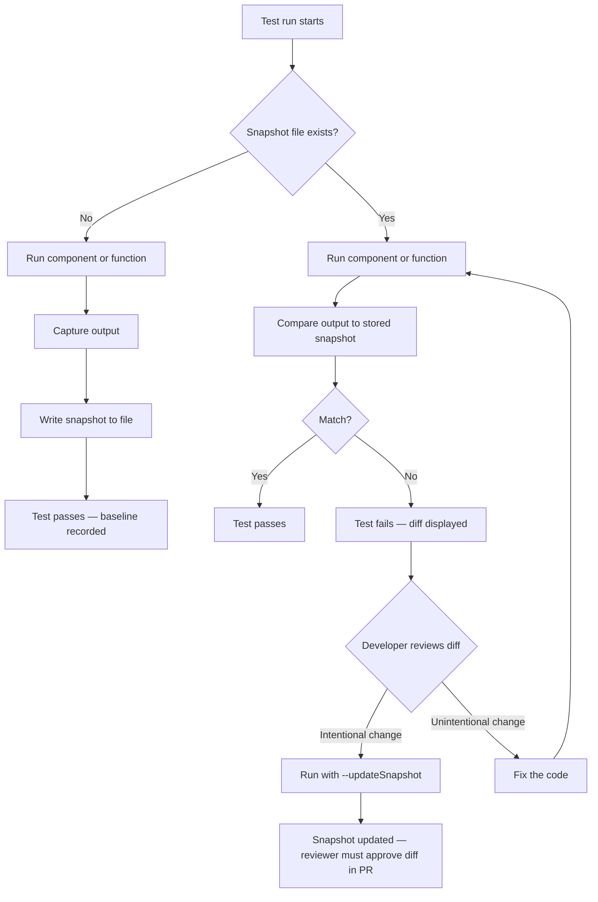

# Snapshot Testing

Snapshot testing captures the output of a component or function at a point in time and stores
it as a file. On subsequent test runs, the output is compared to the stored snapshot; a
difference fails the test. The promise is that snapshots catch unintended output changes
automatically, without requiring the developer to write explicit assertions for every property.

The reality is more nuanced. Snapshots are most useful for small, stable outputs — a serialized
configuration object, a short string transformation, a compact component with minimal markup.
They become liabilities for large outputs: a snapshot of a complex component's full DOM tree is
hundreds of lines long, meaningful diffs are buried in noise, and developers routinely update
snapshots automatically without reading them — which makes the test report "passing" while
catching nothing.

Snapshot testing is not a substitute for behavioral tests. A snapshot that captures
`<button className="btn-primary">Submit</button>` verifies that those exact bytes are produced;
it does not verify that clicking the button submits the form. The distinction matters because
snapshots fail on meaningless changes (a CSS class renamed, a whitespace formatting change) and
pass on meaningful failures (the button is non-functional but the markup is unchanged).

Understanding where snapshot testing genuinely helps requires understanding what kind of contract
it enforces. A snapshot enforces a byte-for-byte output contract. That contract is meaningful
when the exact output is the specification — when a change to the serialized form is, by
definition, a change that a human must review and approve. For pure functions with stable outputs,
configuration generators, and compact rendering utilities, this is precisely the right level of
constraint. For large, evolving components, it is a poor fit that creates noise and encourages
routine bypassing of the very review the test was meant to prompt.

## Design Thinking

### Inline vs. external snapshots

Inline snapshots (Jest's `toMatchInlineSnapshot()`) embed the snapshot directly in the test
file. External snapshots (`.snap` files) are stored alongside test files in a `__snapshots__`
directory. Inline snapshots are preferable for small outputs because they make the expected
output visible in the test without switching files. When a reviewer reads the test, they can
see both the code under test and its expected output in the same view, which dramatically
reduces the cognitive load of verifying that the snapshot is meaningful.

External snapshots are appropriate when the output is too large to embed inline without
obscuring the test logic. The threshold is roughly 20 to 30 lines of serialized output —
beyond that, an inline snapshot overwhelms the test file and the expected output becomes as
difficult to parse as the external file it was meant to replace. Vitest supports both patterns
identically, so the choice is purely about readability and the practical tradeoff between
visibility and file length.

The most important property of the inline pattern is that it puts the expected output in the
code review diff. When a snapshot changes, the reviewer sees the old output and the new output
side by side in the same file as the test assertion. This is the key advantage: snapshot diffs
in external `.snap` files are easy to skip over in code review; inline diffs in the test file
are harder to ignore because they appear alongside the test intent. The reviewer must actively
look past the expected output to read the rest of the test — which means they are very likely
to notice that the expected output changed.

There is a practical tooling consideration as well. Both Jest and Vitest automatically populate
inline snapshot values on the first run and automatically update them when `--updateSnapshot`
is passed. This means the developer never has to write the snapshot value by hand — they write
`toMatchInlineSnapshot()` with no argument, run the test once, and the tool fills in the
expected value. The workflow is identical to external snapshots, except the result is embedded
in the test file rather than a separate file. This removes any practical friction argument in
favor of external snapshots for small outputs.

Teams that have adopted the inline pattern consistently report that it increases snapshot review
quality. Reviewers who would previously approve `.snap` file changes without reading them find
it much harder to approve changes to a test file without noticing the embedded expected output
has changed. The layout of the file makes skipping the snapshot value cognitively difficult
because it sits between the function call and the closing parenthesis of the test, visually
demanding attention.

### Snapshot drift

Snapshots that are updated with `--updateSnapshot` without human review stop functioning as
tests. The developer sees "1 snapshot updated" in the CI log and the test "passes" — but the
snapshot now reflects the new (potentially incorrect) output. Code review of snapshot diff
files in pull requests is the only gate that reliably catches unreviewed snapshot updates.
Teams that treat `.snap` file changes as routine file changes that do not require review will
accumulate drifted snapshots over time.

Snapshot drift is insidious because it is invisible in aggregate metrics. The test count stays
the same, the pass rate stays at 100%, and coverage numbers are unaffected. The only signal is
in the code review history — the `.snap` files change regularly, and nobody questions whether
the new content is correct. This is the failure mode that makes snapshot testing controversial:
used carelessly, a large suite of snapshot tests provides a false sense of coverage while
catching almost nothing.

The organizational fix for snapshot drift is to treat `.snap` file changes as semantically
significant changes in code review, not as generated file updates to rubber-stamp. Many teams
enforce this with pull request templates that explicitly call out snapshot updates as requiring
extra attention, or by configuring diff tools to highlight changes to `.snap` files more
prominently. Some teams go further and require a comment explaining why a snapshot update is
correct whenever a `.snap` file is modified in a pull request.

Snapshot drift also accumulates through a subtler mechanism: a snapshot that was correct at the
time it was written stops being a useful specification as the component evolves. The original
snapshot captured a particular output that was meaningful when the test was first written. Over
time, the component's rendering logic changed — perhaps legitimately — and the snapshot was
updated to match. At no point did anyone verify that the new snapshot represents the component's
intended output rather than its accidental output. The snapshot is now a record of what the
component happens to do, not what it is supposed to do.

The root cause of most snapshot drift is organizational: teams adopt snapshot testing because it
requires less upfront thought than writing targeted assertions, and then discover that this
convenience comes with an ongoing maintenance obligation that is easy to defer. A snapshot suite
that is not regularly reviewed is a test suite that provides diminishing returns over time. The
discipline required to keep snapshots meaningful is in many ways comparable to the discipline
required to write good assertions in the first place — the difference is that the discipline for
snapshots is ongoing rather than front-loaded.

### When to delete a snapshot

If updating a snapshot requires no thought about whether the new output is correct, the snapshot
is not adding value. The question to ask before updating a snapshot is: "Does this new output
represent the correct behavior?" If the answer requires no thought — if the update is so routine
that the developer hits the update key without reading the diff — the test is not testing
anything meaningful. Delete it and replace it with a more targeted assertion, or remove the test
if the output has no behavioral significance.

The practical heuristic is to observe how often a snapshot is updated relative to how often the
underlying code changes for meaningful reasons. If a snapshot is updated every sprint because
the component's markup evolves rapidly, but nobody ever catches a bug via that snapshot, it is
adding maintenance cost without adding safety. A snapshot that has never caught a regression and
has been updated a dozen times is a candidate for deletion.

The replacement strategy depends on what the snapshot was meant to protect. If the intent was to
ensure that a particular attribute is rendered, replace the snapshot with
`expect(element.getAttribute('aria-label')).toBe(...)`. If the intent was to ensure that a
particular structure is rendered, replace with a query against the rendered DOM using semantic
selectors. Targeted assertions survive refactoring better than snapshots because they are tied
to behavior and semantics rather than exact serialized output.

Deleting a snapshot is not a failure of the testing strategy. It is a recognition that the test
was not providing the value that justified its maintenance cost. A smaller suite of meaningful
tests is worth more than a large suite of tests that are routinely bypassed. The goal of a test
suite is confidence, not count — and a snapshot that developers have learned to update without
thinking contributes neither to confidence nor to correctness.

When evaluating whether to delete a snapshot, it is also worth considering the population of
developers who will encounter it in the future. A snapshot of a complex component tree that a
new developer encounters for the first time creates an obligation: they must understand the
expected output before they can judge whether their change breaks anything meaningful. If the
snapshot is so large and complex that this judgment is impractical, the snapshot is imposing a
maintenance burden on future developers without providing a proportional benefit. Replacing it
with a set of smaller, targeted assertions is a kindness to future contributors.

### Component snapshots: what to snapshot

Prefer snapshotting specific elements or attributes rather than the full component tree.
Snapping a specific ARIA role output or a specific rendered attribute is more targeted than
snapping the entire component. `expect(screen.getByRole('button').outerHTML).toMatchInlineSnapshot(...)`
is more focused than `expect(container).toMatchSnapshot()`. Targeted snapshots produce narrower
diffs that are easier to review and less likely to contain noise from unrelated markup changes.

When the full component tree must be snapshotted — for example, to protect a complex rendering
contract between a parent and a set of child components — prefer to shallow-render or to render
a minimal fixture that isolates the relevant structure. Rendering a large component tree that
includes data fetching, context providers, and multiple layers of composition makes the snapshot
fragile to changes in any of those layers, not just the layer being tested. The result is a
snapshot that changes frequently for unrelated reasons and is updated without understanding why.

The most durable component snapshots are for components with minimal external dependencies:
pure presentational components, small utility components that accept all their data as props,
and components with stable, well-defined rendering contracts. The more a component's output
depends on external state, context, or side effects, the more likely the snapshot is to become
noisy and drift.

A useful mental model is to ask: "If this snapshot fails, will I immediately know whether the
change is correct or incorrect?" For a small, pure component with a clear rendering contract,
the answer is usually yes — the diff is narrow and the expected output is easy to reason about.
For a large, complex component with many dependencies, the answer is usually no — the diff is
wide, it contains noise from multiple sources, and correctly evaluating whether the new output
is correct requires reading through hundreds of lines of serialized HTML. If the answer is no,
the snapshot is not providing the rapid feedback that a good test should provide.

Snapshotting rendered output at the level of semantic units — individual ARIA landmarks, specific
interactive elements, known data-driven regions — rather than the whole page or component tree
produces snapshots that are meaningful even as the overall structure of the application evolves.
A snapshot of the output of `getByRole('navigation')` will survive refactoring of the page
layout that does not touch the navigation component; a snapshot of the entire page will not.

### Serialization and determinism

Snapshots must produce deterministic output. Components that include timestamps, random IDs, or
animation states will produce different snapshots on each run and will fail consistently. Mock or
fix non-deterministic values before snapshotting: use fixed dates, stable IDs, and ensure that
any component state that affects rendering is predictable.

Common sources of non-determinism in snapshots include: `Date.now()` or `new Date()` called in
render logic, `Math.random()` used to generate element IDs, CSS animation class names that
include frame counts or timestamps, and third-party libraries that embed version strings or build
hashes in their output. Each of these must be mocked at the test boundary before a snapshot can
be relied upon. Vitest and Jest both provide utilities for mocking timers and dates
(`vi.useFakeTimers()`, `jest.useFakeTimers()`) that eliminate the most common sources of
non-determinism.

A snapshot that fails intermittently due to non-determinism is worse than no snapshot at all.
Intermittently failing tests erode trust in the test suite — developers learn to re-run failing
tests hoping they pass on the next run, and a genuinely failing test is eventually ignored or
suppressed. Before committing any snapshot test, run it at least three times to verify that it
produces identical output on each run.

The determinism requirement also applies to third-party component libraries. Many UI libraries
include internal IDs, aria attributes generated from counters, or theme tokens that change with
library version upgrades. When snapshotting output that includes third-party rendered markup,
the snapshot will break on every library version upgrade even if the component's behavior and
appearance are unchanged. In these situations, prefer to snapshot only the parts of the output
that belong to the component under test — the attributes and structure that the component
directly controls — rather than the full subtree that includes third-party internals.

### Snapshot testing in CI

Snapshot tests interact with CI in a specific way that differs from other unit tests. When a
snapshot test fails in CI because the output has changed, the developer cannot update the
snapshot in CI — they must check out the branch locally, run `--updateSnapshot`, and commit the
updated `.snap` file. This workflow is intentional: it forces the developer to run the code
locally and review the diff before the update is committed. Teams that try to automate snapshot
updates in CI — for example, by running `--updateSnapshot` in a CI step and committing the
result — are removing the human review gate that makes snapshot testing valuable at all.

Pull request workflows for snapshot tests should ensure that `.snap` file changes are always
visible in the diff and always reviewed before merge. Some teams configure their repository to
require explicit approval for changes to `.snap` files using CODEOWNERS rules or similar
mechanisms. The goal is to make it structurally difficult to update a snapshot without at least
one reviewer having seen and approved the change to the expected output.

Running `vitest --ci` or `jest --ci` in CI mode prevents snapshots from being automatically
written or updated — if the snapshot does not exist or does not match, the test fails, and the
failure must be resolved in the local environment. This is the correct default for any CI
pipeline that includes snapshot tests. This configuration ensures that snapshot updates are
always deliberate developer actions, not automatic artifacts of the CI process.

### Choosing a snapshot serializer

Both Jest and Vitest support custom serializers that control how values are converted to snapshot
strings. The default serializer handles JavaScript primitives, objects, arrays, React elements
(via `jest-snapshot`), and DOM nodes. For specialized data structures — custom class instances,
complex configuration objects, or domain-specific data types — a custom serializer can produce
more readable and more stable snapshots.

A good custom serializer omits implementation details that are not part of the public contract.
For example, a serializer for a custom component class might omit internal `_private` properties
and include only the properties that represent the component's public rendering contract. This
makes snapshots narrower and more stable: they will not break when an internal implementation
detail changes, only when the public contract changes.

The tradeoff is that custom serializers add complexity to the test infrastructure. A team that
adds a custom serializer must maintain it as the data structures it serializes evolve. For most
projects, the built-in serializers plus the `jest-serializer-html` or similar packages for HTML
output are sufficient. Custom serializers are most valuable for projects with complex domain
objects that appear frequently in snapshot tests and where the default serialization produces
unstable or unreadable output.

## Best Practices

**SHOULD** use inline snapshots (`toMatchInlineSnapshot()`) for outputs under roughly 30 lines,
so the expected output is visible in the test file without switching to a `.snap` file. Inline
snapshots make test intent clear to code reviewers: they can see the expected output alongside
the test logic. External `.snap` files are appropriate for larger outputs, but require discipline
in review to ensure updates are intentional.

**MUST** review snapshot diff files in code review with the same care as test assertion changes.
A snapshot update in a `.snap` file is a change to the test's expected output. Treat
`__snapshots__/*.snap` changes with the same scrutiny as changes to `expect(...)` assertions.
A snapshot update that is not read and understood by a reviewer is a test that has stopped
functioning as a correctness check.

**SHOULD** delete snapshot tests for components whose snapshots are routinely updated without
review. A snapshot that is automatically updated every time a component changes provides no
protection; it inflates the number of "tests" without adding coverage. Replace it with an
assertion that captures the semantically meaningful part of the output, or remove it if the
output has no behavioral significance.

**MUST NOT** use snapshot tests to verify dynamic, user-driven behavior such as form submission
outcomes, event handler side effects, or state transitions driven by user interaction. These
behaviors require interaction-based tests using tools like Testing Library's `userEvent` or
Cypress. A snapshot can only verify what is rendered at a point in time; it cannot verify what
happens when a user acts on what is rendered.

**SHOULD** scope component snapshots to the smallest semantically meaningful unit rather than the
full rendered tree. Querying for a specific role or element with `screen.getByRole(...)` and
snapshotting its `outerHTML` produces a snapshot that is narrow, focused, and survives
refactoring of unrelated parts of the component. Full-tree snapshots are fragile because they
break on any change anywhere in the component hierarchy, regardless of whether the change is
relevant to the contract being tested.

**MUST NOT** commit snapshot tests that include non-deterministic values without first verifying
that those values are fully mocked or replaced with stable equivalents. Timestamps, random IDs,
and third-party version strings will cause snapshot tests to fail intermittently in CI, which
erodes trust in the entire test suite. Use `vi.useFakeTimers()` or `jest.useFakeTimers()` and
stable ID generators before any snapshot is committed.

## Visual



## Example

```js
import { formatCurrency } from './formatCurrency';

test('formats USD amount', () => {
  expect(formatCurrency(1234.5, 'USD', 'en-US')).toMatchInlineSnapshot(
    `"$1,234.50"`
  );
});

test('formats JPY amount (no decimals)', () => {
  expect(formatCurrency(1234, 'JPY', 'ja-JP')).toMatchInlineSnapshot(
    `"¥1,234"`
  );
});
```

## Common Mistakes

- Running `--updateSnapshot` without reviewing the diff — snapshots become a record of what
  the code does rather than what it should do.
- Snapshotting entire large component trees and accepting noisy diffs as routine — the snapshot
  stops functioning as a meaningful correctness check.
- Treating snapshot coverage as meaningful test coverage for behavioral correctness — snapshot
  tests verify output structure, not behavior or interaction.
- Including non-deterministic values (timestamps, random IDs) in snapshots without mocking them
  — the snapshot fails intermittently and erodes trust in the test suite.

## Related FEEs

- [FEE-1100 — Testing Strategies Overview](./1100.md)
- [FEE-1101 — Unit Testing with Vitest & Jest](./1101.md)
- [FEE-1107 — Testing Philosophy: Coverage, Confidence & the Testing Pyramid](./1107.md)

## References

- [Vitest: Snapshot Testing](https://vitest.dev/guide/snapshot)
- [Jest: Snapshot Testing](https://jestjs.io/docs/snapshot-testing)
- [Kent C. Dodds: Effective Snapshot Testing](https://kentcdodds.com/blog/effective-snapshot-testing)
