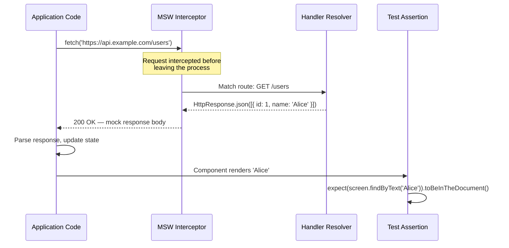

# API Mocking with MSW & Integration Testing

Integration tests verify that multiple units work correctly together — a component tree that
fetches data, renders it, and responds to user interaction. The challenge for integration tests
is the network: real API calls in tests are slow, unreliable, and impractical to cover
comprehensively. Error states, loading states, and edge cases require specific server responses
that are difficult to reliably produce from a real server, and waiting for network round-trips
in a test suite compounds feedback latency in ways that discourage developers from running tests
frequently.

Mock Service Worker (MSW) solves this by intercepting fetch and XHR requests at the service
worker or Node.js level, before the request leaves the process. Unlike jest-mock or module
mocking, MSW operates at the network boundary: the application code makes real `fetch()` calls;
MSW intercepts them and returns configured responses. This means the application's fetching
logic — request construction, response parsing, error handling — is exercised in tests, not
bypassed by mocks. The distinction is significant: module-level mocking of `fetch` replaces the
transport entirely, which means the code that constructs the request URL, sets headers, and
parses the response body is never called during the test.

MSW handlers are reusable: the same handlers that run in Jest/Vitest (via `setupServer`) can
run in Storybook (via `mswDecorator`) and in Playwright or Cypress end-to-end tests. This
consistency ensures that the mock data and error scenarios used in unit tests match those
available in component documentation and E2E tests. A team that defines its MSW handlers once
and reuses them across test environments, Storybook stories, and manual development sessions
discovers that the handlers become a shared vocabulary for describing the API's observable
behavior — a lightweight, executable specification of the API contract from the client's
perspective.

The architectural implication of this reuse is that handlers are worth investing in carefully.
A handler written quickly as a one-off for a single test will be copied into Storybook stories
and E2E test setups, carrying its assumptions into each context. Handlers that accurately
reflect the real API's shape — using the same response types, status codes, and error envelopes
that the actual server produces — pay a compounding return across every context in which they
are used. Handlers written carelessly propagate incorrect assumptions about the API just as
broadly.

Deriving handler response shapes from the same Zod schemas or TypeScript types used in
production code is the most reliable way to keep handlers synchronized with the real API.
A handler that constructs its JSON response by instantiating a typed fixture object — rather
than writing raw object literals — will fail to compile when the production type changes,
surfacing the mismatch at type-check time rather than at runtime when a test passes with a
stale response shape.
Teams that invest in typed handler fixtures discover that the fixtures also serve as canonical
examples of valid and invalid API responses, useful for documentation, onboarding, and manual
testing — the same data that powers automated tests powers every other use case that requires
a known-good API response.

## Design Thinking

### setupServer vs. setupWorker

MSW provides two distinct runtime environments for the same handler definitions. `setupServer`
runs in Node.js, using HTTP interception appropriate for Jest and Vitest test environments. It
intercepts requests at the Node.js level, requiring no browser context, and is the correct
choice for any test that runs in a Node.js process. `setupWorker` runs in the browser, using a
registered service worker to intercept requests, and is appropriate for Storybook, Playwright
tests that run in a real browser, and manual development sessions where the application runs in
a browser tab.

The architectural insight is that the same handler definitions are reused across both runtimes.
A handler written as `http.get('/api/users', () => HttpResponse.json([...]))` works identically
in `setupServer` for Jest tests and in `setupWorker` for Storybook. The only difference is
which runtime is instantiated — the handler code itself does not change. This is the fundamental
architectural advantage of MSW over module-level mocking: define once, use in unit tests,
integration tests, Storybook stories, and manual development without modification.

Teams that adopt MSW often find that the boundary between test fixtures and development fixtures
dissolves beneficially. Developers working on a new feature can start a development session with
MSW handlers that return the expected API response before the backend is ready, using the same
handlers they will use for integration tests. This workflow reduces the coupling between frontend
and backend development timelines and keeps the mock data consistent between development and
test contexts.

### Handler isolation between tests

Shared handler state is the most common source of test-order-dependent failures in MSW setups.
If a test overrides a handler for a specific scenario — a 500 error response, a specific user
shape, an empty list — and that override is not cleaned up, the next test inherits the override
and its behavior changes based on test ordering. MSW provides `server.resetHandlers()` to
restore the baseline handler set defined in `setupServer`, and `afterEach` is the correct
lifecycle hook in which to call it.

The recommended pattern is to define default handlers that cover the happy path in `beforeAll`
or in the `setupServer` call, and use `server.use()` at the per-test level for error states,
edge cases, and variations. Default handlers express the baseline contract: the API returns
well-formed data when things are working. Per-test overrides express deviations from that
baseline that are relevant to a specific test case. Structuring handlers this way makes it easy
to see what each test is actually testing — any `server.use()` call in a test is a signal that
the test is exercising non-baseline behavior.

Without `resetHandlers()` in `afterEach`, test suites become fragile in a specific way: they
pass when run in isolation or in the original order, but fail when run in a different order or
when a new test is added between two existing tests. This kind of failure is difficult to
diagnose because the test that fails is not the test that installed the problematic handler. The
reset discipline eliminates this category of failure entirely.

It is also possible to use `server.resetHandlers()` within a test — for example, to install a
handler for a specific request and then reset to the baseline before making a second request.
This pattern is useful for testing multi-step interactions where different requests should
receive different responses. The key invariant is that `resetHandlers()` in `afterEach` is
unconditional: it runs regardless of whether the test passed or failed, ensuring that a failed
test does not leave state that corrupts subsequent tests.

### MSW in Storybook

MSW's Storybook integration (`msw-storybook-addon`) enables API mocking per-story via story
parameters. A story that renders a user profile component can define an MSW handler that returns
a specific user object, making the story self-contained and independently previewable without a
running API server. The handler syntax is identical to the syntax used in Jest/Vitest integration
tests: the same `http.get` and `HttpResponse.json` calls that appear in test files appear in
story parameters.

This identity of syntax between test files and story files has a practical benefit: handlers can
be extracted into shared fixtures that both test files and story files import. A single file
defines the mock users, mock error responses, and mock edge cases; tests import the handlers they
need; stories import the same handlers. When the API contract changes, updating the handler
definitions in the shared fixture file propagates the update to all tests and stories that
import it, without requiring individual changes to each consumer.

Stories that include MSW handlers also serve as interactive documentation of the application's
error handling. A story named "Error state: 500 response" demonstrates what the component shows
when the server fails — a level of documentation that is difficult to achieve with a running
API server and much easier with MSW handlers. Designers, product managers, and QA engineers can
view error states in Storybook without needing to manually trigger server errors or manipulate
network conditions.

### GraphQL mocking

MSW supports GraphQL request matching via `graphql.query('QueryName', resolver)` and
`graphql.mutation('MutationName', resolver)`. GraphQL handlers work identically to REST handlers
and can be mixed in the same `setupServer` call. The `HttpResponse` and `graphql` utilities in
MSW v2 provide a consistent API across REST and GraphQL, so teams using both in the same
application define all their handlers in the same pattern.

GraphQL handler matching uses the operation name from the request, not the URL, which means the
handler for a `GetUsers` query matches any GraphQL request with that operation name regardless
of the endpoint URL. This is the correct behavior for most GraphQL clients, which send all
requests to a single endpoint and differentiate them by operation name. The resolver function
receives the request variables, allowing the response to vary based on what the client requested
— a handler for `GetUser` can return different user objects based on the `id` variable in the
request.

One difference from REST mocking worth noting is that GraphQL error handling conventions differ
from HTTP error conventions. A GraphQL error is typically returned as a 200 response with an
`errors` array in the body, not as a 4xx or 5xx status code. MSW's `graphql` handlers support
this pattern — the resolver can return a response with both `data` and `errors` fields, or only
`errors`, mirroring the GraphQL specification's error format. Integration tests for GraphQL
components should include handlers that return the `errors` array format to verify that the
application correctly distinguishes GraphQL errors from HTTP transport errors.

### Request verification

MSW handlers receive the request object, allowing assertions about what the application sent to
the server as part of the handler logic itself. A handler for a POST endpoint can inspect the
request body and return a 422 response with a validation error if the body does not contain
expected fields — which verifies both that the application sends the correct fields and that it
handles a 422 response correctly. This bidirectional testing is more complete than verifying
only that the response is consumed correctly.

Request verification can also take the form of extracting request data from the handler for
later assertion in the test. A handler that saves the request body to a variable that the test
can then assert on enables tests like: "verify that when the user submits the form, the correct
payload is sent to the API." This pattern is more explicit than inspecting the rendered output
for indirect evidence that the correct request was made, and it catches bugs where the API call
is made with incorrect data even when the component renders correctly afterward.

The request verification pattern scales to headers and query parameters as well. A handler can
check that the `Authorization` header is present and correctly formatted, returning a 401 if it
is not. A handler for a paginated endpoint can inspect the `page` and `limit` query parameters
and return the appropriate slice of mock data. These capabilities make MSW handlers suitable for
contract testing scenarios where both the request format and the response handling need to be
verified in the same test.

## Best Practices

**SHOULD** use MSW's `http.get`/`http.post` handlers (v2 API) with realistic response shapes
derived from the actual API contract. Handlers with realistic response shapes catch type
mismatches, missing fields, and incorrect assumptions about the API surface. Using the same
TypeScript types for handler responses as for the application's type definitions ensures
handlers remain in sync with the API contract and surface discrepancies as type errors during
development rather than as runtime failures in production.

**MUST** reset handlers in `afterEach` when using per-test handler overrides to prevent test
pollution. `server.resetHandlers()` in `afterEach` ensures that a handler override added for one
test does not bleed into subsequent tests. Without reset, test order determines behavior — a
characteristic of flaky tests that are difficult to diagnose because the failure appears in a
test that did not install the problematic handler, not in the test that did.

**MUST NOT** mock `fetch`, `axios`, or the HTTP client module at the module level as a
substitute for MSW. Module-level network mocks bypass the application's actual request
construction, header management, serialization, and response parsing code. Integration tests
that use module-level mocks are not testing the integration between the component and the
network layer — they are testing only the rendering behavior, with the network layer silently
omitted. This gap means that bugs in request construction are invisible to the integration test
suite.

**SHOULD** write at least one integration test per component that covers the error state for
every API call the component makes. Error states are the most commonly untested path in frontend
integration tests. A component that shows a spinner indefinitely when an API returns 500, or
that crashes when the API returns an unexpected shape, would be caught by an integration test
that includes an error-state handler. Writing a per-test `server.use()` override with
`HttpResponse.error()` or a specific error status is a low-effort addition that covers a
high-impact failure mode.

**SHOULD** extract shared handler definitions into fixture files that both test files and
Storybook stories import, rather than duplicating handler definitions inline in each test file.
Shared handler fixtures make it easier to update mock data when the API contract changes and
ensure that the data used in tests and the data displayed in stories remain consistent. Fixture
files are also a useful place to co-locate factory functions that generate handler responses with
specific variations, reducing duplication across tests that need slightly different response
shapes.

**MUST NOT** define MSW handlers that always return a successful response with hardcoded data
when the component under test is known to handle error conditions. A handler that never returns
an error is a handler that cannot be used to verify error-handling behavior. The handler
definitions for a component's integration tests should reflect the full range of responses that
the real API can return — including 400, 401, 403, 404, 422, 500 variants, and network-level
failures — because the component's behavior in each of those cases is part of its specification.

## Visual



## Example

```js
import { http, HttpResponse } from 'msw';
import { setupServer } from 'msw/node';
import { render, screen } from '@testing-library/react';
import { UserList } from './UserList';

const server = setupServer(
  http.get('/api/users', () => HttpResponse.json([{ id: 1, name: 'Alice' }]))
);

beforeAll(() => server.listen());
afterEach(() => server.resetHandlers());
afterAll(() => server.close());

test('renders users from API', async () => {
  render(<UserList />);
  expect(await screen.findByText('Alice')).toBeInTheDocument();
});

test('shows error message on API failure', async () => {
  server.use(http.get('/api/users', () => HttpResponse.error()));
  render(<UserList />);
  expect(await screen.findByRole('alert')).toHaveTextContent('Failed to load users');
});
```

## Common Mistakes

- Mocking `fetch` or `axios` at the module level instead of using MSW — the integration test
  no longer exercises the application's request construction, header setting, or response
  parsing logic, which are common sources of real bugs.
- Forgetting `server.resetHandlers()` in `afterEach` — per-test handler overrides bleed into
  subsequent tests, producing failures that appear in the wrong test and are difficult to trace.
- Defining only happy-path handlers and never adding error-state overrides — error handling is
  the most commonly untested path in frontend integration tests, and bugs in error handling are
  reliably invisible to a test suite that never triggers them.
- Using `server.close()` instead of `server.resetHandlers()` between tests — closing and
  reopening the server between tests is unnecessary overhead; `resetHandlers()` is the correct
  per-test cleanup primitive.
- Copying the same handler definitions into multiple test files and Storybook stories rather
  than extracting shared fixtures — duplicated handlers diverge silently when the API contract
  changes, causing tests and stories to use inconsistent mock data.

## Related FEEs

- [FEE-1100 — Testing Strategies Overview](./1100.md)
- [FEE-1102 — Component Testing with Testing Library](./1102.md)
- [FEE-1104 — Mocking, Stubs & Test Doubles](./1104.md)
- [FEE-403 — Fetch, Streams & Network APIs](../Web APIs & Browser/403.md)

## References

- [MSW documentation](https://mswjs.io/docs)
- [MSW: Getting started](https://mswjs.io/docs/getting-started)
- [msw-storybook-addon](https://storybook.js.org/addons/msw-storybook-addon)
