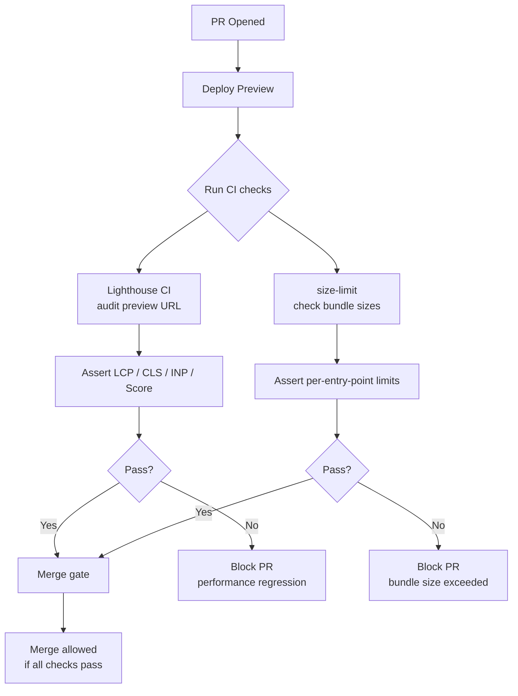

# Performance Testing in CI

Performance testing in CI catches regressions before they reach production. A feature that causes
LCP to increase from 1.2s to 2.8s, or a dependency update that adds 50kB to the JS bundle, is
visible in CI if performance budgets are configured as required checks. Without CI performance
gates, these regressions are discovered in production — after deployment, after user impact.

Lighthouse CI is the primary tool for automated Core Web Vitals measurement in CI pipelines. It
runs Lighthouse in a headless Chrome environment against a deployed preview URL (or a local
server), measures LCP, INP, CLS, FCP, and TTFB, and fails the CI check if any metric exceeds
configured thresholds. `bundlesize` and `size-limit` measure JavaScript and CSS bundle sizes
independently of Core Web Vitals.

The challenge with performance CI is environment variability: lab performance (Lighthouse CI in a
GitHub Actions runner) does not match field performance (real users on real devices). Performance
CI catches obvious regressions; it does not predict field performance precisely. The correct use
of performance CI is as a regression gate — if the score was 90 yesterday and is 55 today,
investigate — not as a precise measurement of user experience.

## Design Thinking

### Lighthouse CI setup

Lighthouse CI is configured via a `lighthouserc.js` file at the repository root. The configuration
specifies which URLs to audit, what assertions to evaluate, and where to upload the collected
results. A minimal configuration targets the deployed preview URL — whether that is a Vercel
preview, a Netlify deploy preview, or a staging environment spun up by the CI job itself — and
asserts a minimum performance score and maximum metric thresholds for LCP and CLS.

Running `lhci autorun` as a CI step handles the full lifecycle in a single command: it collects
Lighthouse reports for each configured URL, evaluates the configured assertions, and uploads the
results to the configured storage target. The autorun command eliminates the need to orchestrate
collect, assert, and upload steps separately, which reduces CI configuration complexity. When
assertions fail, `lhci autorun` exits with a non-zero status code, which causes the CI job to
fail and blocks the PR from merging.

Results can be stored in the Lighthouse CI server — an open-source Node.js server that persists
reports and serves a dashboard — or in Google Cloud Storage for simpler infrastructure. Storing
results is not required for per-PR gating (assertions alone are sufficient), but stored results
are required for trend monitoring. Without a persistent store, each CI run is evaluated in
isolation and gradual degradation across many PRs remains invisible. Teams that care about
performance trends as well as per-PR regressions SHOULD configure result storage from the outset,
because retrofitting it later requires re-baselining the trend history.
The decision about where to store results — self-hosted Lighthouse CI server versus Google Cloud Storage — is primarily an infrastructure maintenance concern: the self-hosted server requires a deployment and a database, while GCS storage requires a bucket and credentials but no additional server. For teams already using GCS for other infrastructure, the storage-only integration has lower operational overhead.
Either storage target enables the trend monitoring described in the Design Thinking section on trend monitoring versus per-PR gates; the choice of storage backend does not affect the analytical capability available once results are persisted.

The distinction between running Lighthouse against a deployed preview URL versus a locally served
build on the CI runner is significant for result quality. A local server on a GitHub Actions
runner does not simulate CDN delivery, HTTP/2 push, caching headers, or Brotli compression.
Preview deployments on Vercel or Netlify do simulate these characteristics because they are served
from the same infrastructure as production deployments. Where preview deployments are available,
they are the preferred target for Lighthouse CI audits.

The CI job that triggers `lhci autorun` should wait for the preview deployment to become healthy
before starting Lighthouse collection. Running audits against a deployment that is still warming
up or not yet fully propagated through CDN edge nodes produces unreliable results. Most CI
configurations achieve this with a deployment wait step — polling the preview URL until it returns
a successful HTTP response — before the Lighthouse CI step runs. A failed audit caused by an
unready deployment is harder to distinguish from a genuine regression than a correctly sequenced
audit that only runs once the preview is fully available.

### Performance budgets

Performance budgets come in three distinct types, each appropriate for a different concern.
Resource budgets constrain the total byte size of resources delivered to the browser — maximum
JavaScript bytes, maximum image bytes, maximum total page weight. Timing budgets constrain
measured page timing metrics — maximum LCP, maximum TTFB, maximum FCP. Metric budgets constrain
Lighthouse category scores — minimum performance score, minimum accessibility score.

Timing budgets are the most user-relevant because they directly measure the user's experience of
page load. However, timing budgets are also the most variable in CI environments: CPU throttling
behavior on CI runners is inconsistent, and the same page can produce LCP measurements that vary
by hundreds of milliseconds between runs on nominally identical infrastructure. This variability
means timing budget thresholds must include headroom above the expected value to avoid constant
false failures.

Resource budgets are more stable because they measure bytes on disk, not elapsed time. A
JavaScript bundle is deterministically the same size on every CI run. Resource budgets are also
more directly actionable: when a resource budget fails, the fix is clear — remove or reduce the
resource. When a timing budget fails, the cause must be diagnosed, which may involve profiling,
rendering analysis, and network waterfall inspection. For teams early in the process of
establishing performance CI, resource budgets provide a stable, actionable starting point. Timing
budgets add value as the team matures its performance engineering practice.

Lighthouse score budgets — minimum score thresholds — are a middle ground: they are somewhat
variable (because scores depend on timing measurements) but more stable than raw timing budgets
because Lighthouse's scoring formula normalizes across a range. A score threshold of 80 tolerates
some measurement variance while still catching large regressions.

Different budget types can be combined in a single Lighthouse CI configuration: a minimum
performance score of 80 alongside an explicit maximum LCP threshold of 2500ms covers both the
aggregate score and a specific metric of high user impact. Combining budget types reduces the
risk that a large regression in one metric is masked by improvements in others — the Lighthouse
scoring formula aggregates across many metrics, and a severe LCP regression can sometimes be
offset by improvements in other metrics while the total score stays above the minimum threshold.
Explicit metric thresholds ensure that each critical metric has an independent gate.

### size-limit

`size-limit` measures the compressed size of JavaScript and CSS build outputs and compares them
against configured limits. It is configured in `package.json` under the `size-limit` key,
specifying a path glob for each entry point and a maximum size in kilobytes. When `size-limit`
runs, it computes the gzip or Brotli compressed size of each matched artifact and reports the
current size, the change from the baseline (when run with the `--why` flag or via the GitHub
Actions integration), and whether the configured limit was exceeded.

The `size-limit/action` GitHub Action posts a comment on the PR diff with the size report for
each entry point. This surfaces size changes inline in the PR review flow, where they are visible
to reviewers without requiring them to look at CI logs. A PR that adds 40kB to the main bundle
will show that change in the PR comment, making the regression explicit and prompting discussion
before merge.

Configuring limits per entry point — main bundle, vendor chunk, route bundles, CSS — provides
targeted gates for the assets that matter to users on each page. A single total bundle size limit
allows individual entry points to grow as long as the total stays under the budget; per-entry
limits prevent any single entry from growing unchecked. The main bundle and the largest route
bundles are typically the highest-leverage targets for size budgets because they are on the
critical path for the most common user journeys.

Gzip and Brotli produce different compressed sizes for the same input; `size-limit` supports both
and defaults to gzip. Brotli produces smaller output than gzip for most JavaScript, so Brotli
limits are numerically lower than gzip limits for the same file. The choice of compression
algorithm should match what the production CDN delivers to browsers, so that the size-limit check
reflects the size that actual users download.

The `--why` flag in `size-limit` integrates with `webpack-bundle-analyzer` or `esbuild-bundle-
analyzer` to identify which modules contributed to a size increase. When a size-limit check fails,
running `size-limit --why` locally gives the engineer a breakdown of the bundle composition,
making it straightforward to identify whether the increase came from a new dependency, a larger
imported module, or a missing code-splitting configuration. This diagnostic capability makes
size-limit failures actionable in a way that a raw file size comparison does not.

### Baseline management

Setting initial performance budgets requires measuring the current state of the application before
configuring any limits. Budgets set against aspirational targets that the application does not
currently meet fail immediately, creating pressure to disable them before they are ever useful.
The correct approach is to measure the current performance of the production build, set initial
budgets at values the application currently satisfies (or nearly satisfies), and tighten them
incrementally as the team makes improvements.

The risk of budgets set too tight is constant CI failures caused by measurement variance rather
than real regressions. A timing budget threshold that is only 50ms above the typical measured LCP
will fail regularly due to CI runner variability, producing alert fatigue and pressure to widen
the threshold or disable the check. Thresholds should be set to catch regressions of a magnitude
that would be perceptible to users: a 10% increase in LCP is perceptible to users; a 1% variance
is within measurement noise and not worth gating on.

The risk of budgets set too loose is that meaningful regressions are not caught. A Lighthouse
score budget of 50 on an application that currently scores 90 would miss a regression to 55. The
correct threshold is far enough below the current measured value to tolerate CI variance but close
enough to catch regressions that users would notice. For most timing metrics, a threshold 15–20%
below the current measured value in a stable CI environment provides a useful balance between
false-positive tolerance and regression sensitivity.

Budgets should be revisited after performance improvements. An application that improves its LCP
from 2.5s to 1.8s should tighten its LCP budget accordingly — a budget of 2.4s is no longer
useful as a regression gate after the improvement, because a regression to 2.4s would be a
significant degradation from the new baseline. Incrementally tightening budgets after improvements
is how performance CI becomes progressively more demanding over time.

Budget configuration should be version-controlled alongside the codebase. The `lighthouserc.js`
file and the `size-limit` configuration in `package.json` are code artifacts that express the
team's performance expectations. Storing them in the repository ensures that the history of
budget changes is visible in git history — a budget that was tightened after a specific
optimization is traceable to the commit that made the optimization. Changes to budgets that
relax a threshold should require the same code review scrutiny as any other configuration
change, because relaxing a budget represents a decision to accept worse performance.

### Trend monitoring vs. per-PR gates

Per-PR performance gates catch acute regressions — a single PR that causes a large drop in a
Lighthouse score or a large increase in bundle size. These are the most common use case for
performance CI, and per-PR gates are the correct starting point. However, per-PR gates have a
structural blind spot: they compare the PR branch to the merge target, which means they catch
only regressions introduced in that PR, not cumulative degradation that has accumulated across
many small changes.

Trend monitoring addresses this blind spot by storing Lighthouse CI results over time and
analyzing them as a time series. A Lighthouse performance score that drops from 90 to 88 on each
of ten consecutive PRs is invisible to per-PR gates — each individual drop is within measurement
variance — but the cumulative drop from 90 to 70 is clearly visible as a trend in stored results.
The Lighthouse CI server and Google Cloud Storage integrations enable this trend visibility by
persisting results across CI runs.

The combination of per-PR gates and trend monitoring covers both acute regressions and gradual
degradation. Per-PR gates provide the fast, automated feedback loop that blocks regressions before
merge. Trend monitoring provides the longer-horizon view that identifies performance drift before
it becomes a significant problem. Teams that invest in both obtain a complete picture of their
application's performance trajectory rather than only a snapshot at each PR boundary.

The Lighthouse CI dashboard, when connected to a persistent result store, presents trend charts
for each metric across every CI run. These charts make the direction of travel visible: a score
that has been declining for six weeks is apparent from the trend chart even if no single PR failed
a per-PR gate. When a trend chart shows consistent downward movement, the team can investigate
what categories of changes have been landing during that period and correlate them with the
performance trajectory. This investigative use of trend data is qualitatively different from
per-PR gating and addresses a distinct class of performance quality problem.

## Best Practices

**SHOULD** configure Lighthouse CI to run against preview deployments, not against localhost, for
more representative performance measurements. A local server on a GitHub Actions runner may have
different network and CPU characteristics than a deployed CDN. Preview deployments on Vercel or
Netlify reflect production serving conditions — CDN delivery, compression, caching — and produce
more representative Lighthouse scores that correlate better with real user experience.

**MUST** configure size budgets per entry point, not as a single total bundle size. A single total
budget allows any individual route to grow without limit as long as the total stays under budget.
Per-entry-point budgets — main bundle, route bundles, CSS — provide targeted gates for the sizes
that matter to users on each page. When a per-entry budget is exceeded, the failing entry point is
immediately identified, making the regression actionable without requiring further investigation.

**MUST NOT** set performance budget thresholds at aspirational targets that the application does
not currently meet. Budgets that fail immediately on the baseline build generate pressure to
disable them before they catch any real regression. Initial thresholds should be set at values the
application currently satisfies, then tightened incrementally as improvements are made.

**SHOULD** store Lighthouse CI results over time and monitor trends in addition to per-PR gates.
Per-PR gates catch acute regressions. Trend monitoring catches gradual degradation — scores that
drift downward across multiple PRs are invisible to per-PR checks but visible as a trend in stored
results. Configuring result storage from the outset costs little and enables trend analysis that
retrospectively retrofitting would require re-baselining.

## Visual



## Example

```js
module.exports = {
  ci: {
    collect: {
      url: ['https://preview.example.com', 'https://preview.example.com/about'],
    },
    assert: {
      assertions: {
        'categories:performance': ['warn', { minScore: 0.8 }],
        'categories:accessibility': ['error', { minScore: 0.9 }],
        'first-contentful-paint': ['error', { maxNumericValue: 2000 }],
        'largest-contentful-paint': ['error', { maxNumericValue: 2500 }],
        'cumulative-layout-shift': ['error', { maxNumericValue: 0.1 }],
      },
    },
  },
};
```

## Common Mistakes

- Running Lighthouse CI against `localhost` on the CI runner rather than a deployed preview URL —
  local servers do not simulate CDN delivery, compression, or caching, producing scores that are
  not representative of production performance and may not reproduce locally.
- Setting a single total bundle size budget rather than per-entry-point limits — a total budget
  allows individual routes to grow unchecked as long as the total stays under the threshold,
  defeating the purpose of the gate for any individual page's loading performance.
- Setting initial budget thresholds at aspirational targets rather than current measured values —
  budgets that fail on the baseline build create pressure to disable them before they catch any
  real regression.
- Treating performance CI scores as exact measurements of user experience rather than as
  regression gates — CI lab measurements vary from run to run and from field performance; a
  Lighthouse score of 82 in CI does not mean real users experience an 82 score.
- Skipping result storage for Lighthouse CI because per-PR gates seem sufficient — without stored
  results, gradual degradation across many PRs accumulates invisibly, and the trend is only
  apparent after significant regression has already occurred.

## Related FEEs

- [FEE-1100 — Testing Strategies Overview](./1100.md)
- [FEE-704 — Core Web Vitals & Performance Metrics](../Performance/704.md)
- [FEE-1502 — Build Pipelines: Lint, Type-Check, Test & Build](../Build & Tooling/1502.md)
- [FEE-807 — Build Optimization: Minification, Caching & Output Analysis](../Build & Tooling/807.md)

## References

- [Lighthouse CI](https://github.com/GoogleChrome/lighthouse-ci)
- [size-limit](https://github.com/ai/size-limit)
- [web.dev: Lighthouse CI](https://web.dev/articles/lighthouse-ci)
