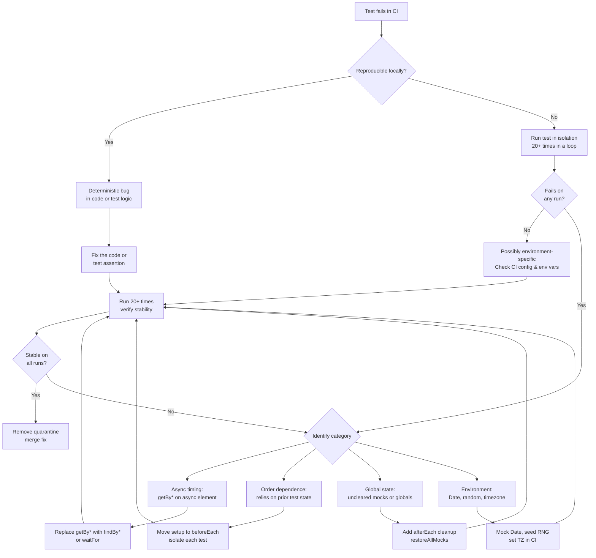

# Diagnosing & Fixing Flaky Tests

A flaky test passes on some runs and fails on others, without any change to the code under test.
Flaky tests erode trust in the test suite — when developers see a failing test, their first
assumption is "it's probably flaky" rather than "the code is broken." This erosion is cumulative:
as the proportion of flaky tests grows, developers begin ignoring test failures, defeating the
test suite's purpose.

Most flaky tests fall into one of several categories: async timing issues (a test that does not
wait long enough for an async operation to complete), test order dependence (a test that passes
only because a previous test set up state it depends on), environment flakiness (a test that
produces different results in CI vs. locally due to different CPU speed, timezone, or random
seeds), and shared resource contention (two parallel tests modifying the same global variable or
shared state).

The correct response to a flaky test is root-cause diagnosis, not retry. Retrying a flaky test in
CI may hide the failure from the build report, but the flakiness remains and will surface again —
perhaps at a less convenient time, or masking a real failure. Quarantining the test while
diagnosing is the responsible intermediate step.

## Design Thinking

### Async timing flakiness

The most common source of flakiness originates from tests that interact with elements or data
that appear after an asynchronous operation resolves. Tests that use `getBy*` queries from
Testing Library throw immediately if the queried element is not yet present in the DOM — there
is no waiting. When the test runs on a fast local machine where the component renders quickly,
this immediate query often succeeds by coincidence. When the same test runs in a slower CI
runner under CPU load, the element has not yet appeared when the query executes, and the test
throws.

The fix is to replace `getBy*` with `findBy*` for elements that appear asynchronously.
`findBy*` wraps the underlying `getBy*` query in a polling loop with a configurable timeout —
it retries the query at regular intervals until the element appears or the timeout expires. The
`waitFor` utility serves a similar purpose for assertions that are not element queries: it
accepts a callback and retries it until the callback stops throwing. Explicit `setTimeout`
delays inserted into tests to "give the component time to render" are the wrong approach —
they introduce an arbitrary delay that may still be too short under load, and they slow the
test suite unconditionally even when the async operation completes quickly. The correct pattern
is always event-driven waiting, not time-based waiting.

Configuring an appropriate default timeout for `findBy*` and `waitFor` at the test setup level
prevents both false failures (timeout too short on a loaded CI runner) and slow tests (timeout
too long, causing each failure to wait the full duration before reporting).
Testing Library's default timeout is 1000ms, which is adequate for most async operations on
modern hardware.
CI runners under high load may require a higher value — 2000ms is a common choice that
accommodates slow rendering without making individual test failures expensive to surface.
Setting the timeout globally in the Testing Library configuration (`configure({ asyncUtilTimeout: 2000 })`)
rather than per-query prevents the common mistake of applying a higher timeout to one query
while leaving other queries at the default, which produces inconsistent flakiness that manifests
only when some queries time out but not others.
The global setting also ensures that any future async queries added to the test suite inherit
the intentional timeout rather than silently using the default, which may no longer be
appropriate for the CI environment.

Symptoms of async timing flakiness are distinctive: the test passes locally and fails in CI,
the test reliably fails on CI runners under heavy load, and the failure message is a "unable
to find element" error rather than an assertion mismatch. These symptoms distinguish timing
flakiness from logic bugs, which would produce consistent failures regardless of environment.

A secondary pattern worth knowing: `waitFor` used correctly does retry its callback, but if
that callback contains a `getBy*` query inside it, earlier versions of Testing Library may
still surface the synchronous throw before `waitFor` can catch and retry it. The safest and
most idiomatic pattern is to use `findBy*` directly — it embeds the retry loop at the query
level rather than at the assertion level, producing clearer error messages when the element
genuinely never appears, and removing the need to reason about `waitFor`'s interaction with
synchronous throws. Reserve `waitFor` for cases where the assertion is not an element query
at all — for example, checking that a spy was called, or that a value in a store was updated.

### Test order dependence

A test that passes only when run after a specific other test is order-dependent. It relies on
state established by a prior test — a database record inserted, a global variable set, a
module side effect triggered — without establishing that state itself. The failure mode is
precise: the test passes in the full suite (where the prior test happens to run first) but
fails when run in isolation, or when the test runner changes the execution order.

Diagnosis is straightforward: run the suspected test in isolation using the test runner's
`--testNamePattern` flag (or equivalent). If the test fails in isolation but passes in the
full suite, it depends on state that another test established. The fix is equally direct:
move all state setup into a `beforeEach` hook so that each test establishes its own initial
conditions without depending on prior tests. Tests should be fully self-contained — each
test begins from a known starting state that it establishes itself, executes the behavior
under test, asserts on the result, and leaves no state behind for subsequent tests.

Teams that run tests in parallel across multiple workers should be especially vigilant about
order dependence, because parallel execution eliminates any determinism about which test
runs before which. A test that is order-dependent in serial mode will almost certainly become
flaky in parallel mode, and diagnosing it becomes harder because the order is non-deterministic
across runs.

A practical signal that points toward order dependence rather than other categories of flakiness:
the test failure is not a timing error and not an environment difference — the element exists,
the assertion is logically correct, but the data the test expects is absent because a prior
test was supposed to insert it. Another signal is that the failure is 100% consistent when
the test runs in isolation but 100% passing in the full suite. This level of consistency
differentiates order dependence from async timing issues, which typically show probabilistic
rather than deterministic failure patterns in isolation.

### Global state and shared resources

Tests that modify global state — `window.location`, global variables, fake timer
configurations, `localStorage`, cookies, global fetch mocks — without cleaning up after
themselves leave that modification in place for every subsequent test that runs in the same
process. The test that does the modification may pass perfectly. The tests that run after it
may fail because the global state is no longer what they expect.

The fix is disciplined use of `afterEach` cleanup hooks. `jest.restoreAllMocks()` and
`vi.restoreAllMocks()` restore all mocked functions to their original implementations.
`server.resetHandlers()` restores MSW request handlers to the baseline defined in
`server.use()`. Any global variable the test modified should be reset to its original value.
Any fake timers installed with `jest.useFakeTimers()` or `vi.useFakeTimers()` should be
uninstalled with the corresponding `useRealTimers()` call. The pattern is consistent: if a
test sets something up, an `afterEach` hook tears it down.

Shared resources in parallel test execution are a distinct but related problem. Two test
files running concurrently that both write to the same in-memory database, shared cache, or
global event emitter will produce race conditions. The solution is to scope shared resources
to the test file, not globally — each test file gets its own isolated instance of the
resource rather than sharing a singleton with other test files.

When diagnosing suspected global state contamination, a useful technique is to run only the
two test files — the one suspected to contaminate and the one suspected to be contaminated
— together, in the same worker, in that specific order. If the contaminated test fails and
passes when the contaminating test is excluded, the diagnosis is confirmed. Most test runners
support `--runInBand` (Jest) or `--pool=forks` with specific file targeting (Vitest) for
this purpose. Once confirmed, trace back through the contaminating test file to identify
which `afterEach` hook is missing, and add it.

### Environment differences

Tests that depend on values that vary across environments are inherently environment-sensitive.
`Date.now()` returns different values at different times. `Math.random()` returns different
values on each call. The system timezone affects date formatting. The system locale affects
number and date string representations. File system paths vary between developer machines
and CI runners. Tests that depend on any of these without controlling for them will produce
different results in different environments.

The fix is to eliminate environment-variable inputs by replacing them with controlled
substitutes. Mock `Date` to a fixed timestamp using `vi.setSystemTime()` or
`jest.setSystemTime()`. Seed random number generators explicitly rather than relying on the
default seed. Set a fixed timezone in CI via the `TZ` environment variable so that date
formatting is consistent. Use relative or configurable paths rather than absolute paths derived
from the developer's home directory. The goal is to make the test's behavior a function only
of its inputs, not of the environment in which it runs.

Environment differences also arise from configuration that is present locally but absent in
CI — a `.env.local` file with feature flags, a browser extension that modifies the DOM, or
a local hosts file entry. A test that passes locally because of an environment variable set
in `.env.local` and fails in CI because that file is not committed is environment-sensitive,
and the fix is to control the variable explicitly within the test rather than depending on
the environment to provide it.

The diagnostic signal for environment flakiness is that the test passes consistently in one
environment and fails consistently in another, with the failure being identical across runs
in the failing environment. This deterministic-across-environments but inconsistent-across-environments
pattern is the key differentiator: timing flakiness is non-deterministic within a single
environment, but environment flakiness produces consistent failures in the environment where
the missing or differing value is present. When a test fails in CI but passes locally on
every developer's machine, the investigation should start with environment variables,
timezone, and locale before considering other categories.

### Identifying flaky tests systematically

The most direct technique is to run the suspect test in isolation many times in a loop. If
a test is flaky, running it twenty or more consecutive times will almost always surface at
least one failure. The loop approach requires no tooling beyond the test runner's CLI and a
shell loop. A test that produces the same result on every one of twenty consecutive runs is
probably not flaky under normal conditions, though it may still be flaky under unusual load.

At the team level, CI analytics platforms provide a more systematic view. Buildkite Test
Analytics, GitHub Actions annotations, and Datadog CI Visibility all track test outcomes
across runs on the same commit. A test that produces different pass/fail results on the
same commit across multiple CI runs is definitively flaky, and these platforms surface it
automatically without requiring manual investigation. Integrating CI analytics into the
development workflow is the scalable approach to flaky test management — it provides an
always-updated list of flaky tests with historical failure rates, enabling the team to
prioritize fixes by impact rather than by whichever flaky test happened to cause a failure
today.

When a new test starts flaking, the first step is always isolation: determine which category
of flakiness applies (timing, order, environment, shared state) by running the test in
isolation, with and without mocks, and across different environments. The category determines
the fix. Attempting to fix a flaky test without first diagnosing the category usually produces
a different flaky test rather than a stable one.

Teams should track flaky test rates over time as a quality metric alongside coverage and
build duration. The target is zero known flaky tests in the main suite. A single flaky test is a diagnosable problem. A test suite where five percent
of tests are flaky is a systemic problem requiring a dedicated team effort to address —
likely by scheduling a flaky test sprint, fixing the highest-frequency flaky tests first,
and adding CI analytics to prevent new flaky tests from accumulating undetected. The compound
effect of accumulated flaky tests on developer productivity and release confidence is
substantial: developers who do not trust the test suite will not use it as a decision tool,
and releases without a trusted test suite are releases without a safety net. The investment in
diagnosing and fixing flaky tests pays compound returns: each fixed flaky test restores
one unit of developer trust in the suite as a whole.

## Best Practices

**MUST** use Testing Library's `findBy*` queries rather than `getBy*` queries for elements
that appear asynchronously. `findBy*` wraps `getBy*` in a polling loop with a configurable
timeout; it waits until the element appears rather than throwing immediately. Using `getBy*`
for async content is the most common source of async timing flakiness and produces failures
that are difficult to reproduce locally because they are load-dependent.

**MUST** clean up global state and mocks in `afterEach` hooks. Tests that leak state into
subsequent tests create order-dependent failures that are difficult to diagnose because they
only manifest when tests run in a specific order. `jest.restoreAllMocks()` or
`vi.restoreAllMocks()` restores mocked functions; `server.resetHandlers()` restores MSW
handlers; explicit teardown of any global modifications the test made ensures each test
starts from a known state.

**SHOULD** quarantine flaky tests with a tracking comment and issue reference rather than
deleting them or disabling them indefinitely without tracking. A disabled test with a comment
documenting why it was quarantined and a reference to an open issue is a tracked debt item
with accountability. A silently deleted test is a lost regression gate with no record of
what was lost.

**MUST NOT** configure CI to retry failing tests as a permanent policy to suppress flaky
test failures. Retry configuration increases CI execution time, reduces confidence in the
test suite by hiding real failures behind "this sometimes fails," and delays the diagnosis
that would fix the root cause.

## Visual



## Example

```js
// Flaky: getBy* throws immediately if element hasn't rendered yet
test('shows result after search', async () => {
  await userEvent.type(screen.getByRole('searchbox'), 'query');
  await userEvent.click(screen.getByRole('button', { name: 'Search' }));
  await waitFor(() => {
    expect(screen.getByText('Result 1')).toBeInTheDocument(); // may throw before element appears
  });
});

// Reliable: findBy* polls until element appears or timeout expires
test('shows result after search', async () => {
  await userEvent.type(screen.getByRole('searchbox'), 'query');
  await userEvent.click(screen.getByRole('button', { name: 'Search' }));
  expect(await screen.findByText('Result 1')).toBeInTheDocument(); // waits automatically
});
```

## Common Mistakes

- Using `waitFor` with a `getBy*` query inside instead of replacing `getBy*` with `findBy*` directly — `waitFor` retries the callback, but if the callback contains `getBy*`, the first failed query still throws synchronously before `waitFor` can catch and retry it in some versions of Testing Library.
- Installing fake timers in one test and forgetting to call `vi.useRealTimers()` or `jest.useRealTimers()` in `afterEach`, causing every subsequent test in the file to run with fake timers active and breaking any test that depends on real time-based async behavior.
- Treating a test that passes on the twentieth retry as "stable" — a test that fails one time in twenty is flaky; the retry loop is a diagnostic tool, not a stability threshold.
- Quarantining a flaky test without opening a tracking issue or adding a comment — a `.skip` with no explanation creates invisible debt with no owner and no path to resolution.
- Mocking `Date.now` at the module level rather than in `beforeEach`, causing the mock to persist across test files when the module cache is shared, which produces environment differences that vary by test file execution order.

## Related FEEs

- [FEE-1100 — Testing Strategies Overview](./1100.md)
- [FEE-1102 — Component Testing with Testing Library](./1102.md)
- [FEE-1109 — API Mocking with MSW & Integration Testing](./1109.md)
- [FEE-1107 — Testing Philosophy: Coverage, Confidence & the Testing Pyramid](./1107.md)

## References

- [Testing Library: Async utilities](https://testing-library.com/docs/dom-testing-library/api-async)
- [Google Testing Blog: Flaky tests](https://testing.googleblog.com/2020/12/test-flakiness-one-of-main-challenges.html)
- [Vitest: Test retries](https://vitest.dev/config/#retry)
