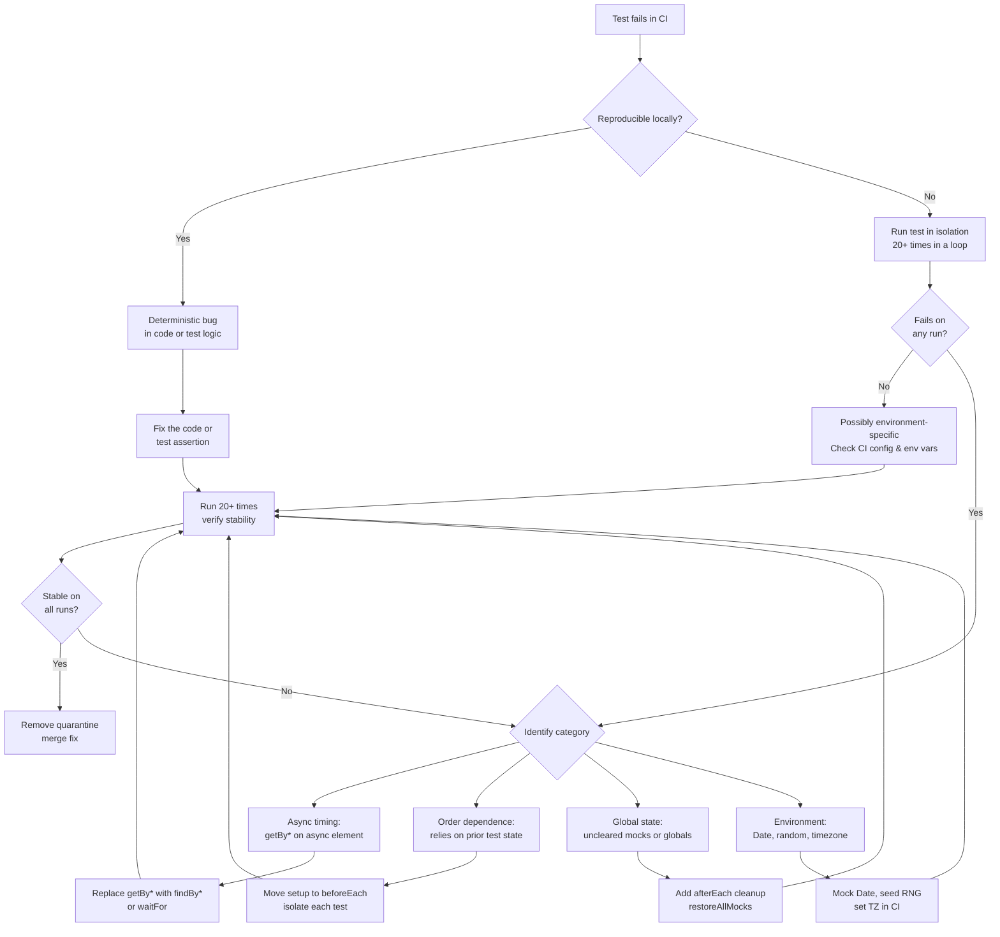

# Diagnosing & Fixing Flaky Tests

:::info
A flaky test passes on some runs and fails on others with no change to the code under test.
It is one of the fastest ways to erode trust in a suite: once a developer decides a failure is
"probably flaky," they stop reading failures altogether. This article covers flaky component
and unit tests built on Testing Library, Jest, Vitest, and Mock Service Worker (MSW);
end-to-end flakiness in tools like Playwright, which has its own diagnostic toolkit built
around auto-retrying assertions and trace capture, is out of scope. Most flakiness in this
scope traces to one of four causes: async timing, test order dependence, shared global state,
or environment differences. Each has a distinct diagnostic signal and a specific fix, and none
of the four is fixed by retrying the test until it passes.
:::

## Context

Flaky tests are a well-documented problem in large test suites. Google's testing team reported
in 2016 that roughly 1.5% of test runs across its internal monorepo produced flaky results,
enough that the team built automated quarantine tooling around it rather than triaging by hand.
The common response, when a test fails intermittently, is to retry it until it passes, either
by hand or through a CI retry setting. Retrying hides the failure from the build report, but the
underlying cause remains and resurfaces later, sometimes at a less convenient time, sometimes
masking a real regression. Quarantining the test (marking it known-flaky with a tracking issue,
not deleting it) is the responsible intermediate step while the root cause gets diagnosed.

## Visual



## Example

```js
// Flaky: getBy* throws immediately if the element hasn't rendered yet
test('shows result after search', async () => {
  await userEvent.type(screen.getByRole('searchbox'), 'query');
  await userEvent.click(screen.getByRole('button', { name: 'Search' }));
  expect(screen.getByText('Result 1')).toBeInTheDocument(); // throws before the result renders
});

// Reliable: findBy* polls until the element appears or the timeout expires
test('shows result after search', async () => {
  await userEvent.type(screen.getByRole('searchbox'), 'query');
  await userEvent.click(screen.getByRole('button', { name: 'Search' }));
  expect(await screen.findByText('Result 1')).toBeInTheDocument(); // waits automatically
});
```

`findBy*` queries wrap the equivalent `waitFor(() => getBy*(...))` call. Testing Library
maintainer Kent C. Dodds notes the two are functionally equivalent, but `findBy*` is more
concise and produces a clearer error message when the element never appears, so it's the query
to reach for by default.

## Best Practices

**MUST** use Testing Library's `findBy*` queries rather than `getBy*` queries for elements
that appear asynchronously. `findBy*` wraps `getBy*` in a polling loop with a configurable
timeout; it waits until the element appears rather than throwing immediately. Using `getBy*`
for async content is the most common source of async timing flakiness and produces failures
that are difficult to reproduce locally because they are load-dependent.

**MUST** clean up global state and mocks in `afterEach` hooks. Tests that leak state into
subsequent tests create order-dependent failures that are difficult to diagnose because they
only manifest when tests run in a specific order. `jest.restoreAllMocks()` or
`vi.restoreAllMocks()` restores mocked functions; `server.resetHandlers()` restores MSW
handlers; explicit teardown of any global modifications the test made ensures each test
starts from a known state.

**SHOULD** quarantine flaky tests with a tracking comment and issue reference rather than
deleting them or disabling them indefinitely without tracking. A disabled test with a comment
documenting why it was quarantined and a reference to an open issue is a tracked debt item
with accountability. A silently deleted test is a lost regression gate with no record of
what was lost.

**MUST NOT** configure CI to retry failing component or unit tests as a permanent policy to
suppress flaky failures. Blanket retry configuration increases CI execution time, hides real
failures behind "this sometimes fails," and delays the diagnosis that would fix the root
cause. Playwright's `retries` option paired with `trace: 'on-first-retry'` is a different
pattern: it reruns a failing end-to-end test once and captures a full trace on that retry,
purely to give a diagnostician evidence. The test still needs a real fix afterward.

## Design Thinking

The sections below walk through each of the four dominant causes of flakiness in this stack:
the diagnostic signal that identifies it, and the specific fix.

### Async timing flakiness

The most common source of flakiness comes from tests that interact with elements or data that
appear after an asynchronous operation resolves. Tests that use `getBy*` queries from Testing
Library (the `@testing-library/dom` family underlying React Testing Library, Vue Testing
Library, and similar packages) throw immediately if the queried element is not yet present in
the DOM. There is no waiting built in. On a fast local machine where the component renders
quickly, that immediate query often succeeds by coincidence. On a slower CI runner under CPU
load, the element has not yet appeared when the query executes, and the test throws.

The fix is to replace `getBy*` with `findBy*` for elements that appear asynchronously.
`findBy*` wraps the underlying `getBy*` query in a polling loop with a configurable timeout:
it retries the query at regular intervals until the element appears or the timeout expires.
The `waitFor` utility serves a similar purpose for assertions that are not element queries. It
accepts a callback and retries it until the callback stops throwing. Explicit `setTimeout`
delays inserted into tests to "give the component time to render" are the wrong approach. They
introduce an arbitrary delay that may still be too short under load, and they slow the test
suite unconditionally even when the async operation completes quickly. Wait on the specific
event (the element appearing, the spy firing) rather than on a fixed delay.

Configuring an appropriate default timeout for `findBy*` and `waitFor` at the test setup level
prevents both false failures (timeout too short on a loaded CI runner) and slow tests (timeout
too long, so each failure waits the full duration before reporting). Testing Library's default
`asyncUtilTimeout` is 1000ms, adequate for most async operations on modern hardware. CI
runners under high load sometimes need more headroom; 2000ms is a common choice that
accommodates slow rendering without making individual failures expensive to surface. Set the
timeout globally with `configure({ asyncUtilTimeout: 2000 })` rather than per query: this
prevents the common mistake of raising the timeout for one query while leaving others at the
default, which produces inconsistent flakiness that only shows up when some queries time out
and others don't. The global setting also ensures that any async queries added later inherit
the intentional timeout instead of silently falling back to a default that may no longer suit
the CI environment.

Symptoms of async timing flakiness are distinctive: the test passes locally and fails in CI,
the test reliably fails on CI runners under heavy load, and the failure message is a "unable
to find element" error rather than an assertion mismatch. These symptoms distinguish timing
flakiness from logic bugs, which would produce consistent failures regardless of environment.

A related point worth being precise about: `waitFor(() => screen.getByText(...))` is not
flaky. `waitFor` retries its callback until it stops throwing, so a synchronous throw from a
`getBy*` query inside it gets caught and retried like any other failing assertion. `findBy*`
is still the better default: it combines `getBy*` and `waitFor` into one call, so it's more
concise and, per Kent C. Dodds, produces a clearer error message when the element never
appears. Reserve `waitFor` for assertions that are not element queries, for example checking
that a spy was called or that a value in a store was updated.

### Test order dependence

A test that passes only when run after a specific other test is order-dependent. It relies on
state established by a prior test (a database record inserted, a global variable set, a module
side effect triggered) without establishing that state itself. The failure mode is precise:
the test passes in the full suite, where the prior test happens to run first, but fails when
run in isolation or when the test runner changes the execution order.

Diagnosis is straightforward: run the suspected test in isolation using the test runner's
`--testNamePattern` flag or equivalent. If the test fails in isolation but passes in the full
suite, it depends on state that another test established. The fix is equally direct: move all
state setup into a `beforeEach` hook so that each test establishes its own initial conditions
without depending on prior tests. Each test should be fully self-contained: it begins from a
known starting state that it establishes itself, executes the behavior under test, asserts on
the result, and leaves no state behind for subsequent tests.

Teams that run tests in parallel across multiple workers should be especially vigilant about
order dependence, because parallel execution eliminates any determinism about which test runs
before which. A test that is order-dependent in serial mode will almost certainly become
flaky in parallel mode, and diagnosing it becomes harder because the order is non-deterministic
across runs.

A practical signal that points toward order dependence rather than other categories of
flakiness: the test failure is not a timing error and not an environment difference. The
element exists and the assertion is logically correct, but the data the test expects is
absent because a prior test was supposed to insert it. Another signal is that the failure is
100% consistent when the test runs in isolation but 100% passing in the full suite. This level
of consistency differentiates order dependence from async timing issues, which typically show
probabilistic rather than deterministic failure patterns in isolation.

### Global state and shared resources

Tests that modify global state (`window.location`, global variables, fake timer
configurations, `localStorage`, cookies, global fetch mocks) without cleaning up after
themselves leave that modification in place for every subsequent test that runs in the same
process. The test that does the modification may pass perfectly. The tests that run after it
may fail because the global state is no longer what they expect.

The fix is disciplined use of `afterEach` cleanup hooks. `jest.restoreAllMocks()` and
`vi.restoreAllMocks()` restore all mocked functions to their original implementations.
`server.resetHandlers()` restores the request handlers for Mock Service Worker (MSW), the
library used to intercept and mock network requests in tests, back to the baseline defined in
`server.use()`. Any global variable the test modified should be reset to its original value.
Any fake timers installed with `jest.useFakeTimers()` or `vi.useFakeTimers()` should be
uninstalled with the corresponding `useRealTimers()` call. The pattern is consistent: if a
test sets something up, an `afterEach` hook tears it down.

Shared resources in parallel test execution are a distinct but related problem. Two test files
running concurrently that both write to the same in-memory database, shared cache, or global
event emitter will produce race conditions. The solution is to scope shared resources to the
test file, not globally: each test file gets its own isolated instance of the resource instead
of sharing a singleton with other test files.

When diagnosing suspected global state contamination, a useful technique is to run only the
two test files (the one suspected to contaminate and the one suspected to be contaminated)
together, in the same worker, in that specific order. If the contaminated test fails and
passes when the contaminating test is excluded, the diagnosis is confirmed. Most test runners
support `--runInBand` (Jest) or `--pool=forks` with specific file targeting (Vitest) for this
purpose. Once confirmed, trace back through the contaminating test file to identify which
`afterEach` hook is missing, and add it.

### Environment differences

Tests that depend on values that vary across environments are inherently environment-sensitive.
`Date.now()` returns different values at different times. `Math.random()` returns different
values on each call. The system timezone affects date formatting. The system locale affects
number and date string representations. File system paths vary between developer machines
and CI runners. Tests that depend on any of these without controlling for them will produce
different results in different environments.

The fix is to eliminate environment-variable inputs by replacing them with controlled
substitutes. Mock `Date` to a fixed timestamp using `vi.setSystemTime()` or
`jest.setSystemTime()`. Seed random number generators explicitly rather than relying on the
default seed. Set a fixed timezone in CI via the `TZ` environment variable so that date
formatting is consistent. Use relative or configurable paths rather than absolute paths
derived from the developer's home directory.

Environment differences also arise from configuration that is present locally but absent in
CI: a `.env.local` file with feature flags, a browser extension that modifies the DOM, or a
local hosts file entry. A test that passes locally because of an environment variable set in
`.env.local`, and fails in CI because that file is not committed, is environment-sensitive.
The fix is to control the variable explicitly within the test rather than depending on the
environment to provide it.

The diagnostic signal for environment flakiness is that the test passes consistently in one
environment and fails consistently in another, with the failure being identical across runs
in the failing environment. This deterministic-across-environments but inconsistent-across-environments
pattern is the key differentiator: timing flakiness is non-deterministic within a single
environment, but environment flakiness produces consistent failures in the environment where
the missing or differing value is present. When a test fails in CI but passes locally on
every developer's machine, the investigation should start with environment variables,
timezone, and locale before considering other categories.

### Identifying flaky tests systematically

The most direct technique is to run the suspect test in isolation many times in a loop. If a
test is flaky, running it twenty or more consecutive times will almost always surface at least
one failure. The loop approach requires no tooling beyond the test runner's CLI and a shell
loop. A test that produces the same result on every one of twenty consecutive runs is probably
not flaky under normal conditions, though it may still be flaky under unusual load.

At the team level, CI analytics platforms provide a more systematic view than manual isolation
loops. Tools built specifically for flaky-test tracking, such as Trunk Flaky Tests, Buildkite
Test Analytics, and Datadog's CI Visibility (now part of Datadog CI/CD Optimization), compare
outcomes for the same test across multiple runs on the same commit and flag any test that
flips between pass and fail. Native GitHub Actions has no equivalent built-in feature: its
annotations are per-run markers, capped per job, with no cross-run history, so teams relying
on GitHub Actions alone need one of these third-party tools to catch flakiness automatically
rather than by accident. Integrating a flaky-test tracker into the development workflow is the
scalable approach to flaky test management. It gives the team an always-updated list of flaky
tests with historical failure rates, so fixes can be prioritized by impact rather than by
whichever flaky test happened to break the build today.

When a new test starts flaking, the first step is always isolation: determine which category
of flakiness applies (timing, order, environment, shared state) by running the test in
isolation, with and without mocks, and across different environments. The category determines
the fix. Attempting to fix a flaky test without first diagnosing its category wastes the fix.
A longer timeout does nothing for a test that's failing because of leftover state from a
previous test.

Teams should track flaky test rates over time as a quality metric alongside coverage and
build duration. Google's testing team has reported roughly 1.5% of test runs across its
internal suite as flaky, enough that they built automated quarantine tooling rather than
relying on manual triage. There's no universal percentage that marks the line between "a few
tests to fix" and "a systemic problem." A more useful signal is behavioral: when developers
routinely re-run CI instead of investigating a failure, or a quarantine list keeps growing
faster than it shrinks, the problem has become systemic and needs a coordinated cleanup (a
dedicated sprint, fixing the highest-frequency offenders first, adding CI analytics to catch
new flakiness before it accumulates) rather than one-off fixes. Flaky tests compound:
developers who don't trust the suite stop using it as a decision tool, and a release built on
an untrusted test suite ships without the safety net the suite was supposed to provide.

## Common Mistakes

- Wrapping a `getBy*` query in `waitFor` instead of using the equivalent `findBy*`. The two
  are functionally equivalent, but `findBy*` is shorter and produces a clearer error message
  when the element never appears, so prefer it by default.
- Installing fake timers in one test and forgetting to call `vi.useRealTimers()` or
  `jest.useRealTimers()` in `afterEach`, causing every subsequent test in the file to run with
  fake timers active and breaking any test that depends on real time-based async behavior.
- Treating a test that passes on the twentieth retry as "stable." A test that fails once in
  twenty runs is still flaky. Running it repeatedly in a loop is how you find that failure; it
  does not change whether the test is stable.
- Quarantining a flaky test without opening a tracking issue or adding a comment. A `.skip`
  with no explanation creates invisible debt with no owner and no path to resolution.
- Mocking `Date.now` at the module level rather than in `beforeEach`, causing the mock to
  persist across test files when the module cache is shared, which produces environment
  differences that vary by test file execution order.

## Related Topics

- [FEE-1100: Testing Strategies Overview](/en/Testing%20Strategies/1100)
- [FEE-1102: Component Testing with Testing Library](/en/Testing%20Strategies/1102)
- [FEE-1109: API Mocking with MSW & Integration Testing](/en/Testing%20Strategies/1109)
- [FEE-1107: Testing Philosophy: Coverage, Confidence & the Testing Pyramid](/en/Testing%20Strategies/1107)

## References

- Testing Library, "Async Utilities," Testing Library docs. https://testing-library.com/docs/dom-testing-library/api-async
- Kent C. Dodds, "Common Mistakes with React Testing Library," kentcdodds.com (2020). https://kentcdodds.com/blog/common-mistakes-with-react-testing-library
- John Micco, "Flaky Tests at Google and How We Mitigate Them," Google Testing Blog (2016). https://testing.googleblog.com/2016/05/flaky-tests-at-google-and-how-we.html
- Playwright, "Test Retries," Playwright docs. https://playwright.dev/docs/test-retries
- Playwright, "Trace Viewer," Playwright docs. https://playwright.dev/docs/trace-viewer-intro
- Vitest, "Test Retry," Vitest config docs. https://vitest.dev/config/#retry
